# nacos

~~~
下载
docker pull nacos/nacos-server:v3.1.1

运行
docker run --rm --name nacos -e MODE=standalone -e NACOS_AUTH_ENABLE=false -e NACOS_AUTH_TOKEN=MjM1ZmU4NjAxMzU1NTQyYWU0MTEyYWU4ZDg3YTZiNGUK -e NACOS_AUTH_IDENTITY_KEY=nacos -e NACOS_AUTH_IDENTITY_VALUE=nacos -p 8848:8848 -p 9848:9848 -p 8088:8080 nacos/nacos-server:v3.1.1

控制台页面：http://127.0.0.1:8088
控制台登录username: nacos
控制台登录password: nacos
~~~

# 1

Token：处理的最小单位向量化：将 Token 映射为向量

> 为什么要将文字进行向量化
>
> * 语言大模型是属于计算机的一个处理，计算机是不认识文字的，只认识0和1，所有东西都要转换为0,1这些数字，语言大模型才能够进行处理
> * 向量包含了很多参数 
>   * 世界所有的物体，无论是文字、声音还是图片都可以转换为向量，而向量里的参数是包含了这个物体的一些突出特征，如果这些突出特征越多，也就是这个向量里面的参数越多，那么这个物体就越具体，对于语言大模型来说，那么这些向量都是存在于这个向量空间里面的，这些向量由于它们有各自独特的参数，因此这些向量在向量空间里面都有唯一的一个点去指向这个向量的，语言大模型的所有推理计算都是在向量空间里进行的。

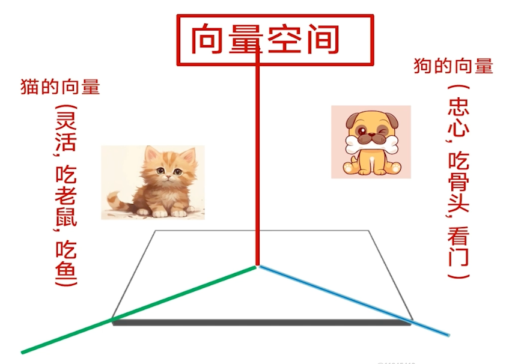 

#  transfer

Transformer层就是一步一步把用户输入的文字，然后推理出用户的真实意图。

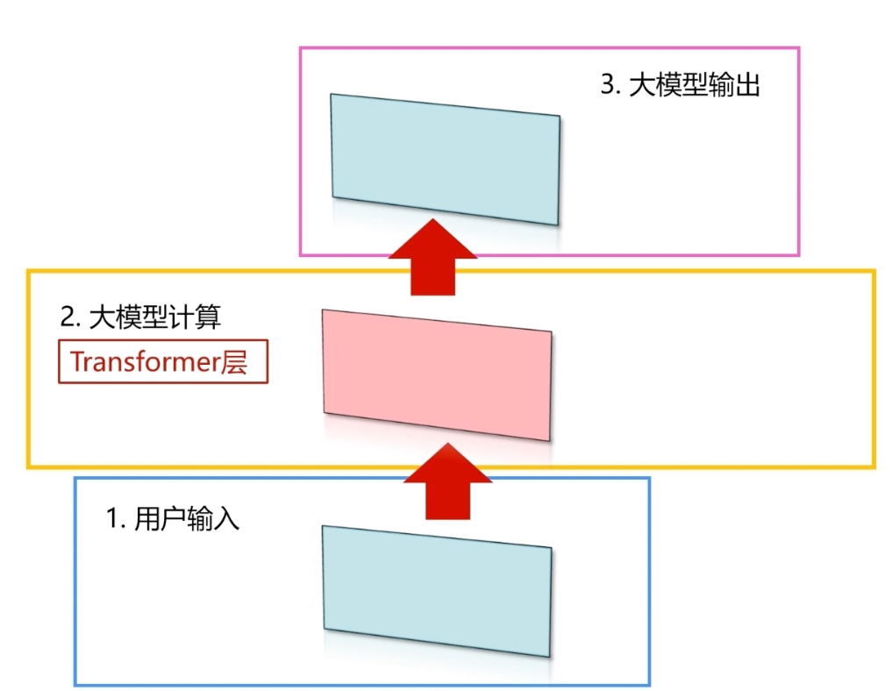 

Transformer层

> 背景：向量空间

Transformer 层的两大作用：

1. **词语组装**
2. **找出关键词语**（语义分析）

## vs面试官入局高薪Ai应用领域

1. 简答题：大模型的Transformer 架构核心由哪两个部分组成？各自的作用是什么？答案：核心由 ** 编码器（Encoder）和解码器（Decoder）** 两部分组成。编码器：负责理解输入文本，通过自注意力机制捕捉输入序列内部的依赖关系（比如一句话里的上下文关联），生成包含语义信息的特征表示。解码器：负责生成输出文本，结合编码器的特征和自身的自注意力、交叉注意力机制，一步步生成符合逻辑的目标序列（比如翻译后的句子、回答内容）。
2. 简答题：什么是自注意力机制？请用通俗的话解释它的作用。答案：自注意力机制是让模型在处理一个序列（比如一句话）时，自动关注序列中其他相关的词，从而更好地理解每个词的含义。举个通俗例子：当看到 “他喜欢打篮球，每天都玩它” 这句话时，自注意力机制能让模型知道 “它” 指的是 “篮球”，而不是其他事物。
3. 判断题：大模型的预训练 + 微调是一种主流的训练方法，其中预训练阶段是让模型学习特定任务的知识，微调阶段是让模型学习通用知识。这种说法对吗？请说明理由。答案：不对。预训练阶段：模型在海量通用文本数据上学习，掌握语言规律、常识等通用知识，比如认识词语、理解句子结构、知道基本的事实。微调阶段：用特定任务的小批量数据训练，让模型适配具体场景 **（如文本分类、问答）**，把通用能力转化为任务能力。
4. 简答题：多头注意力的 “多头” 是什么意思？它相比单头注意力有什么优势？答案：
   “多头”：就是把注意力机制拆分成多个独立的子注意力头，每个头会从不同角度捕捉序列中的关联信息。优势：单头注意力只能捕捉一种维度的关联，多头注意力可以同时关注不同位置、不同类型的依赖关系，让模型学到更丰富的语义特征，提升理解和生成能力。
5. 简答题：大模型架构中，**Feed-Forward Network（前馈神经网络）** 的作用是什么？答案：前馈神经网络是 Transformer 块里的重要组件，作用是对注意力机制输出的特征做进一步的加工和变换。它由两层线性变换和一层非线性激活函数（如 ReLU）组成，能让模型学习到更复杂的非线性特征，增强模型的表达能力，之后再把处理后的特征传递到下一个模块。

## MCP

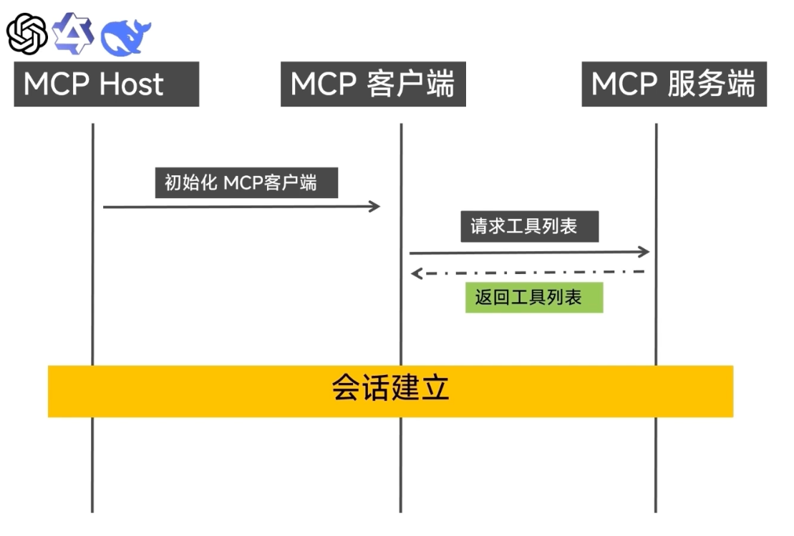

## Skill

MCP协议的缺点：

1.一次性把所有工具都返回回来，会占用上下文窗口导致上下文的爆炸

2.作为智能体，它不知道哪个工具才能正确执行这个任务，只能够去请求语言大模型，这样一样一回就造成Token的浪费，且浪费时间。

> 为了解决这两个问题，就是让智能体有专业知识的能力，在我执行的时候知道使用哪个工具，然后告诉MCP服务端，把这一两个工具返回回来即可，这就叫做Agent Skills。
>
> * 是通过文件配置的方式赋予智能体专业知识能力的。

**⭐Skills是如何加载的**

1. 以元数据的方式加载到智能体，就是智能体在启动的时候，把一些领域知识的能力以文件方式去加载到智能体，让智能体先拥有知识，拥有专业能力，在遇到某个问题、某个任务的时候，它知道要用哪个工具，或者说知道用哪几个工具组合起来的完成效率最高。

   a. 这些原数据包括几个方面：

   * 第一个方面：包括这些专业知识
   * 第二个方面：包括所拥有的工具的一些索引，并不是真正的工具导入进来，当智能体遇到它要解决的问题，知道它自己要调用什么工具的时候，它才把这个工具的具体使用方式、以及一些文档和命令加载到智能体里面。
   * 第三个方面：智能体在使用调用这个工具的时候，如果还要使用到这个工具所涉及的其他一些辅助的资料，例如脚本数据库等等，那么它在使用的时候，它采取再次的加载

   * **⭐这就是Agent Skills在工具调用的三步加载，是一个渐进式的加载**

**⭐Agent Skills**

1. 领域专业知识

2. 资源渐进式加载

## 什么是agent

感知 → 决策 → 反馈 → 动作

## 多Agent--A2A

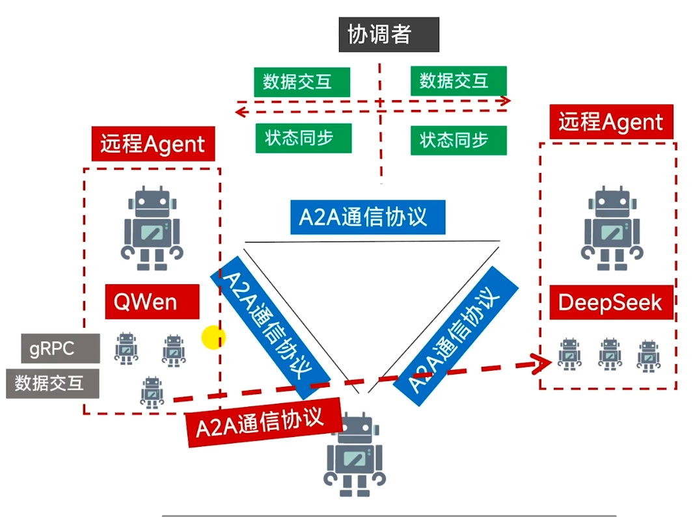

因此A2A通信协议第一个我们需要明确的就是，它需要有一个协调者，这个协调者就是主要去协调多个agent之间通信的数据交互，以及状态的同步，这个是远程agent之间的通信，这里的远程agent它是分布在不同节点的，例如某个agent它是处于深圳的这个节点，而另外一个agent它是处于上海的节点，那么它们之间的通信就需要通过A2A来进行数据的交互以及状态的同步,而对于基于同一个大模型的，并且是解决同一个需求的多个的agent，它们之间的通信以及状态的同步，就可以无需使用这个A2A通信协议，基于同一个大模型的agent都是处于同一个节点的，那么就可以基于GPAC这个协议来进行数据的交互。而对于状态的同步可以使用内存、使用本地的文件，就无需使用这么重型的A2A通信协议。因此我们所说的A2A通信协议主要是用于远程agent之间的通信交互。

A2A通信协议的步骤：

* 看一下A2A通信协议它的一个步骤。两个agent之间, 他需要有有一个协调者, 这里的协调者就称为A2A的服务端, 就是A2A server。首先, 远程agent 1, 他需要知道有哪些agent能够帮助他进行一个工作的协调, 那么他就需要去查询这个agent一个卡片, 然后从这些agent的卡片里面抽取一个合适的远程agent, 把它交给这个A2A server, 那么A2A server他通过这张卡片去发现到这个agent 2,那么他就告诉这个agent2, 哎,在远程有一个agent1,他有些任务,想让你帮他完成一下, 那么这里的agent 1,A2A server, 以及agent2, 他们就建立了一个联系。那么联系建立之后,agent1, 就会发起任务, 他发起的任务不是直接的去发给agent2, 而是先发给A2A server, 而是发给A2A server的服务端这里, 服务端就进行了一些任务的管理, 会把任务交给这个agent2, agent2接收到任务之后, 就进行任务的执行。那么在执行的过程中, agent1它会不断的去询问这个任务的进度, 都是通过这个A2A server, 来进行一个通信的中转。 agent1就好像甲方样子, 他要指定这个输出的格式, 同样的也是通过这个A2A server, 让他告诉agent2, 哎, 你必须按照这种的格式的输出格式, 最后agent2根据agent1的输出格式, 生成了最终的结果, 把它交给这个A2A server, 那么A2A server就把这个输出的结果就发给agent1, agent1拿到这个结果之后, 就给他呈现出来。

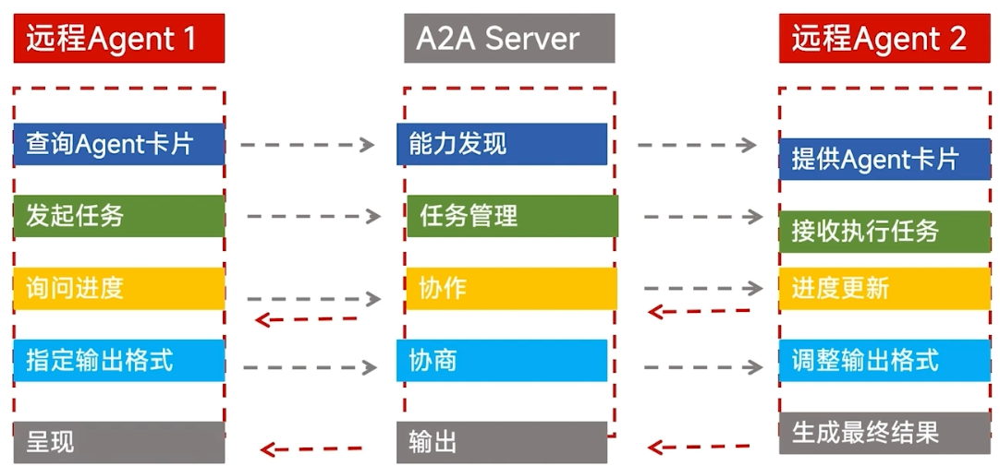

## 主流的多agent开发框架

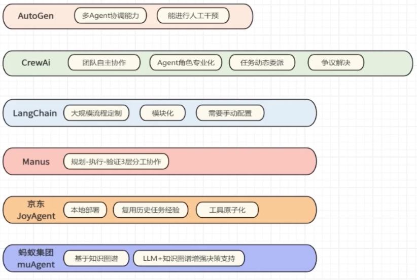

## 多agent核心执行流程

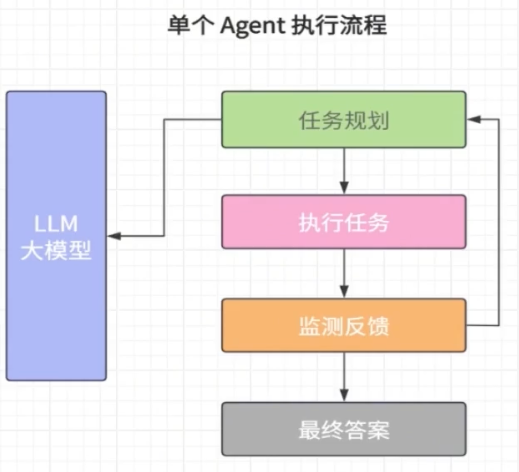

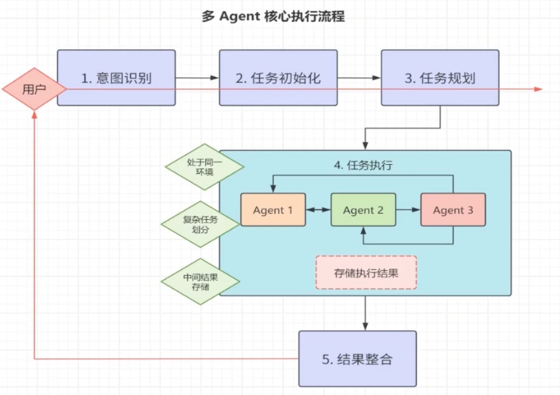

## vs面试官入局高薪Ai应用领域

1. 简答题：大模型的 Function Calling 是什么？用通俗的话解释它的作用。答案
   Function Calling 是大模型的一项核心能力，能让模型看懂并调用外部工具的函数（比如查天气的接口、算数学题的程序、查数据库的脚本）。通俗来说：大模型本身可能不会实时查天气或算复杂公式，有了 Function Calling，它就像一个 “指挥官”，能判断什么时候需要找工具帮忙，然后调用对应的函数获取结果，再整理成自然语言回答用户。
2. 简答题：A2A 协议的核心目的是什么？举一个简单应用场景。答案
   A2A 协议的核心目的是规范不同智能体之间的通信方式，让多个智能体能 “听懂” 彼此的指令、数据和需求，从而协同完成复杂任务。简单场景：一个 “文案智能体” 和一个 “图片生成智能体” 协作写海报。文案智能体生成宣传文案后，通过 A2A 协议把文案关键词、风格要求发给图片智能体，图片智能体接收后生成对应海报，全程无需人类干预。
3. 简答题：对初学者来说，Function Calling 实现的关键步骤有哪 3 步？答案关键 3 步（简化版）：定义函数：告诉大模型有哪些可用的工具函数，包括函数名、参数、功能（比如 get_weather(city: str)，功能是查城市天气）；模型判断：大模型接收用户问题后，判断是否需要调用函数（比如用户问 “北京今天天气”，就需要调用 get_weather）；执行与返回：调用对应的外部函数获取结果，大模型再把结果整理成自然语言回答用户。

## MCP能连接万物的原因：通信的分层设计

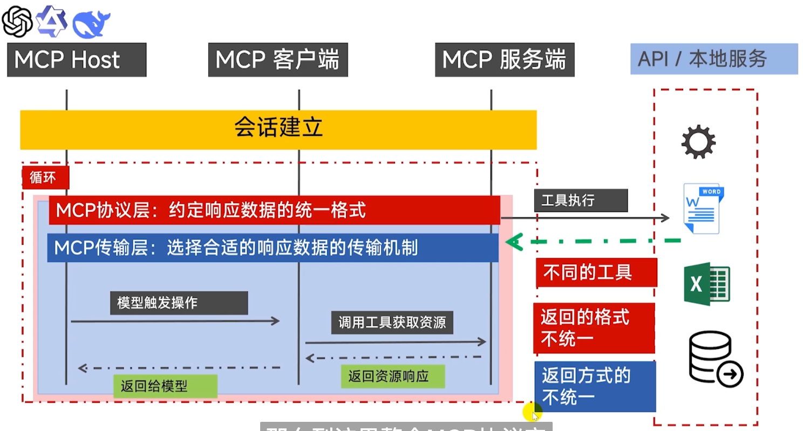

**⭐为什么MCP是通用插头？**

* 通用插头 = MCP协议层 + MCP传输层

* ⭐我们经常所说的 MCP, 它是一个通用插头, 它是类似于USB 这样的东西, 通过MCP能够使的大模型去连接大模型之外的所有东西。为什么这样子说呢? 就是因为 MCP 协议, 它提供了协议层和传输层。 MCP的协议层使得无论 MCP 调用什么工具, API 工具还是访问本地的数据文件还是云端的数据库, 那么它返回的格式, 响应数据的返回格式, 都能够按照约定的一个统一格式来进行。而 MCP 传输层, 它能够自主的选择这些数据的传输机制, 好像 MCP 服务端, 它如果是调用 API 接口的, 它能够自主的选择这个 HTTP 协议, 如果是调用本地的数据文件的, 它能够自主的去选择本地的进程来进行数据的传输。还有就是, 节点之间的传输机制, 也可以通过传输层来自主的选择这个传输机制。如果节点之间是在不同的机器上的, 就好像 MCP 客户端和 MCP 服务端, 他们是在不同的机器上的, 那么他们之间的数据传输, 通过传输层, 是可以自主的选择这个 HTTP 协议。如果 MCP 客户端跟 MCP host, 也就是大模型, 它是再同一个机子上的, 那么 MCP 传输层, 是能够自主的去选择选择本地进程, 来进行数据的传输。来作为数据的传输。

## da 

webflux和webmvc都支持 SSE 协议

webmvc框架基于阻塞模型去处理请求：

1. 一个请求会单独用一个线程去处理这个请求
2. 这个线程在处理这个请求期间，是不能做其他的事情

webflux框架基于非阻塞模型去处理请求

1. 用一个线程去处理多个请求
2. 这个线程在处理这个请求期间，是能够做其他的事情

webflux框架在性能上优于 webmvc框架如果MCP客户端要连上MCP服务端的话，肯定要知道MCP服务端的地址，所以要在MCP服务端里加上MCP服务端的地址

MCP客户端不需要创建任何的东西，只需要能连上MCP服务端即可

* 即配置一下配置信息即可

  ~~~yaml
  spring:
      mcp:
        # MCP客户端
        client:
          name: imooc-weather-mcp-client
          version: 1.0.0 cp/sse/weather
  ~~~

注意：

* MCP服务端的spring-ai-starter-mcp-server-webflux必须要运行在netty里，不能运行在tomcat里

* MCP服务端里不能引入这个依赖，要去掉引入

  ~~~xml
  <dependency>
      <groupId>org.springframework.boot</groupId>
      <artifactId>spring-boot-starter-web</artifactId>
  </dependency>
  ~~~

* MCP客户端需要引入spring-boot-starter-web这个依赖

## A2A

Google当初所提出的这个A2A协议的一个流程, 那么这里就会涉及到几个问题

* 第一个问题就是：智能体A它如何知道远方有一个智能体 B , 并且它是有能力去帮它解决这个问题? 那么这是一个很大的问题, 所以在 A2A 这个协议里面会应该会有一个中间节点,  智能体 A它通过这个中间节点知道智能体 B 的存在, 并且它知道智能体 B有什么能力, 并且它拥有的这个能力刚好是能够解决它现在所遇到的问题, 所以在 A2A 协议的架构里面, 就是有一个中间节点, 这个中间节点, 就叫做 **注册中心**。在这个注册中心里面, 就存放着这些远方的智能体, 以及它所拥有的能力。
*  第二个问题就是：智能体 A它是通过什么东西知道智能体B 所拥有的这些能力? 这个注册中心, 也就是中间节点, 可能会有很多个智能体, 而每个智能体都拥有不同的能力, 那么智能体 A它如何知道这些在注册中心里面的智能体, 哪一个智能体刚好能够帮它解决这个问题。 
* 第三个问题就是：难道, A2A 协议只能够应用于属于不同模型的智能体吗? 如果是同一个模型的智能体, 就是这两个智能体都是属于同一个模型的, 那么这样子能不能应用这个 A to A 协议呢?

SpringAi alibaba 1.1 提供了实现A2A协议的Api

* 这里的A2A协议除了用于不同模型的Agent 之间进行通信

* 也能用于同一个大语言模型，但位于不同节点(分布式)的Agent 之间的通信有3个核心组件

* A2A Provider (服务提供)

* 注册中心 ( 阿里的Nacos 3.1 ) (服务注册 )
  * 也就是说A2A Consumer如何知道A2A Provider的存在，就是需要这个注册中心

* A2A Consumer ( 服务发现 )

ReactAgent: 能够自主规划，自主决策，能够执行工具，有记忆能力，感知周边环境的智能体

远程智能体的卡片

* 就是远程Agent的元数据，也可以说是名片

*  存储在注册中心
* 服务消费者，是通过 AgentCardProvider 对象获取注册中心的智能体卡片
  * .agentCardProvider(agentCardProvider)

~~~java
        A2aRemoteAgent agentProvider =
                A2aRemoteAgent.builder()
                        //AgentCardProvider 通过 远程Agent的name 获取指定的远程智能体卡片
                        .name("AgentProvider")
                        //必须要填
                        .description("description")
                        //必须要填
                        .instruction("instruction")
                        //远程智能体的卡片(远程Agent的元数据, 名片)
                        //远程智能体的卡片，存储在注册中心
                        //服务消费者，是通过 AgentCardProvider 对象获取注册中心的智能体卡片
                        .agentCardProvider(agentCardProvider)
                        //必须要填
                        .shareState(true)
                        .build();
~~~

注意：

* 这里的name("AgentProvider")里的"AgentProvider"要和服务的提供者，也就是远程智能体的名称一致，这样才能够获取这个远程智能体存储在注册中心里面的智能体卡片

  ~~~java
      @Bean
      public ReactAgent agentProvider(
              //以参数形式注入ChatModel
              ChatModel chatModel,
              WeatherTool weatherTool) {
  
          /* **********************
           *
           * SpringAi Alibaba 1.1 版本
           * 通过 ReactAgent的工厂方法(builder) 创建Agent,
           *
           * ReactAgent: 能够自主规划，自主决策，能够执行工具，有记忆能力，感知周边环境的智能体
           *
           *
           * *********************/
  
  
          return ReactAgent.builder()
                  .name("AgentProvider")
                  .description("")
                  //.model需要的参数是 ChatModel,
                  //ChatModel是以参数的形式注入的,
                  //在后面课程会详细讲解ChatModel
                  .model(chatModel)
                  //先注释Agent工具配置, 在后面课程会详细讲述
                  //.tool(weatherTool)
                  .build();
      }
  ~~~

### 总结

**⭐Google 提出的 A2A协议 用于不同大语言模型的Agent 之间进行通信**

1. SpringAi alibaba 1.1 提供了实现A2A协议的Api
2. 这里的A2A协议除了用于不同模型的Agent 之间进行通信，
3. 也能用于同一个大语言模型，但位于不同节点(分布式)的Agent 之间的通信
   

**⭐有3个核心组件**

1. A2A Provider (服务提供): ReActAgent
2. 注册中心 ( 阿里的Nacos 3.1 ) (服务注册 )
3. A2A Consumer ( 服务发现 ):  A2aRemoteAgent
   

**⭐A2A协议的流程**

1. 服务提供者 将智能体卡片存储在注册中心
2. 服务发现者通过AgentCardProvider基于远程智能体name获取对应的智能体卡片
3. 注册中心根据服务发现者所获取的智能体卡片，告诉远程Agent, 去执行服务发现者所提供的任务

**⭐智能体卡片：(在配置文件里设置这些属性)**

1. name 远程智能体的name
2. description  、远程智能体的描述
3. url 注册中心的地址
4. version 远程智能体的版本
5. capabilities 远程智能体的能力
6. skills 远程智能体的专业领域技能

## vs面试官入局高薪Ai领域

面试题 1：请解释 Spring AI 1.1 中的 MCP 与 A2A 分别指什么？

答案：
MCP 指 Agent 的工具调用能力（Model Control Plane / Tool Calling 能力），让 AI Agent 可以调用函数、接口、第三方服务等外部工具。
A2A 指 Agent-to-Agent，即多个智能体之间通过消息、上下文进行通信、分工、协作，共同完成复杂任务。
Spring AI 1.1 提供了标准化接口，让开发者可快速实现工具调用与多 Agent 协作。

面试题 2：Spring AI 1.1 如何实现 MCP（Agent 工具调用）？核心步骤是什么？

答案：
定义工具函数，使用 @Tool 注解或实现 Tool 接口注册工具。
配置 ChatModel 并开启工具调用支持。
构建 Agent 并绑定可用工具列表。
发送用户请求，Agent 自动判断是否需要调用工具。
执行工具并将结果回传给大模型，生成最终回答。
Spring AI 自动完成参数解析、调用、结果封装，简化 MCP 流程。

面试题 3：Spring AI 1.1 如何实现 A2A 多 Agent 之间通信？

答案：
创建多个独立 Agent，如查询 Agent、计算 Agent、汇总 Agent。
使用统一的 ChatMemory 或上下文对象传递信息。
通过 Agent#call() 或 Agent#stream() 实现 Agent 之间互相调用。
主 Agent 负责任务拆解，依次调用子 Agent 并收集结果。
利用 Spring 依赖注入管理 Agent 实例，实现低耦合 A2A 协作。

面试题 4：Spring AI 实现 MCP+A2A 时，如何保证工具调用安全与权限控制？

答案：
使用工具白名单机制，限制 Agent 可调用的工具范围。
对工具入参做校验与脱敏，避免敏感信息泄露。
为不同 Agent 设置不同工具权限，实现最小权限原则。
记录工具调用日志，便于审计与问题追溯。
结合 Spring 拦截器或 AOP 对工具执行做权限校验。

面试题 5：Spring AI 1.1 中 MCP 与 A2A 结合的典型应用场景是什么？

答案：
典型场景是复杂任务智能协作系统。
例如：用户提出一个综合查询需求，
调度 Agent（A2A）将任务拆分，
调用查询 Agent 从数据库获取数据（MCP 工具调用），
再调用分析 Agent 做计算与总结，
最终由主 Agent 汇总结果返回。
MCP 负责能力扩展，A2A 负责流程协作，共同完成复杂业务。

## Agent团队和大模型的无缝协作

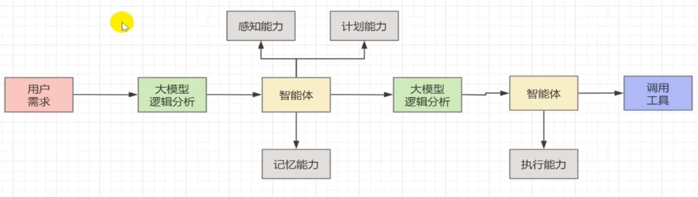

## vs面试官入局高薪Ai应用领域

面试题 1：请设计一套基于多 Agent 团队的专属旅游规划系统架构，说明各 Agent 职责

答案：
可采用分工式 Agent 团队架构：
用户需求 Agent：负责与用户交互，收集出行时间、预算、偏好、人数等信息。
路线规划 Agent：根据景点热度、距离、交通，生成合理行程路线。
资源查询 Agent：调用 MCP 工具能力，实时查询机票、酒店、门票、天气等信息。
预算核算 Agent：对整体费用进行估算、拆分与优化。
汇总决策 Agent：整合所有子 Agent 结果，生成最终专属旅游方案。
通过 A2A 通信实现信息互通与协同决策。

面试题 2：在旅游规划 Agent 团队中，如何通过 MCP 工具调用提升方案实用性？

答案：
MCP 工具调用是旅游规划落地的关键：
调用天气接口，动态调整行程安排，规避恶劣天气。
调用交通票务工具，实时查询航班、高铁余票与价格。
调用酒店预订接口，获取房型、价格、评价并推荐。
调用地图工具，计算景点间距离、耗时，优化路线顺序。
调用攻略与点评工具，筛选高口碑景点与美食。
让 Agent 不再只靠模型知识，而是基于真实数据生成可执行方案。

## Agent自主决策的模式:ReAct Agent

SpringAi Alibaba 1.0 还处于和大模型对话阶段 ( ChatClinet )

SpringAi Alibaba 1.1

* 进入到 Agent 自主决策与自主执行 的时代:

* ReActAgent 除了具备了大脑，工具使用，记忆能力，环境感知，

* 还具备2个能力:
  * 规划能力 ( 复杂任务分解 )
  * 自主决策能力

Agentic AI (智能体式AI)： 多个 ReActAgent 的协调合作。

* 是一种设计范式，

* 强调将AI系统构建为具备自主性、适应性和协作能力的智能体集合。

* 其核心目标是通过多Agent协同解决复杂问题

智能体是能够调用工具去帮我们解决实际问题的。

OverAllState这个对象如何拿到对应agent的输出呢？

* 要把每个agent设置一个键值，也就是加上outputkey

  * 例如:

    ~~~java
    // 行程规划agent
            ReactAgent tripPlannerAgent =
                    ReactAgent.builder()
                            .name("tripPlanAgent")
                            .description("负责规划旅游行程")
                            .instruction(
                                    "擅长旅游行程的规划," +
                                    "包括了景点,本地小吃,住宿" +
                                    "返回性价比最优的行程规划, 及预估费用," +
                                    "以表格形式展示"
                            )
                            .model(chatModel)
                            // 将一个ReActAgent作为工具添加到另外一个ReActAgent
                            .tools(AgentTool.getFunctionToolCallback(budgetAgent))
                            //输出
                            .outputKey("trip_plan")
                            .build();
    ~~~

instruction方法就是对智能体的角色以及所擅长的能力进行更细化的约束

## vs面试官入局高薪Ai应用领域

什么是 Spring AI 中的 FlowAgent？它在旅游规划工作流中起到什么作用？

答案：
FlowAgent 是 Spring AI 提供的流程化智能体编排组件，支持按步骤、按条件串联多个 Agent 或工具调用，形成可执行的工作流。
在旅游规划场景中，它用于将 “需求收集→景点查询→交通查询→酒店匹配→预算核算→行程生成” 等多个 Agent 按固定逻辑串联，实现自动化、可复用、可监控的端到端旅游规划流程，避免手动硬编码调用关系。

使用 Spring AI FlowAgent API 搭建旅游规划工作流的核心步骤有哪些？

答案：
拆分旅游规划任务，设计多个职能 Agent，如需求 Agent、路线 Agent、酒店 Agent、天气 Agent 等。
通过 FlowAgent API 定义工作流节点，包括开始节点、工具调用节点、Agent 调用节点、条件判断节点。
构建主流程并执行，最终由汇总节点生成完整旅游方案。

在旅游规划工作流中，FlowAgent 如何结合 MCP 工具调用增强实用性？

答案：
FlowAgent 可在流程节点中直接嵌入 MCP 工具调用，使规划基于真实数据：
在路线节点调用地图工具，计算景点距离与耗时。
在交通节点调用票务接口，查询航班 / 高铁信息。
在住宿节点调用酒店查询工具，获取价格与评分。
在行程节点调用天气工具，动态规避恶劣天气。
FlowAgent 控制执行顺序，MCP 提供真实能力，二者结合让旅游方案可落地、可执行。

Spring AI FlowAgent 相比手动编排多 Agent，在旅游规划中有哪些优势？

答案：
流程可视化、配置化，无需大量代码即可编排复杂旅游规划逻辑。
执行可追踪、可重试，便于排查节点失败问题。
支持条件分支与异常处理，可根据用户偏好动态调整路线。
节点复用性强，酒店 Agent、交通 Agent 可在多个流程中复用。
与 Spring 生态无缝集成，可接入缓存、日志、监控，适合生产环境使用。

## vs面试官入局高薪Ai应用领域

什么是 Spring AI Graph 引擎？在旅游规划场景中它的核心作用是什么？

答案：
Spring AI Graph 是 Spring AI 提供的基于有向图的工作流编排引擎，支持以节点、连线方式定义 Agent、工具、条件判断、分支跳转等执行逻辑。
在旅游规划中，它用于将需求采集、景点推荐、交通查询、酒店匹配、预算核算、行程生成等步骤构造成可视化执行图，实现多 Agent 协同、流程可控、可复用的端到端旅游规划自动化。

使用 Spring AI Graph 搭建旅游规划工作流的基本流程是什么？

答案：
拆解任务，设计图节点：用户输入节点、景点 Agent、交通 Agent、酒店 Agent、预算节点、汇总节点等。
通过 Graph API 构建有向执行图，定义节点执行顺序与依赖关系。
运行 Graph 工作流，按图编排自动执行并输出完整旅游方案。

Spring AI Graph 相比代码硬编码，在旅游规划工作流中有哪些优势？

答案：
可视化、结构化，流程清晰易维护，适合复杂旅游规划逻辑。
支持分支、条件、循环，可根据预算、人数、天气动态调整行程。
节点可复用，景点 Agent、交通 Agent 可在多个场景复用。
执行可追踪、可断点调试，便于定位流程异常。
与 Spring 生态深度整合，支持事务、监控、重试，适合生产部署。

## vs面试官入局高薪Ai应用领域

1. JManus 框架的核心定位是什么？从源码结构看它主要解决什么问题？
   答案：
   JManus 是一套面向 Java 智能体（Agent）开发 的轻量级框架，核心定位是简化多智能体协作、工具调用、流程编排。
   从源码结构来看，它通过模块化设计拆分了 Agent 核心、通信层、工具调用层、状态管理层，主要解决 Java 环境下 Agent 自主决策、A2A 通信、工具调用标准化的问题，让开发者无需从零构建智能体执行引擎。
2. 解读 JManus 源码，它是如何实现 Agent 自主决策的？
   答案：
   从源码执行流程来看：
   框架通过 感知模块 获取外部环境或用户输入信息；
   交由 推理决策引擎 匹配规则、选择行为或调用工具；
   通过 执行器 完成动作调用或工具执行；
   再通过 状态记忆 记录上下文，支撑连续决策。
   整体采用 “感知 - 推理 - 执行 - 记忆” 的闭环结构，实现 Agent 的自主判断与行为规划。
3. JManus 源码中多 Agent 之间（A2A）是如何通信与协作的？
   答案：
   JManus 在源码中通过统一的 消息总线 + 共享上下文 实现 A2A 协作：
   每个 Agent 作为独立节点，通过消息机制发送任务请求；
   框架提供路由调度，实现 Agent 之间的调用与结果传递；
   共享上下文用于同步用户需求、中间结果等数据；
   支持主从协作模式，由主控 Agent 拆分任务，分发到子 Agent 执行并汇总结果，从而完成复杂协同任务。

## 第九章节

工作流编排是需要人工取进行整体的工作流程的设计，这些工作流对于一些非常复杂的任务是可以通过人工去设计的。

但对于那些稍微简单一点的任务是可以通过Agent的自主决策去决定整个流程的编排，这就是基于Agent的自主代理。也就是这里的【Agent自主思考执行】方案

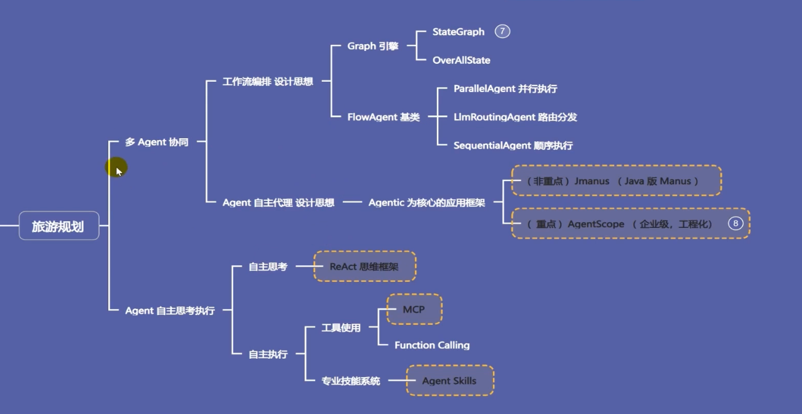

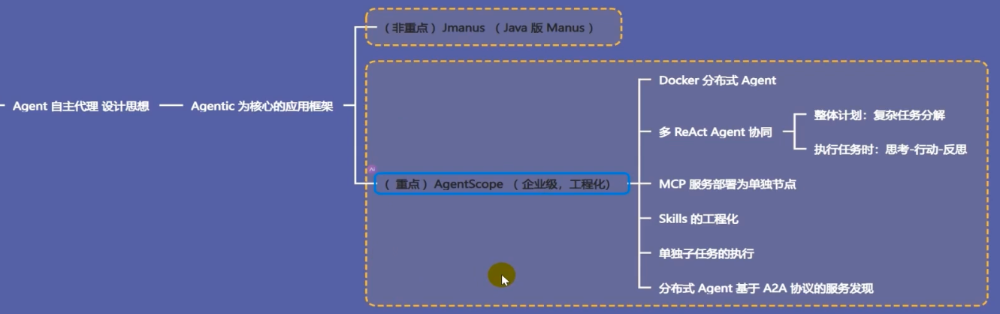

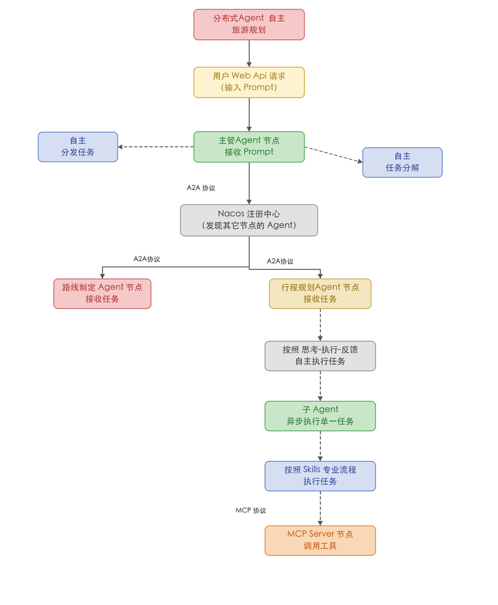

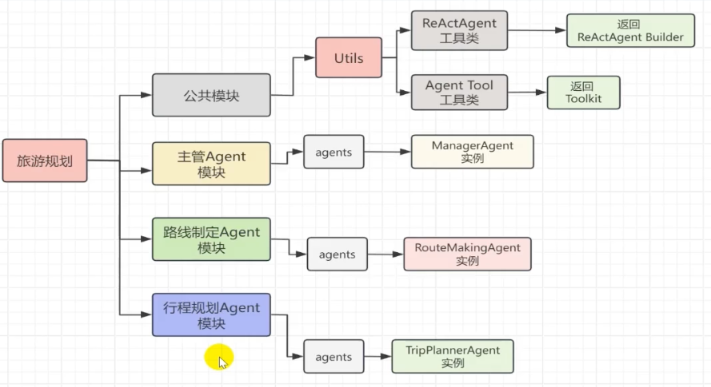

子代理为什么不污染主要的上下文，所以子代理在执行任务的过程中会在独立的上下文里去执行。所以可以多个子代理同时去执行任务，例如：专门处理数据分析的、专门处理CRUD的

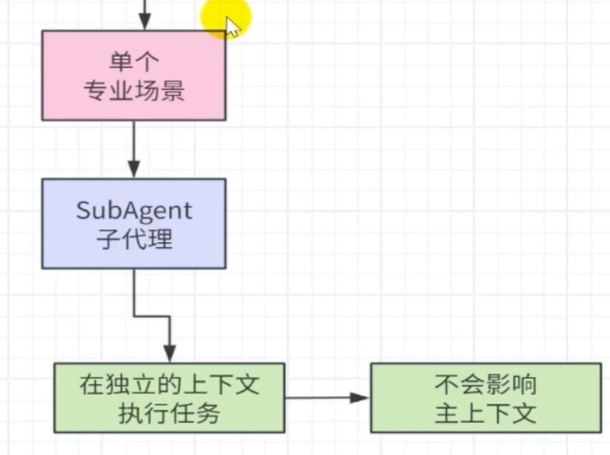

subgent完成任务之后就会释放
