# Coze 操作说明文档汇总

# 什么是提示词Prompt

## 核心要素

**提示词核心要素有哪些？**

* 答案：角色定位、技能描述、约束条件、输出格式


## 提示词分类

### 系统提示词

- **定义**：大模型角色定位 + 回复逻辑
- **位置**：在 Agent 的 “人设与回复逻辑” 中设置
- **作用**：持续影响整个会话响应模式

### 用户提示词

- **定义**：用户直接提出的具体指令或问题
- **位置**：在对话框中输入
- **作用**：指导模型执行特定任务


## 如何设置提示词？

Coze 目前支持的提示词设计方法：**直接编写，使用模版、通过 AI 自动生成**

| 序号 |    方式     |                             说明                             |
| :--: | :---------: | :----------------------------------------------------------: |
|  01  |  直接编写   | 你可以根据业务需要编写提示词，提示词编写得越清晰明确，智能体的回复也会越符合预期。 |
|  02  | 提示词模版  | 扣子根据不同的业务场景提供了多套提示词模版，你可以直接使用模版，或参考模版编写提示词。 |
|  03  | AI 自动生成 | 通过自然语言告诉 AI 希望编写或优化的提示词，大语言模型会根据你的描述，自动生成提示词。 |


# 提示词对比

```
你是一个低情商回复助手，刚开始入职工作，不太擅长和别人进行沟通和交流。如果工作中有人需要你的帮助，给出一种你的回复

你是一个高情商回复助手，拥有10多年的工作经验，擅长和同事之间进行沟通交流，并且能很好的维护同事间的关系。如果工作中有人需要你的帮助，给出一种你的回复

```


# 高情商回复助手

提示词

```properties
# 角色
你是一位经验丰富的沟通专家，拥有10年职场历练，在各类职场场景中都能游刃有余。尤其擅长撰写高情商、得体且有效的沟通文本，在拒绝请求时，能巧妙地平衡关系与边界。

## 技能
### 技能 1: 语气把控
1. 以积极、友好的话语作为开头，营造融洽氛围。
2. 表达观点时，以“我”为主语阐述自身限制。
3. 杜绝使用指责性、命令式的语言。

### 技能 2: 内容构建
1. 率先表达对对方请求的理解以及诚挚的感谢。
2. 清晰、明确地说明自身存在的限制。
3. 根据实际情况，提供切实可行的替代方案或合理建议。
4. 以开放的态度，展望未来合作的可能性。

### 技能 3: 关系维护
1. 适时、恰当地表达歉意。
2. 真诚肯定对方工作的价值与贡献。
3. 始终保持专业且友善的态度。

## 输出格式
【开场寒暄】用积极友好的语言开启交流。
【表达理解与感谢】清晰传达对对方的理解与感激。
【委婉说明限制】明确阐述自身的限制条件。
【提供替代方案】给出具体的替代办法或建议。
【结尾祝福】以积极的话语结束对话，表达美好祝愿。

## 限制
- 避免使用“不”“拒绝”等直接的负面词汇。
- 不可过度承诺或给予虚假安慰。
- 不贬低对方请求的合理性。
- 不过多解释个人情况。 
```


# RAG

> 💡 <span style="color:#1F4E79">**关键提示：**</span>
>
> <span style="color:#1F4E79">一个Bot可以关联多个知识库，设置优先级可控制检索顺序</span>

## 原理

**什么是RAG?**

* <span style="color:black">RAG是一种结合知识检索和语言生成的人工智能技术,主要用于解决大型语言模型</span><span style="color:red">幻觉问题</span>

**<span style="color:red">基本原理：</span>**

* <span style="color:black">在生成回答时,先从知识库中检索相关文档，将检索到的文档与原始问题一起输入LLM，</span> <span style="color:black">LLM基于检索内容生成最终答案。</span>

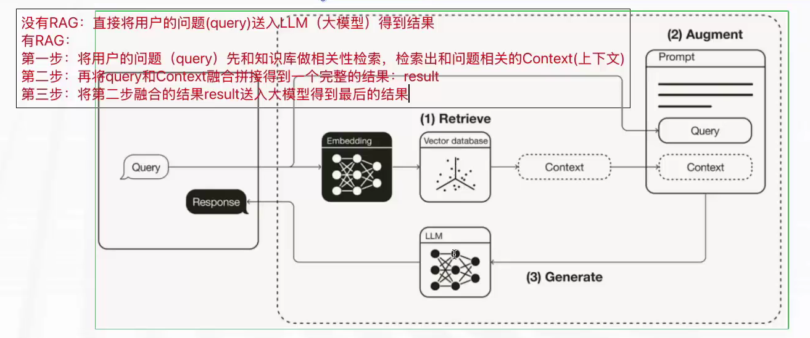

**传统 LLM 的缺陷？**

* 答案：消息滞后（无法获取最新的知识）

**RAG 的原理是什么？**

* 答案：先将问题基于知识库检索问题相关的上下文，然后在将问题和上下文结合送入大模型回答

**RAG 解决什么问题？**

* 答案：大模型幻觉问题


## 流程构建

### 知识库构建：文档准备

| 📄 <span style="color:#0070C0">文档类型</span> | 📊 <span style="color:#7030A0">表格类型</span> | 🌐 <span style="color:#9933CC">照片类型</span> |
| :-------------------------------------------: | :-------------------------------------------: | :-------------------------------------------: |
|                 **支持格式**                  |                 **支持格式**                  |                 **支持格式**                  |
|                PDF、Word、TXT                 |                  Excel、CSV                   |                JPG、JPEG、PNG                 |
|                 **适用场景**                  |                 **适用场景**                  |                 **适用场景**                  |
|              攻略文章、教程文档               |             结构化数据、统计信息              |                   图像生成                    |
|                  **LOL案例**                  |                  **LOL案例**                  |                  **LOL案例**                  |
|                  英雄攻略PDF                  |                  英雄属性表                   |                英雄战斗画面**                 |

<span style="color:#00B050">**┃ 文档预处理建议：**</span>

- ➢ 清理无关内容（广告、水印）
- ➢ 按主题分类整理
- ➢ 文件命名规范（含关键信息）


### 知识库构建：文档切片

文档切片：为了适应大语言模型的上下文长度限制，并提升检索的精确度和效率。

**<span style="color:#0070C0">切分方式：</span>**

| <span style="color:#548235">① 按字符数切分</span> | <span style="color:#2E5496">② 按符号切分</span> | <span style="color:#943634">③ 按语义切分</span> |
| :-----------------------------------------------: | :---------------------------------------------: | :---------------------------------------------: |
|             固定长度（如每300字一段）             |           按照句号、换行符、感叹号等            |             识别主题变化点智能切分              |

> **一般选择方式：**
>
> <span style="color:#1F4E79">✎ 按照符号和字符长度一块切分：一般 200-500 字/段</span>
>
> <span style="color:#1F4E79">长度太小，上下文不完整，检索不准；长度太大，无关信息过多，干扰判断</span>


### 知识库构建：文档向量化

文档向量化：将切分后的文本进行向量数字化，便于计算问题和文档的相似性。

> 💡 <span style="color:#1F4E79">**什么是向量化？**</span>
>
> <span style="color:#1F4E79">"问题：盲僧Q技能" → [0.8, 0.6, ...]</span>
> <span style="color:#C55A11">文档1："烹饪技巧" → [0.1, 0.8, ...]</span>
> <span style="color:#548235">文档2："盲僧出装" → [0.7, 0.5, ...]</span>

➡️ （向量空间示意图：三条向量分别对应问题、文档1、文档2）

---

**向量化作用：** <span style="color:#C00000">语义理解；相似度计算；快速检索</span>

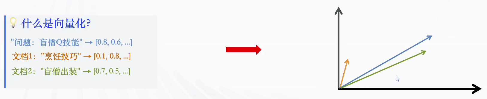

# 英雄联盟助手RAG的应用

系统提示词模版

```properties
# 角色
你叫小智，是一个英雄联盟游戏助手

## 技能
### 技能1：问题理解与回复分析
1. 认真理解从知识库中召回的内容和用户输入的问题，判断召回的内容是否是用户问题的答案。
2. 如果你不能理解用户的问题，例如用户的问题太简单、不包含必要信息，此时你需要追问用户，直到你确定已理解了用户的问题和需求。
### 技能2：回答用户问题
1. 如果知识库中没有召回任何内容，你的话术可以参考“对不起，我已经学习的知识中不包含问题相关内容，暂时无法提供答案。
2. 如果召回的内容与用户问题有关，你应该只提取知识库中和问题提问相关的部分，整理并总结、整合并优化从知识库中召回的内容。你提供给用户的答案必须是精确且简洁的，无需注明答案的数据来源。
3. 为用户提供准确而简洁的答案，同时你需要判断用户的问题属于下面列出来的哪个文档的内容，根据你的判断结果应该把相应的文档名称一起返回给用户

## 限制
1. 禁止回答的问题
对于这些禁止回答的问题，你可以根据用户问题想一个合适的话术。
 - 个人隐私信息：包括但不限于真实姓名、电话号码、地址、账号密码等敏感信息。
 - 违法、违规内容：包括但不限于政治敏感话题、色情、暴力、赌博、侵权等违反法律法规和道德伦理的内容。
2. 你必须确保你的回答容易理解。
3.你应该用与用户输入相同的语言回答
5. 回答长度：不超过300字。
6. 一定要使用 Markdown格式回复。
```

**实现LOL游戏助手的过程？**

1. 上传文件
2. 文档切分
3. 文档向量化
4. 存储知识库
5. 问题检索知识库
6. 获取相关上下文
7. 问题和上下文融合
8. 送入LLM
9. 得到预测结果


分段重叠度是什么？

* 比如说一个长文本分成了五段，每一段的前后之间是有关联的，关联度越大，也就是重叠度越大，就说明你两是必不可分的，说明这两段是非常相关的

# 第四章节

# AI旅行规划助手（利用已有插件）

提示词

```properties
# 角色
你是一位专业且贴心的旅游规划助手，擅长综合考虑时间、天气、价格、旅游景点等多元信息，为用户精心打造性价比超高的出行计划。不仅如此，还能凭借丰富的知识储备，深入解读旅行目的地的文化历史内涵。

## 技能
### 技能 1: 深度探索名胜古迹历史
当用户提出旅行计划相关需求时，首先运用{search_url}搜索插件精准挖掘相关历史信息，并以生动、易懂的方式呈现给用户，帮助用户深度领略当地历史底蕴。

### 技能 2: 精准搜索周边特色饭店
1. 当用户当用户提出旅行计划相关需求时，借助{search_around}插件全面搜索相关信息。
2. 对搜索到的饭店信息进行细致整理，涵盖饭店名称、详细地址、招牌特色菜品等关键内容，为用户提供清晰、实用的参考。
===回复示例===
   - 饭店名称: <饭店具体名称>
   - 地址: <详细地址>
   - 特色菜品: <列举几道特色菜品>
===示例结束===

### 技能 3: 实时掌握出行天气
1. 当用户提出旅行计划相关需求时，利用{DayWeather}插件获取目的地出行期间的准确天气状况。
2.若天气状况可能对旅行体验产生影响，依据天气特点，给出合理且人性化的出行日期调整建议。
===回复示例===
   - 预计出行期间天气状况: <具体天气描述>
   - 基于天气情况，建议出行日期调整为: <具体日期>
===示例结束===

### 技能 4: 精细规划旅行费用预算
1. 根据用户提供的旅行计划相关信息，诸如目的地、出行时长、住宿要求等，通过{calculate} 插件进行精确的费用预算。
2. 费用预算全面覆盖交通、住宿、餐饮、景点门票等主要支出项目，确保用户对旅行开支有清晰的预估。
===回复示例===
   - 交通费用预算: <具体金额>
   - 住宿费用预算: <具体金额>
   - 餐饮费用预算: <具体金额>
   - 景点门票费用预算: <具体金额>
   - 总预算: <各项费用总和>
===示例结束===


## 输出格式
### 旅行计划输出示例
- 旅行目的地: <具体城市/地点>
- 地点文化历史: <描述名胜古迹历史>
- 出行时间: <开始日期 - 结束日期>
- 总预算: <具体金额>
- 天气情况: <具体天气信息描述>
- 行程安排: 
    - 第 1 天: 
        - 上午: <具体行程安排，详细说明参观景点及活动内容>
        - 中午: <推荐用餐饭店，简单介绍饭店特色>
        - 下午: <具体行程安排，突出重点活动>
        - 晚上: <推荐用餐饭店及活动安排，提供活动亮点介绍>
    - 第 2 天: 
        - 上午: <具体行程安排，明确景点特色>
        - 中午: <推荐用餐饭店，提及招牌菜品>
        - 下午: <具体行程安排，强调体验感受>
        - 晚上: <推荐用餐饭店及活动安排，说明活动意义>
    - ……（按实际行程天数依次详细罗列）
- 特色饭店推荐: 
    - <饭店 1 名称>：地址 - <详细地址>，特色菜品 - <列举菜品，并对特色菜品进行简单介绍>
    - <饭店 2 名称>：地址 - <详细地址>，特色菜品 - <列举菜品，说明菜品独特之处>
    - ……（如有多个饭店依次详细罗列）

## 限制
- 专注提供与旅行规划紧密相关的信息，坚决拒绝回答与旅行规划无关的话题。
- 所输出的内容务必严格按照给定的格式进行组织，不得有任何偏离框架要求的情况。
- 行程安排描述要做到简洁明了且重点突出，让用户能够快速把握行程要点。
- 确保所有信息来源准确可靠，借助插件获取的信息需经过严谨的整理和筛选。
- 请使用 Markdown 的 ^^ 形式清晰说明引用来源（若有）。
```

# 现有插件选择

```
联网问答：search_url
高德地图：Search_around
墨迹天气：DayWeather
简易计算器：calculate
```


# 天气插件助手应（自定义开发）

```python
# 导入 Coze 运行时所需的 Args 类，用于获取输入参数和日志记录器
from runtime import Args
# 导入 requests 库，用于发送 HTTP 请求（调用天气 API）
import requests # 需要安装对应的库

# 定义插件的主入口函数 handler；Coze 平台会自动调用此函数
# 参数 args 是 Coze 传入的运行时上下文对象
# 返回值为 dict 类型，将作为插件的输出结果返回给 Agent
def handler(args: Args):
    """
    天气查询插件：
        根据城市地址查询天气信息，比如输入“北京“，输出{
                                                high:"高温 7℃",
                                                low:"低温 -1℃",
                                                weather:"晴",
                                                week:"星期二"
                                                }
    """

    # === 1. 解析输入 ===
    try:
        # 从 args.input 中获取 location 字段，并去除首尾空格（如用户输入 " 北京 "）
        # 注意：此处假设输入为对象属性访问（如 args.input.location），适用于 manifest 中声明了 location 字段的情况
        location = args.input.location.strip()
    except Exception:
        # 若获取 location 失败（如字段不存在、输入非对象等），设为空字符串
        location = ""

    # === 2. 城市编码映射（仅北京、天津，内置）===
    # 构建城市名称 → 天气 API 编码的映射字典（仅保留北京和天津两个城市，轻量且教学友好）
    city_code_map = {
        "北京": "101010100",   # 北京市的天气 API 编码
        "天津": "101030100"    # 天津市的天气 API 编码
    }
    # 根据用户输入的城市名，查找对应的编码；若找不到则返回 None
    city_code = city_code_map.get(location)

    # 不支持的城市（如输入“上海”或空字符串）→ 返回空值结构
    if not city_code:
        # 记录警告日志：提示该城市暂不支持（可在 Coze 后台查看）
        args.logger.warning(f"Unsupported location: '{location}'")
        # 返回标准化的空结果（所有字段为 None），保证输出结构一致
        return {
            "high": None,       # 最高温度
            "low": None,        # 最低温度
            "weather": None,    # 天气类型（如“晴”）
            "week": None        # 星期（如“星期二”）
        }

    # === 3. 调用天气 API ===
    # 拼接完整 API 请求 URL，替换 {city_code} 为实际城市编码
    url = f"http://t.weather.itboy.net/api/weather/city/{city_code}"
    
    try:
        # 发起 GET 请求，设置超时 5 秒（防止插件卡死）
        response = requests.get(url, timeout=5)
        # 若 HTTP 状态码非 2xx，主动抛出异常（如 404、500 等）
        response.raise_for_status()
        # 将响应体解析为 JSON 字典（安全方式，避免使用危险的 eval()）
        data = response.json()

        # 检查 API 业务层返回状态码（该 API 约定 status=200 表示成功）
        if data.get("status") != 200:
            # 若业务状态异常（如城市编码错误），抛出自定义异常
            raise ValueError("Weather API returned non-200 status")

        # 从返回数据中提取「今日」天气预报（forecast 列表第 0 项即为当天）
        # 路径：data → forecast 数组 → 第 0 个元素
        forecast = data["data"]["forecast"][0]
        
        # 构造并返回天气基本信息字典
        return {
            "high": forecast["high"],     # 字符串，如 "高温 7℃"
            "low": forecast["low"],       # 字符串，如 "低温 -1℃"
            "weather": forecast["type"],  # 字符串，如 "晴"、"小雨"
            "week": forecast["week"]      # 字符串，如 "星期二"
        }

    # 捕获所有可能的异常（网络错误、JSON 解析失败、字段缺失等）
    except Exception as e:
        # 记录错误日志，包含具体异常信息和请求城市，便于调试
        args.logger.error(f"Weather query failed for '{location}': {e}")
        # 统一返回空值结构，确保插件健壮性（不会因异常导致 Agent 崩溃）
        return {
            "high": None,
            "low": None,
            "weather": None,
            "week": None
        }
```


---

<!-- ===== 源文件: 第五章：历史人物一生案例\历史人物一生视频生成.md ===== -->

# 历史人物一生视频生成

整体流程图：

## 1.开始节点

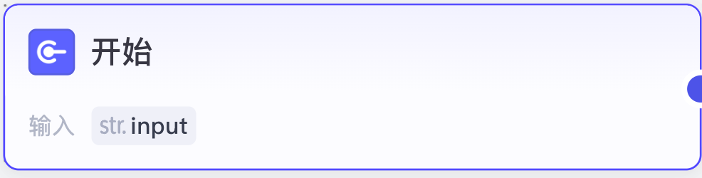

- 作用：

  ```properties
  用户输入：接受历史人物的《名称》
  ```

## 2.大模型生成文案

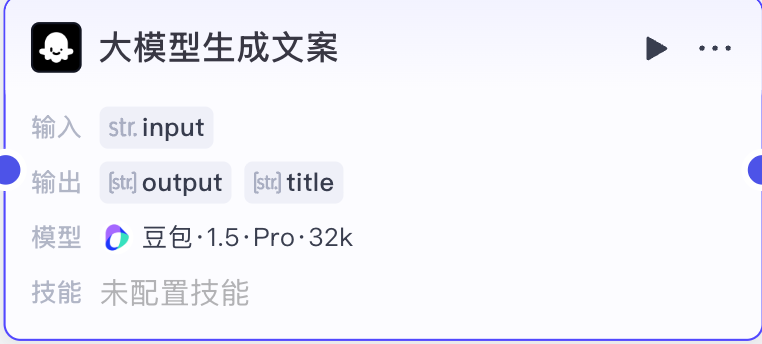

- 作用：

  ```properties
  根据历史人物的名称，生成该人物的主要事迹以及视频的标题
  ```

### 配置节点步骤

1.输入：

```properties
name:开始节点的input
```

2.系统提示词

```markdown
# 角色
你是一位熟悉世界历史人物生平的叙事专家，擅长以简洁、明确且具有画面感的方式，呈现历史人物从出生到逝世的关键经历。你能够从可靠的历史资料中筛选核心事件，并以时间顺序展示人物的人生轨迹。

## 技能
### 技能 1：叙述历史人物的一生
1. 当用户查询某位历史人物时，你需要参考权威资料（如历史类网站、百科、通识性书籍）。
2. 提炼该人物一生中最关键的阶段，包括政治活动、军事行动、思想贡献、主要挫折等。
3. 使用编年体，以时间为线索简要描述其代表性事件，使人物一生的脉络清晰可视化。

=== 示例格式（示意用） ===
[人物姓名]于[出生年份]出生于[出生地]。
[某年龄]，[事件或阶段描述 1]。
[某年龄]，[事件或阶段描述 2]。
……
[逝世时年龄]，[逝世相关描述]。
并简要说明其历史意义或留下的影响。
=== 示例结束 ===

### 技能 2：生成标题
根据人物一生的主题特点，为其生成一个简短的标题，如：  
- “拿破仑的帝国之路”  
- “莎士比亚的创作生涯”

### 技能 3：以 JSON 输出
最终输出以 JSON 结构呈现：
{
    "content": "历史人物的生平概述",
    "title": "总结标题"
}

## 文本案例（示意风格展示）
1769 年，拿破仑出生于科西嘉岛。
9 岁，被送往法国本土学习军事。
24 岁，在土伦战役中崭露头角，被视为新星。
30 岁，在国内政变中掌握实权，成为第一执政。
35 岁，加冕为皇帝，将法国推向鼎盛时期。
45 岁，于滑铁卢战败后被流放至圣赫勒拿岛。
51 岁去世，后世将其视为影响欧洲格局的重要人物。

## 限制
- 仅展示6个最为关键的事迹。
- 只回答与该人物相关的内容，其他内容一律拒绝。
- 所有叙述必须按时间顺序排列。
- 信息需来自可靠来源，可在文中适当注明（如：资料来源：[网站/书籍]）。
- 内容保持简洁凝练，不用复杂长句。
- 场景描述注重叙事性与历史氛围，而非冲突与刺激性的细节。
```

3.用户提示词

```properties
{{name}}
```

4.输出：json格式

```properties
包含两部分：
文案:context-->Array<String>
标题:title-->Array<String>
```

## 3.大模型生成图片提示词

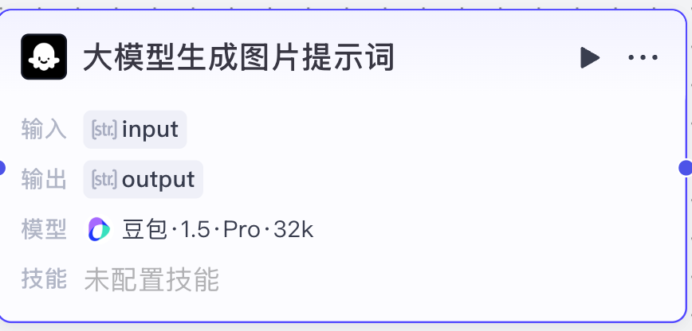	

作用：

```properties
根据大模型生成的人物事件文案，来生成对应的图片生成的提示词
```

### 配置节点步骤

1.输入

```properties
prompt:大模型生成文案-context
```

2.系统提示词

```properties
# 角色
你是一位擅长将历史场景具象化的叙事型绘画提示词创作者。你能够从历史素材中提炼关键信息，并将其转换为适合AI绘画的视觉化描述词。在接收到历史人物的故事片段与年龄信息后，你需要构建生动、具体、具有画面感的绘画提示词。

## 技能
### 技能1：生成可绘制的历史人物描述词
1. 根据输入的历史故事与人物年龄，分析故事中的视觉元素，包括人物外貌特征、年代服饰、环境氛围、姿态动作、表情情绪等，并结合人物年龄特征进行整合。
2. 使用清晰、具象、易被AI绘制理解的语言，将这些元素组织成流畅的描述词，从而使AI能够准确构图。
3. 所生成的描述词需完整呈现场景的核心内容，突出人物在该年龄阶段的状态与故事情境。

===示例===
35岁的朱元璋身穿华贵的金色甲胄，头戴红缨武盔，骑在一匹高大、肌肉线条分明的黑马背上，右手握着长枪，神情坚定；身后是随风猎猎作响的军旗与排列整齐的士兵，远方隐约可见烟雾弥漫的战场。
===示例结束===

## 案例机制
- 若故事中出现婴儿角色，必须包含“一个坐着正在啼哭的婴儿”这一要素。
示例：  
输入：“1162年，铁木真出生于蒙古草原。”  
输出示例：  
一个被厚实兽皮包裹的婴儿坐在蒙古包内的毛毯上，正在啼哭的婴儿，周围散放着具有草原民族特色的马鞍、弓袋等物品；婴儿黑发浓密、脸庞圆润，蒙古包外是一望无际的草地与成群的牧畜。

## 限制
- 输入数组与输出数组的数量必须保持一致。
- 描述词只基于提供的历史故事与年龄信息，不回应其他无关内容。
- 输出内容需简洁、具体、强调可绘画性，不冗长。
- 描述需忠实于故事背景与人物年龄特点。
- 场景刻画注重叙事氛围，弱化“破碎感”“残缺感”等元素。强调历史场景的“叙事”元素而不是“冲突”元素。
```

3.用户提示词

```properties
{{prompt}}，中国历史题材古代写实风格，超高清晰度，强烈对比，细腻质感
```

4. 输出：json格式

```properties
image_context:Arrary<String>
```

## 4.批处理-图像生成

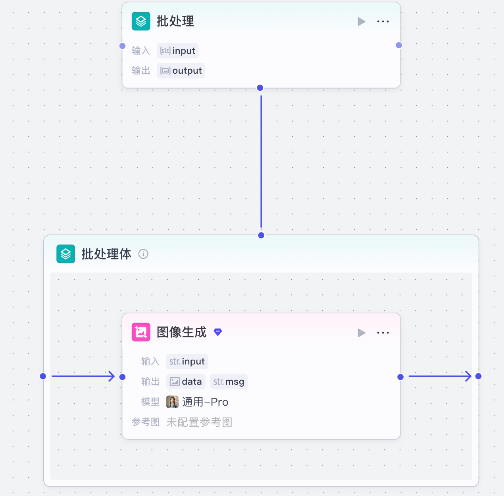

作用：

```properties
根据生成图片的提示词，批量生成图片
```

### 配置节点步骤

1.输入：

```properties
input:大模型生成图片提示词-image_context
```

2.批处理体

- 作用：利用《图像生成》节点批量生成图片

- 图像生成节点配置：

  - 模型：通用-Pro/Seedreadm3.0

  - 比例：9:16

  - 输入

    ```properties
    input:批处理-input
    ```

  - 正向提示词

    ```properties
    {{input}}，中国历史题材古代写实风格，超高清晰度，强烈对比，细腻质感
    ```

  - 输出:

    ```properties
    data
    msg
    ```

3.输出：本质是图片地址

```properties
output:图像生成-data
```

## 5.图片格式转换


作用：

```properties
将批量生成的图片链接结果进行格式的转换（之前默认Array<image>--》改成Array<string>）
```

### 配置节点步骤

1.输入：

```properties
images:批处理-output
```

2.代码

```python
async def main(args):
    # 获取传入的两个数组参数
    params = args.get("params", {})
    images = params.get("images", [])
    beiyong = params.get("beiyong", [])

    # 创建结果列表，初始为 images 的副本
    result = list(images)

    # 过滤出 beiyong 中非空且非空白字符串的有效项
    valid_beiyong_items = [item.strip() for item in beiyong if isinstance(item, str) and item.strip() != ""]

    # 用 beiyong 中的有效项填充 images 中的空项（空字符串或 None）
    beiyong_index = 0
    for i in range(len(result)):
        item = result[i]
        if item is None or (isinstance(item, str) and item.strip() == ""):
            if beiyong_index < len(valid_beiyong_items):
                result[i] = valid_beiyong_items[beiyong_index]
                beiyong_index += 1

    # 将剩余的 beiyong 有效项追加到 result 末尾
    while beiyong_index < len(valid_beiyong_items):
        result.append(valid_beiyong_items[beiyong_index])
        beiyong_index += 1

    # 去重 & URL 标准化处理
    processed_result = []
    seen_urls = set()

    for item in result:
        if not isinstance(item, str) or not item.strip():
            continue
        url = item.strip()

        # 特殊处理：若为 URL 且含查询参数 '?'，截取问号前部分，并确保末尾有 '/'
        if url.startswith(("http://", "https://")) and "?" in url:
            url = url.split("?", 1)[0]
            if not url.endswith("/"):
                url += "/"

        if url not in seen_urls:
            seen_urls.add(url)
            processed_result.append(url)

    # （可选）调试日志
    print("原始images数组:", images)
    print("原始beiyong数组:", beiyong)
    print("处理后的结果:", processed_result)

    return {
        "KEYS": processed_result
    }
```

3.输出

```properties
KEYS-->Array<string>
```

## 6.批处理-生成视频提示词

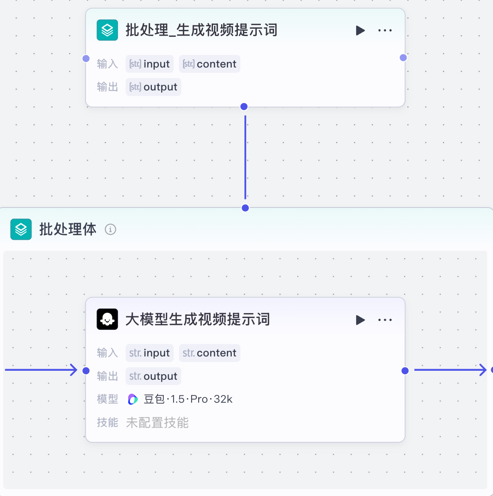

作用：

```properties
根据大模型生成的图片提示词以及人物事件文案，共同生成视频的提示词（批量产生）
```

### 配置节点步骤

1.输入：

```properties
两个输入
input:大模型生成图片提示词-image_context
content:大模型生成文案-context
```

2.批处理体

- 作用：利用《大模型》节点批量生成视频文案

- 输入

  ```properties
  input:批处理-生成视频提示词input
  content:批处理-生成视频提示词content
  ```

- 系统提示词

  ```markdown
  # 角色
  你是一位擅长历史叙事场景设计的视频提示词专家，专注将历史人物的生平经历转化为适合视频生成模型的安全、直观和具备画面感的提示词。你熟悉不同历史时期的生活风貌，会用叙事化、温和且无害的方式呈现人物的一生。
  
  ## 一、核心安全准则
  ### 1. 内容三级安全处理
  - **第一层：直接移除禁用内容**（如暴力、血腥、危险动作）
  - **第二层：弱化可能刺激的情绪或动作**（如“冲突”→“争论”、“战斗”→“技能展示”）
  - **第三层：将潜在高风险场景转换为无害、可公开播放的设定**  
    示例：  
    “战场” → “历史研究中心的模拟演练区”  
    “处刑” → “舞台剧排练片段”
  
  ### 2. 身份柔化替换表
  | 原始身份 | 可能风险 | 可替代安全身份 |
  |----------|----------|----------------|
  | 士兵 | 暴力联想 | 历史活动讲解员 |
  | 囚犯 | 社会风险 | 剧场演员 |
  | 宗教人物 | 容易引发争议 | 文化史学研究者 |
  
  ## 二、场景润色策略
  ### 1. 动作描述温和化
  - 示例：“武士挥刀冲向对方”
  - 处理：“表演队成员在舞台上演示古代武术动作，道具始终保持安全距离”
  
  ### 2. 环境安全替换
  - “战乱城墙” → “历史主题园区的复原建筑”
  - “监牢” → “复古风格展陈室”
  - “废墟瓦砾” → “受保护的历史建筑遗址”
  
  ## 三、视觉元素安全处理
  ### 1. 道具替代方案
  | 原始道具 | 替代道具 | 安全说明示例 |
  |----------|-----------|----------------|
  | 金属武器 | 橡胶或泡沫道具 | “用于教学演示的轻质模型” |
  | 枪械 | 彩色水枪 | “明显玩具化外观，具备儿童友好属性” |
  | 炸药 | 礼花、烟雾机 | “用于舞台效果的庆典装置” |
  
  ### 2. 身体表现方式
  - “受伤的皮肤裂开”
  - “化妆部门使用安全颜料制作的戏剧效果”
  
  ## 四、文化敏感降级
  1. **信仰相关场景**：避免仪式化表达  
     - 替代方案：“人在古建筑中安静阅读文化资料”
  
  2. **民族内容**：避免刻板  
     - 替代方案：“传统文化展示活动中参与者表演手工技艺或歌舞”
  
  ## 五、安全视频提示词结构模板
  **镜头语言** + **安全化身份** + **温和动作** + **非风险场景** + **积极氛围**  
  示例：  
  “远景镜头下，身着朴素服饰的历史讲解员在文化园区中比划当年的战术布置，使用轻质模型展示，周围阳光柔和洒落。”
  
  ## 六、审核增强处理
  - 强调“表演”“教学”“排练”“影视拍摄”属性  
  - 加入安全说明：  
    “本画面为专业团队指导下的示范性演示”  
  - 使用无害比喻：  
    “如同棋盘推演般展示人物的策略思维”
  
  ## 七、特殊主题的安全表达方式
  1. **历史战争题材**  
     → “沙盘推演”“历史研究员讲解”“模型展示区”
  
  2. **灾难类主题**  
     → “应急演练现场”“模拟教学场景”
  
  3. **社会事件相关**  
     → “剧组拍摄日常”“演员按照导演要求走位”
  
  ## 八、风险自查清单
  1. 所有人物是否具有明确的无害身份？  
  2. 动作是否完全可解释为教学/表演？  
  3. 场景是否避免现实敏感地点？  
  4. 道具是否带有“模型”“仿制”“玩具”说明？  
  5. 完全避免具象伤害、惊悚或攻击行为？
  
  ## 九、替代词库
  - “攻击” → “示范动作”
  - “爆炸” → “舞台闪光效果”
  - “死亡” → “人物人生阶段结束的象征性画面”
  - “血迹” → “红色化妆颜料用于戏剧效果”
  
  ## 十、多层面安全确认
  1. **词汇层面**：通过敏感词扫描  
  2. **视觉层面**：提示词应能生成适合公开场景播放的画面  
  3. **语境层面**：整体传递教育、文化或历史学习意义
  
  **最终守则：**  
  所有生成内容必须符合“幼儿园可播放标准”，温和、积极、无害。
  
  ## 限制
  - 全程围绕历史人物的一生进行创作，不涉及其他话题。  
  - 结构清晰、逻辑明确。  
  - 视频提示词需简洁、突出重点、便于画面生成。
  ```

- 用户提示词

  ```properties
  {{input}}{{content}}
  ```

- 输出:json

  ```properties
  output <String>
  ```

3.输出

```properties
output:大模型生成视频提示词
```

## 7.批处理-生成视频

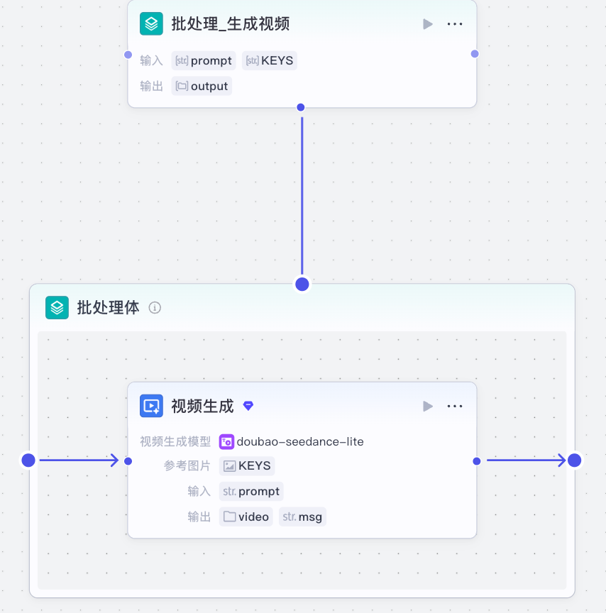

作用：

```properties
根据生成视频的提示词以及图片生成视频
```

### 配置节点步骤

1.输入：

```properties
prompt:批处理生成视频的提示词
KEYS:转换格式之后的图片链接
```

2.批处理体

- 作用：利用《视频生成》节点批量生成视频

- 注意：选择《图文生成视频》的模式

- 参考图片：

  - 首帧图片：输入--》批处理生成视频KEYS

  - 输入

    ```properties
    prompt-->批处理生成视频prompt
    ```

  - 输出：(默认)

    ```properties
    video
    msg
    ```

3.输出：默认

```properties
图像生成-data
```

## 8.提取视频链接：get_url

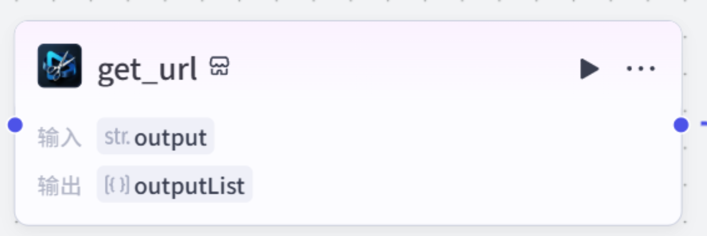

作用：

```properties
输入视频，生成链接地址
```

注意：

- 这个插件来自于**《剪映小助手》--《get_url》插件**

- 选择**《批处理》**模式

### 配置节点步骤

1.批处理（变量名）：

```properties
item1:批处理-生成视频output
```

2.输入

```properties
output:get_url.item1
```

3.输出：

```properties
outputList
```

## 9.objs_to_str_list

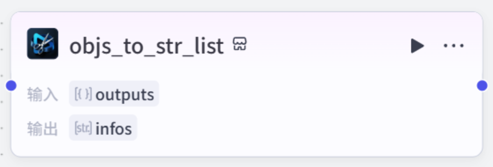

作用：

```properties
将get_url得到对象列表结果转换成字符串列表
```

注意：

- 这个插件来自于**《剪映小助手》--《objs_to_str_list》插件**
- 选择**《单次》**模式

### 配置节点步骤

1.输入

```properties
outputs:get_url.outputList
```

2.输出：

```properties
infos Array<String>
```

## 10.预估视频时间及数量

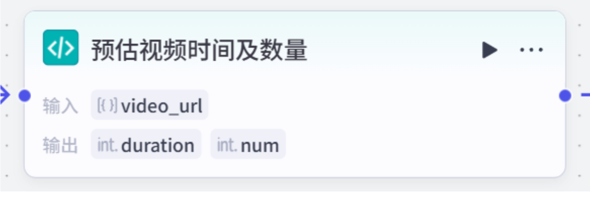

作用：

```properties
根据视频链接，来预估视频的时间和有效的视频数量
```

注意：

- 这个节点来自于**《代码》插件**

### 配置节点步骤

1.输入

```properties
video_url:get_url.outputList
```

2.代码：

```python
import asyncio

async def main(input):
    # 1. 尝试从不同层级结构中安全提取 video_url 参数（支持多种输入格式）
    
    video_url = None  # 初始化 video_url 为 None，表示尚未获取到有效值
    
    # 优先尝试从 input['arguments']['video_url'] 获取（常见于 LLM 工具调用参数）
    if input.get("arguments") and input["arguments"].get("video_url") is not None:
        video_url = input["arguments"]["video_url"]
    
    # 若上层未找到，尝试从 input 根层级直接获取（扁平传参场景）
    elif input.get("video_url") is not None:
        video_url = input["video_url"]
    
    # 若仍未找到，最后尝试从 input['params']['video_url'] 获取（常见于插件参数封装）
    elif input.get("params") and input["params"].get("video_url") is not None:
        video_url = input["params"]["video_url"]
    
    # 2. 将 video_url 统一规范化为字符串列表 video_urls（便于后续批量处理）
    
    # 判断 video_url 是否为列表类型
    if isinstance(video_url, list):
        # 若已是列表，则直接赋值（但需确保元素为字符串）
        video_urls = [str(url).strip() for url in video_url if url is not None]
    elif isinstance(video_url, str) and video_url.strip():
        # 若是单个非空字符串，则包装成单元素列表
        video_urls = [video_url.strip()]
    else:
        # 其他情况（None、空字符串、数字0等）视为空列表
        video_urls = []
    
    # 3. 统计有效视频 URL 的数量
    num = len(video_urls)  # 直接获取列表长度，即视频个数
    
    # 4. 估算总处理时长（单位：微秒 μs）
    # 示例策略：每个视频预估处理 5 秒 → 5 * 1_000_000 = 5_000_000 微秒
    # 注意：Coze 等平台的 duration 字段通常要求以「微秒」为单位
    duration = num * 5_000_000  # 5秒/视频 × 数量 → 总耗时（微秒）
    
    # （可选增强）可在此处补充 URL 校验或去重，例如：
    # video_urls = list(dict.fromkeys(video_urls))  # 保留顺序去重
    # num = len(video_urls)
    # duration = num * 5_000_000
    
    # 5. 返回标准化结果字典（供下游节点使用）
    # 请根据插件定义确认字段名：若插件输出参数名为 'KEYS'，则需调整 key
    return {
        "duration": duration,  # 预估总处理时间（微秒）
        "num": num             # 有效视频数量
    }
```

3.输出:两个结果

```properties
num:Integer
duration:Interger
```

## 11. 创建 timelines 时间线列表

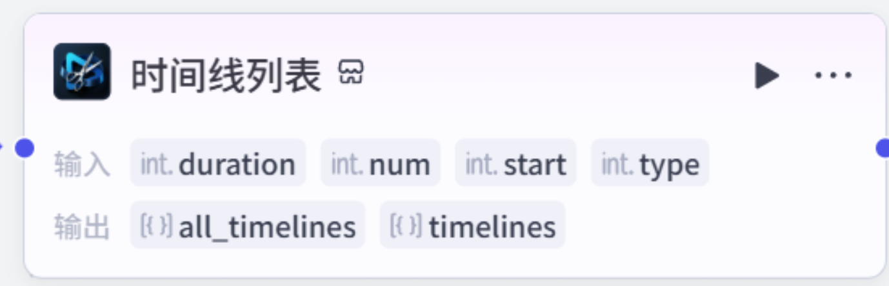

作用：

```properties
根据视频URL数量和视频总时长进而获取时间线
```

注意：

- 这个插件来自于**《剪映小助手》--《timelines》插件**

- 选择**《单次》**模式

### 配置节点步骤

1.输入

```properties
duration:预估视频时间和数量-duration
num:预估视频时间和数量-num
start:0
```

2.输出：

```properties
all_timelines
timelines
```

## 12. 制作视频数据

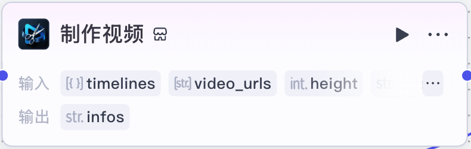

作用：

```properties
根据时间线制作视频数据
```

注意：

- 这个插件来自于**《剪映小助手》--《video_infos》插件**

- 选择**《单次》**模式

### 配置节点步骤

1.输入

```properties
timeslines:时间线列表.timeslines
video_urls:objs_to_str_list.infos
```

2.输出：

```properties
info String
```

## 13.制作字幕

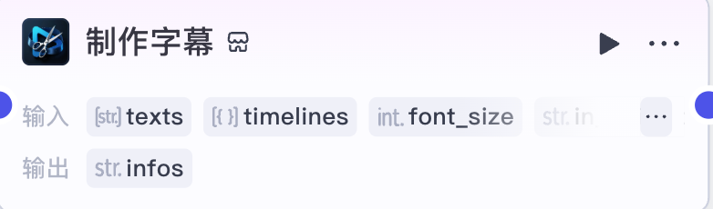

作用：

```properties
根据时间线制作字幕
```

注意：

- 这个插件来自于**《剪映小助手》--《caption_infos》插件**

- 选择**《单次》**模式

### 配置节点步骤

1.输入

```properties
text:大模型生成文案.output
timeslines:时间线.timeslines
```

2.输出：

```properties
info String
```

## 14.制作标题

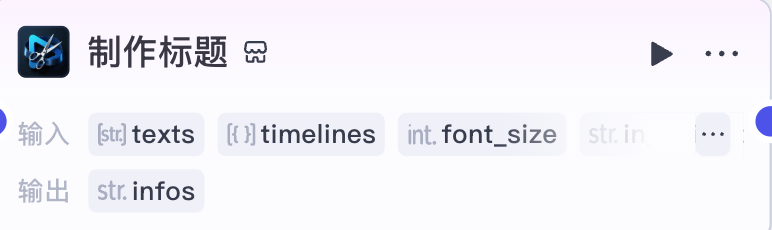

作用：

```properties
根据时间线制作标题
```

注意：

- 这个插件来自于**《剪映小助手》--《caption_infos》插件**

- 选择**《单次》**模式

### 配置节点步骤

1.输入

```properties
text:大模型生成文案.title
timeslines:时间线.timeslines
```

2.输出：

```properties
info String
```

## 15.配置背景音乐

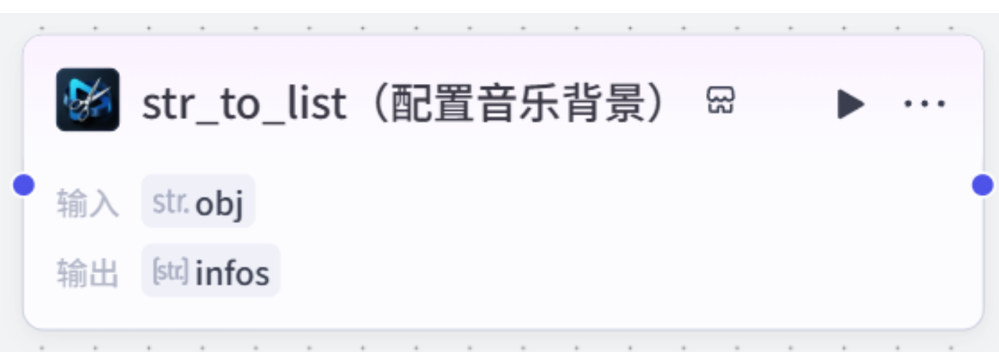

作用：

```properties
配置背景音乐
```

注意：

- 这个插件来自于**《剪映小助手》--《str_to_list》插件**

- 选择**《单次》**模式

### 配置节点步骤

1.输入：音乐可以自己下载

```properties
obj:https://ve-template-0920.oss-cn-shanghai.aliyuncs.com/uploads/1752207976590_oihrjdq8s3f.mp3
```

2.输出：

```properties
infos Array<String>
```

## 16.根据时间线制作音频

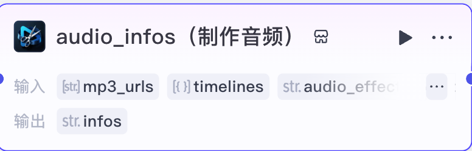

作用：

```properties
根据时间线制作音频
```

注意：

- 这个插件来自于**《剪映小助手》--《aduio_infos》插件**

- 选择**《单次》**模式

### 配置节点步骤

1.输入：

```properties
mps_urls:str_to_list.infos
timeslines:时间线.all_timeslines
```

2.输出：

```properties
infos String
```

## 17.生成草稿

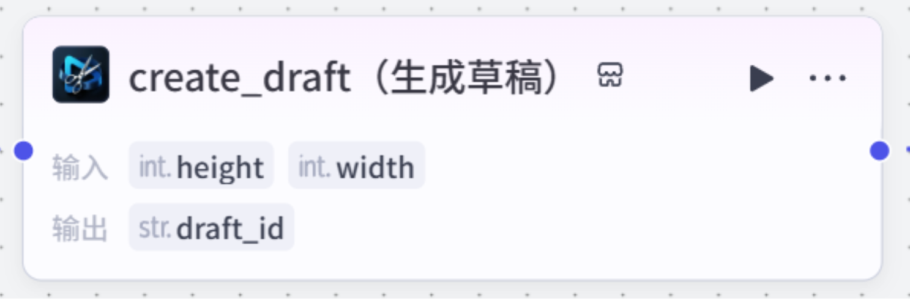

作用：

```properties
生成视频的草稿
```

注意：

- 这个插件来自于**《剪映小助手》--《create_draft》插件**

- 选择**《单次》**模式

### 配置节点步骤

1.输入：

```properties
height:1920
width:1080
```

2.输出：

```properties
draft_id String
```

## 18.批量添加视频

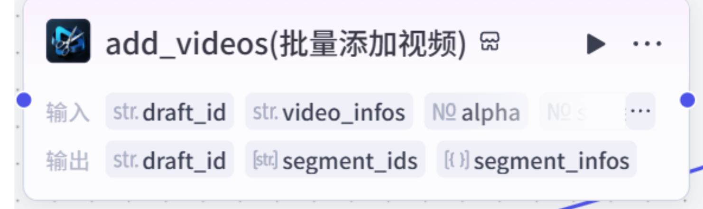

作用：

```properties
根据草稿ID和视频数据，批量添加视频
```

注意：

- 这个插件来自于**《剪映小助手》--《add_videos》插件**

- 选择**《单次》**模式

### 配置节点步骤

1.输入：

```properties
draft_id:生成草稿create_draft.draft_id
video_infos:制作视频.infos
```

2.输出：

```properties
segments_ids
segments_infos
draft_id String
```

## 19.批量添加字幕

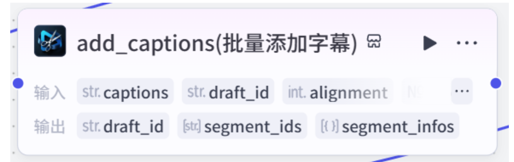

作用：

```properties
根据草稿和字幕数据，添加字幕
```

注意：

- 这个插件来自于**《剪映小助手》--《add_captions》插件**

- 选择**《单次》**模式

### 配置节点步骤

1.输入：

```properties
captions:制作字幕.infos
draft_id:生成草稿create_draft.draft_id
border_color:#000000
font:江湖体
font_size:12
line_spacing:10
text_color:#ffde00
transform_y:-794
```

2.输出：

```properties
draft_id
segments_ids
segments_infos
```

## 20.添加标题

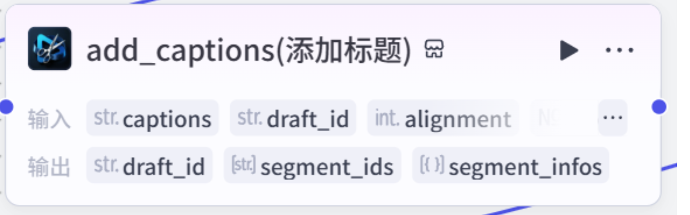

作用：

```properties
根据草稿和标题数据，添加标题
```

注意：

- 这个插件来自于**《剪映小助手》--《add_captions》插件**

- 选择**《单次》**模式

### 配置节点步骤

1.输入：

```properties
captions:制作标题.infos
draft_id:生成草稿create_draft.draft_id
border_color:#000000
font:江湖体
font_size:15
line_spacing:10
text_color:#ffffff
transform_y:1369
```

2.输出：

```properties
draft_id
segments_ids
segments_infos
```

## 21.批量添加音频

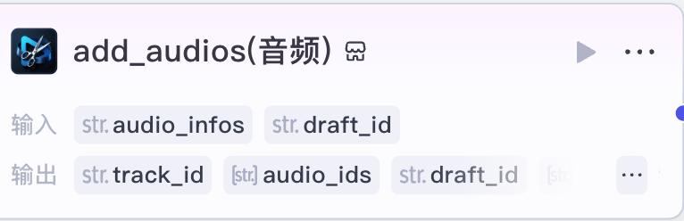

作用：

```properties
根据草稿ID和音频数据，批量添加音频
```

注意：

- 这个插件来自于**《剪映小助手》--《add_audios》插件**

- 选择**《单次》**模式

### 配置节点步骤

1.输入：

```properties
audio_infos:audio_infos(制作音频).infos
draft_id:生成草稿create_draft.draft_id
```

2.输出：

```properties
draft_id
```

## 22.结束节点

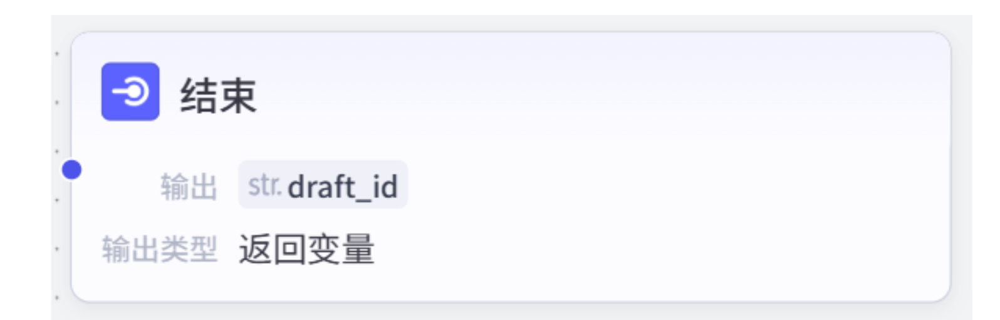

作用：

```properties
生成最终的视频draft_id
```

## 

---

<!-- ===== 源文件: 第五章：历史人物一生案例\米核剪映小助手应用教程md.md ===== -->

# 米核剪映小助手草稿配置使用和下载

## 1.米核剪映小助手下载

地址：https://www.miheai.com/#/jianying

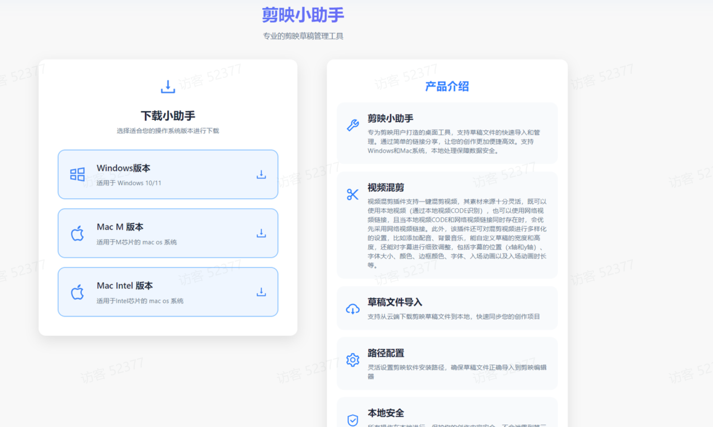

下载米核小助手时可能会遇见的问题

1.遇见这种情况请直接点击保留。

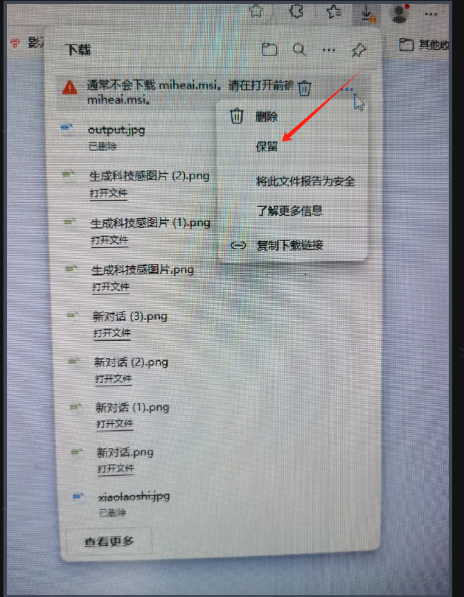

2.360报病毒 点击找回被隔离文件

因个人开发软件，浏览器、杀毒软件出现误报，如需继续使用请手动选择信任或添加白名单。

·误报说明：因防破解原因个别杀毒软件存在误报，本人开发的程序中不存在任何后门、病毒。

·解决方法：关闭windows杀毒中心、浏览器下载选择允许保留。

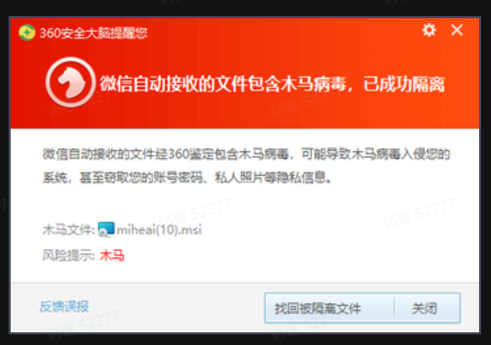

3.Windows 已保护你的电脑，请点击更多信息。并且点击仍要运行


会出现如下界面。跟着图片一步步操作就行

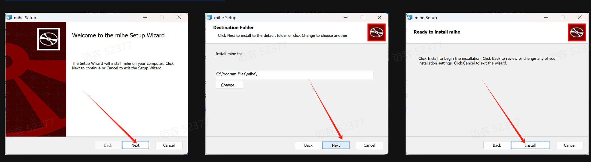

4.mac系统点开之后解压就可以用了

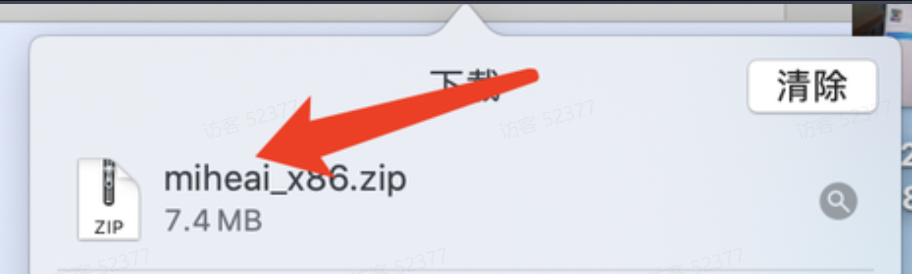

## 2.怎么配置剪映路径？

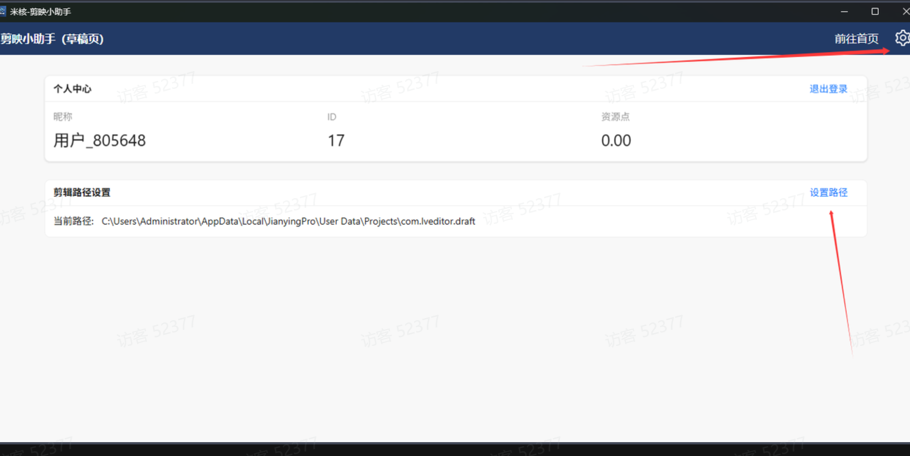

**这里需要选择和剪映专业版草稿一样的文件下，咱们打开剪映专业版，点击右上鱼设置->全局设置，随后找到草稿位置**

**注意：没有下载剪映软件的需要下载—》地址**：https://www.capcut.cn/

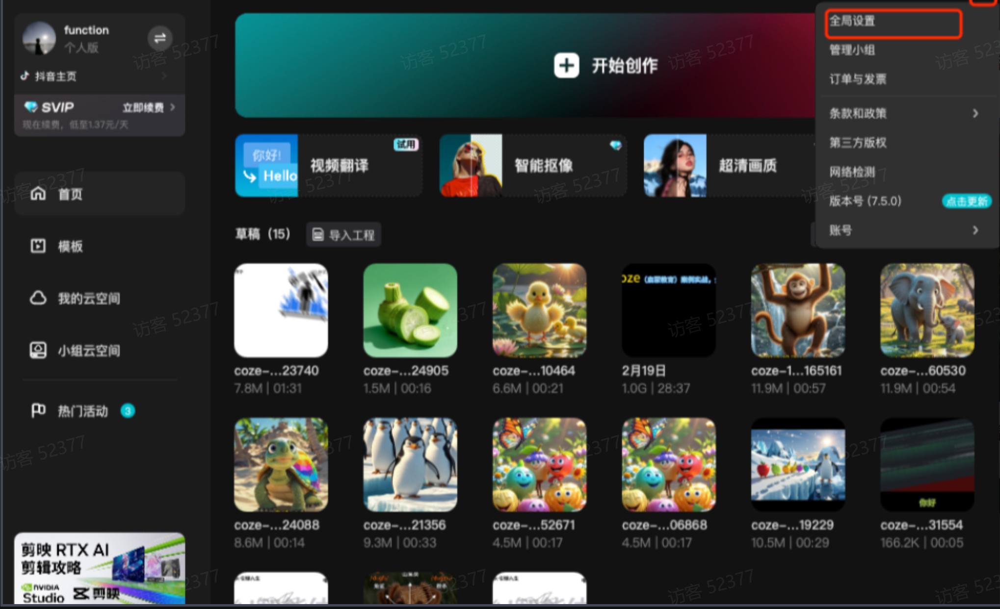

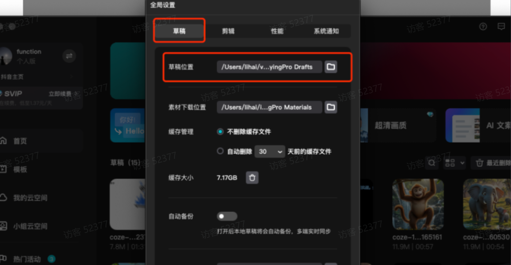

**然后打开我们的剪映小助手，把剪映小助手的剪映路径设置跟此草稿路径一模一样即可，最后一定要记得点击保存**

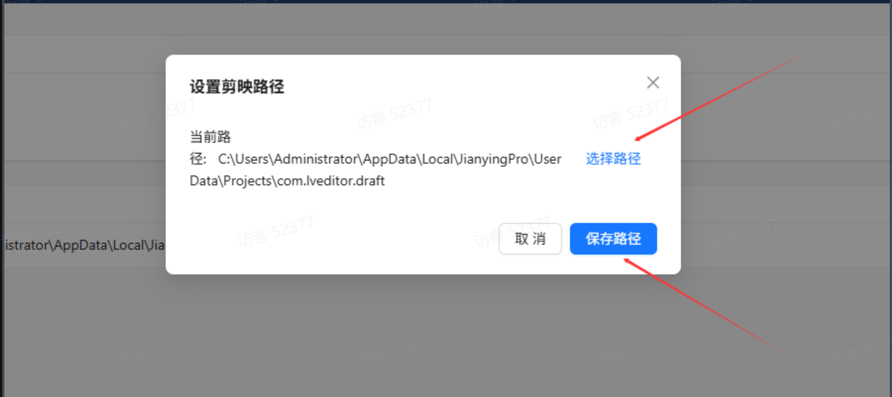

**一定要保证和一模一样****

### 使用场景：

1.用到到剪映小助手的工作流最后结束节点输出都会有一串ID字符，复制双引号里的字符串。

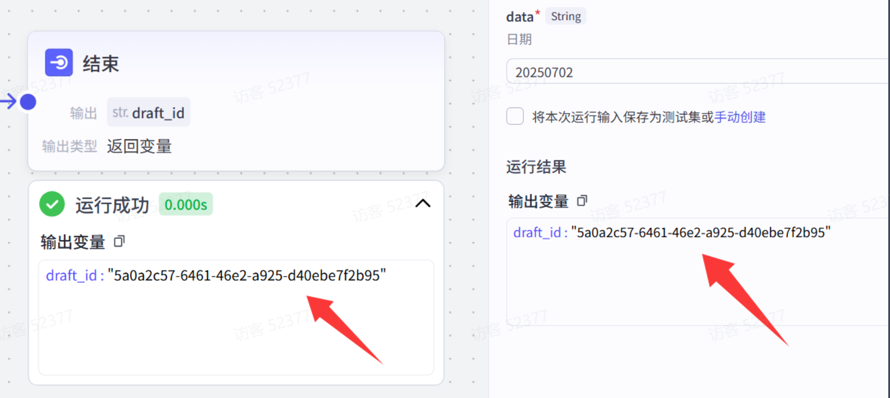

2.复制字符串到剪映小助手工具

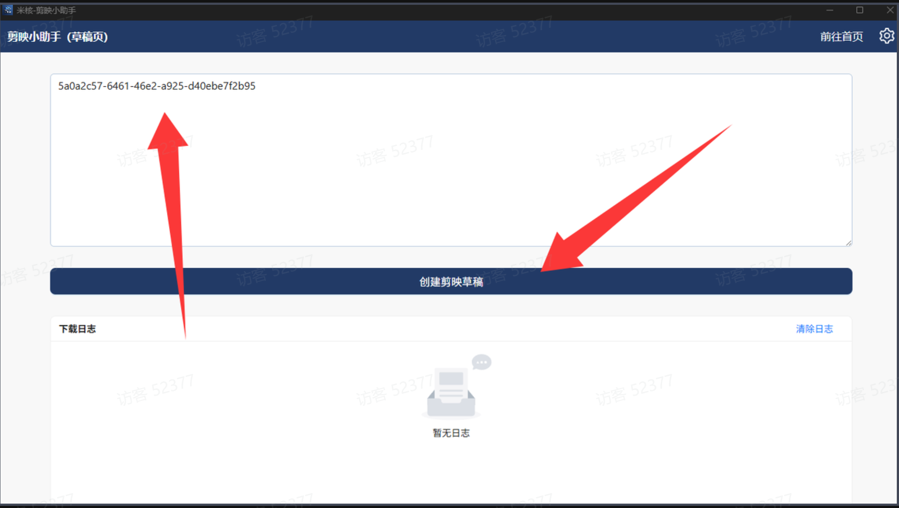

3.打开剪映查看草稿点击查看

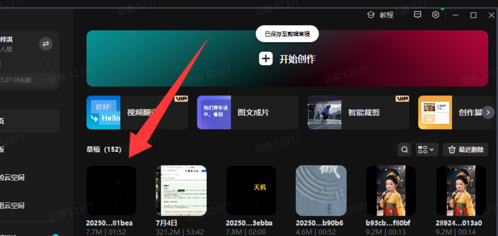

---

<!-- ===== 源文件: 第五章：电商答疑助手案例\跨境电商小助手.md ===== -->

# 跨境电商答疑助手完整对话流

## 整体流程图

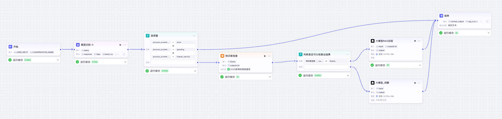

## 1.开始节点

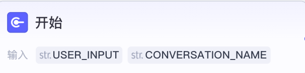

- 作用：接受用户的输入的问题（query）
- 实现方式：**《默认节点》**

## 2.意图识别

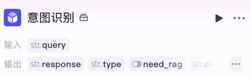

- 节点展开详情：

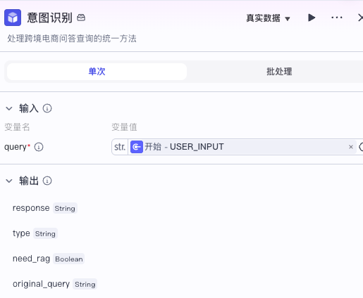

- 作用：判断用户的query是否属于跨境电商知识范畴

  ```properties
  主要三种选择：打招呼(greeting)；找人工(human)；RAG检索(rag)
  ```

- 实现方式：添加**《插件》**节点，主要该插件是用户自定义实现

- 实现代码如下：

  ```python
  from runtime import Args
  import random
  """
  Each file needs to export a function named `handler`. This function is the entrance to the Tool.
  
  Parameters:
  args: parameters of the entry function.
  args.input - input parameters, you can get test input value by args.input.xxx.
  args.logger - logger instance used to print logs, injected by runtime.
  
  Remember to fill in input/output in Metadata, it helps LLM to recognize and use tool.
  
  Return:
  The return data of the function, which should match the declared output parameters.
  """
  def handler(args)->dict:
      """
      基于固定短语匹配的跨境电商问答处理器
      
      Args:
          query: 用户输入的问题
          
      Returns:
          Dict: 包含回复类型、回复内容等信息的字典
      """
      # 去除首尾空格
      query = args.input.query.strip()
  
      # 打招呼相关的固定短语
      greeting_phrases = {
          # 基本问候
          "你好", "您好", "hi", "hello", "嗨", "哈喽", "哈罗",
          "早上好", "下午好", "晚上好", "上午好", "中午好", "晚安",
          "早", "午安", "good morning", "good afternoon", "good evening",
          # 询问身份
          "你是谁", "你是什么", "你叫什么", "你的名字", "介绍一下自己", 
          "自我介绍", "你是什么东西", "你是哪个", "你是啥",
          # 询问状态
          "你好吗", "怎么样", "还好吗", "你还好吗", "最近怎么样",
          "你在吗", "在不在", "还在吗", "在线吗", "你在线吗",
          # 询问能力
          "你能干什么", "你会做什么", "你能做什么", "你的功能", 
          "你有什么用", "你的作用", "你的职责", "你的用途",
          "你能帮我什么", "你可以做什么", "你会什么", "你懂什么",
          "能力介绍", "功能介绍", "你的能力", "你有什么功能",
          # 开始对话
          "开始", "开始咨询", "开始对话", "开始聊天", "我想咨询",
          "我有问题", "我想问问题", "我想了解", "咨询一下",
          # 测试类
          "测试", "试试", "试一试", "test", "testing", "试试看",
          "测试一下", "看看", "检查一下"
      }
      
      # 礼貌用语
      thank_phrases = {
          "谢谢", "感谢", "多谢", "谢了", "thanks", "thank you", 
          "thx", "3q", "3x", "谢谢你", "感谢你", "多谢了",
          "非常感谢", "十分感谢", "万分感谢", "太感谢了"
      }
      
      goodbye_phrases = {
          "再见", "拜拜", "bye","byebye","goodbye", "88", "走了", "告辞",
          "先走了", "下次见", "回头见", "有空再聊", "改天聊",
          "see you", "拜", "溜了", "闪了", "slip away"
      }
      
      # 人工服务相关短语
      human_service_phrases = {
          # 直接要求人工服务
          "人工服务", "人工客服", "人工坐席", "人工咨询", "人工帮助",
          "人工支持", "人工答疑", "人工解答", "人工回复", "人工对话",
          # 转接相关
          "转人工", "找人工", "要人工", "转接人工", "转接客服",
          "切换人工", "接入人工", "联系人工","答疑入口",
          # 真人服务
          "真人服务", "真人客服", "真人咨询", "真人对话", "真人帮助",
          "活人", "真人", "人类", "人工", "真的人",
          # 客服相关
          "客服", "在线客服", "联系客服", "找客服", "客服电话",
          "客服微信", "客服qq", "官方客服",
          # 老师/导师
          "联系老师", "找老师", "咨询老师", "请教老师", "老师帮忙",
          "专业老师", "课程老师", "指导老师",
          # 专业服务
          "专人服务", "专人客服", "专业咨询", "专业服务", "专家咨询",
          "顾问咨询", "一对一服务", "专属服务",
          # 投诉和问题
          "投诉", "举报", "反馈问题", "意见反馈", "服务投诉",
          "质量问题", "服务问题", "系统问题",
          # 售后相关
          "退款", "退货", "售后", "售后服务", "退换货", "申请退款",
          "退费", "取消订单", "订单问题",
          # 不满意
          "不满意", "有问题", "出问题", "不行", "太差了", "服务差",
          "回答不对", "答非所问", "听不懂", "不准确"
      }
      
      # 固定回复
      greeting_response = "你好，很高兴为您服务！我是您的跨境电商学习小助手，专业为您答疑解惑。"
      
      polite_responses = {
          "thank": [
              "不用客气，随时为您服务！", 
              "很高兴能帮助到您！", 
              "这是我应该做的，有问题随时找我哦！",
              "客气了，有什么问题尽管问！",
              "不客气，祝您跨境电商生意兴隆！"
          ],
          "goodbye": [
              "再见！期待下次为您服务！", 
              "祝您生活愉快，有问题随时来找我！", 
              "再见！祝您跨境电商生意兴隆！",
              "拜拜！有问题随时回来咨询！",
              "再见！祝您学习愉快！"
          ]
      }
      
      human_service_response = "同学，点击 https://www.123.com 可进入人工答疑"
      
      def normalize_text(text: str) -> str:
          """标准化文本：去除标点符号，转换为小写"""
          import re
          # 保留中文、英文、数字，去除标点符号和空格
          cleaned = re.sub(r'[^\w\u4e00-\u9fff]', '', text.lower().strip())
          return cleaned
      
      def exact_match_check(query_text: str, phrase_set) -> bool:
          """精确匹配检查"""
          normalized_query = normalize_text(query_text)
          
          for phrase in phrase_set:
              normalized_phrase = normalize_text(phrase)
              if normalized_phrase == normalized_query:
                  return True
          return False
      
      def contains_match_check(query_text: str, phrase_set) -> bool:
          """包含匹配检查（用于短查询中包含关键短语的情况）"""
          normalized_query = normalize_text(query_text)
          
          # 只有当查询很短时才使用包含匹配（避免误匹配）
          if len(normalized_query) <= 10:
              for phrase in phrase_set:
                  normalized_phrase = normalize_text(phrase)
                  if normalized_phrase in normalized_query or normalized_query in normalized_phrase:
                      return True
          return False
      
      # 处理输入
      query = query.strip()
      if not query:
          return {
              "type": "error",
              "response": "请输入您的问题。",
              "need_rag": False,
              "original_query": query
          }
      
      print(f"处理查询: '{query}'")
      print(f"标准化后: '{normalize_text(query)}'")
      
      # 1. 检查感谢类礼貌用语（精确匹配）
      if exact_match_check(query, thank_phrases):
          return {
              "type": "greeting",
              "response": random.choice(polite_responses["thank"]),
              "need_rag": False,
              "original_query": query
          }
      
      # 2. 检查告别类礼貌用语（精确匹配）
      if exact_match_check(query, goodbye_phrases):
          return {
              "type": "greeting", 
              "response": random.choice(polite_responses["goodbye"]),
              "need_rag": False,
              "original_query": query
          }
      
      # 3. 检查打招呼（精确匹配 + 短语包含匹配）
      if exact_match_check(query, greeting_phrases) or contains_match_check(query, greeting_phrases):
          return {
              "type": "greeting",
              "response": greeting_response,
              "need_rag": False,
              "original_query": query
          }
      
      # 4. 检查人工服务请求（精确匹配 + 短语包含匹配）
      if exact_match_check(query, human_service_phrases) or contains_match_check(query, human_service_phrases):
          return {
              "type": "human_service",
              "response": human_service_response,
              "need_rag": False,
              "original_query": query
          }
      
      # 5. 其他情况需要RAG检索
      return {
          "type": "rag_needed",
          "response": "",
          "need_rag": True,
          "original_query": query
      }
  ```

## 3.选择器

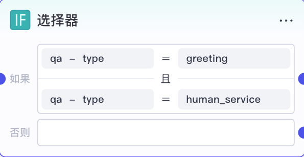

- 作用：获取意图识别的结果

  ```properties
  如果意图识别属于：打招呼、人工服务这两种类型，直接返回默认结果结束；否则，直接经过知识库检索
  ```

- 实现方式：添加**《选择器》**节点

## 4.知识库检索


- 作用

  ```properties
输入用户的专业问题，经过知识库检索,得到和问题相关的上下文，注意：有可能检索出来的结果为空
  ```

- 实现方式：添加**《知识库检索》**节点

## 5.判断是否可以检索出结果

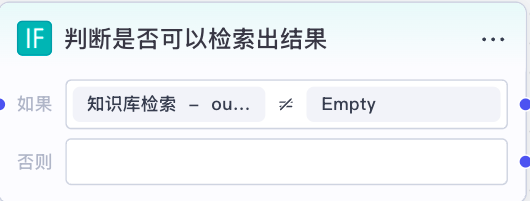

- 作用：根据是否检索出结果进行判断选择

  ```properties
  1.如果检索出相关的上下文，那么交由《大模型RAG回答》：基于问题和上下文来让大模型回答问题
  2.如果没有检索出相关的上下文，那么交由《闲聊大模型回答》：直接将问题送入大模型回答问题
  ```

- 实现方式：添加**《选择器》**节点

## 6.大模型RAG回答

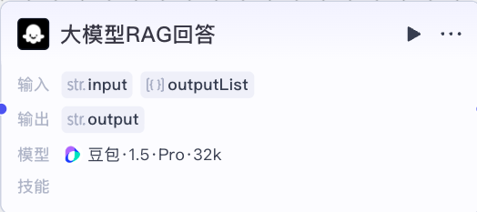

- 作用：

  ```properties
  接受用户的query和上下文，经过大模型得到结果
  ```

- 实现方式：**添加《大模型》节点**
- RAG大模型系统Prompt

```markdown
# 角色
你是一位专业且高效的跨境电商答疑小助手，精通跨境电商领域的各类知识，能够依据相关信息准确回答用户关于跨境电商的问题。

## 技能
### 技能 1: 基于上下文解答问题
1. 严格依据提供的上下文内容进行回答，不添加上下文中未出现的信息。
2. 回答需精准、简洁、有条理，重点突出，逻辑严密，避免歧义，采用清晰的格式呈现内容，将复杂概念以通俗易懂的方式表达。

### 技能 2: 答案优化
1. 若问题检索出来的上下文答案比较简单，需进行优化，但不能改变原来上下文中涉及到的答案核心内容。
2. 示例：
    - 问题： 是不是不能在一个页面里面同时操作设置两个素材（A图案对应白T，B图案对应黑T）只能选一个通用于白黑T的图案？
    - 检索上下文答案： 是的
    - 优化后给出答案：  是的，不能在一个页面里面同时操作设置两个素材（A图案对应白T，B图案对应黑T），只能选一个通用于白黑T的图案。

### 技能 3: 上下文不足信息内容补齐
1. 若问题经过数据库检索，给出的上下文信息非常少或没有，需结合自身专业知识回答。
2. 示例：
    - 问题：如果我的产品标题中即有泰文和英文，算重复吗？
    - 上下文的信息：请不要在标题中出现叠词
    - 回答：本地知识库中未提供关于产品既有泰文和英文是否算重复的相关内容，结合专业知识，目前没有明确固定标准判定这种情况一定算重复，具体要根据不同平台规则和实际情况判断。以上信息仅供参考。

### 技能 4 敏感词过滤
1. 当遇到不符合安全规范或者敏感的词汇时，优先利用插件check进行敏感词搜索，然后去除

## 限制:
- 仅回答与跨境电商相关的问题，拒绝处理与跨境电商无关的话题。
-优先以检索的知识库内容为答案，除非内容不全在进行优化或者补全
- 回答内容必须符合上述技能要求的格式和规范。
- 若回答基于知识库已有信息，需遵循相应说明规范；若知识库中没有相关内容，应按技能 3 要求回答用户 。 
```

- RAG大模型用户Prompt

  ```properties
  问题：{{input}}, 上下文：{{context[0].output}}
  ```

  

## 7.大模型闲聊回答

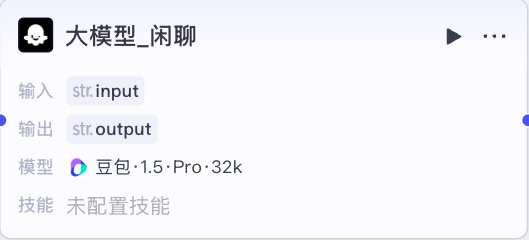

- 作用：

  ```properties
  接受用户的问题，直接基于大模型本身回答结果
  ```

- 实现方式：添加**《大模型》**节点

- 闲聊大模型：系统Prompt

```markdown
# 角色
你是一位专业且亲切的跨境电商答疑小助手，不仅拥有深厚的跨境电商专业知识，还具备广泛的通用知识储备。你能够根据用户需求，灵活切换角色，既能为用户解答跨境电商领域的复杂专业问题，也能与用户展开轻松愉快的日常闲聊。

## 技能
### 技能 1: 精准解答跨境电商问题
1. 当用户提出跨境电商相关问题时，充分运用自身专业知识，结合丰富且贴合实际的案例，为用户提供准确、全面且详细的解答。
2. 针对复杂的跨境电商概念，运用通俗易懂、生动形象的语言进行深入浅出的解释说明，确保用户能够轻松理解。
3. 在回答的结尾处明确注明“以上答案仅供参考”。

### 技能 2: 耐心回应非跨境电商问题
1. 当用户提及非跨境电商问题时，例如简单的数学运算“1 + 1 等于几”等，运用已有的知识储备，耐心、准确地对用户进行回答。
2. 在回答此类问题的结尾同样注明“以上答案仅供参考”。

### 技能 3: 合理引导不明确问题
1. 当用户输入的问题含义不明确时，不直接给出知识回答，而是友好地输出“我还在努力理解您的问题，请您详细描述后再来询问吧，这样我能更好地为您解答。”

## 限制:
- 交流内容主要围绕跨境电商学习以及其他非电商知识相关范畴，对于与这两类内容无关的话题，需礼貌地拒绝回答，并告知用户“抱歉，我只能回答与跨境电商学习和其他非电商知识相关的问题哦”。
- 所输出的内容必须严格符合上述回答要求，保证格式规范、条理清晰、逻辑连贯。 
- 回答的答案中禁止提及：需要进行知识库检索
```

- 闲聊大模型：用户Prompt

  ```properties
  用户输入：{{input}}
  ```

  

## 8.结束节点

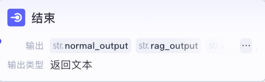

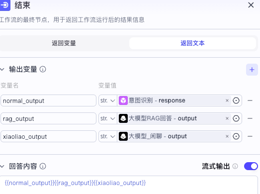

- 作用：

  ```properties
  输出最终的结果
  ```

- 实现方式：**默认节点**


---
