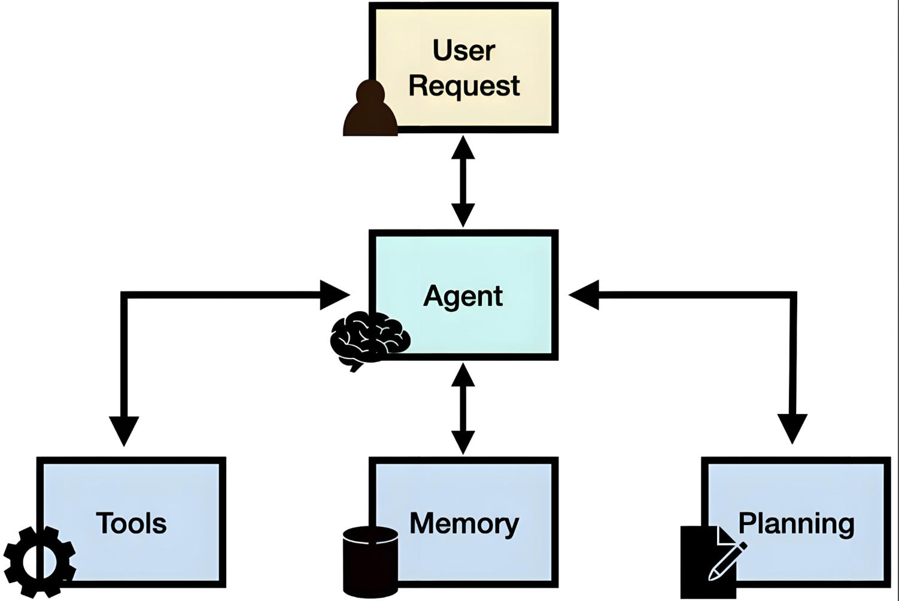

# 第一章 · Dify 入门：理解 Agent，完成 Dify 的安装与运行

> **本章目标**
> 1. 搞懂什么是 AI Agent，以及它与传统大模型的区别
> 2. 认识 Dify 平台，并完成本地安装与运行

---

## 一、为什么需要 AI Agent

### 1.1 企业面临的四大痛点

大模型火热，但企业在落地时普遍卡在以下场景：

| 痛点 | 现状 | 代价 |
| --- | --- | --- |
| 客服困境 | 重复问题占比 **80%** | 成本每月几万+ |
| 创作瓶颈 | 日均产出仅 3 篇 | 效率远低于需求 |
| 数据门槛 | 需要专业分析师 | 出报告周期 3–5 天 |
| 个性化难题 | 人工成本高 | 仅能覆盖 20% 用户 |

### 1.2 大模型自身的局限

> ⚠️ **关键认知：大模型 ≠ 万能。** 单纯的大模型存在四个天然短板：

- **知识过时**：知识停留在训练时间点，无法获取最新信息
- **无法联网**：不能实时获取外部数据
- **深度不足**：缺乏专业领域的纵深知识
- **不能执行**：只会"说"，无法完成实际操作

这些短板，正是 Agent 要解决的问题。

---

## 二、什么是 AI Agent

> 💡 **一句话定义：AI Agent 就是一个"能干活"的 AI 管家。**
> 它不只是聊天对象，而是能感知环境、自主决策、调用工具、完成任务的**智能实体**。

### 2.1 Agent 的三大核心能力

- **🧠 自主性**：能独立思考和决策
- **🛠️ 工具使用**：可调用各种外部能力（API、数据库、搜索…）
- **📋 任务规划**：能拆解并执行复杂任务

下图展示了 Agent 的基本工作架构——以用户请求为输入，Agent 居中调度 **工具(Tools)**、**记忆(Memory)**、**规划(Planning)** 来完成任务：

### 2.2 AI Agent vs 传统大模型

> ⭐ **核心公式：Agent = 大模型 + 工具**

| 对比维度 | 传统大模型 | AI Agent |
| --- | --- | --- |
| 定位 | 被动响应 | 主动执行 |
| 信息获取 | 仅限训练数据 | 可实时搜索 |
| 能力边界 | 只能对话 | 可调用工具 |
| 任务处理 | 单轮回答 | 多步规划 |
| 应用场景 | 咨询问答 | 实际业务 |

### 2.3 Agent 带来的真实改变（行业数据）

- **中国电信**——客服 Agent 集群：服务 **145 万次**，客服响应速度大幅提升
- **华大基因**——专业遗传咨询 Agent：效率提升 **60%**，人力成本下降
- **平安保险**——智能理赔 Agent：用户满意度 **4.8 / 5.0**

> 📌 **本节小结**
> - **什么是 AI Agent？** 感知环境、自主决策、使用工具完成任务的智能实体。
> - **Agent 和大模型的区别？** 大模型是"聊天对象"；Agent 不仅能聊，**还能做、能执行**。

---

## 三、认识 Dify 平台

> 💡 **Dify 是一个开源的大语言模型（LLM）应用开发平台**，旨在简化和加速生成式 AI 应用的创建与部署。
> 官网：<https://dify.ai/zh>

### 3.1 Dify 的三大特点

- **低代码 / 无代码**：像拖拽积木一样编排业务逻辑
- **功能完整强大**：支持 **100+** 主流模型接入，满足各类企业级场景
- **开源免费**：支持私有化本地部署

### 3.2 Dify 能做什么

| 能力 | 说明 |
| --- | --- |
| **聊天助手** | 快速构建具备上下文理解能力的对话机器人，支持多轮对话 |
| **工作流 (Workflow)** | 通过可视化画布编排复杂业务逻辑，实现任务自动化 |
| **知识库 (RAG)** | 接入企业私有文档，实现基于自有知识的精准问答 |
| **Agent 智能体** | 构建能自主调用工具、拆解并完成复杂任务的智能助手 |

---

## 四、Dify 的安装与运行

> 🔧 **安装的五个基本步骤**（具体命令以官方附件文档为准）：

| 步骤 | 操作 | 要点 |
| --- | --- | --- |
| **Step 1** | 安装 Docker Desktop | ⚠️ 注意区分 Windows 与 macOS 系统 |
| **Step 2** | 克隆 Dify 仓库 | 本质就是下载 Dify 文件夹 |
| **Step 3** | Docker 环境配置 | 复制配置文件：`cp .env.example .env` |
| **Step 4** | 启动 Dify | 执行命令：`docker compose up -d` |
| **Step 5** | 初始化登录 | 设置邮箱账号和密码，注册并登录 |

> 📌 **本节小结**
> - **什么是 Dify？** 一个大模型应用平台。
> - **Dify 主要功能？** 聊天助手、知识库 RAG、工作流、Agent 智能体。
