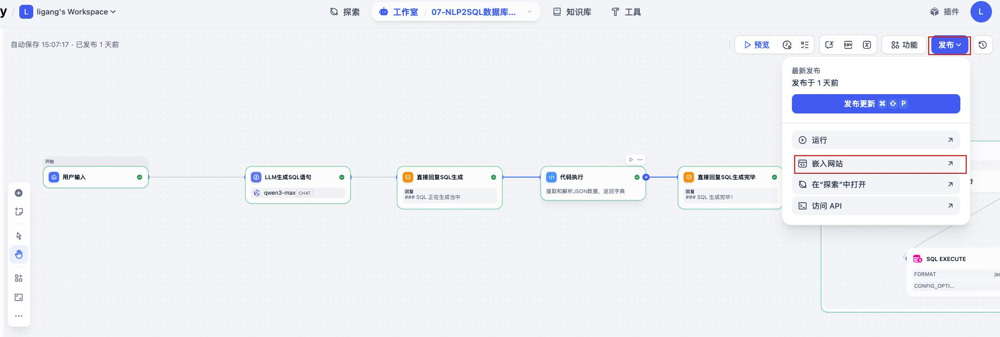
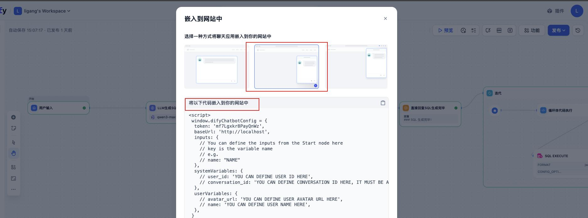
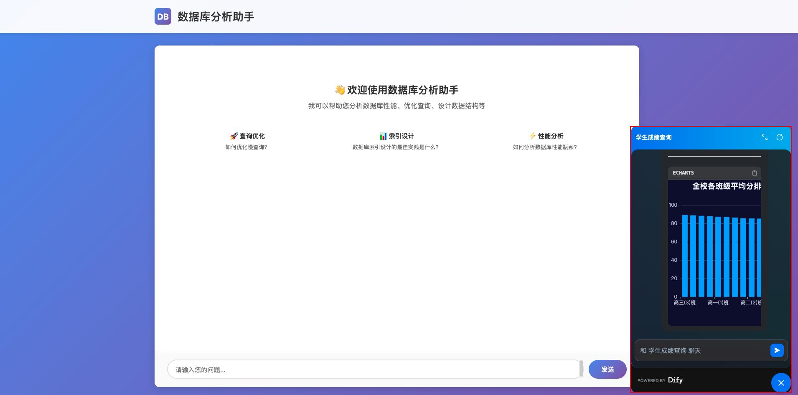
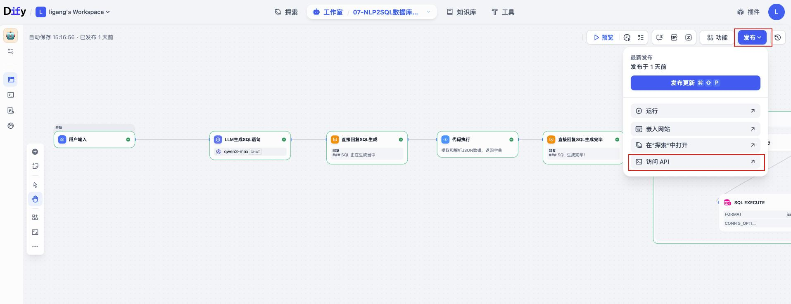
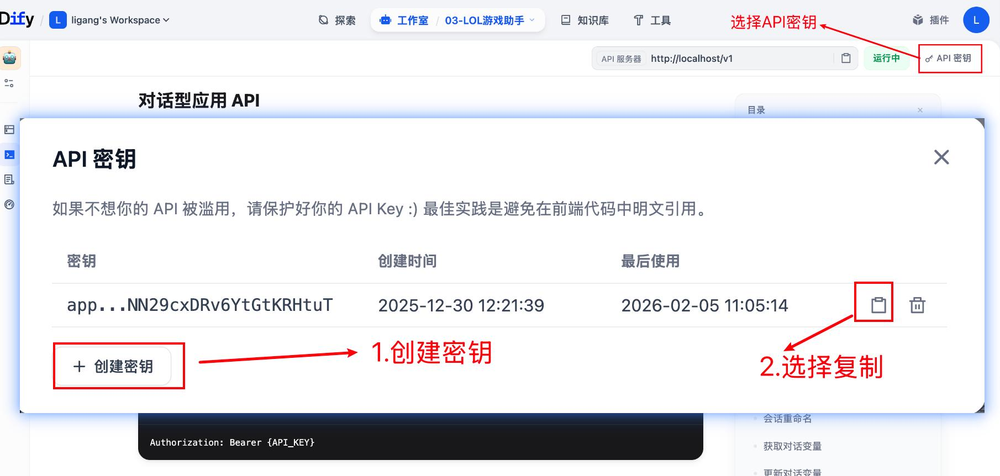
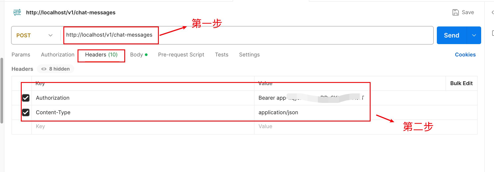
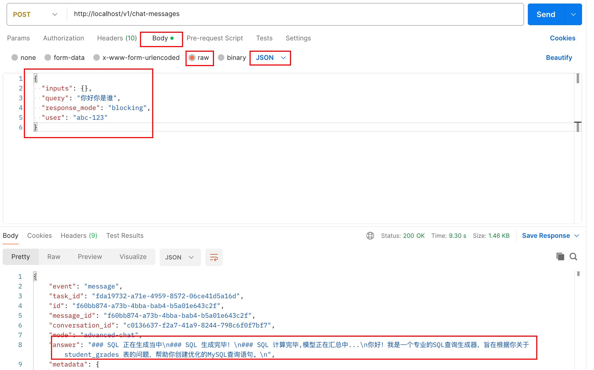

# 第七章 · Agent 发布：嵌入网站与访问 API

> **本章目标**
> 掌握 Agent 构建完成后的两种对外发布方式：
> 1. **嵌入网站**（把聊天窗口挂到自己的网页上）
> 2. **访问 API**（通过接口在程序中调用 Agent）

> 本章统一以 **nlp2sql 数据分析助手** 为例进行演示。

---

## 一、嵌入网站

### 1.1 打开 Agent 并选择发布

打开 Agent，点击右上角"发布"：

### 1.2 选择嵌入方式

> 💡 在发布选项中**选择第二种方式：嵌入网站中**，复制生成的代码片段到自己的网页。

### 1.3 测试运行

嵌入成功后，网页**右下角会显示聊天窗口**，点击即可对话：

---

## 二、访问 API

### 2.1 打开 Agent 并选择发布

同样打开 Agent，选择发布：

### 2.2 获取 API Key

> ⚠️ **重点：API Key 是调用接口的凭证**，需先创建并妥善保管。

### 2.3 使用 Postman 测试

打开 Postman，填入接口地址与 API Key 进行请求测试：

### 2.4 测试运行结果

---

## 三、Dify · Agent 全流程总结

> ⭐ **回顾整个 Dify-Agent 学习路线，共五个关键环节：**

| 环节 | 主题 | 重点 |
| --- | --- | --- |
| **1** | 提示词 | 提示词工程 |
| **2** | RAG | 知识库的构建和应用 |
| **3** | 工具制作 | 自定义插件 |
| **4** | 工作流 | 实现工作流的编排 |
| **5** | 让 Bot 应用 | 发布运营，触达用户 |

> 🎉 至此，从"理解 Agent"到"发布上线"的完整链路全部打通——
> **提示词 → RAG → 自定义工具 → 工作流 → 发布**，即可独立搭建并交付一个可用的 AI Agent。
