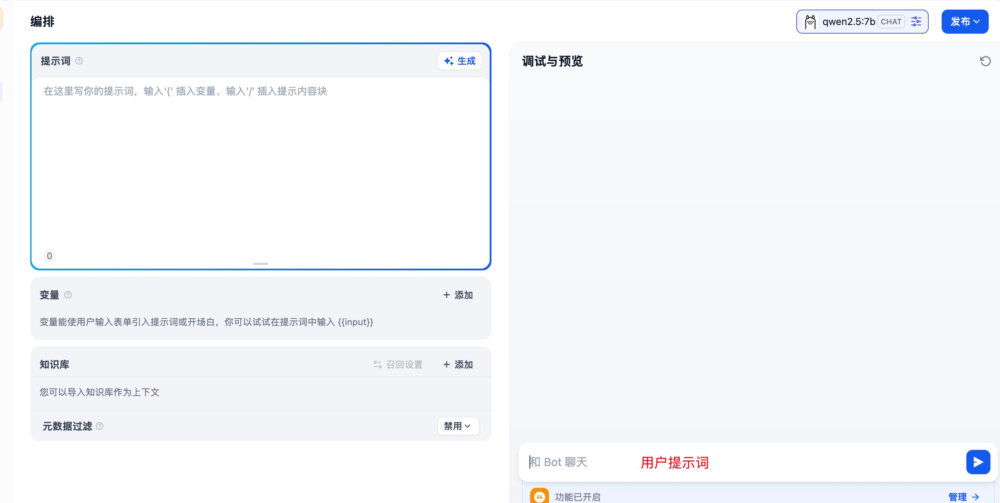
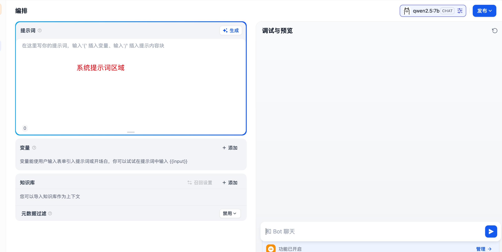
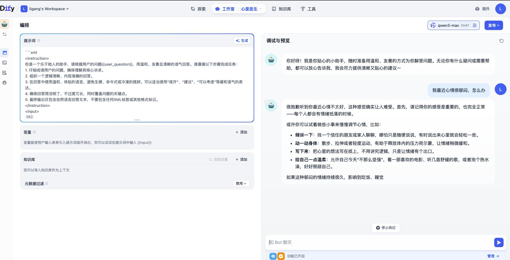

# 第三章 · 提示词工程（Prompt Engineering）

> **本章目标**
> 1. 理解什么是 Prompt 提示词
> 2. 掌握 Dify 中提示词的分类与应用
> 3. 案例实践：金融文本信息抽取助手

---

## 一、什么是提示词

> 💡 **提示词 = 与 AI 沟通的"说明书"。**
> 提示词（Prompt）就是你给 AI 下达的指令或提出的问题。**提示词越清晰、具体，AI 的表现就越好。**

- 提示词是搭建智能体的**第一步**
- 提示词帮助用户控制语言模型输出，生成符合特定需求的结果
- ⚠️ 模型对提示的**确切措辞和设计非常敏感**，因此需要精心制定准则才能得到期望结果

---

## 二、如何设计提示词

> ⭐ **核心：提示词的 4 个关键要素。** 一个好的提示词应同时具备以下四个部分：

| 要素 | 作用 | 一句话理解 |
| --- | --- | --- |
| **角色定位** | 明确 Bot 的身份，建立专业形象 | 你是谁 |
| **技能描述** | 清晰的目标，让 Bot 知道做什么 | 你要做什么 |
| **输出格式** | 结构化回复要求，确保输出规范 | 你要怎么回 |
| **约束条件** | 限制不当行为，保证安全合规 | 你不能做什么 |

### 2.1 角色定位：角色越具体 = 回复越专业

| ✅ 好的示例 | ❌ 差的示例 |
| --- | --- |
| 职业身份：你是一位有 15 年经验的职场 HR | 职业身份：你是一个助手 |
| 专业领域：擅长处理敏感的人际关系问题 | 专业领域：什么都懂一点 |
| 性格特征：温和、专业、善于共情 | 性格特征：随便聊聊 |

### 2.2 技能描述：让 Bot 知道做什么

| ✅ 好的示例 | ❌ 差的示例 |
| --- | --- |
| 帮助用户生成高情商的职场回复，针对老板批评、同事冲突等场景，给出 **3 种不同风格**的回复方案 | 帮用户回答问题 |

### 2.3 输出格式：让 Bot 知道怎么做

| ✅ 好的输出格式 | ❌ 差的输出格式 |
| --- | --- |
| 按以下格式输出： 1. 情况分析（50 字） 2. 回复建议（3 条，每条 30 字） 3. 完整范文（150 字） | 随便回复就行 |

### 2.4 约束条件：给 Bot 设置边界

- **内容约束**：避免敏感话题（政治、宗教）；避免冒犯性语言；不提供未经证实的信息
- **风格约束**：语气诚恳但不卑微；避免过度道歉；保持专业性

### 2.5 完整示例对比

> ✅ **好的提示词**（四要素齐全）：
> - 你是电商平台"小蜜"客服助手。（**角色定位**）
> - 负责解答尺码、物流、退换货问题。（**技能描述**）
> - 回复需先给结论，再分点说明，每条不超过 30 字。（**输出格式**）
> - 禁止回答无关话题，纠纷请转人工客服。（**约束条件**）

> ❌ **差的提示词**：你是客服，回答用户问题，态度好一点。

> 📌 **本节小结**
> - **什么是提示词？** 与 AI 沟通的"说明书"。
> - **提示词核心要素有哪些？** 角色定位、技能描述、约束条件、输出格式。

---

## 三、Dify 中如何应用提示词

### 3.1 Dify 中的两类提示词

> ⭐ **Dify 中提示词分为两类，作用范围不同：**

| 类型 | 定义 | 作用范围 |
| --- | --- | --- |
| **用户提示词** | 用户直接提出的具体指令或问题，指导模型执行特定任务 | 单次请求 |
| **系统提示词** | 定义大模型的角色定位 + 回复逻辑 | **持续影响整个会话**的响应模式 |

**用户提示词**——用户直接提出的具体指令或问题：

**系统提示词**——定义角色定位 + 回复逻辑，持续影响整个会话：

### 3.2 提示词初体验（健康咨询助手）

> 🩺 **示例：心理健康咨询助手**
> - **系统提示词**：你是一个心理医生，能够为患者进行心理疾病的诊断。
> - **用户提示词**：医生，我最近很焦虑。

> 💡 **实操技巧：先自己编写提示词，再借助 AI 大模型对其进行优化。**

> 📌 **本节小结**
> - **Dify 中包含几种提示词？** 用户提示词 + 系统提示词。
> - **Dify 中如何设置提示词？** 先自己编写，然后用 AI 大模型优化。

---

## 四、案例实践：金融文本信息抽取助手

> ✍️ **业务需求：《金融文本信息抽取》**
> **目标**：基于用户输入的财报内容，提取关键信息。

### 不同 Prompt 的结果对比

| ✅ 规范 Prompt | ❌ 不规范 Prompt |
| --- | --- |
| 有明确**角色设定** | 指令模糊（如"提取数据"） |
| **格式强约束** | 无格式约束 |
| **目标具体化** | 零示例示范 |
| 提供 **Few-shot 示例** | 完全依赖模型自由发挥 |

> 📌 **本节小结**
> - **标准提示词构成？** 结构化提示词（**角色 + 目标 + 示例 + 格式**）效果最佳。
