# 第二章 · Dify 接入大模型

> **本章目标**
> 掌握两种为 Dify 接入大模型的方式：
> 1. **本地大模型应用**（通过 Ollama 部署）
> 2. **API 大模型应用**（通过云端供应商，如阿里云百炼 / 通义千问）

> 💡 **两种方式如何选？**
> - **本地模型**：数据不出本地、免费、可离线；但受本机算力限制。
> - **API 模型**：无需部署、能力强、开箱即用；但需联网且按量计费。

---

## 一、本地大模型接入（Ollama）

### 1.1 完整流程总览

| 步骤 | 操作 | 说明 |
| --- | --- | --- |
| **Step 1** | 安装 Ollama | 大模型管理工具 |
| **Step 2** | 下载模型 | 选择对应模型下载 |
| **Step 3** | 应用模型 | 在 Ollama 中运行大模型 |
| **Step 4** | 在 Dify 中配置 Ollama | 完成 Ollama 供应商配置 |
| **Step 5** | 在 Dify 中测试模型 | 完成模型在 Dify 中应用 |

### 1.2 第一步：安装 Ollama

> 💡 **Ollama 是一个开源的本地大模型运行框架**，用于在本地部署、管理和运行各类开源 LLM 模型。
> 下载地址：<https://ollama.com/download>（支持 macOS、Linux、Windows）

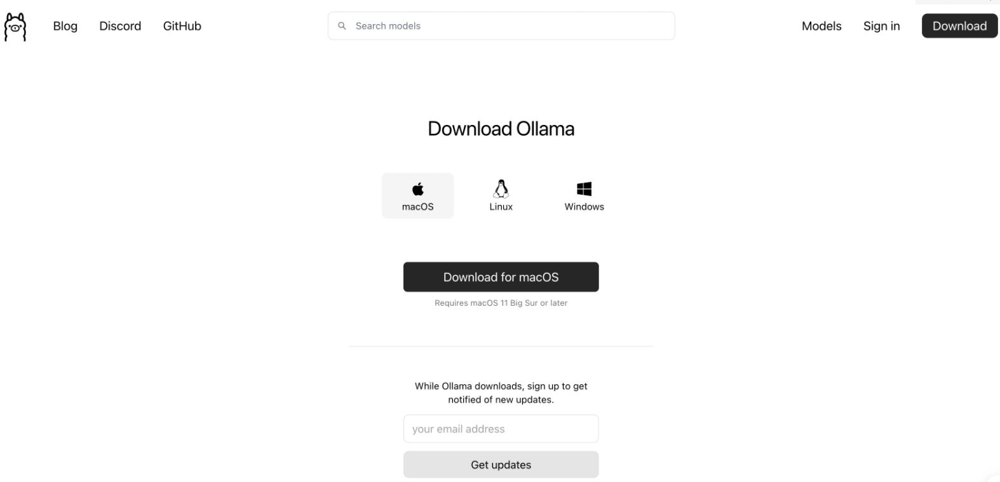

### 1.3 第二步：下载模型

操作：打开 Ollama，在 **find model** 中直接选择需要下载的模型。

> ⭐ **建议优先选择一个小模型先跑起来**，例如输入 `qwen2.5:1.5b` 下载即可。注意关注模型大小，避免超出本机算力。

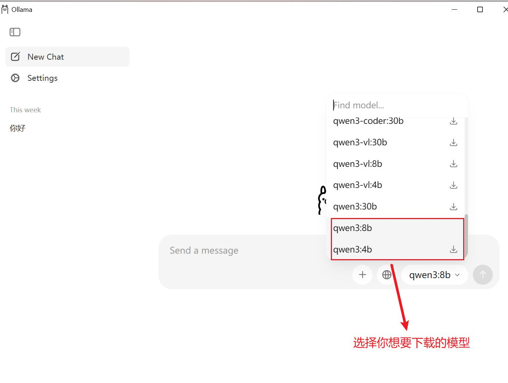

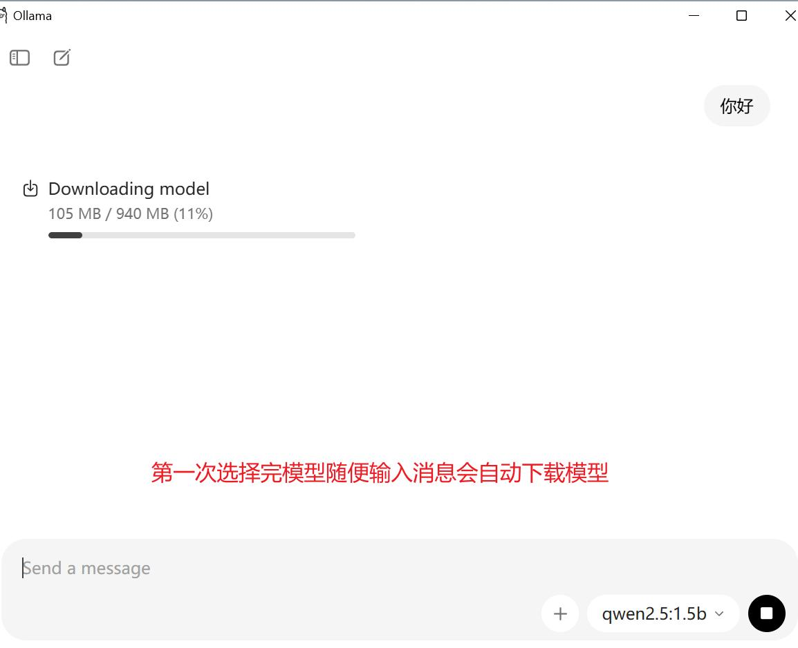

### 1.4 第三步：应用模型

模型下载完毕后，即可在对话框输入消息开启对话（部分模型还支持联网操作）。

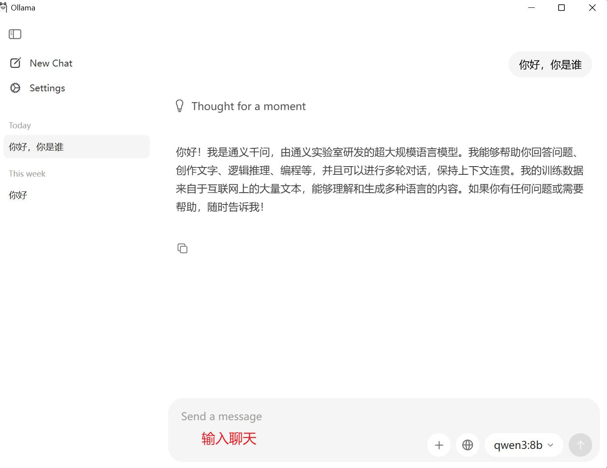

### 1.5 第四步：在 Dify 中配置 Ollama

**① 登录 Dify 进入设置：**

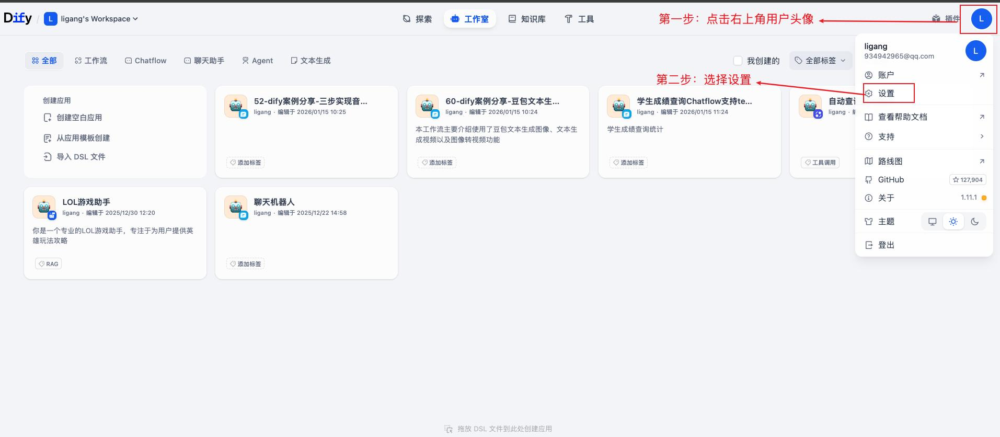

**② 在 Dify 市场中搜索 Ollama 模型供应商并安装：**

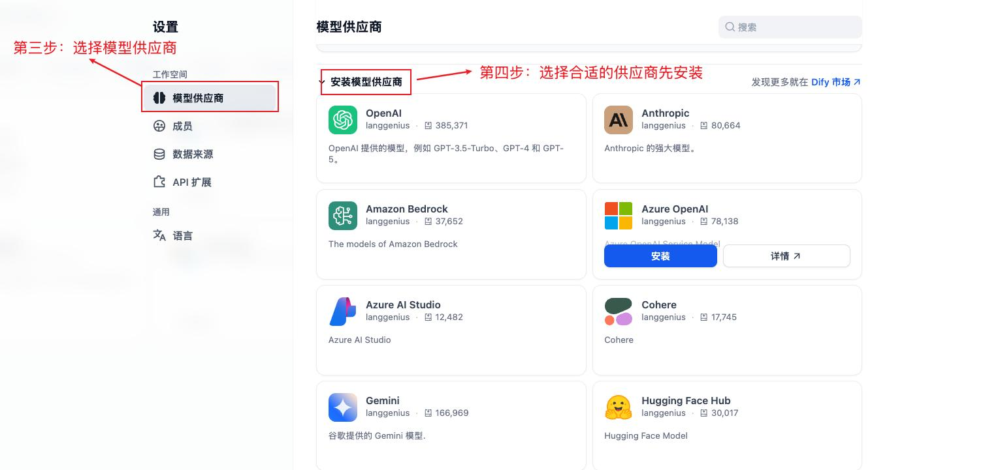

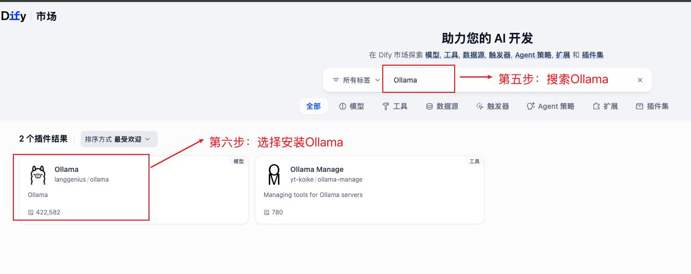

**③ 在模型列表中找到已安装的 Ollama，添加模型：**

> ⚠️ **重点：基础 URL（Base URL）的填写是最容易出错的地方！**
> - Docker 与 Dify 部署在**同一台机器**：`http://host.docker.internal:11434`
> - Docker 与 Dify 部署在**不同机器**：`http://192.168.x.x:11434`（填自己的 IP）

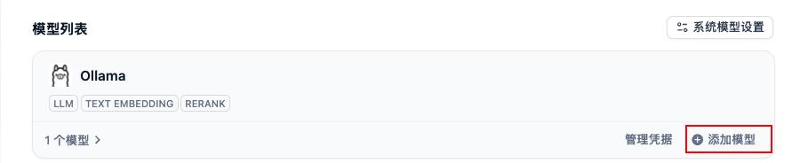

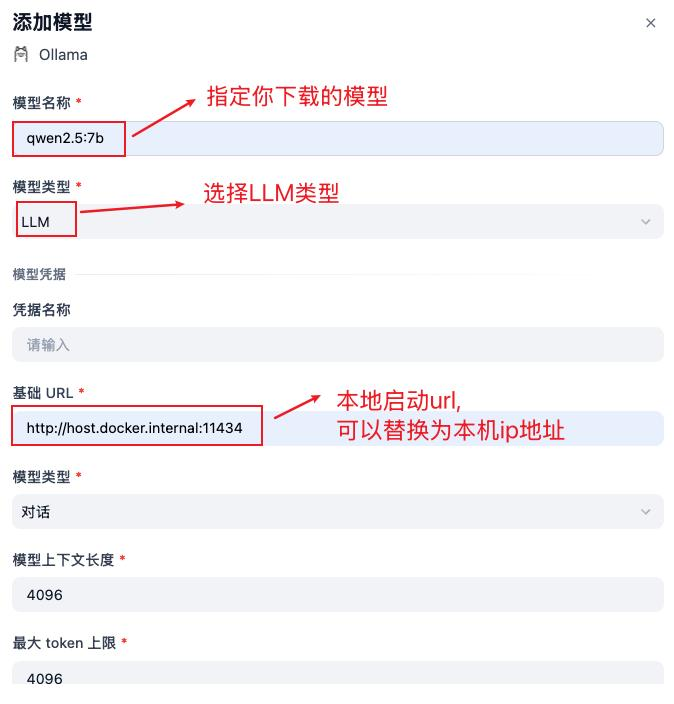

### 1.6 第五步：实际测试

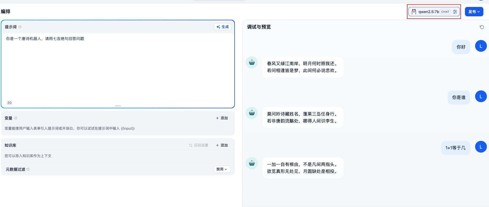

> 📌 **本节小结**
> - **什么是 Ollama？** 本地大模型管理工具。
> - **如何在 Dify 中应用本地模型？** 安装 Ollama → 下载模型 → 应用模型 → Dify 中配置 Ollama → 测试模型。

---

## 二、API 大模型接入（阿里云百炼 / 通义千问）

### 2.1 完整流程总览

| 步骤 | 操作 | 说明 |
| --- | --- | --- |
| **Step 1** | 注册阿里云账号 | 基于手机号注册 |
| **Step 2** | 登录百炼平台 | 登录账号并完成实名认证 |
| **Step 3** | 获取 API Key | 选择模型服务，创建 API 密钥 |
| **Step 4** | 在 Dify 中配置 API | 完成 API 的配置 |
| **Step 5** | 在 Dify 中测试模型 | 完成模型在 Dify 中应用 |

### 2.2 第一步：注册账号

网址：<https://www.aliyun.com/product/bailian>

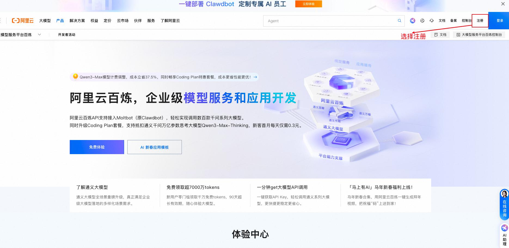

### 2.3 第二步：登录百炼平台

> ⚠️ **重点：登录后一定要完成实名认证**，并查询账户余额、按需充值，否则无法调用模型。

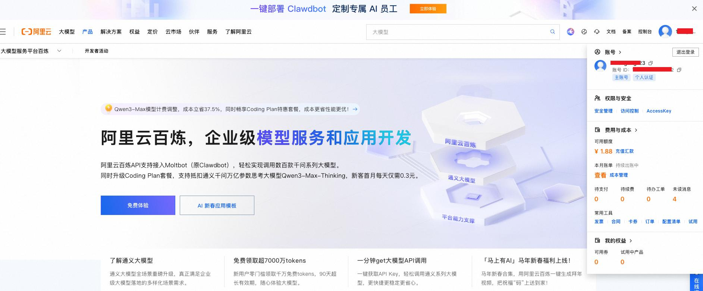

### 2.4 第三步：获取 API Key

网址：<https://bailian.console.aliyun.com/cn-beijing/?tab=model#/api-key>

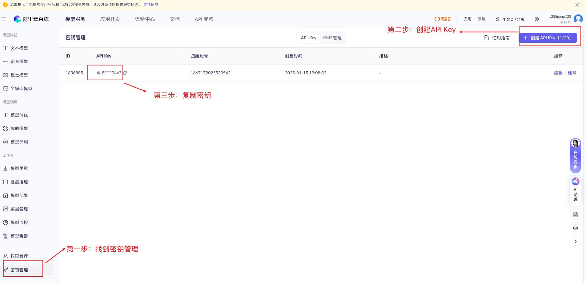

### 2.5 第四步：在 Dify 中配置 API Key

**① 在 Dify 市场中搜索"通义千问"模型供应商并安装：**

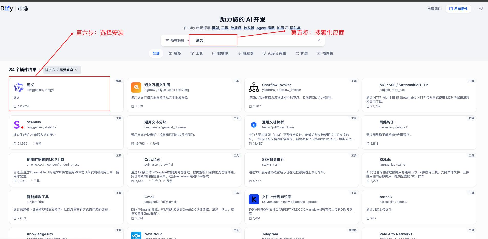

**② 在模型列表中找到通义千问，填入 API Key 完成设置：**

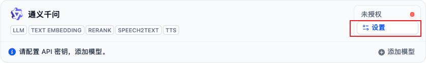

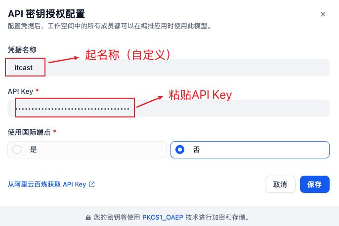

### 2.6 第五步：实际测试

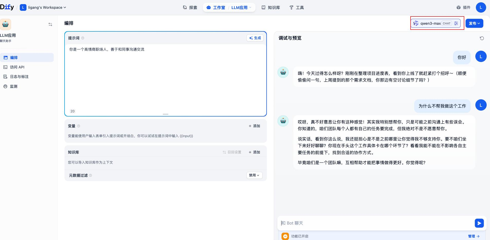

> 📌 **本节小结**
> - **什么是大模型 API？** 远程调用云端大模型能力的接口，无需自己部署和维护模型。
> - **如何在 Dify 中应用大模型 API？** 申请 API Key → 下载对应供应商 → 添加模型配置 → 应用。
