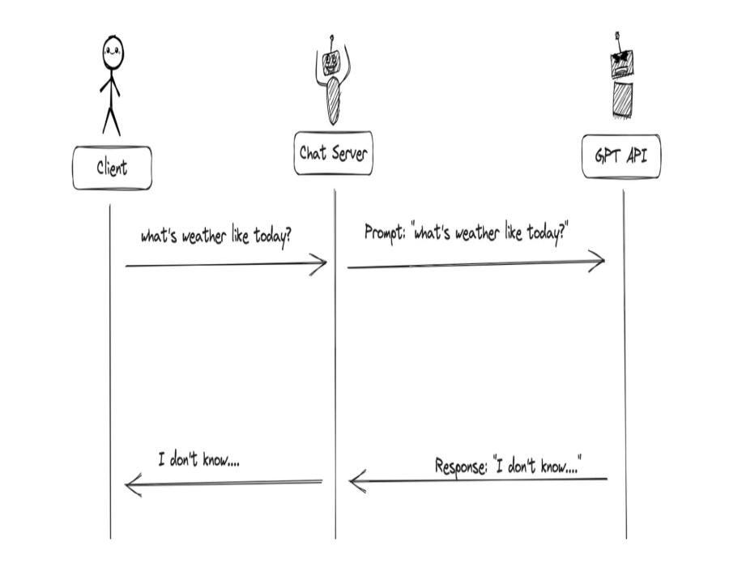
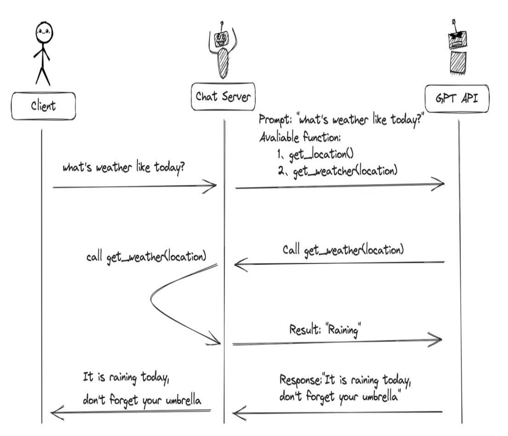

# 第五章 · 自定义工具（Function Calling 与插件）

> **本章目标**
> 1. 理解什么是 Function Calling
> 2. 掌握 Dify 中如何应用 Function Calling（插件）
> 3. 案例实践：智能天气助手

---

## 一、什么是 Function Calling

> 💡 **Function Calling（函数调用）** 由 OpenAI 于 **2023 年 6 月 13 日**公布。
> 它指的是在语言模型中集成**外部功能或 API 的调用能力**——模型可以在生成文本的过程中调用外部函数或服务，以获取额外数据或执行特定任务。

### 1.1 应用基本流程（简化）

```
输入 → 大语言模型 → 判断"是否需要调用外部信息？"
                         ├─ 否 → 结束
                         └─ 是 → a. 匹配外部函数
                                  b. 选择合适的外部 API
                                  c. 根据 API 逻辑生成回复 → 输出
```

### 1.2 Function Call 解决大模型的三大问题

| 编号 | 问题 | Function Call 如何解决 |
| --- | --- | --- |
| **01 信息实时性** | 训练数据无法包含最新信息（新闻、实时股价等） | 实时获取最新数据，提供更时效的服务 |
| **02 数据局限性** | 训练数据有限，无法覆盖医学、法律等专业领域 | 调用外部数据库或 API，获取特定领域详细信息 |
| **03 功能扩展性** | 不可能内置所有功能 | 调用外部工具完成复杂计算、数据分析等 |

---

## 二、Function Call 工作原理

### 2.1 没有 Function Call 时（简单模式）

当没有函数调用时，调用 GPT 构建 AI 应用的模式非常简单：

1. 用户（Client）发请求给我们的服务（Chat Server）
2. 我们的服务（Chat Server）把提示词给 GPT
3. 重复执行



### 2.2 有 Function Call 时（复杂模式）

当有函数调用时，模式会复杂一些：

1. 用户（Client）发请求 **prompt 以及 functions** 给 Chat Server
2. GPT 根据用户 prompt，判断用**普通文本**还是**函数调用格式**响应
3. 如果是函数调用格式，Chat Server 就执行该函数，并将结果返回给 GPT
4. 模型再使用提供的数据，用连贯的文本进行响应



> ⚠️ **重点（最易误解之处）：大模型的 Function Call 并不会真正"调用"函数，它仅返回函数所需的参数。**
> 真正执行函数的是开发者——利用模型输出的参数，在应用中完成实际调用。

> 📌 **本节小结**
> - **什么是 Function Calling？** 让大模型具备调用外部工具的能力。
> - **Function Calling 的原理？** 用户请求 → 大模型判断是否调用函数 → 函数结果返回大模型 → 给出答案。

---

## 三、Dify 中如何应用 Function Calling

> ⭐ **视角转换：**
> - **程序员视角**：`Function Call`
> - **Dify 视角**：`插件`

> 💡 **核心概念：**
> - 插件是一个**工具集**，包含一个或多个工具
> - **每个工具 = 一个可调用的 API**
> - **核心机制不变**：模型通过阅读【插件描述】来决定是否调用该插件！

### 3.1 Dify 插件生态一览

**插件分类体系：**

- **第三方插件**：免费插件 + 付费插件（付费需申请 API Key）
- **自定义插件**（你自己创建）：集成你需要的任何 API

**常见插件类别：**

| 类别 | 示例 |
| --- | --- |
| 信息查询 | 搜索、新闻、天气、地图 |
| 数据分析 | 股票、汇率、图表生成 |
| 内容创作 | 图片生成、视频编辑 |
| 效率工具 | 邮件、日历、翻译、计算器 |

### 3.2 现有插件应用示例

> ✍️ **任务：获取时间** —— 基于现有插件，帮我获取当前的时间。

> 📌 **本节小结**
> - **插件和 Function Calling 关系？** 在 Dify 中，工具（插件）就是 Function Calling 的实现形式。
> - **如何应用 Dify 插件？** 工具 → 下载插件 → 创建 Agent → 选择插件 → 应用。

---

## 四、案例实践：智能天气助手（自定义插件）

### 4.1 什么时候需要自定义插件？

- 官方插件没有你想要的功能
- 付费插件费用太贵
- 想连接特定的第三方 API 服务
- 需要对接企业内部系统

### 4.2 自定义插件基本流程

| 步骤 | 操作 | 说明 |
| --- | --- | --- |
| **Step 1** | 脚本开发 | 基于本地实现 Python 代码开发 |
| **Step 2** | 运行脚本 | 后台运行 API |
| **Step 3** | 创建工具 | 在 Dify 中选择工具：创建自定义工具 |
| **Step 4** | Schema 操作 | 配置 OpenAPI Schema |
| **Step 5** | 测试 | 输入参数测试功能 |
| **Step 6** | 保存 | 在 Agent 中应用插件 |

> 📌 **本节小结 —— 实现自定义插件的完整过程（7 步）：**
> 1. Python 脚本开发 → 2. 后台运行 API 接口 → 3. 在 Dify 中选择工具 → 4. 自定义工具 → 5. 构建 Schema → 6. 测试插件 → 7. 保存应用。
