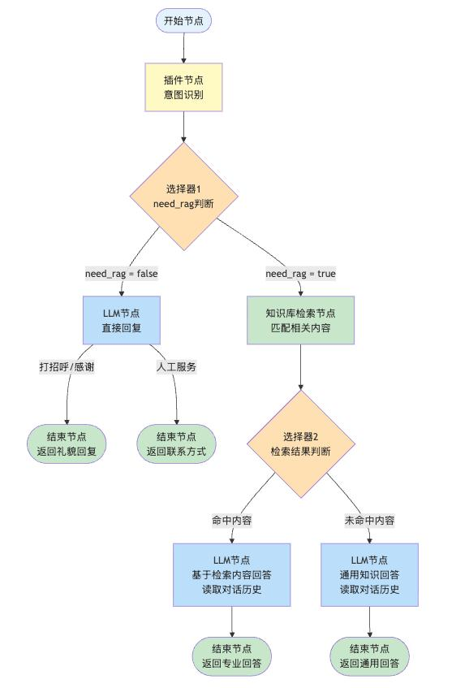
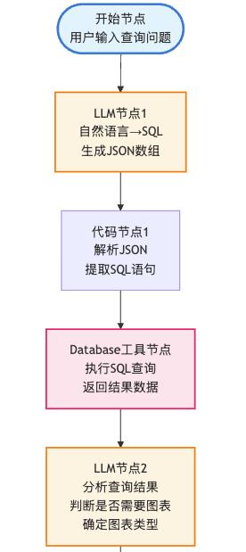
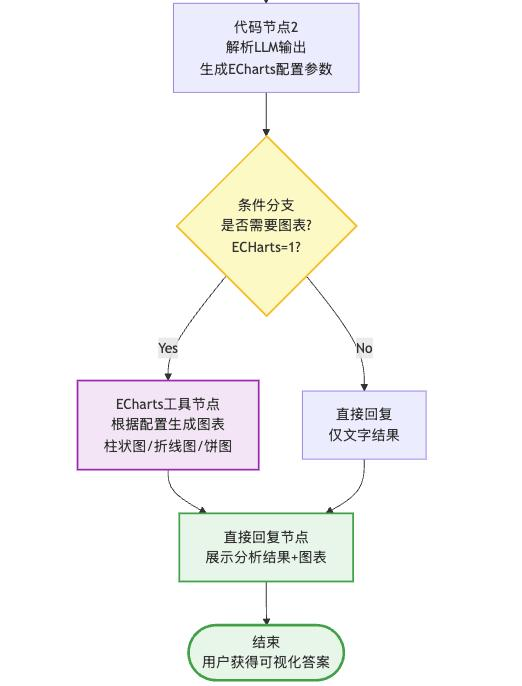

# 第六章 · 工作流与 Agent

> **本章目标**
> 1. 理解工作流（Workflow）与 Agent 的区别与联系
> 2. 案例实践：电商知识问答助手（工作流）
> 3. 案例实践：nlp2sql 数据库查询助手（对话流）

---

## 一、理解工作流与 Agent

### 1.1 工作流 = 业务逻辑的可视化执行

> 💡 **工作流的作用**：将一个复杂任务分解成一系列可管理的、按顺序或按条件执行的步骤，并通过**图形化界面**将这些步骤连接起来。

> ⭐ **单一任务 vs 复杂任务：**
> - **单一任务** → 用插件（如"查询天气"）
> - **复杂任务** → 用工作流（如"旅行规划全流程"）

### 1.2 Agent = 自主决策的 AI 助手

> 💡 **Agent 采用 ReAct 形式**：🤔 思考 → 🎬 行动 → 👀 观察 → 🤔 再思考 → …

| 能力 | 说明 |
| --- | --- |
| **自主规划** | 动态制定执行计划，根据环境反馈实时调整路径 |
| **工具选择** | 灵活调用外部工具库（API、数据库、搜索等）完成任务 |
| **推理能力** | 具备多轮思考与自我纠错能力，处理复杂逻辑 |
| **灵活但贵** | 智能化程度极高，但 Token 消耗与响应延迟相对较高 |

### 1.3 工作流 vs Agent：不是对立，而是演进

> ⭐ **核心观点：工作流是"确定性"的 Agent 实现方式。**

| 维度 | 工作流 | 智能体（Agent） |
| --- | --- | --- |
| 流程控制 | 固定不变，显式定义 | 自主决策，动态规划 |
| 可预测性 | ★★★★★ | ★★★☆☆ |
| 灵活性 | ★★★☆☆ | ★★★★★ |
| 运行成本 | 低（Token 消耗可控） | 高（多轮推理消耗大） |
| 调试难度 | 容易（路径清晰） | 困难（黑盒决策） |

### 1.4 Dify 的两种工作流类型

> ⭐ **Dify 工作流体系分为两类：工作流（Workflow）与 对话流（Chatflow）。**

| 维度 | 工作流（Workflow） | 对话流（Chatflow） |
| --- | --- | --- |
| 适用场景 | 功能类、数据处理 | 对话类、交互式应用 |
| 典型案例 | 报告生成、海报制作、数据分析 | 智能客服、AI 助手、虚拟伴侣 |
| 上下文 | 不支持对话历史 | 支持读取对话历史 |
| 会话管理 | 无会话概念 | 必须传入会话名称 |
| 发布渠道 | 本地运行、发布 API、嵌入网站 | 本地运行、发布 API、嵌入网站 |

### 1.5 创建工作流的标准流程

| 步骤 | 核心操作 |
| --- | --- |
| **Step 1：创建工作流** | 创建空白应用 → 工作流 / Chatflow；设置名称（清晰明确）与功能描述（帮助 AI 理解） |
| **Step 2：编排工作流** | 在可视化画布中添加节点 → 连接节点形成数据流 → 配置每个节点的输入输出参数 |
| **Step 3：测试并发布** | 点击测试运行 → 输入测试数据 → 检查节点状态；测试通过后点击"发布" |

> 💡 **核心组件——节点**：特定功能的独立组件，负责处理数据、执行任务。常见节点：开始节点、LLM 节点、工具节点、结束节点。

> 📌 **本节小结**
> - **什么是工作流？** 业务逻辑的可视化执行。
> - **Dify 的两种工作流类型？** 工作流（Workflow）和对话流（Chatflow）。
> - **工作流的核心组件？** 节点——处理数据、执行任务的独立组件。

---

## 二、案例实践：电商知识问答助手（工作流）

### 2.1 需求分析

**学员痛点：**

1. 课程内容太多，记不住关键点
2. 遇到问题时，老师不一定在线
3. 自己搜索效率低，浪费大量时间
4. 网上资料良莠不齐，难以判断

**核心需求：**

- 精通课程内容，随时解答课程相关问题
- 能够查找最新资料，获取课程外的补充知识
- 态度友好，回答详细且易于理解
- 7×24 小时在线

### 2.2 工作流编排

下图为电商知识问答助手的工作流编排：从开始节点进入**意图识别**，再根据 `need_rag` 条件分支选择"直接回复 / 入工服务"或"知识检索"，最后由结束节点输出：

> 📌 **本节小结 —— 电商知识问答助手基本流程：**
> 1. 开始节点
> 2. 意图识别
>    - 2.1 若属于打招呼 / 找人工 → 直接回复结果
>    - 2.2 否则 → 进入知识检索
> 3. 知识检索
>    - 3.1 检索出相关上下文 → 基于 RAG 让大模型回答
>    - 3.2 未检索出上下文 → 基于闲聊让大模型回答
> 4. 结束节点

---

## 三、案例实践：nlp2sql 数据库查询助手（对话流）

### 3.1 需求分析

**教育管理痛点：**

1. 想查班级成绩，要找数据部门查询，等半天
2. 不会写 SQL，数据分析全靠人工统计
3. 班级横向对比费时费力，还容易出错

**核心需求：**

- 接受自然语言提问，自动转换为 SQL 并查询数据库
- 秒级输出各班成绩排名、均分对比等关键数据
- 无需任何 SQL 基础，教师即可自主完成数据查询
- 7×24 小时在线

### 3.2 对话流编排

下图为 nlp2sql 助手的编排：**LLM 节点 1**（自然语言 → SQL）→ **代码节点 1**（解析 JSON 提取 SQL）→ **Database 工具节点**（执行 SQL 返回数据）→ **LLM 节点 2**（判断是否需要图表）→ **代码节点 2**（生成 ECharts 配置）→ 条件分支决定是否出图：

> 📌 **本节小结 —— nlp2sql 数据库查询助手基本流程：**
> 1. 用户输入问题
> 2. 大模型生成 SQL 语句
> 3. 基于 database 插件执行 SQL 语句
> 4. 大模型判断是否需要图表
> 5. 解析 ECharts 配置参数
> 6. 结果展示
