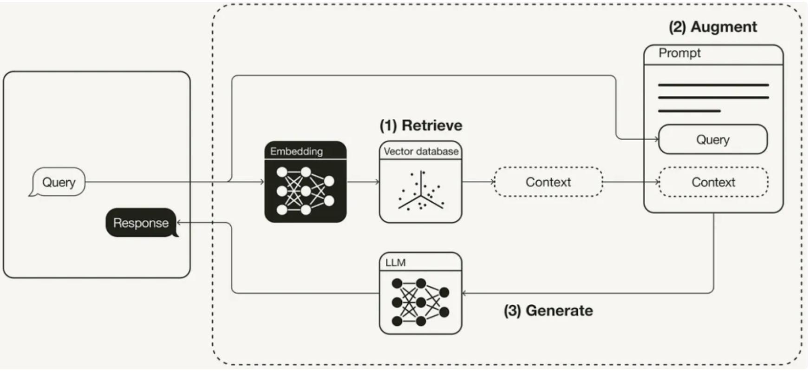

# 第四章 · RAG 技术应用

> **本章目标**
> 1. 理解什么是 RAG（检索增强生成）
> 2. 掌握 RAG 知识库的构建流程
> 3. 案例实践：英雄联盟游戏助手

---

## 一、什么是 RAG

### 1.1 场景引入：Bot 遇到的难题

> 🎮 **用户提问**：帮我介绍下 LOL 中《流光镜影》这个英雄的技能有哪些？
> 🤖 **普通大模型回答**："在《英雄联盟》当前版本（截至 2025 年 12 月）中，并没有名为《流光镜影》的英雄。"

❌ **问题所在**：

- 知识过时，无法回答最新内容
- 用户体验差
- Bot 价值大打折扣

> ✅ **解决方案：RAG（Retrieval-Augmented Generation）检索增强生成技术。**

### 1.2 RAG 的定义与原理

> 💡 **RAG 是一种结合"知识检索"和"语言生成"的人工智能技术**，主要用于解决大型语言模型的**幻觉问题**。

> ⭐ **基本原理（三步）：**
> 1. 在生成回答时，**先从知识库中检索**相关文档；
> 2. 将检索到的文档与原始问题**一起输入 LLM**；
> 3. LLM **基于检索内容**生成最终答案。

下图展示了 RAG 的核心流程——Query 先经过 **(1) Retrieve 检索** 从向量数据库取回上下文，再 **(2) Augment 增强** 拼接进 Prompt，最后 **(3) Generate 生成** 由 LLM 产出回答：



> 📌 **本节小结**
> - **传统 LLM 的缺陷？** 消息滞后，无法获取最新知识。
> - **RAG 的原理？** 先基于知识库检索与问题相关的上下文，再把"问题 + 上下文"一起送入大模型回答。
> - **RAG 解决什么问题？** 大模型的幻觉问题。

---

## 二、RAG 知识库如何构建

> ⭐ **知识库构建主流程：文档准备 → 文档切片 → 文档向量化。**

### 2.1 文档准备

| 类型 | 支持格式 | 适用场景 | LOL 案例 |
| --- | --- | --- | --- |
| **文档类型** | PDF、Word、TXT | 攻略文章、教程文档 | 英雄攻略 PDF |
| **表格类型** | Excel、CSV | 结构化数据、统计信息 | 英雄属性表 |

**文档预处理建议：**

- 清理无关内容（广告、水印）
- 按主题分类整理
- 文件命名规范（含关键信息）

### 2.2 文档切片（Chunking）

> 💡 **为什么要切片？** 为了适应大语言模型的上下文长度限制，并提升检索的精确度和效率。

**三种切分方式：**

1. **按字符数切分**：固定长度（如每 300 字一段）
2. **按符号切分**：按句号、换行符、感叹号等切分
3. **按语义切分**：识别主题变化点智能切分

> ⚠️ **重点（切片长度的权衡）：**一般按"符号 + 字符长度"组合切分，**每段约 200–500 字**。
> - 长度太小 → 上下文不完整，检索不准
> - 长度太大 → 无关信息过多，干扰判断

### 2.3 文档向量化（Embedding）

> 💡 **文档向量化**：将切分后的文本进行向量数字化，便于计算"问题"和"文档"之间的相似性。

**示例（语义相似度）：**

```
问题："盲僧 Q 技能"   → [0.8, 0.6, ...]
文档1："盲僧出装"      → [0.7, 0.5, ...]   ← 语义相近，命中
文档2："烹饪技巧"      → [0.1, 0.8, ...]   ← 语义无关，不命中
```

> ⭐ **向量化的三大作用：语义理解、相似度计算、快速检索。**

> 📌 **本节小结**
> - **RAG 知识库构建的主要流程？** 文档准备 → 文档切分 → 文档向量化。
> - **文档为什么要切片？** 适应大模型上下文长度限制，并提升检索精度与效率。
> - **文档向量化原因？** 将文本数字化，便于计算问题与文档的相似性。

---

## 三、案例实践：英雄联盟游戏助手

### 3.1 环节一：创建 LOL 攻略知识库

| 步骤 | 操作 | 说明 |
| --- | --- | --- |
| **Step 1** | 创建知识库 | 进入 Dify 选择知识库创建 |
| **Step 2** | 选择数据源 | 上传文本原始文件 |
| **Step 3** | 文本分段 | 选择（设置）分段方式 |
| **Step 4** | 构建索引 | 将分段后的文档进行向量化 |
| **Step 5** | 检索设置 | 向量检索 / 全文检索 / 混合检索 |
| **Step 6** | 查看结果 | 预览文本处理的效果 |

### 3.2 环节二：让 Agent 应用知识库

> 💡 **关键提示：一个 Agent 可以关联多个知识库**，设置优先级可控制检索顺序。

| 步骤 | 操作 | 说明 |
| --- | --- | --- |
| **Step 1** | 创建空白应用 | 构建 Agent 智能体 |
| **Step 2** | 构建提示词 | 明确角色 → 说明功能 → 规范回复格式 |
| **Step 3** | 选择知识库 | 编排模块 → 知识库 → 点击"添加知识库" |
| **Step 4** | 结果验证 | 调试 → 输入问题 → 验证结果 |

> 📌 **本节小结 —— LOL 游戏助手的完整过程（9 步）：**
> 1. 上传文件 → 2. 文档切分 → 3. 文档向量化 → 4. 存储知识库 → 5. 问题检索知识库 → 6. 获取相关上下文 → 7. 问题与上下文融合 → 8. 送入 LLM → 9. 得到预测结果。
