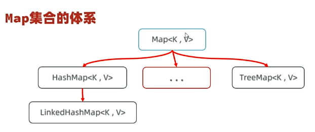
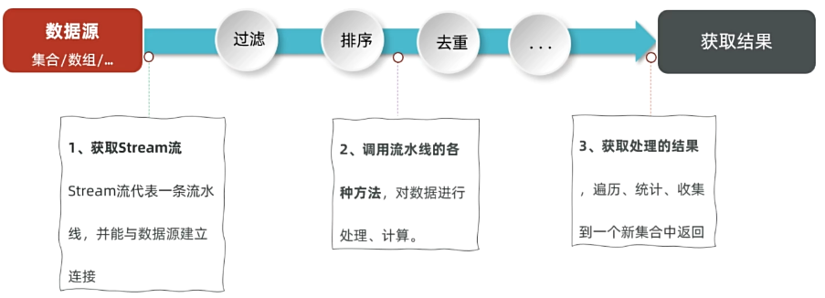

#  vDay02　Set 集合 · Map 集合 · Stream 流

> 本日主线：**Set 三大实现 → Map 三大实现 → Stream 流式编程**

```
Set 集合  ──>  Map 集合  ──>  Stream 流  ──>  综合案例
```

---

## 一、Set 集合

### 1.1 Set 系列特点（重点对比）

**Set 系列集合特点**：**无序：**添加数据的顺序和获取出的数据顺序不一致； **不重复； 无索引；**

- HashSet: 无序、不重复、无索引。
- LinkedHashSet: **有序**、不重复、无索引。
- TreeSet: **排序**、不重复、无索引。

| 实现类 | 顺序 | 重复 | 索引 | 排序 | 底层 |
| --- | --- | --- | --- | --- | --- |
| **HashSet** | ❌ 无序 | ❌ 不重复 | ❌ 无索引 | — | **哈希表** |
| **LinkedHashSet** | ✅ 有序 | ❌ 不重复 | ❌ 无索引 | — | **哈希表 + 双链表** |
| **TreeSet** | 🔄 排序 | ❌ 不重复 | ❌ 无索引 | 默认升序 | **红黑树** |

> ⚠️ Set 几乎没有额外的常用功能，**基本就是 Collection 提供的方法**。

~~~java
package com.dyx;

import java.util.HashSet;
import java.util.LinkedHashSet;
import java.util.Set;
import java.util.TreeSet;

public class SetDemo1 {
    public static void main(String[] args) {
        // 目标：认识Set家族集合的特点。
        // 1、创建一个Set集合，特点：无序，不重复，无索引。
        //Set<String> set = new HashSet<>(); // 一行经典代码 HashSet 无序，不重复，无索引
        Set<String> set = new LinkedHashSet<>(); // LinkedHashSet 有序，不重复，无索引。
        set.add("鸿蒙");
        set.add("鸿蒙");
        set.add("java");
        set.add("java");
        set.add("电商设计");
        set.add("电商设计");
        set.add("新媒体");
        set.add("大数据");
        System.out.println(set);

        // 2、创建一个TreeSet集合：排序（默认一定要大小升序排序），不重复，无索引。
        Set<Double> set1 = new TreeSet<>();
        set1.add(3.14);
        set1.add(5.6);
        set1.add(1.0);
        set1.add(1.0);
        set1.add(2.0);
        System.out.println(set1);
    }
}
~~~


---

## 二、HashSet 集合的底层原理（重难点）

### 2.1 哈希值（hashCode）

> **每个 Java 对象都有一个 int 类型的哈希值**，由 Object 的 `hashCode()` 方法返回。

```java
public int hashCode();   // 返回对象的哈希码
```

**哈希值的两大特点**：

1. **同一个对象多次调用 `hashCode()`，返回的哈希值相同**；
2. 不同对象的哈希值**大概率不相等**，但也可能相等（**哈希碰撞**）。

### 2.2 哈希表（HashTable）

| JDK 版本 | 哈希表结构 |
| --- | --- |
| **JDK 8 之前** | 数组 + 链表 |
| **JDK 8 开始** | **数组 + 链表 + 红黑树** |

> 哈希表是一种**增删改查性能都较好**的数据结构。

### 2.3 HashSet 添加元素的详细流程（重点）

```
① 创建默认长度 16 的数组，加载因子 0.75，数组名 table
② 用元素的哈希值对数组长度做运算，计算出应存入的位置
③ 判断当前位置：
     - 如果是 null      → 直接存入
     - 如果不为 null    → 调用 equals() 比较
                          - 相等 → 不存入
                          - 不相等 → 挂在该位置形成链表
④ 当链表长度 > 8 且数组长度 >= 64 时 → 链表转红黑树
⑤ 当数组存满到 16 * 0.75 = 12 时 → 自动扩容为原来的 2 倍
```

### 2.4 JDK 8 前后的差异

| 版本 | 链表挂载方式 |
| --- | --- |
| JDK 8 之前 | **新元素占老元素位置，老元素挂下面** |
| JDK 8 开始 | **新元素直接挂在老元素下面** |

### 2.5 为什么引入红黑树？

普通二叉树 → 二叉查找树 → **红黑树（自平衡二叉树）**

| 树类型 | 问题 |
| --- | --- |
| **二叉查找树** | 数据排好序时，退化成单链表，查询性能急剧下降 |
| **平衡二叉树** | 树尽可能矮，查询性能提升 |
| **红黑树** | **可以自平衡的二叉查找树**，增删改查性能都较好 |

> ✅ JDK 8 引入红黑树后，**进一步提高了哈希表操作数据的性能**。

### 2.6 HashSet 去重机制（坑点 ⚠️）

> **如果希望 Set 集合认为 2 个内容相同的对象是重复的，必须重写 `hashCode()` 和 `equals()` 方法。**

**注解：**

* 在Java眼里是属于四个不同的对象，四个不同的对象hash值是不一样的。
* 如果希望内容相同的不同对象就是重复的，应该想办法让他们的位置在同一个地方，要他们的位置一样，一定要hashCode()的值一样，要他们的内容一样，就一定要equals()的值一样。因为有些不同对象的hash值也一样，**所以要保证hashCode()的值和equals()的值都要一样**。

```java
package com.dyx;

import java.util.HashSet;
import java.util.Set;

public class SetDemo2 {
    public static void main(String[] args) {
        // 目标：掌握HashSet集合去重操作。
        Student s1 = new Student("张三", 18, "北京", "123456");
        Student s2 = new Student("李四", 19, "上海", "989876");
        Student s3 = new Student("张三", 18, "北京", "123456");
        Student s4 = new Student("李四", 19, "上海", "989876");

        Set<Student> set = new HashSet<>();
        set.add(s1);
        set.add(s2);
        set.add(s3);
        set.add(s4);

        System.out.println(set);
    }
}
```

~~~java
package com.dyx;

import java.util.Objects;


public class Student {
    private String name;
    private int age;
    private String address;
    private String phone;

    public Student() {
    }

    public Student(String name, int age, String address, String phone) {
        this.name = name;
        this.age = age;
        this.address = address;
        this.phone = phone;
    }

    public String getName() {
        return name;
    }

    public void setName(String name) {
        this.name = name;
    }

    public int getAge() {
        return age;
    }

    public void setAge(int age) {
        this.age = age;
    }

    public String getAddress() {
        return address;
    }

    public void setAddress(String address) {
        this.address = address;
    }

    public String getPhone() {
        return phone;
    }

    public void setPhone(String phone) {
        this.phone = phone;
    }

    // 只要两个对象的内容一样结果一定是true.
    // s3.equals(s1)
    @Override
    public boolean equals(Object o) {
        // 1、如果是自己和自己比直接返回true
        if (this == o) return true;
        // 2、如果o为空或者o不是Student类型，直接返回false
        if (o == null || this.getClass() != o.getClass()) return false;
        // 3、比较两个对象的内容是否一样
        Student student = (Student) o;
        return this.age == student.age && Objects.equals(name, student.name) && Objects.equals(address, student.address) && Objects.equals(phone, student.phone);
    }

    @Override
    public int hashCode() {
        // 不同学生对象，如果内容一样返回的哈希值一定是一样的，
        return Objects.hash(name, age, address, phone);
    }

    @Override
    public String toString() {
        return "Student{" +
                "name='" + name + '\'' +
                ", age=" + age +
                ", address='" + address + '\'' +
                ", phone='" + phone + '\'' +
                '}' + "\n";
    }
}
~~~


---

## 三、LinkedHashSet 集合的底层原理

> **依然基于哈希表（数组 + 链表 + 红黑树），但每个元素额外多了一个双链表的机制，记录元素的前后位置（保证添加顺序）。**

* 有序、不重复、无索引
* 底层基于哈希表，使用双链表记录添加顺序。

| 特点 | 说明 |
| --- | --- |
| **顺序** | 有序（保留添加顺序） |
| **重复** | 不重复 |
| **索引** | 无索引 |
| **底层** | 哈希表 + **双链表** |

---

## 四、TreeSet 集合

### 4.1 特点

> **特点：**不重复、无索引、可排序**（默认升序）
>
> **底层**：基于 **红黑树** 实现的排序

### 4.2 默认排序规则

| 数据类型 | 默认排序规则 |
| --- | --- |
| **数值类型**（Integer、Double） | 按数值本身大小升序 |
| **字符串类型** | 按**首字符的编号**升序 |
| **自定义对象** | ❌ **无法直接排序**，必须指定规则！ |

**注意：**

* 对于数值类型：Integer , Double，默认按照数值本身的大小进行升序排序。
* 对于字符串类型：默认按照首字符的编号升序排序。
* 对于自定义类型如 Student 对象，TreeSet 默认是无法直接排序的。

~~~java
package com.dyx;

import java.util.Comparator;
import java.util.Set;
import java.util.TreeSet;

public class SetDemo3 {
    public static void main(String[] args) {

        /**
         直接这样写会报错，因为TreeSet天然就要排序，所以把四个Teacher对象加进去后要进行排序，但我们
         还没有给Teacher对象设置排序规则，它不知道按照name还是age还是salary进行排序，所以就会报错
         */
        Set<Teacher> teachers = new TreeSet<>();//排序、不重复、无索引
        teachers.add(new Teacher("老陈", 20, 6232.4));
        teachers.add(new Teacher("dlei", 18, 3999.5));
        teachers.add(new Teacher("老王", 22, 9999.9));
        teachers.add(new Teacher("老李", 20, 1999.9));
        System.out.println(teachers);

        // 结论：TreeSet集合默认不能 给自定义对象排序啊，因为不知道大小规则。
        // 一定要能解决怎么办？两种方案。
        // 1、对象类实现一个Comparable比较接口，重写compareTo方法，指定大小比较规则
        // 2、public TreeSet（Comparator c）集合自带比较器Comparator对象，指定比较规则

    }
}


@Data
@NoArgsConstructor
@AllArgsConstructor
public class Teacher {
    private String name;
    private int age;
    private double salary;

    @Override
    public String toString () {
        return "Teacher{" +
                "name='" + name + '\'' +
                ", age=" + age +
                ", salary=" + salary +
                '}' + "\n";
    }
}
~~~

### 4.3 自定义排序规则（重点）

#### 方式一：实现 `Comparable` 接口

**注意：**

* 在红黑树里，如果发现你大小相同的话，就不存了，比如说这里是发现age相同，就不会存了，并不是根据对象来比较的，但这也是可以解决的，比如说相同的情况下不返回0，改成返回-1或者1,就不会认为这两个值相等

**规定：**

*  规定1：如果你认为左边大于右边 请返回正整数
* 规定2：如果你认为左边小于右边 请返回负整数
* 规定3：如果你认为左边等于右边 请返回0

```java
package com.dyx;

import java.util.Comparator;
import java.util.Set;
import java.util.TreeSet;

public class SetDemo3 {
    public static void main(String[] args) {

        /**
         直接这样写会报错，因为TreeSet天然就要排序，所以把四个Teacher对象加进去后要进行排序，但我们
         还没有给Teacher对象设置排序规则，它不知道按照name还是age还是salary进行排序，所以就会报错
         */
        Set<Teacher> teachers = new TreeSet<>();//排序、不重复、无索引
        teachers.add(new Teacher("老陈", 20, 6232.4));
        teachers.add(new Teacher("dlei", 18, 3999.5));
        teachers.add(new Teacher("老王", 22, 9999.9));
        teachers.add(new Teacher("老李", 20, 1999.9));
        System.out.println(teachers);

        // 结论：TreeSet集合默认不能 给自定义对象排序啊，因为不知道大小规则。
        // 一定要能解决怎么办？两种方案。
        // 1、对象类实现一个Comparable比较接口，重写compareTo方法，指定大小比较规则
        // 2、public TreeSet（Comparator c）集合自带比较器Comparator对象，指定比较规则

    }
}

package com.dyx;

import lombok.AllArgsConstructor;
import lombok.Data;
import lombok.NoArgsConstructor;

// 1、对象类实现一个Comparable比较接口，重写compareTo方法，指定大小比较规则

@Data
@NoArgsConstructor
@AllArgsConstructor
public class Teacher implements Comparable<Teacher> {
    private String name;
    private int age;
    private double salary;

    @Override
    public String toString() {
        return "Teacher{" +
                "name='" + name + '\'' +
                ", age=" + age +
                ", salary=" + salary +
                '}' + "\n";
    }

    // t2.compareTo(t1)
    // t2 == this 比较者
    // t1 == o  被比较者
    // 规定1：如果你认为左边大于右边 请返回正整数
    // 规定2：如果你认为左边小于右边 请返回负整数
    // 规定3：如果你认为左边等于右边 请返回0
    // 默认就会升序。
    @Override
    public int compareTo(Teacher o) {
        // 按照年龄升序
        //        if(this.getAge() > o.getAge()) return 1;
        //        if(this.getAge() < o.getAge()) return -1;
        //        return 0;
        return this.getAge() - o.getAge(); // 升序
        //        return o.getAge() - this.getAge(); // 降序
    }
}
```

#### 方式二：传入 `Comparator` 比较器

```java
package com.dyx;

import java.util.Comparator;
import java.util.Set;
import java.util.TreeSet;

public class SetDemo3 {
    public static void main(String[] args) {
        // 目标：搞清楚TreeSet集合对于自定义对象的排序

        // 简化形式
//        Set<Teacher> teachers = new TreeSet<>((o1, o2) -> Double.compare(o1.getSalary(), o2.getSalary())); // 排序，不重复，无索引

        /**
         直接这样写会报错，因为TreeSet天然就要排序，所以把四个Teacher对象加进去后要进行排序，但我们
         还没有给Teacher对象设置排序规则，它不知道按照name还是age还是salary进行排序，所以就会报错
         */
        /**
         Set<Teacher> teachers = new TreeSet<>(new Comparator<Teacher>() {
            @Override
            public int compare(Teacher o1, Teacher o2) {
            //dreturn o1.getAge() - o2.getAge();//升序
            return Double.compare(o1.getSalary(), o2.getSalary())//薪水升序
            }
        });//排序、不重复、无索引
         */
        Set<Teacher> teachers = new TreeSet<>((o1,o2) -> Double.compare(o1.getSalary(), o2.getSalary()));//薪水升序
        teachers.add(new Teacher("老陈", 20, 6232.4));
        teachers.add(new Teacher("dlei", 18, 3999.5));
        teachers.add(new Teacher("老王", 22, 9999.9));
        teachers.add(new Teacher("老李", 20, 1999.9));
        System.out.println(teachers);

        // 结论：TreeSet集合默认不能 给自定义对象排序啊，因为不知道大小规则。
        // 一定要能解决怎么办？两种方案。
        // 1、对象类实现一个Comparable比较接口，重写compareTo方法，指定大小比较规则
        // 2、public TreeSet（Comparator c）集合自带比较器Comparator对象，指定比较规则

    }
}

```

#### 返回值规则（必记）

| 返回值 | 含义 |
| --- | --- |
| **正整数** | 第一个元素 > 第二个元素 |
| **负整数** | 第一个元素 < 第二个元素 |
| **0** | **元素相等**（TreeSet 会认为重复，**只保留一个**） |

> ⚠️ **优先级**：如果类实现了 `Comparable`，TreeSet 又传入了 `Comparator`，**优先使用 Comparator**。

---

## 五、List / Set 集合选型指南（面试高频）

| 业务需求 | 推荐集合 | 底层 |
| --- | --- | --- |
| 记住添加顺序、可重复、频繁按索引查询 | **ArrayList（有序、可重复、有索引）** ⭐ | 数组 |
| 记住添加顺序、可重复、频繁首尾增删 | **LinkedList（有序、可重复、有索引）** | 双链表 |
| 不在意顺序、不重复、增删改查都快 | **HashSet（无序、不重复、无索引）** ⭐ | 哈希表 |
| 记住添加顺序、不重复、增删改查都快 | **LinkedHashSet（有序、不重复、无索引）** | 哈希表 + 双链表 |
| 元素自动排序、不重复 | **TreeSet** | 红黑树 |

---

## 六、Map 集合



### 6.1 认识 Map

> **Map 是键值对集合**：`{key1=value1, key2=value2, ...}`

| 规则 | 说明 |
| --- | --- |
| **键** | **不允许重复** |
| **值** | 可以重复 |
| **键和值** | 一一对应，每个键只能找到自己对应的值 |

**注意：Map 系列集合的特点都是由键决定的，值只是一个附属品，值是不做要求的**

- HashMap（由键决定特点）：无序、不重复、无索引； **（用的最多）**
- LinkedHashMap（由键决定特点）: 由键决定的特点：**有序**、不重复、无索引。
- TreeMap（由键决定特点）: **按照大小默认升序排序**、不重复、无索引。

**Map 集合是什么？什么时候可以考虑使用 Map 集合？**

- Map 集合是键值对集合
- 需要存储一一对应的数据时，就可以考虑使用 Map 集合来做 

### 6.2 Map 系列特点（由键决定）

| 实现类 | 顺序 | 重复 | 索引 | 备注 |
| --- | --- | --- | --- | --- |
| **HashMap** ⭐ | ❌ 无序 | ❌ 不重复 | ❌ 无索引 | 用得最多 |
| **LinkedHashMap** | ✅ 有序 | ❌ 不重复 | ❌ 无索引 | |
| **TreeMap** | 🔄 排序 | ❌ 不重复 | ❌ 无索引 | 默认升序 |

> 💡 Map 系列的特点**都是由键决定**的，值不做要求。

### 6.3 Map 常用方法

| 方法 | 说明 |
| --- | --- |
| `public V put(K key, V value)` | 添加元素 |
| `public int size()` | 集合大小 |
| `public void clear()` | 清空集合 |
| `public boolean isEmpty()` | 是否为空 |
| `public V get(Object key)` | 根据键获取值 |
| `public V remove(Object key)` | 根据键删除元素 |
| `public boolean containsKey(Object key)` | 是否包含某个键 |
| `public boolean containsValue(Object value)` | 是否包含某个值 |
| `public Set<K> keySet()` | 获取全部键的集合 |
| `public Collection<V> values()` | 获取Map集合的全部值 |

~~~Java
public class MapDemo2 {
    public static void main(String[] args) {
        // 目标：掌握Map的常用方法。
        Map<String,Integer> map = new HashMap<>();
        map.put("嫦娥", 20);
        map.put("女儿国王", 31);
        map.put("嫦娥", 28);
        map.put("铁扇公主", 38);
        map.put("紫霞", 31);
        map.put(null, null);
        System.out.println(map); // {null=null, 嫦娥=28, 铁扇公主=38, 紫霞=31, 女儿国王=31}

        // 写代码演示常用方法
        System.out.println(map.get("嫦娥")); // 根据键取值  28
        System.out.println(map.get("嫦娥2")); // 根据键取值 null

        System.out.println(map.containsKey("嫦娥")); // 判断是否包含某个键 true
        System.out.println(map.containsKey("嫦娥2")); // false

        System.out.println(map.containsValue(28)); // 判断是否包含某个值 true
        System.out.println(map.containsValue(28.0)); // false

        System.out.println(map.remove("嫦娥")); // 根据键删除键值对,返回值
        System.out.println(map);

        // map.clear(); // 清空map
        // System.out.println(map);

        System.out.println(map.isEmpty()); // 判断是否为空

        System.out.println(map.size()); // 获取键值对的个数 4

        // 获取所有的键放到一个Set集合返回给我们
        Set<String> keys = map.keySet();
        for (String key : keys) {
            System.out.println(key);
        }

        // 获取所有的值放到一个Collection集合返回给我们
        Collection<Integer> values = map.values();
        for (Integer value : values) {
            System.out.println(value);
        }
    }
}
~~~


### 6.4 Map 集合的三种遍历方式（重点）

#### ① 键找值:

**键找值：**

* 先获取Map集合全部的键，再通过遍历键来找值。

| 方法名称                   | 说明                 |
| -------------------------- | -------------------- |
| `public Set<K> keySet()`   | 获取所有键的集合     |
| `public V get(Object key)` | 根据键获取其对应的值 |

```java
public class MapTraverseDemo3 {
    public static void main(String[] args) {
        // 目标：掌握Map集合的遍历方式一：键找值。
        Map<String,Integer> map = new HashMap<>();
        map.put("嫦娥", 20);
        map.put("女儿国王", 31);
        map.put("嫦娥", 28);
        map.put("铁扇公主", 38);
        map.put("紫霞", 31);
        System.out.println(map); // {嫦娥=28, 铁扇公主=38, 紫霞=31, 女儿国王=31}

        // 1、提起Map集合的全部键到一个Set集合中去
        Set<String> keys = map.keySet();


        // 2、遍历Set集合，得到每一个键
        for (String key : keys) {
            // 3、根据键去找值
            Integer value = map.get(key);
            System.out.println(key + "=" + value);
        }
    }
}
```

#### ② 键值对（Entry）

**键值对：**

* 把 “键值对 “看成一个整体进行遍历（难度较大）

| Map提供的方法                     | 说明                   |
| --------------------------------- | ---------------------- |
| `Set<Map.Entry<K, V>> entrySet()` | 获取所有"键值对"的集合 |

| Map.Entry提供的方法 | 说明   |
| ------------------- | ------ |
| `K getKey()`        | 获取键 |
| `V getValue()`      | 获取值 |

```java
Set<Map.Entry<String, Double>> entries = map.entrySet();
for (Map.Entry<String, Double> entry : entries) {
    String key = entry.getKey();
    Double value = entry.getValue();
    System.out.println(key + "----->" + value);
}
```

~~~java
public class MapTraverseDemo4 {
    public static void main(String[] args) {
        // 目标：掌握Map集合的遍历方式二：键值对。
        Map<String,Integer> map = new HashMap<>();
        map.put("嫦娥", 20);
        map.put("女儿国王", 31);
        map.put("嫦娥", 28);
        map.put("铁扇公主", 38);
        map.put("紫霞", 31);
        System.out.println(map); // {嫦娥=28, 铁扇公主=38, 紫霞=31, 女儿国王=31}

        // 1、把Map集合转换成Set集合，里面的元素类型都是键值对类型（Map.Entry<String, Integer>）
        /**
         *  map = {嫦娥=28, 铁扇公主=38, 紫霞=31, 女儿国王=31}
         *   ↓
         *   map.entrySet()
         *   ↓
         *  Set<Map.Entry<String, Integer>> entries = [(嫦娥=28), (铁扇公主=38), (紫霞=31), (女儿国王=31)]
         *                                                                                   entry
         */
        Set<Map.Entry<String, Integer>> entries = map.entrySet();
        // 2、遍历Set集合，得到每一个键值对类型元素
        for (Map.Entry<String, Integer> entry : entries) {
            String key = entry.getKey();
            Integer value = entry.getValue();
            System.out.println(key + "=" + value);
        }
    }
}
~~~


#### ③ Lambda 表达式

**Lambda:**

* JDK 1.8 开始之后的新技术（非常的简单）

| 方法名称                                                     | 说明                      |
| ------------------------------------------------------------ | ------------------------- |
| `default void forEach(BiConsumer<? super K, ? super V> action)` | 结合 lambda 遍历 Map 集合 |

```java
map.forEach((k, v) -> System.out.println(k + "----->" + v));
```

```java
default void forEach(BiConsumer<? super K, ? super V> action);
```

~~~java
package com.dyx;

import java.util.HashMap;
import java.util.Map;
import java.util.Set;
import java.util.function.BiConsumer;

public class MapTraverseDemo5 {
    public static void main(String[] args) {
        // 目标：掌握Map集合的遍历方式一：键找值。
        Map<String,Integer> map = new HashMap<>();
        map.put("嫦娥", 20);
        map.put("女儿国王", 31);
        map.put("嫦娥", 28);
        map.put("铁扇公主", 38);
        map.put("紫霞", 31);
        System.out.println(map); // {嫦娥=28, 铁扇公主=38, 紫霞=31, 女儿国王=31}
//        map.forEach(new BiConsumer<String, Integer>() {
//            @Override
//            public void accept(String k, Integer v) {
//                System.out.println(k + "----->" + v);
//            }
//        });
        map.forEach((k, v) -> System.out.println(k + "----->" + v));
    }
}
~~~


---

## 七、Map 集合的实现类

### 7.1 HashMap 底层原理（重点）

> **HashMap 与 HashSet 的底层原理一模一样**，都是基于**哈希表**实现的。

**实际上**：原来学的 **Set 系列集合的底层就是基于 Map 实现的**，只是 Set 集合中的元素只要键数据，不要值数据而已。

```java
public HashSet() {
    map = new HashMap<>();    // Set 内部就是 Map
}
```

**哈希表**

- JDK8 之前，哈希表 = 数组 + 链表
- JDK8 开始，哈希表 = 数组 + 链表 + 红黑树
- 哈希表是一种增删改查数据，性能都较好的数据结构。

### 7.2 LinkedHashMap

**实际上：**LinkedHashSet 的底层原理就是 LinkedHashMap。

* 底层数据结构依然是基于**哈希表**实现的，只是每个键值对元素又额外的多了一个双链表的机制记录元素顺序**（保证有序）**；

### 7.3 TreeMap

**特点**

* 不重复、无索引、可排序（按照键的大小默认升序排序，**只能对键排序**）

**原理**

* TreeMap 跟 TreeSet 集合的底层原理是一样的，都是基于红黑树实现的排序。

**TreeMap 集合同样也支持两种方式来指定排序规则（原理和用法和TreeSet一致）**

- 让类实现 Comparable 接口，重写比较规则。
- TreeMap 集合有一个有参数构造器，支持创建 Comparator 比较器对象，以便用来指定比较规则。

---

## 八、Stream 流（JDK 8+ 新特性）

* 是 Jdk8 开始新增的一套 API (`java.util.stream.*`), **可以用于操作集合或者数组的数据**。
* 优势：**Stream 流大量的结合了 Lambda 的语法风格来编程，功能强大，性能高效，代码简洁，可读性好**

### 8.1 为什么要用 Stream？

**注意：**

* 这个stream流就相当于一个传送带，然后list.stream()把list集合的数据全部丢到传送带上去，就可以用传送带上的功能对集合进行加工处理
* list.stream()在底层会自动取遍历这个list集合
* collect(Collectors.toList());就是把剩余数据收集到一个新的list里去。

```java
/**
  这个流就相当于一个传送带，然后list.stream()把list集合的数据全部丢到传送带上去，就可以用传送带上的功能对集合进行加工处理。
	list.stream()在底层会自动取遍历这个list集合。
	collect(Collectors.toList());就是把剩余数据收集到一个新的list里去。
 */
//需求：把集合中所有以“张”开头，且是3个字的元素存储到一个新的集合
List<String> list = new ArrayList<>();
list.add("张无忌");
list.add("周芷若");
list.add("赵敏");
list.add("张强");
list.add("张三丰");
// 传统方式：找出名字以「张」开头、长度为 3 的名字
List<String> result = new ArrayList<>();
for (String name : list) {
    if (name.startsWith("张") && name.length() == 3) {
        result.add(name);
    }
}

// Stream 方式：链式调用，一气呵成
List<String> result = list.stream()
                            .filter(s -> s.startsWith("张"))
                            .filter(s -> s.length() == 3)
                            .collect(Collectors.toList());
```

### 8.2 Stream 流的三大步骤



```
① 获取Stream流  ──>  ② 中间操作（过滤、转换…）  ──>  ③ 终结操作（收集、统计…）
```

### 8.3 获取 Stream 流

| 集合类型 | 获取方式 |
| --- | --- |
| **Collection（List/Set）** | `集合对象.stream()` |
| **Map** | 通过 `keySet()`、`values()`、`entrySet()` 再调 `.stream()` |
| **数组** | `Arrays.stream(数组)` 或 `Stream.of(arr)` |

* 获取**集合**的Stream流

| Collection提供的如下方法     | 说明                         |
| ---------------------------- | ---------------------------- |
| `default Stream<E> stream()` | 获取当前集合对象的 Stream 流 |

* 获取**数组**的Stream流

| Arrays类提供的如下方法                          | 说明                     |
| ----------------------------------------------- | ------------------------ |
| `public static <T> Stream<T> stream(T[] array)` | 获取当前数组的 Stream 流 |

| Stream类提供的如下方法                        | 说明                         |
| --------------------------------------------- | ---------------------------- |
| `public static <T> Stream<T> of(T... values)` | 获取当前接收数据的 Stream 流 |

~~~java
public class StreamDemo2 {
    public static void main(String[] args) {
        // 目标：获取Stream流的方式。
        // 1、获取集合的Stream流：调用集合提供的stream()方法
        Collection<String> list = new ArrayList<>();
        Stream<String> s1 = list.stream();

        // 2、Map集合，怎么拿Stream流。
        Map<String, Integer> map = new HashMap<>();
        // 获取键流
        Stream<String> s2 = map.keySet().stream();
        // 获取值流
        Stream<Integer> s3 = map.values().stream();
        // 获取键值对流
        Stream<Map.Entry<String, Integer>> s4 = map.entrySet().stream();

        // 3、获取数组的流。
        String[] names = {"张三丰", "张无忌", "张翠山", "张良", "张学友"};
        Stream<String> s5 = Arrays.stream(names);
        System.out.println(s5.count()); // 5
        Stream<String> s6 = Stream.of(names);
        Stream<String> s7 = Stream.of("张三丰", "张无忌", "张翠山", "张良", "张学友");
    }
~~~


### 8.4 中间方法（返回 Stream，可继续链式调用）

> 中间方法指的是调用完成后会返回新的 Stream 流，可以继续使用 (支持链式编程)。

| Stream提供的常用中间方法                                     | 说明                             |
| ------------------------------------------------------------ | -------------------------------- |
| `Stream<T> filter(Predicate<? super T> predicate)`           | 用于对流中的数据进行过滤。       |
| `Stream<T> sorted()`                                         | 对元素进行升序排序               |
| `Stream<T> sorted(Comparator<? super T> comparator)`         | 按照指定规则排序                 |
| `Stream<T> limit(long maxSize)`                              | 获取前几个元素                   |
| `Stream<T> skip(long n)`                                     | 跳过前几个元素                   |
| `Stream<T> distinct()`                                       | 去除流中重复的元素。             |
| `<R> Stream<R> map(Function<? super T, ? extends R> mapper)` | 对元素进行加工，并返回对应的新流 |
| `static <T> Stream<T> concat(Stream a, Stream b)`            | 合并 a 和 b 两个流为一个流       |

~~~java
public class StreamDemo3 {
    public static void main(String[] args) {
        // 目标：掌握Stream提供的常用的中间方法，对流上的数据进行处理（返回新流：支持链式编程）
        List<String> list = new ArrayList<>();
        list.add("张无忌");
        list.add("周芷若");
        list.add("赵敏");
        list.add("张强");
        list.add("张三丰");
        list.add("张翠山");

        // 1、过滤方法
        list.stream().filter(s -> s.startsWith("张") &&  s.length() == 3).forEach(System.out::println);

        // 2、排序方法。
        List<Double> scores = new ArrayList<>();
        scores.add(88.6);
        scores.add(66.6);
        scores.add(66.6);
        scores.add(77.6);
        scores.add(77.6);
        scores.add(99.6);
        scores.stream().sorted().forEach(System.out::println); // 默认是升序。
        System.out.println("--------------------------------------------------");

        scores.stream().sorted((s1, s2) -> Double.compare(s2, s1)).forEach(System.out::println); // 降序
        System.out.println("--------------------------------------------------");

        scores.stream().sorted((s1, s2) -> Double.compare(s2, s1)).limit(2).forEach(System.out::println); 				// 只要前2名
        System.out.println("--------------------------------------------------");

        scores.stream().sorted((s1, s2) -> Double.compare(s2, s1)).skip(2).forEach(System.out::println); 					// 跳过前2名
        System.out.println("--------------------------------------------------");

        // 如果希望自定义对象能够去重复，重写对象的hashCode和equals方法，才可以去重复！
        scores.stream().sorted((s1, s2) -> Double.compare(s2, 					s1)).distinct().forEach(System.out::println); // 去重复

        // 映射/加工方法： 把流上原来的数据拿出来变成新数据又放到流上去。
        scores.stream().map(s -> "加10分后：" + (s + 10)).forEach(System.out::println);

        // 合并流：
        Stream<String> s1 = Stream.of("张三丰", "张无忌", "张翠山", "张良", "张学友");
        Stream<Integer> s2 = Stream.of(111, 22, 33, 44);
        Stream<Object> s3  = Stream.concat(s1, s2);//因为合并的流一个是String，另一个是Integer，所以用Object去接
        System.out.println(s3.count());
    }
}
~~~


### 8.5 终结方法（流结束，不再链式）

> 终结方法指的是调用完成后，不会返回新 Stream 了，没法继续使用流了。

**注意：**

* max和min方法是把取出来的数据放到Optional容器里去，Optional是相当于只放一个数据的容器，在Optional里是可以存一个null的，之所以要放到Optional容器里，是因为怕查出来的是一个null，然后拿着这个null容器出空指针异常。

| Stream提供的常用终结方法                            | 说明                       |
| --------------------------------------------------- | -------------------------- |
| `void forEach(Consumer action)`                     | 对此流运算后的元素执行遍历 |
| `long count()`                                      | 统计此流运算后的元素个数   |
| `Optional<T> max(Comparator<? super T> comparator)` | 获取此流运算后的最大值元素 |
| `Optional<T> min(Comparator<? super T> comparator)` | 获取此流运算后的最小值元素 |

* **收集 Stream 流**：就是把 Stream 流操作后的结果转回到集合或者数组中去返回。

* Stream 流：方便操作集合 / 数组的**手段**； 集合 / 数组：才是开发中的**目的**。

| Stream提供的常用终结方法         | 说明                                     |
| -------------------------------- | ---------------------------------------- |
| `R collect(Collector collector)` | 把流处理后的结果收集到一个指定的集合中去 |
| `Object[] toArray()`             | 把流处理后的结果收集到一个数组中去       |

| Collectors工具类提供了具体的收集方式                         | 说明                     |
| ------------------------------------------------------------ | ------------------------ |
| `public static <T> Collector toList()`                       | 把元素收集到 List 集合中 |
| `public static <T> Collector toSet()`                        | 把元素收集到 Set 集合中  |
| `public static Collector toMap(Function keyMapper, Function valueMapper)` | 把元素收集到 Map 集合中  |

~~~java
public class StreamDemo4 {
    public static void main(String[] args) {
        // 目标：掌握Stream流的统计，收集操作（终结方法）
        List<Teacher> teachers = new ArrayList<>();
        teachers.add(new Teacher("张三", 23, 5000));
        teachers.add(new Teacher("金毛狮王", 54, 16000));
        teachers.add(new Teacher("李四", 24, 6000));
        teachers.add(new Teacher("王五", 25, 7000));
        teachers.add(new Teacher("白眉鹰王", 66, 108000));
        teachers.add(new Teacher("陈昆", 42, 48000));

        teachers.stream().filter(t -> t.getSalary() > 15000).forEach(System.out::println);

        System.out.println("--------------------------------------------------");

        long count = teachers.stream().filter(t -> t.getSalary() > 15000).count();
        System.out.println(count);

        System.out.println("--------------------------------------------------");

        // 获取薪水最高的老师对象
        Optional<Teacher> max = teachers.stream().max((t1, t2) -> Double.compare(t1.getSalary(), t2.getSalary()));
        Teacher maxTeacher = max.get(); // 获取Optional对象中的元素
        System.out.println(maxTeacher);

        Optional<Teacher> min = teachers.stream().min((t1, t2) -> Double.compare(t1.getSalary(), t2.getSalary()));
        Teacher minTeacher = min.get(); // 获取Optional对象中的元素
        System.out.println(minTeacher);

        System.out.println("---------------------------------------------------------");

        List<String> list = new ArrayList<>();
        list.add("张无忌");
        list.add("周芷若");
        list.add("赵敏");
        list.add("张强");
        list.add("张三丰");
        list.add("张三丰");
        list.add("张翠山");

        // 流只能收集一次

        // 收集到集合或者数组中去。
        Stream<String> s1 = list.stream().filter(s -> s.startsWith("张"));
        // 收集到List集合
        List<String> list1 = s1.collect(Collectors.toList());
        System.out.println(list1);

//        Set<String> set2 = new HashSet<>();
//        set2.addAll(list1);

        // 收集到Set集合
        Stream<String> s2 = list.stream().filter(s -> s.startsWith("张"));
        Set<String> set = s2.collect(Collectors.toSet());
        System.out.println(set);

        // 收集到数组中去
        Stream<String> s3 = list.stream().filter(s -> s.startsWith("张"));
        Object[] array = s3.toArray();
        System.out.println("数组：" + Arrays.toString(array));

        System.out.println("------------------收集到Map集合---------------------------");

        // 收集到Map集合：键是老师名称，值是老师薪水
      	//用到了特定类的实例方法
        Map<String, Double> map = teachers.stream().collect(Collectors.toMap(Teacher::getName, Teacher::getSalary));
        System.out.println(map);
    }
}
~~~


### 8.6 综合示例

```java
List<Double> scores = Arrays.asList(88.5, 60.0, 75.0, 99.5, 30.0, 88.0);

// 1. 找出 >= 60 分的，从高到低排序，输出前 3 个
scores.stream()
      .filter(s -> s >= 60)
      .sorted((a, b) -> Double.compare(b, a))
      .limit(3)
      .forEach(System.out::println);

// 2. 把分数加 5 分后，收集为 List
List<Double> result = scores.stream()
                            .map(s -> s + 5)
                            .collect(Collectors.toList());

// 3. 统计平均分
double avg = scores.stream()
                   .mapToDouble(Double::doubleValue)
                   .average()
                   .getAsDouble();
```

> ⚠️ **注意**：Stream 流是**一次性**的，调用终结方法后流就关闭了，不能再次使用。

---

## 九、本日重点小结

| 知识点 | 关键记忆 |
| --- | --- |
| **HashSet 去重** | 必须重写 `hashCode()` 和 `equals()` |
| **JDK 8 哈希表** | 数组 + 链表 + 红黑树（链表 > 8 且数组 >= 64 时转树） |
| **加载因子** | 0.75（容量达 75% 时扩容 2 倍） |
| **TreeSet/TreeMap 排序** | `Comparable`（自然排序）或 `Comparator`（外部比较器） |
| **Set 底层** | 其实就是 Map（只要键不要值） |
| **Stream 三步走** | 获取流 → 中间操作 → 终结操作 |

---

## 十、综合案例：统计投票信息

**需求**：80 名学生从 A、B、C、D 四个景点中各选一个，统计哪个景点想去的人数最多。

**分析**：

```
[A, A, B, A, B, C, D, ...]   →   Map<String, Integer>   →   找出 value 最大的 key
                                    {A=30, B=20, C=15, D=15}
```

**核心逻辑**：

```java
Map<String, Integer> result = new HashMap<>();
for (String place : selections) {
    if (result.containsKey(place)) {
        result.put(place, result.get(place) + 1);
    } else {
        result.put(place, 1);
    }
}
```
