# Day03　File · 方法递归 · 字符集 · IO 流

> 本日主线：**File（操作文件本身）→ 方法递归 → 字符集 → IO 流（读写文件内容）**

```
File（文件操作）  ──>  方法递归  ──>  字符集  ──>  IO 流（重点）  ──>  综合案例
```

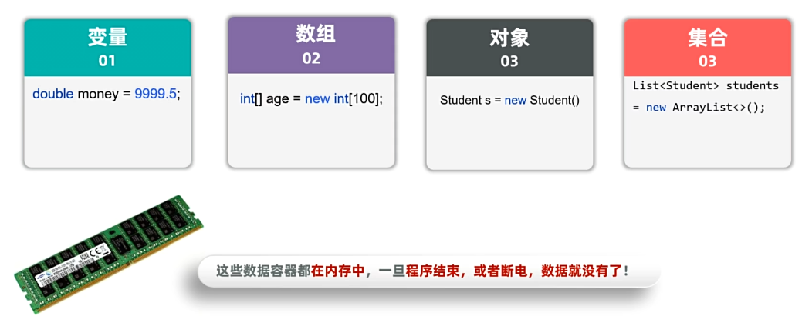

---

## 一、为什么需要 File / IO 流？

| 数据容器 | 存储位置 | 缺陷 |
| --- | --- | --- |
| 变量、数组、对象、集合 | **内存** | 程序结束或断电后，**数据消失** |
| **文件** | **磁盘** | 即便断电、程序终止，**数据不会丢失** |

| 类 | 作用 |
| --- | --- |
| **File** | File 是 java.io 包下的类，File 类的对象，用于代表当前操作系统的文件（可以是**文件、文件夹**）。 |
| **IO 流** | 用于读写数据的（可以读写文件，或网络中的数据……） |

> ⚠️ **File只能对文件本身进行操作，不能读写文件里存储的数据**，那是 IO 流的工作。

---

## 二、File 类

### 2.1 创建 File 对象（三种构造器）

> File 类的对象可以代表**文件 / 文件夹**，并可以调用其提供的方法对象文件进行操作。

| 构造器                                     | 说明                                           |
| ------------------------------------------ | ---------------------------------------------- |
| `public File(String pathname)`             | 根据文件路径创建文件对象                       |
| `public File(String parent, String child)` | 根据父路径和子路径名字创建文件对象             |
| `public File(File parent, String child)`   | 根据父路径对应文件对象和子路径名字创建文件对象 |

### 注意

- File 对象既可以代表文件、也可以代表文件夹。

- File 封装的对象仅仅是一个路径名，这个路径可以是存在的，也允许是不存在的。

- **public File(String pathname)只是创建一个文件对象，并不是创建一个文件，创建文件要另外调用方法，比如说createNewFile()方法**

  

**注意：**

* 这两种写法都是可以的，前面那种写法之所以要写两个\，是因为怕后面出现类似n这种字符，组成了换行符。所以要两个\，告诉系统这就是一个\

  ~~~java
  File f1 = new File("E:\\resource\\nlei.jpg");
  File f11 = new File("E:/resource/dlei.jpg");
  ~~~

  

### 2.2 绝对路径 vs 相对路径

| 路径类型 | 特点 | 示例 |
| --- | --- | --- |
| **绝对路径** | 从盘符开始 | `D:\\itheima\\a.txt` |
| **相对路径** | 不带盘符，默认到当前工程下查找 | `模块名\\a.txt` |

### 2.3 File 判断与获取信息

| 方法 | 说明 |
| --- | --- |
| `public boolean exists()` | 文件是否存在 |
| `public boolean isFile()` | 是否是文件 |
| `public boolean isDirectory()` | 是否是文件夹 |
| `public String getName()` | 获取文件名（含后缀） |
| `public long length()` | 获取文件大小（字节数） |
| `public long lastModified()` | 获取文件的最后修改时间（毫秒） |
| `public String getPath()` | 获取创建对象时使用的路径 |
| `public String getAbsolutePath()` | 获取绝对路径 |

~~~java
public class FileDemo1 {
    public static void main(String[] args) throws Exception {
        // 目标：创建File创建对象代表文件（文件/目录），搞清楚其提供的对文件进行操作的方法。
        // 1、创建File对象，去获取某个文件的信息
//        File f1 = new File("E:\\resource\\dlei.jpg");
        File f1 = new File("E:/resource/dlei.jpg");

        System.out.println(f1.length()); // 字节个数
        System.out.println(f1.getName());
        System.out.println(f1.isFile()); // true
        System.out.println(f1.isDirectory()); // false

        // 2、可以使用相对路径定位文件对象
        // 只要带盘符的都称之为：绝对路径 E:/resource/dlei.jpg
        // 相对路径：不带盘符，默认是到你的idea工程下直接寻找文件的。一般用来找工程下的项目文件的。
        File f2 = new File("day03-file-io\\src\\dlei01.txt");
        System.out.println(f2.length());
        System.out.println(f2.getAbsoluteFile()); // 获取绝对路径

        // 3、创建对象代表不存在的文件路径。
        File f3 = new File("E:\\resource\\dlei01.txt");
        System.out.println(f3.exists()); // 判断是否存在
        System.out.println(f3.createNewFile()); // 把这个文件创建出来

        // 4、创建对象代表不存在的文件夹路径。
        File f4 = new File("E:\\resource\\aaa");
        System.out.println(f4.mkdir()); // mkdir只能创建一级文件夹

        File f5 = new File("E:\\resource\\kkk\\jjj\\mmm");
        System.out.println(f5.mkdirs()); // mkdir可以创建多级文件夹，很重要！

        // 5、创建File对象代表存在的文件，然后删除它
        File f6 = new File("E:\\resource\\dlei01.txt");
        System.out.println(f6.delete()); // 删除文件

        // 6、创建File对象代表存在的文件夹，然后删除它
        File f7 = new File("E:\\resource\\aaa");
        System.out.println(f7.delete());  // 只能删除空文件，不能删除非空文件夹

        File f8 = new File("E:\\resource");
        System.out.println(f8.delete());  // 只能删除空文件，不能删除非空文件夹

        // 8、可以获取某个目录下的全部一级文件名称
        File f9 = new File("E:\\磊哥面授\\AI+Java基础入门课程\\day08-面向对象高级、Lambda、GUI编程\\视频");
        String[] names = f9.list();
        for (String name : names) {
            System.out.println(name);
        }

        File[] files = f9.listFiles();
        for (File file : files) {
            System.out.println(file.getAbsoluteFile()); // 获取绝对路径
        }
    }
~~~


### 2.4 File 创建与删除

| 方法 | 说明 |
| --- | --- |
| `public boolean createNewFile()` | 创建一个新的空文件 |
| `public boolean mkdir()` | 只能创建**一级**文件夹 |
| `public boolean mkdirs()` | **可以创建多级**文件夹 ⭐ |
| `public boolean delete()` | 删除文件 / **空**文件夹 |

> ⚠️ **`delete()` 注意事项**：
> - 默认**只能删除文件和空文件夹**；
> - **不能删除非空文件夹**；
> - 删除后的文件**不进回收站**。

**注意：**

* 什么叫一级，什么叫多级？

  * 比如说已经存在resource文件，那么E:\\resource\\aaa就是一级

  * 比如说已经存在resource文件，那么E:\\resource\\kkk\\jjjj\\mmm三级

  * **因为已经存在的文件夹不算数**

    ~~~java
    // 4、创建对象代表不存在的文件夹路径。
    File f4 = new File("E:\\resource\\aaa");
    System.out.println(f4.mkdir()); // mkdir只能创建一级文件夹
    
    File f5 = new File("E:\\resource\\kkk\\jjjj\\mmm");
    System.out.println(f5.mkdir()); // mkdir只能创建一级文件夹
    ~~~

    

### 2.5 遍历文件夹

| 方法名称                    | 说明                                                         |
| --------------------------- | ------------------------------------------------------------ |
| `public String[] list()`    | 获取当前目录下所有的"一级文件名称"到一个字符串数组中去返回。 |
| `public File[] listFiles()` | 获取当前目录下所有的"一级文件对象"到一个文件对象数组中去返回**（重点）** |

**使用 listFiles 方法时的注意事项：**

- 当主调是文件，或者路径不存在时，返回 null
- 当主调是空文件夹时，返回一个长度为 0 的数组
- **当主调是一个有内容的文件夹时，将里面所有一级文件和文件夹的路径放在 File 数组中返回**
- 当主调是一个文件夹，且里面有隐藏文件时，将里面所有文件和文件夹的路径放在 File 数组中返回，包含隐藏文件
- 当主调是一个文件夹，但是没有权限访问该文件夹时，返回 null

**注意：**

* **这里什么叫一级文件？**
  * 比如说要获取a文件夹下的文件，那没问题，但如果a文件夹还有个b文件夹，那是无法获取到b文件夹里的内容的。
* **listFiles()后能直接delete()，list()不能直接delete()**
  * 因为**`list()` 返回的是字符串文件名而非 `File` 对象**，需要先转成 `File` 才能删除，且转换时要记得拼上父目录路径。
  * 使用delete()删除文件后，删除的文件不进入回收站，要使用特定软件去恢复


~~~java
public class FileDemo2 {
    public static void main(String[] args) {
        // 目标：掌握File遍历一级文件对象的操作
        File dir = new File("E:/resource/dlei.txt");
        File dir2 = new File("E:\\resource\\eee777");

        /**
         * 当主调是文件，或者路径不存在时，返回null
         * 当主调是空文件夹时，返回一个长度为0的数组
         * 当主调是一个有内容的文件夹时，将里面所有一级文件和文件夹的路径放在File数组中返回
         * 当主调是一个文件夹，且里面有隐藏文件时，将里面所有文件和文件夹的路径放在File数组中返回，包含隐藏文件
         * 当主调是一个文件夹，但是没有权限访问该文件夹时，返回null
         */
        File[] files = dir2.listFiles();
        System.out.println(Arrays.toString(files));
    }
}
~~~


---

## 三、方法递归

### 3.1 什么是递归

> **方法调用自身的形式称为方法递归（recursion）**。

| 形式 | 说明 |
| --- | --- |
| **直接递归** | 方法自己调用自己 |
| **间接递归** | 方法 A 调用方法 B，方法 B 又回调方法 A |

> ⚠️ **递归如果没有控制好终止，会出现递归死循环 → 栈内存溢出（StackOverflowError）**。


### 3.2 递归三要素（必记）

```
① 递归公式：     f(n) = f(n-1) * n
② 递归终结点：    f(1) = 1
③ 递归方向：     必须走向终结点
```

### 3.3 经典案例：求 n 的阶乘

需求：计算 n 的阶乘，5 的阶乘 = 1×2×3×4×5； 6 的阶乘 = 1×2×3×4×5×6；

------

**分析**

① 假如我们认为存在一个公式是 f(n)=1×2×3×4×5×6×7×...×(n−1)×n；

② 那么公式等价形式就是： f(n)=f(n−1)×n

③ 如果求的是 1-5 的阶乘 的结果，我们**手工**应该如何应用上述公式计算。

- f(5)=f(4)×5
- f(4)=f(3)×4
- f(3)=f(2)×3
- f(2)=f(1)×2
- f(1)=1

```java
public static int f(int n) {
    if (n == 1) {       // ← 终结点
        return 1;
    } else {
        return n * f(n - 1);     // ← 递归公式
    }
}
```

**执行流程（n=5）**：

```
f(5) = f(4) * 5
f(4) = f(3) * 4
f(3) = f(2) * 3
f(2) = f(1) * 2
f(1) = 1     ← 终结
回溯：1 → 2 → 6 → 24 → 120
```

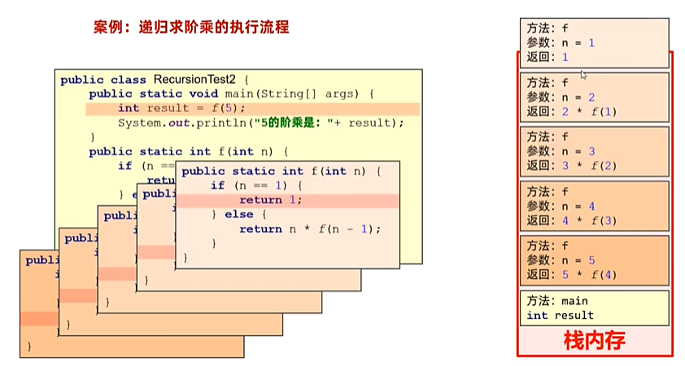

**然后这个n=1的时候返回1，返回了之后f(1)这个方法调用就会从栈里清空，然后f(1)就变成了1，有了f(1)的值后，f(2)的值也就确定了，然后f(2)这个方法调用也会从栈里清空，以此类推，这就是递归算法的完整流程**

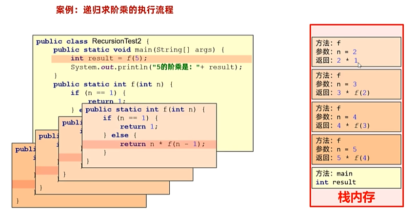

### 3.4 案例：求桃子数

猴子第一天摘下若干桃子，当即吃了一半，觉得好不过瘾，于是又多吃了一个

第二天又吃了前天剩余桃子数量的一半，觉得好不过瘾，于是又多吃了一个

以后每天都是吃前天剩余桃子数量的一半，觉得好不过瘾，又多吃了一个

等到第 10 天的时候发现桃子只有 1 个了。

需求：请问猴子第一天摘了多少个桃子？

~~~java
public class RecursionDemo3 {
    public static void main(String[] args) {
        // 目标：递归解决猴子吃桃问题。
        // 公式：
        //       f(n + 1) =  f(n) - f(n) / 2 - 1
        // 变形： 2f(n + 1) = 2f(n) - f(n) - 2
        // 变形： f(n) = 2f(n + 1) + 2

        // 终结点： f(10) = 1

        // 递归的方向: 没有问题的

        System.out.println(f(1));
        System.out.println(f(2));
        System.out.println(f(3));
        System.out.println(f(4));
    }

    public static int f(int n) {
        if (n == 10) {
            return 1;
        } else {
            return 2 * f(n + 1) + 2;
        }
    }
}
~~~


### 3.5 经典案例：文件搜索（递归应用）

> **需求**：从 D 盘中搜索 "QQ.exe"，找到后输出位置。

**分析**：

```
① 先找出 D 盘下所有一级文件对象
② 遍历每个一级文件对象，判断是否是文件
    - 是文件   → 判断是否是目标文件
    - 是文件夹 → 进入该文件夹，重复上述过程（递归）
```

~~~java
public class FileSearchTest4 {
    public static void main(String[] args) {
        // 目标：完成文件搜索。找出D:盘下的QQ.exe的位置。
        try {
            File dir = new File("D:/");
            searchFile(dir , "QQ.exe");
        } catch (Exception e) {
            e.printStackTrace();
        }
    }

    /**
     * 搜索文件
     * @param dir 搜索的目录
     * @param fileName 搜索的文件名称
     */
    public static void searchFile(File dir, String fileName) throws Exception {
        // 1、判断极端情况
        if(dir == null || !dir.exists() || dir.isFile()){
            return; // 不搜索
        }

        // 2、获取目录下的所有一级文件或者文件夹对象
        File[] files = dir.listFiles();

        // 3、判断当前目录下是否存在一级文件对象，存在才可以遍历
        if(files != null && files.length > 0){
            // 4、遍历一级文件对象
            for (File file : files) {
                // 5、判断当前一级文件对象是否是文件
                if(file.isFile()){
                    // 6、判断文件名称是否和目标文件名称一致
                    if(file.getName().contains(fileName)){
                        System.out.println("找到目标文件：" + file.getAbsolutePath());
                        Runtime r = Runtime.getRuntime();
                        r.exec(file.getAbsolutePath());
                    }
                }else{
                    // 7、如果当前一级文件对象是文件夹，则继续递归调用
                    searchFile(file, fileName);
                }
            }
        }
    }
}
~~~


---

## 四、字符集（Charset）

### 4.1 常见字符集（重点对比）

**常见字符集：**

* ASCII字符集：只有英文、数字、符号等，**占1个字节**。 
* GBK字符集：**汉字占2个字节**，**英文、数字占1个字节**。 
* UTF-8字符集：**汉字占3个字节**，**英文、数字占1个字节**。

**注意1**：

* 字符编码时使用的字符集，和解码时使用的字符集必须一致，**否则会出现乱码**

 **注意2**：

* 英文，数字一般不会乱码，因为很多字符集都兼容了ASCII编码。

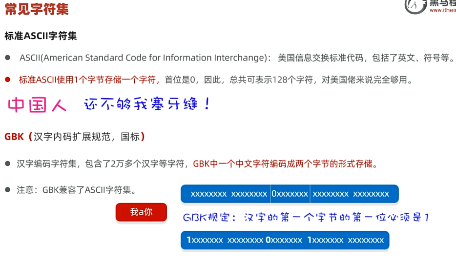

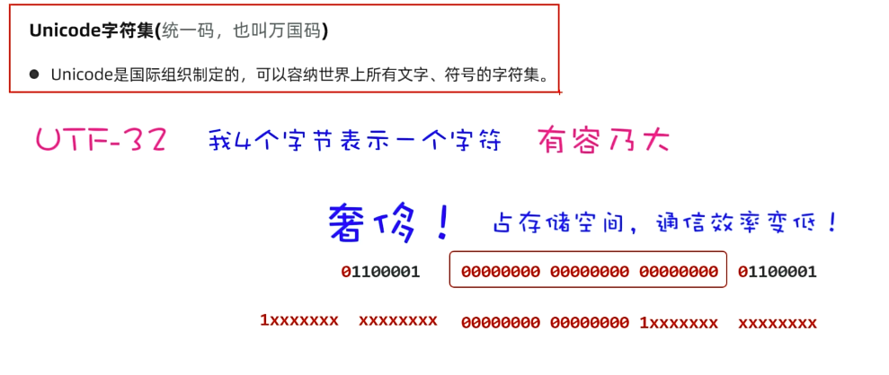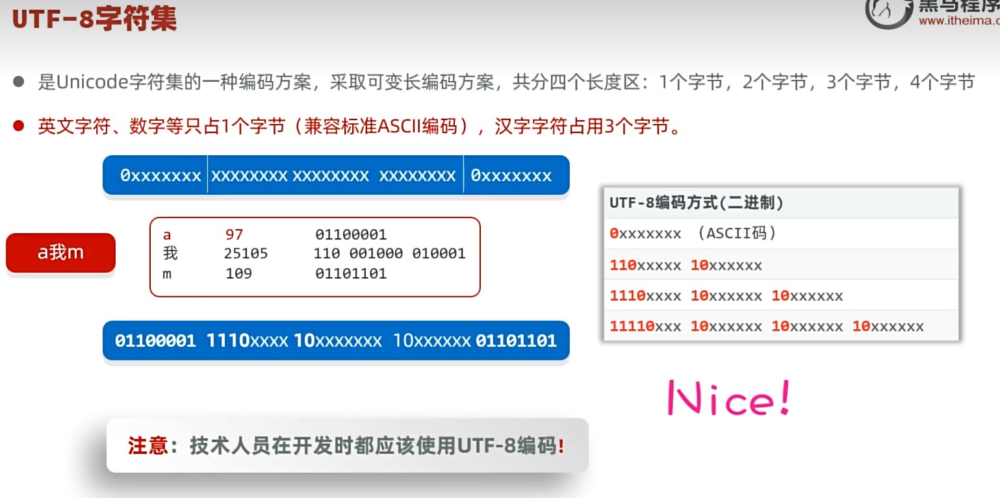

### 4.2 UTF-8 编码规则

| 字符范围 | 编码格式 |
| --- | --- |
| ASCII（1 字节）(英文、数字、符号等) | `0xxxxxxx` |
| 2 字节字符 | `110xxxxx 10xxxxxx` |
| 3 字节字符（中文） | `1110xxxx 10xxxxxx 10xxxxxx` |
| 4 字节字符 | `11110xxx 10xxxxxx 10xxxxxx 10xxxxxx` |

> 💡 **技术开发应使用 UTF-8 编码！**

### 4.3 关键规则（⚠️ 重点）

> **注意 1**：**编码时使用的字符集和解码时使用的字符集必须一致**，否则会出现乱码。
> **注意 2**：英文和数字一般不会乱码，因为大多数字符集都兼容了 ASCII 编码。

### 4.4 Java 程序的编码 / 解码

#### 字符串 → 字节（编码）

| String提供了如下方法                  | 说明                                                         |
| ------------------------------------- | ------------------------------------------------------------ |
| `byte[] getBytes()`                   | 使用平台的默认字符集将该 String 编码为一系列字节，将结果存储到新的字节数组中 |
| `byte[] getBytes(String charsetName)` | 使用指定的字符集将该 String 编码为一系列字节，将结果存储到新的字节数组中 |

```java
byte[] bytes = "你好".getBytes();             // 平台默认字符集
byte[] bytes = "你好".getBytes("GBK");         // 指定字符集
```

#### 字节 → 字符串（解码）

| String提供了如下方法                       | 说明                                                        |
| ------------------------------------------ | ----------------------------------------------------------- |
| `String(byte[] bytes)`                     | 通过使用平台的默认字符集解码指定的字节数组来构造新的 String |
| `String(byte[] bytes, String charsetName)` | 通过指定的字符集解码指定的字节数组来构造新的 String         |

```java
String s = new String(bytes);                  // 平台默认字符集
String s = new String(bytes, "GBK");           // 指定字符集
```

---

## 五、IO 流概述

**IO流的作用？**

* 读写文件数据的

### 5.1 输入流 vs 输出流（参照物：内存）

```
        【内存】
           ↑
    [输入流 Input]    把数据读到内存
           ↓
    [输出流 Output]   把数据写出去
           ↓
    【磁盘 / 网络】
```

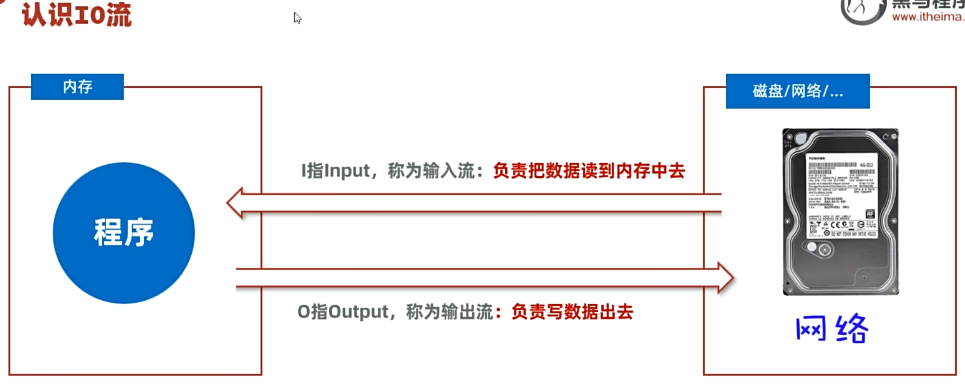

### 5.2 IO 流四大体系

| 维度 | 分类 | 适用文件 |
| --- | --- | --- |
| **字节流** | **InputStream / OutputStream** | 所有类型（音频、视频、图片、文本） |
| **字符流** | **Reader / Writer** | **只适合纯文本文件**（txt、java 等） |

### 5.3 IO 流体系图（重点）

**IO流是怎么划分的，大体分为几类，各自的作用？**

* 字节输入流 InputStream（读字节数据的） 
* 字节输出流 OutputStream（写字节数据出去的） 
* 字符输入流 Reader（读字符数据的） 
* 字符输出流 Writer（写字符数据出去的）

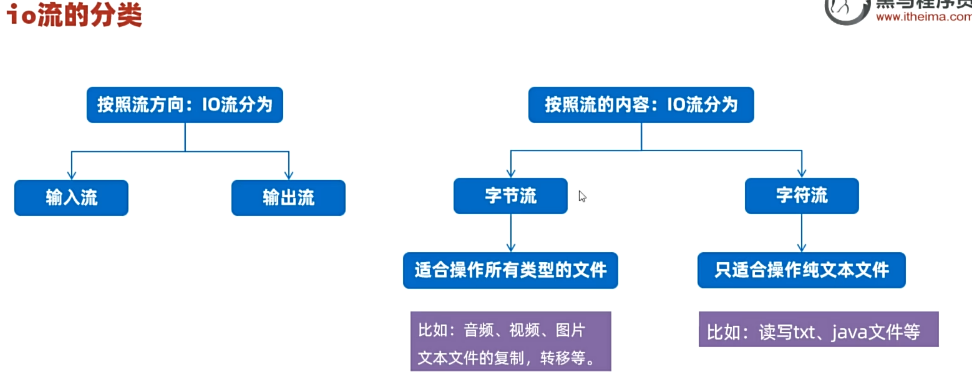

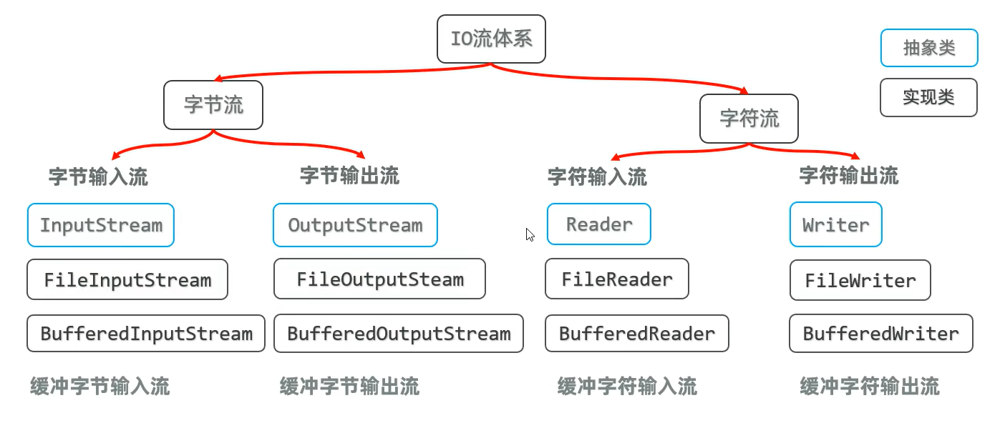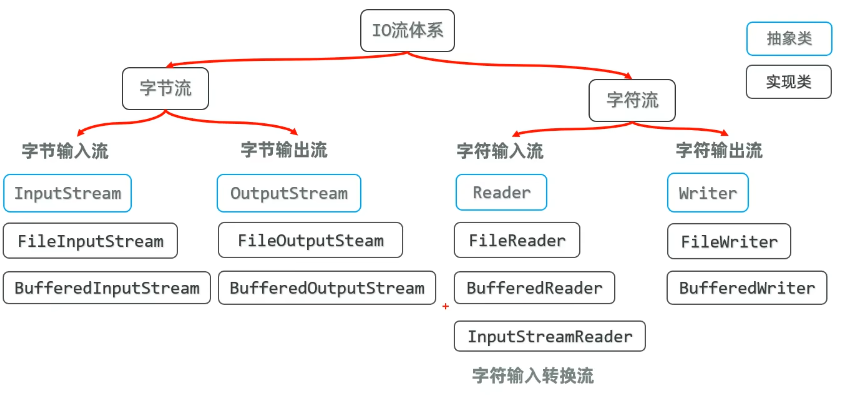

```
                  IO 流
                    │
    ┌───────────────┼───────────────┐
    │                               │
  字节流                          字符流
    │                               │
 ┌──┴──┐                       ┌────┴────┐
 输入   输出                    输入       输出
 InputStream  OutputStream      Reader    Writer
```

---

## 六、字节流

### 6.1 FileInputStream（文件字节输入流）

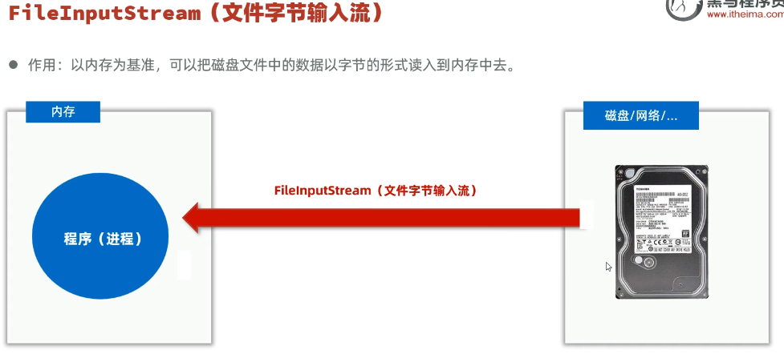

> 作用：以内存为基准，可以把磁盘文件中的数据以字节的形式读入到内存中去。

#### 构造器

| 构造器                                    | 说明                               |
| ----------------------------------------- | ---------------------------------- |
| `public FileInputStream(File file)`       | 创建字节输入流**管道**与源文件接通 |
| `public FileInputStream(String pathname)` | 创建字节输入流**管道**与源文件接通 |

#### 常用方法

| 方法 | 说明 |
| --- | --- |
| `public int read()` | 每次读一个字节返回，无数据返回 -1 |
| `public int read(byte[] buffer)` | 读到字节数组中，返回读取的字节数，如果发现没有数据可读会返回 -1。 |
| `public byte[] readAllBytes() throws IOException`⭐ | **直接将当前字节输入流对应的文件对象的字节数据装到一个字节数组返回**（JDK 9+） |

#### ⚠️ 注意事项

| 问题 | 说明 |
| --- | --- |
| **单字节读取** | 性能差，**读中文会乱码** |
| **多字节读取** | 性能提升，**读中文仍会乱码** |
| **readAllBytes()** | 一次性读完可避免乱码，但**文件过大可能内存溢出** |

> 💡 读文本适合用**字符流**；**字节流**适合做数据转移（如文件复制）。

~~~java
public class FileInputStreamDemo1 {
    public static void main(String[] args) throws Exception {
        // 目标：掌握文件字节输入流读取文件中的字节数组到内存中来。
        // 1、创建文件字节输入流管道于源文件接通
        // InputStream is = new FileInputStream(new File("day03-file-io\\src\\dlei02.txt"));
        InputStream is = new FileInputStream("D:\\myProjects\\largeModelProject\\javaSEMax\\day01\\src\\main\\java\\com\\dyx\\dilei.txt"); // 简化写法

        // 2、开始读取文件中的字节并输出： 每次读取一个字节
        // 定义一个变量记住每次读取的一个字节
        int b;
        /**
         解析：
         1.比如说is里的内容是ab12，换算成编码就是97 98 49 50
         2.int b的初始值是0
         3.第一次执行is.read()的时候为97，所以b=97，然后拿b的97判断是否不等于-1
         4.总有一天会读到最后一个字节，最后没有字节了，is.read()就会返回-1,然后while循环就结束了
         */
        while ((b = is.read()) != -1) {
            System.out.print((char) b);
//            System.out.println(b);
        }
        // 每次读取一个字节的问题：性能较差,读取汉字输出一定会乱码！

        is.close();
    }
}
~~~

~~~java
public class FileInputStreamDemo2 {
    public static void main(String[] args) throws Exception {
        // 目标：掌握文件字节输入流读取文件中的字节数组到内存中来。
        // 1、创建文件字节输入流管道于源文件接通
        InputStream is = new FileInputStream("D:\\myProjects\\largeModelProject\\javaSEMax\\day01\\src\\main\\java\\com\\dyx\\dilei2.txt"); // 简化写法

        // 2、开始读取文件中的字节并输出： 每次读取多个字节
        // 定义一个字节数组用于每次读取字节
        byte[] buffer = new byte[3];
        // 定义一个变量记住每次读取了多少个字节。
        int len;
        while ((len = is.read(buffer)) != -1) {
            /**
             这样写会带来个问题，比如说is是abc666g，然后第三个应该输出的是g，但事实上输出的结果是g66
             */
//            String str = new String(buffer);
            // 3、把读取到的字节数组转换成字符串输出,读取多少倒出多少
            String str = new String(buffer,0, len);
            System.out.print(str);
        }
        is.close();

        // 拓展：每次读取多个字节，性能得到提升，因为每次读取多个字节，可以减少硬盘和内存的交互次数，从而提升性能。
        // 依然无法避免读取汉字输出乱码的问题：存在截断汉字字节的可能性！，比如说"abcd我爱你"，这种情况就会出现乱码
    }
}
~~~

~~~java
public class FileInputStreamDemo3 {
    public static void main(String[] args) throws Exception {
        // 目标：掌握文件字节输入流读取文件中的字节数组到内存中来。
        // 1、创建文件字节输入流管道于源文件接通
        InputStream is = new FileInputStream("D:\\myProjects\\largeModelProject\\javaSEMax\\day01\\src\\main\\java\\com\\dyx\\dilei2.txt"); // 简化写法

        // 2、一次性读完文件的全部字节:可以避免读取汉字输出乱码的问题。
        byte[] bytes = is.readAllBytes();

        String rs = new String(bytes);
        System.out.println(rs);

        is.close();
    }
}
~~~


### 6.2 FileOutputStream（文件字节输出流）

* 作用：以内存为基准，把内存中的数据以字节的形式写出到文件中去。

#### 构造器

| 构造器                                                     | 说明                                          |
| ---------------------------------------------------------- | --------------------------------------------- |
| `public FileOutputStream(File file)`                       | 创建字节输出流管道与源文件对象接通            |
| `public FileOutputStream(String filepath)`                 | 创建字节输出流管道与源文件路径接通            |
| `public FileOutputStream(File file, boolean append)`       | 创建字节输出流管道与源文件对象接通,可追加数据 |
| `public FileOutputStream(String filepath, boolean append)` | 创建字节输出流管道与源文件路径接通,可追加数据 |

#### 常用方法

| 方法名称                                             | 说明                         |
| ---------------------------------------------------- | ---------------------------- |
| `public void write(int a)`                           | 写一个字节出去               |
| `public void write(byte[] buffer)`                   | 写一个字节数组出去           |
| `public void write(byte[] buffer, int pos, int len)` | 写一个字节数组的一部分出去。 |
| `public void close() throws IOException`             | 关闭流。                     |

**注意：**

* **读的话需要提供文件给人读，但写不需要，写会自动生成**
* **用完流要关闭**
  * 因为在程序层面我们看到的是流，实际上在底层是内存和硬盘，内存和硬盘中间有一条总线，占用着硬件资源，磁盘速度比较慢，内存速度比较快，所以用完后要把管道快速关闭掉，可以把占用的总线释放出去，同时也可以把占用的一些cpu资源释放出去给别人用。调用close方法目的就是关闭管道，释放占用的硬件资源，比如说总线资源，电脑cpu帮它做的一些数据的处理计算，都要让出去给别人用，这样整体性能会好一点。 


**字节输出流如何实现写出去的数据可以换行？**

* 因为字符串写不出去，需要写成字节数组

  ~~~java
  os.write("\r\n".getBytes());
  ~~~

~~~java
public class FileOutputStreamDemo1 {
    public static void main(String[] args) throws Exception {
        // 目标：学会使用文件字节输出流。
        // 1、创建文件字节输出流管道与目标文件接通
        // OutputStream os = new FileOutputStream("day03-file-io/src/dlei05-out.txt"); // 覆盖管道
        OutputStream os = new FileOutputStream("day03-file-io/src/dlei05-out.txt", true); // 追加数据

        // 2、写入数据
        //  public void write(int b)
        os.write(97); // 写入一个字节数据
        os.write('b'); // 写入一个字符数据
//        os.write('徐'); // 写入一个字符数据 会乱码
        os.write("\r\n".getBytes()); // 换行

        // 3、写一个字节数组出去
        // public void write(byte[] b)
        byte[] bytes = "我爱你中国666".getBytes();
        os.write(bytes);
        os.write("\r\n".getBytes()); // 换行

        // 4、写一个字节数组的一部分出去
        // public void write(byte[] b, int pos, int len)
        os.write(bytes, 0, 3);
        os.write("\r\n".getBytes()); // 换行

        os.close(); // 关闭管道 释放资源
    }
}
~~~


### 6.3 文件复制（字节流的最佳应用场景）

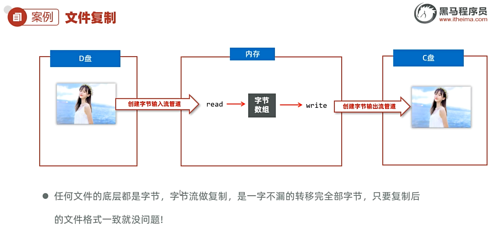

```
D 盘文件                              C 盘新文件
  │                                       ↑
  ↓ FileInputStream.read()                │ FileOutputStream.write()
       字节数组（缓冲）                    │
  ──────────────────────────────────────→
```

> ⭐ **任何文件的底层都是字节，字节流做复制是一字不漏的转移完全部字节，只要复制后的文件格式一致就没问题！**

---

## 七、资源释放

### 7.1 方式一：`try-catch-finally`

~~~java
try {
    ...
} catch (IOException e) {
    e.printStackTrace();
} finally {
    ...
}
~~~

```java
public class CopyDemo1 {
    public static void main(String[] args) {
        // 目标：使用字节流完成文件的复制操作。
        // 源文件：E:\resource\jt.jpg
        // 目标文件：D:\jt_new.jpg （复制过去的时候必须带文件名的，无法自动生成文件名。）
        copyFile("E:\\resource\\jt.jpg", "D:\\jt_new.jpg");
    }

    // 复制文件
    public static void copyFile(String srcPath, String destPath)  {
        // 1、创建一个文件字节输入流管道与源文件接通
        InputStream fis = null;
        OutputStream fos = null;
        try {
            fis = new FileInputStream(srcPath);
            fos = new FileOutputStream(destPath);
            // 2、读取一个字节数组，写入一个字节数组  1024 + 1024 + 3
            byte[] buffer = new byte[1024];
            int len;
            while ((len = fis.read(buffer)) != -1) {
                fos.write(buffer, 0, len); // 读取多少个字节，就写入多少个字节
            }
            System.out.println("复制成功！");
        } catch (Exception e) {
            e.printStackTrace();
        } finally {
            // 最后一定会执行一次：即便程序出现异常！
            // 3、释放资源
            try {
                if(fos != null) fos.close();
            } catch (Exception e) {
                e.printStackTrace();
            }
            try {
                if(fis != null) fis.close();
            } catch (Exception e) {
                e.printStackTrace();
            }
        }
    }
}

```

> 💡 **`finally` 特点**：无论 try 是否异常，**都一定会执行（除非 JVM 终止）**。
>
> 作用：**一般用于在程序执行完成后进行资源的释放操作（专业级做法）**。

### 7.2 方式二：`try-with-resource`（JDK 7+，推荐 ⭐）

~~~java
try (定义资源1; 定义资源2; …) {
    //可能出现异常的代码;
} catch (异常类名 变量名) {
    //异常的处理代码;
}
~~~

**该资源使用完毕后，会自动调用其`close()`方法，完成对资源的释放！**

- `()` 中只能放置资源，否则报错
- 什么是资源呢？
- 资源一般指的是最终实现了`AutoCloseable`接口。

```java
public class CopyDemo2 {
    public static void main(String[] args) {
        // 目标：掌握资源的新方式：try-with-resource
        // 源文件：E:\resource\jt.jpg
        // 目标文件：D:\jt_new.jpg （复制过去的时候必须带文件名的，无法自动生成文件名。）
        copyFile("E:\\resource\\jt.jpg", "D:\\jt_new.jpg");
    }

    // 复制文件
    public static void copyFile(String srcPath, String destPath)  {
        // 1、创建一个文件字节输入流管道与源文件接通
        try (
                 // 这里只能放置资源对象，用完后，最终会自动调用其close方法关闭！！
                 InputStream fis = new FileInputStream(srcPath);
                 OutputStream fos = new FileOutputStream(destPath);
                 MyConn conn = new MyConn(); // 自定义的资源对象 最终会自动调用其close方法关闭！！
                ){
            // 2、读取一个字节数组，写入一个字节数组  1024 + 1024 + 3
            byte[] buffer = new byte[1024];
            int len;
            while ((len = fis.read(buffer)) != -1) {
                fos.write(buffer, 0, len); // 读取多少个字节，就写入多少个字节
            }
            System.out.println("复制成功！");
        } catch (Exception e) {
            e.printStackTrace();
        }
    }
}

class MyConn implements Closeable{
    @Override
    public void close() throws IOException {
        System.out.println("dlei的资源关闭了！");
    }
}
```

> ⚠️ `()` 中只能放置**资源**（实现了 `AutoCloseable` 接口的对象）。

```java
public interface Closeable extends AutoCloseable { }
public abstract class InputStream implements Closeable { }
public abstract class OutputStream implements Closeable, Flushable { }
```

---

## 八、字符流

### 8.1 FileReader（文件字符输入流）

> 作用：以内存为基准，可以把文件中的数据以字符的形式读入到内存中去。

#### 构造器

| 构造器                               | 说明                           |
| ------------------------------------ | ------------------------------ |
| `public FileReader(File file)`       | 创建字符输入流管道与源文件接通 |
| `public FileReader(String pathname)` | 创建字符输入流管道与源文件接通 |

#### 常用方法

| 方法名称                         | 说明                                                         |
| -------------------------------- | ------------------------------------------------------------ |
| `public int read()`              | 每次读取一个字符返回,如果发现没有数据可读会返回 -1。         |
| `public int read(char[] buffer)` | 每次用一个字符数组去读取数据,返回字符数组读取了多少个字符,如果发现没有数据可读会返回 -1。 |

> 💡 **文件字符输入流的作用是啥? **
>
> * 可以用于读取文本文件中的字符，非常适合。
>
>  💡**文件字符输入流如何读取数据? **
>
> * 创建FileReader的对象，调用其read方法读取字符。

~~~java
public class FileReaderDemo1 {
    public static void main(String[] args) {
        // 目标：掌握文件字符输入流读取字符内容到程序中来。
        try (
                // 1、创建文件字符输入流与源文件接通
                Reader fr = new FileReader("D:\\myProjects\\largeModelProject\\javaSEMax\\day01\\src\\main\\java\\com\\dyx\\dilei3.txt");
        ) {
            // 2、定义一个字符数组，每次读多个字符
            char[] chs = new char[3];
            int len; // 用于记录每次读取了多少个字符
            while ((len = fr.read(chs)) != -1){
                // 3、每次读取多个字符，并把字符数组转换成字符串输出
                String str = new String(chs,0,len);
                System.out.print(str);
            }
            // 拓展：文件字符输入流每次读取多个字符，性能较好，而且读取中文
            // 是按照字符读取，不会出现乱码！这是一种读取中文很好的方案。
        }catch (Exception e){
            e.printStackTrace();
        }
    }
}
~~~


### 8.2 FileWriter（文件字符输出流）

> 作用：以内存为基准，把内存中的数据以字符的形式写出到文件中去。

#### 构造器（同 FileOutputStream）

| 构造器                                                | 说明                                           |
| ----------------------------------------------------- | ---------------------------------------------- |
| `public FileWriter(File file)`                        | 创建字节输出流管道与源文件对象接通             |
| `public FileWriter(String filepath)⭐`                 | 创建字节输出流管道与源文件路径接通             |
| `public FileWriter(File file, boolean append)`        | 创建字节输出流管道与源文件对象接通，可追加数据 |
| `public FileWriter(String filepath, boolean append)⭐` | 创建字节输出流管道与源文件路径接通，可追加数据 |

#### 常用方法

| 方法名称                                    | 说明                 |
| ------------------------------------------- | -------------------- |
| `void write(int c)`                         | 写一个字符           |
| `void write(String str)`                    | 写一个字符串         |
| `void write(String str, int off, int len)`  | 写一个字符串的一部分 |
| `void write(char[] cbuf)`                   | 写入一个字符数组     |
| `void write(char[] cbuf, int off, int len)` | 写入字符数组的一部分 |

~~~java
public class FileWriterDemo1 {
    public static void main(String[] args) {
        // 目标：搞清楚文件字符输出流的使用：写字符出去的流。

        try (
                // 1. 创建一个字符输出流对象，指定写出的目的地。
//                Writer fw = new FileWriter("day03-file-io/src/dlei07-out.txt"); // 覆盖管道
                Writer fw = new FileWriter("day01/src/main/java/com/dyx/dlei07-out.txt", true); // 追加数据
        ){

            // 2. 写一个字符出去：  public void write(int c)
            fw.write('a');
            fw.write(98);
            fw.write('磊');
            fw.write("\r\n"); // 换行

            // 3、写一个字符串出去：  public void write(String str)
            fw.write("java");
            fw.write("我爱Java，虽然Java不是最好的编程之一,但是可以挣钱");
            fw.write("\r\n"); // 换行

            // 4、写字符串的一部分出去：  public void write(String str, int off, int len)
            fw.write("java", 1, 2);
            fw.write("\r\n"); // 换行

            // 5、写一个字符数组出去：  public void write(char[] cbuf)
            char[] chars = "java".toCharArray();
            fw.write(chars);
            fw.write("\r\n"); // 换行

            // 6、写字符数组的一部分出去：  public void write(char[] cbuf, int off, int len)
            fw.write(chars, 1, 2);
            fw.write("\r\n"); // 换行

//             fw.flush(); // 刷新缓冲区，将缓冲区中的数据全部写出去。
            // 刷新后，流可以继续使用。
            // fw.close(); // 关闭资源，关闭包含了刷新！关闭后流不能继续使用！

        } catch (Exception e) {
            e.printStackTrace();
        }
    }
}
~~~


### 8.3 ⚠️ 字符输出流注意事项

> **字符输出流写出数据后，必须刷新流，或者关闭流，写出去的数据才能生效!!**

**⭐注意：**

* **为什么要刷新？**
  * ⭐⭐⭐⭐⭐在文件输出流写字符数据出去的时候，比如说fw.write('a');最开始的想法是写一次字符就做一次I/O，再写一次字符就又做一次I/O，如果这里面有一百个字符的时候，就要进行一百次I/O调用，性能很差。后来就变成在管道里面搞一个内存缓冲区，就是Writer fw = new FileWriter("day01/src/main/java/com/dyx/dlei07-out.txt", true);这里的fw管道，之后写数据就不是直接写到磁盘里去，就是写到内存缓冲区里，内存缓冲区性能极快，因为在内存中，所以想法就是把数据都先写到内存缓冲区里，最后再做一次系统I/O,这样的话速度就会很快，并且I/O调用少，就很好。
  * ⭐⭐⭐⭐⭐正是由于数据不会直接写到文件里，而是会写到内存缓冲区，所以程序在结束前一定要做刷新，刷新就是通知这个内存，万一有些数据还没从内存同步到文件中，通知内存赶紧同步到内存中，因为程序要关闭了。因为程序关闭了，内存缓冲区就消失了，就导致数据丢失。

| 方法名称                                 | 说明                                                   |
| ---------------------------------------- | ------------------------------------------------------ |
| `public void flush() throws IOException` | **刷新流**,就是将内存中缓存的数据立即写到文件中去生效! |
| `public void close() throws IOException` | **关闭流**的操作,**包含了刷新!**                       |

---

## 九、缓冲流（性能优化 ⚡）

### 9.1 缓冲流的体系

**注解：**⭐⭐⭐⭐⭐要进行**32次系统调用**才能把这个文件拷贝出去，可以通过缓冲字节输入流把原本的字节输入流做包装，包装完之后，这个缓冲字节输入流默认是有8KB的大小的一个缓冲池，就相当于把一个低级的字节输入流包装成了高级的缓冲字节输入流，多了8KB的缓冲池，这是什么意思呢？意思就是以后会8KB 8KB的往内存中读取磁盘中的数据，换句话来说只需要两次系统调用即可，然后字节数组再从缓冲池里读取数据，但字节数组再从缓冲池里读取数据的性能可以说是极高，耗时几乎忽略不计了 ，所以在使用缓冲字节输入流的情况下就只需要**4次系统调用**。

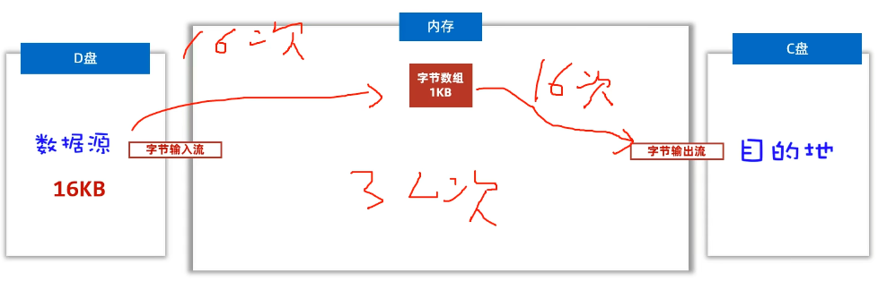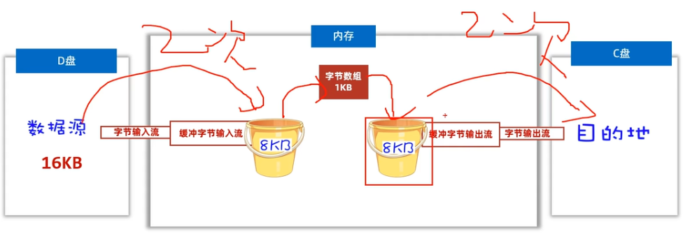

**作用：**可以**提高**字节输入流读取数据的**性能**

**原理：**缓冲字节输入流自带了**8KB**缓冲池；缓冲字节输出流也自带了**8KB**缓冲池。

```
原始流                  缓冲流
─────────              ──────────────────
字节输入流          →  BufferedInputStream
字节输出流          →  BufferedOutputStream
字符输入流          →  BufferedReader
字符输出流          →  BufferedWriter
```

> ⭐ **缓冲流自带 8KB 缓冲区，可显著提升原始流的读写性能。**

### 9.2 字节缓冲流

```java
// 包装原始流
BufferedInputStream bis = new BufferedInputStream(new FileInputStream("src.txt"));
BufferedOutputStream bos = new BufferedOutputStream(new FileOutputStream("dst.txt"));
```

| 构造器                                         | 说明                                                         |
| ---------------------------------------------- | ------------------------------------------------------------ |
| `public BufferedInputStream(InputStream is)`   | 把低级的字节输入流包装成一个高级的缓冲字节输入流，从而提高读取数据的性能 |
| `public BufferedOutputStream(OutputStream os)` | 把低级的字节输出流包装成一个高级的缓冲字节输出流，从而提高写数据的性能 |

~~~java
public class CopyDemo1 {
    public static void main(String[] args) {
        // 目标：掌握缓冲字节流的使用。
        // 源文件：E:\resource\jt.jpg
        // 目标文件：D:\jt_new.jpg （复制过去的时候必须带文件名的，无法自动生成文件名。）
        copyFile("E:\\resource\\jt.jpg", "D:\\jt_new2.jpg");
    }

    // 复制文件
    public static void copyFile(String srcPath, String destPath)  {
        // 1、创建一个文件字节输入流管道与源文件接通
        try (
                // 这里只能放置资源对象，用完后，最终会自动调用其close方法关闭！！
                InputStream fis = new FileInputStream(srcPath);
                // 把低级的字节输入流包装成高级的缓冲字节输入流
                InputStream bis = new BufferedInputStream(fis);

                OutputStream fos = new FileOutputStream(destPath);
                // 把低级的字节输出流包装成高级的缓冲字节输出流
                OutputStream bos = new BufferedOutputStream(fos);
                ){
            // 2、读取一个字节数组，写入一个字节数组  1024 + 1024 + 3
            byte[] buffer = new byte[1024];
            int len;
            while ((len = bis.read(buffer)) != -1) {
                bos.write(buffer, 0, len); // 读取多少个字节，就写入多少个字节
            }
            System.out.println("复制成功！");
        } catch (Exception e) {
            e.printStackTrace();
        }
    }
}
~~~


### 9.3 字符缓冲流

#### BufferedReader

> 作用：自带 **8K（8192）** 的字符缓冲池，可以**提高字符输入流读取字符数据的性能**。


**构造器：**

| 构造器                            | 说明                                                         |
| --------------------------------- | ------------------------------------------------------------ |
| `public BufferedReader(Reader r)` | 把低级的字符输入流包装成字符缓冲输入流管道，从而提高字符输入流读字符数据的性能 |

**字符缓冲输入流新增的功能：按照行读取字符**

| 方法                       | 说明                                                  |
| -------------------------- | ----------------------------------------------------- |
| `public String readLine()` | **读取一行数据返回**，如果没有数据可读了，会返回 null |

~~~java
public class BufferedReaderDemo1 {
    public static void main(String[] args) {
        // 目标：搞清楚缓冲字符输入流读取字符内容：性能提升了，多了按照行读取文本的能力。
        try (
                // 1、创建文件字符输入流与源文件接通
                Reader fr = new FileReader("day03-file-io\\src\\dlei08.txt");
                // 2、创建缓冲字符输入流包装低级的字符输入流
                BufferedReader br = new BufferedReader(fr);
        ) {
//            // 2、定义一个字符数组，每次读多个字符
//            char[] chs = new char[1024];
//            int len; // 用于记录每次读取了多少个字符
//            while ((len = br.read(chs)) != -1){
//                // 3、每次读取多个字符，并把字符数组转换成字符串输出
//                String str = new String(chs,0,len);
//                System.out.print(str);
//            }

//            System.out.println(br.readLine());
//            System.out.println(br.readLine());
//            System.out.println(br.readLine());
//            System.out.println(br.readLine());
//            System.out.println(br.readLine());
//            System.out.println(br.readLine()); // null

            // 使用循环改进，来按照行读取数据。
            // 定义一个字符串变量用于记住每次读取的一行数据
            String line;
            while ((line = br.readLine()) != null){
                System.out.println(line);
            }
            // 目前读取文本最优雅的方案：性能好，不乱码，可以按照行读取。
        }catch (Exception e){
            e.printStackTrace();
        }
    }
}
~~~


#### BufferedWriter

> 作用：自带 8K 的字符缓冲池，可以提高字符输出流写字符数据的性能。

**构造器**

| 构造器                            | 说明                                                         |
| --------------------------------- | ------------------------------------------------------------ |
| `public BufferedWriter(Writer r)` | 把低级的字符输出流包装成一个高级的缓冲字符输出流管道，从而提高字符输出流写数据的性能 |

**字符缓冲输出流新增的功能：换行**

| 方法                     | 说明 |
| ------------------------ | ---- |
| `public void newLine()`⭐ | 换行 |

~~~java
public class BufferedWriterDemo1 {
    public static void main(String[] args) {
        // 目标：搞清楚缓冲字符输出流的使用：提升了字符输出流的写字符的性能，多了换行功能
        try (
                // 1. 创建一个字符输出流对象，指定写出的目的地。
//                Writer fw = new FileWriter("day03-file-io/src/dlei07-out.txt"); // 覆盖管道
                Writer fw = new FileWriter("day03-file-io/src/dlei07-out.txt", true); // 追加数据

                // 2. 创建一个缓冲字符输出流对象，把字符输出流对象作为构造参数传递给缓冲字符输出流对象。
                BufferedWriter bw = new BufferedWriter(fw);
        ){

            // 2. 写一个字符出去：  public void write(int c)
            bw.write('a');
            bw.write(98);
            bw.write('磊');
            bw.newLine(); // 换行

            // 3、写一个字符串出去：  public void write(String str)
            bw.write("java");
            bw.write("我爱Java，虽然Java不是最好的编程之一,但是可以挣钱");
            bw.newLine(); // 换行

            // 4、写字符串的一部分出去：  public void write(String str, int off, int len)
            bw.write("java", 1, 2);
            bw.newLine(); // 换行

            // 5、写一个字符数组出去：  public void write(char[] cbuf)
            char[] chars = "java".toCharArray();
            bw.write(chars);
            bw.newLine(); // 换行

            // 6、写字符数组的一部分出去：  public void write(char[] cbuf, int off, int len)
            bw.write(chars, 1, 2);
            bw.newLine(); // 换行

        } catch (Exception e) {
            e.printStackTrace();
        }
    }
}
~~~


### 9.4 小结

**缓冲流有几种？**

*  字节缓冲输入流：BufferedInputStream 
* 字节缓冲输出流：BufferedOutputStream 
* 字符缓冲输入流：BufferedReader 
* 字符缓冲输出流：BufferedWriter 

**字节缓冲流为什么提高了字节流读写数据的性能？ **

* **字节缓冲流自带8KB缓冲区** 
* **可以提高原始字节流、字符流读写数据的性能** 

**字节缓冲流如何使用？ **

* public BufferedOutputStream(OutputStream os) 
* public BufferedInputStream(InputStream is) 
* 功能上并无很大变化，性能提升了

### 9.5 性能对比（结论）

> ✅ **推荐组合**：**字节缓冲流 + 字节数组** 是目前性能最优的复制方案。

测试用例：分别使用原始的字节流，以及字节缓冲流复制一个很大视频。 

测试步骤： 

① 使用低级的字节流按照一个一个字节的形式复制文件。

 ② 使用低级的字节流按照字节数组的形式复制文件。

 ③ 使用高级的缓冲字节流按照一个一个字节的形式复制文件。

 ④ 使用高级的缓冲字节流按照字节数组的形式复制文件。

```java
try (
    BufferedInputStream bis = new BufferedInputStream(new FileInputStream(src));
    BufferedOutputStream bos = new BufferedOutputStream(new FileOutputStream(dst));
) {
    byte[] buffer = new byte[1024];
    int len;
    while ((len = bis.read(buffer)) != -1) {
        bos.write(buffer, 0, len);
    }
}
```

~~~java

public class TimeTest3 {
    private static final String SRC_FILE = "E:\\磊哥面授\\AI+Java基础加强课程\\day02-集合架构\\视频\\16、Stream流的终结方法.avi";
    private static final String DEST_FILE = "D:\\";
    public static void main(String[] args) {
        // 目标：缓冲流，低级流的性能分析。
        //使用低级的字节流按照一个一个字节的形式复制文件: 非常的慢，简直让人无法忍受，直接淘汰，禁止使用！！
        // copyFile1();
        //使用低级的字节流按照字节数组的形式复制文件: 是比较慢的，还可以接受。
        copyFile2();
        //使用高级的缓冲字节流按照一个一个字节的形式复制文件：虽然是高级管道，但一个一个字节的复制还是太慢了，无法忍受，直接淘汰！
        // copyFile3();
        //使用高级的缓冲字节流按照字节数组的形式复制文件: 非常快！推荐使用！
        copyFile4();
    }

    //使用高级的缓冲字节流按照字节数组的形式复制文件。
    private static void copyFile4() {
        long start = System.currentTimeMillis();
        try (
                InputStream fis = new FileInputStream(SRC_FILE);
                InputStream bis = new BufferedInputStream(fis);
                OutputStream fos = new FileOutputStream(DEST_FILE + "4.avi");
                OutputStream bos = new BufferedOutputStream(fos);
        ) {
            byte[] bytes = new byte[1024*32];
            int len;
            while ((len = bis.read(bytes)) != -1) {
                bos.write(bytes, 0, len);
            }
        } catch (Exception e){
            e.printStackTrace();
        }
        long end = System.currentTimeMillis();
        System.out.println("高级的缓冲字节流按照字节数组的形式复制文件，耗时：" + (end - start) / 1000.0 + "s");
    }

    //使用高级的缓冲字节流按照一个一个字节的形式复制文件。
    private static void copyFile3() {
        long start = System.currentTimeMillis();
        try (
                InputStream fis = new FileInputStream(SRC_FILE);
                InputStream bis = new BufferedInputStream(fis);
                OutputStream fos = new FileOutputStream(DEST_FILE + "3.avi");
                OutputStream bos = new BufferedOutputStream(fos);
        ) {
            int b;
            while ((b = bis.read()) != -1) {
                bos.write(b);
            }
        }catch (Exception e){
            e.printStackTrace();
        }
        long end = System.currentTimeMillis();
        System.out.println("高级的缓冲字节流按照一个一个字节的形式复制文件，耗时：" + (end - start) / 1000.0 + "s");
    }

    //使用低级的字节流按照字节数组的形式复制文件。
    private static void copyFile2() {
        long start = System.currentTimeMillis();
        try (
                InputStream fis = new FileInputStream(SRC_FILE);
                OutputStream fos = new FileOutputStream(DEST_FILE + "2.avi");
        ) {
            byte[] bytes = new byte[1024*32];
            int len;
            while ((len = fis.read(bytes)) != -1) {
                fos.write(bytes, 0, len);
            }
        }catch (Exception e){
            e.printStackTrace();
        }
        long end = System.currentTimeMillis();
        System.out.println("低级的字节流按照字节数组的形式复制文件，耗时：" + (end - start) / 1000.0 + "s");
    }

    //使用低级的字节流按照一个一个字节的形式复制文件。
    public static void copyFile1() {
        // 拿系统当前时间
        long start = System.currentTimeMillis(); // 此刻时间毫秒值： 从1970-1-1 00:00:00开始走到此刻的总毫秒值  1s = 1000ms
        try (
                InputStream fis = new FileInputStream(SRC_FILE);
                OutputStream fos = new FileOutputStream(DEST_FILE + "1.avi");
        ) {
            int b;
            while ((b = fis.read()) != -1) {
                fos.write(b);
            }
        } catch (Exception e) {
            e.printStackTrace();
        }
        long end = System.currentTimeMillis();  // 此刻时间毫秒值： 从1970-1-1 00:00:00开始走到此刻的总毫秒值  1s = 1000ms
        System.out.println("低级字节流按照一个一个字节的形式复制文件，耗时：" + (end - start) / 1000.0 + "s");
    }
}
~~~

---

## 十、其他常用流

### 10.1 字符输入转换流 InputStreamReader（解决乱码 ⭐）

> 解决不同编码时，字符流读取文本内容乱码的问题。
>
>  解决思路：**先获取文件的原始字节流**，**再将其按真实的字符集编码转成字符输入流，这样字符输入流中的字符就不乱码了**。*

**使用场景：**

* 比如说你的代码是UTF-8，但你要去读取GBK的文件

**解决思路**：

```
原始字节流  ──→  按真实字符集编码  ──→  字符输入流  →  字符不再乱码
```

```java
// 重点用法：指定字符集编码
InputStreamReader isr = new InputStreamReader(
    new FileInputStream("a.txt"),
    "GBK"      // ← 指定编码
);
```

| 构造器                                                      | 说明                                                         |
| ----------------------------------------------------------- | ------------------------------------------------------------ |
| `public InputStreamReader(InputStream is)`                  | 把原始的字节输入流，按照代码**默认编码**转成字符输入流（与直接用 FileReader 的效果一样） |
| `public InputStreamReader(InputStream is, String charset)`⭐ | 把原始的字节输入流，**按照指定字符集编码**转成字符输入流（重点） |

~~~java
public class Demo2 {
    public static void main(String[] args) {
        // 目标：使用字符输入转换流InputStreamReader解决不同编码读取乱码的问题、
        // 代码：UTF-8   文件 UTF-8  读取不乱码
        // 代码：UTF-8   文件 GBK  读取乱码
        try (
                // 先提取文件的原始字节流
                InputStream is = new FileInputStream("/Users/dengyixuan/learnLargeModel/baseJavaMax/src/main/java/com/dyx/dlei09.txt");
                // 指定字符集把原始字节流转换成字符输入流
                Reader isr = new InputStreamReader(is, "GBK");
                // 2、创建缓冲字符输入流包装低级的字符输入流
                BufferedReader br = new BufferedReader(isr);
        ) {
            // 定义一个字符串变量用于记住每次读取的一行数据
            String line;
            while ((line = br.readLine()) != null){
                System.out.println(line);
            }
        }catch (Exception e){
            e.printStackTrace();
        }
    }
}
~~~


### 10.2 打印流 PrintStream / PrintWriter

> **作用**：**更方便、更高效的打印数据**，打印啥出去就是啥出去。

**为什么说可以【打印啥出去就是啥出去】？**

* 因为平时你可能写个97到文件里，就变成a，你平时写个true进文件，但写不了，要变成字符串或者字节才能写进去。

#### PrintStream（继承自字节输出流）

| 构造器                                                       | 说明                                     |
| ------------------------------------------------------------ | ---------------------------------------- |
| `public PrintStream(OutputStream/File/String)`               | 打印流直接通向字节输出流/文件/文件路径   |
| `public PrintStream(String fileName, Charset charset)`       | 可以指定写出去的字符编码                 |
| `public PrintStream(OutputStream out, boolean autoFlush)`    | 可以指定实现自动刷新                     |
| `public PrintStream(OutputStream out, boolean autoFlush, String encoding)` | 可以指定实现自动刷新，并可指定字符的编码 |

| 方法                                         | 说明                       |
| -------------------------------------------- | -------------------------- |
| `public void println(Xxx xx)`                | 打印任意类型的数据出去     |
| `public void write(int/byte[]/byte[]一部分)` | 可以支持写**字节**数据出去 |

~~~java
public class PrintStreamDemo1 {
    public static void main(String[] args) {
        // 目标：打印流的使用。
       try (
//               PrintStream ps = new PrintStream("day03-file-io/src/ps.txt");
               PrintStream ps = new PrintStream(new FileOutputStream("day03-file-io/src/ps.txt", true));
//               PrintWriter ps = new PrintWriter("day03-file-io/src/ps.txt");
               ){
           ps.println(97);
           ps.println('a');
           ps.println("黑马");
           ps.println(true);
           ps.println(99.9);
       }catch (Exception e){
           e.printStackTrace();
       }
    }
}
~~~


#### PrintWriter（继承自字符输出流）

构造器和方法与 PrintStream 类似。

| 构造器                                                       | 说明                                     |
| ------------------------------------------------------------ | ---------------------------------------- |
| `public PrintWriter(OutputStream/Writer/File/String)`        | 打印流直接通向字节输出流/文件/文件路径   |
| `public PrintWriter(String fileName, Charset charset)`       | 可以指定写出去的字符编码                 |
| `public PrintWriter(OutputStream out/Writer, boolean autoFlush)` | 可以指定实现自动刷新                     |
| `public PrintWriter(OutputStream out, boolean autoFlush, String encoding)` | 可以指定实现自动刷新，并可指定字符的编码 |

| 方法                                      | 说明                       |
| ----------------------------------------- | -------------------------- |
| `public void println(Xxx xx)`             | 打印任意类型的数据出去     |
| `public void write(int/String/char[]/..)` | 可以支持写**字符**数据出去 |

#### 区别对比

| 项 | PrintStream | PrintWriter |
| --- | --- | --- |
| **继承** | OutputStream（字节流） | Writer（字符流） |
| **支持** | 写字节数据 | 写字符数据 |
| **打印功能** | 完全一样 ⭐ | 完全一样 ⭐ |


### 10.3 数据流 DataInputStream / DataOutputStream

> **允许把数据和其类型一并写出去 / 读取出来。**

| 构造器                                      | 说明                                 |
| ------------------------------------------- | ------------------------------------ |
| `public DataOutputStream(OutputStream out)` | 创建新数据输出流包装基础的字节输出流 |

| 方法                                                         | 说明                                                |
| ------------------------------------------------------------ | --------------------------------------------------- |
| `public final void writeByte(int v) throws IOException`      | 将 byte 类型的数据写入基础的字节输出流              |
| `public final void writeInt(int v) throws IOException`       | 将 int 类型的数据写入基础的字节输出流               |
| `public final void writeDouble(Double v) throws IOException` | 将 double 类型的数据写入基础的字节输出流            |
| `public final void writeUTF(String str) throws IOException`  | 将字符串数据以 UTF-8 编码成字节写入基础的字节输出流 |
| `public void write(int/byte[]/byte[]一部分)`                 | 支持写字节数据出去                                  |

~~~java
public class DataStreamDemo2 {
    public static void main(String[] args) {
        // 目标：特殊数据流的使用。
        try (
                DataOutputStream dos = new DataOutputStream(new FileOutputStream("/Users/dengyixuan/learnLargeModel/baseJavaMax/src/main/java/com/dyx/dlei010.txt"));
        ){
            dos.writeByte(34);
            dos.writeUTF("你好");
            dos.writeInt(3665);
            dos.writeDouble(9.9);
        }catch (Exception e){
            e.printStackTrace();
        }
    }
}
~~~

~~~java
public class DataStreamDemo3 {
    public static void main(String[] args) {
        // 目标：特殊数据流的使用。
        try (
                DataInputStream dis = new DataInputStream(new FileInputStream("/Users/dengyixuan/learnLargeModel/baseJavaMax/src/main/java/com/dyx/dlei010.txt"));
        ){
            System.out.println(dis.readByte());
            System.out.println(dis.readUTF());
            System.out.println(dis.readInt());
            System.out.println(dis.readDouble());
        }catch (Exception e){
            e.printStackTrace();
        }
    }
}

~~~


---

## 十一、IO 框架：Commons-IO

> **Commons-IO** 是 Apache 开源基金会提供的一组 IO 操作小框架，**目的是提高 IO 开发效率**。

### 11.1 什么是框架（Framework）？

- **框架**是一个预先写好的代码库或一组工具，旨在**简化和加速开发过程**；
- **框架形式**：把类、接口编译成 `.class`，再压缩成 `.jar` 文件发行。

### 11.2 导入步骤

```
① 项目中创建 lib 文件夹
② 将 commons-io-2.x.x.jar 复制到 lib
③ 在 jar 文件上右键 → Add as Library → 点击 OK
④ 在类中导包使用
```

### 11.3 FileUtils 常用方法

| FileUtils类提供的部分方法展示                                | 说明       |
| --- | --- |
| `public static void copyFile(File srcFile, File destFile)`   | 复制文件。 |
| `public static void copyDirectory(File srcDir, File destDir)` | 复制文件夹 |
| `public static void deleteDirectory(File directory)`         | 删除文件夹 |
| `public static String readFileToString(File file, String encoding)` | 读数据     |
| `public static void writeStringToFile(File file, String data, String charname, boolean append)` | 写数据     |

~~~java
public class CommonsIoDemo1 {
    public static void main(String[] args) throws Exception {
        // 目标：IO框架
        FileUtils.copyFile(new File("day03-file-io\\src\\csb_out.txt"), new File("day03-file-io\\src\\csb_out2.txt"));

        //JDK 7提供的
//        Files.copy(Path.of("day03-file-io\\src\\csb_out.txt"), Path.of("day03-file-io\\src\\csb_out3.txt"));


        FileUtils.deleteDirectory(new File("E:\\resource\\图片服务器 - 副本 (2)"));
    }
}
~~~


### 11.4 IOUtils 常用方法

| IOUtils类提供的部分方法展示                                  | 说明       |
| ------------------------------------------------------------ | ---------- |
| `public static int copy(InputStream inputStream, OutputStream outputStream)` | 复制文件。 |
| `public static int copy(Reader reader, Writer writer)`       | 复制文件。 |
| `public static void write(String data, OutputStream output, String charsetName)` | 写数据     |

---

## 十二、本日重点小结

| 知识点 | 关键记忆 |
| --- | --- |
| **File 类** | 只能操作文件本身（创建、删除、信息），**不能读写文件内容** |
| **mkdir vs mkdirs** | mkdir 只能创建一级；**mkdirs 可以创建多级** |
| **递归三要素** | 公式 / 终结点 / 走向终结 |
| **乱码原因** | 编码字符集 ≠ 解码字符集 |
| **字节流 vs 字符流** | 字节流通用；字符流**只适合纯文本** |
| **资源释放** | 推荐 `try-with-resource`（JDK 7+） |
| **字符输出流** | 必须 `flush()` 或 `close()` 数据才生效 |
| **缓冲流性能** | 自带 8KB 缓冲区，**字节缓冲流 + 字节数组**性能最优 |
| **转换流** | `InputStreamReader(is, "GBK")` 解决乱码 |

---

## 十三、综合案例：石头迷阵历史最少步骤

**需求**：在石头迷阵游戏中增加「胜利后最少步数记录与展示」功能。

**分析**：

| 步骤 | 实现 |
| --- | --- |
| ① 持久化存储 | 用 IO 流把最小步数**写到磁盘文件**保存 |
| ② 启动读取 | 每次启动游戏从文件**读取**最小步数展示 |
| ③ 胜利对比 | 玩家胜利后判断是否比文件里的步数少，更少则**更新文件** |
