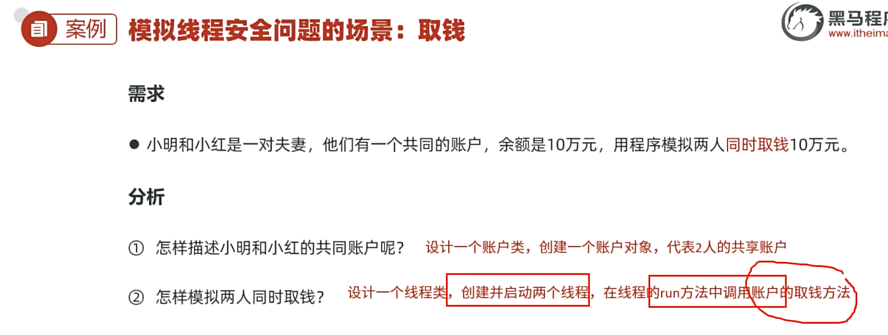

# Day04　多线程

> 本日主线：**线程创建 → 常用方法 → 线程安全 → 线程同步 → 线程池 → 并发并行**

```
创建线程  ──>  线程常用方法  ──>  线程安全  ──>  线程同步  ──>  线程池  ──>  并发/并行
```

---

## 一、线程基础

### 1.1 什么是线程？

> **线程（Thread）是一个程序内部的一条执行流程。**

```java
public static void main(String[] args) {
    for (int i = 0; i < 10; i++) {
        System.out.println(i);     // 单条执行流程
    }
}
```

| 概念 | 说明 |
| --- | --- |
| **单线程** | 线程 (Thread) 是一个程序内部的一条执行流程。 |
| **多线程** | 多线程是指从软硬件上实现的**多条执行流程**的技术（多条线程由 CPU 负责调度执行）。 |

### 1.2 多线程的应用场景

- 消息通信、即时聊天
- 淘宝、京东等电商系统
- 服务器同时处理多个请求
  - 比如说百度网盘，**你下载的时候，可能也需要上传**，那至少需要两条流程


---

## 二、线程的三种创建方式（重点对比）

### 2.1 方式一：继承 Thread 类

```java
// ① 定义子类继承 Thread，重写 run()
public class MyThread extends Thread {
    @Override
    public void run() {
        for (int i = 0; i < 10; i++) {
            System.out.println("子线程 " + i);
        }
    }
}

// ② 创建对象 ③ 调用 start() 启动
public static void main(String[] args) {
    Thread t = new MyThread();
    t.start();           // ⭐ 必须调用 start()，不是 run()
}
```

| 优点 | 缺点 |
| --- | --- |
| **编码简单** | 线程类已经继承 Thread，**无法继承其他类**，不利于功能的扩展。 |

**创建线程的注意事项:**

1. 启动线程必须是调用`start`方法，不是调用`run`方法。

   - 直接调用`run`方法会当成普通方法执行，此时相当于还是单线程执行。
   - 只有调用`start`方法才是启动一个新的线程执行。

2. **不要把主线程任务放在启动子线程之前。**

   1. 因为放到启动子线程之前你就会发现永远是主线程先跑完，因为主线程执行到这的时候发现还没有其他线程，就直接跑完了，等到子线程启动完后就只有子线程在跑了。

      1. 要这样写，主线程跑到这的时候把t1线程拉起来，然后主线程在跑，t1线程也同时在跑

         ~~~java
           public static void main(String[] args) {
                 // 目标：认识多线程，掌握创建线程的方式一：继承Thread类来实现
                 // 4、创建线程类的对象：代表线程。
                 Thread t1 = new MyThread();
                 // 5、调用start方法，启动线程。还是调用run方法执行的
                 t1.start(); // 启动线程，让线程执行run方法
         
                 for (int i = 0; i < 5; i++) {
                     System.out.println("主线程输出：" + i);
                 }
             }
         ~~~

         

      2. 不能这样写

         ~~~java
           public static void main(String[] args) {
                 // 目标：认识多线程，掌握创建线程的方式一：继承Thread类来实现
                 // 4、创建线程类的对象：代表线程。
                 Thread t1 = new MyThread();
               
              	 for (int i = 0; i < 5; i++) {
                     System.out.println("主线程输出：" + i);
                 }
                 // 5、调用start方法，启动线程。还是调用run方法执行的
                 t1.start(); // 启动线程，让线程执行run方法
             }
         ~~~

**步骤：**

* 1、定义一个子类继承Thread类，成为一个线程类。
* 2、重写Thread类的run方法
* 3、在run方法中编写线程的任务代码（线程要干的活儿）
* 4、创建线程类的对象：**代表线程**。
* 5、调用start方法，启动线程。还是调用run方法执行

~~~java
package com.dyx.threadCreate;

public class ThreadDemo1 {
    // main方法本身是由一条主线程负责推荐执行的。
    public static void main(String[] args) {
        // 目标：认识多线程，掌握创建线程的方式一：继承Thread类来实现
        // 4、创建线程类的对象：代表线程。
        Thread t1 = new MyThread();
        // 5、调用start方法，启动线程。还是调用run方法执行的
        t1.start(); // 启动线程，让线程执行run方法

        for (int i = 0; i < 5; i++) {
            System.out.println("主线程输出：" + i);
        }
    }
}

// 1、定义一个子类继承Thread类，成为一个线程类。
class MyThread extends Thread {
    // 2、重写Thread类的run方法
    @Override
    public void run() {
        // 3、在run方法中编写线程的任务代码（线程要干的活儿）
        for (int i = 0; i < 5; i++) {
            System.out.println("子线程输出：" + i);
        }
    }
}
~~~


### 2.2 方式二：实现 Runnable 接口（推荐 ⭐）

**步骤：**

1. 定义一个线程任务类`MyRunnable`实现`Runnable`接口，重写`run()`方法

2. 创建`MyRunnable`任务对象

3. 把`MyRunnable`任务对象交给`Thread`处理。

|      Thread 类提供的构造器       |              说明              |
| :------------------------------: | :----------------------------: |
| `public Thread(Runnable target)` | 封装 Runnable 对象成为线程对象 |

4. 调用线程对象的`start()`方法启动线程

```java
// ① 定义任务类实现 Runnable
public class MyRunnable implements Runnable {
    @Override
    public void run() {
        for (int i = 0; i < 10; i++) {
            System.out.println("线程任务 " + i);
        }
    }
}

// ② 创建任务对象 ③ 交给 Thread ④ 启动
Runnable target = new MyRunnable();
Thread t = new Thread(target);
t.start();
```

#### 匿名内部类写法（更简洁）

```java
new Thread(new Runnable() {
    @Override
    public void run() {
        System.out.println("子线程执行");
    }
}).start();

// Lambda 简化（推荐）
new Thread(() -> System.out.println("子线程执行")).start();
```

| 优点 | 缺点 |
| --- | --- |
| 任务类只是实现接口，**可以继续继承其他类**，扩展性强 | 多一个 Runnable 对象；**不能直接返回执行结果** |

### 2.3 方式三：实现 Callable 接口 + FutureTask（JDK 5+）

> **方式三的优点**：**线程任务类只是实现接口，可以继续继承类和实现接口，扩展性强；<span style="color:red">可以在线程执行完毕后去获取线程执行的结果。</span>**
>
> **方式三的缺点**：**编码复杂一点**


**注意：**

* Callable严格意义上还不属于线程任务对象，FutureTask才是真正的线程任务对象，FutureTask本质上是一个Runnable**的实现类**


**步骤：**

1. **创建任务对象**

   - 定义一个类实现`Callable`接口，重写`call()`方法，封装业务逻辑与需要返回的数据。

   - 将`Callable`实例封装为`FutureTask`（线程任务对象）。

2. **交给 Thread 对象**
   * 把上一步得到的`FutureTask`任务对象传入`Thread`构造器，创建线程对象。

3. **启动线程**
   * 调用`Thread`对象的`start()`方法启动线程。

4. **获取执行结果**
   * 线程执行完成后，调用`FutureTask`对象的`get()`方法，获取线程任务返回的执行结果。

```java
package thread;

import java.util.concurrent.Callable;
import java.util.concurrent.ExecutionException;
import java.util.concurrent.FutureTask;

public class ThreadDemo3 {
    public static void main(String[] args) {
        // 目标：掌握多线程的创建方式三：实现Callable接口，方式三的优势：可以获取线程执行完毕后的结果的。
        // 3、创建一个Callable接口的实现类对象。
        Callable<String> c1 = new MyCallable(100);
        // 4、把Callable对象封装成一个真正的线程任务对象FutureTask对象。
        /**
         * 未来任务对象的作用？
         *    a、本质是一个Runnable线程任务对象，可以交给Thread线程对象处理。
         *    b、可以获取线程执行完毕后的结果。
         */
        FutureTask<String> f1 = new FutureTask<>(c1); // public FutureTask(Callable<V> callable)
        // 5、把FutureTask对象作为参数传递给Thread线程对象。
        Thread t1 = new Thread(f1);
        // 6、启动线程。
        t1.start();

        Callable<String> c2 = new MyCallable(50);
        FutureTask<String> f2 = new FutureTask<>(c2); // public FutureTask(Callable<V> callable)
        Thread t2 = new Thread(f2);
        t2.start();

        // 获取线程执行完毕后返回的结果
        try {
            // 如果主线程发现第一个线程还没有执行完毕，会让出CPU，等第一个线程执行完毕后，才会往下执行！
            System.out.println(f1.get());
        } catch (Exception e) {
            e.printStackTrace();
        }
        try {
            // 如果主线程发现第二个线程还没有执行完毕，会让出CPU，等第二个线程执行完毕后，才会往下执行！
            System.out.println(f2.get());
        } catch (Exception e) {
            e.printStackTrace();
        }
    }
}

// 1、定义一个实现类实现Callable接口
class MyCallable implements Callable<String> {
    private int n;
    public MyCallable(int n) {
        this.n = n;
    }
    // 2、实现call方法，定义线程执行体
    public String call() throws Exception {
        int sum = 0;
        for (int i = 1; i <= n; i++) {
            sum += i;
        }
        return "子线程计算1-" + n + "的和是："  + sum;
    }
}
```

#### FutureTask 关键 API

| FutureTask提供的构造器               | 说明                                 |
| ------------------------------------ | ------------------------------------ |
| `public FutureTask<>(Callable call)` | 把Callable对象封装成FutureTask对象。 |

| FutureTask提供的方法              | 说明                             |
| --------------------------------- | -------------------------------- |
| `public V get() throws Exception` | 获取线程执行call方法返回的结果。 |

### 2.4 三种方式对比（必背 ⭐）

| 方式 | 优点 | 缺点 |
| --- | --- | --- |
| **继承 Thread类** | 编程简单，可直接使用 Thread 类方法 | **扩展性差**（单继承），**不能返回结果** |
| **实现 Runnable接口** | **扩展性强**，可继续继承其他类 | 编程相对复杂，**不能返回结果** |
| **实现 Callable接口** | **扩展性强**，**可以返回执行结果** ⭐ | 编程相对复杂 |

### 2.5 线程创建的注意事项 ⚠️

1. **启动线程必须调用 `start()`，不能调用 `run()`！**
   - 直接调 `run()` → 当成普通方法执行，**还是单线程**
   - 调用 `start()` → 真正启动一个**新线程**

2. **不要把主线程任务放在启动子线程之前！**
   - 否则主线程一直先跑完，**相当于单线程效果**

---

## 三、Thread 的常用方法

### 3.1 常用方法

| Thread提供的常用方法                   | 说明                                          |
| -------------------------------------- | --------------------------------------------- |
| `public void run()`                    | 线程的任务方法                                |
| `public void start()`                  | **启动线程**                                  |
| `public String getName()`              | 获取当前线程的名称，线程名称默认是Thread-索引 |
| `public void setName(String name)`     | 为线程设置名称                                |
| `public static Thread currentThread()` | **获取当前执行的线程对象**                    |
| `public static void sleep(long time)`  | 让当前执行的线程休眠多少毫秒后，再继续执行    |
| `public final void join()...`          | **让调用当前这个方法的线程先执行完！**        |

### 3.2 常用构造器

| Thread提供的常见构造器                        | 说明                                         |
| --------------------------------------------- | -------------------------------------------- |
| `public Thread(String name)`                  | 可以为当前线程指定名称                       |
| `public Thread(Runnable target)`              | 封装Runnable对象成为线程对象                 |
| `public Thread(Runnable target, String name)` | 封装Runnable对象成为线程对象，并指定线程名称 |

> 💡 其他方法（yield、interrupt、守护线程、线程优先级等）**开发中很少使用**。


```java
package com.dyx.demo2threadapi;

public class ThreadApiDemo1 {
    public static void main(String[] args) {
        // 目标：搞清楚线程的常用方法。
        Thread t1 = new MyThread("1号线程");
//         t1.setName("1号线程");
        t1.start();
        System.out.println(t1.getName()); // 线程默认名称是：Thread-索引

        Thread t2 = new MyThread("2号线程");
//         t2.setName("2号线程");
        t2.start();
        System.out.println(t2.getName()); // 线程默认名称是：Thread-索引

        // 哪个线程调用这个代码，这个代码就拿到哪个线程
        Thread m = Thread.currentThread(); // 主线程
        m.setName("主线程");
        System.out.println(m.getName()); // main
    }
}

// 1、定义一个子类继承Thread类，成为一个线程类。
class MyThread extends Thread {
    //也可以在构造器里设置线程名称
    public MyThread(String name) {
        super(name); // public Thread(String name)
    }

    // 2、重写Thread类的run方法
    @Override
    public void run() {
        // 3、在run方法中编写线程的任务代码（线程要干的活儿）
        for (int i = 0; i < 5; i++) {
            System.out.println(Thread.currentThread().getName() +"子线程输出：" + i);
        }
    }
}
```

```java
package com.dyx.demo2threadapi;

public class ThreadApiDemo2 {
    public static void main(String[] args) {
        // 目标：搞清楚Thread类的Sleep方法（线程休眠）
        for (int i = 1; i <= 10; i++) {
            System.out.println(i);
            try {
                // 让当前执行的线程进入休眠状态，直到时间到了，才会继续执行。
                // 项目经理让我加上这行代码，如果用户交钱了，我就注释掉。
                Thread.sleep(1000); // 1000ms = 1s
            } catch (Exception e) {
                e.printStackTrace();
            }
        }
    }
}
```

```java
package com.dyx.demo2threadapi;

public class ThreadApiDemo3 {
    public static void main(String[] args) {
        // 目标：搞清楚线程的join方法：线程插队：让调用这个方法线程先执行完毕。
        MyThread2 t1 = new MyThread2();
        t1.start();

        for (int i = 1; i <= 5; i++) {
            System.out.println(Thread.currentThread().getName() +"线程输出：" + i);
            if(i == 1){
                try {
                    t1.join(); // 插队 让t1线程先执行完毕，然后继续执行主线程
                } catch (Exception e) {
                    e.printStackTrace();
                }
            }
        }
    }
}

class MyThread2 extends Thread {
    @Override
    public void run() {
        for (int i = 1; i <= 5; i++) {
            System.out.println(Thread.currentThread().getName() +"子线程输出：" + i);
        }
    }
}
```

---

## 四、线程安全问题（重难点）

### 4.1 什么是线程安全问题？

> **<span style="color:red">多个线程,同时操作同一个共享资源</span>的时候,可能会出现业务安全问题。**

### 4.2 经典场景：取钱问题


> ❌ **结果**：小明和小红都取出 10 万元，**银行亏 10 万元**（线程安全问题出现）

### 4.3 线程安全问题出现的三大原因

1. **存在多个线程在同时执行**
2. **同时访问一个共享资源**
3. **存在修改该共享资源**

> ⚠️ 三者**缺一不可**！只要有一个不满足，就不存在线程安全问题。


### 4.4 线程安全问题代码复现



**注意：**

* 这里的小明、小红处理的是同一个账户对象，都是acc

```java
package com.dyx.demo2threadapi.demo3threadsafe;

import lombok.AllArgsConstructor;
import lombok.Data;
import lombok.NoArgsConstructor;

@Data
@AllArgsConstructor
@NoArgsConstructor
public class Account {
    private String cardId; // 卡号
    private double money; // 余额

    // 小明和小红都到这里来了取钱
    public void drawMoney(double money) {
        // 拿到当前谁来取钱。
        String name = Thread.currentThread().getName();
        // 判断余额是否足够
        if (this.money >= money) {
            // 余额足够，取钱
            System.out.println(name + "取钱成功，吐出了" + money + "元成功！");
            // 更新余额
            this.money -= money;
            System.out.println(name + "取钱成功，取钱后，余额剩余" + this.money + "元");

        } else {
            // 余额不足
            System.out.println(name + "取钱失败，余额不足");
        }
    }
}
```

```java
package com.dyx.demo2threadapi.demo3threadsafe;
// 取钱线程类
public class DrawThread extends Thread{
    private Account acc; // 记住线程对象要处理的账户对象。

    public DrawThread(String name, Account acc) {
        super(name);
        this.acc = acc;
    }

    @Override
    public void run() {
        // 小明 小红 取钱
        acc.drawMoney(100000);
    }
}
```

```java
package com.dyx.demo2threadapi.demo3threadsafe;

public class ThreadDemo1 {
    public static void main(String[] args) {
        // 目标：模拟线程安全问题。
        // 1、设计一个账户类：用于创建小明和小红的共同账户对象，存入10万。
        Account acc = new Account("ICBC-110", 100000);

        // 2、设计线程类：创建小明和小红两个线程，模拟小明和小红同时去同一个账户取款10万。
        new DrawThread("小明", acc).start();
        new DrawThread("小红", acc).start();
    }
}

//注意：这里的小明、小红处理的是同一个账户对象，都是acc
```

---

## 五、线程同步（解决方案）

### 5.1 线程同步的核心思想

> **让多个线程先后依次访问共享资源**，避免同时访问导致的问题。

### 5.2 加锁机制

**加锁**：每次只允许一个线程加锁，加锁后才能进入访问，访问完毕后自动解锁，然后其他线程才能再加锁进来。

### 5.3 三种同步方式

| 方式 | 关键字 | 锁范围 |
| --- | --- | --- |
| **同步代码块** | `synchronized(锁对象){...}` | 灵活，锁的范围小 |
| **同步方法** | 方法用 `synchronized` 修饰 | 锁整个方法 |
| **Lock 锁** ⭐ | `Lock` 接口 / `ReentrantLock` | 最灵活，**手动加锁/解锁** |

---

## 六、方式一：同步代码块

<span style="color:red">**作用**</span>：把访问共享资源的核心代码给上锁，以此保证线程安全。

~~~java
synchronized (同步锁) {
    // 访问共享资源的核心代码
}
~~~

<span style="color:red">**原理**</span>：每次只允许一个线程加锁后进入，执行完毕后自动解锁，其他线程才可以进来执行。


**同步锁的注意事项**

- 对于当前同时执行的线程来说，同步锁必须是同一把（<span style="color:red">同一个对象</span>），否则会出bug。


**<span style="color:red">示例:</span>**

~~~java
synchronized ("dlei") {
//synchronized (new Object()) 
    // 访问共享资源的核心代码
}
~~~

**<span style="color:red">解析:</span>**

* 对于线程来说是唯一对象，在JAVA里这是一个锁对象，是一个对象，直接写成"dlei"也可以，因为双引号的dlei对象在内存只是一份，只会在常量池中加载一份，这样就可以锁住小明、小红， 如果这里写成new Object()的话是不行的，因为小明过来就会new一个对象，小红过来也new一个对象，相当于每人一把锁，就锁不住两个人了，就不是唯一的。

* 小红和小明都过来的时候，可能小明稍微快了一点，所以小明先占了锁，小明占了dlei这个锁之后，小红发现dlei这个锁上门就有标记，在计算机底层里对象是有对象头这些信息的，有标记，标记就是告诉人家我这个对象已经被人占用了。所以小明进来后小红就在外面等，小明走后就会把锁释放，小红再进来，发现余额不足。


### 6.1 同步锁对象的选择规范（重点 ⭐）

**锁对象的使用规范**

- <span style="color:red">建议使用共享资源作为锁对象</span>,对于实例方法建议使用 **this** 作为锁对象。

- 对于静态方法建议使用<span style="color:red">字节码(类名.class)</span>对象作为锁对象。
  - 因为**静态方法是直接拿类名来调用**，而且静态方法只有一份，对所有线程共享的，现在要锁住所有的线程，对于这个静态方法来说，这个类名.class文件就是唯一的。** 因为类名.class文件只有一份**


| 场景 | 推荐锁对象 |
| --- | --- |
| **实例方法** | `this` |
| **静态方法** | `类名.class`（字节码对象） |

> ⚠️ **核心要求**：**对于同时执行的线程来说，同步锁必须是同一把（同一个对象），否则会出 bug。**

```java
public void drawMoney(double money) {
    synchronized (this) {        // ← 实例方法用 this
        // 取钱逻辑
    }
}

public static void method() {
    synchronized (MyClass.class) {  // ← 静态方法用类名.class
        // 操作逻辑
    }
}
```


~~~java
@Data
@AllArgsConstructor
@NoArgsConstructor
public class Account {
    private String cardId; // 卡号
    private double money; // 余额

    // 小明和小红都到这里来了取钱
    public void drawMoney(double money) {
        // 拿到当前谁来取钱。
        String name = Thread.currentThread().getName();
        // 判断余额是否足够
        synchronized (this) {
            if (this.money >= money) {
                // 余额足够，取钱
                System.out.println(name + "取钱成功，吐出了" + money + "元成功！");
                // 更新余额
                this.money -= money;
                System.out.println(name + "取钱成功，取钱后，余额剩余" + this.money + "元");

            } else {
                // 余额不足
                System.out.println(name + "取钱失败，余额不足");
            }
        }
    }
}
  
~~~

```java
// 取钱线程类
public class DrawThread extends Thread{
    private Account acc; // 记住线程对象要处理的账户对象。

    public DrawThread(String name, Account acc) {
        super(name);
        this.acc = acc;
    }

    @Override
    public void run() {
        // 小明 小红 取钱
        acc.drawMoney(100000);
    }
}
```

```java
public class ThreadDemo1 {
    public static void main(String[] args) {
        // 目标：线程同步的方式一演示：同步代码块
        // 1、设计一个账户类：用于创建小明和小红的共同账户对象，存入10万。
        Account acc = new Account("ICBC-110", 100000);

        // 2、设计线程类：创建小明和小红两个线程，模拟小明和小红同时去同一个账户取款10万。
        new DrawThread("小明", acc).start();
        new DrawThread("小红", acc).start();


    }
}
```

---

## 七、方式二：同步方法

**<span style="color:red">作用</span>:**把访问共享资源的核心方法上锁,从而保证线程安全。

```java
修饰符 synchronized 返回值类型 方法名(形参列表) {
    // 操作共享资源的代码
}
```

**<span style="color:red">原理</span>:**每次只能一个线程进入,执行完毕以后自动解锁,其他线程才可以进来执行。


**同步方法底层原理**

- 同步方法其实底层也是有隐式锁对象的,只是锁的范围是整个方法代码。

- 如果方法是实例方法:同步方法默认用 <span style="color:red">this</span> 作为锁对象。

- 如果方法是静态方法:同步方法默认用 <span style="color:red">类名.class</span> 作为锁对象。


**底层原理**（隐式锁）：

| 方法类型 | 默认锁对象 |
| --- | --- |
| **实例方法** | `this` |
| **静态方法** | `类名.class` |

```java
@Data
@AllArgsConstructor
@NoArgsConstructor
public class Account {
    private String cardId; // 卡号
    private double money; // 余额

    // 小明和小红都到这里来了取钱
    public void drawMoney(double money) {
        // 拿到当前谁来取钱。
        String name = Thread.currentThread().getName();
        // 判断余额是否足够
        synchronized (this) {
            if (this.money >= money) {
                // 余额足够，取钱
                System.out.println(name + "取钱成功，吐出了" + money + "元成功！");
                // 更新余额
                this.money -= money;
                System.out.println(name + "取钱成功，取钱后，余额剩余" + this.money + "元");

            } else {
                // 余额不足
                System.out.println(name + "取钱失败，余额不足");
            }
        }
    }
}
```

```java
// 取钱线程类
public class DrawThread extends Thread{
    private Account acc; // 记住线程对象要处理的账户对象。

    public DrawThread(String name, Account acc) {
        super(name);
        this.acc = acc;
    }

    @Override
    public void run() {
        // 小明 小红 取钱
        acc.drawMoney(100000);
    }
}
```

```java
public class ThreadDemo1 {
    public static void main(String[] args) {
        // 目标：线程同步方式二：同步方法
        // 1、设计一个账户类：用于创建小明和小红的共同账户对象，存入10万。
        Account acc = new Account("ICBC-110", 100000);

        // 2、设计线程类：创建小明和小红两个线程，模拟小明和小红同时去同一个账户取款10万。
        new DrawThread("小明", acc).start();
        new DrawThread("小红", acc).start();
    }
}
```

### 7.1 同步代码块 vs 同步方法

| 对比项 | 同步代码块 | 同步方法 |
| --- | --- | --- |
| **范围** | 锁范围**更小**（更细粒度） | 锁整个方法 |
| **可读性** | — | 更好 |

同步方法是如何保证线程安全的?

- **对出现问题的核心方法使用 synchronized 修饰**
- **每次只能一个线程占锁进入访问**

同步方法的同步锁对象的原理?

- **对于实例方法默认使用 this 作为锁对象。**
- **对于静态方法默认使用 类名.class 对象作为锁对象。**

---

## 八、方式三：Lock 锁（JDK 5+，推荐 ⭐）

> Lock 是接口，**通过其实现类 `ReentrantLock` 构建锁对象**，更灵活、更方便、更强大。

### 8.1 基本用法

- <span style="color:red">Lock锁是JDK5开始提供的一个新的锁定操作</span>,通过它可以创建出锁对象进行加锁和解锁,更灵活、更方便、更强大。

- <span style="color:red">Lock是接口,不能直接实例化</span>,可以采用它的实现类 ReentrantLock 来构建 Lock 锁对象。

| 构造器                   | 说明                   |
| ------------------------ | ---------------------- |
| `public ReentrantLock()` | 获得Lock锁的实现类对象 |

**Lock的常用方法**

| 方法名称        | 说明   |
| --------------- | ------ |
| `void lock()`   | 获得锁 |
| `void unlock()` | 释放锁 |

```java
public class Account {
    private final Lock lock = new ReentrantLock();  // ⚠️ 建议加 final，保护锁对象

    public void drawMoney(double money) {
        lock.lock();              // ① 加锁
        try {
            // 操作共享资源
        } finally {
            lock.unlock();        // ⭐ 释放锁放 finally！
        }
    }
}
```


**示例**

```java
@Data
@AllArgsConstructor
@NoArgsConstructor
public class Account {
    private String cardId; // 卡号
    private double money; // 余额
    private final Lock lk = new ReentrantLock(); // 保护锁对象

    // 小明和小红都到这里来了取钱
    public void drawMoney(double money) {
        // 拿到当前谁来取钱。
        String name = Thread.currentThread().getName();
        lk.lock(); // 上锁
        try {
            // 判断余额是否足够
            if (this.money >= money) {
                // 余额足够，取钱
                System.out.println(name + "取钱成功，吐出了" + money + "元成功！");
                // 更新余额
                this.money -= money;
                System.out.println(name + "取钱成功，取钱后，余额剩余" + this.money + "元");
            } else {
                // 余额不足
                System.out.println(name + "取钱失败，余额不足");
            }
        } finally {
            lk.unlock();// 解锁
        }
    }
}
```

```java
// 取钱线程类
public class DrawThread extends Thread{
    private Account acc; // 记住线程对象要处理的账户对象。

    public DrawThread(String name, Account acc) {
        super(name);
        this.acc = acc;
    }

    @Override
    public void run() {
        // 小明 小红 取钱
        acc.drawMoney(100000);
    }
}
```

```java
public class ThreadDemo1 {
    public static void main(String[] args) {
        // 目标：模拟线程安全问题。
        // 1、设计一个账户类：用于创建小明和小红的共同账户对象，存入10万。
        Account acc = new Account("ICBC-110", 100000);

        // 2、设计线程类：创建小明和小红两个线程，模拟小明和小红同时去同一个账户取款10万。
        new DrawThread("小明", acc).start();
        new DrawThread("小红", acc).start();
    }
}
```

### 8.2 注意事项 ⚠️

1. **锁对象建议加 `final` 修饰**，防止被篡改；
2. **释放锁的操作建议放到 `finally` 代码块中**，确保锁用完了一定会被释放。


---

## 九、线程池（重点）

### 9.1 什么是线程池？

> **线程池就是一个可以<span style="color:red">复用线程的技术</span>。**

### 9.2 不使用线程池的问题

>  用户每发起一个请求,后台就需要创建一个新线程来处理,下次新任务来了肯定又要创建新线程处理的,<span style="color:red">创建新线程的开销是很大的,并且请求过多时,肯定会产生大量的线程出来</span>,这样会严重影响系统的性能。

### 9.3 线程池的工作原理

线程池创建出来后一旦有任务的话，每次有新的任务（例如Runnable、Callable）的话都会扔到一个任务队列里去，交给固定的线程来处理，比如说这个线程处理这个任务，再来个任务就又交给一个任务处理，再来个任务就又交给一个任务处理，以此类推，如果后面没有线程可以处理了的话，它们就会在任务队列里进行排队，等待着这些线程来进行处理，这就是它的原理。比如说第一个线程处理完第一个任务后，就可以去处理后面的任务了。这样就可以控制线程的数量，不至于有过多的线程。提高了系统整体性能，既有线程又不会耗尽资源，这些线程就称之为工作线程，队列就称之为任务队列。任务队列里只能放Runnable任务或者Callable任务。因为任务就Runnable和Callable两种 

```
                 任务接口
              ┌──────────────┐
              │  Runnable    │
              │  Callable    │
              └──────┬───────┘
                     ↓
              ┌────────────────┐
              │  任务队列       │
              │  (WorkQueue)   │
              └──────┬─────────┘
                     ↓
              ┌────────────────┐
              │  工作线程       │
              │ (WorkThread)   │
              └────────────────┘
                  线程池
```

---

## 十、创建线程池

> JDK 5.0 起提供了代表线程池的接口：**`ExecutorService`**

| 方式 | 实现类 |
| --- | --- |
| **方式一**（推荐 ⭐） | `ThreadPoolExecutor`（自己创建） |
| **方式二** | `Executors`（工具类，返回不同特点的线程池） |

### 10.1 方式一：ThreadPoolExecutor（重点）

#### 七大参数（必背 ⭐）

```java
public ThreadPoolExecutor(
    int corePoolSize,                       // ① 核心线程数
    int maximumPoolSize,                    // ② 最大线程数
    long keepAliveTime,                     // ③ 临时线程存活时间
    TimeUnit unit,                          // ④ 时间单位
    BlockingQueue<Runnable> workQueue,      // ⑤ 任务队列
    ThreadFactory threadFactory,            // ⑥ 线程工厂
    RejectedExecutionHandler handler        // ⑦ 任务拒绝策略
);
```

**比喻记忆**：

| 参数 | 含义 | 比喻 |
| --- | --- | --- |
| `corePoolSize` | 核心线程数 | **正式工：3 人** |
| `maximumPoolSize` | 最大线程数 | **最大员工数：5 人**（含正式工 + 临时工 2） |
| `keepAliveTime` | 临时线程存活时间 | 临时工空闲多久被开除 |
| `unit` | 时间单位 | 秒、分、时、天 |
| `workQueue` | 任务队列 | 客人**排队**的地方 |
| `threadFactory` | 线程工厂 | 负责**招聘员工**的 HR |
| `handler` | 拒绝策略 | 忙不过来怎么办？|

### 10.2 ExecutorService 常用方法

| 方法 | 说明 |
| --- | --- |
| `void execute(Runnable command)` | 执行 **Runnable** 任务 |
| `Future<T> submit(Callable<T> task)` | 执行 **Callable** 任务，返回 Future 对象 |
| `void shutdown()` | **等全部任务执行完毕后**再关闭线程池 |
| `List<Runnable> shutdownNow()` | **立刻关闭**，并返回未执行的任务 |

### 10.3 线程池的运行流程（重点 ⭐）

```
新任务来 → 核心线程能处理吗？
              ├── 能 → 核心线程处理
              └── 不能 → 任务队列满了吗？
                          ├── 没满 → 放入任务队列
                          └── 满了 → 能创建临时线程吗？
                                      ├── 能 → 创建临时线程处理
                                      └── 不能 → 执行拒绝策略
```

> **什么时候创建临时线程？**
> - 新任务提交时，发现**核心线程都在忙**，**任务队列也满了**，并且**还可以创建临时线程**。

> **什么时候拒绝新任务？**
> - **核心线程和临时线程都在忙**，**任务队列也满了**，新任务来了才会拒绝。

### 10.4 四大任务拒绝策略

| 策略 | 说明 |
| --- | --- |
| **AbortPolicy** ⭐（默认） | 丢弃任务并抛出 `RejectedExecutionException` |
| **DiscardPolicy** | 丢弃任务但**不抛异常**（不推荐） |
| **DiscardOldestPolicy** | 抛弃**队列中等待最久**的任务，把当前任务加入队列 |
| **CallerRunsPolicy** | 由**主线程**调用 `run()` 方法，绕过线程池直接执行 |

---

## 十一、方式二：Executors 工具类

> 是一个线程池的工具类，提供了**静态方法**用于返回不同特点的线程池。

| 方法 | 说明 |
| --- | --- |
| `newFixedThreadPool(int n)` | 创建**固定线程数**的线程池 |
| `newSingleThreadExecutor()` | 创建**只有一个线程**的线程池 |
| `newCachedThreadPool()` | 线程数随任务增加而增加，空闲 60s 回收 |
| `newScheduledThreadPool(int n)` | **定时任务**线程池 |

> 💡 **底层原理**：这些方法**底层都是通过 `ThreadPoolExecutor` 实现的**。

### 11.1 Executors 的陷阱 ⚠️（阿里规范禁用）

> **大型并发系统中使用 Executors 可能出现资源耗尽风险**：
> - `newFixedThreadPool` 和 `newSingleThreadExecutor`：任务队列长度 `Integer.MAX_VALUE` → **可能 OOM**
> - `newCachedThreadPool`：线程数 `Integer.MAX_VALUE` → **可能创建大量线程导致 OOM**

> ✅ **建议**：**使用 `ThreadPoolExecutor` 来指定线程池参数**，明确运行规则，规避资源耗尽风险。

---

## 十二、并发与并行

### 12.1 进程与线程的关系

> **进程**：正在运行的程序（软件）就是一个独立的进程。
> **线程**：线程属于进程，一个进程中可以同时运行很多个线程。

### 12.2 并发（Concurrent）

> **并发**：CPU **分时轮询**地执行线程。

```
CPU（单核）        →  时间片轮转，由于 CPU 切换速度很快，
                      给我们的感觉是「这些线程在同时执行」
```

### 12.3 并行（Parallel）

> **并行**：在**同一个时刻**，**同时有多个线程**在被 CPU 调度执行。

```
CPU（4 核）
 ┌─────────┬─────────┬─────────┬─────────┐
 │  核1   │  核2    │  核3    │  核4   │   ← 同时执行 4 个线程
 │ 线程A  │ 线程B  │ 线程C   │ 线程D  │
 └─────────┴─────────┴─────────┴─────────┘
```

### 12.4 区别对比

| 概念 | 是否同时 | 单核能否实现 |
| --- | --- | --- |
| **并发** | **不是真正同时**（切换很快） | ✅ 可以 |
| **并行** | **真正同时**（同一时刻多线程） | ❌ 必须多核 |

> ⭐ **多线程实际运行**：**并发和并行同时进行的**。

---

## 十三、本日重点小结

| 知识点 | 关键记忆 |
| --- | --- |
| **三种创建方式** | 继承 Thread / 实现 Runnable / 实现 Callable（**有返回值**） |
| **启动线程** | 必须 `start()`，不能 `run()` |
| **线程安全三要素** | 多线程 + 共享资源 + 修改资源 |
| **同步方式** | 同步代码块、同步方法、Lock 锁 |
| **锁对象规范** | 实例方法用 `this`，静态方法用 `类名.class` |
| **线程池七参数** | 核心、最大、存活、单位、队列、工厂、拒绝策略 |
| **Executors 陷阱** | 阿里规范禁用，推荐 `ThreadPoolExecutor` 自定义 |
| **并发 vs 并行** | 并发（轮转）、并行（同时） |
