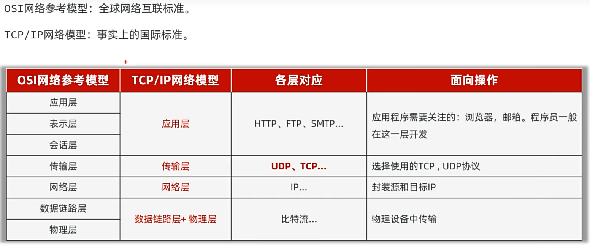
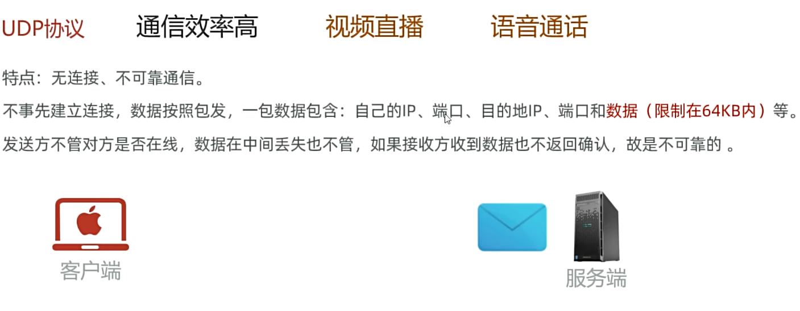
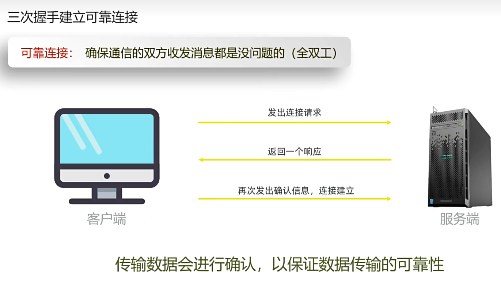
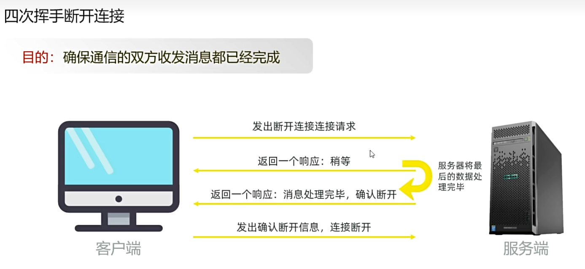
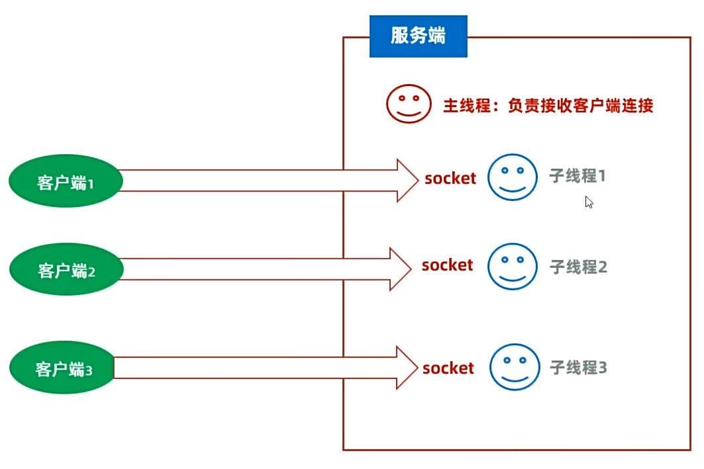
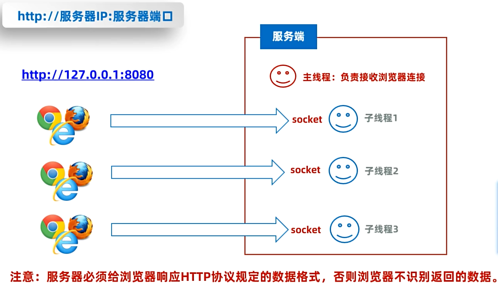
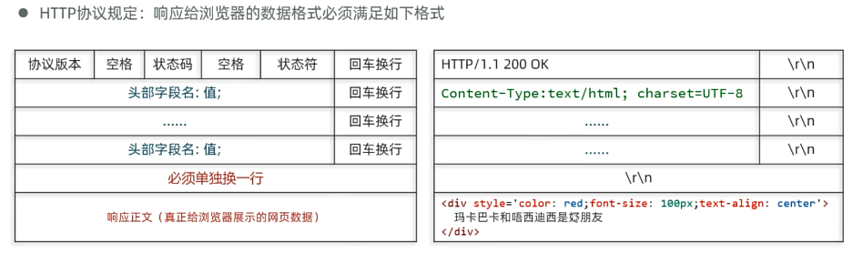
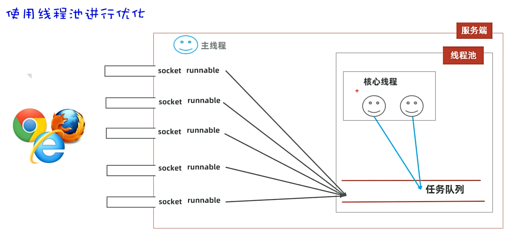

# Day05　网络编程 · 即时通信项目

> 本日主线：**网络通信三要素 → UDP 通信 → TCP 通信 → BS 架构原理 → 综合项目**

```
三要素（IP/端口/协议）  ──>  UDP  ──>  TCP  ──>  BS 架构  ──>  即时通信项目
```

---

## 一、网络编程概述

### 1.1 什么是网络编程？

> **网络编程**：可以让设备中的程序与网络上其他设备中的程序进行数据交互的技术（实现**网络通信**）。

### 1.2 基本通信架构（两种）

| 架构 | 全称 | 客户端 | 特点 |
| --- | --- | --- | --- |
| **CS 架构** | Client-Server | 需要程序员开发、用户下载安装客户端软件 | 体验好、需多端开发 |
| **BS 架构** ⭐ | Browser-Server | 直接用浏览器，**无需开发客户端** | 跨平台、易部署 |

> 💡 **无论是 CS 架构还是 BS 架构，都必须依赖网络编程！**

### 1.3 Java 网络编程支持

> **`java.net.*` 包下提供了网络编程的解决方案。**

---

## 二、网络通信三要素（重点）

> **三要素**：**IP 地址、端口号、协议**

```
  我（IP1）  ─── 传输协议（TCP/UDP）─→  对方（IP2:端口8888）
                  发送数据 "爱你哟"
```

---

## 三、IP 地址

### 3.1 IP 概述

> **IP**（Internet Protocol）：互联网协议地址，是分配给上网设备的**唯一标识**。

| 形式 | 位数 | 表示 |
| --- | --- | --- |
| **IPv4** ⭐ | 32 位（4 字节） | **点分十进制**：`192.168.1.66` |
| **IPv6** | 128 位（16 字节） | **冒分十六进制**：`2001:0db8:0000:0023:0008:0800:200c:417a` |

> 💡 IPv6 号称可以为地球上的**每一粒沙子编号**。

### 3.2 IP 域名与 DNS

| 名词 | 说明 |
| --- | --- |
| **域名（Domain Name）** | 互联网上识别和定位网站的**人类可读名称**（如 `www.baidu.com`） |
| **DNS** ⭐ | Domain Name System，**把域名解析为 IP 地址**的分布式命名系统（互联网的「电话簿」） |

```
www.itheima.com  →  DNS 解析  →  30.88.151.91  →  网站内容
```

### 3.3 公网 IP / 内网 IP / 本机 IP

| 类型 | 说明 |
| --- | --- |
| **公网 IP** | 可以连接到互联网的 IP 地址 |
| **内网 IP**（局域网 IP） | 只能组织内部使用，常见 `192.168.0.0 ~ 192.168.255.255` |
| **本机 IP** ⭐ | **`127.0.0.1`** / **`localhost`**，只会寻找当前程序所在的主机 |

### 3.4 IP 常用命令

| 命令 | 说明 |
| --- | --- |
| `ipconfig` | 查看本机 IP 地址 |
| `ping IP地址` | 检查网络是否连通 |

**注意：**

* ipconfig /all 可以看物理地址

### 3.5 InetAddress 类

> **代表 IP 地址的 Java 类**

| InetAddress 类的常用方法                                     | 说明                                           |
| --- | --- |
| `public static InetAddress getLocalHost() throws UnknownHostException` | 获取本机IP，返回一个 InetAddress 对象          |
| `public String getHostName()`                                | 获取该ip地址对象对应的主机名                   |
| `public String getHostAddress()`                             | 获取该ip地址对象中的ip地址信息                 |
| `public static InetAddress getByName(String host) throws UnknownHostException` | 根据ip地址或者域名，返回一个 InetAddress 对象  |
| `public boolean isReachable(int timeout) throws IOException` | 判断主机在指定毫秒内与该ip对应的主机是否能连通 |

```java
InetAddress ip = InetAddress.getLocalHost();
System.out.println(ip.getHostName());        // 主机名
System.out.println(ip.getHostAddress());     // IP 地址
```

~~~java
public class InetAddressDemo1 {
    public static void main(String[] args) {
        // 目标：认识InetAddress获取本机IP对象和对方IP对象。
        try {
            // 1.获取本机IP对象
            InetAddress ip1 = InetAddress.getLocalHost();
            System.out.println(ip1.getHostName());
            System.out.println(ip1.getHostAddress());

            // 2、获取对方IP对象
            InetAddress ip2 = InetAddress.getByName("www.baidu.com");
            System.out.println(ip2.getHostName());
            System.out.println(ip2.getHostAddress());

            // 3、判断本机与对方主机是否互通
            System.out.println(ip2.isReachable(5000)); // false ping
        }catch (Exception e){
            e.printStackTrace();
        }
    }
}
~~~


---

## 四、端口号

### 4.1 什么是端口号？

> 端口号用来**标记**正在计算机设备上**运行的应用程序**，是一个 **16 位的二进制**，范围 **0 ~ 65535**。

### 4.2 端口分类c

| 分类 | 范围 | 说明 |
| --- | --- | --- |
| **周知端口** | 0 ~ 1023 | 预先定义的知名应用占用（**HTTP=80，FTP=21**） |
| **注册端口** ⭐ | 1024 ~ 49151 | 分配给用户进程或某些应用程序（**我们开发用这里**） |
| **动态端口** | 49152 ~ 65535 | 不固定分配，动态分配 |

### 4.3 ⚠️ 注意事项

- 自己开发的程序一般选择**注册端口**；
- **一个设备中不能出现两个程序的端口号一样**，否则报**端口冲突错误**！

---

## 五、通信协议

### 5.1 什么是通信协议？

> **网络上通信的设备，事先规定的连接规则以及传输数据的规则**，被称为**网络通信协议**。

###  5.2 两大网络模型对比

| 模型 | 类型 | 分层 |
| --- | --- | --- |
| **OSI 网络参考模型** | 全球网络互联**标准** | 7 层 |
| **TCP/IP 网络模型** ⭐ | **事实上的国际标准** | 4 层 |

#### OSI 七层模型 vs TCP/IP 四层模型



### 5.3 传输层的两个协议（核心 ⭐）

| 协议 | 全称 | 特点 |
| --- | --- | --- |
| **UDP** | User Datagram Protocol | 无连接、不可靠、速度快 |
| **TCP** | Transmission Control Protocol | 面向连接、可靠传输 |

> **UDP协议有什么特点？**
>
> *  用户数据报协议(User Datagram Protocol) 
> *  UDP是面向无连接，不可靠传输的通信协议。 
> *  速度快，有大小限制一次最多发送64K，数据不安全，易丢失数据。

> **TCP协议有哪些特点？ **
>
> *  TCP是一种面向连接的可靠通信协议 
> * 传输前，采用“三次握手”方式建立连接，点对点的通信。 - 在连接中可进行大数据量的传输。 
> * 传输后，采用“四次挥手”方式断开连接，确保消息全部收发完毕。 
> * 通信效率相对较低，可靠性相对较高。

> **TCP协议：**
>
> * 特点：面向连接、可靠通信。 
> * TCP的最终目的：要保证在不可靠的信道上实现可靠的数据传输。
> *  TCP主要有三个步骤实现可靠传输：**三次握手建立连接**，传输数据进行确认，**四次挥手断开连接**。

> UDP适合做视频直播、语音通话等
>
> TCP适合做网页、文件下载、支付等可靠性高的，不能丢数据。**每次发消息都需要等对方确认数据是否收到，没收到就再传，通信效率相对不高**



**为什么需要三次握手才是全双工呢？**

* 因为当客户端发消息的时候，服务端收到了，服务端就知道客户端发消息没问题
* 当客户端收到服务端回的消息，客户端就知道服务端收消息和发消息都没问题
* 但服务端无法确定客户端收消息没问题，所以还需要第三次握手，客户端要给服务端回个消息，服务端就知道客户端收消息没问题。



**为什么需要四次挥手才能断开连接？**

* 如果客户端给服务端发过去一条消息就断开的话，风险很大，比如说前面客户端给服务端发的消息还没收完，会导致丢数据。
* 所以客户端第一次给服务端发消息后，服务端会回消息，意思就是告诉客户端你的消息我收到了，确保客户端知道消息已送达。
* 然后消息收完后服务端会告诉客户端，这次真的可以断开了，但这次断开的时候可以还附带一些消息给客户端，所以需要等客户端确认。
* 客户端也确认服务端发的消息收完了，可以断开了。



---

## 六、UDP 协议

### 6.1 UDP 特点

> **无连接、不可靠通信。**

**UDP通信的实现**

* **特点：** 无连接、不可靠通信。
* 不事先建立连接；发送端每次把要发送的数据（限制在64KB内）、接收端IP、等信息封装成一个数据包，发出去就不管了。
* Java提供了一个`java.net.DatagramSocket`类来实现UDP通信。

| 特性 | 说明 |
| --- | --- |
| 不事先建立连接 | 数据按「包」发送 |
| 一包数据包含 | 自己的 IP、端口、目标 IP、端口、数据（限制 **64KB** 内） |
| 不在乎接收方 | 不管对方是否在线 |
| 不可靠 | 数据中间丢失也不管，接收方不返回确认 |
| 适用场景 | **视频直播、语音通话**（通信效率高） |

### 6.2 UDP 客户端 / 服务端实现

> Java 提供 **`java.net.DatagramSocket`** 类实现 UDP 通信。

#### DatagramSocket（客户端、服务端共用） 

| 构造器                            | 说明                                                     |
| --------------------------------- | -------------------------------------------------------- |
| `public DatagramSocket()`         | 创建**客户端**的 Socket 对象，系统会随机分配一个端口号。 |
| `public DatagramSocket(int port)` | 创建**服务端**的 Socket 对象，并指定端口号               |

| 方法                                    | 说明               |
| --------------------------------------- | ------------------ |
| `public void send(DatagramPacket dp)`   | 发送数据包         |
| `public void receive(DatagramPacket p)` | 使用数据包接收数据 |

#### DatagramPacket（数据包对象）

| 构造器                                                       | 说明                         |
| ------------------------------------------------------------ | ---------------------------- |
| `public DatagramPacket(byte[] buf, int length, InetAddress address, int port)` | 创建**发出去的数据包对象**   |
| `public DatagramPacket(byte[] buf, int length)`              | 创建**用来接收数据的数据包** |

| 方法 | 说明 |
| --- | --- |
| `int getLength()` | 获取实际接收到的字节个数 |

### 6.3 UDP 通信完整流程

#### ✅ 客户端步骤（发送）

```
## 客户端实现步骤

1.  创建`DatagramSocket`对象（客户端对象） → 扔韭菜的人
2.  创建`DatagramPacket`对象封装需要发送的数据（数据包对象） → 韭菜盘子
3.  使用`DatagramSocket`对象的`send`方法，传入`DatagramPacket`对象 → 开始抛出韭菜
4.  释放资源
```

```java
public class UDPClientDemo1 {
    public static void main(String[] args) throws Exception {
        // 目标：完成UDP通信一发一收：客户端开发
        System.out.println("===客户端启动==");
        // 1、创建发送端对象（代表抛韭菜的人）
        DatagramSocket socket = new DatagramSocket(); // 随机端口

        // 2、创建数据包对象封装要发送的数据。(韭菜盘子)
        byte[] bytes = "我是客户端，约你今晚啤酒、龙虾、小烧烤".getBytes();
        /**
         *   public DatagramPacket(byte[] buf, int length,
         *                           InetAddress address, int port)
         * 参数一：发送的数据，字节数组（韭菜）
         * 参数二：发送的字节长度。
         * 参数三：目的地的IP地址。
         * 参数四：服务端程序的端口号
         */
        DatagramPacket packet = new DatagramPacket(bytes, bytes.length, InetAddress.getLocalHost(), 8080);

        // 3、让发送端对象发送数据包的数据
        socket.send(packet);

        socket.close();
    }
}
```

#### ✅ 服务端步骤（接收）

```
## 服务端实现步骤

1.  创建`DatagramSocket`对象并指定端口（服务端对象） → 接韭菜的人
2.  创建`DatagramPacket`对象接收数据（数据包对象） → 韭菜盘子
3.  使用`DatagramSocket`对象的`receive`方法，传入`DatagramPacket`对象 → 开始接收韭菜
4.  释放资源
```

```java
public class UDPClientDemo1 {
    public static void main(String[] args) throws Exception {
        // 目标：完成UDP通信一发一收：客户端开发
        System.out.println("===客户端启动==");
        // 1、创建发送端对象（代表抛韭菜的人）
        DatagramSocket socket = new DatagramSocket(); // 随机端口

        // 2、创建数据包对象封装要发送的数据。(韭菜盘子)
        byte[] bytes = "我是客户端，约你今晚啤酒、龙虾、小烧烤".getBytes();
        /**
         *   public DatagramPacket(byte[] buf, int length,
         *                           InetAddress address, int port)
         * 参数一：发送的数据，字节数组（韭菜）
         * 参数二：发送的字节长度。
         * 参数三：目的地的IP地址。
         * 参数四：服务端程序的端口号
         */
        DatagramPacket packet = new DatagramPacket(bytes, bytes.length, InetAddress.getLocalHost(), 8080);

        // 3、让发送端对象发送数据包的数据
        socket.send(packet);

        socket.close();
    }
}
```

### 6.4 多发多收

> **客户端使用 while 死循环不断接收用户输入并发送**，输入 `exit` 退出。
> **服务端使用 while 死循环不断接收数据**。

> 💡 **UDP 服务端可接收多个客户端的消息**：服务端只负责接收数据包，无所谓是哪个发送端的。

~~~java
// 都听的懂，但是记不住！
public class UDPClientDemo1 {
    public static void main(String[] args) throws Exception {
        // 目标：完成UDP通信多发多收：客户端开发
        System.out.println("===客户端启动==");
        // 1、创建发送端对象（代表抛韭菜的人）
        DatagramSocket socket = new DatagramSocket(); // 随机端口

        Scanner sc = new Scanner(System.in);
        while (true) {
            // 2、创建数据包对象封装要发送的数据。(韭菜盘子)
            System.out.println("请说：");
            String msg = sc.nextLine();

            // 如果用户输入的是 exit，则退出
            if ("exit".equals(msg)) {
                System.out.println("===客户端退出==");
                socket.close();
                break;
            }

            byte[] bytes = msg.getBytes();
            DatagramPacket packet = new DatagramPacket(bytes, bytes.length,
                    InetAddress.getLocalHost(), 8080);

            // 3、让发送端对象发送数据包的数据
            socket.send(packet);
        }

    }
}
~~~

~~~java
public class UDPServerDemo2 {
    public static void main(String[] args) throws Exception {
        // 目标：完成UDP通信多发多收：服务端开发。
        System.out.println("==服务端启动了===");
        // 1、创建接收端对象，注册端口。（接韭菜的人）
        DatagramSocket socket = new DatagramSocket(8080);

        // 2、创建一个数据包对象负责接收数据。（韭菜盘子）
        byte[] buf = new byte[1024 * 64];
        DatagramPacket packet = new DatagramPacket(buf, buf.length);

        while (true) {
            // 3、接收数据，将数据封装到数据包对象的字节数组中去
            socket.receive(packet); // 等待式接收数据。

            // 4、看看数据是否收到了
            int len = packet.getLength();   // 获取当前收到的数据长度。
            String data = new String(buf, 0 , len);
            System.out.println("服务端收到了：" + data);

            // 获取对方的ip对象和程序端口
            String ip = packet.getAddress().getHostAddress();
            int port = packet.getPort();
            System.out.println("对方ip：" + ip + "   对方端口：" + port);

            System.out.println("----------------------------------------------");
        }
    }
}
~~~


---

## 七、TCP 协议

### 7.1 TCP 特点

> **面向连接、可靠通信。**

| 特性 | 说明 |
| --- | --- |
| **最终目的** | **在不可靠的信道上实现可靠的数据传输** |
| **三步骤** | **三次握手建立连接 → 传输数据并确认 → 四次挥手断开连接** |
| **效率** | 通信效率相对较低，**可靠性高** |
| **适用场景** | 网页浏览、文件下载、支付 |

### 7.2 三次握手建立可靠连接（重点 ⭐）

> **可靠连接**：确保通信双方收发消息都是没问题的（**全双工**）。

```
客户端                           服务端
  │  ──── ① 发出连接请求 ────→    │
  │  ←─── ② 返回响应 ─────────    │
  │  ──── ③ 再次发出确认信息 ──→   │
                                  连接建立！
```

形象记忆：
> "你瞅啥？" → "瞅你咋地？" → "走，咱俩唠唠" → 关系确立

### 7.3 四次挥手断开连接

> **目的**：确保通信的双方收发消息都已经完成。

```
客户端                           服务端
  │  ─── ① 发出断开请求 ──→       │
  │  ←── ② 返回响应"稍等" ───     │
                                  （处理完最后的数据）
  │  ←── ③ 返回响应"完毕" ───     │
  │  ─── ④ 发出确认断开 ──→       │
                                  连接断开！
```

形象记忆：
> "我要走啦" → "好的，稍等" → "拿着苹果路上吃" → "爱过，溜啦！"

### 7.4 TCP 通信实现

> Java 提供 **`java.net.Socket`** 类实现 TCP 通信。


#### 客户端 Socket

| 构造器                               | 说明                                                         |
| ------------------------------------ | ------------------------------------------------------------ |
| public Socket(String host, int port) | 根据指定的服务器ip、端口号请求与服务端建立连接，连接通过，就获得了客户端socket |

| 方法                                  | 说明                           |
| ------------------------------------- | ------------------------------ |
| public OutputStream getOutputStream() | 获得字节输出流对象（**发送**） |
| public InputStream getInputStream()   | 获得字节输入流对象（**接收**） |

#### 服务端 ServerSocket

| 构造器                        | 说明                 |
| ----------------------------- | -------------------- |
| public ServerSocket(int port) | 为服务端程序注册端口 |

| 方法                    | 说明                                                         |
| ----------------------- | ------------------------------------------------------------ |
| public Socket accept()⭐ | **阻塞等待客户端的连接请求**，一旦与某个客户端成功连接，则返回服务端这边的Socket对象。 |

### 7.5 TCP 一发一收实现步骤

**⭐⭐⭐⭐⭐注意：**

* **如果包装成打印流，按照行打印，那么服务端必须按照行来收数据；如果这边发送的是字节，那服务端必须按照字节来接收；如果客户端用的缓冲字节输出流，那服务端一定要用缓冲字节输入流。因为通信很严格，一定要对应匹配，不然会出Bug**

  ~~~java
  OutputStream os = socket.getOutputStream();
  ~~~

  

#### 客户端

```
1.  创建`ServerSocket`对象，注册服务端端口。
2.  调用`ServerSocket`对象的`accept()`方法，等待客户端的连接，并得到`Socket`管道对象。
3.  通过`Socket`对象调用`getInputStream()`方法得到字节输入流、完成数据的接收。
4.  释放资源：关闭socket管道
```

```java
public class ClientDemo1 {
    public static void main(String[] args) throws Exception {
        // 目标：实现TCP通信下一发一收：客户端开发。
        System.out.println("客户端启动....");
        // 1、常见Socket管道对象，请求与服务端的Socket链接。可靠链接
        Socket socket = new Socket("127.0.0.1", 9999);

        // 2、从socket通信管道中得到一个字节输出流。
        OutputStream os = socket.getOutputStream();

        // 3、特殊数据流。
        DataOutputStream dos = new DataOutputStream(os);
        dos.writeInt(1);
        dos.writeUTF("我想你了，你在哪儿？");

        // 4、关闭资源。
        socket.close();
    }
}
```

#### 服务端

```
① 创建 ServerSocket 注册端口
② 调用 accept() 等待连接，返回 Socket
③ 调用 getInputStream() 得到输入流，接收数据
④ 关闭 socket
```

**⭐⭐⭐⭐⭐注意：**

* 服务端启启动后会卡在Socket socket = ss.accept();这一步骤，然后等待客户端启动后，客户端的Socket socket = new Socket("127.0.0.1", 9999);和服务端的Socket socket = ss.accept();建立管道连接后，接下来客户端和服务端才都会往下执行。
* **如果是服务端跑的快**，那么服务端执行到int id = dis.readInt();的时候又会开始等，等客户端发个整数过来，收到整数后又在String msg = dis.readUTF();开始等，等客户端发字符串过来。
* **如果是客户端跑的快**，先发个dos.writeInt(1);整数类型过去后 ，消息会先缓存在管道里，然后服务端到时候会在管道里取数据，客户端会等服务端确认收完数据后才执行socket.close();关闭管道。

```java
public class ServerDemo2 {
    public static void main(String[] args) throws Exception {
        // 目标：实现TCP通信下一发一收：服务端开发。
        System.out.println("服务端启动了...");
        // 1、创建服务端ServerSocket对象，绑定端口号，监听客户端连接
        ServerSocket ss = new ServerSocket(9999);
        // 2、调用accept方法，阻塞等待客户端连接，一旦有客户端链接会返回一个Socket对象
        Socket socket = ss.accept();
        // 3、获取输入流，读取客户端发送的数据
        InputStream is = socket.getInputStream();
        // 4、把字节输入流包装成特殊数据输入流，因为这个demo里客户端用的特殊数据输出流
        DataInputStream dis = new DataInputStream(is);
        // 5、读取数据
        int id = dis.readInt();
        String msg = dis.readUTF();
        System.out.println("id=" + id + ",收到的客户端msg=" + msg);
        // 6、客户端的ip和端口（谁给我发的）
        System.out.println("客户端的ip=" + socket.getInetAddress().getHostAddress());
        System.out.println("客户端的端口=" + socket.getPort());
    }
}
```

#### 小结

**TCP 通信，客户端的代表类是谁？**

- `Socket`类
- `public Socket(String host , int port)`

**TCP 通信，如何使用 Socket 管道发送、接收数据？**

- `OutputStream getOutputStream()`：获得字节输出流对象（发）
- `InputStream getInputStream()`：获得字节输入流对象（收）

**TCP 通信服务端用的类是谁？**

- `ServerSocket`类，注册端口。
- 调用`accept()`方法阻塞等待接收客户端连接。得到`Socket`对象。


### 7.6 多发多收

> **客户端**用死循环让用户不断输入消息；
>
> **服务端**用死循环不断接收消息。

~~~java
public class ClientDemo1 {
    public static void main(String[] args) throws Exception {
        // 目标：实现TCP通信下多发多收：客户端开发。
        System.out.println("客户端启动....");
        // 1、常见Socket管道对象，请求与服务端的Socket链接。可靠链接
        Socket socket = new Socket("127.0.0.1", 9999);

        // 2、从socket通信管道中得到一个字节输出流。
        OutputStream os = socket.getOutputStream();

        // 3、特殊数据流。
        DataOutputStream dos = new DataOutputStream(os);

        Scanner sc = new Scanner(System.in);
        while (true) {
            System.out.println("请说：");
            String msg = sc.nextLine();
            if ("exit".equals(msg)) {
                System.out.println("退出成功！");

                dos.close(); // 关闭输出流
                socket.close(); // 关闭socket
                break;
            }

            dos.writeUTF(msg); // 发送数据
            dos.flush();//一定要刷新管道
        }
    }
}
~~~

~~~java
public class ServerDemo2 {
    public static void main(String[] args) throws Exception {
        // 目标：实现TCP通信下多发多收：服务端开发。
        System.out.println("服务端启动了...");
        // 1、创建服务端ServerSocket对象，绑定端口号，监听客户端连接
        ServerSocket ss = new ServerSocket(9999);
        // 2、调用accept方法，阻塞等待客户端连接，一旦有客户端链接会返回一个Socket对象
        Socket socket = ss.accept();
        // 3、获取输入流，读取客户端发送的数据
        InputStream is = socket.getInputStream();
        // 4、把字节输入流包装成特殊数据输入流
        DataInputStream dis = new DataInputStream(is);
        while (true) {
            // 5、读取数据
            String msg = dis.readUTF(); // 等待读取客户端发送的数据
            System.out.println("收到的客户端msg=" + msg);
            // 6、客户端的ip和端口（谁给我发的）
            System.out.println("客户端的ip=" + socket.getInetAddress().getHostAddress());
            System.out.println("客户端的端口=" + socket.getPort());
            System.out.println("--------------------------------------------------");
        }
    }
}
~~~


---

## 八、TCP 同时接收多个客户端（重点 ⭐）

### 8.1 问题

**同时接收多个客户端的消息 目前我们开发的服务端程序，是否可以支持同时与多个客户端通信？ **

* 不可以 
* 因为服务端现在只有**一个主线程，只能处理一个客户端**的消息。
  * 因为在Socket socket = ss.accept();这里只收一个客户端，收完之后就永远在下面执行while循环，不断去接收第一个客户端的消息。并不会再去上面接第二个客户端。

### 8.2 解决方案：主线程 + 子线程



**注意：**

* 当有客户端断开连接后，服务端会报错，执行try/catch里的catch，在这里也就是System.out.println("客户端下线了："+ socket.getInetAddress().getHostAddress());**因为TCP是可靠通信，管道要生生世世连在一起，但服务端还在等你消息，但客户端断掉了，服务端就会报异常。**

~~~java
public class ClientDemo1 {
    public static void main(String[] args) throws Exception {
        // 目标：实现TCP通信下多发多收：支持多个客户端开发。
        System.out.println("客户端启动....");
        // 1、常见Socket管道对象，请求与服务端的Socket链接。可靠链接
        Socket socket = new Socket("127.0.0.1", 9999);

        // 2、从socket通信管道中得到一个字节输出流。
        OutputStream os = socket.getOutputStream();

        // 3、特殊数据流。
        DataOutputStream dos = new DataOutputStream(os);

        Scanner sc = new Scanner(System.in);
        while (true) {
            System.out.println("请说：");
            String msg = sc.nextLine();
            if ("exit".equals(msg)) {
                System.out.println("退出成功！");

                dos.close(); // 关闭输出流
                socket.close(); // 关闭socket
                break;
            }

            dos.writeUTF(msg); // 发送数据
            dos.flush();
        }
    }
}
~~~

~~~java
public class ServerDemo2 {
    public static void main(String[] args) throws Exception {
        // 目标：实现TCP通信下多发多收：服务端开发。支持多个客户端开发。
        System.out.println("服务端启动了...");
        // 1、创建服务端ServerSocket对象，绑定端口号，监听客户端连接
        ServerSocket ss = new ServerSocket(9999);

        while (true) {
            // 2、调用accept方法，阻塞等待客户端连接，一旦有客户端链接会返回一个Socket对象
            Socket socket = ss.accept();
            System.out.println("一个客户端上线了：" + socket.getInetAddress().getHostAddress());
            // 3、把这个客户端管道交给一个独立的子线程专门负责接收这个管道的消息。
            new ServerReader(socket).start();
        }
    }
}
~~~

~~~java
public class ServerReader extends Thread{
    private Socket socket;
    public ServerReader(Socket socket) {
        this.socket = socket;
    }

    @Override
    public void run() {
        try {
            // 读取管道的消息
            // 3、获取输入流，读取客户端发送的数据
            InputStream is = socket.getInputStream();
            // 4、把字节输入流包装成特殊数据输入流
            DataInputStream dis = new DataInputStream(is);
            while (true) {
                // 5、读取数据
                String msg = dis.readUTF(); // 等待读取客户端发送的数据
                System.out.println("收到的客户端msg=" + msg);
                // 6、客户端的ip和端口（谁给我发的）
                System.out.println("客户端的ip=" + socket.getInetAddress().getHostAddress());
                System.out.println("客户端的端口=" + socket.getPort());
                System.out.println("--------------------------------------------------");
            }
        } catch (Exception e) {
            System.out.println("客户端下线了："+ socket.getInetAddress().getHostAddress());
        }
    }
}
~~~

> ⚠️ **优化建议**：实际开发中应使用**线程池**而非每来一个连接 new 一个线程。

---

## 九、BS 架构原理

### 9.1 需求

> 从浏览器访问服务器，立即让服务器响应一个简单的网页，网页内容就是**"听黑马磊哥讲 Java"**

```
浏览器 → http://127.0.0.1:8080 → 服务端 → 返回网页内容
```

### 9.2 HTTP 协议响应格式（重点 ⭐）





> **服务器必须给浏览器响应 HTTP 协议规定的数据格式**，否则浏览器不识别返回的数据！

### 9.3 完整服务端代码（线程池版）



**注意：**

* **线程对象Thread既能启动一个线程，也能本身作为 一个任务对象Runnable给别人处理**

  * 因为public class Thread implements Runnable

    * 这里就是不把它当线程对象，而是当作任务对象

      * ~~~java
        pool.execute(new ServerReader(socket));
        ~~~

        

```java
public class ServerDemo {
    public static void main(String[] args) throws Exception {
        // 目标：BS架构的原理理解
        System.out.println("服务端启动了...");
        // 1、创建服务端ServerSocket对象，绑定端口号，监听客户端连接
        ServerSocket ss = new ServerSocket(8080);

        // 创建线程池
        /**
         当前线程数 < 3（核心数）→ 新建核心线程执行任务
         核心线程已满 → 任务进入队列（最多 100 个）
         队列也满了，且线程数 < 10（最大数）→ 新建非核心线程执行
         队列满 + 线程数已到 10 → 触发拒绝策略（抛异常）
         这个池子的容量
         同时执行：最多 10 个任务
         排队等待：最多 100 个任务
         超过 110 个并发任务就会被拒绝
         四种常见拒绝策略对比
         AbortPolicy（这里用的）：抛 RejectedExecutionException
         CallerRunsPolicy：让提交任务的线程自己执行该任务（起到反压作用）
         DiscardPolicy：静默丢弃新任务
         DiscardOldestPolicy：丢弃队列中最老的任务，再尝试提交
         */
        ExecutorService pool = new ThreadPoolExecutor(3, 10, 10, TimeUnit.SECONDS
                , new ArrayBlockingQueue<>(100), Executors.defaultThreadFactory(), new ThreadPoolExecutor.AbortPolicy());

        while (true) {
            // 2、调用accept方法，阻塞等待客户端连接，一旦有客户端链接会返回一个Socket对象
            Socket socket = ss.accept();
            System.out.println("一个客户端上线了：" + socket.getInetAddress().getHostAddress());
            // 3、把这个客户端管道包装成一个任务交给线程池处理
            pool.execute(new ServerReaderRunnable(socket));
        }
    }
}
```

~~~java
public class ServerReaderRunnable implements Runnable{
    private Socket socket;
    public ServerReaderRunnable(Socket socket) {
        this.socket = socket;
    }

    @Override
    public void run() {
        try {
            // 给当前对应的浏览器管道响应一个网页数据回去。
            OutputStream os = socket.getOutputStream();
            // 通过字节输出流包装写出去数据给浏览器
            // 把字节输出流包装成打印流。
            PrintStream ps = new PrintStream(os);
            // 写响应的网页数据出去
            ps.println("HTTP/1.1 200 OK");
            ps.println("Content-Type:text/html;charset=utf-8");
            ps.println(); // 必须换一行
            ps.println("<html>");
            ps.println("<head>");
            ps.println("<meta charset='utf-8'>");
            ps.println("<title>");
            ps.println("黑马Java磊哥的视频");
            ps.println("</title>");
            ps.println("</head>");
            ps.println("<body>");
            ps.println("<h1 style='color:red;font-size=20px'>听黑马Java磊哥的视频</h1>");
            // 响应一个黑马程序员的log展示
            ps.println("");
            ps.println("</body>");
            ps.println("</html>");
            ps.close();
            socket.close();
        } catch (Exception e) {
            System.out.println("客户端下线了："+ socket.getInetAddress().getHostAddress());
        }
    }
}
~~~

---

## 十、综合项目：局域网即时通信软件

### 10.1 项目涉及的技术

| 技术 | 说明 |
| --- | --- |
| **GUI 界面编程** | Swing / JavaFX |
| **网络通信** | TCP + 多线程 |
| **面向对象编程** | 类、对象、封装 |
| **各种 API** | 时间、字符串、BigDecimal |

### 10.2 前置 API 介绍

#### ① 时间相关：LocalDate / LocalTime / LocalDateTime

```java
LocalDate ld = LocalDate.now();           // 本地日期：年、月、日、星期
LocalTime lt = LocalTime.now();           // 本地时间：时、分、秒、纳秒
LocalDateTime ldt = LocalDateTime.now();  // 本地日期 + 时间
```

**LocalDateTime 常用 API**：

| 方法前缀 | 说明 |
| --- | --- |
| `getXxx` | 获取年月日时分秒等信息 |
| `withXxx` | **修改**某信息，返回新对象 |
| `plusXxx` | **加**多少，返回新对象 |
| `minusXxx` | **减**多少，返回新对象 |
| `equals` / `isBefore` / `isAfter` | 判断 2 个时间对象关系 |

> 💡 LocalDateTime 是**不可变对象**，所有修改方法都返回新对象。

#### ② 字符串高效操作：StringBuilder

```java
// ❌ 低效：String 频繁拼接
String s = "";
for (int i = 0; i < 1000000; i++) {
    s = s + "abc";
}

// ✅ 高效：StringBuilder
StringBuilder sb = new StringBuilder();
for (int i = 0; i < 1000000; i++) {
    sb.append("abc");
}
```

| 项 | String | StringBuilder |
| --- | --- | --- |
| 可变性 | 不可变 | **可变** ⭐ |
| 性能 | 频繁修改性能差 | **修改性能高** |
| 适用 | 不需要修改 | **频繁拼接、修改** |

**StringBuilder 常用方法**：

| 方法 | 说明 |
| --- | --- |
| `StringBuilder append(任意类型)` | 添加数据，返回自身 |
| `StringBuilder reverse()` | 反转 |
| `int length()` | 长度 |
| `String toString()` | 转换为 String |

#### ③ BigDecimal（精确浮点计算）

> 用于解决**浮点型运算时结果失真**的问题。

```java
// ❌ 失真示例
System.out.println(0.1 + 0.2);       // 0.30000000000000004
System.out.println(1.0 - 0.32);      // 0.6799999999999999

// ✅ 用 BigDecimal 精确计算
BigDecimal a = BigDecimal.valueOf(0.1);
BigDecimal b = BigDecimal.valueOf(0.2);
System.out.println(a.add(b));         // 0.3
```

**BigDecimal 常用方法**：

| 方法 | 说明 |
| --- | --- |
| `BigDecimal.valueOf(double val)` ⭐ | **推荐**：将 double 转 BigDecimal |
| `new BigDecimal(double val)` | **不推荐**（精度有问题） |
| `add(BigDecimal b)` | 加法 |
| `subtract(BigDecimal b)` | 减法 |
| `multiply(BigDecimal b)` | 乘法 |
| `divide(BigDecimal b)` | 除法 |
| `divide(BigDecimal b, int scale, RoundingMode mode)` ⭐ | 除法，**指定精度和舍入模式** |
| `double doubleValue()` | 转回 double |

> ⚠️ **创建 BigDecimal 时建议用 `BigDecimal.valueOf(double)`**，不要直接 `new BigDecimal(double)`。

---

## 十一、本日重点小结

| 知识点 | 关键记忆 |
| --- | --- |
| **三要素** | IP（找设备） + 端口（找应用） + 协议（找规则） |
| **本机 IP** | `127.0.0.1` / `localhost` |
| **端口范围** | 0 ~ 65535，**自己开发用 1024 ~ 49151** |
| **UDP** | 无连接、不可靠、64KB 限制，**视频直播** |
| **TCP** | 面向连接、可靠传输，**三次握手 / 四次挥手** |
| **TCP 类** | 客户端 `Socket` + 服务端 `ServerSocket` |
| **多客户端支持** | 主线程接收连接 + 子线程处理（推荐线程池） |
| **BS 原理** | 服务端按 **HTTP 协议格式**响应数据 |
| **BigDecimal** | 用 `valueOf()` 不要用 `new(double)` |
