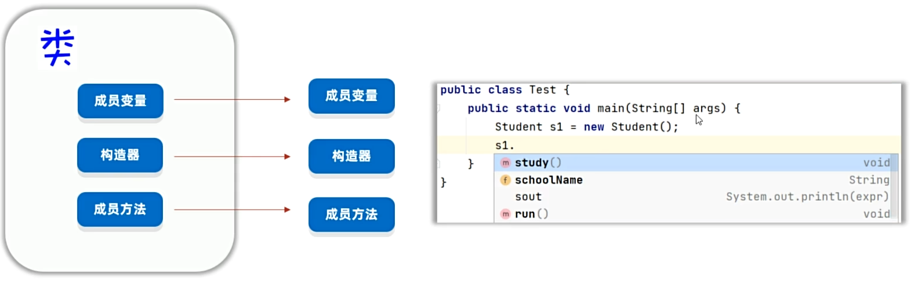
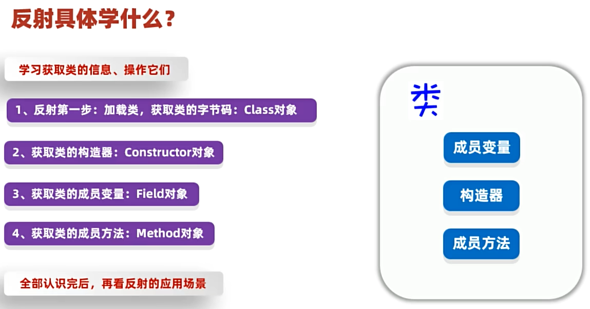
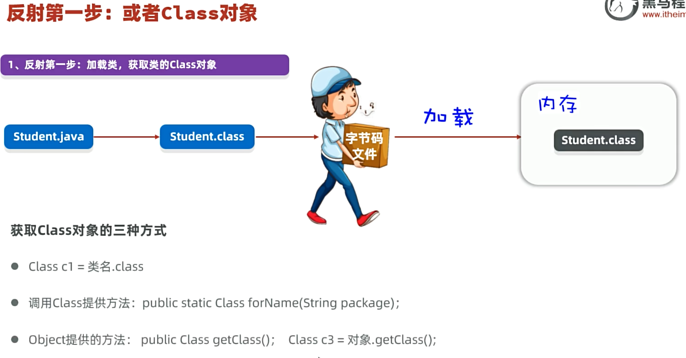

# Day06　Java 高级技术：单元测试 · 反射 · 注解 · 动态代理

> 本日主线：**单元测试 → 反射 → 注解 → 动态代理**
> 这些是 **源码、框架、架构师层面**的核心技术。

```
单元测试  ──>  反射  ──>  注解  ──>  动态代理
```

---

## 一、单元测试

### 1.1 什么是单元测试？

> **单元测试**：针对**最小的功能单元（方法）**编写测试代码，对其进行**正确性测试**。

### 1.2 传统测试的痛点

| 痛点 | 说明 |
| --- | --- |
| ❌ 只能在 `main` 方法编写测试代码 | 只能在main方法编写测试代码，去调用其他方法进行测试 |
| ❌ 无法实现自动化测试 | 无法实现自动化测试，一个方法测试失败，可能影响其他方法的测试 |
| ❌ 无法得到测试报告 | 无法得到测试的报告，需要程序员自己去观察测试是否成功 |

### 1.3 JUnit 单元测试框架

> **JUnit**：第三方开源的单元测试框架（IDEA 已集成）。

#### 优点 ⭐

**优点：**

* 可以灵活的编写测试代码，可以针对某个方法执行测试，也支持一键完成对全部方法的自动化测试，且各自独立。

* 不需要程序员去分析测试的结果，会自动生成测试报告出来。

### 1.4 JUnit 使用步骤

**具体步骤 ：**

1. 将Junit框架的jar包导入到项目中（注意：IDEA集成了Junit框架，不需要我们自己手工导入了） 
2. 为需要测试的业务类，定义对应的测试类，并为每个业务方法，编写对应的测试方法（必须：公共、无参、无返回值） 
3. **测试方法上必须声明`@Test`注解**，然后在测试方法中，编写代码调用被测试的业务方法进行测试； 
4. **开始测试：**选中测试方法，右键选择 “JUnit运行” ，如果**测试通过**则是**绿色**；如果**测试失败**，则是**红色**


⭐**注意：还需要做断言测试！！！**

* Assert.assertEquals()

  ~~~
  参数	含义
  第1个 message	断言失败时显示的提示信息
  第2个 expected	期望值（你认为应该的结果）
  第3个 actual	实际值（代码真正跑出来的结果）
  ~~~

  

#### 示例代码

```java
/**
 * 字符串工具类
 */
public class StringUtil {
    public static void printNumber(String name){
        if(name == null){
            System.out.println("参数为null！请注意");
            return;
        }
        System.out.println("名字长度是：" + name.length());
    }

    /**
     * 求字符串的最大索引
     */
    public static int getMaxIndex(String data){
        if(data == null || "".equals(data)) {
            return -1;
        }
//        return data.length();
        return data.length()-1;
    }
}
```

~~~java
// 测试类：junit单元测试框架，对业务类中的业务方法进行正确性测试。
public class StringUtilTest {
    // 测试方法：必须是公开public，无参，无返回值。
    // 测试方法必须加上@Test注解（Junit框架的核心步骤）
    @Test
    public void testPrinNumber() {
        // 测试步骤：
        StringUtil.printNumber("张三abc"); // 5
        // 测试用例
        StringUtil.printNumber("");
        StringUtil.printNumber(null);
    }

    @Test
    public void testGetMaxIndex() {
        // 测试步骤：
        int index = StringUtil.getMaxIndex("abcdefg"); // 6
        // 测试用例
        int index2 = StringUtil.getMaxIndex("");
        int index3 = StringUtil.getMaxIndex(null);

        System.out.println(index);
        System.out.println(index2);
        System.out.println(index3);

        // 做断言测试：断言结果是否与预期结果一致
        Assert.assertEquals("本轮测试失败，业务获取的最大索引有问题！请检查",6, index);
        Assert.assertEquals("本轮测试失败，业务获取的最大索引有问题！请检查",-1, index2);
        Assert.assertEquals("本轮测试失败，业务获取的最大索引有问题！请检查",-1, index3);
    }
}
~~~


### 1.5 JUnit 常用注解

| 注解 | 说明 |
| --- | --- |
| `@Test` ⭐ | 标记为测试方法 |
| `@Before` | 每个测试方法**之前**执行 |
| `@After` | 每个测试方法**之后**执行 |
| `@BeforeClass` | 所有测试方法**之前**执行**一次**（必须 static） |
| `@AfterClass` | 所有测试方法**之后**执行**一次**（必须 static） |

---

## 二、反射（Reflection）—— 框架的基石

### 2.1 什么是反射？

**⭐反射：**

* **反射就是：加载类，并允许以编程的方式解剖类中的各种成分（成员变量、方法、构造器等）。**

**注意：**

* 正因为有反射，所以在写代码的时候才会提示出这个对象的成员方法和属性之类的



### 2.2 反射学什么？



---

## 三、反射第一步：获取 Class 对象（三种方式 ⭐）



| 方式 | 写法 | 说明 |
| --- | --- | --- |
| ① **类名.class** | `Class c1 = Student.class;` | 最简单，编译期就能拿到 |
| ② **Class.forName** | `Class c2 = Class.forName("com.x.Student");` | **最常用**，传入**全限定类名** |
| ③ **对象.getClass()** | `Class c3 = obj.getClass();` | 已经有对象时使用 |

```java
// 三种方式，得到的是同一个 Class 对象
public class ReflectDemo1 {
    public static void main(String[] args) throws Exception {
        // 目标：掌握反射第一步操作：或者类的Class对象。（获取类本身）。
        // 1、获取类本身：类.class
        Class c1 = Student.class;
        System.out.println(c1);

        // 2、获取类本身：Class.forName("类的全类名")
        Class c2 = Class.forName("com.itheima.demo2reflect.Student");
        System.out.println(c2);

        // 3、获取类本身：对象.getClass()
        Student s = new Student();
        Class c3 = s.getClass();
        System.out.println(c3);

        System.out.println(c1 == c2); // true
        System.out.println(c2 == c3); // true
    }
}
```

---

## 四、反射获取类的成分并操作

### 4.1 获取构造器（Constructor）

Class 提供了从类中获取构造器的方法。
| 方法                                                         | 说明                                         |
| ------------------------------------------------------------ | -------------------------------------------- |
| `Constructor<?>[] getConstructors()`                         | 获取全部构造器（**只能获取 public 修饰的**） |
| `Constructor<?>[] getDeclaredConstructors()`⭐                | 获取全部构造器（**只要存在就能拿到**）       |
| `Constructor<T> getConstructor(Class<?>... parameterTypes)`  | 获取某个构造器（**只能获取 public 修饰的**） |
| `Constructor<T> getDeclaredConstructor(Class<?>... parameterTypes)⭐` | 获取某个构造器（**只要存在就能拿到**）       |

获取类构造器的作用：依然是初始化对象返回

| Constructor 提供的方法                    | 说明                                                         |
| ----------------------------------------- | ------------------------------------------------------------ |
| `T newInstance(Object... initargs)`       | 调用此构造器对象表示的构造器，并传入参数，完成**对象的初始化**并返回 |
| `public void setAccessible(boolean flag)` | 设置为 true，表示禁止检查访问控制（**暴力反射** ⭐）          |

```java
Class c = Class.forName("com.x.Student");
Constructor con = c.getDeclaredConstructor();
con.setAccessible(true);           // 暴力反射，可访问 private
Student s = (Student) con.newInstance();
```


### 4.2 获取成员变量（Field）

| 方法 | 说明 |
| --- | --- |
| `public Field[] getFields()` | 获取全部成员变量（**只能 public**） |
| `public Field[] getDeclaredFields()` ⭐ | 获取全部成员变量（**包括 private**） |
| `public Field getField(String name)` | 获取某个成员变量（**只能 public**） |
| `public Field getDeclaredField(String name)` ⭐ | 获取某个成员变量（**包括 private**） |

**获取到成员变量的作用：依然是赋值、取值。**：

| 方法 | 说明 |
| --- | --- |
| `void set(Object obj, Object value)` | **赋值** |
| `Object get(Object obj)` | **取值** |
| `public void setAccessible(boolean flag)` | 设置为true，表示禁止检查访问控制**（暴力反射）**⭐ |

```java
Field nameField = c.getDeclaredField("name");
nameField.setAccessible(true);
//把 student 对象 的 name 字段 设为 "张三"
nameField.set(student, "张三");      // 赋值
Object name = nameField.get(student); // 取值
```

### 4.3 获取成员方法（Method）

| 方法 | 说明 |
| --- | --- |
| `Method[] getMethods()` | 获取类的全部成员方法（**只能 public**） |
| `Method[] getDeclaredMethods()` ⭐ | 获取类的全部成员方法（**包括 private**） |
| `Method getMethod(String name, Class<?>... params)` | 获取类的某个成员方法（**只能 public**） |
| `Method getDeclaredMethod(String name, Class<?>... params)` ⭐ | 获取类的某个成员方法（**包括 private**） |

**Method 提供的方法**：

| 方法 | 说明 |
| --- | --- |
| `public Object invoke(Object obj, Object... args)` ⭐ | **触发某个对象的该方法执行** |
| `public void setAccessible(boolean flag)` | 设置为true，表示禁止检查访问控制**（暴力反射）**⭐ |

```java
Method method = c.getDeclaredMethod("study", String.class);
method.setAccessible(true);
Object result = method.invoke(student, "Java");//翻译过来就是Object result = student.study("Java");
```

### 4.4 反射操作总结表

| 成分 | 获取 API | 操作 API |
| --- | --- | --- |
| **构造器** | `getDeclaredConstructor(...)` | `newInstance(...)` → 创建对象 |
| **成员变量** | `getDeclaredField(...)` | `set(obj, val)` / `get(obj)` |
| **成员方法** | `getDeclaredMethod(...)` | `invoke(obj, args)` → 执行 |

> 💡 **`Declared` 系列方法**：**只要存在就能拿到**（包括 private），是反射的常用方法。

**注意：**

* 这里的con代表的是无参构造器，然后con.newInstance();可以新建一个对象，因为这里是无参构造器，所以newInstance()就不传递参数了，通过con.newInstance();就可以创建一个对象了，但需要强转一下，因为他也不知道你这里是什么构造器。

  ~~~Java
  Class c1 = Dog.class;
  Constructor con = c1.getDeclaredConstructor(); // 无参数构造器
  //获取构造器的作用依然是创建对象：创建对象。
  Dog d1 = (Dog) con.newInstance();
  ~~~

* 但如果这里的无参构造器是私有的，那么就需要暴力反射，临时攻破权限，说明私有构造器在外面其实是可以访问的

  ~~~java
  Class c1 = Dog.class;
  Constructor con = c1.getDeclaredConstructor(); // 无参数构造器
  //获取构造器的作用依然是创建对象：创建对象。
  // 暴力反射：暴力反射可以访问私有的构造器、方法、属性。
  con.setAccessible(true); // 绕过访问权限，直接访问！
  Dog d1 = (Dog) con.newInstance();
  
  //=======================================
  private Dog() {
      System.out.println("无参数构造器执行了~~");
  }
  ~~~

  

### 4.5 示例代码

~~~java
import org.junit.Test;

import java.lang.reflect.Constructor;
import java.lang.reflect.Field;
import java.lang.reflect.Method;

public class ReflectDemo2 {
    @Test
    public void getClassInfo(){
        // 目标：获取类的信息。
        // 1、反射第一步：或者Class对象，代表拿到类。
        Class c1 = Student.class;
        System.out.println(c1.getName()); // 类名的全类名 com.itheima.demo2reflect.Student
        System.out.println(c1.getSimpleName()); // 类名 Student
    }

    // 2、获取类的构造器对象并对其进行操作。
    @Test
    public void getConstructorInfo() throws Exception {
        // 目标：获取类的构造器对象并对其进行操作。
        // 1、反射第一步：或者Class对象，代表拿到类。
        Class c1 = Dog.class;
        // 2、获取构造器对象。
        Constructor[] cons = c1.getDeclaredConstructors();
        for (Constructor con : cons) {
            System.out.println(con.getName() + "(" + con.getParameterCount() + ")");
        }
        // 3、获取单个构造器
        Constructor con = c1.getDeclaredConstructor(); // 无参数构造器
        System.out.println(con.getName() + "(" + con.getParameterCount() + ")");

        Constructor con2 = c1.getDeclaredConstructor(String.class, int.class); // 2个参数的有参数构造器
        System.out.println(con2.getName() + "(" + con2.getParameterCount() + ")");

        // 4、获取构造器的作用依然是创建对象：创建对象。
        // 暴力反射：暴力反射可以访问私有的构造器、方法、属性。
        con.setAccessible(true); // 绕过访问权限，直接访问！
        Dog d1 = (Dog) con.newInstance();
        System.out.println(d1);

        Dog d2 = (Dog)con2.newInstance("小黑", 3);
        System.out.println(d2);
    }

    // 3、获取类的成员变量对象并对其进行操作。
    @Test
    public void getFieldInfo() throws Exception {
        // 目标：获取类的成员变量对象并对其进行操作。
        // 1、反射第一步：或者Class对象，代表拿到类。
        Class c1 = Dog.class;
        // 2、获取成员变量对象。
        Field[] fields = c1.getDeclaredFields();
        for (Field field : fields) {
            System.out.println(field.getName() + "(" + field.getType().getName() + ")");
        }
        // 3、获取单个成员变量对象。
        Field field = c1.getDeclaredField("hobby");
        System.out.println(field.getName() + "(" + field.getType().getName() + ")");

        Field field2 = c1.getDeclaredField("age");
        System.out.println(field2.getName() + "(" + field2.getType().getName() + ")");

        // 4、获取成员变量的目的依然是取值和赋值。
        Dog d = new Dog("泰迪", 3);
        field.setAccessible(true); // 绕过访问权限，直接访问！
        field.set(d, "社交");  //   d.setHobby("社交");
        System.out.println(d);

        String hobby = (String) field.get(d); // d.getHobby();
        System.out.println(hobby);

    }

    // 4、获取类的成员方法对象并对其进行操作。
    @Test
    public void getMethodInfo() throws Exception {
        // 目标：获取类的成员方法对象并对其进行操作。
        // 1、反射第一步：或者Class对象，代表拿到类。
        Class c1 = Dog.class;
        // 2、获取成员方法对象。
        Method[] methods = c1.getDeclaredMethods();
        for (Method method : methods) {
            System.out.println(method.getName() + "(" + method.getParameterCount() + ")");
        }
        // 3、获取单个成员方法对象。
        Method m1 = c1.getDeclaredMethod("eat");// 获取是无参数的eat方法
        Method m2 = c1.getDeclaredMethod("eat", String.class);// 获取是有参数的eat方法
        System.out.println(m1.getName() + "(" + m1.getParameterCount() + ")");
        System.out.println(m2.getName() + "(" + m2.getParameterCount() + ")");

        // 4、获取成员方法的目的依然是调用方法。
        Dog d = new Dog("泰迪", 3);
        m1.setAccessible(true); // 绕过访问权限，直接访问！
        Object rs1 = m1.invoke(d); // 唤醒对象d的eat方法执行，相当于 d.eat();
        System.out.println(rs1); // null

        Object rs2 = m2.invoke(d, "牛肉"); // 唤醒对象d的eat带String参数的方法执行，相当于 d.eat("牛肉");
        System.out.println(rs2);
    }
}
~~~

~~~java
public class Dog {
    private String name;
    private int age;
    private String hobby;
    private Dog() {
        System.out.println("无参数构造器执行了~~");
    }
    private Dog(String name) {
        System.out.println("1个参数有参数构造器执行了~~");
        this.name = name;
    }
    public Dog(String name, int age) {
        System.out.println("2个参数有参数构造器执行了~~");
        this.name = name;
        this.age = age;
    }

    private void eat(){
        System.out.println("狗吃骨头！");
    }

    public String eat(String name){
        System.out.println("狗吃" + name);
        return "狗说：谢谢！谢谢！汪汪汪！";
    }

    public String getName() {
        return name;
    }

    public void setName(String name) {
        this.name = name;
    }

    public int getAge() {
        return age;
    }

    public void setAge(int age) {
        this.age = age;
    }

    public String getHobby() {
        return hobby;
    }

    public void setHobby(String hobby) {
        this.hobby = hobby;
    }

    @Override
    public String toString() {
        return "Dog{" +
                "name='" + name + '\'' +
                ", age=" + age +
                ", hobby='" + hobby + '\'' +
                '}';
    }
}
~~~

~~~java
import lombok.AllArgsConstructor;
import lombok.Data;
import lombok.NoArgsConstructor;

@Data
@AllArgsConstructor
@NoArgsConstructor
public class Student {
    private String name;
    private int age;
    private String hobby;
}
~~~


---

## 五、反射的作用与应用场景

### 5.1 反射的四大作用

| 作用 | 说明 |
| --- | --- |
| ① **基本作用：可以得到一个类的全部成分然后操作** | 基本作用 |
| ② **可以破坏封装性** | `setAccessible(true)` 暴力反射 |
| ③ **可以绕过泛型的约束** | 突出特性 |
| ④ **最重要：适合做 Java 的框架** ⭐ | **主流框架基本都基于反射设计通用功能** |

### 5.2 案例：使用反射做简易框架

> **需求**：对任意一个对象，框架都可以把对象的字段名和对应的值保存到文件中去。

```java
public class Student {
    private String name;
    private int age;
    private char sex;
}

public class Teacher {
    private String name;
    private double salary;
}

// 框架核心
public static void saveObject(Object obj) throws Exception {
    Class c = obj.getClass();
    Field[] fields = c.getDeclaredFields();
    PrintStream ps = new PrintStream(new FileOutputStream("data.txt", true));
    ps.println("================" + c.getSimpleName() + "================");
    for (Field f : fields) {
        f.setAccessible(true);
        String name = f.getName();
        Object value = f.get(obj);
        ps.println(name + "=" + value);
    }
    ps.close();
}
```

> ✅ 这就是 ORM 框架（如 MyBatis）的底层雏形！

---

## 六、注解（Annotation）

### 6.1 什么是注解？

> **就是 Java 代码里的特殊标记**，比如 `@Override`、`@Test` 等。
> **作用**：**让其他程序根据注解信息来决定怎么执行该程序**。

> ⚠️ 注解可以用在：类、构造器、方法、成员变量、参数等位置。

### 6.2 自定义注解

```java
public @interface 注解名称 {
    public 属性类型 属性名() default 默认值;
}
```

**示例**：

```java
public @interface MyTest1 {
    String aaa();
    boolean bbb() default false;
    String[] ccc();
}

// 使用
@MyTest1(aaa = "李四", bbb = true, ccc = {"Go", "Python"})
public void test() { }
```

### 6.3 特殊属性 `value`（重点）

> **如果注解中只有一个 `value` 属性，使用注解时 `value` 名称可以省略！**

```java
public @interface MyTest {
    String value();        // ← 特殊属性名
    int age() default 18;
}

// 使用：value 可以省略
@MyTest("张三")
public void test() { }
```

### 6.4 注解的本质（原理）⭐

> **注解本质是一个接口，Java 中所有注解都继承了 `Annotation` 接口。**

```java
// 我们写的注解
public @interface MyTest1 {
    String aaa();
    boolean bbb();
    String[] ccc();
}

// 实际编译后等价于
public interface MyTest1 extends Annotation {
    public abstract String aaa();
    public abstract boolean bbb();
    public abstract String[] ccc();
}
```

> 💡 **`@注解(...)` 其实就是一个实现类对象**，实现了该注解以及 `Annotation` 接口。

---

## 七、元注解（注解的注解）

> **元注解**：用来标记**普通注解**的注解。

### 7.1 两大元注解

#### ① @Target —— 约束注解可以用在哪些位置

```java
@Target({ElementType.METHOD, ElementType.TYPE})
public @interface Test { }
```

| ElementType 值 | 含义 |
| --- | --- |
| `TYPE` | **类、接口** |
| `FIELD` | **成员变量** |
| `METHOD` | **成员方法** |
| `PARAMETER` | 方法参数 |
| `CONSTRUCTOR` | 构造器 |
| `LOCAL_VARIABLE` | 局部变量 |

#### ② @Retention —— 约束注解的保留周期 ⭐

```java
@Retention(RetentionPolicy.RUNTIME)
public @interface Test { }
```

| RetentionPolicy 值 | 含义 |
| --- | --- |
| `SOURCE` | **只作用在源码阶段**，字节码文件中不存在 |
| `CLASS`（默认） | 保留到**字节码文件**阶段，**运行阶段不存在** |
| `RUNTIME` ⭐ | **一直保留到运行阶段**（**开发中最常用**） |

> ⚠️ **要让注解能被反射解析，必须使用 `RUNTIME`！**

### 7.2 完整示例

```java
@Target({ElementType.TYPE, ElementType.METHOD})
@Retention(RetentionPolicy.RUNTIME)
public @interface MyTest4 {
    String value();
    double aaa() default 100;
    String[] bbb();
}
```

---

## 八、注解的解析

### 8.1 什么是注解解析？

> **判断类上、方法上、成员变量上是否存在注解，并把注解里的内容给解析出来**。

### 8.2 解析注解的指导思想

> **要解析谁上面的注解，就应该先拿到谁。**

| 解析目标 | 先拿到 |
| --- | --- |
| 类上的注解 | `Class` 对象 |
| 方法上的注解 | `Method` 对象 |
| 字段上的注解 | `Field` 对象 |
| 构造器上的注解 | `Constructor` 对象 |

> 💡 **`Class`、`Method`、`Field`、`Constructor` 都实现了 `AnnotatedElement` 接口**，都拥有解析注解的能力。

### 8.3 AnnotatedElement 解析注解的 API

| 方法 | 说明 |
| --- | --- |
| `Annotation[] getDeclaredAnnotations()` | 获取当前对象上所有注解 |
| `T getDeclaredAnnotation(Class<T> annotationClass)` | 获取**指定**注解对象 |
| `boolean isAnnotationPresent(Class<?> annotationClass)` | 判断是否存在某个注解 |

### 8.4 注解解析示例

```java
// 定义注解
@Target({ElementType.TYPE, ElementType.METHOD})
@Retention(RetentionPolicy.RUNTIME)
public @interface MyTest4 {
    String value();
    double aaa() default 100;
    String[] bbb();
}

// 使用注解
@MyTest4(value="孙悟空", aaa=99.5, bbb={"奔波儿灞", "灞波儿奔"})
public class Demo {
    @MyTest4(value="八戒", bbb={"美女", "媳妇"})
    public void test1() { }
}

// 解析注解
Class c = Demo.class;
if (c.isAnnotationPresent(MyTest4.class)) {
    MyTest4 mt = (MyTest4) c.getDeclaredAnnotation(MyTest4.class);
    System.out.println(mt.value());     // 孙悟空
    System.out.println(mt.aaa());       // 99.5
    System.out.println(Arrays.toString(mt.bbb()));
}
```

### 8.5 案例：自定义 JUnit 简易框架

**需求**：定义若干方法，**只要加了 `@MyTest` 注解，就会触发该方法执行**。

```java
// ① 定义注解
@Target(ElementType.METHOD)
@Retention(RetentionPolicy.RUNTIME)
public @interface MyTest { }

// ② 业务类
public class TestDemo {
    @MyTest
    public void test1() { System.out.println("test1 执行"); }

    public void test2() { System.out.println("test2 执行"); }  // 没加注解

    @MyTest
    public void test3() { System.out.println("test3 执行"); }
}

// ③ 框架核心：触发加了 @MyTest 的方法
public static void main(String[] args) throws Exception {
    TestDemo demo = new TestDemo();
    Class c = demo.getClass();
    Method[] methods = c.getDeclaredMethods();
    for (Method method : methods) {
        if (method.isAnnotationPresent(MyTest.class)) {
            method.invoke(demo);
        }
    }
}
```

> ✅ 这就是 JUnit 框架的核心原理！

---

## 九、动态代理

### 9.1 为什么需要代理？

```java
class 杨超越 {
    唱歌() {
        准备话筒，收钱;     // ← 非核心逻辑
        真正开始唱歌;       // ← 核心逻辑
    }
    跳舞() {
        准备场地，收钱;     // ← 非核心逻辑
        真正开始跳舞;       // ← 核心逻辑
    }
}
```

**问题**：对象身上做了**太多非核心的事**，代码臃肿且重复。

> ✅ **对象如果嫌身上干的事太多，可以通过代理来转移部分职责。**

### 9.2 代理的核心思想

```
对象有什么方法想被代理 → 代理就一定要有对应的方法
                          ↓
                    通过「接口」约定
```

```java
public interface Star {
    void sing();
    void dance();
}

class 杨超越 implements Star {
    public void sing() { System.out.println("真正开始唱歌"); }
    public void dance() { System.out.println("真正开始跳舞"); }
}

// 代理对象：调用代理的 sing() 时，先做准备工作，再调用真实对象的 sing()
```

### 9.3 创建 Java 对象的代理（重点 ⭐）

> Java 提供 **`java.lang.reflect.Proxy`** 类创建代理对象。

```java
public static Object newProxyInstance(
    ClassLoader loader,           // ① 类加载器
    Class<?>[] interfaces,        // ② 接口数组
    InvocationHandler h           // ③ 调用处理器（指定代理做什么）
);
```

**三个参数的含义**：

| 参数 | 含义 |
| --- | --- |
| **参数一 loader** | 用哪个类加载器去加载生成的代理类 |
| **参数二 interfaces** | 指定接口，**这些接口用于指定生成的代理长什么样**，即有哪些方法 |
| **参数三 h** | **用来指定生成的代理对象要干什么事情** |

### 9.4 完整代理示例

```java
public class StarFactory {

    public static Star createProxy(Star realStar) {
        return (Star) Proxy.newProxyInstance(
            StarFactory.class.getClassLoader(),
            new Class[]{Star.class},
            new InvocationHandler() {
                @Override
                public Object invoke(Object proxy, Method method, Object[] args) throws Throwable {
                    // ⭐ 代理要做的事
                    if ("sing".equals(method.getName())) {
                        System.out.println("准备话筒，收钱 8 万");
                    } else if ("dance".equals(method.getName())) {
                        System.out.println("准备场地，收钱 10 万");
                    }
                    // 调用真实对象的方法
                    return method.invoke(realStar, args);
                }
            }
        );
    }
}

// 使用
Star real = new 杨超越();
Star proxy = StarFactory.createProxy(real);
proxy.sing();    // 自动执行：准备话筒、收钱 → 真正开始唱歌
proxy.dance();
```

### 9.5 InvocationHandler.invoke 的参数说明

```java
Object invoke(Object proxy, Method method, Object[] args);
```

| 参数 | 含义 |
| --- | --- |
| `proxy` | 代理对象本身（一般用不到） |
| `method` | **被调用的方法**对象，反映正在被调用的方法 |
| `args` | 方法调用时的参数 |

> 💡 **invoke 会被谁调用？** —— 当外部调用代理对象的某个方法时，**自动触发 invoke 执行**。

### 9.6 案例：使用代理统计方法耗时

**场景**：某用户管理类包含登录、删除、查询等功能，要求**统计每个功能的执行耗时**。

**问题**：在每个方法中都加耗时统计代码 → 代码重复。

**解决**：用代理统一添加耗时统计。

```java
public class UserService {
    public void login(String name, String pwd) {
        // 业务逻辑
    }
    public void deleteUsers() {
        // 业务逻辑
    }
}

// 用代理为每个方法自动添加耗时统计
public static UserService createProxy(UserService real) {
    return (UserService) Proxy.newProxyInstance(
        UserService.class.getClassLoader(),
        new Class[]{...},
        (proxy, method, args) -> {
            long start = System.currentTimeMillis();
            Object result = method.invoke(real, args);
            long end = System.currentTimeMillis();
            System.out.println(method.getName() + " 耗时：" + (end - start) + "ms");
            return result;
        }
    );
}
```

### 9.7 使用代理的好处

> ✅ **将非核心功能（日志、耗时统计、权限校验等）从业务代码中解耦出来**，让业务代码更加纯粹。

这是 **Spring AOP 的核心思想**！

---

## 十、本日重点小结

| 知识点 | 关键记忆 |
| --- | --- |
| **JUnit** | `@Test` 标记测试方法，绿通过红失败 |
| **反射入口** | **Class 对象**（三种获取方式） |
| **Declared 系列** | 反射常用，**包括 private** |
| **暴力反射** | `setAccessible(true)` |
| **反射作用** | **框架的基石**（Spring、MyBatis 都基于反射） |
| **注解本质** | 接口（继承 Annotation） |
| **两大元注解** | `@Target`（用在哪）+ `@Retention`（活多久） |
| **注解解析** | 通过 `AnnotatedElement` 的 API |
| **解析前提** | `@Retention(RUNTIME)` |
| **动态代理** | `Proxy.newProxyInstance(...)` |
| **代理价值** | 解耦核心业务和非核心功能（**AOP 思想**） |

---

## 十一、整体技术全景图

```
┌─────────────────────────────────────────┐
│              业务代码（核心）              │
└───────────────┬─────────────────────────┘
                │
                │ 通过【反射】解剖类的成分
                │ 通过【注解】打标记
                │ 通过【动态代理】添加增强逻辑
                ↓
┌─────────────────────────────────────────┐
│          Java 框架（Spring 等）            │
│   ① 反射 - 获取类信息、操作对象             │
│   ② 注解 - 配置代替 XML                    │
│   ③ 动态代理 - AOP 切面编程                │
└─────────────────────────────────────────┘
```

> 💡 **这三大技术是从 "Java 开发者" 进化为 "Java 高级工程师 / 架构师" 的必经之路！**
