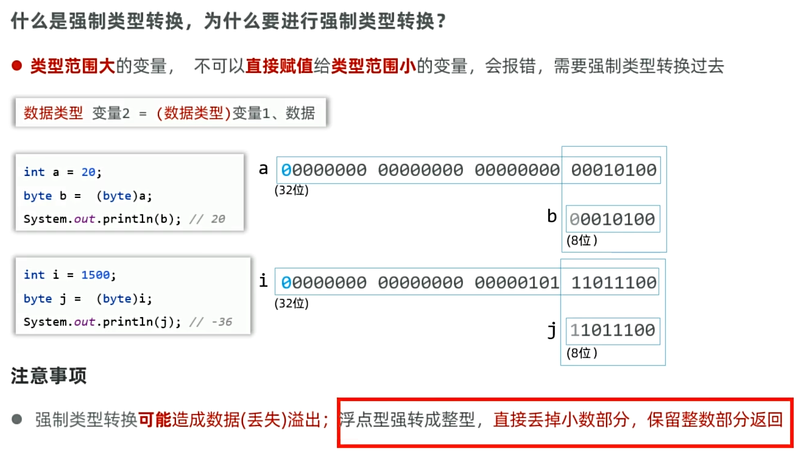

# Java入门：方法详解、类型转换、输入输出与运算符

本篇文档为您梳理了 Java 基础语法的进阶内容，包括：**方法详解、类型转换、输入输出（Scanner）以及各类运算符**。知识点已经过结构化梳理，重点内容已做标注。

---

## 1. 方法详解（Method）

### 1.1 什么是方法？
**方法**是一种用于执行特定任务或操作的**代码块**，代表一个功能。它可以接收数据进行处理，并返回一个处理后的结果。

### 1.2 方法的定义与格式
```java
修饰符 返回值类型 方法名(形参列表) {
    // 方法体代码(需要执行的功能代码)
    return 返回值;
}
```
- **示例**：
```java
public static int max(int a, int b) {
    int max = a > b ? a : b;
    return max;
}
```

### 1.3 方法如何使用？
- 方法**必须被调用才能执行**，调用格式：`方法名称(数据)`。
- 如果方法不需要返回数据，返回值类型必须声明为 **`void`**（无返回值声明），此时方法内部不可以使用 `return 返回数据;`，但可以使用 `return;` 立即结束方法的执行。

### 1.4 方法的注意事项（重点）
1. **方法重载（Overload）**：在一个类中，如果出现**多个方法的名称相同，但它们的形参列表不同**，这种现象称为方法重载。
   
   ```java
   public static void printVariable(int a) { ... }
   public static void printVariable(String str) { ... }
   public static void printVariable(int a, String str) { ... }
   ```
   
   > 注意：
   >
   > * 方法重载只关心方法名称相同，形参列表不同（类型不同、个数不同、顺序不同），其他都无所谓（如果只是形参名不同的话不算重载）
   
   
2.  **提前结束**：无返回值（`void`）的方法中，可以直接通过单独的 `return;` 立即结束当前方法的执行。

---

## 2. 类型转换

### 2.1 自动类型转换
- **概念**：类型范围**小**的变量，可以**直接赋值**给类型范围**大**的变量。
- **转换顺序**：
  `byte -> short -> int -> long -> float -> double`
  `char -> int`

### 2.2 强制类型转换
- **概念**：类型范围大的变量，不可以直接赋值给类型范围小的变量，会报错，需要**强制类型转换**。

- **格式**：`数据类型 变量 = (数据类型) 变量或数据;`
  ```java
  int a = 20;
  byte b = (byte) a;
  ```
  
- **注意事项（重点）**：
  1. 强制类型转换**可能造成数据丢失（溢出）**。
  2. 浮点型强转成整型，会**直接丢掉小数部分**，只保留整数部分。




### 2.3 表达式的自动类型提升

- 在表达式运算中，小范围类型的变量会**自动转换成表达式中较大范围的类型**再参与运算。
  - **byte、short、char** -> int -> long  -> float  -> double


**注意事项**：

1. 表达式的最终结果类型由表达式中的**最高类型决定**。

   ```java
   //可以看到变量有int、double、char类型，但返回值要求必须是double
   public static double calc(int a, int b, double c, char r) {
       return a + b + c + r;
   }
   ```

   

2. **`byte`、`short`、`char`** 在表达式中是**直接转换成 `int` 类型**参与运算的。

   ~~~java
   //可以看到变量是char类型，但返回值要求必须是int
   public static int calc2(byte a, byte b) {
       return a + b;
   }
   //比如说a是110,b是120，但相加的结果就超过了byte范围，所以当成int类型是没问题的
   ~~~

   


### 2.4 小结

为什么要进行类型转换？

* 存在不同类型的变量赋值给其他类型的变量

什么是自动类型转换？

* 类型范围小的变量，可以直接赋值给类型范围大的变量

什么是强制类型转换？

* 默认情况下，大范围类型的变量直接赋值给小范围类型的变量会报错！
* 可以强行将类型范围大的变量、数据赋值给类型范围小的变量
  * 数据类型 变量 = （数据类型）变量 数据

强制类型转换有哪些需要注意的？

* 可能出现数据丢失
* 小数强制转换成整数是直接截断小数保留整数


---

## 3. 输入与输出

### 3.1 概述
- **输出**：把程序中的数据展示出来。`System.out.println("Hello World!");`
- **输入**：程序读取用户键盘输入的数据。

### 3.2 键盘输入：Scanner
使用 Java 提供的 `Scanner` API 接收用户键盘输入的数据，通常需要三个步骤：
1. **导包**：告诉程序去哪里找扫描器。
   `import java.util.Scanner;`
2. **创建对象**：得到键盘扫描器对象。
   `Scanner sc = new Scanner(System.in);`
3. **接收数据**：等待用户输入。
   `int age = sc.nextInt();`
   `String name = sc.next();`

*(注意：`java.lang` 包下的类如 `String`、`System` 不需要显式导包)*

---

## 4. 运算符

### 4.1 基本算术运算符
| 符号 | 作用 | 说明 |
| :---: | :---: | :--- |
| `+` | 加 | 基础加法 |
| `-` | 减 | 基础减法 |
| `*` | 乘 | 基础乘法 |
| `/` | 除 | **注意：在Java中两个整数相除结果还是整数。** |
| `%` | 取余 | 获取两个数据做除法后的余数 |

>注意：
>
>* 比如说iint a=10,b=3; a/b的结果是3，并不是3.3333，因为a和b的最高运算符还是int


### 4.2 `+` 符号做连接符

- `+` 符号与字符串运算的时候，是用作**连接符**的，其结果依然是一个字符串。
- **识别技巧**：**能算则算，不能算就连接在一起。**
  - `5 + "abc"` 结果是 `"5abc"`

> 注意：
>
> * `"a"` 是 **字符串**，结果是拼接：
>   * 5 + "a"   // "5a"
> * `'a'` 是 **字符**，Java 会把它当成数字参与运算，`'a'` 的 ASCII/Unicode 值是 `97`：
>   * 5 + 'a'   // 102

### 4.3 自增自减运算符
| 符号 | 作用 | 说明 |
| :---: | :---: | :--- |
| `++` | 自增 | 对变量自身的值加 1 |
| `--` | 自减 | 对变量自身的值减 1 |

- **注意事项（重点）**：
  - 只能操作**变量**，不能操作字面量。
  
  - **单独使用**：放在变量前后没有区别。
  
  - ~~~java
    int a= 10;
    ++a;
    a++;
    ~~~
  
  - **非单独使用**（在表达式中）：
  
    - **放在前面**（如 `++a`）：**先加后用**（先对变量+1，再拿变量的值运算）。
      - int rs= ++a;(先加后用)
    - **放在后面**（如 `a++`）：**先用后加**（先拿变量的值运算，再对变量的值+1）。
      - int rs= a++;(先用后加)
  
  

### 4.4 赋值运算符
- **基本赋值运算符**：`=` （从右边往左看，将右边的值赋给左边）。
- **扩展赋值运算符**：隐含了**强制类型转换**。
  - `+=`：`a += b` 相当于 `a = (a的类型)(a + b)`
  - `-=`、`*=`、`/=`、`%=` 同理。

### 4.5 关系运算符（比较运算符）
运算最终返回的是**布尔类型**（`true` 或 `false`）。
- `>`、`>=`、`<`、`<=`
- `==`（判断是否相等，**切记不要误写成 `=`**）
- `!=`（判断是否不等于）

### 4.6 三元运算符
- **格式**：`条件表达式 ? 值1 : 值2;`
- **执行流程**：判断条件表达式的值，如果为 `true`，返回值1；如果为 `false`，返回值2。

### 4.7 逻辑运算符
把多个条件放在一起运算，最终返回 `true` 或 `false`。

| 符号 | 叫法 | 运算逻辑（重点） |
| :---: | :---: | :--- |
| `&` | 逻辑与 | 必须都是 true，结果才是 true。**有一个 false，结果就是 false。** |
| `|` | 逻辑或 | **只要有一个 true，结果就是 true。** |
| `!` | 逻辑非 | 取反：`!true` 是 false，`!false` 是 true。 |
| `^` | 逻辑异或 | 相同是 false，不同是 true。 |
| `&&` | **短路与** | 判断结果同 `&`。**左边为 false，右边则不执行**（直接短路）。 |
| `||` | **短路或** | 判断结果同 `|`。**左边为 true，右边则不执行**（直接短路）。 |

*(注意：实际开发中，最常用的逻辑运算符是：`&&` 、 `||` 、 `!`)*


### 4.8 小结

算数运算符有哪些？

* +、-、*、/、%

/ 需要注意什么，为什么？

* 如果两个整数做除法，其结果一定是整数，因为最高类型是整数。

+  除了做基本数学运算，还有哪些功能？

* 与字符串做+运算时会被当成连接符，其结果还是字符串。
* 识别技巧：能算就算，不能算就连在一起

