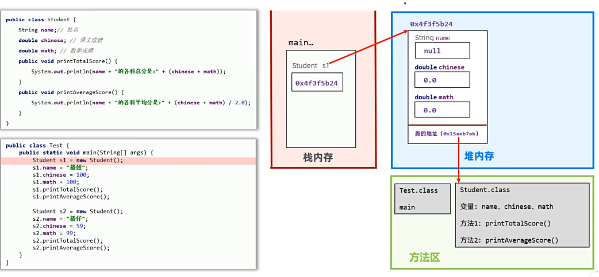

# Java入门：面向对象编程（入门）

本篇文档为您梳理了 Java 面向对象编程（OOP）的基础知识，涵盖了：**类与对象、构造器、`this` 关键字、封装、实体类（JavaBean）、`static` 静态关键字**等核心语法。知识点已经过结构化梳理，重点内容已做标注。

---

## 1. 面向对象快速入门

### 1.1 什么是对象？
**对象**本质上是一种**特殊的数据结构**（可以理解为一张表格），用来记住一个具体事物的数据（特征/状态），从而在程序中代表该事物。

### 1.2 面向对象编程（OOP）思想
**核心思想**：**万物皆对象，谁的数据谁存储。** 
用类设计对象处理某一事物的数据时，应该把要处理的数据，以及处理这些数据的方法，设计到一个对象中去。

### 1.3 类与对象的关系及创建步骤
1. **定义类（Class）**：设计对象的模板，也就是对象的设计图。
   - **成员变量**：用来说明对象可以处理什么数据。
   - **成员方法**：描述对象有什么功能，可以对数据进行什么样的处理。
2. **创建对象**：通过 `new` 关键字，每 `new` 一次类就得到一个新的对象。
   ```java
   类名 对象名 = new 类名();
   // 示例
   Student s1 = new Student();
   s1.name = "张三";
   ```

### 1.4 对象在内存中的执行原理
- **方法区**：`.class` 字节码文件（如 `Test.class`, `Student.class`）加载的地方。
- **栈内存**：存放方法的运行区（如 `main` 方法），以及对象的引用（如 `Student s1`，存储的是堆内存中对象的地址）。
- **堆内存**：通过 `new` 创建的**具体对象**存放在这里，包括它的实例变量和方法的引用地址。




### 1.5小结

对象是啥？如何得到？

* 对象就是一种特殊的数据结构、对象是用类new出来的，有了类就可以创建出对象

面向对象编程这种套路是咋回事？

* 万物皆对象，谁的数据谁存储。

---

## 2. 类的核心组成部分

### 2.1 构造器（Constructor）
- **特点**：长得和类名一样，没有返回值类型。对象创建时（`new` 操作时）会自动调用。
  ```java
  public class Student {
      // 构造器
      public Student() { ... }
  }
  ```
- **常见应用场景**：在创建对象的同时，完成对对象成员变量（属性）的**初始化赋值**。
- **注意事项（重点）**：
  
  1. **类默认自带一个无参数构造器**。
  2. 如果手动为类定义了**有参数构造器**，类默认的无参构造器就被覆盖了；此时若还想使用无参构造器，**必须自己手动写出来**。

### 2.2 `this` 关键字
- **作用**：`this` 就是一个变量，用在方法内部，用来**拿到当前对象**。**哪个对象调用方法，`this` 就指向哪个对象**。
- **实际应用场景**：用来解决**成员变量名称冲突**（主要是成员变量与方法形参同名时，使用 `this.变量名` 代表成员变量）。

---

## 3. 面向对象三大特征之一：封装（Encapsulation）

### 3.1 什么是封装？
把客观事物封装成抽象的类，并且隐藏事物内部的实现细节，仅向外界暴露访问的方式。

### 3.2 封装的设计规范
**核心原则**：**合理隐藏，合理暴露**。
- **公开成员**：使用 `public`（公开）修饰，外界可以直接访问。
- **隐藏成员**：使用 `private`（私有）修饰，外界无法直接访问。

### 3.3 实体类（JavaBean）
**实体类**是一种特殊的类，在软件开发中非常流行，它的主要作用是用来保存数据，实现**数据和数据的业务处理相分离**。

**实体类的设计要求（必须满足）**：
1. 类中的成员变量**全部私有（`private`）**。
2. 为每个成员变量提供 `public` 修饰的 **getter / setter 方法**。
3. 类中**必须提供一个无参数构造器**（有参数构造器可选）。

---

## 4. `static` 关键字（静态）

`static` 叫静态，可以修饰类的**成员变量**和**成员方法**。

### 4.1 `static` 修饰成员变量
| 分类 | 修饰符 | 所属关系 | 内存特点 | 访问方式 |
| :--- | :--- | :--- | :--- | :--- |
| **类变量（静态变量）** | 有 `static` 修饰 | 属于**类** | 与类一起加载，内存中**只有一份**，被所有对象共享 | **`类名.静态变量`** (推荐)<br>`对象.静态变量` (不推荐) |
| **实例变量（对象变量）** | 无 `static` 修饰 | 属于**对象** | 每个对象创建时都会产生，每个对象**各有一份**，数据不同 | **`对象.实例变量`** |

**静态变量应用场景**：如果某个数据只需要一份，且希望能够被所有对象共享（如记录创建了多少个对象），则定义为静态变量。

### 4.2 `static` 修饰成员方法
| 分类 | 修饰符 | 所属关系 | 访问方式 |
| :--- | :--- | :--- | :--- |
| **类方法（静态方法）** | 有 `static` 修饰 | 属于**类** | **`类名.静态方法()`** (推荐)<br>`对象.静态方法()` (不推荐) |
| **实例方法（对象方法）** | 无 `static` 修饰 | 属于**对象** | **`对象.实例方法()`** |

**静态方法应用场景**：常用来**设计工具类**（`Util`）。
- **什么是工具类**：类中的方法都是静态方法，每个方法用来完成一个通用功能。
- **为什么使用静态方法做工具类？**：因为如果使用实例方法，必须先创建对象才能调用，而创建对象仅仅为了调用方法会**浪费内存**。静态方法直接用类名调用，提高了开发效率且节省内存。
- **工具类设计规范**：工具类不需要创建对象，建议**将工具类的构造器私有化**。

### 4.3 静态与实例成员的访问注意事项（重点）
1. **静态方法中**：**可以**直接访问静态成员；**不可以**直接访问实例成员。
2. **实例方法中**：**既可以**直接访问静态成员，**也可以**直接访问实例成员。
3. **`this` 关键字**：实例方法中可以出现 `this`；**静态方法中不可以出现 `this`**。

---

## 5. 综合小案例（练习方向）
- **学生成绩计算**：使用类存储姓名、语文、数学成绩，在类中提供计算总分和平均分的方法。
- **简易电影信息展示系统**：
  - 设计电影实体类（JavaBean）存储电影信息（编号、名称、价格）。
  - 创建数组存储多部电影对象。
  - 允许根据电影编号（id）查询详细信息并展示。
