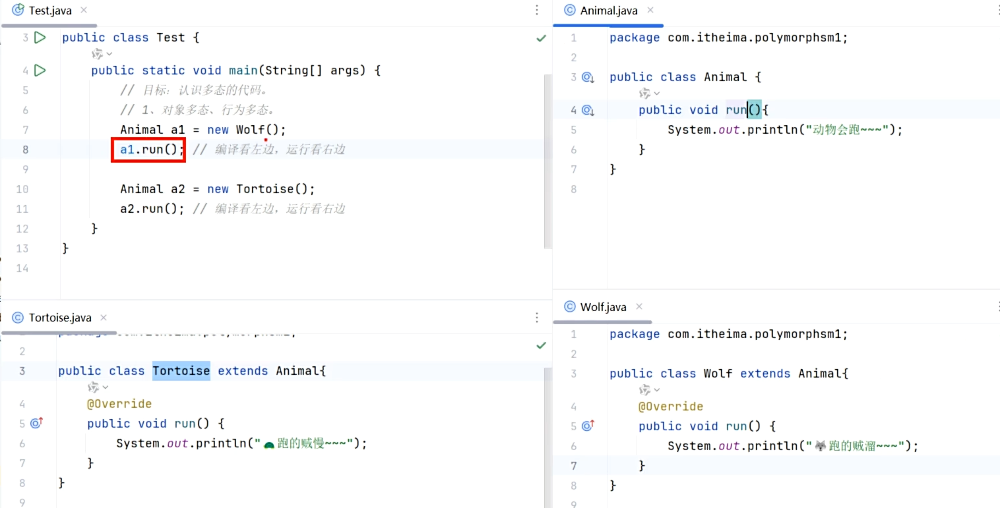
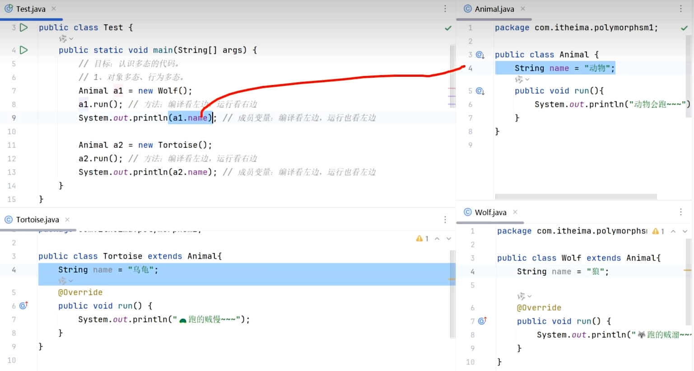

# Java面向对象高级：继承与多态

本篇文档为您梳理了 Java 面向对象编程（OOP）中的高级特性，主要包括：**继承、权限修饰符、方法重写、构造器特点以及多态**的知识点。知识点已经过结构化梳理，重点内容已做标注。

---

## 1. 继承（Inheritance）

### 1.1 什么是继承？为什么要有继承？
- **概念**：Java 中提供了 `extends` 关键字，可以让一个类和另一个类建立起父子关系。
  ```java
  public class 子类 extends 父类 { }
  ```
- **目的**：提高代码的重用性，把多个类的共同属性和行为抽取到父类中，减少重复代码的书写。
- **子类能继承什么**：子类能继承父类的**非私有成员**（成员变量、成员方法）。

### 1.2 继承的特点（重点）
1. **单继承模式**：Java 中的类**只支持单继承**，即一个类只能继承一个直接父类。不支持多继承（为了避免方法调用的冲突和歧义）。
2. **支持多层继承**：A 可以继承 B，B 可以继承 C。
3. **祖宗类**：Java 中所有的类要么直接继承 `Object`，要么默认或间接继承 `Object`。因此，**`Object` 是所有类的祖宗类**。

### 1.3 权限修饰符
权限修饰符用来限制类中的成员（变量、方法、构造器）能够被访问的范围。

| 修饰符 | 本类 | 同一个包中的其他类 | 子孙类（其他包） | 任意类（其他包） |
| :--- | :---: | :---: | :---: | :---: |
| `private` (私有) | √ | | | |
| 缺省 (不写) | √ | √ | | |
| `protected` (受保护) | √ | √ | √ | |
| `public` (公开) | √ | √ | √ | √ |

### 1.4 继承后子类访问成员的特点：就近原则
在子类方法中访问其他成员，遵循**就近原则**：
- 先在**子类局部范围**找 -> **子类成员范围**找 -> **父类成员范围**找。如果都没有，则报错。
- 如果子类和父类出现了重名的成员，想**强制访问父类成员**，可以使用 `super` 关键字：
  `super.父类成员变量` 或 `super.父类成员方法`

---

## 2. 方法重写（Override）

### 2.1 什么是方法重写？
当子类觉得父类中的某个方法不好用，或者无法满足自身需求时，子类可以写一个**方法名称、参数列表与父类一致的方法**，去覆盖父类的该方法，这就是方法重写。

### 2.2 重写的注意事项（重点）
1. 建议加上 **`@Override` 注解**：这可以帮助检查方法重写的格式是否正确，并提高代码可读性。
2. **访问权限要求**：子类重写父类方法时，其访问权限**必须大于或者等于**父类被重写方法的权限（**public > protected > 缺省**）。
3. **返回值类型要求**：必须与被重写方法的返回值类型一样，或者为其子类（范围更小）。
4. **不能被重写的方法**：**私有方法、静态方法不能被重写**。

---

## 3. 子类构造器的特点

### 3.1 `super()` 调用父类构造器
- **核心特点**：子类的**全部构造器**，都会**先调用父类的构造器，再执行自己**。
- **原理**：默认情况下，子类**所有**构造器的第一行代码隐藏着一句 `super()`，它会去调用父类的**无参数构造器**。
- **应用场景**：通过调用父类构造器，把对象中包含父类这部分的数据先初始化赋值。
- **注意**：如果父类**没有无参数构造器**，则必须在子类构造器的第一行手动编写 `super(...)`，指定去调用父类的有参数构造器。

### 3.2 `this(...)` 调用兄弟构造器
- **作用**：在任意类的构造器中，可以通过 `this(...)` 去调用本类的其他构造器。
- **冲突注意**：**`this(...)` 和 `super(...)` 都只能放在构造器的第一行**。因此，两者不能共存在同一个构造器中。

---

## 4. 多态（Polymorphism）

### 4.1 什么是多态？
多态是在继承或实现接口的情况下的一种现象。
- **表现形式**：对象多态、行为多态。
- **注意**：多态是对象和行为的多态，**Java 中的成员变量不谈多态**（变量看左边类型）。

> **总结：**
>
> * 方法：编译看左边，运行看右边
> * 成员变量：编辑看左边，运行也看左边。
>   * 因为【变量】不强调多态性，没有多态性

### 4.2 多态的前提与格式
1. 有继承或实现关系。
2. 存在**父类引用指向子类对象**。
   格式：`父类 变量名 = new 子类();`
   例如：`People p = new Student();`
3. 存在**方法重写**。

**注意：**

* 方法：编译看左边，运行看右边
  * 比如说a1.run();意思就是编译的时候会先看左边的Animal有没有run()方法，如果Animal没有run()方法就直接报错了；但真正运行的时候就是看右边的Wolf，会去找Wolf的run方法，因为这毕竟是一个子类对象，子类有优先级。
  * 成员变量：编译看左边，运行也看左边。

### 4.3 多态的好处与问题
- **好处**：
  1. 实现了**解耦合**，更便于代码扩展和维护。
  
     * 比如说我现在代码是People p1 = new Teacher();p1.run();但如果哪天发现老师不好用，那我就切换成学生
       People p1 = new Student();p1.run();比方说p1.run()后面还有一千行代码，那后面的一千行代码都不用动，只用把
       People p1 = new Teacher();换成People p1 = new Student()就可以了。 
  
  2. 定义方法时，使用**父类类型的形参**可以接收一切子类对象，极其便利。
  
     ~~~java
     //这样写的话go方法只能接收Wolf类型的参数，如果哪天想换成Tortoise类型参数就无法接收了
     public static void main(String[] args) {
            Wolf w = new Wolf();
         	go(w)
         }
     public static void go (Wolf w){
         w.run();
     }
     
     //这样写的话就没问题，可以接收一切子类对象
     public static void main(String[] args) {
            Wolf w = new Wolf();
         	go(w)
                 
              Tortoise t = new Tortoise();
         	go(t)
         }
     public static void go (Animal a){
         a.run();
     }
     
     ~~~
  
     
  
- **存在的问题**：
  - **多态下不能直接调用子类的独有功能（方法）**。
    - 因为**【编译看左边】**，比如说Tortoise类特有的方法是shrinkHead，在编译的时候会看到Animal类没有shrinkHead方法


### 4.4 多态下的类型转换
为了解决多态下不能调用子类独有功能的问题，需要进行向下转型（强制类型转换）。

1. **自动类型转换（向上转型）**：
   `父类 变量名 = new 子类();`
   
2. **强制类型转换（向下转型）**：
   `子类 变量名 = (子类) 父类变量;`
   `Student s = (Student) p;`
   
3. **强转的风险与预防（重点）**：
   - 只要存在继承关系，编译阶段进行强转就不会报错。但如果在**运行时**发现对象的真实类型与强转后的类型不同，就会报 `ClassCastException`（类型转换异常）。
   
     ~~~java
     //因为p是Person类型，在编译阶段发现Person和Student有继承关系，但运行时发现p的真实类型是Teacher
     People p =  new Teacher();
     Student s= (Student) p;//java.lang.ClassCastException
     ~~~
   
     
   
   - **Java 官方建议**：在进行强制类型转换前，使用 **`instanceof`** 关键字判断当前对象的真实类型。
     ```java
     //查看p的真实类型是不是Student
     if (p instanceof Student) {
         Student s = (Student) p; 
         // 强转安全，可调用Student独有方法
     }
     ```

---

## 5. 综合案例（练习方向）
- **员工信息管理**：利用继承结构整合“讲师”和“咨询师”的共同属性（如姓名），并保留各自特有属性。
- **加油站支付模块**：
  - 定义父类（如“用户卡”）和子类（“金卡”、“银卡”）。
  - 利用多态设计支付接口，实现不同卡片的不同优惠折扣。
  - 使用类型转换调用金卡的独有方法（如打印免费洗车票）。
