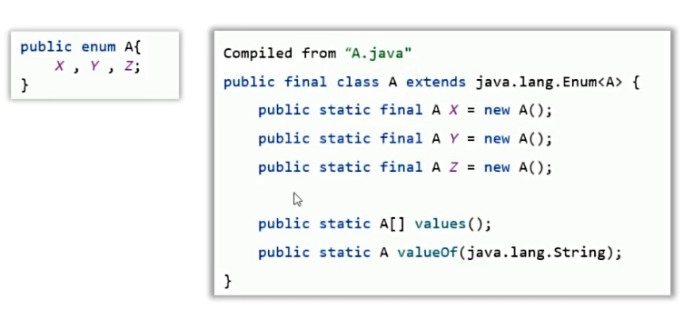
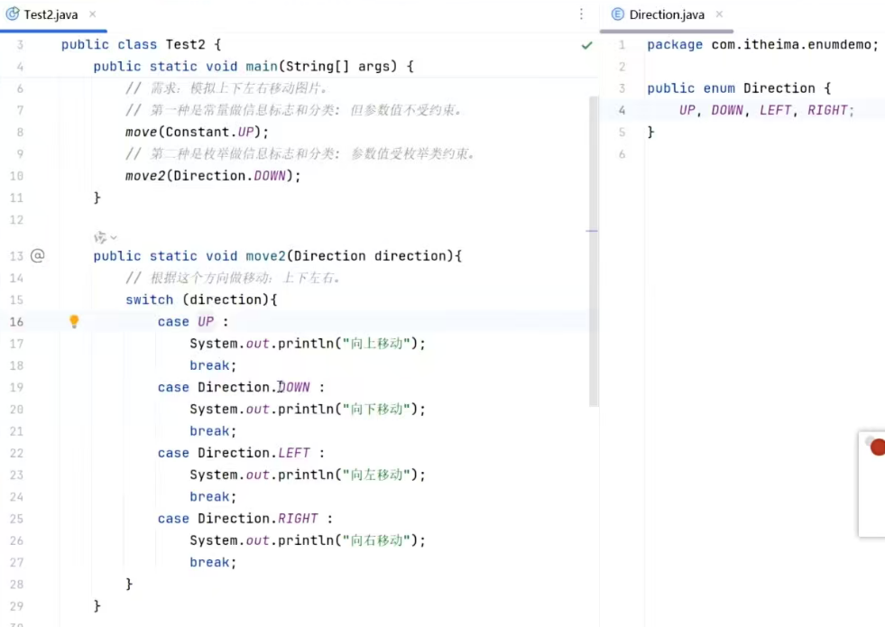
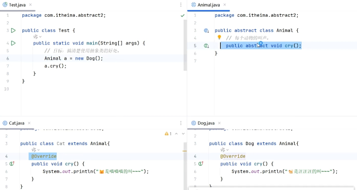
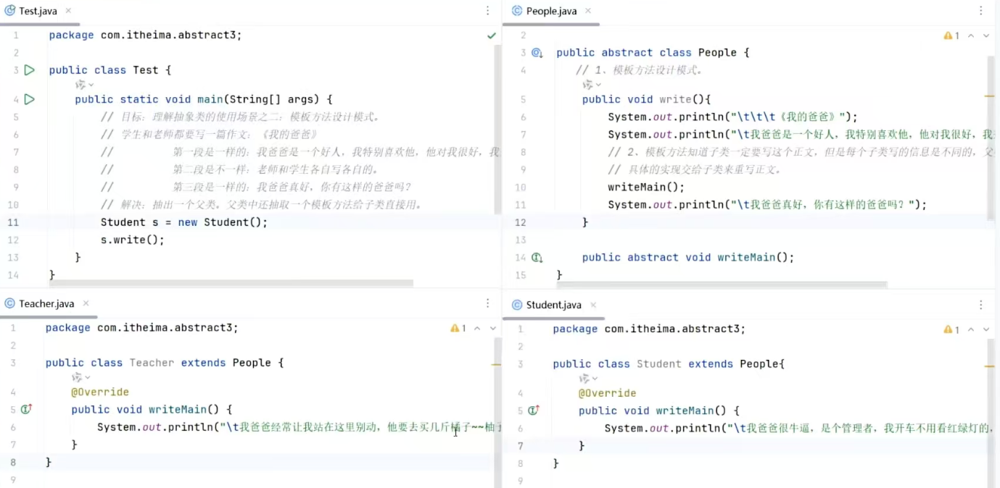

# Day07 面向对象高级 — final · 单例 · 枚举 · 抽象类 · 接口

---

## 一、final 关键字

`final` 是"最终的"意思，可修饰**类、方法、变量**。

| 修饰目标 | 效果 |
|---------|------|
| 类 | 最终类，**不能被继承** |
| 方法 | 最终方法，**不能被重写** |
| 变量 | 有且仅能被赋值**一次** |

### 修饰变量的注意事项

- **基本类型**：变量存储的**数据值**不能改变。
- **引用类型**：变量存储的**地址**不能改变，但地址指向对象的**内容可以改变**。

---

## 二、常量（static final）

> **定义**：使用 `static final` 修饰的成员变量称为常量。

```java
public class Constant {
    public static final String SCHOOL_NAME = "传智教育";
}
```

### 命名规范
> 全部大写英文单词，多个单词用**下划线**连接，如 `SCHOOL_NAME`。

### 使用常量的优势
1. **可读性好、可维护性高**——修改只需改一处。
2. **宏替换**——编译后常量出现的地方全部替换为字面量，性能与直接写字面量相同。

---

## 三、单例设计模式

### 什么是设计模式？
一个问题通常有多种解法，其中最优的解法被总结为**设计模式**（共 20 多种）。学习设计模式主要关注两点：
1. 解决什么问题？
2. 怎么写？

### 单例模式的作用
> **确保某个类只能创建一个对象**，避免浪费内存（如任务管理器、运行时对象）。

### 3.1 饿汉式单例（推荐）

**特点**：获取对象时，对象**早已创建好**。

```java
public class A {
    // ② 静态变量持有唯一对象
    private static A a = new A();

    // ① 私有构造器，外部不能 new
    private A() {}

    // ③ 对外提供静态方法返回对象
    public static A getObject() {
        return a;
    }
}
```

> **注意：**
>
> * 构造器私有，也就是说不能new这个类，不然会报错
>   *  A a = new A();   // ❌ 编译错误！
> * **静态属性**
>   * **全类共享的那一份数据"，而不是某个对象的数据**。
>
> 
>
> 什么是设计模式，设计模式主要学什么？
>
> * 具体问题的最优解决方案。
> * 解决了什么问题？怎么写？
> * 确保某个类只能创建一个对象。
>
> 单例怎么写？饿汉式单例的特点是什么？
>
> * 把类的构造函数私有；定义一个静态变量存储类的一个对象；提供一个静态方法返回对象。
> * 在获取类的对象时，对象已经创建好了。
>
> 单例有啥应用场景，有啥好处？
>
> * 任务管理器对象、获取运行时对象。


### 3.2 懒汉式单例

**特点**：**用到时才创建**（延迟加载）。

```java
public class B {
    private static B b; // null

    private B() {}

    public static B getObject() {
        if (b == null) {
            b = new B();
        }
        return b;
    }
}
```

> **注意**：懒汉式在多线程环境下需要加锁处理（此处为基础版本）。

---

## 四、枚举类（enum）

### 基本语法

```java
修饰符 enum 枚举类名{
    名称1,名称2,...;
    其他成员...
}

public enum Direction {
    UP, DOWN, LEFT, RIGHT;
    // 其他成员...
}
```

**特点：**

* 枚举类中的第一行，只能写枚举类的对象名称，且要用逗号隔开。
* **这些名称，本质是常量，每个常量都记住了枚举类的一个对象。**
* 第二行就可以定义类的其他东西，比如说构造器、成员、方法。

### 枚举类的核心特点



| 特点 | 说明 |
|-----|------|
| 最终类 | 不可被继承，隐式继承 `java.lang.Enum` |
| **第一行只能写对象名** | **每个名称本质是 `public static final` 常量，记住枚举类的一个对象** |
| 构造器私有 | 外部无法创建对象 |
| 编译器自动新增方法 | `values()`、`valueOf(String)` |

### 常见应用场景
> **枚举非常适合做信息分类和标志**，例如方向、状态、舍入模式等，可避免使用魔法值（如 `int` 常量）。



---

## 五、抽象类（abstract）

### 基本语法

```java
public abstract class Animal {
    // 抽象方法：只有签名，没有方法体
    public abstract void cry();

    // 普通方法可以有实现
    public String getName() { ... }
}
```

**抽象类、抽象方法是什么样的？**

* 都是用abstract修饰的；抽象方法只有方法签名，不能写方法体。

### 抽象类的特点（重点）

| 特点 |
|-----|
| 抽象类中不一定要有抽象方法，**有抽象方法的类必须是抽象类** |
| 类有的成员：成员变量、方法、构造器，抽象类都可以有。 |
| 抽象类最主要的特点：抽象类不能创建对象，仅作为一种特殊的父类，让子类继承并实现。 |
| 一个类继承抽象类，必须重写抽象类的全部抽象方法，否则这个类也必须定义成抽象类。 |

### 抽象类的应用价值
> 父类知道每个子类都要做某个行为，但各子类做法不同 → 父类定义**抽象方法**，交给子类重写 → **更好地支持多态**。

> **抽象类本质上还是一个类**，普通类能有的成员（private/protected/public 字段、构造方法、static 成员等）它全都能有，只是多了"不能被实例化"和"可以有抽象方法"这两个特点而已。

**注意：**

* 多态要求子类一定要重写，所以其实父类方法的方法体写了也是多余，这样可以让代码更加简洁。
* 同时可以强制要求子类重写。



---

## 六、模板方法设计模式

### 解决的问题
多个子类中存在**重复代码**（结构相同，只有部分步骤不同）。

### 写法

1. 定义一个**抽象类**。
2. 在里面定义**两个方法**：
   - **模板方法**（建议用 `final` 修饰）：封装公共步骤，调用抽象方法。
   - **抽象方法**：不确定的步骤，交给子类实现。

```java
public abstract class WriteTemplate {
    // 模板方法，用 final 防止子类重写破坏流程
    public final void write() {
        System.out.println("开头固定格式...");
        writeBody(); // 变化部分，由子类实现
        System.out.println("结尾固定格式...");
    }

    protected abstract void writeBody();
}
```

> **为什么用 final 修饰模板方法？** 模板方法供子类直接调用，若被子类重写则模板失效。



---

## 七、接口（interface）

### 基本语法

```java
public interface 接口名 {
    // 1.常量：接口中定义常量可以省略public static final
  		String SCHOOL_NAME="黑马程序员";
  	//public static final String SCHOOL_NAME="黑马程序员";
  
  
    // 2.抽象方法：接口中定义抽象方法可以省略public abstract
  	//public abstract void run();
  		void run();
  		String go();
}
```

### 实现接口

```java
// 一个类可以同时实现多个接口
public class Student implements Flyable, Swimmable {
    // 必须重写所有接口的全部抽象方法
    // 否则该类也要定义为抽象类
}
```

> **注意**：
>
> * 接口**不能创建对象**。
>   * 构造器都没有
> * 接口是用来被类**实现（implements）**的，实现接口的类称为**实现类，一个类可以同时实现多个接口。**
>   * 实现类实现多个接口，必须重写完全部接口的全部抽象方法，否则实现类需要定义成抽象类。
>     * 接口里的**抽象方法**会自动加上 `public abstract`，但以下三种方法**不会**被加 `abstract`（因为它们有方法体）：
>       1. **`default` 方法**（JDK 8+）—— 自动加 `public`，但不是 abstract
>       2. **`static` 方法**（JDK 8+）—— 自动加 `public`，但不是 abstract
>       3. **`private` 方法**（JDK 9+）—— 本身就是 private，不会加 public 也不是 abstract
> * 在JDK8之前， 接口中只能定义成员变量和成员方法。


### 接口的好处

1. **弥补类单继承的不足**：一个类可同时实现多个接口，使类的角色更多、功能更强。

2. **面向接口编程**：灵活切换业务实现，**解耦合**。

   1. 左边是接口，也就是面向接口。右边是解耦合，即可改成Teacher，也可以用Student

      ~~~java
      Driver a = new Student();
      ~~~

      ~~~java
      public class Test {
          public static void main(String[] args) {
              // 目标: 去理解Java设计接口的好处、用处。
              // 接口弥补了类单继承的不足, 可以让类拥有更多角色, 类的功能更强大。
              People p = new Student();//这个是多态
              Driver d = new Student(); // 多态的写法
              BoyFriend bf = new Student(); 
      
              // 接口可以实现面向接口编程, 更利于解耦合。
              Driver a = new Student();
              BoyFriend b = new Teacher();
          }
      }
      
      interface Driver{}
      interface BoyFriend{}
      class People{}
      class Student extends People implements Driver, BoyFriend{}
      class Teacher implements Driver, BoyFriend{}
      ~~~


**问题：**Driver d = new Student(); 和BoyFriend bf = new Student();的区别？

~~~java
// 定义接口
interface Driver {
    void drive(); // 开车方法
}

interface BoyFriend {
    void accompany(); // 陪伴方法
}

class Student implements Driver, BoyFriend {
    @Override
    public void drive() {
        System.out.println("学生开车送你回家");
    }

    @Override
    public void accompany() {
        System.out.println("学生陪你逛街");
    }

    // Student自己独有的方法
    public void study() {
        System.out.println("学生正在写作业");
    }
}

==============================================
Driver d = new Student();
d.drive();    // ✅ 可以调用，因为drive()在Driver接口里定义了
d.accompany();// ❌ 编译报错！accompany()不在Driver接口里，编译器不认
d.study();    // ❌ 编译报错！study()是Student独有的，编译器不认
~~~

 

### JDK 8 起接口新增的三种方法

| 方法类型 | 修饰符 | 调用方式 |
|---------|--------|---------|
| 默认方法（实例方法） | `default` | **实现类对象**调用 |
| 静态方法 | `static` | **接口名**调用 |
| 私有方法（JDK 9+） | `private` | 仅接口内部调用 |

> 三种方法默认都被 `public` 修饰。新增目的：**增强接口能力，便于项目扩展和维护**。

~~~java
public interface A{
    /**
     * 1、默认方法（实例方法）：使用用default修饰，默认会被加上public修饰。
     * 注意：只能使用接口的实现类对象调用
     */
    default void test1(){
        ...
    }

    /**
     * 2、私有方法：必须用private修饰(JDK 9开始才支持)
     * 私有的实例方法。
     * 如何调用？使用接口中的其他实例方法来调用它，比如说在test1()中写入test2()来调用
     */
    private void test2(){
        ...
    }

    /**
     * 3、类方法（静态方法）：使用static修饰，默认会被加上public修饰。
     * 注意：只能用接口名来调用。比如说A.test3()
     */
    static void test3(){
        ...
    }
}
~~~


### 接口的注意事项

1. **接口可以多继承**：一个接口可以继承多个接口（`extends A, B`）。
2. 若多个接口中存在**方法签名冲突**，则此时不支持多继承也不支持多实现。【了解】
3. 类继承父类同时实现接口，若父类和接口有同名默认方法，**优先用父类的**。【了解】
4. 类实现多个接口，若接口中存在同名默认方法，类**重写该方法**即可解决冲突。【了解】

~~~java
//两个接口show方法的签名相同，这时候c1是可以多继承的
interface A1 {
    void show();
}
interface B1 {
    void show();
}
interface C1 extends A1, B1 {

}

//两个接口show方法的签名不同，这时候c1是可以多继承的
interface A1 {
    void show();
}
interface B1 {
    String show();
}
interface C1 extends A1, B1 {

}

//两个接口show方法的签名相同，这时候D1是可以多实现的
//两个接口show方法的签名不同，这时候D1是不可以多实现的，因为show方法不知道该返回什么类型
class D1 implements A1, B1 {
    @Override
    public void show() {

    }
}
~~~


---

## 八、抽象类 vs 接口 对比

| 对比项 | 抽象类 | 接口 |
|--------|--------|------|
| 关键字 | `abstract class` | `interface` |
| 继承/实现 | 单继承（`extends`） | 多实现（`implements`） |
| 构造器 | 有 | 无 |
| 成员变量 | 普通变量 | 常量（`public static final`） |
| 方法 | 抽象方法 + 普通方法 | 抽象方法 + 默认/静态/私有方法 |
| 设计目的 | 抽取共性，支持多态 | 规范行为，解耦合 |

### 相同点：

1、多是抽象形式，都可以有抽象方法，都不能创建对象。

2、都是派生子类形式：抽象类是被子类继承使用，接口是被实现类实现。

3、一个类继承抽象类，或者实现接口，都必须重写完他们的抽象方法，否则自己要成为抽象类或者报错！

4、都能支持的多态，都能够实现解耦合。

------

### 不同点：

1、抽象类中可以定义类的全部普通成员，接口只能定义常量，抽象方法（JDK8 新增的三种方式）

2、抽象类只能被类单继承，接口可以被类多实现。

3、一个类继承抽象类就不能再继承其他类，一个类实现了接口（还可以继承其他类或者实现其他接口）。

4、抽象类体现模板思想：更利于做父类，实现代码的复用性。 最佳实践

5、接口更适合做功能的解耦合：解耦合性更强更灵活。 最佳实践
