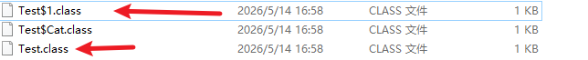
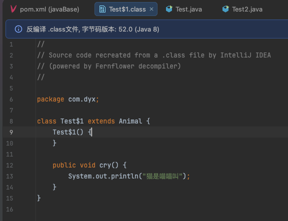
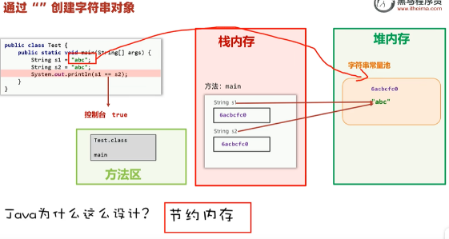
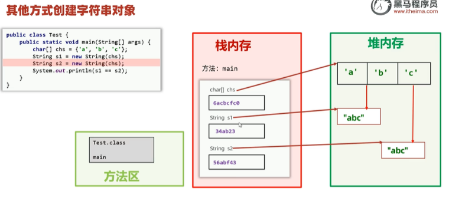

Day08 面向对象高级 — 代码块 · 内部类 · Lambda · 方法引用

---

## 一、代码块

Java 中有两种代码块，均写在类体内、方法体外（或方法体内）。

### 1.1 静态代码块

```java
static {
    // 随类加载而执行，只执行一次
}
```

- **特点**：类加载时自动执行，由于类只会加载一次，所以静态代码块也只会执行一次。
- **作用**：完成类的初始化，例如：对静态变量的初始化赋值。

### 1.2 实例代码块（构造代码块）

```java
{
    // 每次创建对象时，在构造器执行之前执行
}
```

- **特点**：每次创建对象时，执行实例代码块，**并在构造器前执行**。
- **作用**：和构造器一样，都是用来完成对象的初始化的，例如：对实例变量进行初始化赋值。

### 执行顺序小结

> **静态代码块（类加载时，仅一次）→ 实例代码块（每次 new）→ 构造器（每次 new）**

---

## 二、内部类

**定义在类内部的类**，分为四种：成员内部类、静态内部类、局部内部类、匿名内部类。

### 2.1 成员内部类

```java
public class Outer {
    private int data = 10;

    class Inner {
        public void show() {
            System.out.println(data); // 可直接访问外部类成员
        }
    }
}

// 创建方式
Outer.Inner obj = new Outer().new Inner();
```

- 可以访问外部类的**所有成员**（包括私有）。
- 外部类名称.内部类名称  对象名  =  new 外部类名称(...).new 内部类名称(...);


### 2.2 静态内部类

```java
public class Outer {
    static class Inner {
        public void show() { ... }
    }
}

// 创建方式
Outer.Inner obj = new Outer.Inner();
```

- 有 `static` 修饰的内部类 。
- **外部类名称.内部类名称  对象名  =  new 外部类.new 内部类(...);**
- 可以直接访问外部类的**静态成员**，不能直接访问外部类的实例成员。


### 2.3 局部内部类

- 定义在方法或代码块中，**作用范围局限于当前方法**。
- 了解即可（实际开发中极少使用，通常用匿名内部类代替）。


### 2.4 匿名内部类（重点）

#### 2.41.语法

```java
// 语法
new 接口/类(参数值...) {
    类体(一般是方法重写);
};

//例子
new Animal(){
  @Override
  public void cry(){
    
  }
}
```

**特点：**

* 匿名内部类本质就是一个子类，并会立即创建出一个子类对象。

**作用：**

* 可以更方便的创建出一个子类对象。


####  2.4.2 使用形式

**当使用子类，而不使用匿名内部类的时候：**

~~~java
package com.dyx;

public class Test {
    public static void main(String[] args) {
        Animal a = new Cat();
        a.cry();
    }


    class Cat extends Animal {
        @Override
        public void cry() {
            System.out.println("猫是喵喵叫");
        }
    }
}
~~~


**使用匿名内部类的时候：**

~~~java
package com.dyx;

public class Test {
    public static void main(String[] args) {
//        Animal a = new Cat();
//        a.cry();
      
        /**
         * 匿名内部类就是不需要去构建一个子类，可以更方便得到一个子类对象
         * 但不需要构建子类的话，我们还是要得到一个猫对象，该怎么办？匿名内部类说你要new Cat()，那你不如
         * 直接new Animal(),用Animal来代替Cat，但Animal是抽象类，不可以new，
         * 但匿名内部类就会问Animal，为什么不给我new，Animal说我这是抽象类不能new，然后匿名内部类就说
         * 那我带个花括号，马上把cry在花括号里重写，这样就是允许的，这就是匿名内部类。
         * 匿名内部类本质就是一个子类，相当于前面的Cat类
         */

        //编译看左边，运行看右边，所欲运行的是匿名内部类里的cry()
        Animal a = new Animal() {
            @Override
            public void cry() {
                System.out.println("猫是喵喵叫");
            }
        };
        a.cry();

    }
}
~~~

**注意：**

* **匿名内部类实际上是有名字的，外部类名$编号**.class
* **匿名内部类本质是一个子类，同时会立即构建一个子类对象。**


#### 2.4.3 使用场景

~~~java
import java.util.Arrays;
import java.util.Comparator;

public class Test4 {
    public static void main(String[] args) {
        // 目标：完成给数组排序，理解其中匿名内部类的用法。
        // 准备一个学生类型的数组，存放6个学生对象。
        Student[] students = new Student[6];
        students[0] = new Student("殷素素", 35, 171.5, '女');
        students[1] = new Student("杨幂", 28, 168.5, '女');
        students[2] = new Student("张无忌", 25, 181.5, '男');
        students[3] = new Student("小昭", 19, 165.5, '女');
        students[4] = new Student("赵敏", 27, 167.5, '女');
        students[5] = new Student("刘亦菲", 36, 168, '女');

        // 需求：按年龄升序排序。可以调用sun公司写好的API直接对数组进行排序。
        // public static void sort(T[] a, Comparator<T> c)
        // 参数一： 需要排序的数组
        // 参数二： 需要给sort声明一个Comparator比较器对象（指定排序的规则）
        Arrays.sort(students, new Comparator<Student>() {
            @Override
            public int compare(Student o1, Student o2) {
                return 0;
            }
        });

        // 遍历数组中的学生对象并输出
        for (int i = 0; i < students.length; i++) {
            Student s = students[i];
            System.out.println(s);
        }
    }
}

// 补充：为了让代码可运行，需要配套的Student类定义（示例）
class Student {
    private String name;
    private int age;
    private double height;
    private char sex;

    public Student(String name, int age, double height, char sex) {
        this.name = name;
        this.age = age;
        this.height = height;
        this.sex = sex;
    }

    // 为了按年龄排序，需要提供age的getter方法
    public int getAge() {
        return age;
    }

    @Override
    public String toString() {
        return "Student{" +
                "name='" + name + '\'' +
                ", age=" + age +
                ", height=" + height +
                ", sex=" + sex +
                '}';
    }
}
~~~


---

### 2.5 小结

| 内部类类型 | 关键字 | 创建方式 | 使用场景 |
|-----------|--------|---------|---------|
| 成员内部类 | 无 | `new Outer().new Inner()` | 与外部类强关联 |
| 静态内部类 | `static` | `new Outer.Inner()` | 不依赖外部类实例 |
| 局部内部类 | 无 | 方法内部 `new Inner()` | 了解即可 |
| **匿名内部类** | 无 | `new 接口/类() {...}` | **最常用，传参、回调** |

---

## 三、Lambda 表达式（JDK 8）

### 3.1 什么是 Lambda

```java
// 匿名内部类写法
Swim s = new Swim() {
    @Override
    public void swimming() {
        System.out.println("swimming...");
    }
};

// Lambda 写法
/**
* 原理就是可以通过上下文推断出：通过左边的Swim s可以推断出是Swim接口的匿名内部类,然后
* Swim接口里又只有一个抽象方法
*/
Swim s = () -> System.out.println("swimming...");
s.swimming();

//函数式接口：只有一个抽象方法的接口
@FunctionalInterface //声明函数式接口的注解，加不加这个注解都可以，加了的话就是强制只能有一个抽象方法
interface Swim{
  void swimming();
}
```

**什么是函数式变成？有什么好处？**

* 使用Lambda函数替代某些匿名内部类对象，从而让程序代码更简洁，可读性更好。

**Lambda表达式是啥？有什么用？怎么写？**

* JDK8新增的一种语法，代表函数；可以用于替代并简化函数式接口的匿名内部类。

**什么样的接口是函数式接口？怎么确保一个接口必须是函数式接口**

* 只有一个抽象方法的接口就是函数式接口。
* 在接口上加上@FunctionalInterface注解即可。

### 3.2 完整语法

```java
(被重写方法的形参列表) -> {
    被重写方法的方法体代码
}
```

### 3.3 示例和简化规则（重点）

| 具体规则 |
|---------|
| 参数类型全部可以省略不写 |
| 如果只有一个参数，参数类型省略的同时 “()” 也可以省略，但多个参数不能省略 “()” |
| 如果 Lambda 表达式中只有一行代码，大括号可以不写，同时要省略分号 “;” 如果这行代码是 return 语句，也必须去掉 return |

```java
// 原始
Arrays.sort(arr, (Integer a, Integer b) -> { return a - b; });

// 简化
Arrays.sort(arr, (a, b) -> a - b);
```

~~~java
import java.util.Arrays;

public class LambdaDemo2 {
    public static void main(String[] args) {
        // 目标：用Lambda表达式简化实际示例。
        Student[] students = new Student[6];
        students[0] = new Student("殷素素", 35, 171.5, '女');
        students[1] = new Student("杨幂", 28, 168.5, '女');
        students[2] = new Student("张无忌", 25, 181.5, '男');
        students[3] = new Student("小昭", 19, 165.5, '女');
        students[4] = new Student("赵敏", 27, 167.5, '女');
        students[5] = new Student("刘亦菲", 36, 168, '女');

        // 需求：按年龄升序排序。可以调用sun公司写好的API直接对数组进行排序。
//        Arrays.sort(students, new Comparator<Student>() {
//            @Override
//            public int compare(Student o1, Student o2) {
//                return o1.getAge() - o2.getAge(); // 按照年龄升序!
//            }
//        });
        Arrays.sort(students, (o1, o2) -> {
            return o1.getAge() - o2.getAge(); // 按照年龄升序!
        });

        // 遍历数组中的学生对象并输出
        for (int i = 0; i < students.length; i++) {
            Student s = students[i];
            System.out.println(s);
        }
    }
}

// 补充说明：
// 为保证代码可运行，需自行定义Student类，示例如下：
class Student {
    private String name;
    private int age;
    private double height;
    private char sex;

    public Student(String name, int age, double height, char sex) {
        this.name = name;
        this.age = age;
        this.height = height;
        this.sex = sex;
    }

    public int getAge() {
        return age;
    }

    @Override
    public String toString() {
        return "Student{" +
                "name='" + name + '\'' +
                ", age=" + age +
                ", height=" + height +
                ", sex=" + sex +
                '}';
    }
}
~~~


---

## 四、方法引用（JDK 8）

> **本质**：Lambda 的进一步简化

### 4.1 四种方法引用类型

| 类型 | 语法 | 示例 | 等价 Lambda |
|-----|------|------|------------|
| 静态方法引用 | `类名::静态方法` | `Math::abs` | `x -> Math.abs(x)` |
| 实例方法引用 | `对象::实例方法` | `obj::show` | `() -> obj.show()` |
| 特定类的实例方法 | `类名::实例方法` | `String::compareToIgnoreCase` | `(s1,s2) -> s1.compareToIgnoreCase(s2)` |
| 构造器引用 | `类名::new` | `Student::new` | `(n,a) -> new Student(n,a)` |

### 4.2 静态方法引用

语法：

* **类名::静态方法**

使用场景：

* 如果某个Lambda表达式里**只是调用一个静态方法**，并且"->"前后参数的形式一致，就可以使用静态方法引用。

~~~java
import java.util.Arrays;

public class Demo1 {
    public static void main(String[] args) {
        // 目标：静态方法引用：演示一个场景。
        test();
    }

    public static void test() {
        Student[] students = new Student[6];
        students[0] = new Student("殷素素", 35, 171.5, '女');
        students[1] = new Student("杨幂", 28, 168.5, '女');
        students[2] = new Student("张无忌", 25, 181.5, '男');
        students[3] = new Student("小昭", 19, 165.5, '女');
        students[4] = new Student("赵敏", 27, 167.5, '女');
        students[5] = new Student("刘亦菲", 36, 168, '女');

        // 需求：按年龄升序排序。可以调用sun公司写好的API直接对数组进行排序。
        /**
         *     Arrays.sort(students, new Comparator<Student>() {
         *             @Override
         *             public int compare(Student o1, Student o2) {
         *                 return o1.getAge() - o2.getAge();
         *             }
         *         });
         */
//        Arrays.sort(students, (o1, o2) -> o1.getAge() - o2.getAge());
//        Arrays.sort(students, (o1, o2) -> Student.compareByAge(o1,o2));
      
      	//静态方法引用：  类名 :: 静态方法名
        Arrays.sort(students, Student::compareByAge);

        // 遍历数组中的学生对象并输出
        for (int i = 0; i < students.length; i++) {
            Student s = students[i];
            System.out.println(s);
        }
    }
}

// 配套Student类（保证代码可运行）
class Student {
    private String name;
    private int age;
    private double height;
    private char sex;

    public Student(String name, int age, double height, char sex) {
        this.name = name;
        this.age = age;
        this.height = height;
        this.sex = sex;
    }

    public int getAge() {
        return age;
    }

    public static int compareByAge(Student s1, Student s2) {
        return s1.getAge() - s2.getAge();
    }


    @Override
    public String toString() {
        return "Student{" +
                "name='" + name + '\'' +
                ", age=" + age +
                ", height=" + height +
                ", sex=" + sex +
                '}';
    }
}
~~~


 ### 4.3 实例方法引用

语法：

* **对象名::实例方法**

使用场景：

* 如果某个 Lambda 表达式里只是通过对象名称调用一个实例方法，并且 `->` 前后参数的形式一致，就可以使用实例方法引用。

~~~java
import java.util.Arrays;

public class Demo1 {
    public static void main(String[] args) {
        // 目标：静态方法引用：演示一个场景。
        test();
    }

    public static void test() {
        Student[] students = new Student[6];
        students[0] = new Student("殷素素", 35, 171.5, '女');
        students[1] = new Student("杨幂", 28, 168.5, '女');
        students[2] = new Student("张无忌", 25, 181.5, '男');
        students[3] = new Student("小昭", 19, 165.5, '女');
        students[4] = new Student("赵敏", 27, 167.5, '女');
        students[5] = new Student("刘亦菲", 36, 168, '女');

        // 需求：按年龄升序排序。可以调用sun公司写好的API直接对数组进行排序。
        /**
         *     Arrays.sort(students, new Comparator<Student>() {
         *             @Override
         *             public int compare(Student o1, Student o2) {
         *                 return o1.getAge() - o2.getAge();
         *             }
         *         });
         */
//        Arrays.sort(students, (o1, o2) -> o1.getAge() - o2.getAge());
        Student student = new Student();
        //Arrays.sort(students, (o1, o2) -> student.compareByHeight(o1,o2));
        Arrays.sort(students, student::compareByHeight);

        // 遍历数组中的学生对象并输出
        for (int i = 0; i < students.length; i++) {
            Student s = students[i];
            System.out.println(s);
        }
    }
}

// 配套Student类（保证代码可运行）
class Student {
    private String name;
    private int age;
    private double height;
    private char sex;

    public Student() {
    }

    public Student(String name, int age, double height, char sex) {
        this.name = name;
        this.age = age;
        this.height = height;
        this.sex = sex;
    }

    public int getAge() {
        return age;
    }

    public int compareByHeight(Student o1, Student o2) {
        // 按照身高比较
        return Double.compare(o1.getHeight(), o2.getHeight());
    }

    public double getHeight() {
        return height;
    }

    public void setHeight(double height) {
        this.height = height;
    }

    @Override
    public String toString() {
        return "Student{" +
                "name='" + name + '\'' +
                ", age=" + age +
                ", height=" + height +
                ", sex=" + sex +
                '}';
    }
}
~~~


### 4.3 特定类型方法的引用

语法：

* **特定类的名称::方法**

使用场景：

* 如果某个 Lambda 表达式里只是调用一个特定类型的实例方法，并且前面参数列表中的第一个参数是作为方法的主调，后面的所有参数都是作为该实例方法的入参的，则此时就可以使用特定类型的方法引用。
  * **解析：**o1是字符串，compareToIgnoreCase是字符串的方法，字符串就是java里的一种特定类型，而且这里是拿的字符串对象去调用的方法，因为o1是字符串对象，并且从Arrays.sort(names, (o1, o2)->o1.compareToIgnoreCase(o2));可以看出前面参数列表的第一个参数作为方法的主调，这里就是用o1去调用的compareToIgnoreCase方法，o2就是作为compareToIgnoreCase的入参

~~~java
package com.dyx;

import java.util.Arrays;

public class Demo3 {
    public static void main(String[] args) {
        // 目标: 特定类型的方法引用。
        // 需求: 有一个字符串数组，里面有一些人的名字都是，英文名称，请按照名字的首字母升序排序。
        String[] names = {"Tom", "Jerry", "Bobi", "曹操" , "Mike", "angela", "Dlei", "Jack", "Rose", "Andy", "caocao"};

        // 把这个数组进行排序: Arrays.sort(names, Comparator)
        // Arrays.sort(names); // 默认就是按照首字母的编号升序排序。
        // 要求: 忽略首字母的大小写进行升序排序(java官方默认是搞不定的，需要我们自己指定比较规则)
        /**
        Arrays.sort(names, new Comparator<String>() {
            @Override
            public int compare(String o1, String o2) {
                // o1 angela
                // o2 Andy
                return o1.compareToIgnoreCase(o2); // java已经为我们提供了字符串按照首字母忽略大小写比较的方法: compareToIgnoreCase
            }
        });
         */
        //Arrays.sort(names, (o1, o2)->o1.compareToIgnoreCase(o2));
        Arrays.sort(names, String::compareToIgnoreCase);

        System.out.println(Arrays.toString(names));
    }
}
~~~


### 4.4 构造器引用

语法：

* **类名::new**

使用场景：

* 如果某个 Lambda 表达式里只是在创建对象，并且 “`→`” 前后参数情况一致，就可以使用构造器引用。

~~~java
package com.dyx;

import lombok.AllArgsConstructor;
import lombok.Data;
import lombok.NoArgsConstructor;

public class Demo4 {
    public static void main(String[] args) {
        // 目标: 理解构造器引用。
        // 创建了接口的匿名内部类对象

        /**
         CarFactory cf = new CarFactory() {
        @Override public Car getCar(String name) {
        return new Car(name);
        }
        };
         */
        //CarFactory cf = name->new Car(name);
        CarFactory cf = Car::new;
        Car c1 = cf.getCar("奔驰");
        System.out.println(c1);
    }
}

@FunctionalInterface
interface CarFactory {
    Car getCar(String name);
}

@Data
@AllArgsConstructor
@NoArgsConstructor
class Car {
    private String name;
}
~~~


---

## 五、String 常用 API

### 5.1 String 对象

**String是什么，有什么用？**

* `String`代表字符串，它的对象可以封装字符串数据，并提供了很多方法完成对字符串的处理。


| 构造器                           | 说明                                  |
| -------------------------------- | ------------------------------------- |
| `public String()`                | 创建一个空白字符串对象,不含有任何内容 |
| `public String(String original)` | 根据传入的字符串内容,来创建字符串对象 |
| `public String(char[] chars)`    | 根据字符数组的内容,来创建字符串对象   |
| `public String(byte[] bytes)`    | 根据字节数组的内容,来创建字符串对象   |

**String创建字符串对象的方式**

* **方式一：Java程序中的所有字符串文字（例如："abc"）都为此类的对象。**

  ~~~java
  String s1 = "Hello";
  ~~~

  

* **方式二：调用String类的构造器初始化字符串对象**

  ~~~java
  package com.dyx;
  
  public class StringDemo1 {
      public static void main(String[] args) {
          // 目标：掌握创建字符串对象，封装要处理的字符串数据，调用String提供的方法
          // 1、推荐方式一： 直接""就可以创建字符串对象，封装字符串数据。
          String s1 = "hello，黑马";
          System.out.println(s1);
          System.out.println(s1.length()); // 处理字符串的方法。
  
          // 2、方式二: 通过构造器初始化对象。
          String s2 = new String(); // 不推荐
          System.out.println(s2); // ""空字符串
  
          String s3 = new String("hello, 黑马"); // 不推荐
          System.out.println(s3);
  
          char[] chars = {'h','e','l','l','o',',',' ','黑','马'};
          String s4 = new String(chars);
          System.out.println(s4);
  
          byte[] bytes = {97, 98, 99, 65, 66, 67};
          String s5 = new String(bytes);
          System.out.println(s5);
      }
  }
  ~~~


**String创造对象的区别**

* **只要是以 `"..."` 方式写出的字符串对象，会存储到字符串常量池，且相同内容的字符串只存储一份**
* **通过`new`方式创建字符串对象，每`new`一次都会产生一个新的对象放在堆内存中。**


> **注意**：`==` 比较地址，`equals` 比较内容。字符串字面量比较**必须用 `equals`**。


### 5.2 常用方法速查

| 方法名                                                       | 说明                                                   |
| ------------------------------------------------------------ | ------------------------------------------------------ |
| `public int length()`                                        | 获取字符串的长度返回(就是字符个数)                     |
| `public char charAt(int index)`                              | 获取某个索引位置处的字符返回                           |
| `public char[] toCharArray()`                                | 将当前字符串转换成字符数组返回                         |
| `public boolean equals(Object anObject)`                     | 判断当前字符串与另一个字符串的内容一样,一样返回 true   |
| `public boolean equalsIgnoreCase(String anotherString)`      | 判断当前字符串与另一个字符串的内容是否一样(忽略大小写) |
| `public String substring(int beginIndex, int endIndex)`      | 根据开始和结束索引进行截取,得到新的字符串(包前不包后)  |
| `public String substring(int beginIndex)`                    | 从传入的索引处截取,截取到末尾,得到新的字符串返回       |
| `public String replace(CharSequence target, CharSequence replacement)` | 使用新值,将字符串中的旧值替换,得到新的字符串           |
| `public boolean contains(CharSequence s)`                    | 判断字符串中是否包含了某个字符串                       |
| `public boolean startsWith(String prefix)`                   | 判断字符串是否以某个字符串内容开头,开头返回 true,反之  |
| `public String[] split(String regex)`                        | 把字符串按照某个字符串内容分割,并返回字符串数组返回    |

---


## 六、ArrayList 常用 API

### 6.1 ArrayList集合

**什么是集合？**

- 集合是一种容器，用来装数据的，类似于数组。

**有数组，为啥还学习集合？**

- 数组定义完成并启动后，**长度就固定了**。
- 集合大小可变，功能丰富，开发中用的更多。

**集合是什么，有什么特点？**

- 一种容器，用来存储数据的
- 集合的大小可变。

**ArrayList 是什么？怎么使用？**

- 是集合中最常用的一种，ArrayList 是泛型类，可以约束存储的数据类型。
- 创建对象：调用无参数构造器`public ArrayList()`初始化对象
- 调用增删改查数据的方法

```java
// 泛型写法（推荐）
ArrayList<String> list = new ArrayList<>();
```

### 6.2 构造器

| 构造器               | 说明                 |
| -------------------- | -------------------- |
| `public ArrayList()` | 创建一个空的集合对象 |

### 6.3 常用方法

| 常用方法名                              | 说明                                  |
| --------------------------------------- | ------------------------------------- |
| `public boolean add(E e)`               | 将指定的元素添加到此集合的末尾        |
| `public void add(int index, E element)` | 在此集合中的指定位置插入指定的元素    |
| `public E get(int index)`               | 返回指定索引处的元素                  |
| `public int size()`                     | 返回集合中的元素的个数                |
| `public E remove(int index)`            | 删除指定索引处的元素,返回被删除的元素 |
| `public boolean remove(Object o)`       | 删除指定元素,返回是否删除成功         |
| `public E set(int index, E element)`    | 修改指定索引处的元素,返回被修改的元素 |

```java
ArrayList<String> list = new ArrayList<>();
list.add("Java");
list.add("Python");
list.add(0, "C++");

System.out.println(list.get(0));   // C++
System.out.println(list.size());   // 3
list.remove("Python");
```

---

## 七、GUI 编程（Swing）

### 7.1 AWT vs Swing

| 特性 | AWT | Swing |
|-----|-----|-------|
| 依赖 | 操作系统原生控件 | 纯 Java 实现 |
| 跨平台 | 差（外观随系统） | 好（外观一致） |
| 包名 | `java.awt` | `javax.swing` |
| 推荐度 | 了解 | **开发使用** |

### 7.2 常用 Swing 组件

| 组件 | 类名 | 说明 |
|-----|------|------|
| 窗口 | `JFrame` | 最顶层容器 |
| 面板 | `JPanel` | 中间容器，用于分组 |
| 按钮 | `JButton` | 可点击的按钮 |
| 标签 | `JLabel` | 显示文字或图片 |
| 文本框 | `JTextField` | 单行输入 |
| 文本域 | `JTextArea` | 多行输入 |
| 表格 | `JTable` | 显示二维数据 |
| 菜单栏 | `JMenuBar` / `JMenu` / `JMenuItem` | 菜单系统 |

### 7.3 创建窗口基本步骤

```java
JFrame frame = new JFrame("窗口标题");
frame.setSize(500, 400);
frame.setLocationRelativeTo(null); // 居中
frame.setDefaultCloseOperation(JFrame.EXIT_ON_CLOSE);

JButton btn = new JButton("点击");
frame.add(btn);

frame.setVisible(true);
```

### 7.4 布局管理器

| 布局 | 类名 | 特点 |
|-----|------|------|
| 流式布局 | `FlowLayout` | 从左到右，默认居中 |
| 边界布局 | `BorderLayout` | 分东西南北中五区（JFrame 默认）|
| 网格布局 | `GridLayout(行, 列)` | 等分网格，计算器布局常用 |
| 箱式布局 | `BoxLayout` | 水平或垂直排列 |

```java
frame.setLayout(new GridLayout(3, 3)); // 3×3 网格
panel.setLayout(new FlowLayout(FlowLayout.LEFT));
```

### 7.5 事件监听

| 监听器接口 | 触发时机 | 常用方法 |
|-----------|---------|---------|
| `ActionListener` | 按钮点击、回车 | `actionPerformed(ActionEvent e)` |
| `KeyListener` | 键盘按键 | `keyPressed` / `keyReleased` / `keyTyped` |
| `MouseListener` | 鼠标点击/释放 | `mouseClicked` / `mousePressed` 等 |
| `WindowListener` | 窗口操作 | `windowClosing` 等 |

### 7.6 事件处理的三种写法

**方式一：匿名内部类（最简洁）**

```java
btn.addActionListener(new ActionListener() {
    @Override
    public void actionPerformed(ActionEvent e) {
        System.out.println("按钮被点击");
    }
});
```

**方式二：Lambda（JDK 8+，ActionListener 是函数式接口）**

```java
btn.addActionListener(e -> System.out.println("按钮被点击"));
```

**方式三：实现接口（当前类实现监听器接口）**

```java
public class MyFrame extends JFrame implements ActionListener {
    @Override
    public void actionPerformed(ActionEvent e) {
        System.out.println("按钮被点击");
    }
}
```

> **推荐**：使用 Lambda（简洁）或匿名内部类（清晰），当监听器逻辑复杂时用独立类实现。

---

## 八、知识点总结对比

### Lambda vs 匿名内部类

| 对比项 | 匿名内部类 | Lambda |
|--------|-----------|--------|
| 接口要求 | 任意接口 | 仅限**函数式接口** |
| 语法 | 较繁琐 | 简洁 |
| `this` 指向 | 匿名内部类自身 | 外部类 |
| 编译产物 | 生成 `.class` 文件 | 不生成独立 `.class` |

### 四种内部类使用建议

> **匿名内部类** ≈ 90% 场景（回调、传参）  
> **静态内部类** ≈ 与外部类逻辑相关但不依赖实例（如 `Builder` 模式）  
> **成员内部类** ≈ 需要频繁访问外部类私有状态  
> **局部内部类** ≈ 了解即可，实际不用
