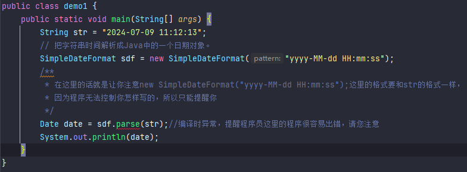
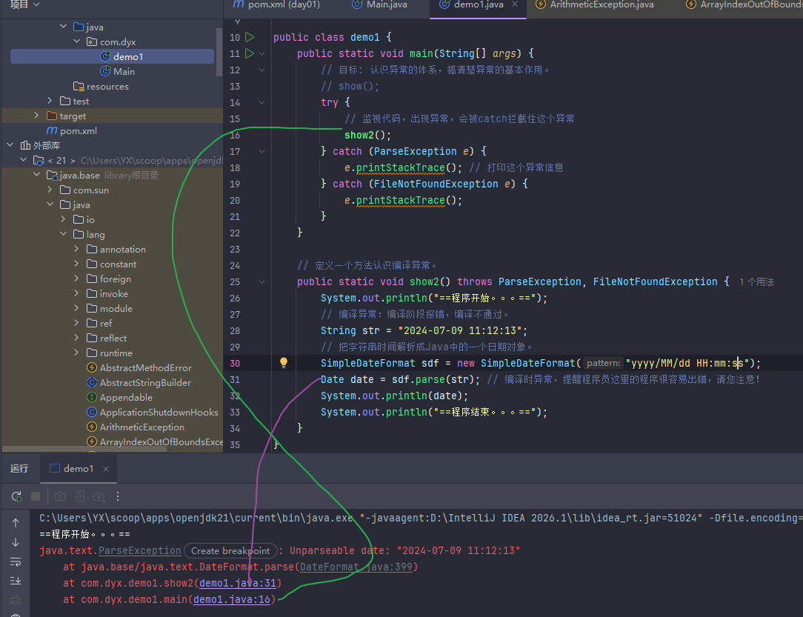
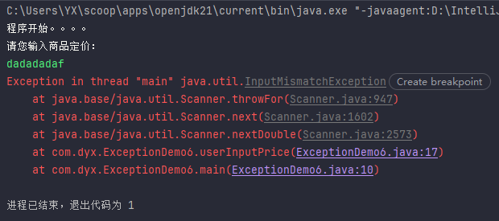

# Day01　异常 · 泛型 · 集合框架

> 本日主线：**异常体系 → 泛型机制 → Collection 与 List 集合**

```
异常  ──>  泛型  ──>  集合框架（Collection / List）  ──>  综合案例
```

---

## 一、异常（Exception）

### 1.1 什么是异常？

> **异常代表程序出现的问题。**

### 1.2 Java 的异常体系（重点）

```
java.lang.Throwable
   ├── Error                  ← 系统级错误（Sun 公司用，开发者无需关心）
   └── Exception              ← 程序员需要处理的异常
        ├── RuntimeException  ← 运行时异常（编译不报错）
        └── 其他 Exception     ← 编译时异常（编译就报错）
```

| 类型 | 代表 | 特点 |
| --- | --- | --- |
| **Error** | OOM、StackOverflowError | 系统问题，开发者不用管 |
| **运行时异常** | RuntimeException 及其子类 | **编译阶段不报错**，运行时才出现（如 `ArrayIndexOutOfBoundsException`） |
| **编译时异常** | 非 RuntimeException 的 Exception | **编译阶段就报错**（如日期解析异常） |


#### 1.2.1 运行时异常

~~~java
int[] arr = {10, 20, 30};
System.out.println(arr[3]);       // 数组索引越界
System.out.println(10 / 0);       // 算术异常
String str=null;
System.out.println(str);
System.out.println(str.length());//空指针异常
// 读取的文件不存在、网络断开...
~~~


#### 1.2.2 编译时异常

```java
package com.dyx;

import java.text.SimpleDateFormat;
import java.util.Date;

public class demo1 {
    public static void main(String[] args) {
        String str = "2024-07-09 11:12:13";
        // 把字符串时间解析成Java中的一个日期对象。
        SimpleDateFormat sdf = new SimpleDateFormat("yyyy-MM-dd HH:mm:ss");
        /**
         * 在这里的话就是让你注意new SimpleDateFormat("yyyy-MM-dd HH:mm:ss");这里的格式要和str的格式一样，
         * 因为程序无法控制你怎样写的，所以只能提醒你
         */
        Date date = sdf.parse(str);//编译时异常，提醒程序员这里的程序很容易出错，请您注意
        System.out.println(date);
    }
}
```

**这里有红色下划线，必须进行异常处理后代码才能通过**




### 1.3 异常的两种处理方式

#### 方式一：抛出异常 `throws`

**在方法上使用throws关键字，可以将方法内部出现的异常抛出去给调用者处理。**

```java
方法 throws 异常1, 异常2, 异常3 {
    ...
}
// 推荐方式
方法 throws Exception { ... }  // Exception 代表可以抛出一切异常
```

#### 方式二：捕获异常 `try...catch`

**直接捕获程序出现的异常。**

```java
try {
    // 监视可能出现异常的代码！
} catch (异常类型1 变量) {
    // 处理异常
} catch (异常类型2 变量) {
    // 处理异常
}

// 推荐方式
try {
    // 可能出现异常的代码
} catch (Exception e) {
    e.printStackTrace();  // 直接打印异常对象信息
}
```

**讲解：**调用show2()方法执行到sdf.parse(pdf)的时候遇到异常，然后把异常往上面抛，抛给了**调用处去处理**，也就是show2();然后再对show2()这行代码进行catch

~~~java
package com.dyx;

import java.io.FileInputStream;
import java.io.FileNotFoundException;
import java.io.InputStream;
import java.text.ParseException;
import java.text.SimpleDateFormat;
import java.util.Date;

public class demo1 {
    public static void main(String[] args) {
        // 目标: 认识异常的体系，搞清楚异常的基本作用。
        try {
            // 监视代码，出现异常，会被catch拦截住这个异常
            show2();
        } catch (ParseException e) {
            e.printStackTrace(); // 打印这个异常信息
        } catch (FileNotFoundException e) {
            e.printStackTrace();
        }
    }

    // 定义一个方法认识编译异常。
    public static void show2() throws ParseException, FileNotFoundException {
        System.out.println("==程序开始。。。==");
        // 编译异常：编译阶段报错，编译不通过。
        String str = "2024-07-09 11:12:13";
        // 把字符串时间解析成Java中的一个日期对象。
        SimpleDateFormat sdf = new SimpleDateFormat("yyyy/MM/dd HH:mm:ss");
        Date date = sdf.parse(str); // 编译时异常，提醒程序员这里的程序很容易出错，请您注意！
        System.out.println(date);
        System.out.println("==程序结束。。。==");
    }
}
~~~

**这是异常栈信息，先调用的报错在下方，因为方法运行是栈的顺序，即后进先出**



### 1.4 异常的作用

**异常的代表是谁？分为几类？**

- Exception，分为两类：编译时异常、运行时异常。
- 编译时异常：没有继承 RuntimeException 的异常，编译阶段就会出错。
- 运行时异常：继承自 RuntimeException 的异常或其子类，编译阶段不报错，运行时出现的。

| 作用 | 说明 |
| --- | --- |
| **作用 1** | **异常是定位程序 bug 的关键信息**（堆栈跟踪） |
| **作用 2** | 可以作为方法内部的一种特殊返回值，**以便通知上层调用者，方法的执行问题** |

~~~java
package com.dyx;

public class ExceptionDemo2 {
    public static void main(String[] args) {
        // 目标：搞清楚异常的作用
        System.out.println("程序开始执行...");
        try {
            System.out.println(div(10, 0));
            System.out.println("底层方法执行成功了~~");
        } catch (Exception e) {
            e.printStackTrace();
            System.out.println("底层方法执行失败了~~");
        }
        System.out.println("程序结束执行...");
    }

    // 需求：求2个数的除的结果，并返回这个结果。
    public static int div(int a, int b) throws Exception {
        if (b == 0) {
            System.out.println("除数不能为0，您的参数有问题！");
//            throw new RuntimeException("除数不能为0，您的参数有问题！");
            // 可以返回一个异常给上层调用者，返回的异常还能告知上层底层是执行成功了还是执行失败了！！
            throw new Exception("除数不能为0，您的参数有问题！");
        }
        int result = a / b;
        return result;
    }
}
~~~


### 1.5 自定义异常

> Java 无法为世界上全部的问题都提供异常类，**企业自身的问题需要通过自定义异常来管理**。

| 类型 | 父类 | 特点 |
| --- | --- | --- |
| **自定义运行时异常** | `RuntimeException` | 编译不报错，提醒不激进 |
| **自定义编译时异常** | `Exception` | 编译就报错，提醒比较激进 |

**步骤**：

1. 定义类继承 `RuntimeException` 或 `Exception`
2. 重写构造器
3. 通过 `throw new 异常类(xxx)` 创建异常对象并抛出。

~~~java
/**
 * 自定义的编译时异常
 * 1、继承Exception做爸爸。
 * 2、重写Exception的构造器。
 */
public class ItheimaAgeIllegalException extends Exception{
    public ItheimaAgeIllegalException() {
    }

    public ItheimaAgeIllegalException(String message) {
        super(message);
    }
}
~~~

~~~java
public class ExceptionDemo3 {
    public static void main(String[] args) {
        // 目标: 认识自定义异常。
        System.out.println("程序开始。。。。");
        try {
            saveAge(100);
            System.out.println("成功了!");
        } catch (ItheimaAgeIllegalException e) {
            e.printStackTrace();
            System.out.println("失败了! ");
        }
        System.out.println("程序结束。。。。");
    }

    // 需求：我们公司的系统只要收到了年龄小于1岁或者大于200岁就是一个年龄非法异常。
    public static void saveAge(int age) throws ItheimaAgeIllegalException {
        if(age < 1 || age > 200){
            // 年龄非法：抛出去一个异常返回。
            throw new ItheimaAgeIllegalException("年龄非法 age 不能低于1岁不能高于200岁");
        } else {
            System.out.println("年龄合法");
            System.out.println("保存年龄：" + age);
        }
    }
}
~~~


**注意：**

* 运行时异常可以不不处理，要处理也行，快捷键是CTRL+ALT+T


### 1.6 异常处理的常见方案（开发实战）

**异常的处理方案：**

* **方案 1**
  * 底层异常层层往上抛出，最外层捕获异常，记录下异常信息，并响应适合用户观看的信息进行提示

* **方案 2**
  * 最外层捕获异常后，尝试重新修复


**注意：**因为这里要求输入数字，如果输入些乱七八糟的，比如说adadq，又因为这里没用拦截错误，所以会直接报错

~~~java
package com.dyx;

import java.util.Scanner;

public class ExceptionDemo6 {
    public static void main(String[] args) {
        // 目标：掌握异常的处理方案2：捕获异常对象，尝试重新修复。
        // 接收用户的一个定价
        System.out.println("程序开始。。。。");
        double price = userInputPrice();
        System.out.println("用户成功设置了商品定价：" + price);
    }

    public static double userInputPrice(){
        Scanner sc = new Scanner(System.in);
        System.out.println("请您输入商品定价：");
        double price = sc.nextDouble();
        return price;
    }
}
~~~

**尝试重新修复方案：**

~~~java
package com.dyx;

import java.util.Scanner;

public class ExceptionDemo6 {
    public static void main(String[] args) {
        // 目标：掌握异常的处理方案2：捕获异常对象，尝试重新修复。
        // 接收用户的一个定价
        System.out.println("程序开始。。。。");
        double price = 0;
        while(true){
            try {
                price = userInputPrice();
                System.out.println("用户成功设置了商品定价："+price);
                break;
            } catch (Exception e) {
                System.out.println("您输入的数据是瞎搞的，请不要瞎输入价格！");
            }
        }
        System.out.println("用户成功设置了商品定价：" + price);
    }

    public static double userInputPrice(){
        Scanner sc = new Scanner(System.in);
        System.out.println("请您输入商品定价：");
        double price = sc.nextDouble();
        return price;
    }
}
~~~


---

## 二、泛型（Generic）

### 2.1 什么是泛型？

**什么是泛型？**

* 定义类、接口、方法时，**同时声明一个或多个类型变量（如 `<E>`）**，称为泛型类、泛型接口、泛型方法，统称为泛型。

  ~~~java
  public class ArrayList<E> { ... }
  
  //例子
  ArrayList<String> list = new ArrayList<String>();
  ~~~


### 2.2 泛型的作用与本质（重点）

**作用：**

* 泛型提供了在编译阶段约束所能操作的数据类型，并自动进行检查的能力！

  这样可以避免强制类型转换，及其可能出现的异常。

**好处**：

* **避免强制类型转换**及可能出现的 `ClassCastException`；

**泛型的本质：**

* 把具体的数据类型作为参数传给类型变量

### 2.3 泛型类、泛型接口、泛型方法

```java
// 泛型类
修饰符 class 类名<类型变量, 类型变量, ...> { }
public class ArrayList<E> { ... }

// 泛型接口
修饰符 interface 接口名<类型变量, ...> { }
public interface A<E> { ... }

// 泛型方法
修饰符 <类型变量> 返回值类型 方法名(形参列表) { ... }
public static <T> void test(T t) { }
```

> **类型变量命名约定**：建议使用大写英文字母，常用：**E、T、K、V**。


泛型类：

~~~java
public class GenericDemo2 {
    public static void main(String[] args) {
        // 目标：学会自定义泛型类。
        // 需求：请您模拟ArrayList集合自定义一个集合MyArrayList.
        // MyArrayList<String> list = new MyArrayList<String>();
        MyArrayList<String> mlist = new MyArrayList<>(); // JDK 7开始支持的后面类型可以不写
        mlist.add("hello");
        mlist.add("world");
        // list.add(555); // 报错
        mlist.add("java");
        mlist.add("前端");

        System.out.println(mlist.remove("world"));

        System.out.println(mlist);
    }
}


// 自定义泛型类
public class MyArrayList<E> {
    private ArrayList list = new ArrayList();

    public boolean add(E e) {
        list.add(e);
        return true;
    }

    public boolean remove(E e) {
        return list.remove(e);
    }

    @Override
    public String toString() {
        return list.toString();
    }
}
~~~

泛型接口：

~~~java
// 自定义泛型接口
public interface Data<T> {
    void add(T t);
    void add(T t);
}
~~~

泛型方法:

~~~java
public class GenericDemo4 {
    public static void main(String[] args) {
        // 目标：学会定义泛型方法，搞清楚作用。
        // 需求：打印任意数组的内容。
        String[] names = {"赵敏", "张无忌", "周芷若", "小昭"};
        printArray(names);

        Student[] stus = new Student[3];
        printArray(stus);

        Student max = getMax(stus);
        String max2 = getMax(names);
    }

    public static <T> void printArray(T[] names) {

    }

    public static <T> T getMax(T[] names) {
        return null;
    }
}
~~~


### 2.4 通配符与上下限（重点）

| 通配符 | 说明 |
| --- | --- |
| `?` | 在「**使用泛型**」时代表一切类型;E、T 、K、 V 是在定义泛型的时候使用。 |
| `? extends Car` | **泛型上限**：必须是 Car 或 Car 的子类 |
| `? super Car` | **泛型下限**：必须是 Car 或 Car 的父类 |

> ⚠️ 区别：`E / T / K / V` 是**定义**泛型时使用，`?` 是**使用**泛型时使用。

~~~java
package com.dyx;
import java.util.ArrayList;

public class GenericDemo5 {
    public static void main(String[] args) {
        // 目标：理解通配符和上下限。
        ArrayList<Xiaomi> xiaomis = new ArrayList<>();
        xiaomis.add(new Xiaomi());
        xiaomis.add(new Xiaomi());
        xiaomis.add(new Xiaomi());
        go(xiaomis);

        ArrayList<BYD> byds = new ArrayList<>();
        byds.add(new BYD());
        byds.add(new BYD());
        byds.add(new BYD());
        go(byds);

//        ArrayList<Dog> dogs = new ArrayList<>();
//        dogs.add(new Dog());
//        dogs.add(new Dog());
//        dogs.add(new Dog());
//        go(dogs);
    }

    // 需求：开发一个极品飞车的游戏。
    // 虽然Xiaomi和BYD是Car的子类，但是 ArrayList<Xiaomi>、ArrayList<BYD> 和 ArrayList<Car> 是没有半毛钱关系！
    public static void go(ArrayList<? extends Car> cars) {

    }
}

// 配套的类定义（示例）
class Car {}
class Xiaomi extends Car {}
class BYD extends Car {}
class Dog {}
~~~


### 2.5 泛型支持的类型

> ❗ **泛型和集合都不支持基本数据类型，只支持引用数据类型（对象类型）**

**注意：**

* **泛型和集合**都不支持基本数据类型，只支持引用数据类型（对象类型）

| 基本类型 | 包装类 |
| --- | --- |
| byte | Byte |
| short | Short |
| **int** | **Integer** |
| long | Long |
| **char** | **Character** |
| float | Float |
| double | Double |
| boolean | Boolean |

#### 包装类（重点）

- 把基本类型「包装成对象」的类型；
- **自动装箱**：基本类型 → 包装类；
- **自动拆箱**：包装类 → 基本类型。


**包装类具备的其他功能**

* 可以把基本类型的数据转换成字符串类型

  ~~~java
  public static String toString(double d)
  public String toString()
  ~~~

  

* **可以把字符串类型的数值转换成数值本身对应的真实数据类型**

  ~~~java
  public static int parseInt(String s)
  public static Integer valueOf(String s)
  ~~~

~~~java
package com.dyx;

import java.util.ArrayList;

public class GenericDemo6 {
    public static void main(String[] args) {
        // 目标：搞清楚泛型和集合不支持基本数据类型，只能支持对象类型（引用数据类型）。
        // ArrayList<int> list = new ArrayList<>();

        // 泛型擦除：泛型工作在编译阶段，等编译后泛型就没用了，所以泛型在编译后都会被擦除，所有类型会恢复成Object类型

        // 把基本数据类型变成包装类对象。
        // 手工包装：
        // Integer i = new Integer(100); // 过时
        Integer it1 = Integer.valueOf(100); // 推荐的
        Integer it2 = Integer.valueOf(100); // 推荐的
        System.out.println(it1 == it2);//true

        // 自动装箱成对象：基本数据类型的数据可以直接变成包装对象的数据，不需要额外做任何事情
        Integer it11 = 130; //就等于 Integer it1 = Integer.valueOf(100);
        Integer it22 = 130;
      	/**
      	因为Integer.valueOf对-128~127的数据会缓存下来，意思就是如果在-128~127内的话
      	那么大家拿的都是同一个对象，不会去new一个新对象
      	*/
        System.out.println(it11 == it22);//false

        // 自动拆箱：把包装类型的对象直接给基本类型的数据
        int i = it11;
        System.out.println(i);


        ArrayList<Integer> list = new ArrayList<>();
        list.add(130); // 自动装箱，不是直接把130放进去，而是把130封装成130这个对象，然后放进去
        list.add(120); // 自动装箱
        int rs = list.get(1); // 自动拆箱

        System.out.println("--------------------------------");

        // 包装类新增的功能:
        // 1、把基本类型的数据转换成字符串。
        int j = 23;
        String rs1 = Integer.toString(j);   // "23"
        System.out.println(rs1 + 1); // 231

        Integer i2 = j;
        String rs2 = i2.toString(); // "23"
        System.out.println(rs2 + 1); // 231

        String rs3 = j + "";
        System.out.println(rs3 + 1); // 231

        System.out.println("------------------------------------------------");

        // 2、把字符串数值转换成对应的基本数据类型（很有用）。
        String str = "98";
        // int i1 = Integer.parseInt(str);
        int i1 = Integer.valueOf(str);
        System.out.println(i1 + 2);

        String str2 = "98.8";
        // double d = Double.parseDouble(str2);
        double d = Double.valueOf(str2);
        System.out.println(d + 2);
    }
}
~~~


---

## 三、集合框架（Collection Framework）

### 3.1 认识集合

> **集合是一种容器，用来装数据的，类似于数组，但集合的大小可变**，开发中非常常用。

### 3.2 集合体系结构（核心图）

```
Collection（单列集合）           Map（双列集合）
   ├── List                        ├── HashMap
   │    ├── ArrayList              ├── LinkedHashMap
   │    └── LinkedList             └── TreeMap
   └── Set
        ├── HashSet
        │    └── LinkedHashSet
        └── TreeSet
```

| 集合类型 | 元素结构 |
| --- | --- |
| **Collection（单列）** | 每个元素（数据）只包含一个值 |
| **Map（双列）** | 每个元素包含两个值「键值对」（key=value） |

### 3.3 Collection 系列的特点（重点对比表）

**Collection 集合有哪两大常用的集合体系，各自有啥特点？**

- List 系列集合：添加的元素是有序、可重复、有索引。
- Set 系列集合：添加的元素是无序、不重复、无索引。

| 子接口 | 实现类 | 有序 | 重复 | 索引 | 备注 |
| --- | --- | --- | --- | --- | --- |
| **List** | ArrayList、LinkedList | ✅ 有序 | ✅ 可重复 | ✅ 有索引 | 添加顺序与取出顺序一致 |
| **Set** | HashSet | ❌ 无序 | ❌ 不重复 | ❌ 无索引 | |
| **Set** | LinkedHashSet | ✅ 有序 | ❌ 不重复 | ❌ 无索引 | |
| **Set** | TreeSet | 🔄 排序 | ❌ 不重复 | ❌ 无索引 | 按照大小默认升序排序 |

~~~java
package com.dyx;

import java.util.ArrayList;
import java.util.HashSet;
import java.util.List;
import java.util.Set;

public class CollectionDemo1 {
    public static void main(String[] args) {
        // 目标：搞清楚Collection集合的整体特点。
        // 1、List家族的集合：有序、可重复、有索引。
        List<String> list = new ArrayList<>();
        list.add("Java");
        list.add("Java");
        list.add("C");
        list.add("C++");
        System.out.println(list); // [Java, Java, C, C++] 顺序和添加顺序一致
        String rs = list.get(0);
        System.out.println(rs);

// 2、Set家族的集合：无序、不可重复、无索引。
        Set<String> set = new HashSet<>();
        set.add("鸿蒙");
        set.add("Java");
        set.add("C");
        set.add("C++");
        System.out.println(set);//[Java, C++, C, 鸿蒙]
    }
}
~~~


---

## 四、Collection 接口的常用功能

> **为什么先学 Collection？**——Collection 是**单列集合的祖宗**，它规定的方法（功能）是全部单列集合都会继承的。

### 4.1 常用方法

| 方法 | 说明 |
| --- | --- |
| `boolean add(E e)` | 添加元素到集合 |
| `void clear()` | 清空集合 |
| `boolean remove(E e)` | 删除指定元素 |
| `boolean contains(Object obj)` | 是否包含指定对象 |
| `boolean isEmpty()` | 是否为空 |
| `int size()` | 返回元素个数 |
| `Object[] toArray()` | 集合 → 数组 |

~~~java
package com.dyx;

import java.util.ArrayList;
import java.util.Arrays;
import java.util.Collection;

public class CollectionDemo2 {
    public static void main(String[] args) {
        // 目标：搞清楚Collection提供的通用集合功能。
        Collection<String> list = new ArrayList<>();

        // 添加元素
        list.add("张三");
        list.add("李四");
        list.add("王五");
        System.out.println(list); // [张三, 李四, 王五]

        // 获取集合的元素个数
        System.out.println(list.size());//3

        // 删除集合元素
        list.remove("李四");
        System.out.println(list);//[张三, 王五]

        // 判断集合是否为空
        System.out.println(list.isEmpty());//false

        // 清空集合
        // list.clear();
        // System.out.println(list);

        // 判断集合中是否存在某个数据
        System.out.println(list.contains("张三"));

        // 把集合转换成数组
        Object[] arr = list.toArray();
        System.out.println(Arrays.toString(arr));
     	  // 把集合转换成字符串数组(拓展)
				String[] arr2 = list.toArray(String[]::new);
    }
}
~~~


### 4.2 三种遍历方式（重点）

#### ① 迭代器遍历（专用方式）

> **迭代器是遍历集合的专用方式（数组没有迭代器）**，在Java中迭代器的代表是** `Iterator`**。

**Collection集合获取迭代器的方法：**

| 方法名称                 | 说明                                                         |
| ------------------------ | ------------------------------------------------------------ |
| `Iterator<E> iterator()` | 返回集合中的迭代器对象，该迭代器对象默认指向当前集合的第一个元素,**也就是默认指向当前集合的索引0** |

**Iterator迭代器中的常用方法：**

| 方法名称            | 说明                                                         |
| ------------------- | ------------------------------------------------------------ |
| `boolean hasNext()` | 询问当前位置是否有元素存在，存在返回 true，不存在返回 false  |
| `E next()`          | 获取当前位置的元素，并同时使迭代器对象指向下一个元素处。**（意思就是先取数，取完后马上移位）** |

> ⚠️ **越界异常**：取元素越界会抛出 `NoSuchElementException`。

~~~java
package com.dyx;

import java.util.ArrayList;
import java.util.Collection;
import java.util.Iterator;

public class CollectionTraversalDemo3 {
    public static void main(String[] args) {
        // 目标：掌握Collection的遍历方式一：迭代器遍历
        Collection<String> names = new ArrayList<>();
        names.add("张无忌");
        names.add("玄冥二老");
        names.add("宋青书");
        names.add("殷素素");
        System.out.println(names); // [张无忌, 玄冥二老, 宋青书, 殷素素]
        //                              it
        //需要注意的是迭代器it，一开始在0的位置，然后每次next()就往后移一个位置

        // 1、得到这个集合的迭代器对象
        Iterator<String> it = names.iterator();
//        System.out.println(it.next());//张无忌
//        System.out.println(it.next());//玄冥二老
//        System.out.println(it.next());//宋青书
//        System.out.println(it.next());//殷素素
//        System.out.println(it.next());//报错NoSuchElementException

        //hasNext()就是问当前有没有数据，并不是下一个，有的话就返回一个true
        // 2、使用一个while循环来遍历
        while (it.hasNext()) {
            String name = it.next();
            System.out.println(name);
        }
    }
}
~~~


#### ② 增强 for 循环（语法糖）

```java
for (元素的数据类型 变量名 : 数组或集合) {
    ...
}

=======================================
Collection<String> c = new ArrayList<>();
 ...
for(String s : c) {
  System.out.println(s);
}
```

* 增强 for 可以用来遍历集合或者数组。
* 增强 for 遍历集合，本质就是迭代器遍历集合的简化写法。

~~~java
public class CollectionTraversalDemo4 {
    public static void main(String[] args) {
        // 目标：掌握Collection的遍历方式三：增强for
        Collection<String> names = new ArrayList<>();
        names.add("张无忌");
        names.add("玄冥二老");
        names.add("宋青书");
        names.add("殷素素");

        for (String name : names) {
            System.out.println(name);
        }

        String[] users = {"张无忌", "玄冥二老", "宋青书", "殷素素"};

        for (String user : users) {
            System.out.println(user);
        }
    }
}
~~~


#### ③ Lambda 表达式（JDK 8+）

* 得益于 JDK8 开始的新技术 Lambda 表达式，提供了一种更简单、更直接的方式来遍历集合。

| 方法名称                                           | 说明                 |
| -------------------------------------------------- | -------------------- |
| `default void forEach(Consumer<? super T> action)` | 结合 lambda 遍历集合 |

~~~java
package com.dyx;

import java.util.ArrayList;
import java.util.Collection;
import java.util.function.Consumer;

public class CollectionTraversalDemo5 {
    public static void main(String[] args) {
        // 目标：掌握Collection的遍历方式三：lambda
        Collection<String> names = new ArrayList<>();
        names.add("张无忌");
        names.add("玄冥二老");
        names.add("宋青书");
        names.add("殷素素");

        /**
         * forEach方法需要我们提供一个Customer对象，但通过源码可以看到Customer是一个接口，
         * 但因为接口不能直接有对象，所以我们可以给它一个匿名内部类对象，
         * 然后这里的泛型为什么用String，是因为Collection<String> names = new ArrayList<>();
         * 这个T一开始定义的时候写的就是String，? super T的意思就是T或者T的父类
         */
//        names.forEach(new Consumer<String>() {
//            @Override
//            public void accept(String s) {
//                System.out.println(s);
//            }
//        });
//        names.forEach(s -> System.out.println(s));
        names.forEach(System.out::println);
    }
}
~~~


### 4.3 并发修改异常（坑点 ⚠️）

> **遍历集合的同时又存在增删集合元素的行为时可能出现业务异常，这种现象被称之为并发修改异常，**
>
> **可能抛出 `ConcurrentModificationException`。**

  **解决方案**：

| 遍历方式 | 是否能边遍历边删除 |
| --- | --- |
| 普通 for 循环（前提是支持索引）+ `i--` | ✅ 可以 |
| 倒序 for 循环(前提是支持索引) | ✅ 可以 |
| 迭代器的 `remove()` 方法 | ✅ 可以（推荐） |
| 增强 for 循环 | ❌ 不可以 |
| Lambda forEach | ❌ 不可以 |

> ⚠️ **增强 for 和 Lambda 只适合纯遍历，不适合同时增删元素。**

**注意：**

* **for循环导致Collection越界**后循环会直接结束，不会报错

**需求：**

- 现在假如购物车中存储了如下这些商品：Java 入门，宁夏枸杞，黑枸杞，人字拖，特级枸杞，枸杞子。现在用户不想买枸杞了，选择了批量删除。

**分析：**

① 后台使用 ArrayList 集合表示购物车，存储这些商品名。

② 遍历集合中的每个数据，只要这个数据包含了 “枸杞” 则删除它。

③ 输出集合看是否已经成功删除了全部枸杞数据了。

~~~java
package com.dyx;

import java.util.ArrayList;
import java.util.Iterator;

public class CollectionTraversalTest6 {
    public static void main(String[] args) {
        // 目标：认识并发修改异常问题，搞清楚每种遍历的区别
        /**
         ArrayList<String> list = new ArrayList<>();
         list.add("Java入门");
         list.add("宁夏枸杞");
         list.add("黑枸杞");
         list.add("人字拖");
         list.add("特级枸杞");
         list.add("枸杞子");
         list.add("西洋参");

         // 需求1：删除全部枸杞
         for (int i = 0; i < list.size(); i++) {
         String name = list.get(i);
         if(name.contains("枸杞")){
         list.remove(name);
         }
         }
         System.out.println(list);//[Java入门, 黑枸杞, 人字拖, 枸杞子, 西洋参]，出现并发修改异常，没有删干净
         */

        //解决方案1：普通 for 循环（带索引）+ i--
        /**
         ArrayList<String> list2 = new ArrayList<>();
         list2.add("Java入门");
         list2.add("宁夏枸杞");
         list2.add("黑枸杞");
         list2.add("人字拖");
         list2.add("特级枸杞");
         list2.add("枸杞子");
         list2.add("西洋参");

         // 需求1：删除全部枸杞
         for (int i = 0; i < list2.size(); i++) {
         String name = list2.get(i);
         if(name.contains("枸杞")){
         list2.remove(name);
         i--;//解决方案1：删除数据后做一步i--操作
         }
         }
         System.out.println(list2);//[Java入门, 人字拖, 西洋参]
         */

        //解决方案2:倒着遍历并删除(前提是支持索引)
        /**
        ArrayList<String> list3 = new ArrayList<>();
        list3.add("Java入门");
        list3.add("宁夏枸杞");
        list3.add("黑枸杞");
        list3.add("人字拖");
        list3.add("特级枸杞");
        list3.add("枸杞子");
        list3.add("西洋参");

        // 需求1：删除全部枸杞
        for (int i = list3.size() - 1; i >= 0; i--) {
            String name = list3.get(i);
            if (name.contains("枸杞")) {
                list3.remove(name);
            }
        }
        System.out.println(list3);//[Java入门, 人字拖, 西洋参]
         */

        //解决方案3：迭代器的remove()方法
        ArrayList<String> list4 = new ArrayList<>();
        list4.add("Java入门");
        list4.add("宁夏枸杞");
        list4.add("黑枸杞");
        list4.add("人字拖");
        list4.add("特级枸杞");
        list4.add("枸杞子");
        list4.add("西洋参");
        Iterator<String> it = list4.iterator();
        while(it.hasNext())
        {
            String name = it.next();
            if(name.contains("枸杞"))
            {
//                list4.remove(name);//这样写会报错ConcurrentModificationException
            it.remove();
            }
        }
        System.out.println(list4);//[Java入门, 人字拖, 西洋参]
    }
}
~~~


---

## 五、List 集合

### 5.1 List 系列特点

**特点：**

* **有序、可重复、有索引**
* **List 集合因为支持索引，所以多了很多与索引相关的方法，当然，Collection 的功能也全部继承了。**


### 5.2 List 独有方法（基于索引）

| 方法 | 说明 |
| --- | --- |
| `void add(int index, E element)` | 在指定位置插入元素 |
| `E remove(int index)` | 删除指定索引处元素，返回被删元素 |
| `E set(int index, E element)` | 修改指定索引处元素，返回原元素 |
| `E get(int index)` | 返回指定索引处元素 |

### 5.3 List 集合的四种遍历方式

1. ✅ 普通 for 循环（因为有索引）
2. ✅ 迭代器
3. ✅ 增强 for 循环
4. ✅ Lambda 表达式

~~~java
package com.dyx;

import java.util.ArrayList;
import java.util.Iterator;
import java.util.List;

public class ListDemo1 {
    public static void main(String[] args) {
        // 目标：掌握List系列集合独有的功能。
        List<String> names = new ArrayList<>(); // 一行经典代码

        // 添加数据
        names.add("张三");
        names.add("李四");
        names.add("王五");
        names.add("赵六");
        System.out.println(names);//[张三, 李四, 王五, 赵六]

        // 给第三个位置插入一个数据：赵敏
        names.add(2, "赵敏");
        System.out.println(names);

        // 删除李四
        System.out.println(names.remove(1)); // 根据下标删除，返回删除的数据
        System.out.println(names);

        // 把王五修改成：金毛
        System.out.println(names.set(2, "金毛")); // 根据下标修改，返回修改前的数据
        System.out.println(names);

        // 获取张三
        System.out.println(names.get(0));

        System.out.println("----------------四种遍历演示--------------");
        // 1、for循环
        for (int i = 0; i < names.size(); i++) {
            System.out.println(names.get(i));
        }

        // 2、迭代器
        Iterator<String> it = names.iterator();
        while (it.hasNext()) {
            String name = it.next();
            System.out.println(name);
        }

        // 3、增强for
        for (String name : names) {
            System.out.println(name);
        }

        // 4、lambda表达式
        names.forEach(System.out::println);
    }
}
~~~


---

## 六、ArrayList vs LinkedList（底层原理对比）

- `ArrayList`：底层 **数组**
- `LinkedList`：底层 **双链表**

### 6.1 ArrayList 底层 —— 数组

```
索引: 0   1   2   3   4   5   6
     [A] [B] [C] [D] [E] [F] [G]
```

| 特性 | 说明 |
| --- | --- |
| **查询（快）** | ⚡ **（注意：是根据索引查询数据快）：**查询数据通过地址值和索引定位，查询任意数据耗时相同。 |
| **增删（慢）** | 🐢 可能需要把后面元素整体前移/后移 |

### 6.2 LinkedList 底层 —— 双链表

```
[A | ⇆] ⇄ [B | ⇆] ⇄ [C | ⇆] ⇄ [D | ⇆]
头节点      ...                   尾节点
```

- 链表中的数据是一个一个独立的结点组成的，结点在内存中是不连续的，每个结点包含数据值和下一个结点的地址。
  - 数据由一个个**独立结点**组成，内存中**不连续**；
  - 每个结点包含：**前一个结点地址 + 数据值 + 下一个结点地址**。


| 特性 | 说明 |
| --- | --- |
| **查询(慢)** | 🐢 无论查哪个数据都要从头/尾开始找 |
| **增删(相对快)** | ⚡ 只改变前后结点的地址指向 |
| **首尾操作(极快)** | ⚡⚡ |

### 6.3 LinkedList 新增的首尾方法

| 方法 | 说明 |
| --- | --- |
| public`void addFirst(E e)` | 头部插入元素 |
| `public void addLast(E e)` | 尾部追加元素 |
| `public E getFirst()` | 返回首元素 |
| `public E getLast()` | 返回尾元素 |
| `public E removeFirst()` | 删除并返回首元素 |
| `public E removeLast()` | 删除并返回尾元素 |

### 6.4 LinkedList 应用场景

#### ① 设计队列（先进先出 FIFO）

```
入队 →  [A][B][C][D]  → 出队
```

```java
LinkedList<String> queue = new LinkedList<>();
queue.addLast("数据");      // 入队
queue.removeFirst();        // 出队
```

#### ② 设计栈（后进先出 LIFO）

```
栈顶  ⇅ push / pop
[D]
[C]
[B]
[A]
栈底
```

```java
LinkedList<String> stack = new LinkedList<>();
stack.addFirst("数据");     // 压栈 push
stack.removeFirst();        // 出栈 pop
```

---

## 七、本日重点小结

| 知识点 | 关键记忆 |
| --- | --- |
| **异常分类** | 编译时异常（编译报错） vs 运行时异常（运行时才报） |
| **异常处理** | 底层抛出，最外层捕获 |
| **泛型本质** | 把数据类型作为参数传给类型变量 |
| **泛型限制** | 只支持引用类型，不支持基本类型 |
| **Collection 三大遍历** | 迭代器 / 增强 for / Lambda |
| **并发修改异常** | 增强 for 和 Lambda **不能**边遍历边删除 |
| **ArrayList vs LinkedList** | 数组（查询快） vs 链表（增删快、首尾极快） |

---

## 八、综合案例：电影信息管理模块

**需求**：开发电影信息管理模块，可以上架、查询、下架电影，下架某主演参演的全部电影。

**分析**：

| 设计要点 | 说明 |
| --- | --- |
| **电影类** | 每部电影是一个对象 |
| **操作类** | 专门处理电影数据业务 |
| **存储结构** | 操作类中用 `ArrayList<Movie>` 存放全部电影 |
