# Redis篇

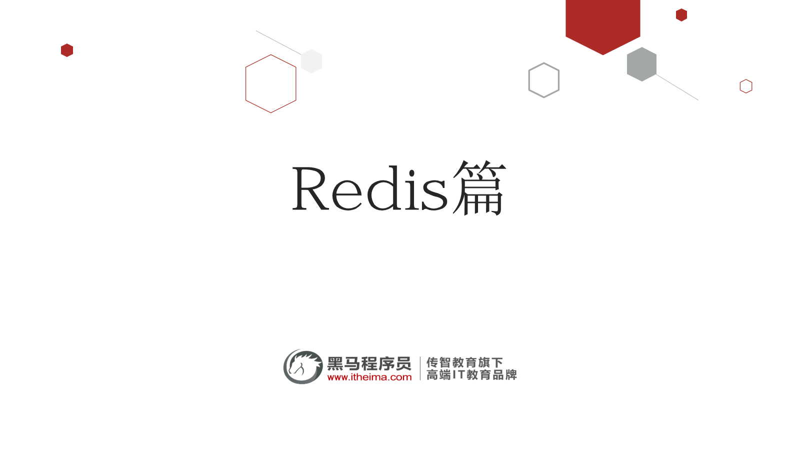

## 缓存

<!-- 源 PPTX 第 2 页 -->

穿透、击穿、雪崩

双写一致、持久化

数据过期、淘汰策略

分布式锁

setnx、redisson

计数器

使用场景

保存token

消息队列

数据类型

延迟队列

集群

主从

哨兵

其他面试题

事务

Redis为什么快

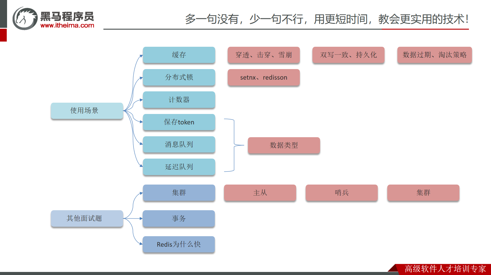

## 使用场景

<!-- 源 PPTX 第 3 页 -->

**其他面试题**

- Redis的数据持久化策略有哪些
- 什么是缓存穿透，怎么解决
- 什么是布隆过滤器
- 什么是缓存击穿，怎么解决
- 什么是缓存雪崩，怎么解决
- redis双写问题
- Redis分布式锁如何实现
- Redis实现分布式锁如何合理的控制锁的有效时长
- Redis的数据过期策略有哪些
- Redis的数据淘汰策略有哪些

- Redis集群有哪些方案, 知道嘛
- 什么是 Redis 主从同步
- 你们使用Redis是单点还是集群 ? 哪种集群
- Redis分片集群中数据是怎么存储和读取的
- redis集群脑裂
- 怎么保证redis的高并发高可用
- 你们用过Redis的事务吗 ? 事务的命令有哪些
- Redis是单线程的，但是为什么还那么快？

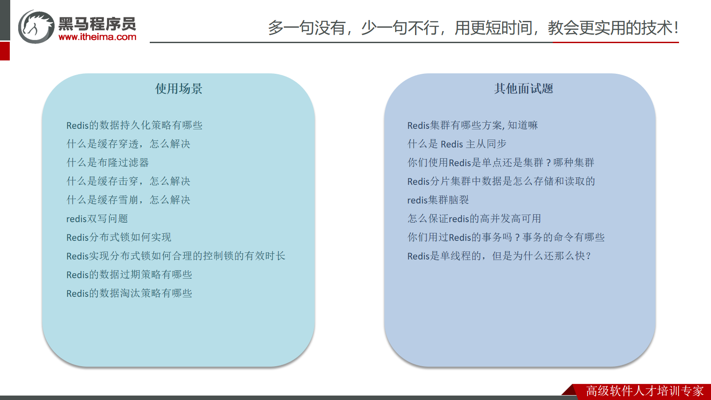

## Redis-使用场景

<!-- 源 PPTX 第 4 页 -->

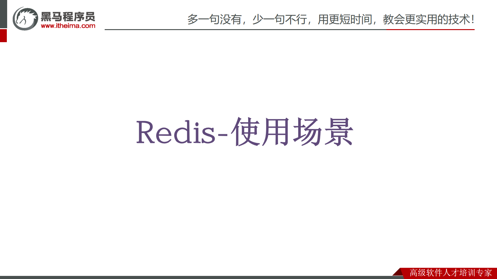

## 我看你做的项目中，都用到了redis，你在最近的项目中哪些场景使用了redis呢？

<!-- 源 PPTX 第 5 页 -->

**结合项目**

- 一是验证你的项目场景的真实性，二是为了作为深入发问的切入点
- 缓存
- 分布式锁
- 消息队列、延迟队列
- … …

**缓存三兄弟（穿透、击穿、雪崩）、双写一致、持久化、数据过期策略，数据淘汰策略**

**setnx、redisson**

**何种数据类型**

如果发生了缓存穿透、击穿、雪崩，该如何解决？

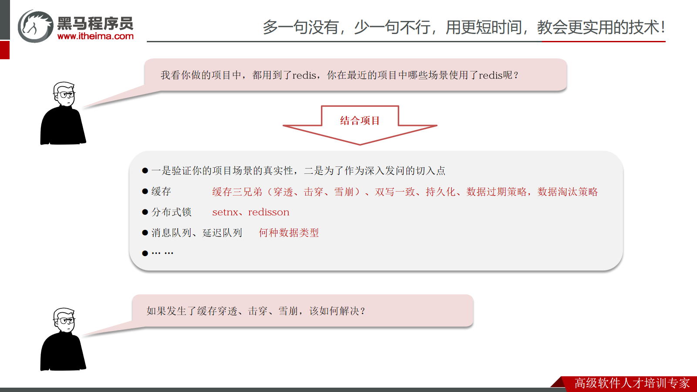

## 缓存穿透

<!-- 源 PPTX 第 6 页 -->

- 例：
- 一个get请求：api/news/getById/**1**

根据id查询文章

查redis

redis查不到，查DB

DB

命中，返回结果

DB查询到结果，返回(返回之前数据存储到redis)

**缓存穿透**：查询一个**不存在**的数据，mysql查询不到数据也不会直接写入缓存，就会导致每次请求都查数据库

**解决方案一**：缓存空数据，查询返回的数据为空，仍把这个空结果进行缓存

```text
{key:1,value:null}
```

- **优点：**简单
- **缺点：**消耗内存，可能会发生不一致的问题

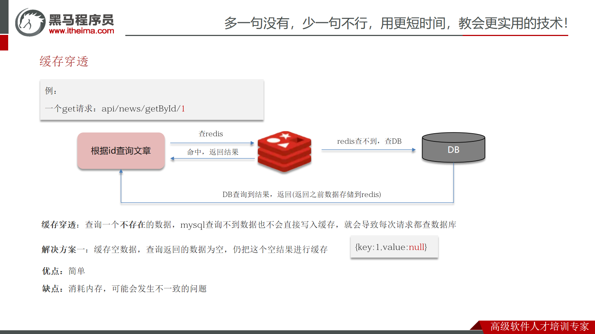

## 缓存穿透

<!-- 源 PPTX 第 7 页 -->

- 例：
- 一个get请求：api/news/getById/**1**

布隆过滤器

**缓存预热时，预热布隆过滤器**

根据id查询文章

查询布隆过滤器

布隆过滤中存在，查redis

redis查不到，查DB

DB

不存在，直接返回

命中，返回结果

DB查询到结果，返回(返回之前数据存储到redis)

**解决方案二**：布隆过滤器

- **优点：**内存占用较少，没有多余key
- **缺点：**实现复杂，存在误判


## 布隆过滤器

<!-- 源 PPTX 第 8 页 -->

**bitmap（位图）：**相当于是一个以**（bit）位**为单位的数组，数组中每个单元只能存储二进制数**0或1**

**布隆过滤器作用：**布隆过滤器可以用于检索一个元素是否在一个集合中。

| 0 | 0 | 0 | 0 | 0 | 0 | 0 | 1 | 0 | 0 | 1 | 0 | 0 | 1 | 0 | 0 |
| --- | --- | --- | --- | --- | --- | --- | --- | --- | --- | --- | --- | --- | --- | --- | --- |

0       1        2        3        4       5        6        7        8       9       10     11      12      13      14      15

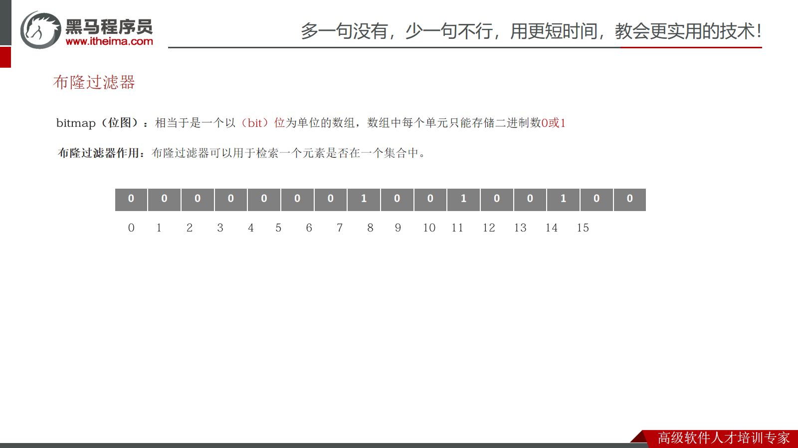

## 布隆过滤器

<!-- 源 PPTX 第 9 页 -->

**bitmap（位图）：**相当于是一个以**（bit）位**为单位的数组，数组中每个单元只能存储二进制数**0或1**

**布隆过滤器作用：**布隆过滤器可以用于检索一个元素是否在一个集合中。

id1

- 存储数据：id为1的数据，通过多个hash函数获取hash值，根据hash计算数组对应位置**改为1**
- 查询数据：使用相同hash函数获取hash值，判断对应位置是否都为1

hash1(1)=1

hash2(1)=3

hash3(1)=7

| 0 | 1 | 0 | 1 | 0 | 0 | 0 | 1 | 0 | 0 | 0 | 0 | 0 | 0 | 0 | 0 |
| --- | --- | --- | --- | --- | --- | --- | --- | --- | --- | --- | --- | --- | --- | --- | --- |

0       1        2        3        4       5        6        7        8       9       10     11      12      13      14      15

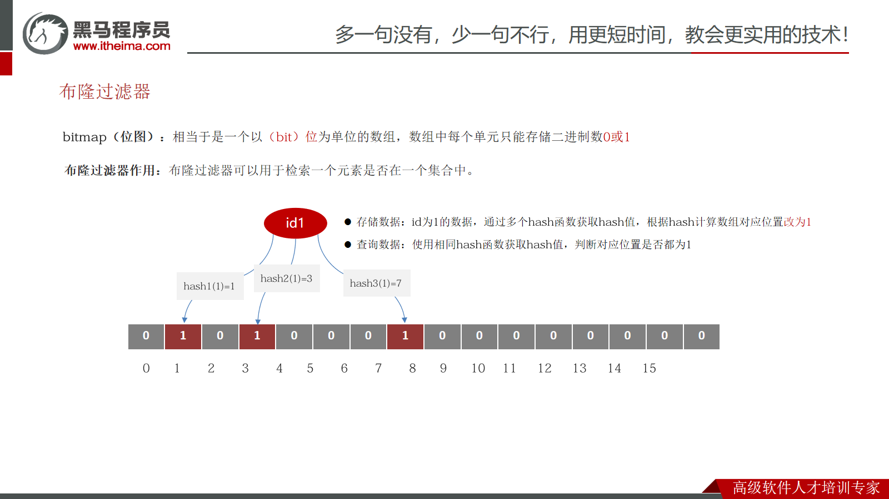

## 布隆过滤器

<!-- 源 PPTX 第 10 页 -->

id1

id2

hash2(1)=3

hash3(1)=7

hash2(2)=12

hash1(1)=1

hash1(2)=9

hash3(2)=14

| 0 | 1 | 0 | 1 | 0 | 0 | 0 | 1 | 0 | 1 | 0 | 0 | 1 | 0 | 1 | 0 |
| --- | --- | --- | --- | --- | --- | --- | --- | --- | --- | --- | --- | --- | --- | --- | --- |

0       1        2        3        4       5        6        7        8       9       10     11      12      13      14      15

Redisson

布隆过滤器实现方案

Guava

**id3**

**id为3的数据不存在**

**误判率**：数组越小误判率就越大，数组越大误判率就越小，但是同时带来了更多的内存消耗。

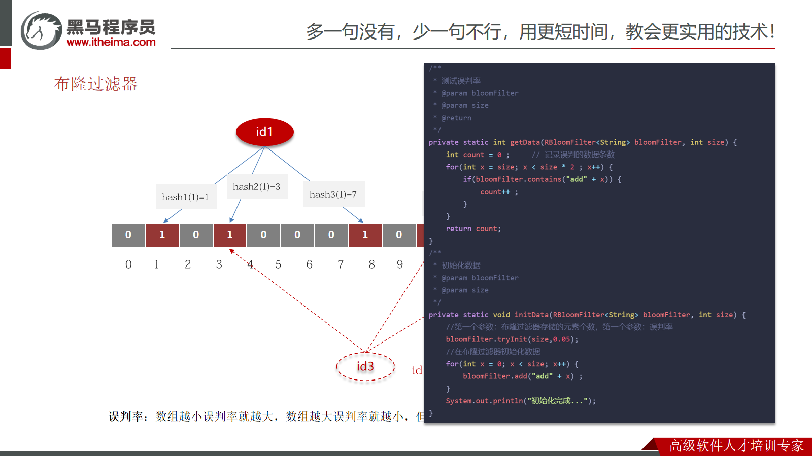

## 缓存穿透

<!-- 源 PPTX 第 11 页 -->

- 例：
- 一个get请求：api/news/getById/**1**

布隆过滤器

**缓存预热时，预热布隆过滤器**

根据id查询文章

查询布隆过滤器

布隆过滤中存在，查redis

redis查不到，查DB

DB

不存在，直接返回

命中，返回结果

DB查询到结果，返回(返回之前数据存储到redis)

- **解决方案**：
- 方案二：布隆过滤器

- **优点：**内存占用较少，没有多余key
- **缺点：**实现复杂，存在误判

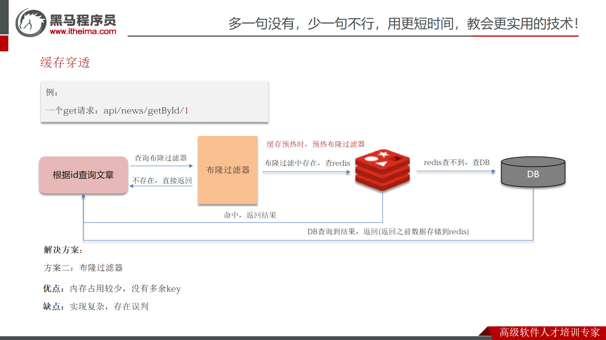

## 根据自己简历上的业务进行回答

<!-- 源 PPTX 第 12 页 -->

- 根据自己简历上的业务进行回答
- 缓存
- 分布式锁

**穿透、击穿、雪崩、双写一致、持久化、数据过期、淘汰策略**

**setnx、redisson**

- Redis的使用场景
- 什么是缓存穿透，怎么解决

- 缓存穿透：查询一个**不存在**的数据，mysql查询不到数据也不会直接写入缓存，就会导致每次请求都查数据库
- 解决方案一：缓存空数据
- 解决方案二：布隆过滤器

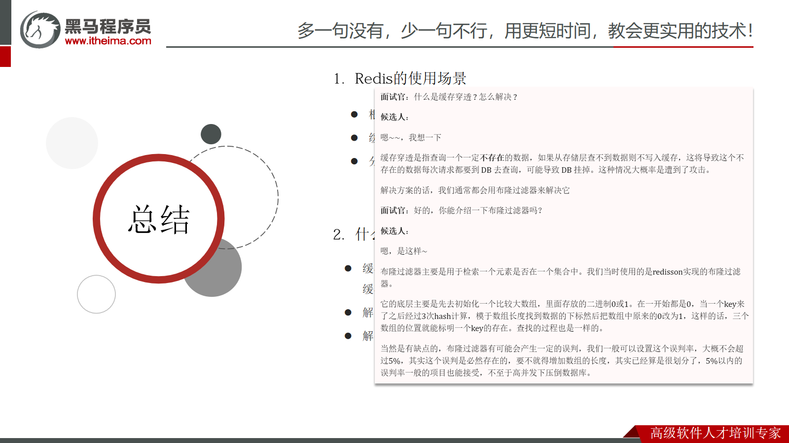

## 缓存击穿

<!-- 源 PPTX 第 13 页 -->

**缓存击穿：**给某一个key设置了过期时间，当key过期的时候，恰好这时间点对这个key有大量的并发请求过来，这些并发的请求可能会瞬间把DB压垮

根据id查询文章

查redis

**key过期**，redis查不到，查DB

DB

命中，返回结果

**消耗了50毫秒**

DB查询到结果，返回(返回之前数据存储到redis)

- **解决方案一：**互斥锁
- **解决方案二：**逻辑过期

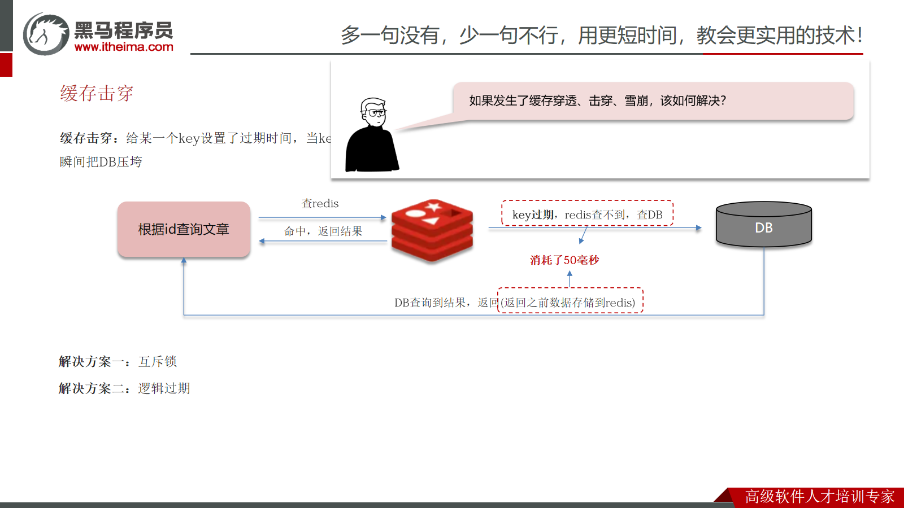

## 缓存击穿

<!-- 源 PPTX 第 14 页 -->

| KEY | VALUE |
| --- | --- |
| 1 |  |

```text
{"id":"123","title":"黑马程序员","expire":153213455}
```

**互斥锁**

**逻辑过期**

**不设置过期时间**

线程1

线程2

线程3

线程4

1.查询缓存，发现逻辑时间已过期

- 1.查询缓存，
- 未命中

- 2.获取互斥
- 锁成功

- 2.获取
- 互斥锁
- 失败

3.开启新线程

3.查询数据库重建缓存数据

- 2.获取
- 互斥锁失败

4.返回过期数据

1.查询数据库重建缓存数据

3. 休眠一会儿，再重试

3.返回过期数据

- 2.写入缓存，
- 重置逻辑
- 过期时间

4.写入缓存

4. 重试

**强一致**

**高可用**

5.释放锁

5.缓存命中

**性能差**

**性能优**

3.释放锁

- 1.命中缓存，
- 并且没有
- 过期

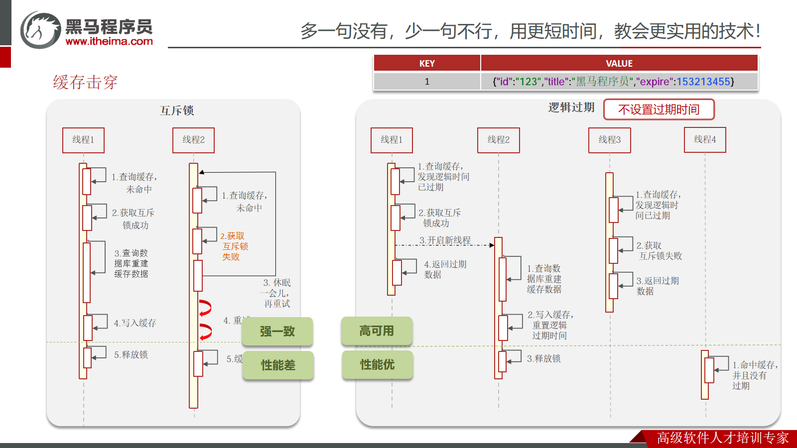

## 缓存击穿

<!-- 源 PPTX 第 15 页 -->

- **缓存击穿：**给某一个key设置了过期时间，当key过期的时候，恰好这时间点对这个key有大量的并发请求过来，这些并发的请求可能会瞬间把DB压垮
- **解决方案一**：互斥锁，强一致，性能差
- **解决方案二**：逻辑过期，高可用，性能优，不能保证数据绝对一致

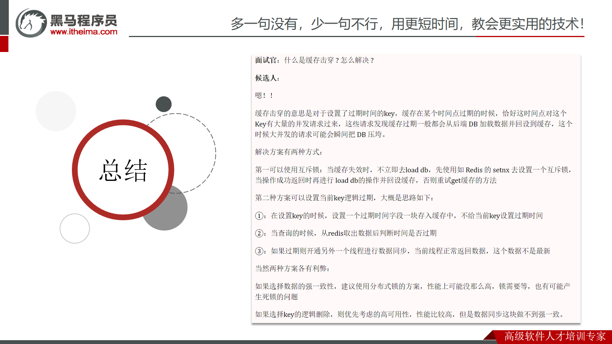

## 缓存雪崩

<!-- 源 PPTX 第 16 页 -->

**缓存雪崩**是指在同一时段大量的缓存key同时失效或者Redis服务宕机，导致大量请求到达数据库，带来巨大压力。

**大量key过期**

请求数据

查redis

Redis宕机

redis查不到，查DB

DB

命中，返回结果

DB查询到结果，返回(返回之前数据存储到redis)

- **解决方案：**
- 给不同的Key的TTL添加随机值
- 利用Redis集群提高服务的可用性
- 给缓存业务添加降级限流策略
- 给业务添加多级缓存

**哨兵模式、集群模式**

**ngxin或spring cloud gateway**

**Guava或Caffeine**

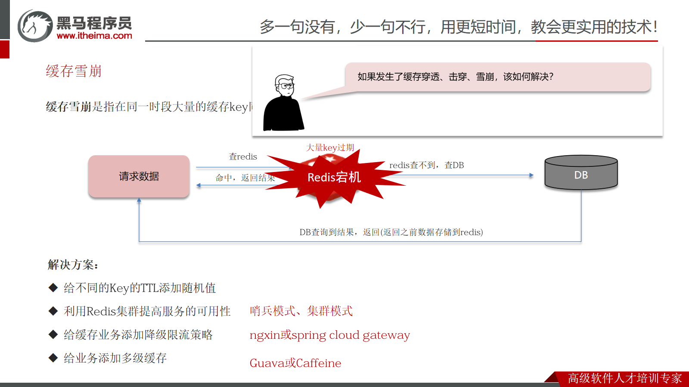

## 缓存雪崩

<!-- 源 PPTX 第 17 页 -->

- **缓存雪崩**是指在同一时段大量的缓存key同时失效或者Redis服务宕机，导致大量请求到达数据库，带来巨大压力。
- **解决方案：**
- 给不同的Key的TTL添加随机值
- 利用Redis集群提高服务的可用性
- 给缓存业务添加降级限流策略
- 给业务添加多级缓存

**降级可做为系统的保底策略，适用于穿透、击穿、雪崩**

- **《缓存三兄弟》**
- 穿透无中生有key，布隆过滤null隔离。
- 缓存击穿过期key， 锁与非期解难题。
- 雪崩大量过期key，过期时间要随机。
- 面试必考三兄弟，可用限流来保底。

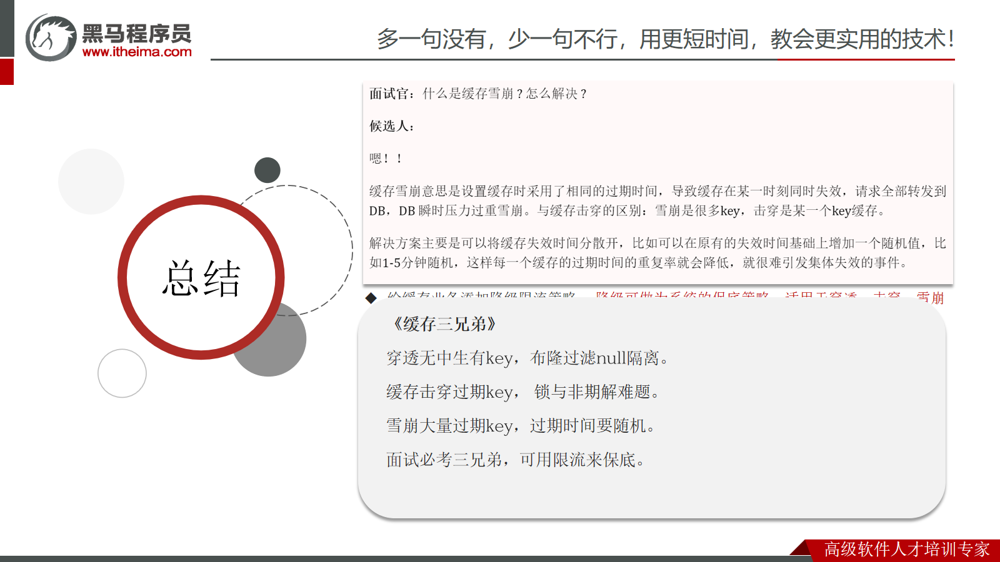

## 先删除缓存，还是先修改数据库

<!-- 源 PPTX 第 18 页 -->

**20**

**10**

先删除缓存，再操作数据库

缓存

先操作数据库，再删除缓存

数据库

线程1

线程2

1.删除缓存

- 2.更新数据库
- v = 20

- 2.查询缓存，
- 未命中,
- 查询数据库

3. 写入缓存

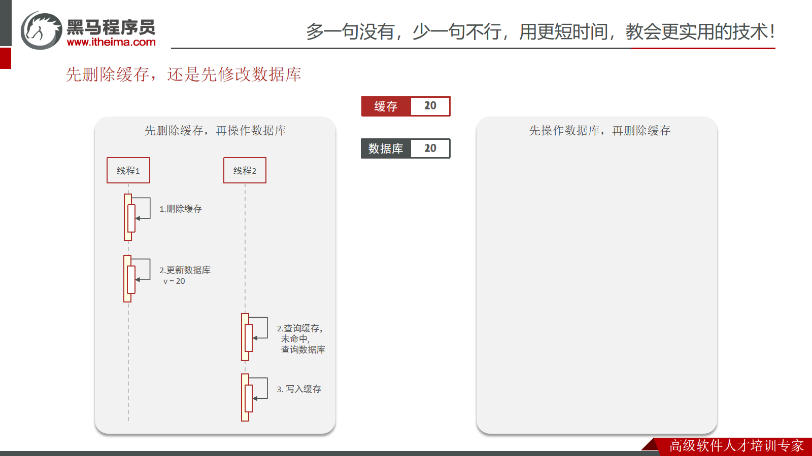

## 先删除缓存，还是先修改数据库

<!-- 源 PPTX 第 19 页 -->

**10**

**20**

先删除缓存，再操作数据库

缓存

先操作数据库，再删除缓存

数据库

线程1

线程2

1.删除缓存

- 1.更新数据库
- v = 20

- 2.查询缓存，
- 未命中,
- 查询数据库

2.删除缓存

3.写入缓存

- 3.查询缓存，
- 未命中，
- 查询数据库

- 4.更新数据库
- v = 20

4. 写入缓存

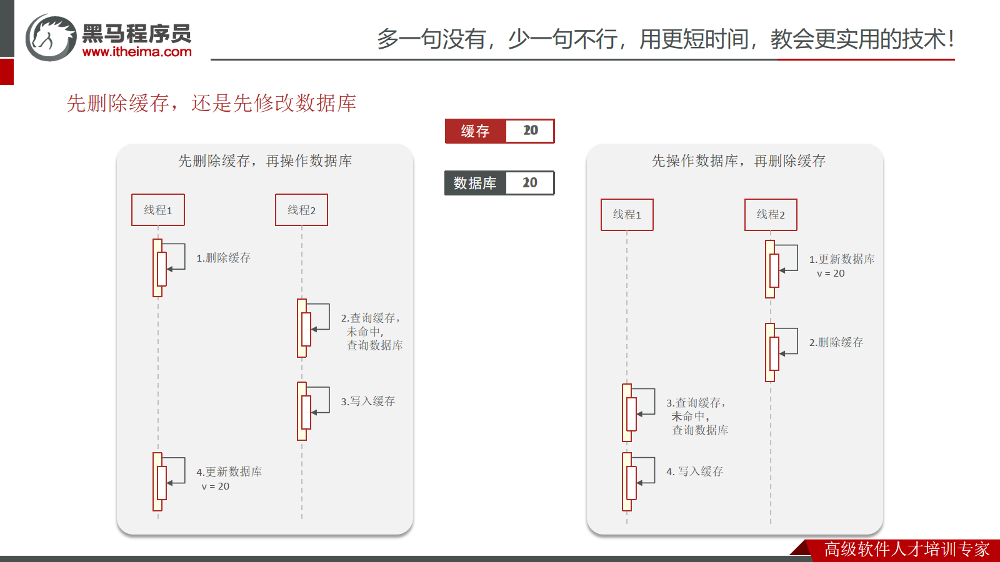

## 先删除缓存，还是先修改数据库

<!-- 源 PPTX 第 20 页 -->

**10**

先删除缓存，再操作数据库

缓存

先操作数据库，再删除缓存

**20**

数据库

线程1

线程2

1.删除缓存

- 1.查询缓存，
- 未命中，
- 查询数据库

- 2.查询缓存，
- 未命中,
- 查询数据库

- 2.更新数据库
- v = 20

3.写入缓存

3.删除缓存

- 4.更新数据库
- v = 20

4. 写入缓存

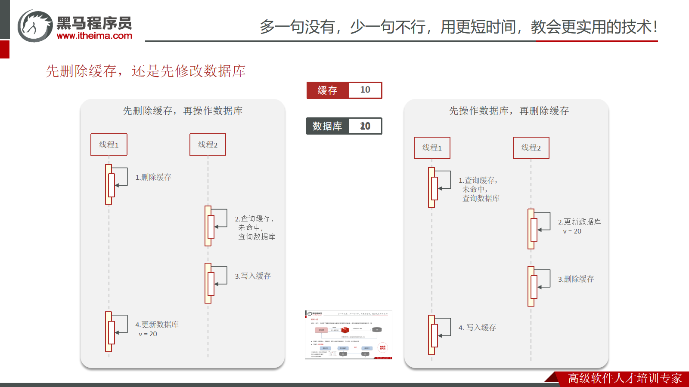

## 我看你做的项目中，都用到了redis，你在最近的项目中哪些场景使用了redis呢？

<!-- 源 PPTX 第 21 页 -->

**结合项目**

- 一是验证你的项目场景的真实性，二是为了作为深入发问的切入点
- 缓存
- 分布式锁
- 消息队列、延迟队列
- … …

**缓存三兄弟（穿透、击穿、雪崩）、双写一致、持久化、数据过期策略，数据淘汰策略**

**setnx、redisson**

**何种数据类型**

redis做为缓存，mysql的数据如何与redis进行同步呢？（双写一致性）

一致性要求高

**一定、一定、一定**要设置前提，先介绍自己的**业务背景**

允许延迟一致

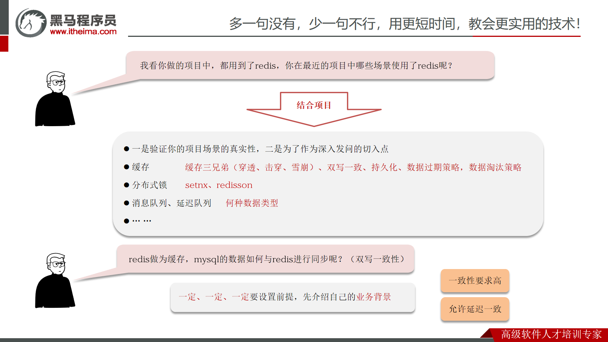

## 双写一致

<!-- 源 PPTX 第 22 页 -->

双写一致性：当修改了数据库的数据也要同时更新缓存的数据，缓存和数据库的数据要保持一致

查redis

请求数据

redis查不到，查DB

DB

命中，返回结果

**有脏数据风险**

DB查询到结果，返回(返回之前数据存储到redis)

- 读操作：缓存命中，直接返回；缓存未命中查询数据库，写入缓存，设定超时时间

- 写操作：**延迟双删**

**代码耦合性高**

删除缓存

修改数据库

**延时**

- 1.先删除缓存，还是先修改数据库
- 2.为什么要删除两次缓存？
- 3.为什么要延迟删除？

- DB
- 主

- DB
- 从

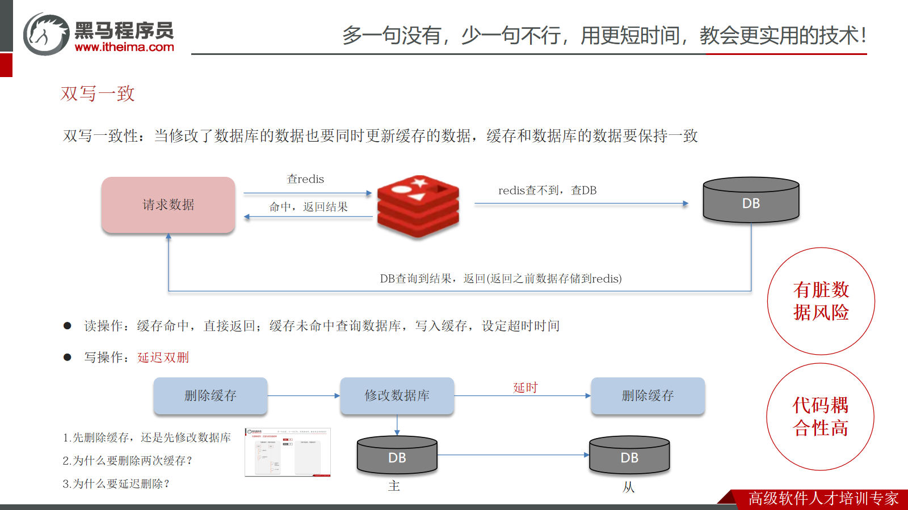

## 双写一致

<!-- 源 PPTX 第 23 页 -->

双写一致性：当修改了数据库的数据也要同时更新缓存的数据，缓存和数据库的数据要保持一致

查redis

请求数据

redis查不到，查DB

DB

命中，返回结果

DB查询到结果，返回(返回之前数据存储到redis)

- 读操作：缓存命中，直接返回；缓存未命中查询数据库，写入缓存，设定超时时间

- 写操作：**延迟双删**

**有脏数据风险**

删除缓存

修改数据库

**延时**

- 1.先删除缓存，还是先修改数据库
- 2.为什么要删除两次缓存？
- 3.为什么要延时删除？

- DB
- 主

- DB
- 从

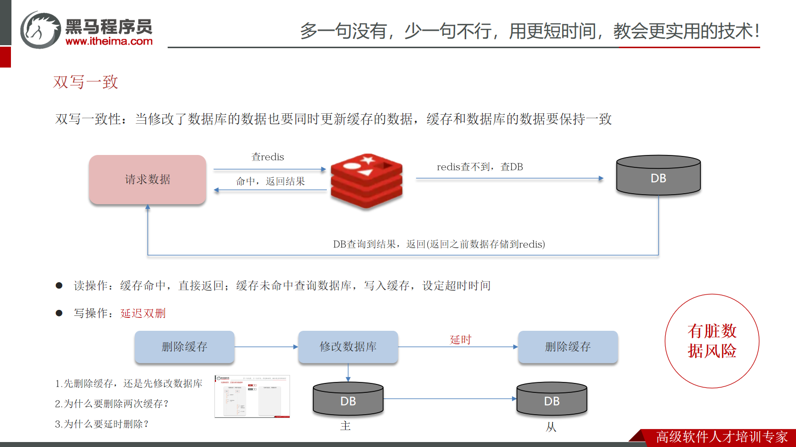

## 双写一致

<!-- 源 PPTX 第 24 页 -->

**强一致**

**性能低**

- 线程1
- 1.加锁
- 3.删除缓存
- 2.写数据
- 4.释放锁
- 线程2
- **分布式锁**
- 1.加锁
- 3.读数据库
- 2.读缓存，未命中
- 4.更新缓存
- 5. 解锁

**读多写少**

- **共享锁：**读锁readLock，加锁之后，其他线程可以共享读操作
- **排他锁：**独占锁writeLock也叫，加锁之后，阻塞其他线程读写操作

排他锁

共享锁

**读写互斥**

**读读不互斥，写互斥**

写数据

读数据

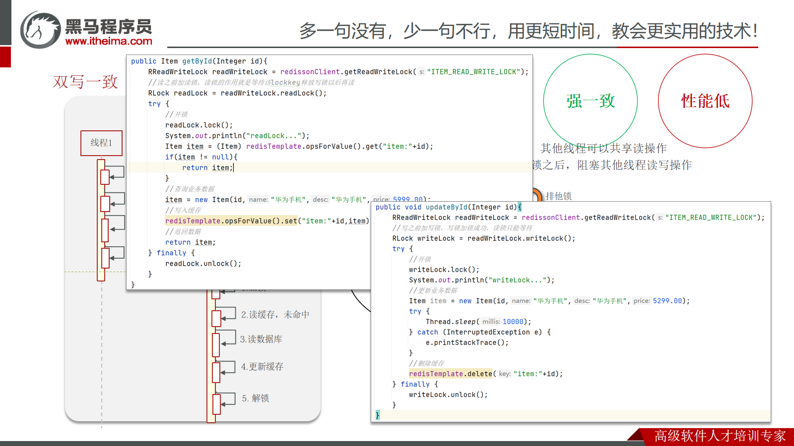

## 双写一致

<!-- 源 PPTX 第 25 页 -->

异步通知保证数据的最终一致性

MQ

1.2.发布消息

2.1.监听消息

item-service

**需要保证MQ的可靠性**

cache-service

修改数据

1.1.写入数据库

2.1.更新缓存

MySQL

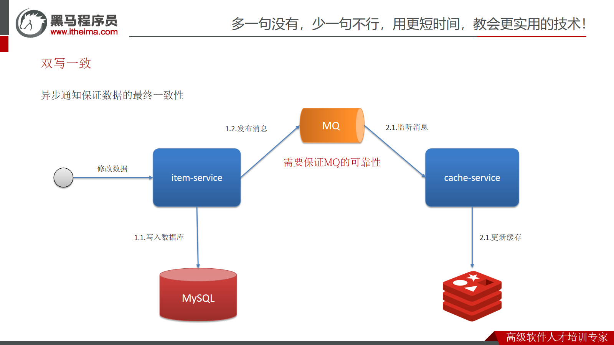

## 双写一致

<!-- 源 PPTX 第 26 页 -->

基于Canal的异步通知：

item-service

cache-service

修改数据

2.2.通知数据变更情况

canal

2.3.更新缓存

1.写入数据库

2.1.监听mysql的binlog

MySQL

**canal是基于mysql的主从同步来实现的**

二进制日志（BINLOG）记录了所有的 DDL（数据定义语言）语句和 DML（数据操纵语言）语句，但不包括数据查询（SELECT、SHOW）语句。

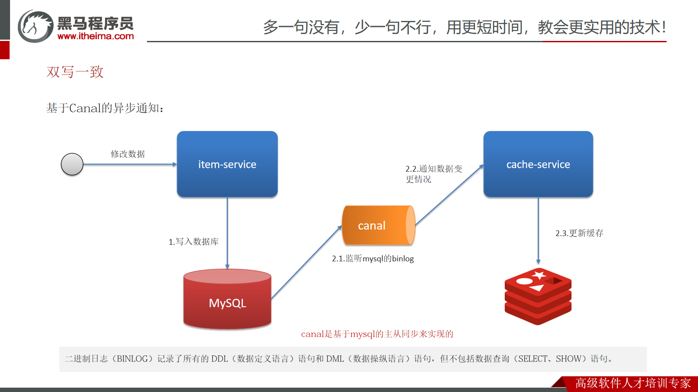

## redis做为缓存，mysql的数据如何与redis进行同步呢？（双写一致性）

<!-- 源 PPTX 第 27 页 -->

- 介绍自己简历上的业务，我们当时是把文章的热点数据存入到了缓存中，虽然是热点数据，但是实时要求性并没有那么高，所以，我们当时采用的是异步的方案同步的数据
- 我们当时是把抢券的库存存入到了缓存中，这个需要实时的进行数据同步，为了保证数据的强一致，我们当时采用的是redisson提供的读写锁来保证数据的同步

那你来介绍一下异步的方案（你来介绍一下redisson读写锁的这种方案）

- **允许延时一致的业务**，采用异步通知
- 使用MQ中间中间件，更新数据之后，通知缓存删除
- 利用canal中间件，不需要修改业务代码，伪装为mysql的一个从节点，canal通过读取binlog数据更新缓存

- **强一致性的**，采用Redisson提供的读写锁
- 共享锁：读锁readLock，加锁之后，其他线程可以共享读操作
- 排他锁：独占锁writeLock也叫，加锁之后，阻塞其他线程读写操作

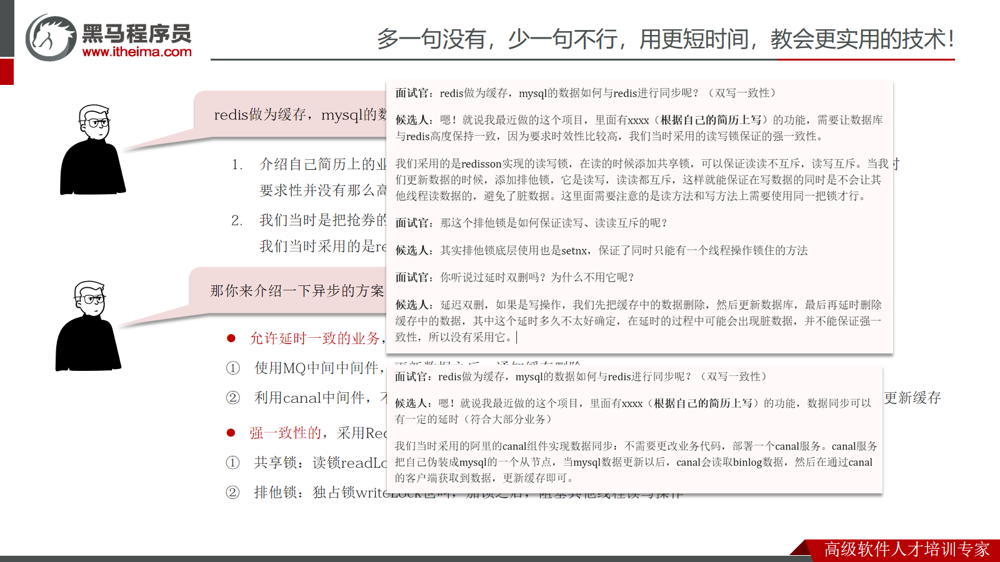

## 我看你做的项目中，都用到了redis，你在最近的项目中哪些场景使用了redis呢？

<!-- 源 PPTX 第 28 页 -->

**结合项目**

- 一是验证你的项目场景的真实性，二是为了作为深入发问的切入点
- 缓存
- 分布式锁
- 消息队列、延迟队列
- … …

**缓存三兄弟（穿透、击穿、雪崩）、双写一致、持久化、数据过期策略，数据淘汰策略**

**setnx、redisson**

**何种数据类型**

redis做为缓存，数据的持久化是怎么做的？

在Redis中提供了两种数据持久化的方式：1、RDB   2、AOF

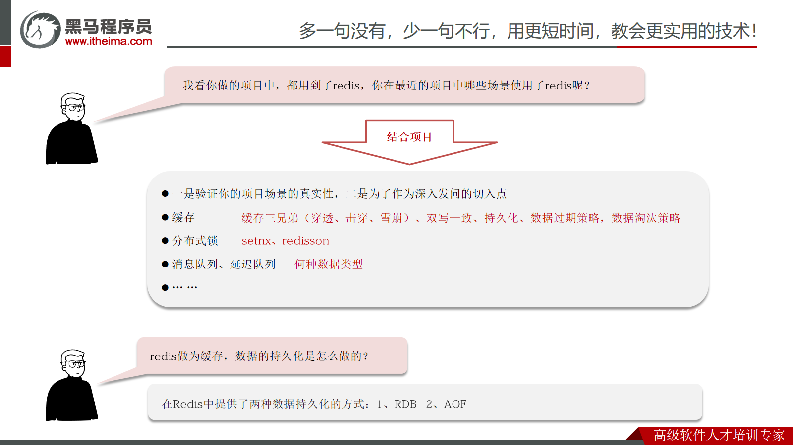

## Redis持久化

<!-- 源 PPTX 第 29 页 -->

RDB全称Redis Database Backup file（Redis数据备份文件），也被叫做Redis数据快照。简单来说就是把内存中的所有数据都记录到磁盘中。当Redis实例故障重启后，从磁盘读取快照文件，恢复数据

```text
save
save
ok
#由Redis主进程来执行RDB，会阻塞所有命令
127.0.0.1:6379>
bgsave
Background saving started
#开启子进程执行RDB，避免主进程受到影响
```

主动备份

Redis内部有触发RDB的机制，可以在redis.conf文件中找到，格式如下：

**RDB的执行原理？**

```text
# 900秒内，如果至少有1个key被修改，则执行bgsave
save 900 1
save 300 10
save 60 10000
```

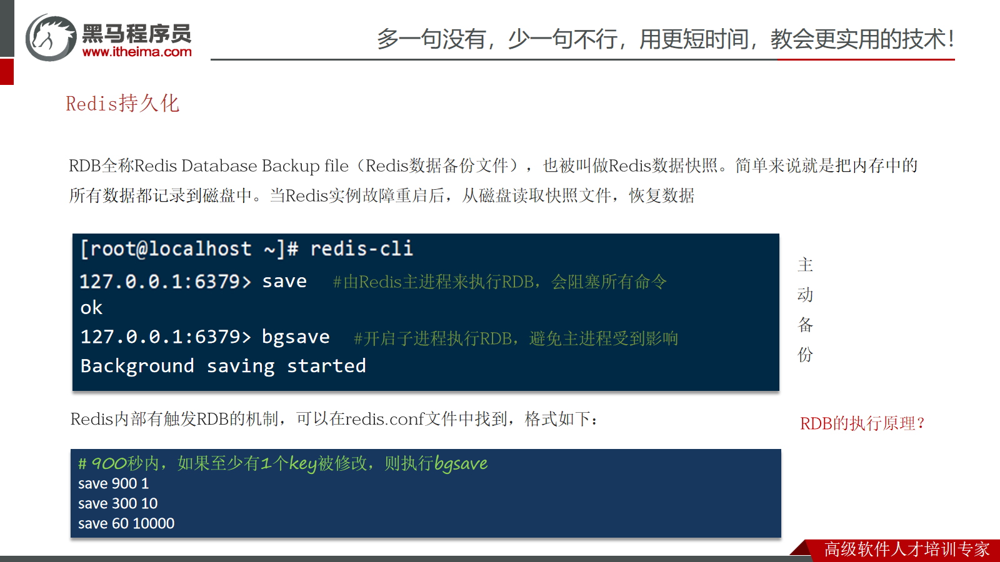

## RDB的执行原理？

<!-- 源 PPTX 第 30 页 -->

- bgsave开始时会fork主进程得到子进程，子进程**共享**主进程的内存数据。完成fork后读取内存数据并写入 RDB 文件。
- fork采用的是copy-on-write技术：
- 当主进程执行读操作时，访问共享内存；
- 当主进程执行写操作时，则会拷贝一份数据，执行写操作。

子进程

主进程

fork

页表

复制页表

读操作

- 物
- 理
- 内
- 存

写操作

**read-only**

- 写新RDB文件
- 替换旧RDB文件

数据A

磁盘

- 页表：
- 记录虚拟地址与物理地址的映射关系

数据副本B

数据B

数据拷贝

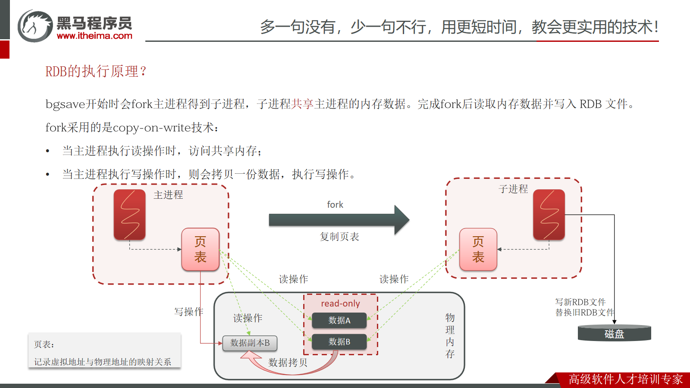

## AOF

<!-- 源 PPTX 第 31 页 -->

AOF全称为Append Only File（追加文件）。Redis处理的每一个写命令都会记录在AOF文件，可以看做是命令日志文件。

**AOF**

```text
$3
set
$3
num
$3
123
```

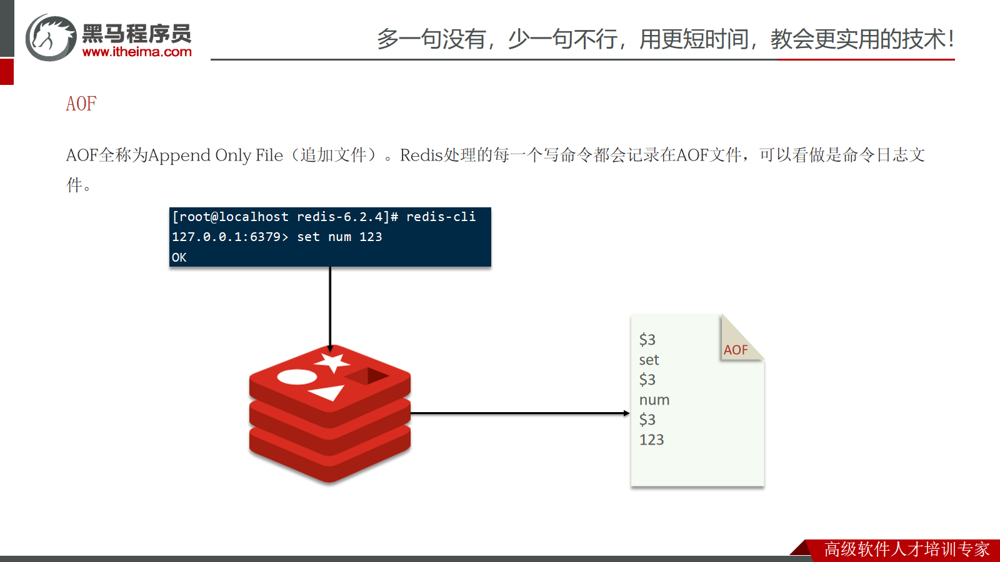

## AOF

<!-- 源 PPTX 第 32 页 -->

- AOF默认是关闭的，需要修改redis.conf配置文件来开启AOF：
- AOF的命令记录的频率也可以通过redis.conf文件来配：

```text
# 是否开启AOF功能，默认是no
appendonly yes
# AOF文件的名称
appendfilename "appendonly.aof"
```

```text
# 表示每执行一次写命令，立即记录到AOF文件
appendfsync always
# 写命令执行完先放入AOF缓冲区，然后表示每隔1秒将缓冲区数据写到AOF文件，是默认方案
appendfsync everysec
# 写命令执行完先放入AOF缓冲区，由操作系统决定何时将缓冲区内容写回磁盘
appendfsync no
```

| 配置项 | 刷盘时机 | 优点 | 缺点 |
| --- | --- | --- | --- |
| Always | 同步刷盘 | 可靠性高，几乎不丢数据 | 性能影响大 |
| everysec | 每秒刷盘 | 性能适中 | 最多丢失1秒数据 |
| no | 操作系统控制 | 性能最好 | 可靠性较差，可能丢失大量数据 |

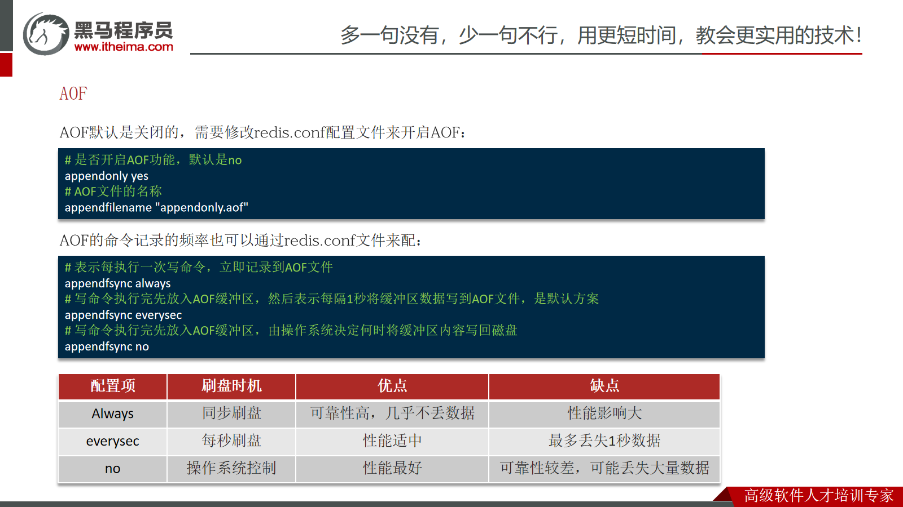

## AOF

<!-- 源 PPTX 第 33 页 -->

- 因为是记录命令，AOF文件会比RDB文件大的多。而且AOF会记录对同一个key的多次写操作，但只有最后一次写操作才有意义。通过执行**bgrewriteaof**命令，可以让AOF文件执行重写功能，用最少的命令达到相同效果。
- Redis也会在触发阈值时自动去重写AOF文件。阈值也可以在redis.conf中配置：

```text
AOF
set num 123
set name jack
set num 666
```

- **AOF**
- mset name jack num 666

bgrewirteaof

```text
# AOF文件比上次文件 增长超过多少百分比则触发重写
auto-aof-rewrite-percentage 100
# AOF文件体积最小多大以上才触发重写 
auto-aof-rewrite-min-size 64mb
```

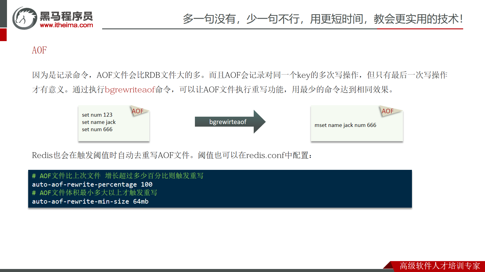

## RDB与AOF对比

<!-- 源 PPTX 第 34 页 -->

RDB和AOF各有自己的优缺点，如果对数据安全性要求较高，在实际开发中往往会**结合**两者来使用。

|  | RDB | AOF |
| --- | --- | --- |
| 持久化方式 | 定时对整个内存做快照 | 记录每一次执行的命令 |
| 数据完整性 | 不完整，两次备份之间会丢失 | 相对完整，取决于刷盘策略 |
| 文件大小 | 会有压缩，文件体积小 | 记录命令，文件体积很大 |
| 宕机恢复速度 | 很快 | 慢 |
| 数据恢复优先级 | 低，因为数据完整性不如AOF | 高，因为数据完整性更高 |
| 系统资源占用 | 高，大量CPU和内存消耗 | 低，主要是磁盘IO资源但AOF重写时会占用大量CPU和内存资源 |
| 使用场景 | 可以容忍数分钟的数据丢失，追求更快的启动速度 | 对数据安全性要求较高常见 |

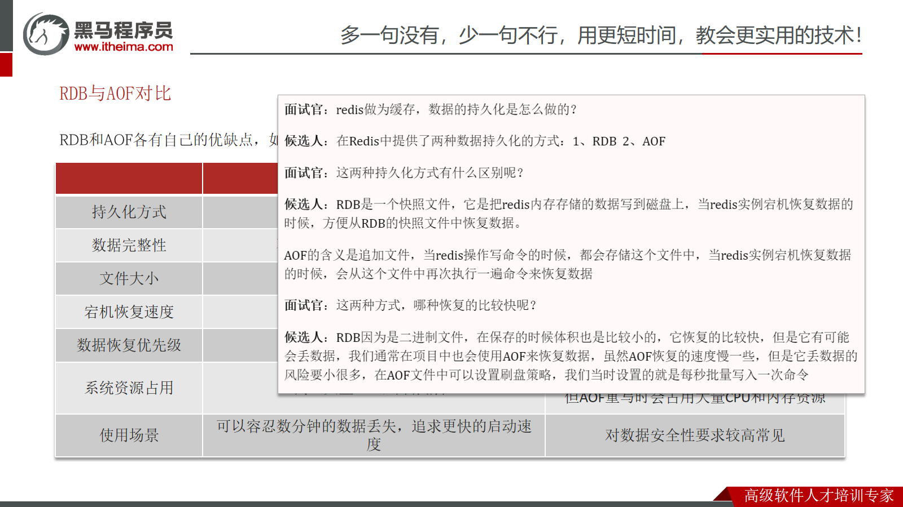

## redis做为缓存，数据的持久化是怎么做的？

<!-- 源 PPTX 第 35 页 -->

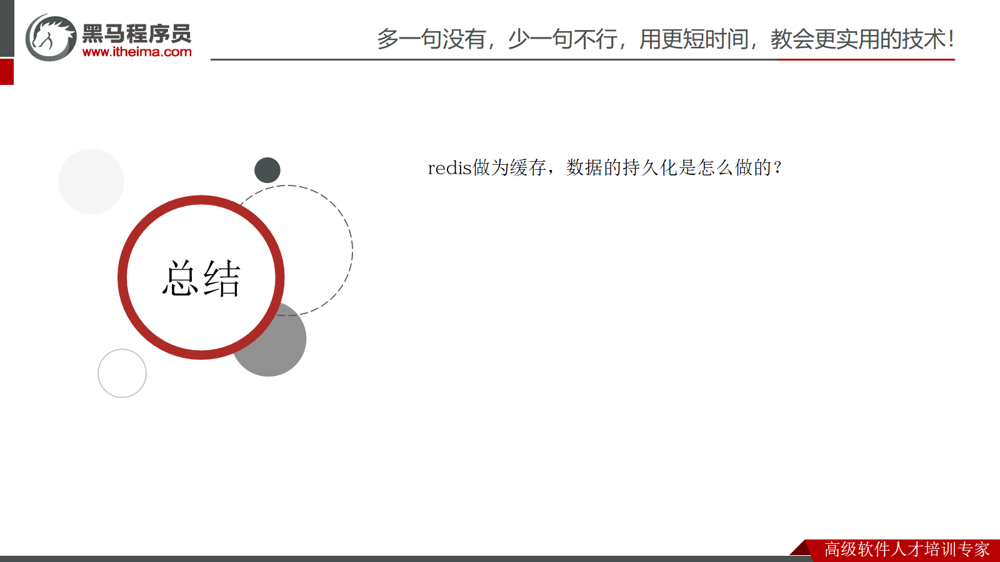

## 我看你做的项目中，都用到了redis，你在最近的项目中哪些场景使用了redis呢？

<!-- 源 PPTX 第 36 页 -->

**结合项目**

- 一是验证你的项目场景的真实性，二是为了作为深入发问的切入点
- 缓存
- 分布式锁
- 消息队列、延迟队列
- … …

**缓存三兄弟（穿透、击穿、雪崩）、双写一致、持久化、数据过期策略，数据淘汰策略**

**setnx、redisson**

**何种数据类型**

假如redis的key过期之后，会立即删除吗？

```text
set name heima 10
```

Redis对数据设置数据的有效时间，数据过期以后，就需要将数据从内存中删除掉。可以按照不同的规则进行删除，这种删除规则就被称之为数据的删除策略（数据过期策略）。

**惰性删除、定期删除**

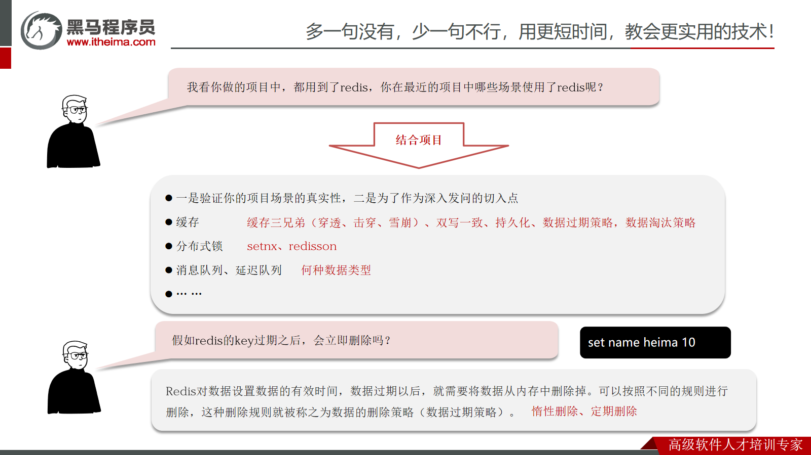

## Redis数据删除策略-惰性删除

<!-- 源 PPTX 第 37 页 -->

惰性删除：设置该key过期时间后，我们不去管它，当需要该key时，我们在检查其是否过期，如果过期，我们就删掉它，反之返回该key

- set name zhangsan  10<br>get name   *//**发现**name**过期了，直接删除**key*
- 例子

- **优点** ：对CPU友好，只会在使用该key时才会进行过期检查，对于很多用不到的key不用浪费时间进行过期检查
- **缺点** ：对内存不友好，如果一个key已经过期，但是一直没有使用，那么该key就会一直存在内存中，内存永远不会释放

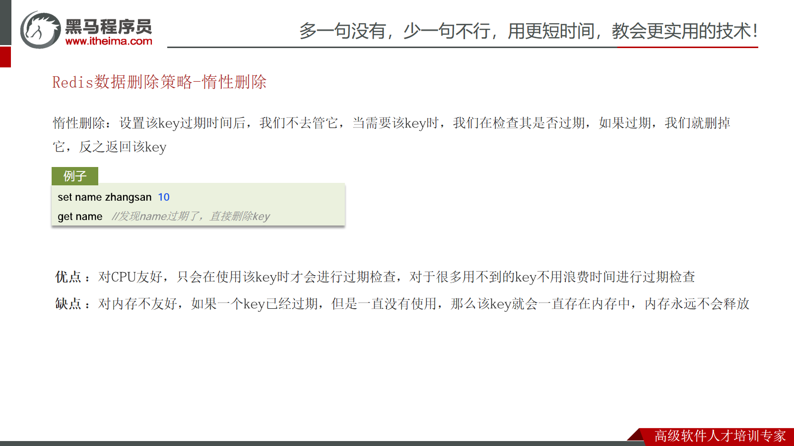

## Redis数据删除策略-定期删除

<!-- 源 PPTX 第 38 页 -->

定期删除：每隔一段时间，我们就对一些key进行检查，删除里面过期的key(从一定数量的数据库中取出一定数量的随机key进行检查，并删除其中的过期key)。

- 定期清理有两种模式：
- SLOW模式是定时任务，执行频率默认为10hz，每次不超过25ms，以通过修改配置文件redis.conf 的**hz** 选项来调整这个次数
- FAST模式执行频率不固定，但两次间隔不低于2ms，每次耗时不超过1ms

- **优点**：可以通过限制删除操作执行的时长和频率来减少删除操作对 CPU 的影响。另外定期删除，也能有效释放过期键占用的内存。
- **缺点**：难以确定删除操作执行的时长和频率。

**Redis的过期删除策略：惰性删除 + 定期删除两种策略进行配合使用**

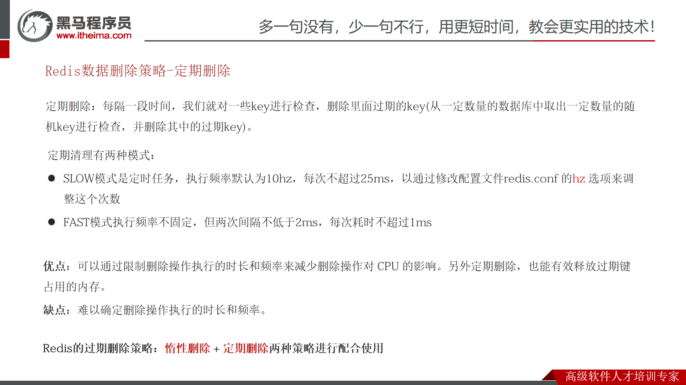

## Redis的数据过期策略

<!-- 源 PPTX 第 39 页 -->

- **惰性删除**：访问key的时候判断是否过期，如果过期，则删除
- **定期删除**：定期检查一定量的key是否过期（ SLOW模式+ FAST模式）
- **Redis的过期删除策略：惰性删除 + 定期删除两种策略进行配合使用**

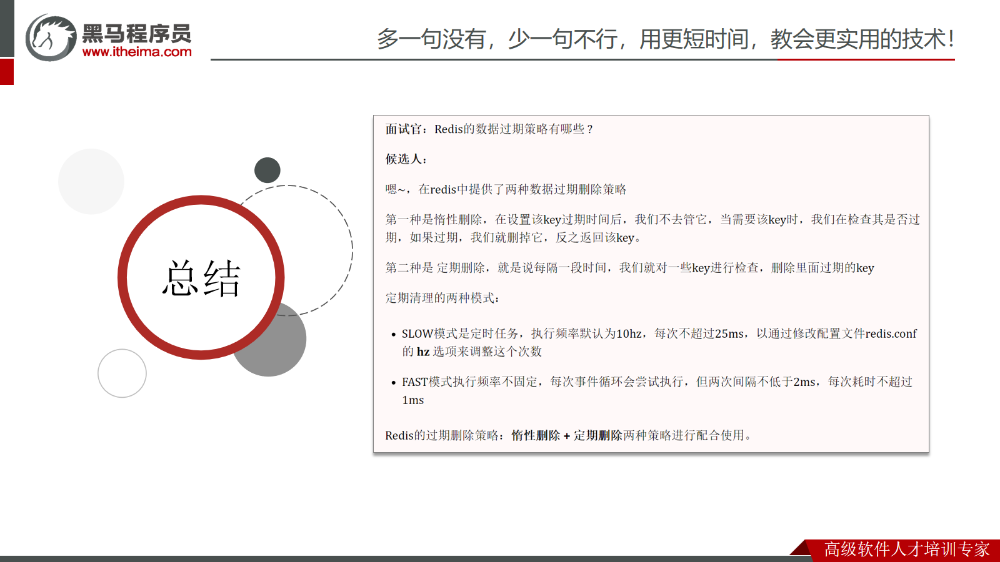

## 我看你做的项目中，都用到了redis，你在最近的项目中哪些场景使用了redis呢？

<!-- 源 PPTX 第 40 页 -->

**结合项目**

- 一是验证你的项目场景的真实性，二是为了作为深入发问的切入点
- 缓存
- 分布式锁
- 消息队列、延迟队列
- … …

**缓存三兄弟（穿透、击穿、雪崩）、双写一致、持久化、数据过期策略，数据淘汰策略**

**setnx、redisson**

**何种数据类型**

假如缓存过多，内存是有限的，内存被占满了怎么办？

其实就是想问redis的数据淘汰策略是什么？

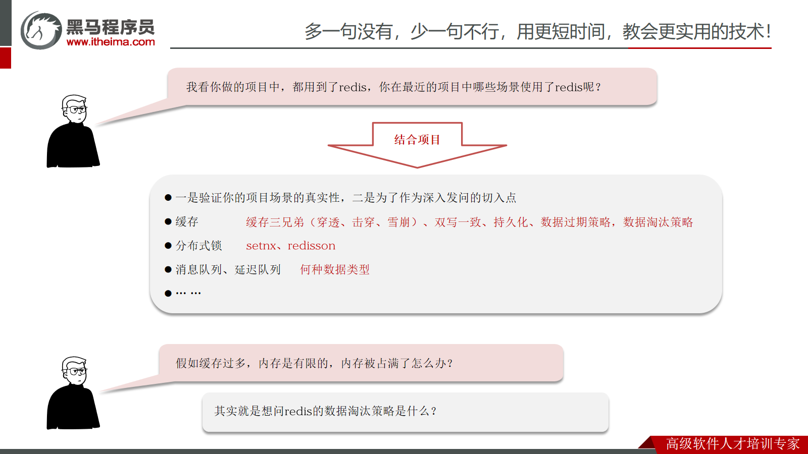

## 数据淘汰策略

<!-- 源 PPTX 第 41 页 -->

- **数据的淘汰策略**：当Redis中的内存不够用时，此时在向Redis中添加新的key，那么Redis就会按照某一种规则将内存中的数据删除掉，这种数据的删除规则被称之为内存的淘汰策略。
- Redis支持8种不同策略来选择要删除的key：
- noeviction： 不淘汰任何key，但是内存满时不允许写入新数据，**默认就是这种策略**。
- volatile-ttl： 对设置了TTL的key，比较key的剩余TTL值，TTL越小越先被淘汰
- allkeys-random：对全体key ，随机进行淘汰。
- volatile-random：对设置了TTL的key ，随机进行淘汰。
- allkeys-lru： 对全体key，基于LRU算法进行淘汰
- volatile-lru： 对设置了TTL的key，基于LRU算法进行淘汰
- allkeys-lfu： 对全体key，基于LFU算法进行淘汰
- volatile-lfu： 对设置了TTL的key，基于LFU算法进行淘汰

key1是在3s之前访问的, key2是在9s之前访问的，删除的就是key2

- **LRU**（**L**east **R**ecently **U**sed）最近最少使用。用当前时间减去最后一次访问时间，这个值越大则淘汰优先级越高。
- **LFU**（**L**east **F**requently **U**sed）最少频率使用。会统计每个key的访问频率，值越小淘汰优先级越高。

key1最近5s访问了4次, key2最近5s访问了9次， 删除的就是key1

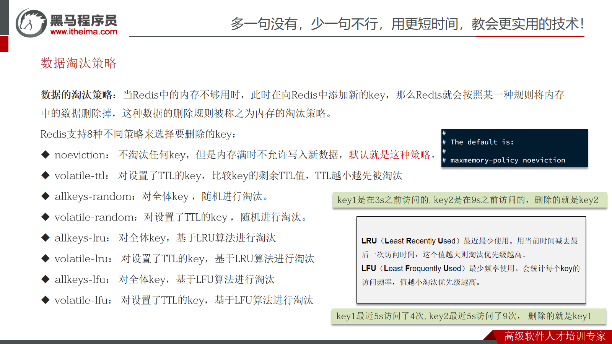

## 数据淘汰策略-使用建议

<!-- 源 PPTX 第 42 页 -->

- 优先使用 allkeys-lru 策略。充分利用 LRU 算法的优势，把最近最常访问的数据留在缓存中。如果业务有明显的冷热数据区分，建议使用。
- 如果业务中数据访问频率差别不大，没有明显冷热数据区分，建议使用 allkeys-random，随机选择淘汰。
- 如果业务中有置顶的需求，可以使用 volatile-lru 策略，同时置顶数据不设置过期时间，这些数据就一直不被删除，会淘汰其他设置过期时间的数据。
- 如果业务中有短时高频访问的数据，可以使用 allkeys-lfu 或 volatile-lfu 策略。

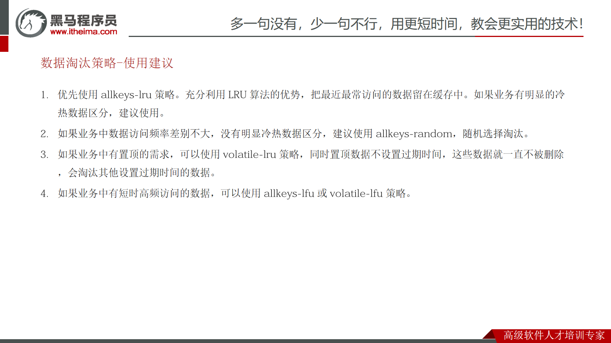

## 关于数据淘汰策略其他的面试问题

<!-- 源 PPTX 第 43 页 -->

- 数据库有1000万数据 ,Redis只能缓存20w数据, 如何保证Redis中的数据都是热点数据 ?
- Redis的内存用完了会发生什么？

使用allkeys-lru(挑选最近最少使用的数据淘汰)淘汰策略，留下来的都是经常访问的热点数据

主要看数据淘汰策略是什么？如果是默认的配置（ noeviction ），会直接报错

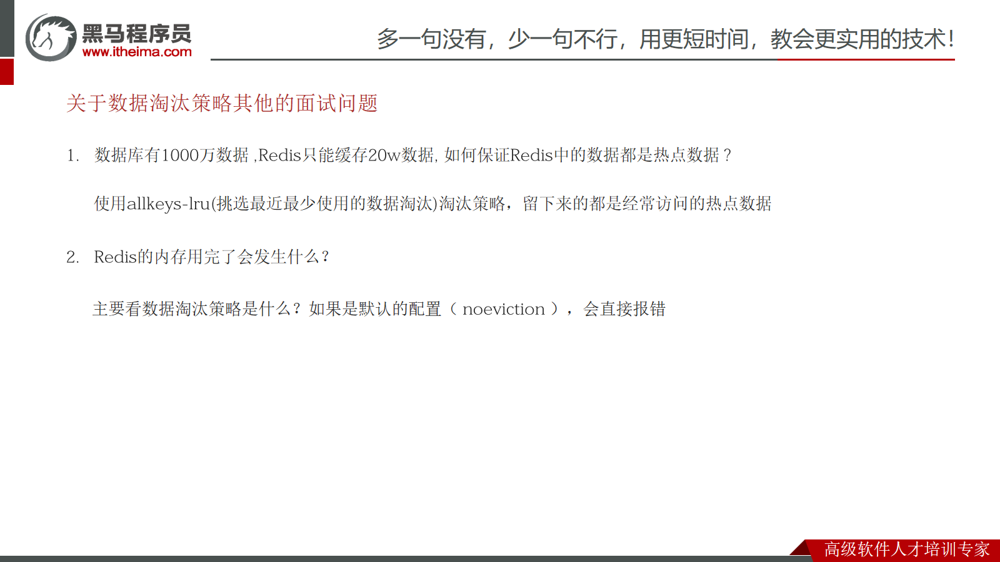

## 数据淘汰策略

<!-- 源 PPTX 第 44 页 -->

- Redis提供了8种不同的数据淘汰策略，默认是noeviction不删除任何数据，内存不足直接报错
- LRU：最少最近使用。用当前时间减去最后一次访问时间，这个值越大则淘汰优先级越高。
- LFU：最少频率使用。会统计每个key的访问频率，值越小淘汰优先级越高
- **平时开发过程中用的比较多的就是allkeys-lru（结合自己的业务场景）**

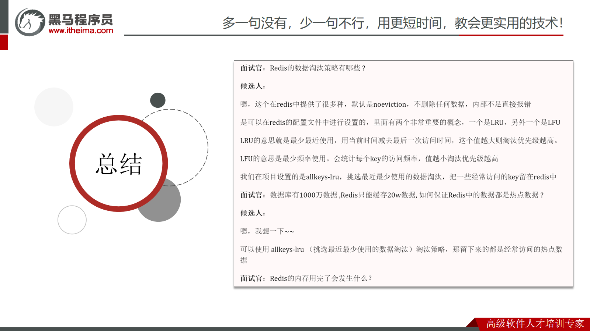

## 我看你做的项目中，都用到了redis，你在最近的项目中哪些场景使用了redis呢？

<!-- 源 PPTX 第 45 页 -->

**结合项目**

- 一是验证你的项目场景的真实性，二是为了作为深入发问的切入点
- 缓存
- 分布式锁
- 消息队列、延迟队列
- … …

**缓存三兄弟（穿透、击穿、雪崩）、双写一致、持久化、数据过期策略，数据淘汰策略**

**setnx、redisson**

**何种数据类型**

redis分布式锁，是如何实现的？

- 需要结合项目中的业务进行回答，通常情况下，分布式锁使用的场景：
- 集群情况下的定时任务、抢单、幂等性场景

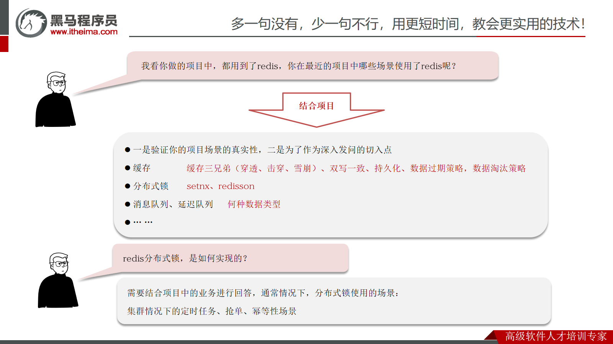

## 抢券场景

<!-- 源 PPTX 第 46 页 -->

开始

```text
/**
 * 抢购优惠券
 * @throws InterruptedException
 */
public void rushToPurchase() throws InterruptedException {
       //获取优惠券数量
    Integer num = (Integer) redisTemplate.opsForValue().get(“num”);
       //判断是否抢完
    if (null == num || num <= 0) {
            throw new RuntimeException(“优惠券已抢完");
       }
       //优惠券数量减一，说明抢到了优惠券
    num = num - 1;
       //重新设置优惠券的数量
    redisTemplate.opsForValue().set("num", num);
}
```

查询优惠券数量

- 判断库存
- 是否充足

- 返回异常结果
- 否

是

扣减库存

结束

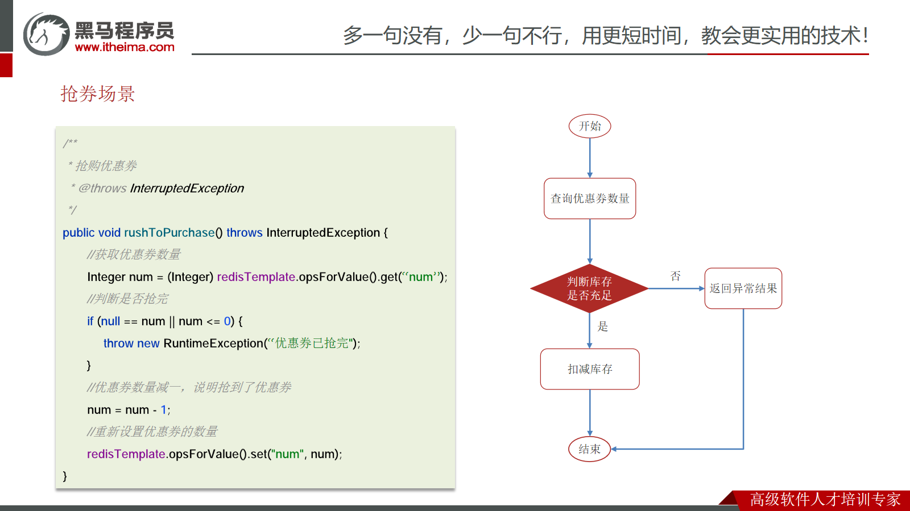

## 抢券执行流程

<!-- 源 PPTX 第 47 页 -->

开始

线程1

线程2

查询优惠券数量

1.查询优惠券

- 2.库存是否充足
- 是：扣减库存
- 否：抛出异常

- 判断库存
- 是否充足

否

返回异常结果

是

扣减库存

结束

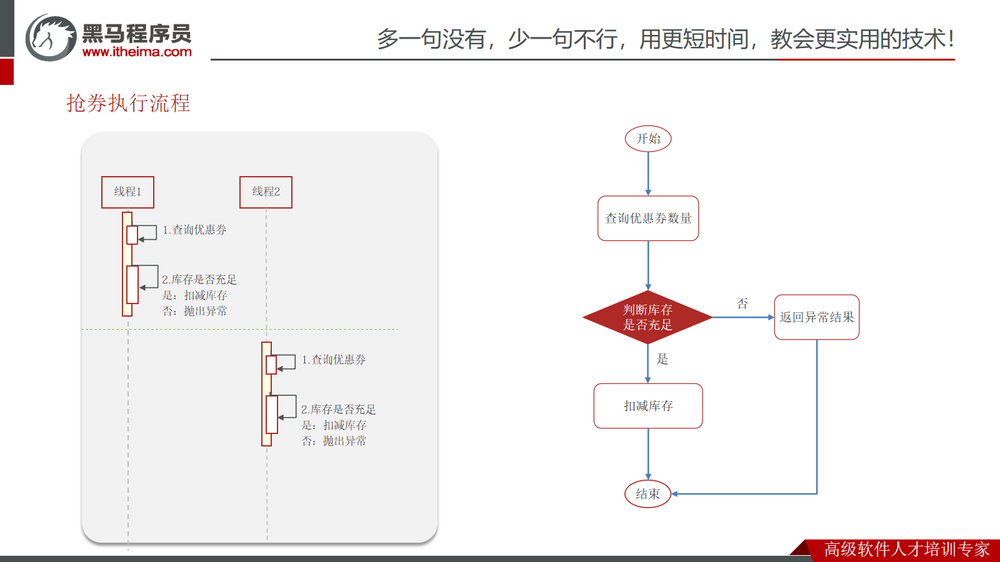

## 抢券执行流程

<!-- 源 PPTX 第 48 页 -->

库存

**1**

**0**

**-1**

开始

线程1

线程2

查询优惠券数量

1.查询优惠券

- 判断库存
- 是否充足

否

返回异常结果

- 2.库存是否充足
- 是：扣减库存
- 否：抛出异常

是

扣减库存

结束

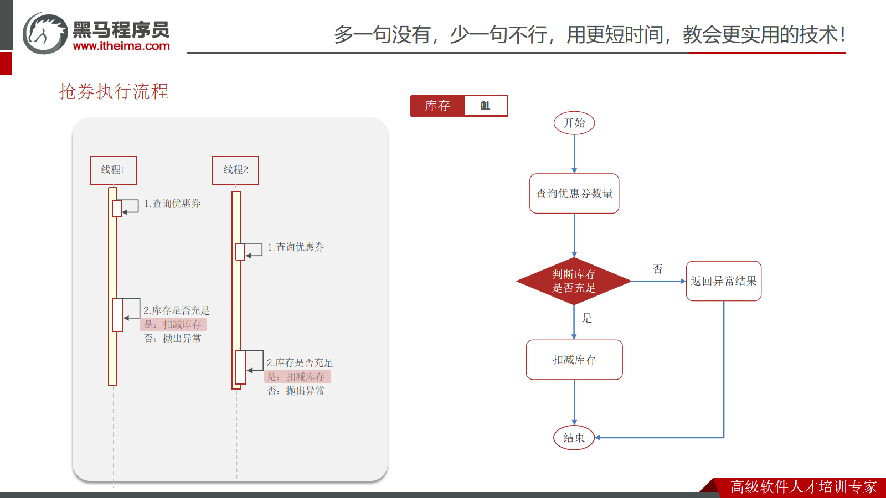

## 抢券执行流程

<!-- 源 PPTX 第 49 页 -->

- 库存
- **1**

```text
public void rushToPurchase() throws InterruptedException {
    synchronized (this){
        //查询优惠券数量
    Integer num = (Integer) redisTemplate.opsForValue().get("num");
        //判断是否抢完
    if (null == num || num <= 0) {
            throw new RuntimeException("商品已抢完");
        }
        //优惠券数量减一（减库存）
    num = num - 1;
        //重新设置优惠券的数量
    redisTemplate.opsForValue().set("num", num);
    }
}
```

线程1

线程2

1.获取互斥锁成功

1.获取互斥锁失败

2.查询优惠券

- 3.库存是否充足
- 是：扣减库存
- 否：抛出异常

4.释放锁

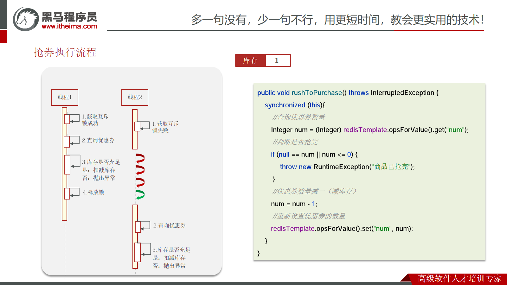

## 服务集群部署

<!-- 源 PPTX 第 50 页 -->

nginx

```text
localhost:8080
```

反向代理，负载均衡

```text
localhost:8081
```

同一份代码，部署在了多个tomcat中

```text
localhost:8082
```

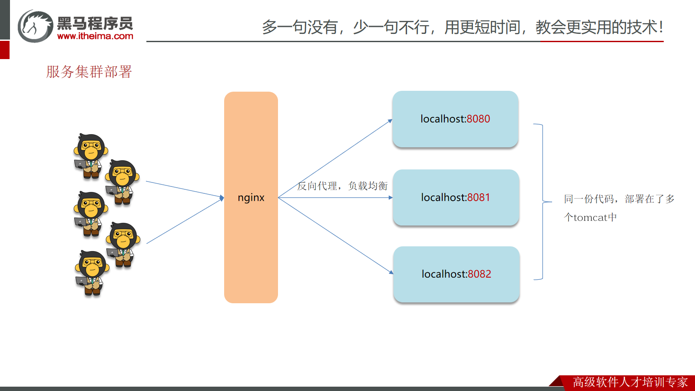

## 抢券执行流程

<!-- 源 PPTX 第 51 页 -->

库存

**1**

```text
localhost:8080
```

```text
localhost:8081
```

线程1

线程2

1.获取互斥锁成功

1.获取互斥锁失败

2.查询优惠券

- 3.库存是否充足
- 是：扣减库存
- 否：抛出异常

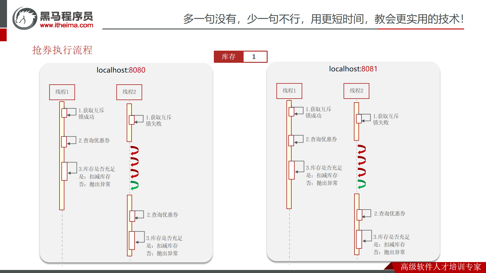

## 抢券执行流程

<!-- 源 PPTX 第 52 页 -->

**分布式锁**

```text
localhost:8080
```

```text
localhost:8081
```

线程1

线程2

1.获取互斥锁成功

1.获取互斥锁**失败**

1.获取互斥锁失败

2.查询优惠券

- 3.库存是否充足
- 是：扣减库存
- 否：抛出异常

4.释放锁


## redis分布式锁

<!-- 源 PPTX 第 53 页 -->

```text
Redis实现分布式锁主要利用Redis的setnx命令。setnx是SET if not exists(如果不存在，则 SET)的简写。
```

- 开始
- 尝试获取锁
- 判断结果
- nil
- ok
- 获取锁成功
- 执行业务
- 释放锁
- 获取锁失败
- 业务超时
- 或服务宕机
- 自动
- 释放锁

```text
获取锁：
释放锁：
# 添加锁，NX是互斥、EX是设置超时时间
SET lock value NX EX 10
# 释放锁，删除即可
DEL key
```

Redis实现分布式锁如何合理的控制锁的有效时长？

根据业务执行时间预估

给锁续期


## redisson实现的分布式锁-执行流程

<!-- 源 PPTX 第 54 页 -->

每隔(releaseTime / 3)的时间做一次续期

加锁成功

- Watch dog
- 看门狗

加锁

操作redis

释放锁

**加锁、设置过期时间等操作都是基于lua脚本完成**

是否加锁成功

while循环，不断尝试获取锁


## redisson实现的分布式锁-可重入

<!-- 源 PPTX 第 55 页 -->

```text
public void add1(){
    RLock lock = redissonClient.getLock(“heimalock");
    boolean isLock = lock.tryLock();
    //执行业务
  add2();
    //释放锁
  lock.unlock();
}
public void add2(){
    RLock lock = redissonClient.getLock(“heimalock");
    boolean isLock = lock.tryLock();
    //执行业务
  //释放锁
  lock.unlock();
}
```

利用**hash结构**记录**线程id**和**重入次数**

| KEY | VALUE |  |
| --- | --- | --- |
|  | field | value |
|  |  |  |

heimalock

thread1

1

2

0


## redisson实现的分布式锁-主从一致性

<!-- 源 PPTX 第 56 页 -->

Redis Slave

主从同步

Java应用

- 1.获取锁
- SET lock thread1 NX EX 10

Redis Master

lock = thread1


## redisson实现的分布式锁-主从一致性

<!-- 源 PPTX 第 57 页 -->

Redis Slave

Java应用

- 获取锁
- SET lock thread1 NX EX 10

Redis Master

lock = thread1

主从同步

**两个线程同时持有一把锁**


## redisson实现的分布式锁-主从一致性

<!-- 源 PPTX 第 58 页 -->

RedLock(红锁)：不能只在一个redis实例上创建锁，应该是在多个redis实例上创建锁**(n / 2 + 1)**，避免在一个redis实例上加锁。

Redis Node

- AP思想
- redis

lock = thread1

- 1.获取锁
- SET lock thread1 NX EX 10

Java应用

- 2.获取锁
- SET lock thread1 NX EX 10

- CP思想
- zookeeper

- 3.获取锁
- SET lock thread1 NX EX 10

**实现复杂**

**性能差**

**运维繁琐**


## redis分布式锁，是如何实现的？

<!-- 源 PPTX 第 59 页 -->

- 先按照自己简历上的业务进行描述分布式锁使用的场景
- 我们当使用的redisson实现的分布式锁，底层是**setnx**和**lua脚本**（保证原子性）

Redisson实现分布式锁如何合理的控制锁的有效时长？

在redisson的分布式锁中，提供了一个**WatchDog**(看门狗），一个线程获取锁成功以后， WatchDog会给持有锁的线程**续期（默认是每隔10秒续期一次）**

Redisson的这个锁，可以重入吗？

可以重入，多个锁重入需要判断是否是当前线程，在redis中进行存储的时候使用的**hash结构**，来存储**线程信息和重入的次数**

Redisson锁能解决主从数据一致的问题吗

不能解决，但是可以使用redisson提供的**红锁**来解决，但是这样的话，**性能就太低了**，如果业务中非要**保证数据的强一致性**，建议采用**zookeeper**实现的分布式锁


## Redis实现分布式锁

<!-- 源 PPTX 第 60 页 -->

- 先按照自己简历上的业务进行描述分布式锁使用的场景
- 我们当使用的redisson实现的分布式锁，底层是setnx和lua脚本（保证原子性）

- Redis实现分布式锁
- Redisson实现的分布式锁

- 底层基于redis的setnx命令做了改进封装，使用lua脚本保证命令的原子性
- 利用hash结构，记录线程标示和重入次数；
- 利用watchDog延续锁时间；
- 控制锁重试等待
- Redlock红锁解决主从数据一致的问题（不推荐）性能差
- 如果业务非要保证强一致性，建议采用zookeeper实现的分布式锁


## 使用场景

<!-- 源 PPTX 第 61 页 -->

**其他面试题**

- Redis的数据持久化策略有哪些
- 什么是缓存穿透，怎么解决
- 什么是布隆过滤器
- 什么是缓存击穿，怎么解决
- 什么是缓存雪崩，怎么解决
- redis双写问题
- Redis分布式锁如何实现
- Redis实现分布式锁如何合理的控制锁的有效时长
- Redis的数据过期策略有哪些
- Redis的数据淘汰策略有哪些

- Redis集群有哪些方案, 知道嘛
- 什么是 Redis 主从同步
- 你们使用Redis是单点还是集群 ? 哪种集群
- Redis分片集群中数据是怎么存储和读取的
- redis集群脑裂
- 怎么保证redis的高并发高可用
- 你们用过Redis的事务吗 ? 事务的命令有哪些
- Redis是单线程的，但是为什么还那么快？


## Redis集群有哪些方案, 知道嘛

<!-- 源 PPTX 第 62 页 -->

- 在Redis中提供的集群方案总共有三种
- 主从复制
- 哨兵模式
- 分片集群

- 1.redis主从数据同步的流程是什么？
- 2.怎么保证redis的高并发高可用？
- 3.你们使用redis是单点还是集群，哪种集群？
- 4.Redis分片集群中数据是怎么存储和读取的？
- 5.Redis集群脑裂，该怎么解决呢？


## 主从复制

<!-- 源 PPTX 第 63 页 -->

单节点Redis的并发能力是有上限的，要进一步提高Redis的并发能力，就需要搭建主从集群，实现读写分离。

slave/replica

读操作

- 数据
- 同步

RedisClient

**写操作**

master


## 主从数据同步原理

<!-- 源 PPTX 第 64 页 -->

**Replication Id**：简称replid，是数据集的标记，id一致则说明是同一数据集。每一个master都有唯一的replid，slave则会继承master节点的replid

主从**全量同步**：

**offset**：偏移量，随着记录在repl\_baklog中的数据增多而逐渐增大。slave完成同步时也会记录当前同步的offset。如果slave的offset小于master的offset，说明slave数据落后于master，需要更新。

master

slave

2.请求数据同步

**replid** **、offset**

1.执行replicaof命令，建立连接

3.判断是否是第一次同步

**replid是否一致**

4.是第一次，返回master的数据版本信息

- 5.保存
- 版本信息

6.执行bgsave，生成RDB

7.发送RDB文件

9.记录RDB期间的所有命令

8.清空本地数据，加载RDB文件

- repl\_
- baklog

10.发送repl\_baklog中的命令

11.执行接收到的命令


## 主从数据同步原理

<!-- 源 PPTX 第 65 页 -->

主从**增量同步**(slave重启或后期数据变化)

master

slave

2.psync replid offset

1.重启

3.判断请求replid是否一致

4.是第一次，返回主节点replid和offset

4.不是第一次，回复 continue

- 6.保存
- 版本信息

6.去repl\_baklog中获取offset后的数据

- repl\_
- baklog

7.发送offset后的命令

8.执行命令


## 介绍一下redis的主从同步

<!-- 源 PPTX 第 66 页 -->

- 单节点Redis的并发能力是有上限的，要进一步提高Redis的并发能力，就需要搭建主从集群，实现读写分离。
- 一般都是一主多从，主节点负责写数据，从节点负责读数据

能说一下，主从同步数据的流程

- **全量同步**：
- 1.从节点请求主节点同步数据（replication id、 offset ）
- 2.主节点判断是否是第一次请求，是第一次就与从节点同步版本信息（replication id和offset）
- 3.主节点执行bgsave，生成rdb文件后，发送给从节点去执行
- 4.在rdb生成执行期间，主节点会以命令的方式记录到缓冲区（一个日志文件）
- 5.把生成之后的命令日志文件发送给从节点进行同步

- **增量同步**：
- 1.从节点请求主节点同步数据，主节点判断不是第一次请求，不是第一次就获取从节点的offset值
- 2.主节点从命令日志中获取offset值之后的数据，发送给从节点进行数据同步


## 哨兵的作用

<!-- 源 PPTX 第 67 页 -->

Redis提供了哨兵（Sentinel）机制来实现主从集群的自动故障恢复。哨兵的结构和作用如下：

- **监控**：Sentinel 会不断检查您的master和slave是否按预期工作
- **自动故障恢复**：如果master故障，Sentinel会将一个slave提升为master。当故障实例恢复后也以新的master为主
- **通知**：Sentinel充当Redis客户端的服务发现来源，当集群发生故障转移时，会将最新信息推送给Redis的客户端

Sentinel

监控集群状态

服务状态变更通知

slave

RedisClient

- 数据
- 同步

master


## 服务状态监控

<!-- 源 PPTX 第 68 页 -->

- Sentinel基于心跳机制监测服务状态，每隔1秒向集群的每个实例发送ping命令：
- 主观下线：如果某sentinel节点发现某实例未在规定时间响应，则认为该实例**主观下线**。
- 客观下线：若超过指定数量（quorum）的sentinel都认为该实例主观下线，则该实例**客观下线**。quorum值最好超过Sentinel实例数量的一半。

Sentinel

- **哨兵选主规则**
- 首先判断主与从节点断开时间长短，如超过指定值就排该从节点
- 然后判断从节点的slave-priority值，越小优先级越高
- **如果slave-prority一样，则判断slave节点的offset值，越大优先级越高**
- 最后是判断slave节点的运行id大小，越小优先级越高。

up

主观下线

slave

master

- 数据
- 同步


## redis集群（哨兵模式）脑裂

<!-- 源 PPTX 第 69 页 -->

Sentinel

监控集群状态

服务状态变更通知

slave

RedisClient

读

写

master

- 数据
- 同步


## redis集群（哨兵模式）脑裂

<!-- 源 PPTX 第 70 页 -->

Sentinel

监控集群状态

服务状态变更通知

master

RedisClient

**继续写**

- 数据
- 同步

slave


## redis集群（哨兵模式）脑裂

<!-- 源 PPTX 第 71 页 -->

Sentinel

监控集群状态

服务状态变更通知

master

写数据

RedisClient

slave

- 数据
- 同步

- redis中有两个配置参数：
- min-replicas-to-write 1   表示最少的salve节点为1个
- min-replicas-max-lag 5  表示数据复制和同步的延迟不能超过5秒


## 怎么保证Redis的高并发高可用

<!-- 源 PPTX 第 72 页 -->

哨兵模式：实现主从集群的自动故障恢复（监控、自动故障恢复、通知）

你们使用redis是单点还是集群，哪种集群

主从（1主1从）+哨兵就可以了。单节点不超过10G内存，如果Redis内存不足则可以给不同服务分配独立的Redis主从节点

redis集群脑裂，该怎么解决呢？

- **集群脑裂**是由于主节点和从节点和sentinel处于不同的网络分区，使得sentinel没有能够心跳感知到主节点，所以通过选举的方式提升了一个从节点为主，这样就存在了两个master，就像大脑分裂了一样，这样会导致客户端还在老的主节点那里写入数据，新节点无法同步数据，当网络恢复后，sentinel会将老的主节点降为从节点，这时再从新master同步数据，就会导致数据丢失
- **解决**：我们可以修改redis的配置，可以设置最少的从节点数量以及缩短主从数据同步的延迟时间，达不到要求就拒绝请求，就可以避免大量的数据丢失


## 分片集群结构

<!-- 源 PPTX 第 73 页 -->

- 主从和哨兵可以解决高可用、高并发读的问题。但是依然有两个问题没有解决：
- 海量数据存储问题
- 高并发写的问题
- 使用分片集群可以解决上述问题，分片集群特征：
- 集群中有多个master，每个master保存不同数据
- 每个master都可以有多个slave节点
- master之间通过ping监测彼此健康状态
- 客户端请求可以访问集群任意节点，最终都会被转发到正确节点

slave

数据同步

master

心跳


## 分片集群结构-数据读写

<!-- 源 PPTX 第 74 页 -->

Redis 分片集群引入了哈希槽的概念，Redis 集群有 16384 个哈希槽，每个 key通过 CRC16 校验后对 16384 取模来决定放置哪个槽，集群的每个节点负责一部分 hash 槽。

```text
set name itheima
```

```text
set {aaa}name itheima
```

master

0-5460

CRC16计算name的hash值

666666

CRC16算法计算**aaa**的hash值

888888

5461-10922

666666 % 16384 = 11306

888888 % 16384 = 4152

10923-16383


## redis的分片集群有什么作用

<!-- 源 PPTX 第 75 页 -->

- 集群中有多个master，每个master保存不同数据
- 每个master都可以有多个slave节点
- master之间通过ping监测彼此健康状态
- 客户端请求可以访问集群任意节点，最终都会被转发到正确节点

Redis分片集群中数据是怎么存储和读取的？

- Redis 分片集群引入了哈希槽的概念，Redis 集群有 16384 个哈希槽
- 将16384个插槽分配到不同的实例
- 读写数据：根据key的**有效部分**计算哈希值，对16384取余（**有效部分**，如果key前面有大括号，大括号的内容就是有效部分，如果没有，则以key本身做为有效部分）余数做为插槽，寻找插槽所在的实例


## Redis是单线程的，但是为什么还那么快

<!-- 源 PPTX 第 76 页 -->

- Redis是纯内存操作，执行速度非常快
- 采用单线程，避免不必要的上下文切换可竞争条件，多线程还要考虑线程安全问题
- 使用I/O多路复用模型，非阻塞IO

能解释一下I/O多路复用模型？

Redis是纯内存操作，执行速度非常快，它的性能瓶颈是**网络延迟**而不是执行速度， I/O多路复用模型主要就是实现了高效的网络请求

- 用户空间和内核空间
- 常见的IO模型
  - 阻塞IO（Blocking IO）
  - 非阻塞IO（Nonblocking IO）
  - IO多路复用（IO Multiplexing）
- Redis网络模型


## 用户空间和内核空间

<!-- 源 PPTX 第 77 页 -->

- Linux系统中一个进程使用的内存情况划分两部分：**内核空间、用户空间**
- **用户空间**只能执行受限的命令（Ring3），而且不能直接调用系统资源
- 必须通过内核提供的接口来访问
- **内核空间**可以执行特权命令（Ring0），调用一切系统资源

- **用户**
- **空间**

用户缓冲区

1.等待数据就绪

2.读取数据

- 内核
- 空间

- Linux系统为了提高IO效率，会在用户空间和内核空间都加入缓冲区：
- 写数据时，要把用户缓冲数据拷贝到内核缓冲区，然后写入设备
- 读数据时，要从设备读取数据到内核缓冲区，然后拷贝到用户缓冲区

内核缓冲区

1.1.准备数据

硬件

硬件设备


## 阻塞IO

<!-- 源 PPTX 第 78 页 -->

- 顾名思义，阻塞IO就是两个阶段都必须阻塞等待：
- 阶段一：
- 用户进程尝试读取数据（比如网卡数据）
- 此时数据尚未到达，内核需要等待数据
- 此时用户进程也处于阻塞状态
- 阶段二：
- 数据到达并拷贝到内核缓冲区，代表已就绪
- 将内核数据拷贝到用户缓冲区
- 拷贝过程中，用户进程依然阻塞等待
- 拷贝完成，用户进程解除阻塞，处理数据
- 可以看到，阻塞IO模型中，用户进程在两个阶段都是阻塞状态。

用户应用

内核

recvfrom

系统调用

暂无数据

1.等待数据

数据就绪

- 进程阻塞
- 等待数据

拷贝数据

- 2.从内核拷贝
- 数据到
- 用户空间

处理数据

返回OK

拷贝完成


## 非阻塞IO

<!-- 源 PPTX 第 79 页 -->

- 顾名思义，非阻塞IO的recvfrom操作会立即返回结果而不是阻塞用户进程。
- 阶段一：
- 用户进程尝试读取数据（比如网卡数据）
- 此时数据尚未到达，内核需要等待数据
- 返回异常给用户进程
- 用户进程拿到error后，再次尝试读取
- 循环往复，直到数据就绪
- 阶段二：
- 将内核数据拷贝到用户缓冲区
- 拷贝过程中，用户进程依然阻塞等待
- 拷贝完成，用户进程解除阻塞，处理数据
- 可以看到，非阻塞IO模型中，用户进程在第一个阶段是非阻塞，第二个阶段是阻塞状态。虽然是非阻塞，但性能并没有得到提高。而且忙等机制会导致CPU空转，CPU使用率暴增。

用户应用

内核

系统调用

recvfrom

暂无数据

EWOULDBLOCK

1.等待数据

.......

- 进程反复调用
- recvfrom并
- 等待返回成功
- 标示（循环）

数据就绪

拷贝数据

- 2.从内核拷贝
- 数据到
- 用户空间

处理数据

返回OK

拷贝完成


## IO多路复用

<!-- 源 PPTX 第 80 页 -->

**IO多路复用**：是利用单个线程来同时监听多个Socket ，并在某个Socket可读、可写时得到通知，从而避免无效的等待，充分利用CPU资源。

用户应用

内核

- 阶段一：
- 用户进程调用select，指定要监听的Socket集合
- 内核监听对应的多个socket
- 任意一个或多个socket数据就绪则返回readable
- 此过程中用户进程阻塞
- 阶段二：
- 用户进程找到就绪的socket
- 依次调用recvfrom读取数据
- 内核将数据拷贝到用户空间
- 用户进程处理数据

系统调用

select

暂无数据

- 进程调用select
- 同时监听多个
- sockets，并
- 阻塞等待数据

1.等待数据

返回readable

数据就绪

recvfrom

拷贝数据

- 进程反复调用
- recvfrom并
- 等待返回成功
- 标示（循环）

- 2.从内核拷贝
- 数据到
- 用户空间

返回OK

处理数据

拷贝完成


## IO多路复用

<!-- 源 PPTX 第 81 页 -->

- **IO多路复用**是利用单个线程来同时监听多个Socket ，并在某个Socket可读、可写时得到通知，从而避免无效的等待，充分利用CPU资源。不过监听Socket的方式、通知的方式又有多种实现，常见的有：
- select
- poll
- epoll

- 差异：
- select和poll只会通知用户进程有Socket就绪，但不确定具体是哪个Socket ，需要用户进程逐个遍历Socket来确认
- epoll则会在通知用户进程Socket就绪的同时，把已就绪的Socket写入用户空间


## Redis网络模型

<!-- 源 PPTX 第 82 页 -->

Redis通过IO多路复用来提高网络性能，并且支持各种不同的多路复用实现，并且将这些实现进行封装， 提供了统一的高性能事件库

- client
- Socket

- 连接应答处理器
- tcpAccepthandler

- 多
- 线
- 程

IO多路复用 + 事件派发

- 命令回复处理器
- sendReplyToClient

- 命令请求处理器
- readQueryFromClient

- 选择并执行命令
- 把结果写入缓冲队列

- 把数据转为
- Redis命令

接收请求数据

缓冲区

串行执行


## 能解释一下I/O多路复用模型？

<!-- 源 PPTX 第 83 页 -->

- **I/O多路复用**
- 是指利用单个线程来同时监听多个Socket ，并在某个Socket可读、可写时得到通知，从而避免无效的等待，充分利用CPU资源。目前的I/O多路复用都是采用的epoll模式实现，它会在通知用户进程Socket就绪的同时，把已就绪的Socket写入用户空间，不需要挨个遍历Socket来判断是否就绪，提升了性能。

- **Redis网络模型**
- 就是使用I/O多路复用结合事件的处理器来应对多个Socket请求
- 连接应答处理器
- 命令回复处理器，在Redis6.0之后，为了提升更好的性能，使用了多线程来处理回复事件
- 命令请求处理器，在Redis6.0之后，将命令的转换使用了多线程，增加命令转换速度，在命令执行的时候，依然是单线程


## 黑马虎翼老师

<!-- 源 PPTX 第 84 页 -->


## 第 85 页

<!-- 源 PPTX 第 85 页 -->


## PPTX 内嵌图片

<details>
<summary>展开查看源 PPTX 内嵌媒体</summary>


</details>
