# 03-Web后端基础(Maven基础)

> ⛳ 如果大家在自学的过程中，时间紧迫、没有方向、经常遇到难以解决的 Bug、没有亮眼的项目、缺少 AI 大模型经验，而又想快速系统化的学习、高薪就业的小伙伴儿，大家都可以 🔗 直接点我，了解一下我们系统化的课程体系。

---

## 📑 课程内容

本章围绕 **Maven** 这一 Java 项目管理与构建工具展开，整体内容如下：

- **初始 Maven** —— 认识 Maven，了解为什么要学
- **Maven 概述** —— 系统理解 Maven
  - Maven 模型
  - Maven 仓库介绍
  - Maven 安装与配置
- **IDEA 集成 Maven** —— 在开发工具中使用 Maven
- **依赖管理** —— Maven 的核心能力之一
- **单元测试** —— 基于 Maven 工程进行测试

> ✅ **学习主线**：先回答"Maven 是什么、有什么用"，再"安装配置"，然后"在 IDEA 中落地使用"，最后深入"依赖管理"与"单元测试"两大实战主题。

---

# 1. 初始 Maven

## 1.1 介绍


**Maven 是一款用于管理和构建 Java 项目的工具，是 Apache 旗下的一个开源项目。**

> Apache 软件基金会，成立于 1999 年 7 月，是目前世界上最大的、最受欢迎的开源软件基金会，也是一个专门为支持开源项目而生的非盈利性组织。
>
> 开源项目：https://www.apache.org/index.html#projects-list

那我们之前在 JavaSE 阶段，没有使用 Maven，依然可以构建 Java 项目。我们为什么现在还要学习 Maven 呢？那接下来，我们就来聊聊 Maven 的作用。

## 1.2 Maven 的作用

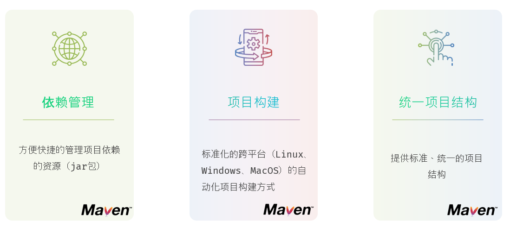

> ✅ **重点**：Maven 主要有 **三大作用** —— ① 依赖管理 ② 项目构建 ③ 统一项目结构。

### 1.2.1 依赖管理

**方便快捷的管理项目依赖的资源（jar 包），避免版本冲突问题。**

**1）使用 Maven 前**

我们项目中要想使用某一个 jar 包，就需要把这个 jar 包从官方网站下载下来，然后再导入到项目中。然后在这个项目中，就可以使用这个 jar 包了。

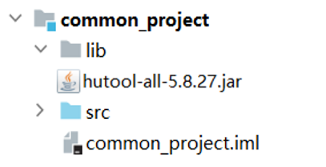

**2）使用 Maven 后**

当使用 Maven 进行项目依赖（jar 包）管理，则很方便的可以解决这个问题。我们只需要在 Maven 项目的 `pom.xml` 文件中，添加一段如下图所示的配置即可实现。

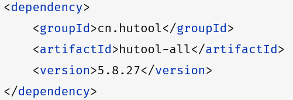

在 Maven 项目的配置文件中，加入上面这么一段配置信息之后，Maven 会自动的根据配置信息的描述，去下载对应的依赖。然后在项目中，就可以直接使用了。

### 1.2.2 项目构建


**Maven 还提供了标准化的、跨平台的自动化构建方式。**

如上图所示我们开发了一套系统，代码需要进行编译、测试、打包、发布等过程，这些操作是所有项目中都需要做的，如果需要反复进行就显得特别麻烦，而 Maven 提供了一套简单的命令来完成项目构建。

通过 Maven 中的命令，就可以很方便的完成项目的 **编译（compile）、测试（test）、打包（package）、发布（deploy）** 等操作。

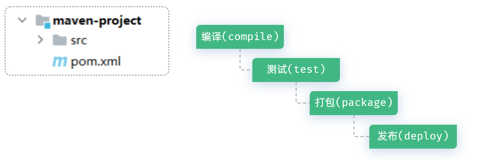

而且这些操作都是 **跨平台** 的，也就是说无论你是 Windows 系统，还是 Linux 系统，还是 Mac 系统，这些命令都是支持的。

### 1.2.3 统一项目结构

**Maven 还提供了标准、统一的项目结构。**

**1）未使用 Maven**

由于 Java 的开发工具呢，有很多，除了大家熟悉的 IDEA 以外，还有像早期的 Eclipse、MyEclipse。而不同的开发工具，创建出来的 Java 项目的目录结构是存在差异的，那这就会出现一个问题。

Eclipse 创建的 Java 项目，并不能直接导入 IDEA 中。IDEA 创建的 Java 项目，也没有办法直接导入到 Eclipse 中。

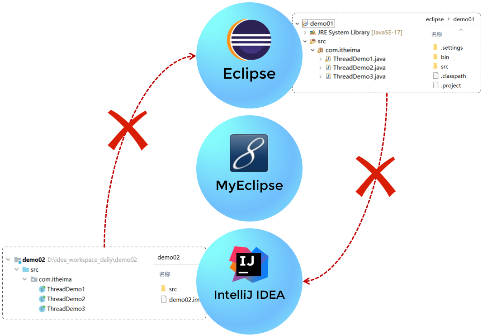

**2）使用 Maven**

而如果我们使用了 Maven 这一款项目构建工具，它给我们提供了一套标准的 Java 项目目录。如下所示：

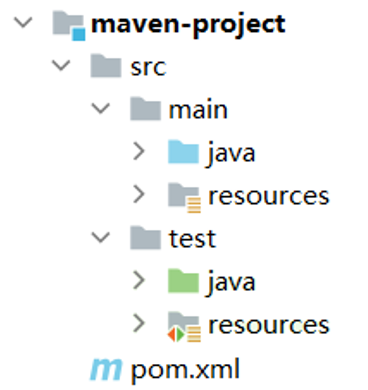

也就意味着，无论我们使用的是什么开发工具，只要是基于 Maven 构建的 Java 项目，最终的目录结构都是相同的，如图所示。那这样呢，我们使用 Eclipse、MyEclipse、IDEA 创建的 Maven 项目，就可以在各个开发工具直接导入使用了，更加方便、快捷。

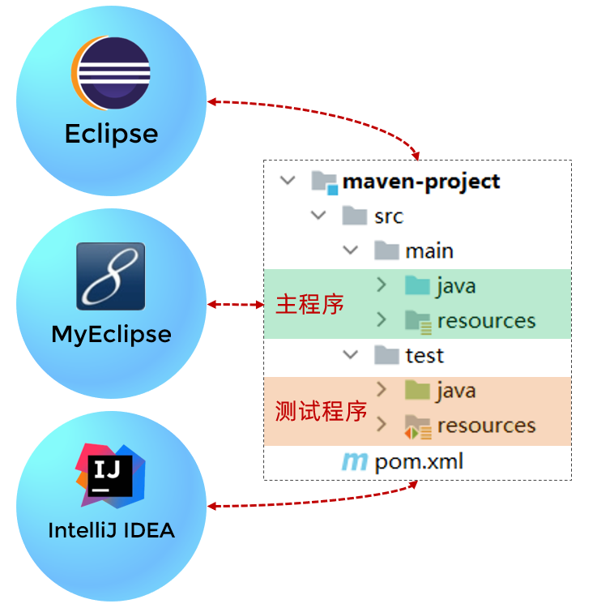

而在上面的 Maven 项目的目录结构中：

- `main` 目录下存放的是项目的 **源代码**；
- `test` 目录下存放的是项目的 **测试代码**；
- 无论是在 `main` 还是在 `test` 下，都有两个目录：一个是 `java`，用来存放源代码文件；另一个是 `resources`，用来存放配置文件。

> ✅ **一句话总结**：**Maven 就是一款管理和构建 Java 项目的工具。**

> 📌 **课程说明**：Maven 的内容进行了分层的设计和讲解，分为两个部分 —— **Maven 核心** 和 **Maven 进阶**。今天我们先来讲解 Maven 核心部分的内容，在 Web 开发的最后，我们再来讲解 Maven 进阶部分的内容。

---

# 2. Maven 概述

## 2.1 Maven 介绍

**Apache Maven 是一个项目管理和构建工具**，它基于项目对象模型（Project Object Model，简称：POM）的概念，通过一小段描述信息来管理项目的构建、报告和文档。

> 官网：https://maven.apache.org/

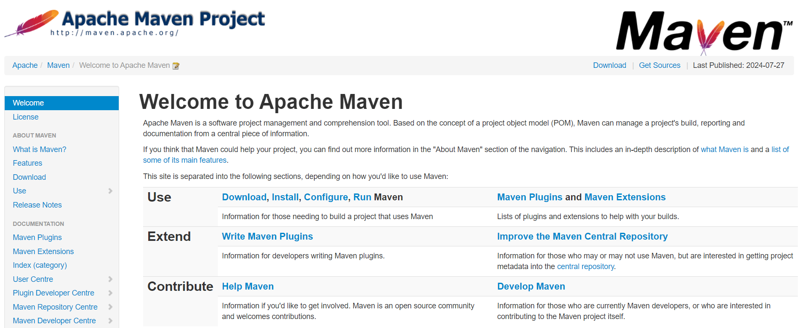

**Maven 的作用：**

1. 方便的依赖管理
2. 统一的项目结构
3. 标准的项目构建流程

## 2.2 Maven 模型

Maven 模型包含以下三大部分：

- **项目对象模型（Project Object Model）**
- **依赖管理模型（Dependency）**
- **构建生命周期 / 阶段（Build lifecycle & phases）**

**1）构建生命周期 / 阶段（Build lifecycle & phases）**

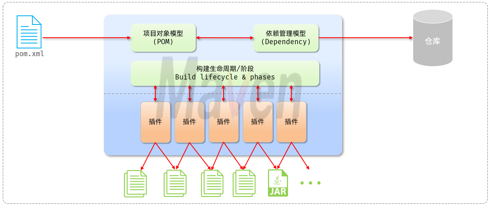

以上图中紫色框起来的部分，就是用来完成 **标准化构建流程**。当我们需要编译，Maven 提供了一个编译插件供我们使用；当我们需要打包，Maven 就提供了一个打包插件供我们使用等。

**2）项目对象模型（Project Object Model）**

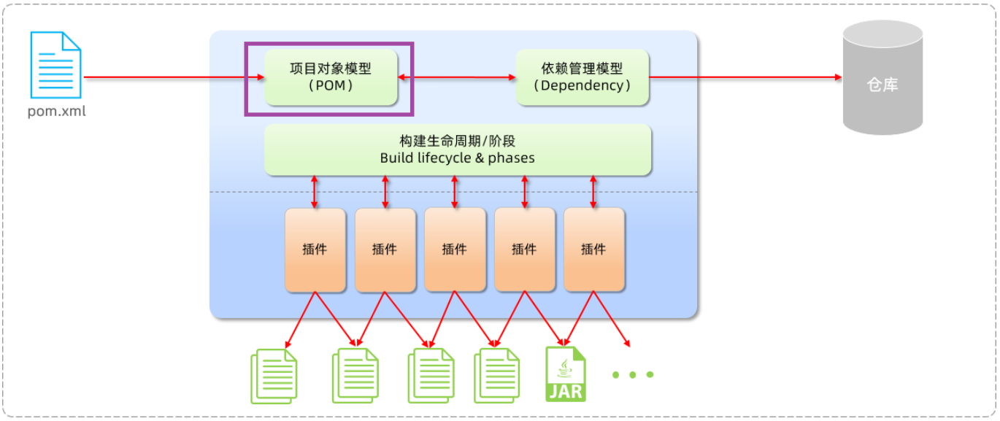

以上图中紫色框起来的部分属于 **项目对象模型**，就是将我们自己的项目抽象成一个对象模型，有自己专属的坐标，如下图所示是一个 Maven 项目：

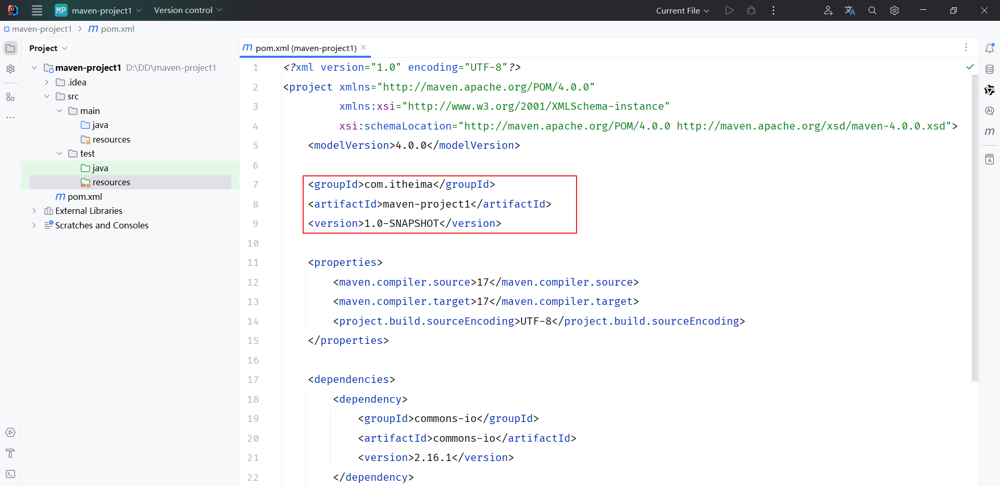

> ✅ **重点 —— 坐标**：坐标，就是资源（jar 包）的唯一标识，通过坐标可以定位到所需资源（jar 包）位置。

**坐标的组成部分：**

- `groupId`：组织名
- `artifactId`：模块名
- `version`：版本号

**3）依赖管理模型（Dependency）**

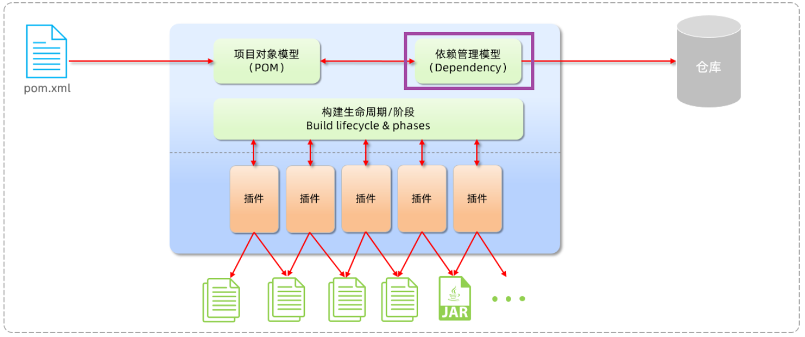

以上图中紫色框起来的部分属于 **依赖管理模型**，是使用坐标来描述当前项目依赖哪些第三方 jar 包。

之前我们项目中需要 jar 包时，直接就把 jar 包复制到项目下的 `lib` 目录，而现在我们只需要在 `pom.xml` 中配置依赖的配置文件即可。

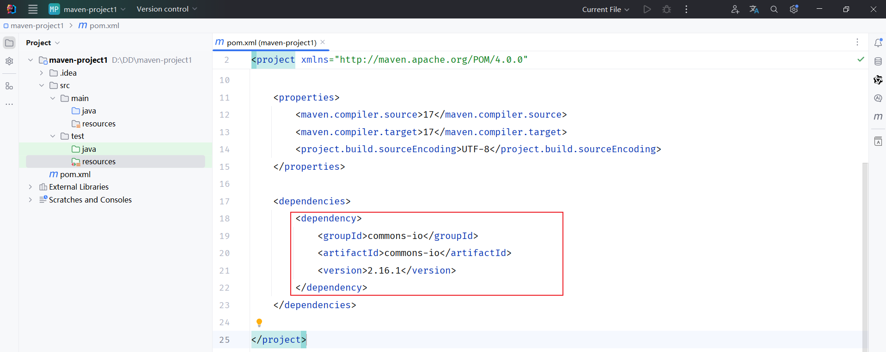

而这个依赖对应的 jar 包其实就在我们本地电脑上的 Maven 仓库中。如下图，就是老师本地的 Maven 仓库中的 jar 文件：

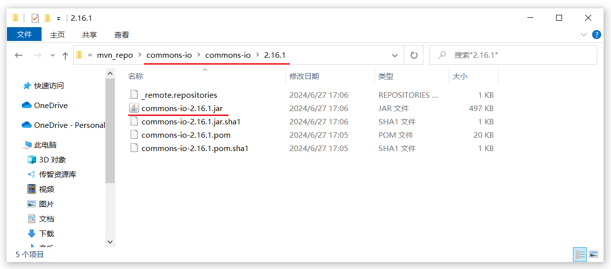

## 2.3 Maven 仓库

**仓库**：用于存储资源，管理各种 jar 包。

仓库的本质就是一个 **目录（文件夹）**，这个目录被用来存储开发中所有依赖（就是 jar 包）和插件。

**Maven 仓库分为：**

- **本地仓库**：自己计算机上的一个目录（用来存储 jar 包）。
- **中央仓库**：由 Maven 团队维护的全球唯一的仓库。仓库地址：https://repo1.maven.org/maven2/
- **远程仓库（私服）**：一般由公司团队搭建的私有仓库。

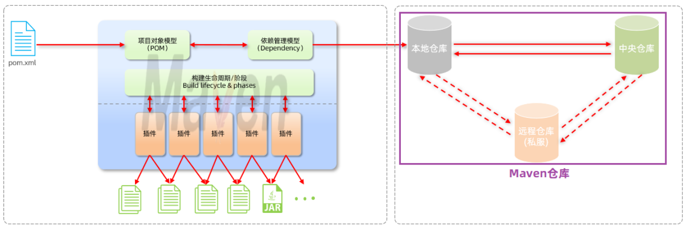

> ✅ **重点 —— jar 包查找顺序**
>
> 当项目中使用坐标引入对应依赖 jar 包后：
> - 首先会查找 **本地仓库** 中是否有对应的 jar 包：
>   - 如果有，则在项目直接引用；
>   - 如果没有，则去 **中央仓库** 中下载对应的 jar 包到本地仓库。
> - 如果还搭建了远程仓库（私服），将来 jar 包的查找顺序则变为：**本地仓库 → 远程仓库 → 中央仓库**。

## 2.4 Maven 安装

认识了 Maven 后，我们就要开始使用 Maven 了，那么首先我们要进行 Maven 的下载与安装。

### 2.4.1 下载

- 下载地址：https://maven.apache.org/download.cgi
- 在提供的资料中，已经提供了下载好的安装包。如下：

> 📎 **附件**：`apache-maven-3.9.4-bin.zip`（9.00 MB）

### 2.4.2 安装步骤

> ✅ **Maven 安装配置步骤（共 4 步）**
> 1. 解压安装
> 2. 配置仓库
> 3. 配置阿里云私服
> 4. 配置 Maven 环境变量

**1）解压 `apache-maven-3.9.4-bin.zip`（解压即安装）**

> ⚠️ **建议解压到没有中文、特殊字符的路径下。** 如课程中解压到 `E:\develop` 下。

解压缩后的目录结构如下：

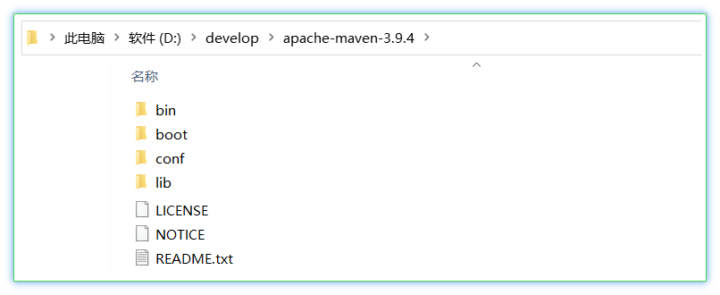

- **`bin` 目录**：存放的是可执行命令。（`mvn` 命令重点关注）
- **`conf` 目录**：存放 Maven 的配置文件。（`settings.xml` 配置文件后期需要修改）
- **`lib` 目录**：存放 Maven 依赖的 jar 包。（Maven 也是使用 Java 开发的，所以它也依赖其他的 jar 包）

**2）配置本地仓库**

① 在自己计算机上新建一个目录（本地仓库，用来存储 jar 包）。

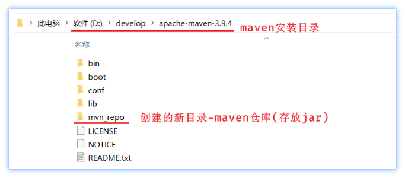

② 进入到 `conf` 目录下修改 `settings.xml` 配置文件：

- a. 使用超级记事本软件，打开 `settings.xml` 文件，定位到 **53 行**；
- b. 复制 `<localRepository>` 标签，粘贴到注释的外面（**55 行**）；
- c. 复制之前新建的用来存储 jar 包的路径，替换掉 `<localRepository>` 标签体内容。

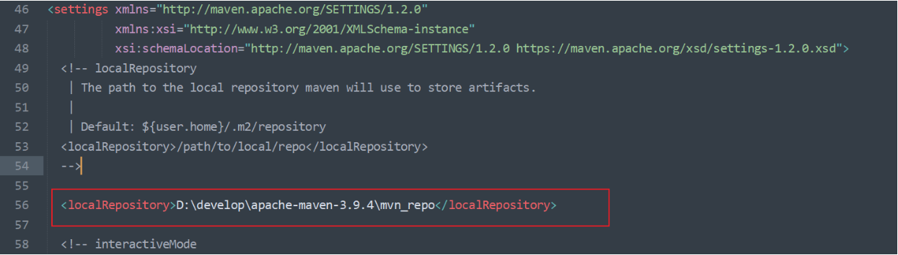

**3）配置阿里云私服**

由于中央仓库在国外，所以下载 jar 包速度可能比较慢，而阿里公司提供了一个远程仓库，里面基本也都有开源项目的 jar 包。

进入到 `conf` 目录下修改 `settings.xml` 配置文件：

1. 使用超级记事本软件，打开 `settings.xml` 文件，定位到 **160 行左右**；
2. 在 `<mirrors>` 标签下为其添加子标签 `<mirror>`，内容如下：

```xml
<mirror>
    <id>alimaven</id>
    <name>aliyun maven</name>
    <url>http://maven.aliyun.com/nexus/content/groups/public/</url>
    <mirrorOf>central</mirrorOf>
</mirror>
```

> ⚠️ **注意配置的位置**：在 `<mirrors>` ... `</mirrors>` 中间添加配置。如下图所示：

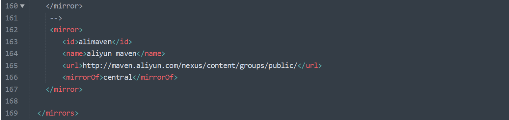

**4）配置环境变量**

Maven 环境变量的配置类似于 JDK 环境变量配置一样。

① 在 **系统变量** 处新建一个变量 `MAVEN_HOME`。`MAVEN_HOME` 环境变量的值，设置为 Maven 的解压安装目录。

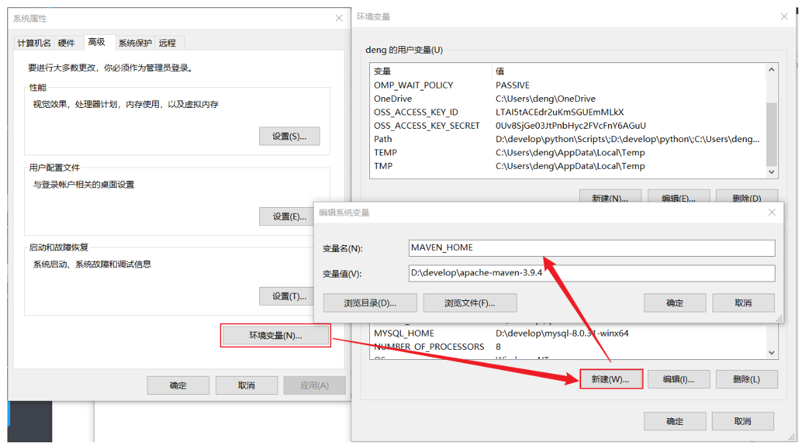

② 在 `Path` 中进行配置。`PATH` 环境变量的值，设置为：`%MAVEN_HOME%\bin`。

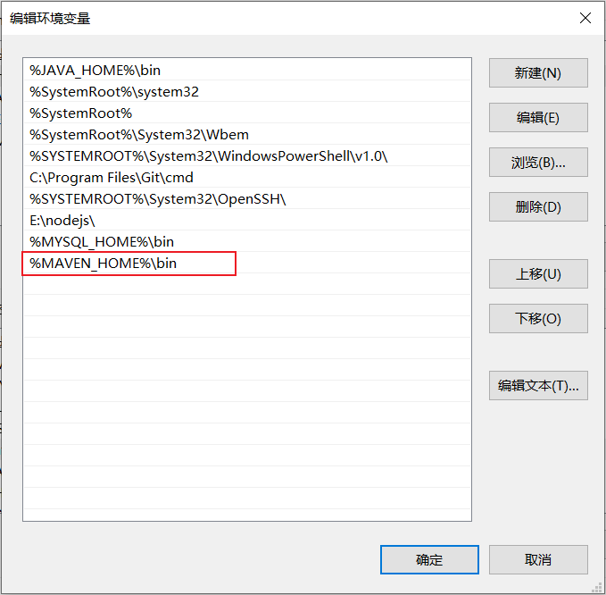

③ 打开 DOS 命令提示符进行验证，出现如图所示表示安装成功。命令为：`mvn -v`

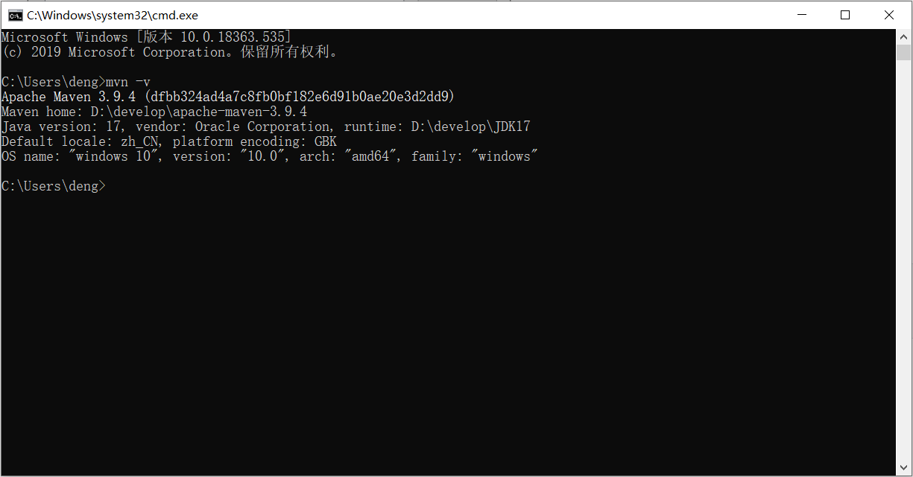

**5）配置关联的 JDK 版本（可选）**

进入到 `conf` 目录下修改 `settings.xml` 配置文件，在 `<profiles>` `</profiles>` 中增加如下配置：

```xml
<profile>
    <id>jdk-17</id>
    <activation>
        <activeByDefault>true</activeByDefault>
        <jdk>17</jdk>
    </activation>
    <properties>
        <maven.compiler.source>17</maven.compiler.source>
        <maven.compiler.target>17</maven.compiler.target>
        <maven.compiler.compilerVersion>17</maven.compiler.compilerVersion>
    </properties>
</profile>
```

---

# 3. IDEA 集成 Maven

我们要想在 IDEA 中使用 Maven 进行项目构建，就需要在 IDEA 中集成 Maven，那么就需要在 IDEA 中配置与 Maven 的关联。

## 3.1 创建 Maven 项目

### 3.1.1 全局设置

**① 进入 IDEA 的欢迎页面**

选择 IDEA 中 `File` => `close project` => `Customize` => `All settings`。

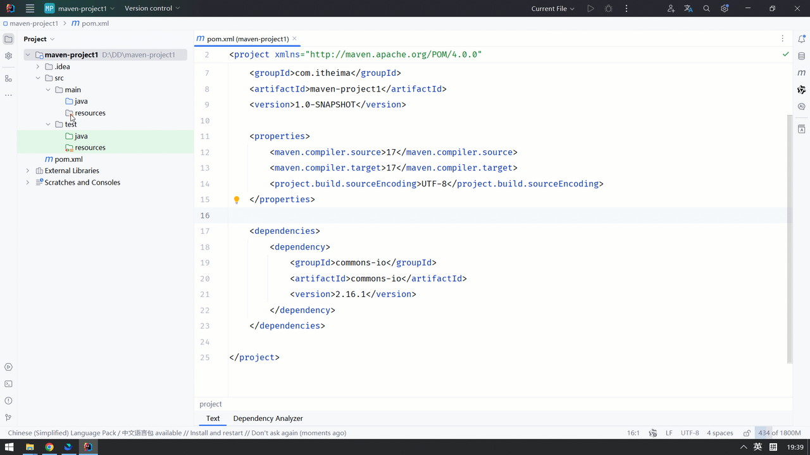

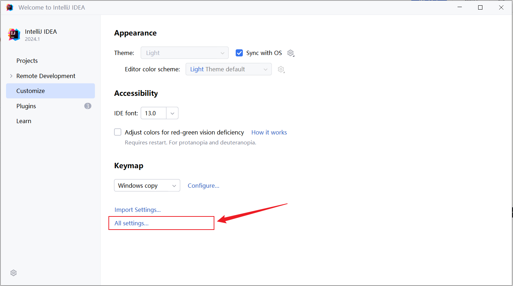

**② 打开 All settings**，选择 `Build, Execution, Deployment` => `Build Tools` => `Maven`。

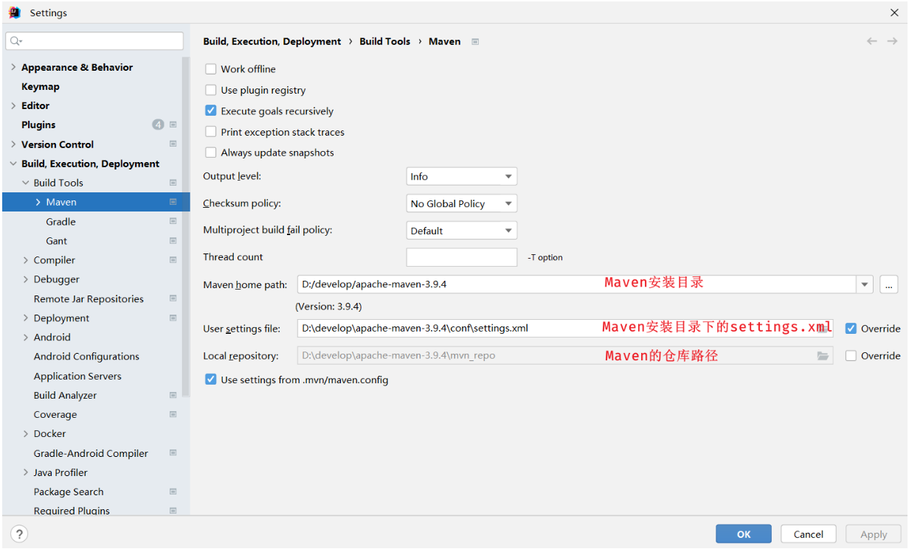

**③ 配置工程的编译版本为 17。**

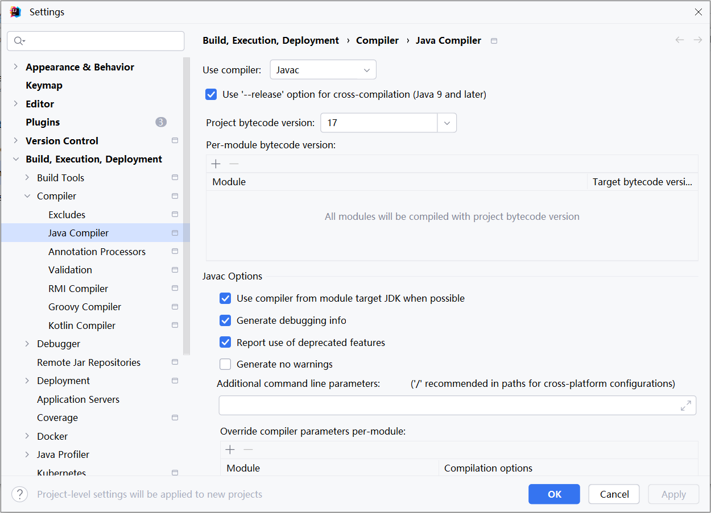

> 📌 **说明**：这里所设置的 Maven 的环境信息，并未指定任何一个 project，此时设置的信息就属于 **全局配置信息**。以后我们再创建 project，默认就是使用我们全局配置的信息。

### 3.1.2 创建项目

**① 创建一个空项目，命名为 `web-project01`。**

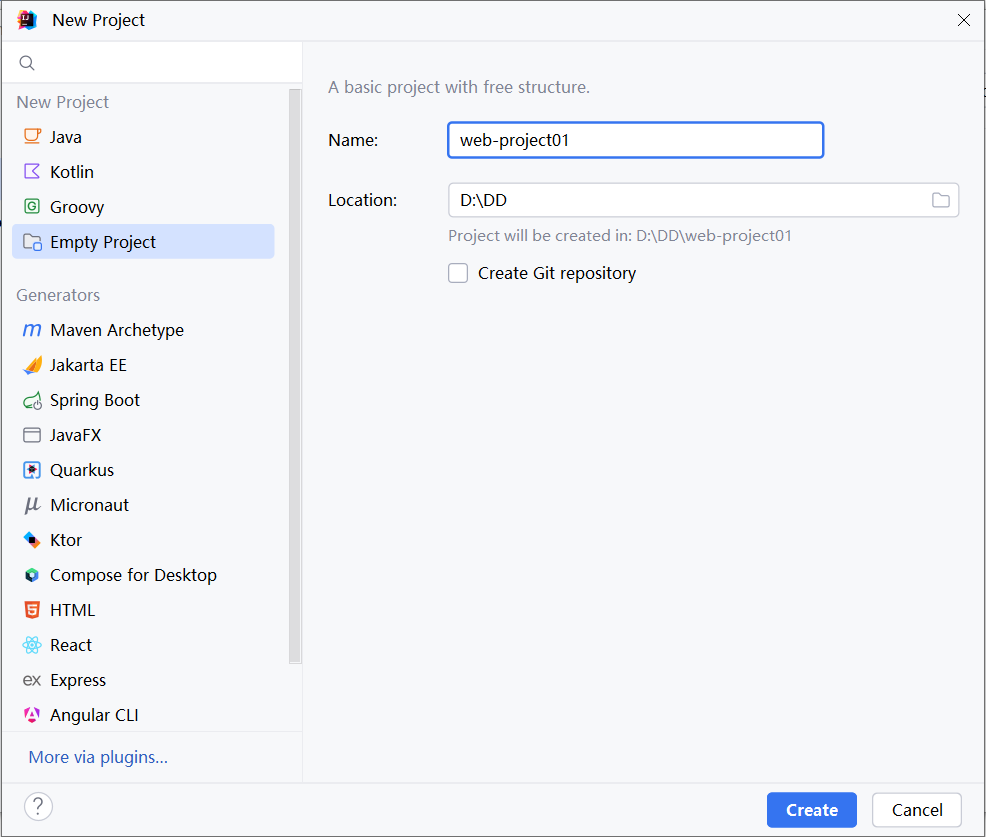

**② 创建好项目之后，进入项目中，要设置 JDK 的版本号。** 选择小齿轮，选择 `Project Structure`。

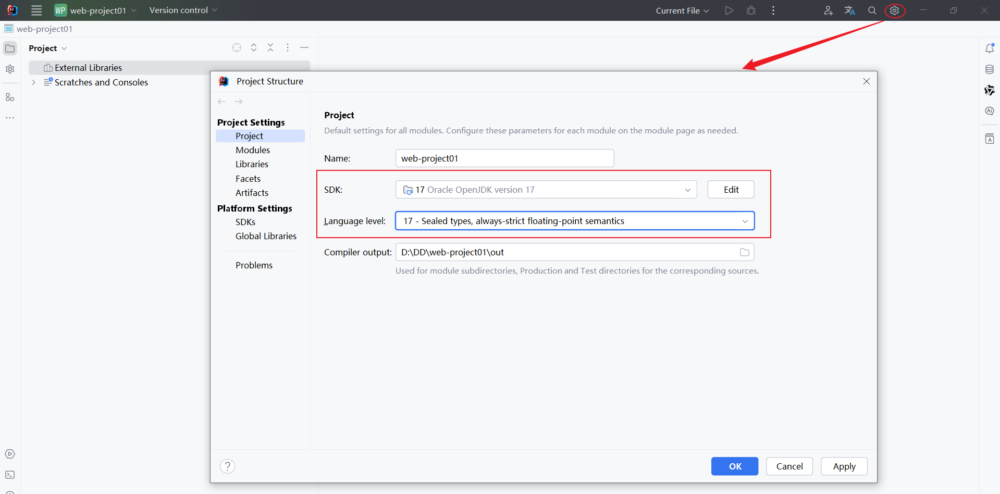

**③ 创建模块，选择 Java 语言，选择 Maven，填写模块的基本信息。**

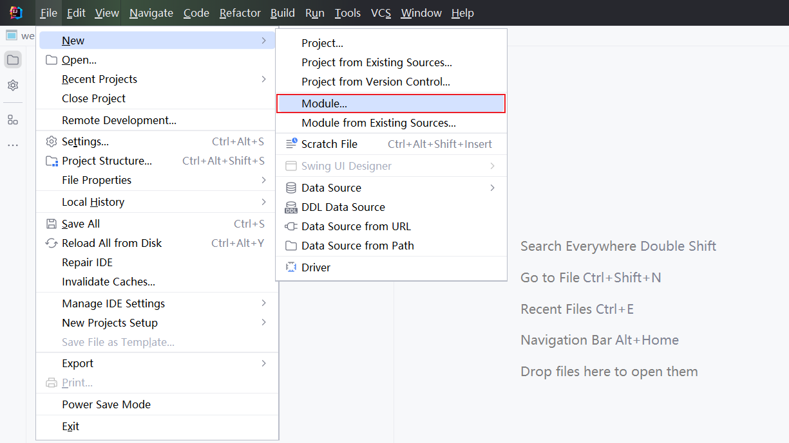

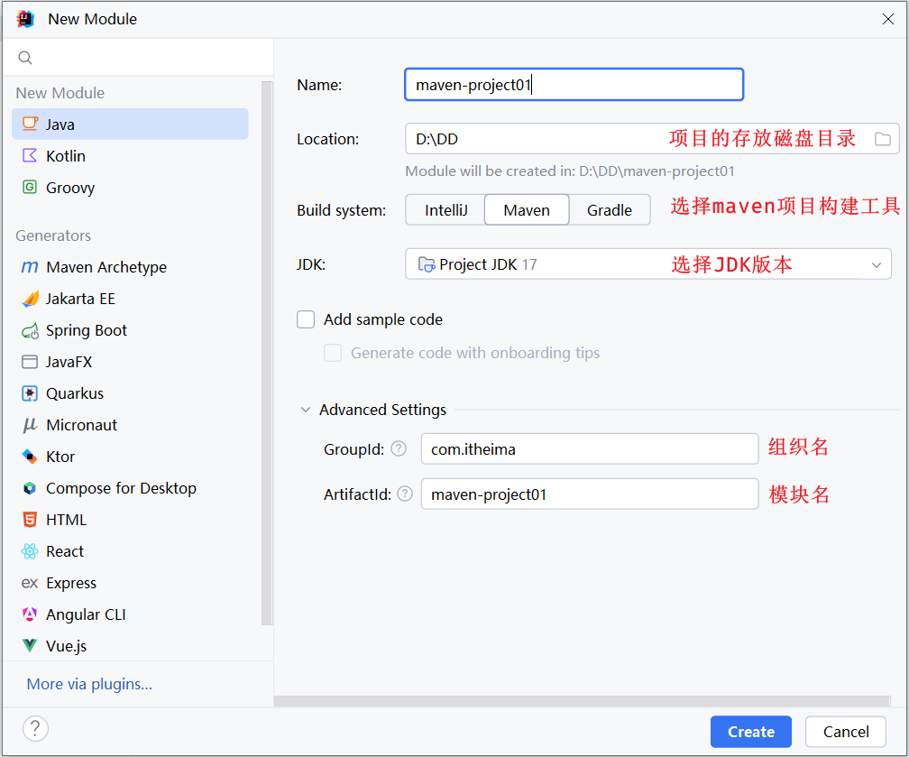

**④ 在 Maven 项目中，创建 `HelloWorld` 类，并运行。**

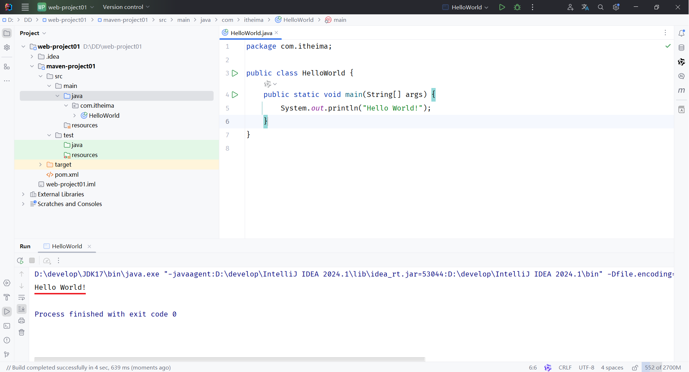

> 📌 **Maven 项目的目录结构：**
>
> ```
> maven-project01
> |--- src                 (源代码目录和测试代码目录)
>     |--- main            (源代码目录)
>         |--- java        (源代码 java 文件目录)
>         |--- resources   (源代码配置文件目录)
>     |--- test            (测试代码目录)
>         |--- java        (测试代码 java 目录)
>         |--- resources   (测试代码配置文件目录)
> |--- target              (编译、打包生成文件存放目录)
> ```

### 3.1.3 pom 文件详解

**POM（Project Object Model）**：指的是项目对象模型，用来描述当前的 Maven 项目。

- 使用 `pom.xml` 文件来描述当前项目。`pom.xml` 文件如下：

```xml
<?xml version="1.0" encoding="UTF-8"?>
<project xmlns="http://maven.apache.org/POM/4.0.0"
         xmlns:xsi="http://www.w3.org/2001/XMLSchema-instance"
         xsi:schemaLocation="http://maven.apache.org/POM/4.0.0 http://maven.apache.org/xsd/maven-4.0.0.xsd">
    <!-- POM 模型版本 -->
    <modelVersion>4.0.0</modelVersion>

    <!-- 当前项目坐标 -->
    <groupId>com.itheima</groupId>
    <artifactId>maven-project01</artifactId>
    <version>1.0-SNAPSHOT</version>

    <!-- 项目的 JDK 版本及编码 -->
    <properties>
        <maven.compiler.source>17</maven.compiler.source>
        <maven.compiler.target>17</maven.compiler.target>
        <project.build.sourceEncoding>UTF-8</project.build.sourceEncoding>
    </properties>

</project>
```

**pom 文件详解：**

- `<project>`：pom 文件的根标签，表示当前 Maven 项目。
- `<modelVersion>`：声明项目描述遵循哪一个 POM 模型版本。
  - 虽然模型本身的版本很少改变，但它仍然是必不可少的。目前 POM 模型版本是 `4.0.0`。
- **坐标**：
  - `<groupId>` `<artifactId>` `<version>`
  - 定位项目在本地仓库中的位置，由以上三个标签组成一个坐标。
- `<maven.compiler.source>`：编译 JDK 的版本。
- `<maven.compiler.target>`：运行 JDK 的版本。
- `<project.build.sourceEncoding>`：设置项目的字符集。

## 3.2 Maven 坐标

**什么是坐标？**

- Maven 中的坐标是 **资源的唯一标识**，通过该坐标可以唯一定位资源位置。
- 使用坐标来定义项目或引入项目中需要的依赖。

> ✅ **重点 —— Maven 坐标主要组成：**
>
> - **`groupId`**：定义当前 Maven 项目隶属组织名称（通常是域名反写，例如：`com.itheima`）。
> - **`artifactId`**：定义当前 Maven 项目名称（通常是模块名称，例如 `order-service`、`goods-service`）。
> - **`version`**：定义当前项目版本号。
>   - `SNAPSHOT`：功能不稳定、尚处于开发中的版本，即 **快照版本**。
>   - `RELEASE`：功能趋于稳定、当前更新停止，可以用于发行的版本。

如下图就是使用坐标表示一个项目：

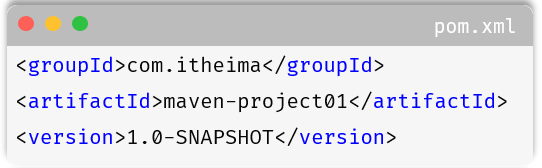

> ⚠️ **注意：**
> - 上面所说的资源可以是 **插件、依赖、当前项目**。
> - 我们的项目如果被其他的项目依赖时，也是需要坐标来引入的。

## 3.3 导入 Maven 项目

在 IDEA 中导入 Maven 项目，有两种方式。

**方式一**：`File` -> `Project Structure` -> `Modules` -> `Import Module` -> 选择 Maven 项目的 `pom.xml`。

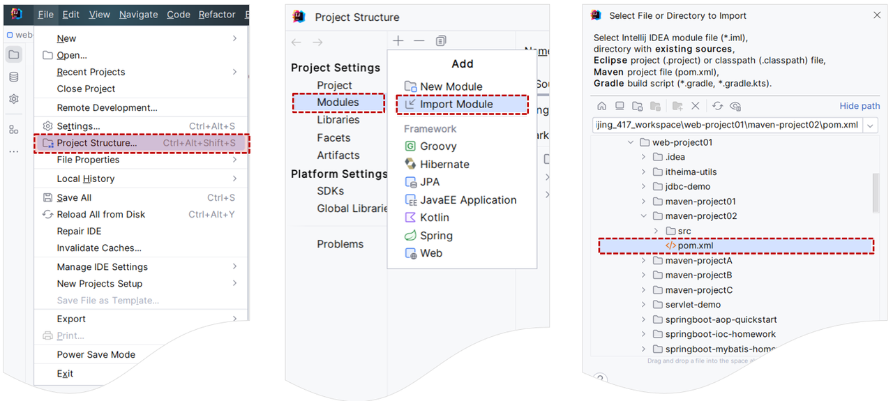

**方式二**：Maven 面板 -> `+`（Add Maven Projects）-> 选择 Maven 项目的 `pom.xml`。

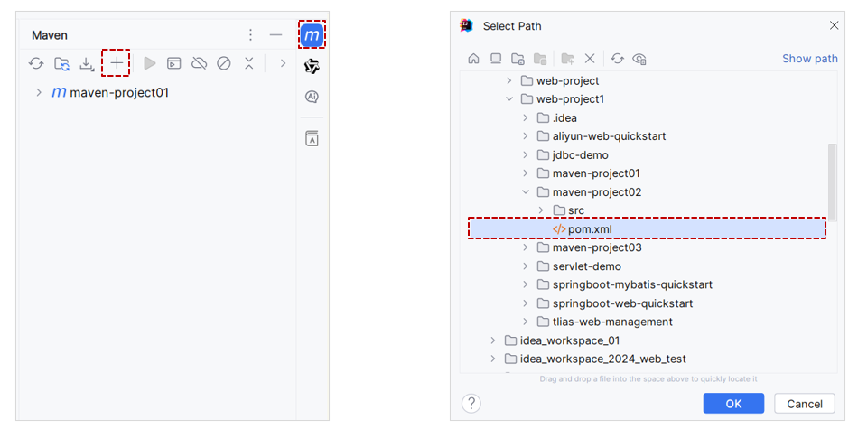

---

# 4. 依赖管理

## 4.1 依赖配置

### 4.1.1 基本配置

**依赖**：指当前项目运行所需要的 jar 包。一个项目中可以引入多个依赖。

例如：在当前工程中，我们需要用到 logback 来记录日志，此时就可以在 Maven 工程的 `pom.xml` 文件中，引入 logback 的依赖。具体步骤如下：

1. 在 `pom.xml` 中编写 `<dependencies>` 标签；
2. 在 `<dependencies>` 标签中使用 `<dependency>` 引入坐标；
3. 定义坐标的 `groupId`、`artifactId`、`version`。

```xml
<dependencies>
    <!-- 依赖 : spring-context -->
    <dependency>
        <groupId>org.springframework</groupId>
        <artifactId>spring-context</artifactId>
        <version>6.1.4</version>
    </dependency>
</dependencies>
```

4. 点击 **刷新按钮**，引入最新加入的坐标。

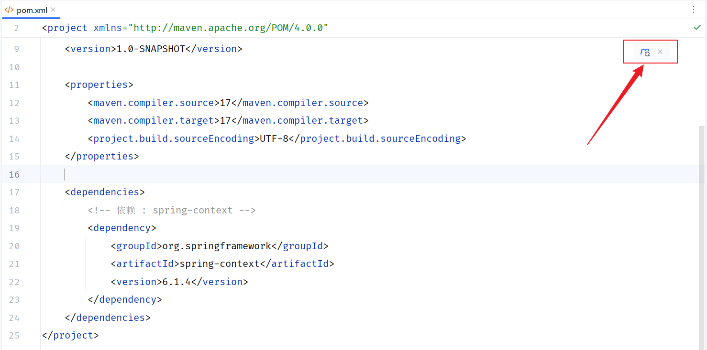

> **刷新依赖**：保证每一次引入新的依赖，或者修改现有的依赖配置，都可以加入最新的坐标。

> 📌 **注意事项：**
> 1. 如果引入的依赖，在本地仓库中不存在，将会连接远程仓库 / 中央仓库，然后下载依赖（这个过程会比较耗时，耐心等待）。
> 2. 如果不知道依赖的坐标信息，可以到 mvn 的中央仓库（https://mvnrepository.com/）中搜索。

### 4.1.2 查找依赖

**1）利用中央仓库搜索的依赖坐标**，以常见的 `logback-classic` 为例。

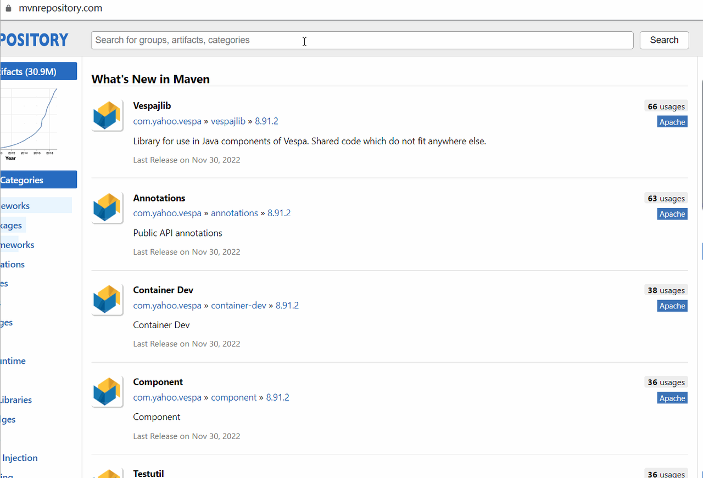

**2）利用 IDEA 工具搜索依赖**，以常见的 `logback-classic` 为例。

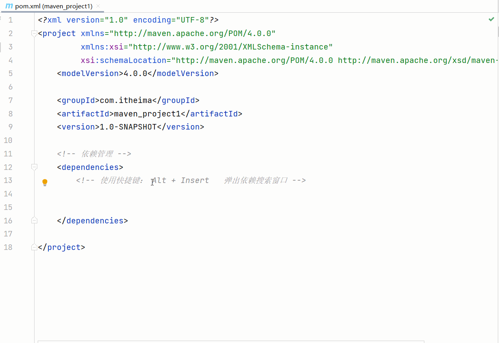

**3）熟练上手 Maven 后，快速导入依赖**，以常见的 `logback-classic` 为例。

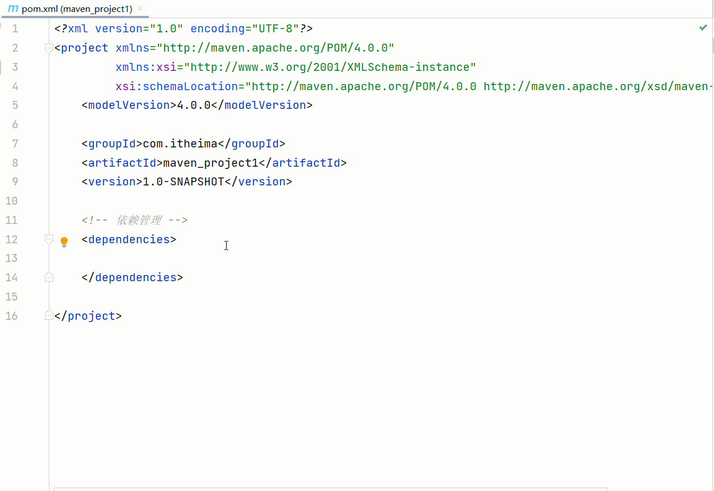

### 4.1.3 依赖传递

我们上面在 `pom.xml` 中配置了一项依赖，就是 `spring-context`，但是我们通过右侧的 Maven 面板可以看到，其实引入进来的依赖，并不是这一项，有非常多的依赖，都引入进来了。我们可以看到如下图所示：

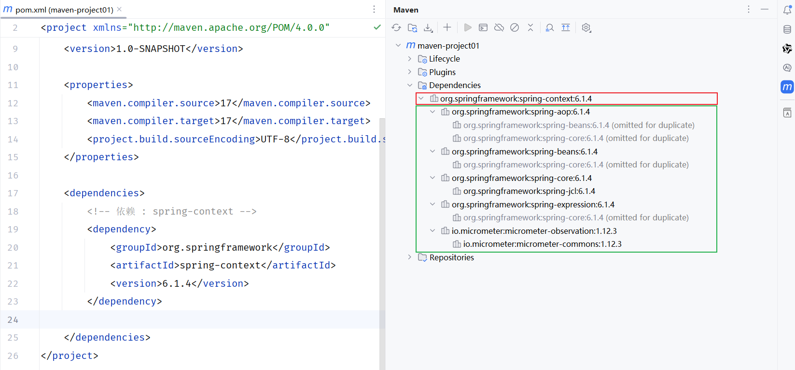

为什么会出现这样的现象呢？那这里呢，就涉及到 Maven 中非常重要的一个特性，那就是 Maven 中的 **依赖传递**。

> ✅ **重点 —— 什么是依赖传递**
>
> 所谓 Maven 的依赖传递，指的就是如果在 Maven 项目中，A 依赖了 B，B 依赖了 C，C 依赖了 D，那么在 A 项目中，也会有 C、D 依赖，**因为依赖会传递**。

那如果，传递下来的依赖，在项目开发中，我们确实不需要，此时，我们可以通过 Maven 中的 **排除依赖** 功能，来将这个依赖排除掉。

### 4.1.4 排除依赖

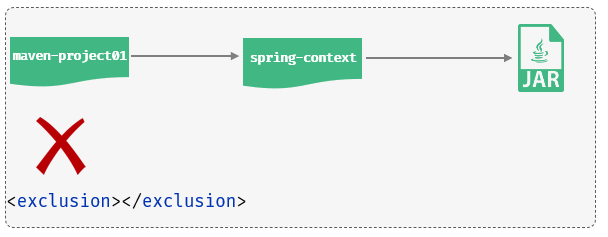

**排除依赖**：指主动断开依赖的资源，**被排除的资源无需指定版本**。

配置形式如下：

```xml
<dependency>
    <groupId>org.springframework</groupId>
    <artifactId>spring-context</artifactId>
    <version>6.1.4</version>

    <!-- 排除依赖, 主动断开依赖的资源 -->
    <exclusions>
        <exclusion>
            <groupId>io.micrometer</groupId>
            <artifactId>micrometer-observation</artifactId>
        </exclusion>
    </exclusions>
</dependency>
```

**依赖排除示例：**

1. 默认通过 Maven 的依赖传递，传递下来了 `micrometer-observation` 的依赖。

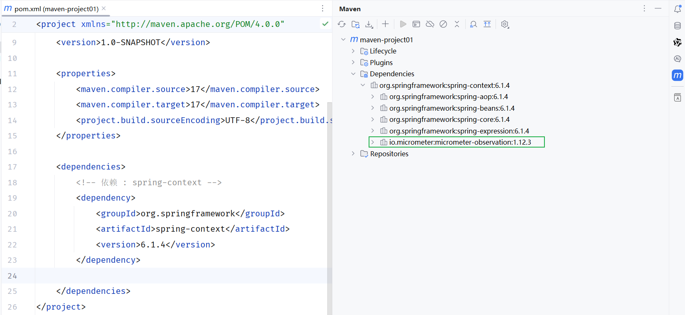

2. 加入排除依赖的配置之后，该依赖就被排除掉了。

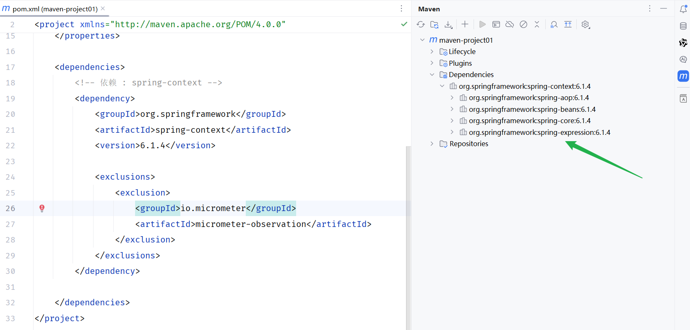

## 4.2 生命周期

### 4.2.1 介绍

**Maven 的生命周期就是为了对所有的构建过程进行抽象和统一。** 描述了一次项目构建，经历哪些阶段。

在 Maven 出现之前，项目构建的生命周期就已经存在，软件开发人员每天都在对项目进行清理、编译、测试及部署。虽然大家都在不停地做构建工作，但公司和公司间、项目和项目间，往往使用不同的方式做类似的工作。

Maven 从大量项目和构建工具中学习和反思，然后总结了一套高度完美的、易扩展的项目构建生命周期。这个生命周期包含了项目的清理、初始化、编译、测试、打包、集成测试、验证、部署和站点生成等几乎所有构建步骤。

> ✅ **重点 —— Maven 对项目构建的生命周期划分为 3 套（相互独立）：**
>
> - **`clean`**：清理工作。
> - **`default`**：核心工作。如：编译、测试、打包、安装、部署等。
> - **`site`**：生成报告、发布站点等。

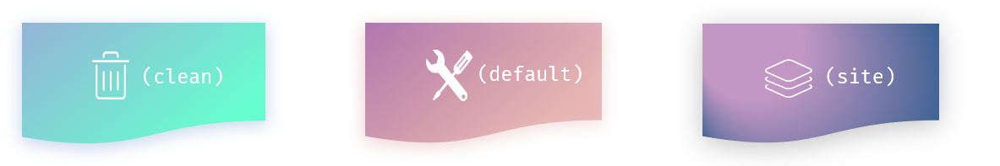

三套生命周期又包含哪些具体的阶段呢，我们来看下面这幅图：

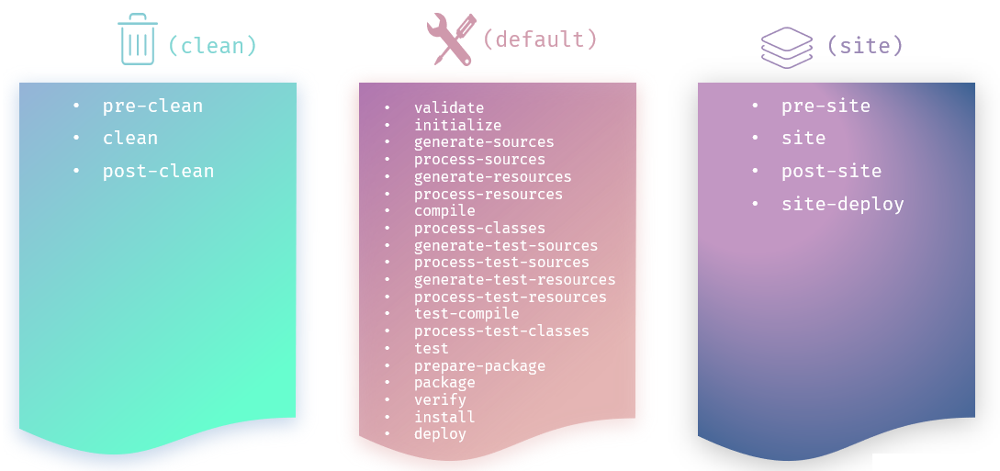

每套生命周期包含一些阶段（phase），**阶段是有顺序的，后面的阶段依赖于前面的阶段。**

我们看到这三套生命周期，里面有很多很多的阶段，这么多生命周期阶段，其实我们常用的并不多，主要关注以下几个：

| 阶段 | 说明 |
| --- | --- |
| `clean` | 移除上一次构建生成的文件 |
| `compile` | 编译项目源代码 |
| `test` | 使用合适的单元测试框架运行测试（junit） |
| `package` | 将编译后的文件打包，如：jar、war 等 |
| `install` | 安装项目到本地仓库 |

Maven 的生命周期是 **抽象** 的，这意味着生命周期本身不做任何实际工作。在 Maven 的设计中，实际任务（如源代码编译）都交由 **插件** 来完成。

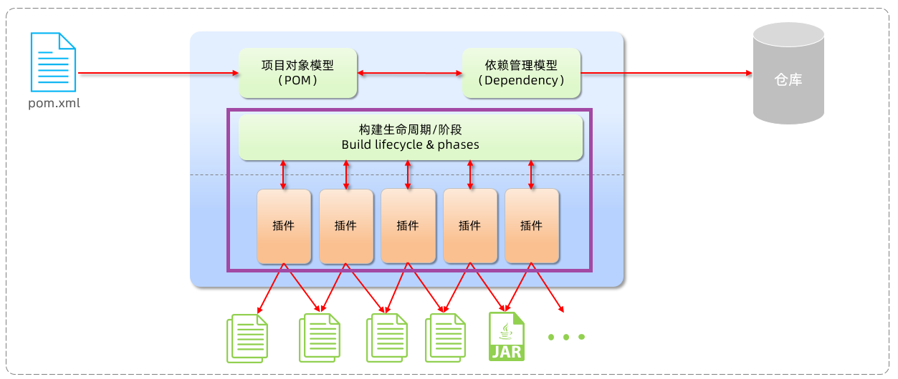

IDEA 工具为了方便程序员使用 Maven 生命周期，在右侧的 Maven 工具栏中，已给出快速访问通道。

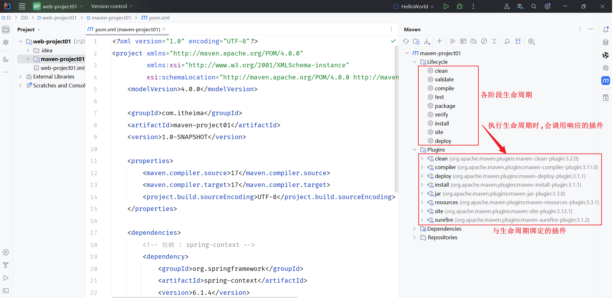

- 生命周期的顺序是：`clean` → `validate` → `compile` → `test` → `package` → `verify` → `install` → `site` → `deploy`
- 我们需要关注的就是：`clean` → `compile` → `test` → `package` → `install`

> 📌 **说明**：在同一套生命周期中，我们在执行后面的生命周期时，前面的生命周期都会执行。

> 📌 **思考**：当运行 `package` 生命周期时，`clean`、`compile` 生命周期会不会运行？
>
> **答**：`clean` 不会运行，`compile` 会运行。因为 `compile` 与 `package` 属于同一套生命周期，而 `clean` 与 `package` 不属于同一套生命周期。

### 4.2.2 执行

在日常开发中，当我们要执行指定的生命周期时，有两种执行方式：

1. 在 IDEA 工具右侧的 Maven 工具栏中，选择对应的生命周期，双击执行；
2. 在 DOS 命令行中，通过 Maven 命令执行。

**方式一：在 IDEA 中执行生命周期**

- 选择对应的生命周期，双击执行。

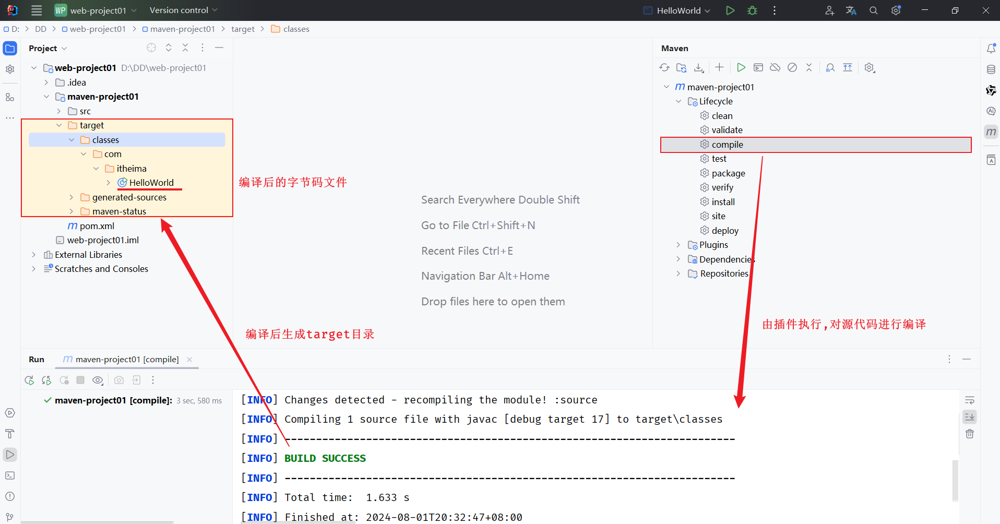

其他的生命周期都是类似的道理，双击运行即可。

**方式二：在命令行中执行生命周期**

1. 打开 Maven 项目对应的磁盘目录。

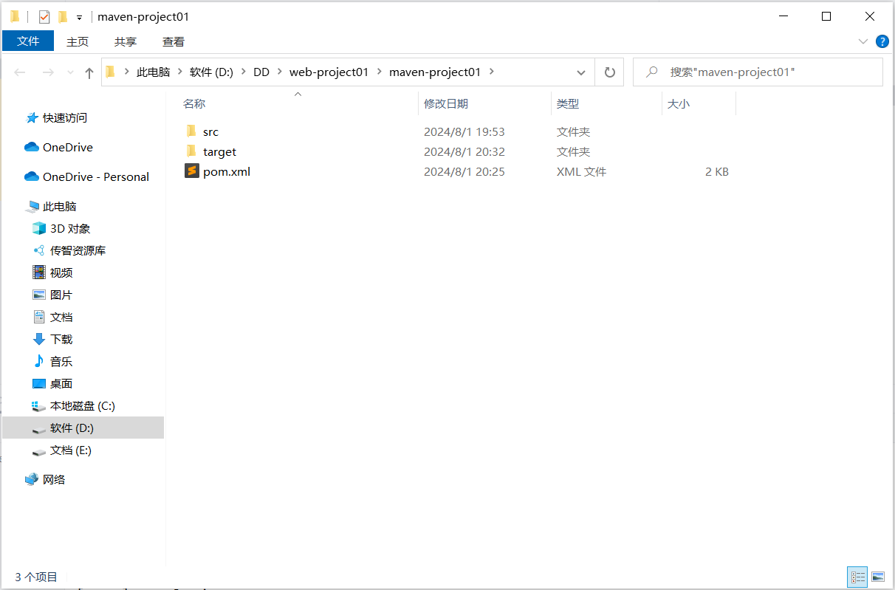

2. 在当前目录下打开 CMD。

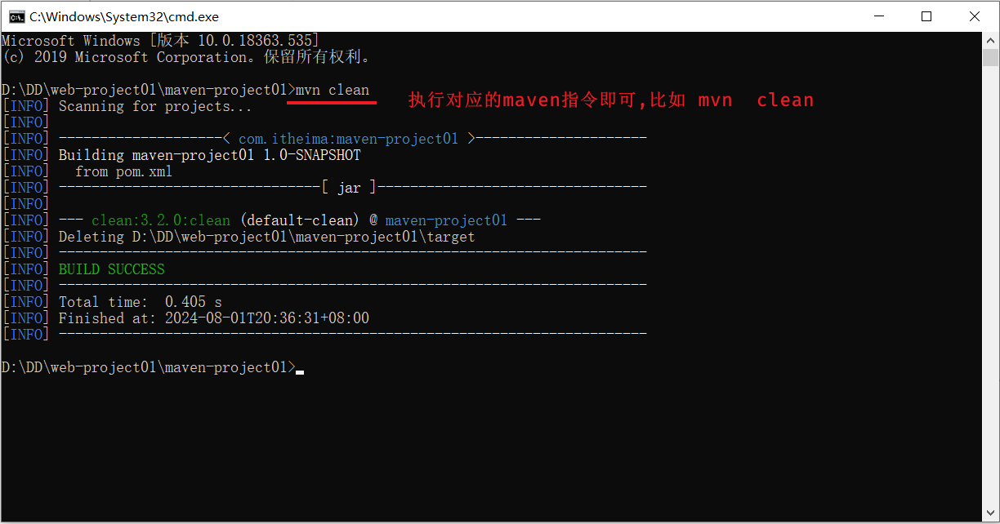

类似的道理，我们也可以在命令行执行：

- `mvn compile`
- `mvn test`
- `mvn package`
- `mvn install`

---

# 5. 单元测试

## 5.1 介绍

**测试**：是一种用来促进鉴定软件的正确性、完整性、安全性和质量的过程。

> ✅ **阶段划分**：单元测试、集成测试、系统测试、验收测试。


**1）单元测试**

- **介绍**：对软件的基本组成单位进行测试，最小测试单位。
- **目的**：检验软件基本组成单位的正确性。
- **测试人员**：开发人员。

**2）集成测试**

- **介绍**：将已分别通过测试的单元，按设计要求组合成系统或子系统，再进行的测试。
- **目的**：检查单元之间的协作是否正确。
- **测试人员**：开发人员。

**3）系统测试**

- **介绍**：对已经集成好的软件系统进行彻底的测试。
- **目的**：验证软件系统的正确性、性能是否满足指定的要求。
- **测试人员**：测试人员。

**4）验收测试**

- **介绍**：交付测试，是针对用户需求、业务流程进行的正式的测试。
- **目的**：验证软件系统是否满足验收标准。
- **测试人员**：客户 / 需求方。

> ✅ **测试方法**：白盒测试、黑盒测试 及 灰盒测试。

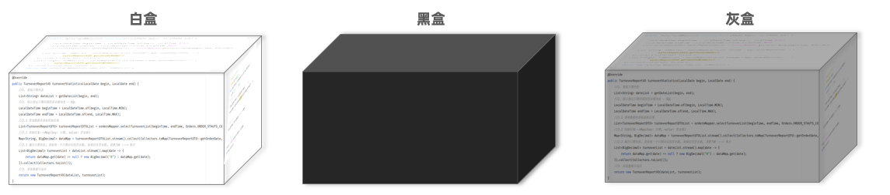

**1）白盒测试**

- 清楚软件内部结构、代码逻辑。
- 用于验证代码、逻辑正确性。

**2）黑盒测试**

- 不清楚软件内部结构、代码逻辑。
- 用于验证软件的功能、兼容性、验收测试等方面。

**3）灰盒测试**

- 结合了白盒测试和黑盒测试的特点，既关注软件的内部结构又考虑外部表现（功能）。


## 5.2 Junit 入门

### 5.2.1 单元测试

- **单元测试**：就是针对最小的功能单元（方法），编写测试代码对其正确性进行测试。
- **JUnit**：最流行的 Java 测试框架之一，提供了一些功能，方便程序进行单元测试（第三方公司提供）。

在之前的课程中，我们进行程序的测试，都是 `main` 方法中进行测试。如下图所示：

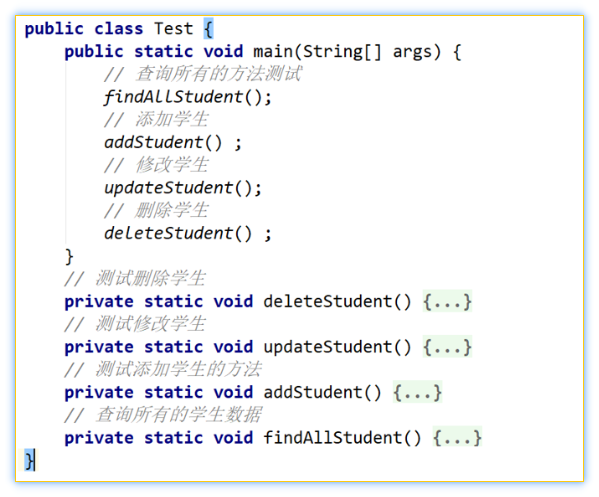

通过 `main` 方法是可以进行测试的，可以测试程序是否正常运行。但是 `main` 方法进行测试时，会存在如下问题：

1. 测试代码与源代码未分开，难维护。
2. 一个方法测试失败，影响后面方法。
3. 无法自动化测试，得到测试报告。

而如果我们使用了 JUnit 单元测试框架进行测试，将会有以下优势：

1. 测试代码与源代码分开，便于维护。
2. 可根据需要进行自动化测试。
3. 可自动分析测试结果，产出测试报告。

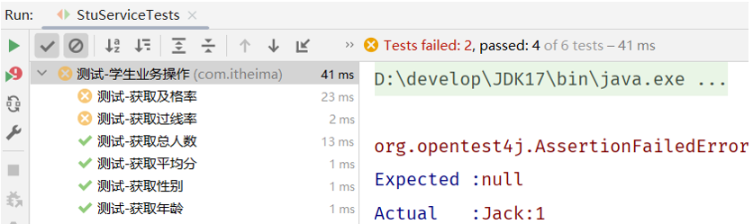

### 5.2.2 入门程序

**需求**：使用 JUnit，对 `UserService` 中的业务方法进行单元测试，测试其正确性。

**1. 在 `pom.xml` 中，引入 JUnit 的依赖。**

```xml
<!-- Junit 单元测试依赖 -->
<dependency>
    <groupId>org.junit.jupiter</groupId>
    <artifactId>junit-jupiter</artifactId>
    <version>5.9.1</version>
    <scope>test</scope>
</dependency>
```

**2. 在 `test/java` 目录下，创建测试类，并编写对应的测试方法，并在方法上声明 `@Test` 注解。**

```java
@Test
public void testGetAge(){
    Integer age = new UserService().getAge("110002200505091218");
    System.out.println(age);
}
```

**3. 运行单元测试（测试通过：绿色；测试失败：红色）。**

- 测试通过显示绿色：

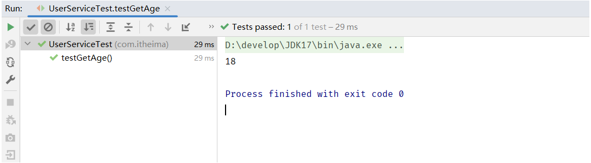

- 测试失败显示红色：

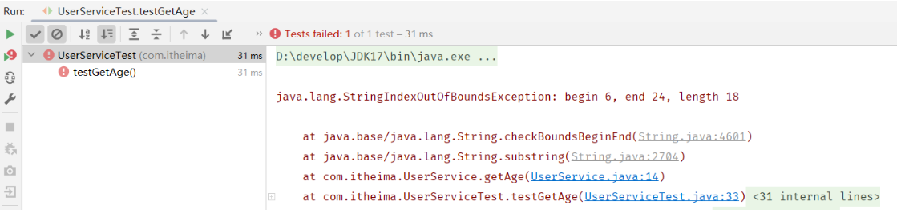

> 📌 **注意：**
> - 测试类的命名规范为：`XxxxTest`。
> - 测试方法的命名规定为：`public void xxx(){...}`。

## 5.3 断言

JUnit 提供了一些辅助方法，用来帮我们确定被测试的方法是否按照预期的效果正常工作，这种方式称为 **断言**。

| 断言方法 | 说明 |
| --- | --- |
| `assertEquals(Object exp, Object act, String msg)` | 检查两个值是否相等，不相等就报错。 |
| `assertNotEquals(Object unexp, Object act, String msg)` | 检查两个值是否不相等，相等就报错。 |
| `assertNull(Object act, String msg)` | 检查对象是否为 null，不为 null 就报错。 |
| `assertNotNull(Object act, String msg)` | 检查对象是否不为 null，为 null 就报错。 |
| `assertTrue(boolean condition, String msg)` | 检查条件是否为 true，不为 true 就报错。 |
| `assertFalse(boolean condition, String msg)` | 检查条件是否为 false，不为 false 就报错。 |
| `assertSame(Object exp, Object act, String msg)` | 检查两个对象是否引用相同，不相同就报错。 |

> 📌 上表为断言方法图示的文字转录，原始图片见下文嵌入图。

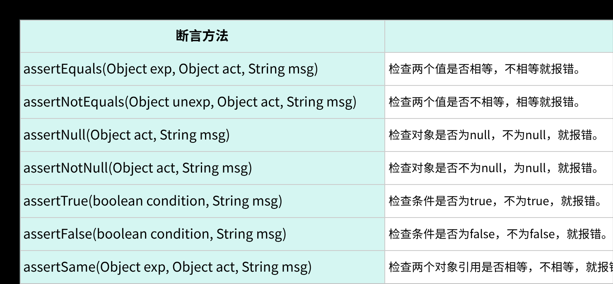

**示例演示：**

```java
package com.itheima;

import org.junit.jupiter.api.*;
import org.junit.jupiter.params.ParameterizedTest;
import org.junit.jupiter.params.provider.ValueSource;

public class UserServiceTest {

    @Test
    public void testGetAge2(){
        Integer age = new UserService().getAge("110002200505091218");
        Assertions.assertNotEquals(18, age, "两个值相等");
//        String s1 = new String("Hello");
//        String s2 = "Hello";
//        Assertions.assertSame(s1, s2, "不是同一个对象引用");
    }

    @Test
    public void testGetGender2(){
        String gender = new UserService().getGender("612429198904201611");
        Assertions.assertEquals("男", gender);
    }
}
```

测试结果输出：

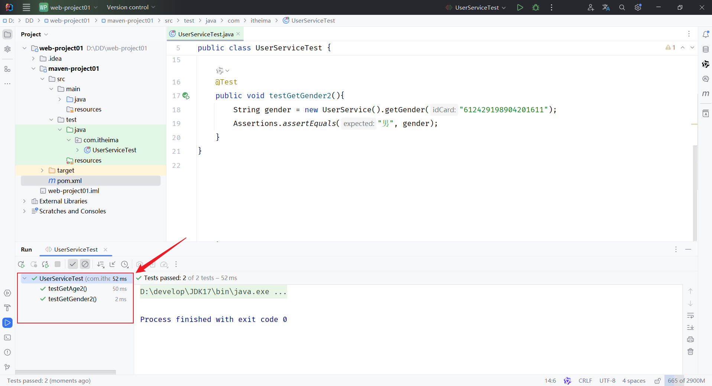

## 5.4 常见注解

在 JUnit 中还提供了一些注解，来增强其功能，常见的注解有以下几个：

| 注解 | 说明 |
| --- | --- |
| `@Test` | 测试类中的方法用它修饰才能成为测试方法，才能启动执行。 |
| `@BeforeEach` | 用来修饰一个实例方法，该方法会在每一个测试方法执行之前执行一次。 |
| `@AfterEach` | 用来修饰一个实例方法，该方法会在每一个测试方法执行之后执行一次。 |
| `@BeforeAll` | 用来修饰一个静态方法，该方法会在所有测试方法之前只执行一次。 |
| `@AfterAll` | 用来修饰一个静态方法，该方法会在所有测试方法之后只执行一次。 |
| `@ParameterizedTest` | 参数化测试的注解（可以让一个测试运行多次，每次运行时可传入不同的参数）。 |
| `@ValueSource` | 参数化测试的参数来源，赋予测试方法参数。 |
| `@DisplayName` | 指定测试类、测试方法显示的名称（默认为类名、方法名）。 |

> 📌 上表为常见注解图示的文字转录，原始图片见下文嵌入图。

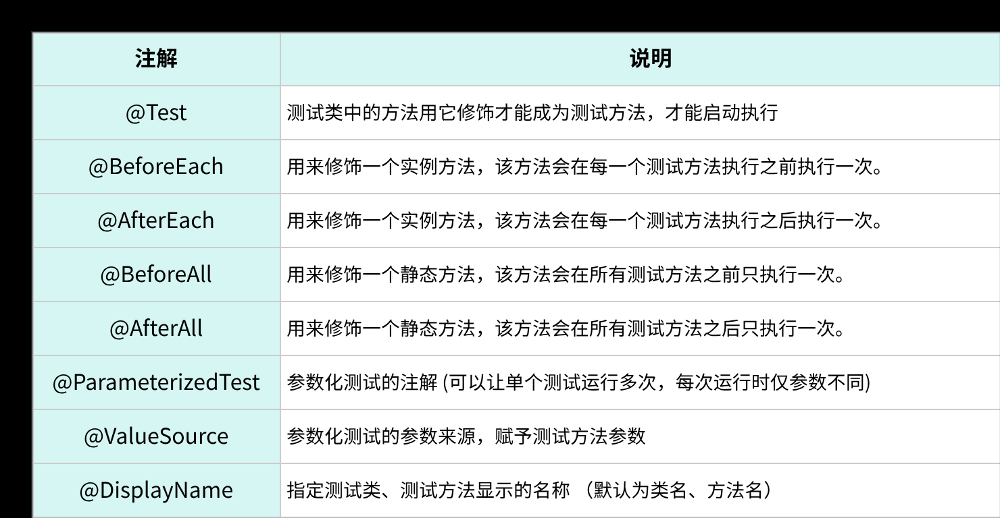

**演示 `@BeforeEach`、`@AfterEach`、`@BeforeAll`、`@AfterAll` 注解：**

```java
public class UserServiceTest {

    @BeforeEach
    public void testBefore(){
        System.out.println("before...");
    }

    @AfterEach
    public void testAfter(){
        System.out.println("after...");
    }

    @BeforeAll // 该方法必须被 static 修饰
    public static void testBeforeAll(){
        System.out.println("before all ...");
    }

    @AfterAll // 该方法必须被 static 修饰
    public static void testAfterAll(){
        System.out.println("after all...");
    }

    @Test
    public void testGetAge(){
        Integer age = new UserService().getAge("110002200505091218");
        System.out.println(age);
    }

    @Test
    public void testGetGender(){
        String gender = new UserService().getGender("612429198904201611");
        System.out.println(gender);
    }
}
```

输出结果如下：

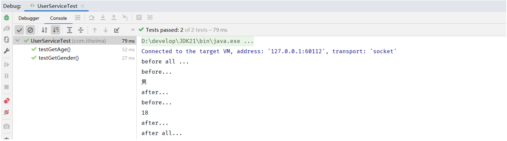

**演示 `@ParameterizedTest`、`@ValueSource`、`@DisplayName` 注解：**

```java
package com.itheima;

import org.junit.jupiter.api.*;
import org.junit.jupiter.params.ParameterizedTest;
import org.junit.jupiter.params.provider.ValueSource;

@DisplayName("测试-学生业务操作")
public class UserServiceTest {

    @DisplayName("测试-获取年龄")
    @Test
    public void testGetAge(){
        Integer age = new UserService().getAge("110002200505091218");
        System.out.println(age);
    }

    @DisplayName("测试-获取性别")
    @Test
    public void testGetGender(){
        String gender = new UserService().getGender("612429198904201611");
        System.out.println(gender);
    }

    @DisplayName("测试-获取性别3")
    @ParameterizedTest
    @ValueSource(strings = {"612429198904201611","612429198904201631","612429198904201626"})
    public void testGetGender3(String idcard){
        String gender = new UserService().getGender(idcard);
        System.out.println(gender);
    }
}
```

输出结果如下：

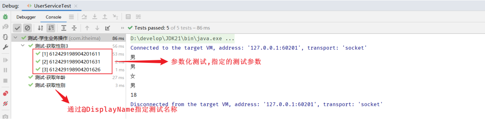

> 📌 **思考**：在 Maven 项目中，`test` 目录存放单元测试的代码，是否可以在 `main` 目录中编写单元测试呢？
>
> **答**：**可以，但是不规范。**

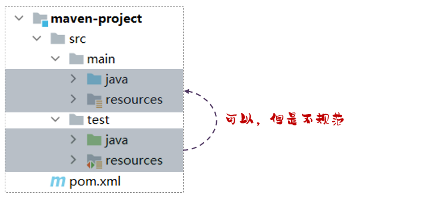

## 5.5 依赖范围

依赖的 jar 包，默认情况下，可以在任何地方使用：在 `main` 目录下，可以使用；在 `test` 目录下，也可以使用。

在 Maven 中，如果希望限制依赖的使用范围，可以通过 `<scope>…</scope>` 设置其作用范围。

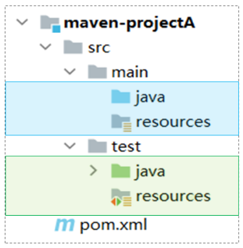

**作用范围：**

- 主程序范围有效。（`main` 文件夹范围内）
- 测试程序范围有效。（`test` 文件夹范围内）
- 是否参与打包运行。（`package` 指令范围内）

可以在 `pom.xml` 中配置 `<scope></scope>` 属性来控制依赖范围。

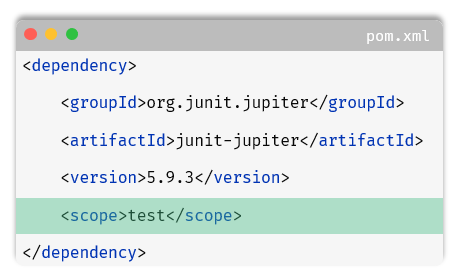

如果对 JUnit 单元测试的依赖，设置了 `scope` 为 `test`，就代表，该依赖，只是在测试程序中可以使用，在主程序中是无法使用的。所以我们会看到如下现象：

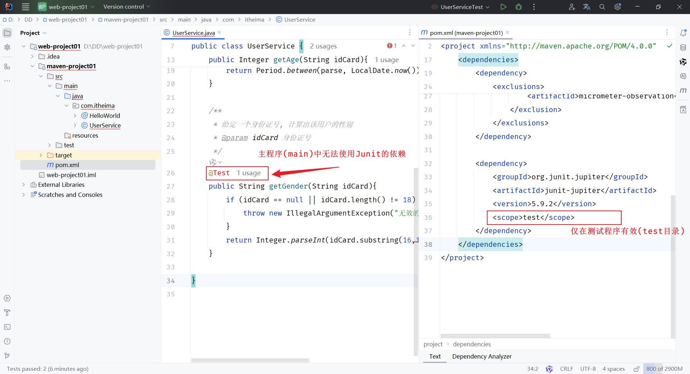

如上图所示，给 junit 依赖通过 `scope` 标签指定依赖的作用范围。那么这个依赖就只能作用在测试环境，其他环境下不能使用。

`scope` 的取值常见的如下：

| scope 值 | 主程序 | 测试程序 | 打包（运行） |
| --- | :---: | :---: | :---: |
| `compile`（默认） | Y | Y | Y |
| `test` | - | Y | - |
| `provided` | Y | Y | - |
| `runtime` | - | Y | Y |

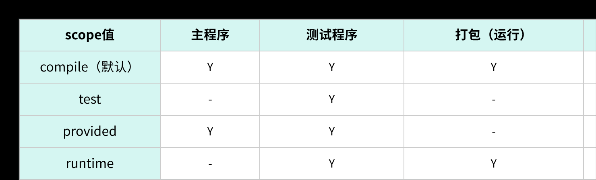

---

# 6. Maven 常见问题

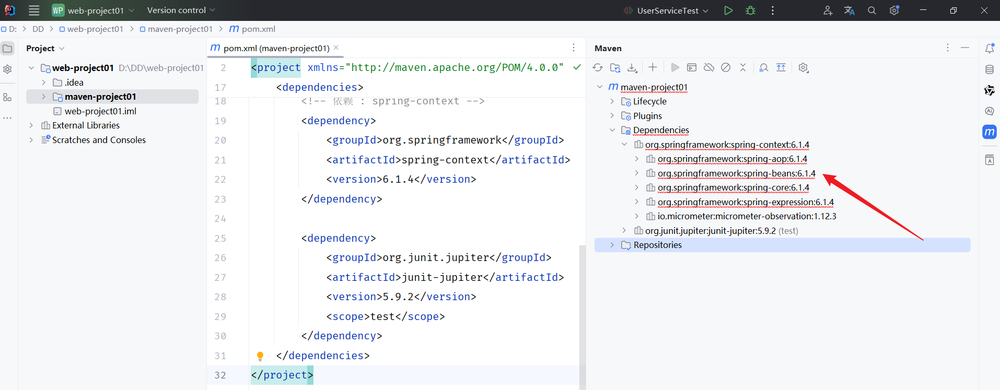

- **问题现象**：Maven 项目中添加的依赖，未正确下载，造成右侧 Maven 面板中的依赖报红，再次 reload 重新加载也不会再下载。
- **产生原因**：由于网络原因，依赖没有下载完整导致的，在 Maven 仓库中生成了 `xxx.lastUpdated` 文件，该文件不删除，不会再重新下载。

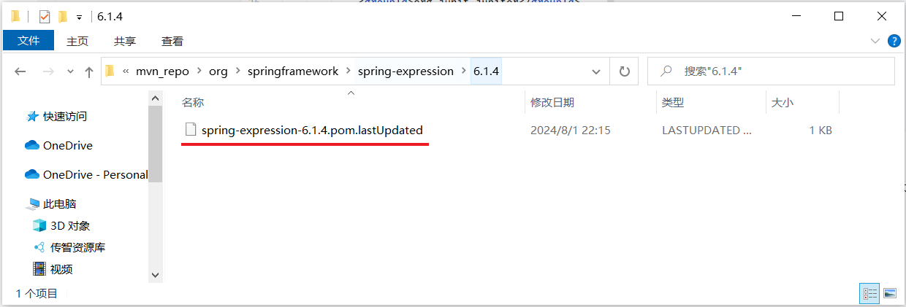

**解决方案：**

1. 根据 Maven 依赖的坐标，找到仓库中对应的 `xxx.lastUpdated` 文件，删除，删除之后重新加载项目即可。
2. 通过命令（`del /s *.lastUpdated`）批量递归删除指定目录下的 `xxx.lastUpdated` 文件，删除之后重新加载项目即可。
3. 重新加载依赖，依赖下载了之后，Maven 面板可能还会报红，此时可以关闭 IDEA，重新打开 IDEA 加载此项目即可。

为了使大家能够方便的解决这个问题，大家可以将资料中提供的 `del.bat` 批处理脚本，拷贝到 Maven 的安装目录下。双击这个文件，就可以递归删除该目录下所有的 `xxx.lastUpdated` 文件。放置目录如下所示：

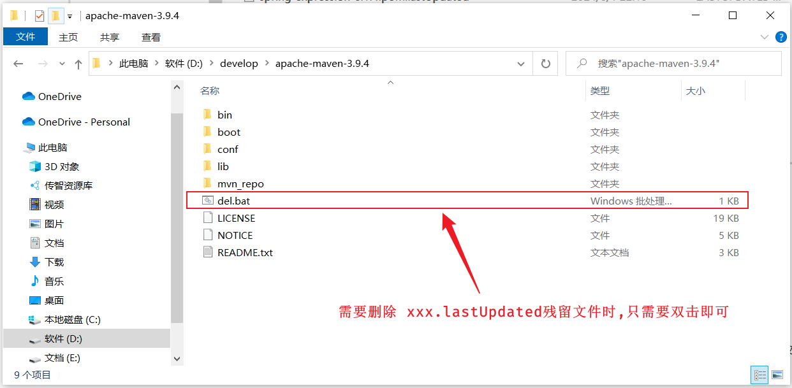

> 📎 **附件**：上述提到的 `del.bat` 批处理文件，也可以直接点此下载。
