# 04-Web后端基础(基础知识)

> ⛳ 如果大家在自学的过程中，时间紧迫、没有方向、经常遇到难以解决的 Bug、没有亮眼的项目、缺少 AI 大模型经验，而又想快速系统化的学习、高薪就业的小伙伴儿，大家都可以 🔗 直接点我，了解一下我们系统化的课程体系。

---

## 📑 课程内容

- **SpringBootWeb 入门**
- **HTTP 协议**
- **SpringBootWeb 案例**
- **分层解耦**

---

## 前言：静态资源与动态资源

那在前面讲解 Web 前端开发的时候，我们学习了前端网页开发的三剑客 HTML、CSS、JS，通过这三项技术，我们就可以制作前端页面了。那最终，这些个页面资料，我们就可以部署在服务器上，然后打开浏览器就可以直接访问服务器上部署的前端页面了。

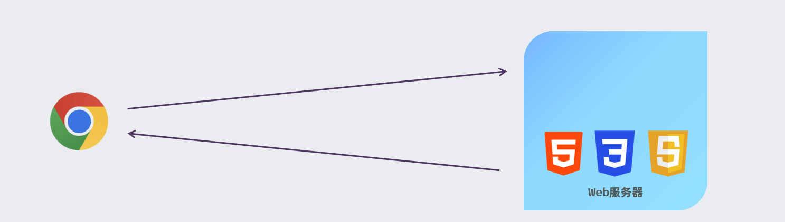

> ✅ **静态资源 vs 动态资源**
>
> - **静态资源**：像 HTML、CSS、JS 以及图片、音频、视频等这些资源。指在服务器上存储的不会改变的数据，通常不会根据用户的请求而变化。
> - **动态资源**：指在服务器端上存储的，会根据用户请求和其他数据动态生成的，内容可能会在每次请求时都发生变化。比如：Servlet、JSP 等（负责逻辑处理）。

而 Servlet、JSP 这些技术现在早都被企业淘汰了，现在在企业项目开发中，都是直接基于 **Spring 框架** 来构建动态资源。

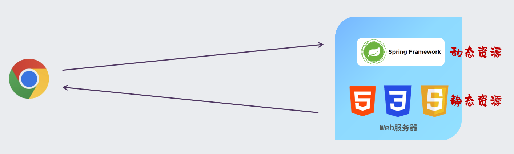

而对于我们 Java 程序开发的动态资源来说，我们通常会将这些动态资源部署在 **Tomcat** 这样的 Web 服务器中运行。而浏览器与服务器在通信的时候，基本都是基于 **HTTP 协议** 的。

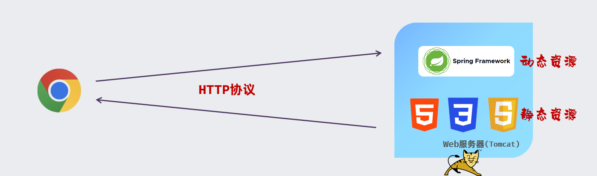

那上述所描述的这种浏览器/服务器的架构模式呢，我们称之为：**BS 架构**。

> ✅ **BS 架构 vs CS 架构**
>
> - **BS 架构**：Browser/Server，浏览器/服务器架构模式。客户端只需要浏览器，应用程序的逻辑和数据都存储在服务端。
>   - 优点：维护方便
>   - 缺点：体验一般
> - **CS 架构**：Client/Server，客户端/服务器架构模式。需要单独开发维护客户端。
>   - 优点：体验不错
>   - 缺点：开发维护麻烦

那前面我们已经学习了静态资源开发技术，包括：HTML、CSS、JS 以及 JS 的高级框架 Vue，异步交互技术 Axios。接下来呢，我们就要来学习动态资源开发技术。所以，我们今天的课程内容内，分为以下四个部分：SpringBootWeb 入门、HTTP 协议、SpringBootWeb 案例、分层解耦。

---

# 1. SpringBootWeb 入门

那接下来呢，我们就要来讲解现在企业开发的主流技术 **SpringBoot**，并基于 SpringBoot 进行 Web 程序的开发。

## 1.1 概述

在没有正式的学习 SpringBoot 之前，我们要先来了解下什么是 **Spring**。

我们可以打开 Spring 的官网（https://spring.io），去看一下 Spring 的简介：**Spring makes Java simple**。

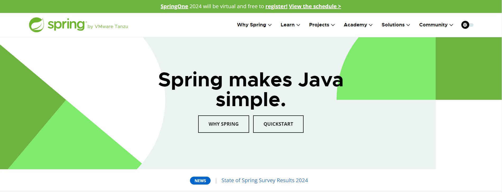

Spring 的官方提供很多开源的项目，我们可以点击上面的 projects，看到 spring 家族旗下的项目，按照流行程度排序。

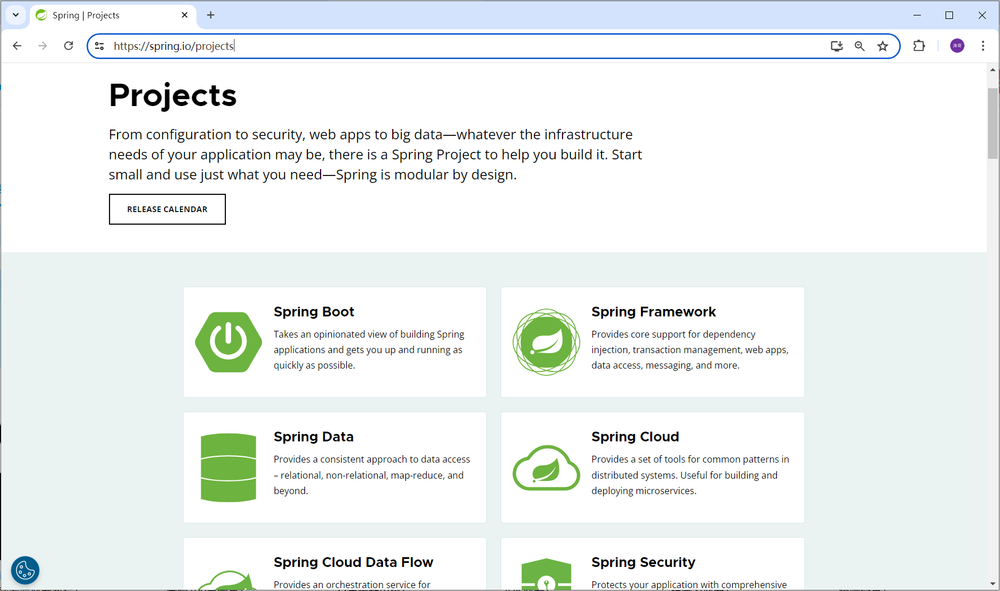

Spring 发展到今天已经形成了一种开发生态圈，Spring 提供了若干个子项目，每个项目用于完成特定的功能。而我们在项目开发时，一般会偏向于选择这一套 spring 家族的技术，来解决对应领域的问题，那我们称这一套技术为 **spring 全家桶**。

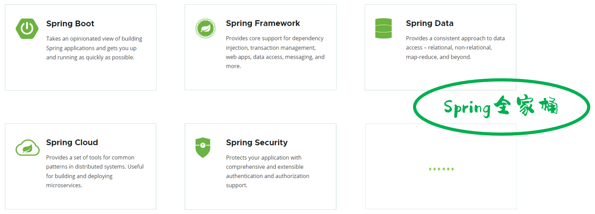

而 Spring 家族旗下这么多的技术，最基础、最核心的是 **SpringFramework**。其他的 spring 家族的技术，都是基于 SpringFramework 的，SpringFramework 中提供很多实用功能，如：依赖注入、事务管理、web 开发支持、数据访问、消息服务等等。

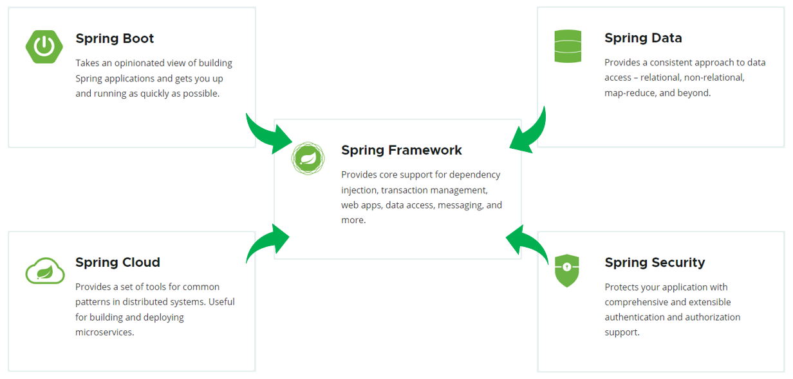

而如果我们在项目中，直接基于 SpringFramework 进行开发，存在两个问题：

- 配置繁琐
- 入门难度大

所以基于此呢，spring 官方推荐我们从另外一个项目开始学习，那就是目前最火爆的 **SpringBoot**。

> ✅ **SpringBoot 的两大特点**
> - **简化配置**
> - **快速开发**
>
> Spring Boot 可以帮助我们非常快速的构建应用程序、简化开发、提高效率。

而直接基于 SpringBoot 进行项目构建和开发，不仅是 Spring 官方推荐的方式，也是现在企业开发的主流。

## 1.2 入门程序

### 1.2.1 需求

**需求**：基于 SpringBoot 的方式开发一个 web 应用，浏览器发起请求 `/hello` 后，给浏览器返回字符串 `Hello xxx ~`。

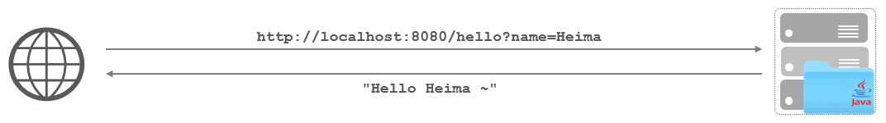

### 1.2.2 开发步骤

> ✅ **开发步骤**
> - 第 1 步：创建 SpringBoot 工程，并勾选 Web 开发相关依赖
> - 第 2 步：定义 HelloController 类，添加方法 hello，并添加注解

**1）创建 SpringBoot 工程（需要联网）**

基于 Spring 官方骨架，创建 SpringBoot 工程。

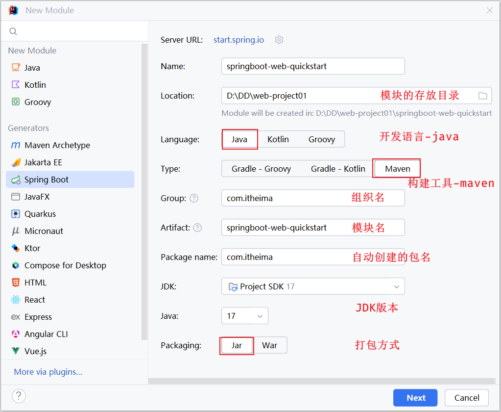

基本信息描述完毕之后，勾选 web 开发相关依赖。

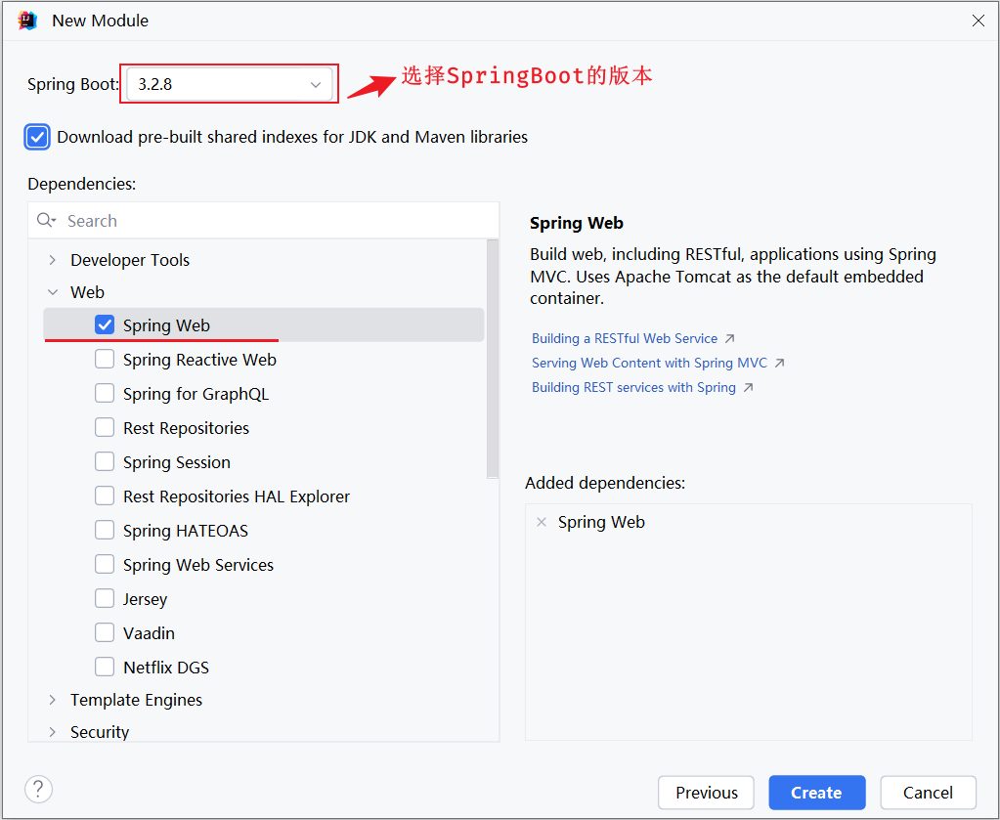

> 📌 SpringBoot 官方提供的脚手架，里面只能够选择 SpringBoot 的几个最新的版本，如果要选择其他相对低一点的版本，可以在 springboot 项目创建完毕之后，修改项目的 `pom.xml` 文件中的版本号。

点击 Create 之后，就会联网创建这个 SpringBoot 工程，创建好之后，结构如下：

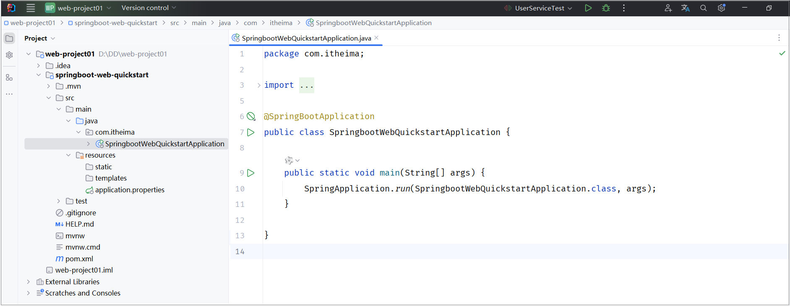

> ⚠️ **注意**：在联网创建过程中，会下载相关资源（请耐心等待）。

**2）定义 HelloController 类，添加方法 hello，并添加注解**

在 `com.itheima` 这个包下新建一个类：`HelloController`。

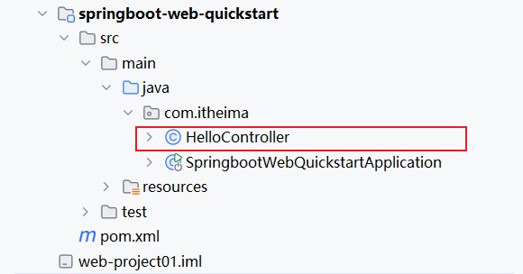

HelloController 中的内容，具体如下：

```java
package com.itheima;

import org.springframework.web.bind.annotation.RequestMapping;
import org.springframework.web.bind.annotation.RestController;

@RestController //标识当前类是一个请求处理类
public class HelloController {

    @RequestMapping("/hello") //标识请求路径
    public String hello(String name){
        System.out.println("HelloController ... hello: " + name);
        return "Hello " + name;
    }

}
```

**3）运行测试**

运行 SpringBoot 自动生成的引导类（标识有 `@SpringBootApplication` 注解的类）。

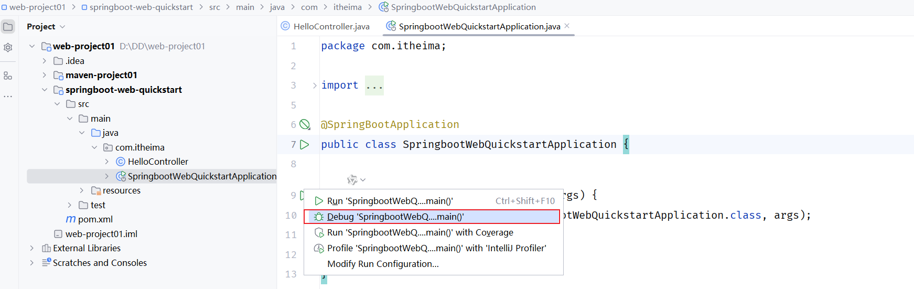

打开浏览器，输入 `http://localhost:8080/hello?name=itheima`。

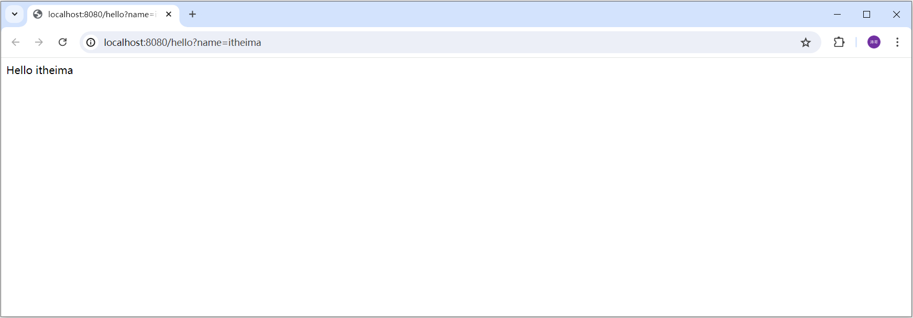

### 1.2.3 常见问题

大伙儿在下来练习的时候，联网基于 spring 的脚手架创建 SpringBoot 项目，偶尔可能会因为网内网络的原因，链接不上 SpringBoot 的脚手架网站，此时会出现如下现象：

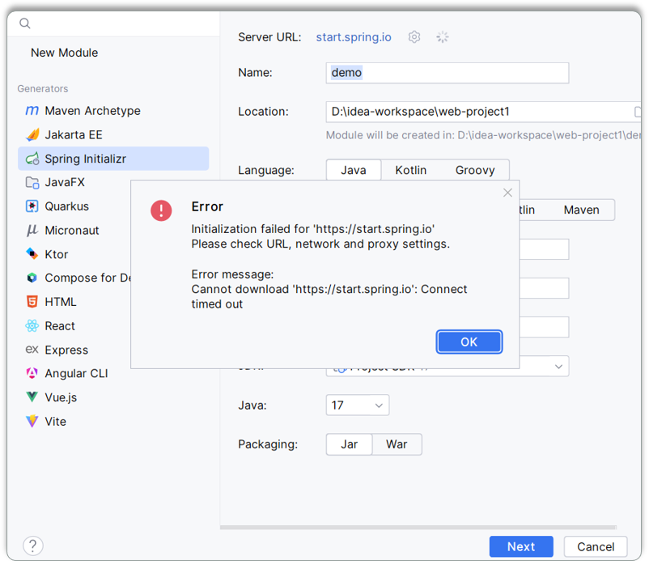

此时可以使用阿里云提供的脚手架，网址为：https://start.aliyun.com

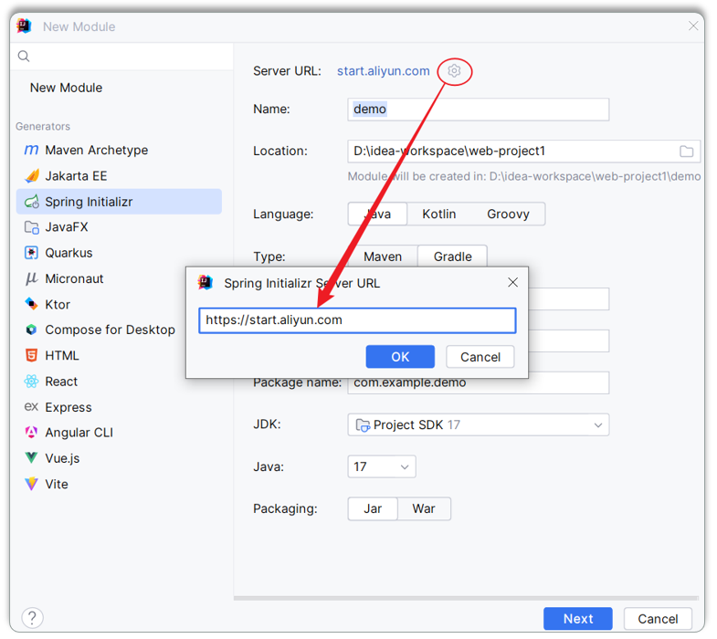

然后按照项目创建的向导，一步一步的创建项目即可。

## 1.3 入门解析

那在上面呢，我们已经完成了 SpringBootWeb 的入门程序，并且测试通过。在入门程序中，我们发现，我们只需要一个 main 方法就可以将 web 应用启动起来了，然后就可以打开浏览器访问了。

那接下来我们需要明确两个问题：

**1）为什么一个 main 方法就可以将 Web 应用启动了？**

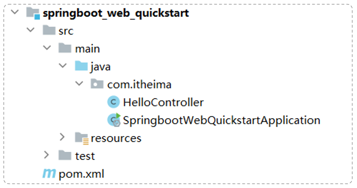

因为我们在创建 springboot 项目的时候，选择了 web 开发的 **起步依赖** `spring-boot-starter-web`。而 `spring-boot-starter-web` 依赖，又依赖了 `spring-boot-starter-tomcat`，由于 maven 的依赖传递特性，那么在我们创建的 springboot 项目中也就已经有了 tomcat 的依赖，这个其实就是 springboot 中内嵌的 tomcat。

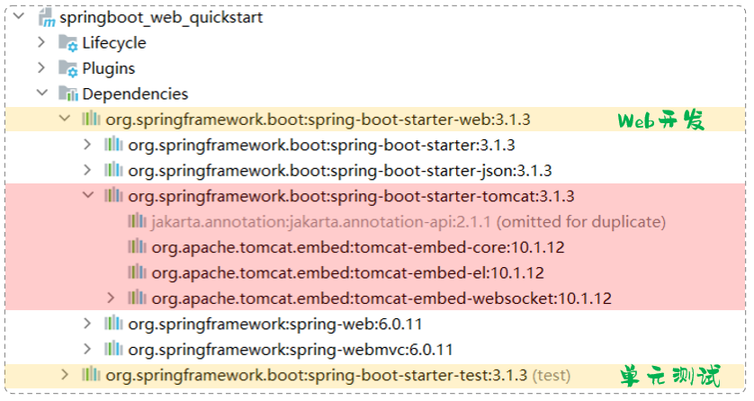

而我们运行引导类中的 main 方法，其实启动的就是 springboot 中内嵌的 Tomcat 服务器。而我们所开发的项目，也会自动的部署在该 tomcat 服务器中，并占用 **8080 端口号**。

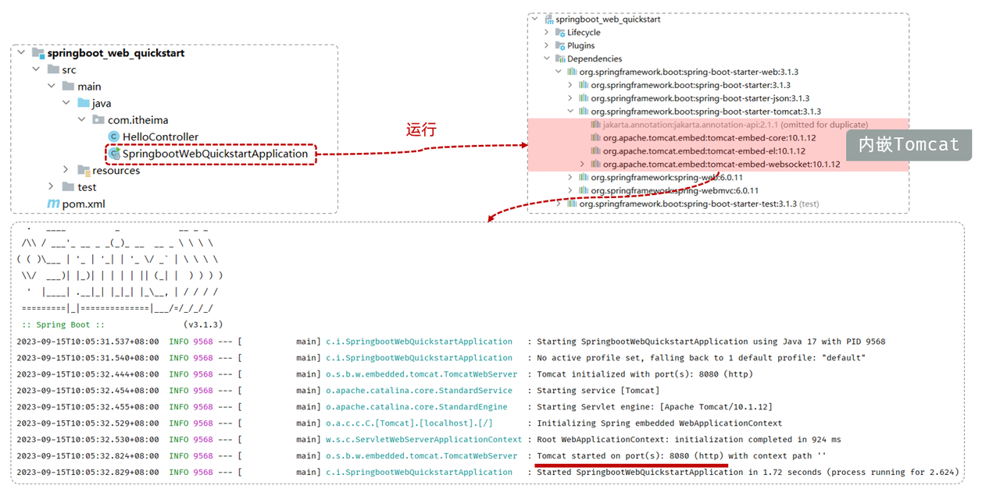

> 📌 **起步依赖（starter）**
>
> - 一种为开发者提供简化配置和集成的机制，使得构建 Spring 应用程序更加轻松。起步依赖本质上是一组预定义的依赖项集合，它们一起提供了在特定场景下开发 Spring 应用所需的所有库和配置。
>   - `spring-boot-starter-web`：包含了 web 应用开发所需要的常见依赖。
>   - `spring-boot-starter-test`：包含了单元测试所需要的常见依赖。
> - 官方提供的 starter：https://docs.spring.io/spring-boot/docs/3.1.3/reference/htmlsingle/#using.build-systems.starters

---

# 2. HTTP 协议

## 2.1 HTTP 概述

### 2.1.1 介绍

**HTTP**：Hyper Text Transfer Protocol（超文本传输协议），规定了浏览器与服务器之间数据传输的规则。

- HTTP 是互联网上应用最为广泛的一种网络协议。
- HTTP 协议要求：浏览器在向服务器发送请求数据时，或是服务器在向浏览器发送响应数据时，都必须按照固定的格式进行数据传输。

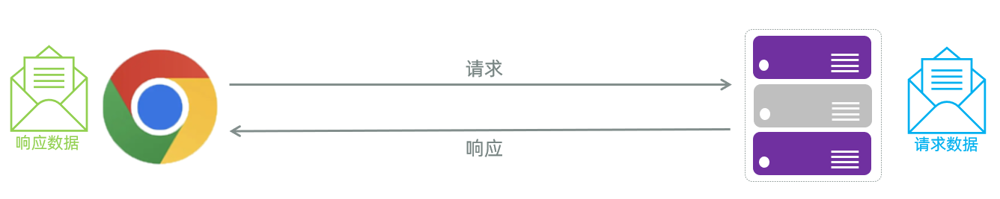

如果想知道 HTTP 协议的数据传输格式有哪些，可以打开浏览器，点击 `F12` 打开开发者工具，点击 `Network`（网络）来查看。

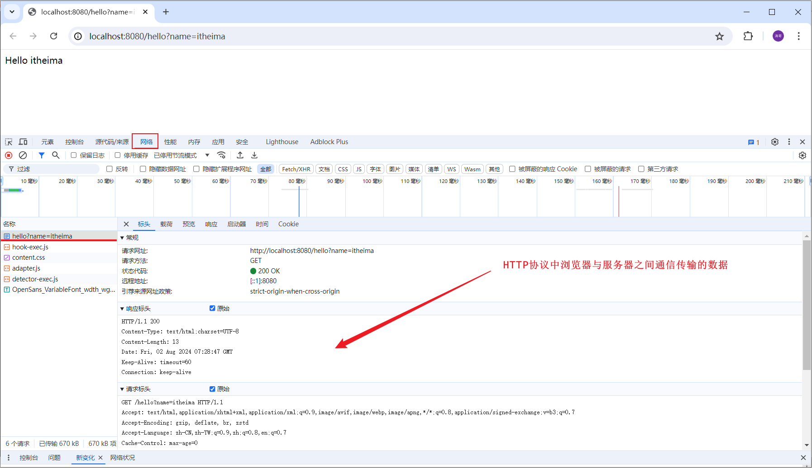

浏览器向服务器进行请求时，服务器按照固定的格式进行解析：

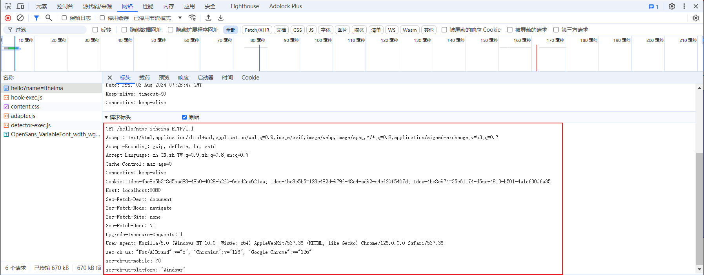

服务器向浏览器进行响应时，浏览器按照固定的格式进行解析：

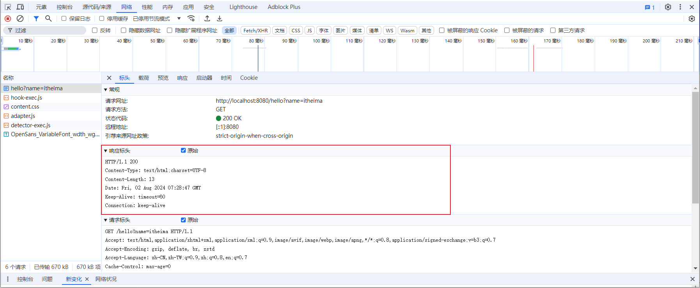

而我们学习 HTTP 协议，就是来学习请求和响应数据的具体格式内容。

### 2.1.2 特点

我们在看看 HTTP 协议有哪些特点：

- **基于 TCP 协议**：面向连接，安全。
  > TCP 是一种面向连接的（建立连接之前是需要经过三次握手）、可靠的、基于字节流的传输层通信协议，在数据传输方面更安全。
- **基于请求-响应模型**：一次请求对应一次响应（先请求后响应）。
  > 请求和响应是一一对应关系，没有请求，就没有响应。
- **HTTP 协议是无状态协议**：对于数据没有记忆能力。每次请求-响应都是独立的。
  > 无状态指的是客户端发送 HTTP 请求给服务端之后，服务端根据请求响应数据，响应完后，不会记录任何信息。
  > - 缺点：多次请求间不能共享数据
  > - 优点：速度快

**请求之间无法共享数据会引发的问题：**

- 如：京东购物。加入购物车和去购物车结算是两次请求。
- 由于 HTTP 协议的无状态特性，加入购物车请求响应结束后，并未记录加入购物车是何商品。
- 发起去购物车结算的请求后，因为无法获取哪些商品加入了购物车，会导致此次请求无法正确展示数据。

具体使用的时候，我们发现京东是可以正常展示数据的，原因是 Java 早已考虑到这个问题，并提出了使用 **会话技术（Cookie、Session）** 来解决这个问题。具体如何来做，我们后面课程中会讲到。

> ✅ HTTP 协议又分为：**请求协议** 和 **响应协议**。

## 2.2 HTTP 请求协议

### 2.2.1 介绍

**请求协议**：浏览器将数据以请求格式发送到服务器。包括：**请求行、请求头、请求体**。

**GET 方式的请求协议：**

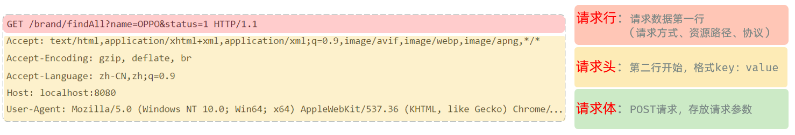

- **请求行**（上图中红色部分）：HTTP 请求中的第一行数据。由 **请求方式、资源路径、协议/版本** 组成（之间使用空格分隔）。
  - 请求方式：GET
  - 资源路径：`/brand/findAll?name=OPPO&status=1`
    - 请求路径：`/brand/findAll`
    - 请求参数：`name=OPPO&status=1`
      - 请求参数是以 `key=value` 形式出现
      - 多个请求参数之间使用 `&` 连接
    - 请求路径和请求参数之间使用 `?` 连接
  - 协议/版本：`HTTP/1.1`
- **请求头**（上图中黄色部分）：第二行开始，格式为 `key: value` 形式。
  - HTTP 是个无状态的协议，所以在请求头设置浏览器的一些自身信息和想要响应的形式。这样服务器在收到信息后，就可以知道是谁，想干什么了。
  - 常见的 HTTP 请求头有：

| 请求头 | 含义 |
| --- | --- |
| `Host` | 表示请求的主机名 |
| `User-Agent` | 浏览器版本。例如：Chrome 浏览器的标识类似 `Mozilla/5.0 ...Chrome/79`，IE 浏览器的标识类似 `Mozilla/5.0 (Windows NT ...)like Gecko` |
| `Accept` | 表示浏览器能接收的资源类型，如 `text/*`、`image/*` 或者 `*/*` 表示所有 |
| `Accept-Language` | 表示浏览器偏好的语言，服务器可以据此返回不同语言的网页 |
| `Accept-Encoding` | 表示浏览器可以支持的压缩类型，例如 `gzip`、`deflate` 等 |
| `Content-Type` | 请求主体的数据类型 |
| `Content-Length` | 数据主体的大小（单位：字节） |

> 举例说明：服务端可以根据请求头中的内容来获取客户端的相关信息，有了这些信息服务端就可以处理不同的业务需求。比如：不同浏览器解析 HTML 和 CSS 标签的结果会有不一致，服务端根据客户端请求头中的数据获取到客户端的浏览器类型，就可以根据不同的浏览器设置不同的代码来达到一致的效果（这就是我们常说的浏览器兼容问题）。

- **请求体**：存储请求参数。
  - GET 请求的请求参数在请求行中，故不需要设置请求体。

**POST 方式的请求协议：**

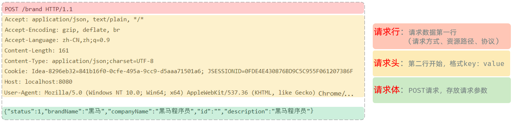

- **请求行**（上图中红色部分）：包含请求方式、资源路径、协议/版本。
  - 请求方式：POST
  - 资源路径：`/brand`
  - 协议/版本：`HTTP/1.1`
- **请求头**（上图中黄色部分）
- **请求体**（上图中绿色部分）：存储请求参数。
  - 请求体和请求头之间是有一个空行隔开（作用：用于标记请求头结束）。

> ✅ **GET 请求和 POST 请求的区别：**

| 区别方式 | GET 请求 | POST 请求 |
| --- | --- | --- |
| 请求参数 | 请求参数在请求行中。例：`/brand/findAll?name=OPPO&status=1` | 请求参数在请求体中 |
| 请求参数长度 | 请求参数长度有限制（浏览器不同限制也不同） | 请求参数长度没有限制 |
| 安全性 | 安全性低。原因：请求参数暴露在浏览器地址栏中 | 安全性相对高 |

### 2.2.2 获取请求数据

Web 服务器（Tomcat）对 HTTP 协议的请求数据进行解析，并进行了封装（**HttpServletRequest**），并在调用 Controller 方法的时候传递给了该方法。这样，就使得程序员不必直接对协议进行操作，让 Web 开发更加便捷。

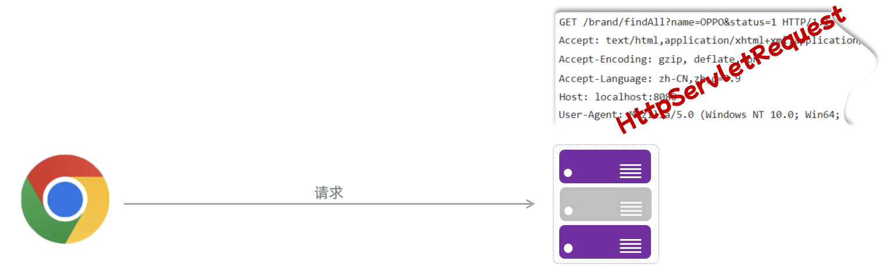

代码演示如下：

```java
@RestController
public class RequestController {

    /**
     *
     * @param request
     * @return
     */
    @RequestMapping("/request")
    public String request(HttpServletRequest request){
        //1. 获取请求参数 name, age
        //   请求路径 http://localhost:8080/request?name=Tom&age=18
        String name = request.getParameter("name");
        String age = request.getParameter("age");
        System.out.println("name = " + name + ", age = " + age);

        //2. 获取请求路径
        String uri = request.getRequestURI();
        String url = request.getRequestURL().toString();
        System.out.println("uri = " + uri);
        System.out.println("url = " + url);

        //3. 获取请求方式
        String method = request.getMethod();
        System.out.println("method = " + method);

        //4. 获取请求头
        String header = request.getHeader("User-Agent");
        System.out.println("header = " + header);

        return "request success";
    }
}
```

最终输出内容如下所示：

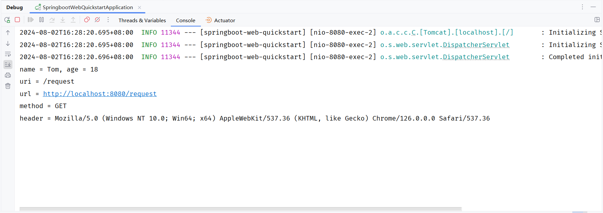

## 2.3 HTTP 响应协议

### 2.3.1 格式介绍

**响应协议**：服务器将数据以响应格式返回给浏览器。包括：**响应行、响应头、响应体**。

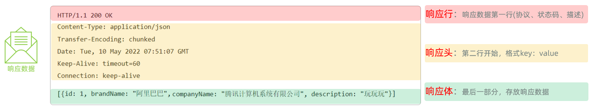

- **响应行**（上图中红色部分）：响应数据的第一行。响应行由 **协议及版本、响应状态码、状态码描述** 组成。
  - 协议/版本：`HTTP/1.1`
  - 响应状态码：`200`
  - 状态码描述：`OK`
- **响应头**（上图中黄色部分）：响应数据的第二行开始。格式为 `key：value` 形式。
  - HTTP 是个无状态的协议，所以可以在请求头和响应头中设置一些信息和想要执行的动作，这样，对方在收到信息后，就可以知道你是谁，你想干什么。
  - 常见的 HTTP 响应头有：

```
Content-Type ：表示该响应内容的类型，例如 text/html，image/jpeg ；

Content-Length ：表示该响应内容的长度（字节数）；

Content-Encoding ：表示该响应压缩算法，例如 gzip ；

Cache-Control ：指示客户端应如何缓存，例如 max-age=300 表示可以最多缓存 300 秒 ;

Set-Cookie ：告诉浏览器为当前页面所在的域设置 cookie ;
```

- **响应体**（上图中绿色部分）：响应数据的最后一部分。存储响应的数据。
  - 响应体和响应头之间有一个空行隔开（作用：用于标记响应头结束）。

### 2.3.2 响应状态码

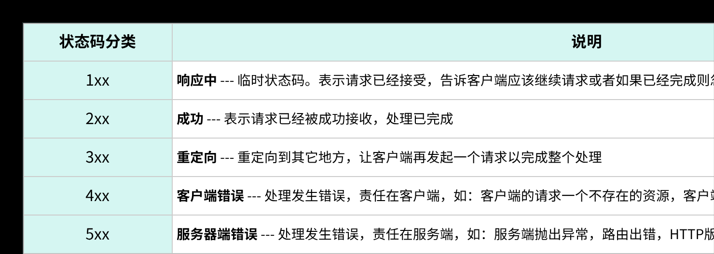

| 状态码分类 | 说明 |
| --- | --- |
| `1xx` | **响应中** —— 临时状态码。表示请求已经接受，告诉客户端应该继续请求或者如果已经完成则忽略它。 |
| `2xx` | **成功** —— 表示请求已经被成功接收，处理已完成。 |
| `3xx` | **重定向** —— 重定向到其它地方，让客户端再发起一个请求以完成整个处理。 |
| `4xx` | **客户端错误** —— 处理发生错误，责任在客户端，如：客户端的请求一个不存在的资源，客户端未被授权，禁止访问等。 |
| `5xx` | **服务器端错误** —— 处理发生错误，责任在服务端，如：服务端抛出异常，路由出错，HTTP 版本不支持等。 |

> ✅ 关于响应状态码，我们先主要认识三个状态码，其余的等后期用到了再去掌握：
> - **`200` ok**：客户端请求成功
> - **`404` Not Found**：请求资源不存在
> - **`500` Internal Server Error**：服务端发生不可预期的错误

### 2.3.3 设置响应数据

Web 服务器对 HTTP 协议的响应数据进行了封装（**HttpServletResponse**），并在调用 Controller 方法的时候传递给了该方法。这样，就使得程序员不必直接对协议进行操作，让 Web 开发更加便捷。

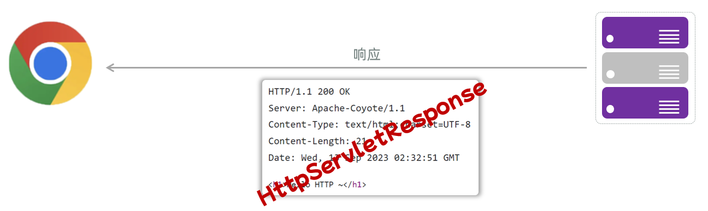

代码演示：

```java
package com.itheima;

import jakarta.servlet.http.HttpServletResponse;
import org.springframework.http.ResponseEntity;
import org.springframework.web.bind.annotation.RequestMapping;
import org.springframework.web.bind.annotation.RestController;

import java.io.IOException;

@RestController
public class ResponseController {

    @RequestMapping("/response")
    public void response(HttpServletResponse response) throws IOException {
        //1. 设置响应状态码
        response.setStatus(401);
        //2. 设置响应头
        response.setHeader("name","itcast");
        //3. 设置响应体
        response.setContentType("text/html;charset=utf-8");
        response.setCharacterEncoding("utf-8");
        response.getWriter().write("<h1>hello response</h1>");
    }

    @RequestMapping("/response2")
    public ResponseEntity<String> response2(HttpServletResponse response) throws IOException {
        return ResponseEntity
                .status(401)
                .header("name","itcast")
                .body("<h1>hello response</h1>");
    }

}
```

浏览器访问测试：

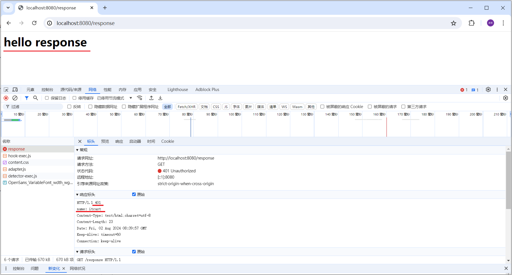

> 📌 响应状态码 和 响应头如果没有特殊要求的话，通常不手动设定。服务器会根据请求处理的逻辑，自动设置响应状态码和响应头。

---

# 3. SpringBootWeb 案例

## 3.1 需求说明

**需求**：基于 SpringBoot 开发 web 程序，完成用户列表的渲染展示。

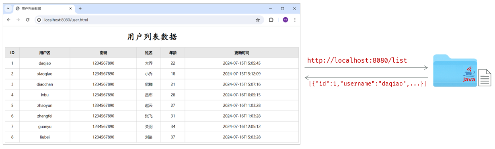

当在浏览器地址栏，访问前端静态页面（`http://localhost:8080/usre.html`）后，在前端页面上，会发送 ajax 请求，请求服务端（`http://localhost:8080/list`），服务端程序加载 `user.txt` 文件中的数据，读取出来后最终给前端页面响应 json 格式的数据，前端页面再将数据渲染展示在表格中。

## 3.2 代码实现

**1）准备工作**：再创建一个 SpringBoot 工程，并勾选 web 依赖、lombok 依赖。

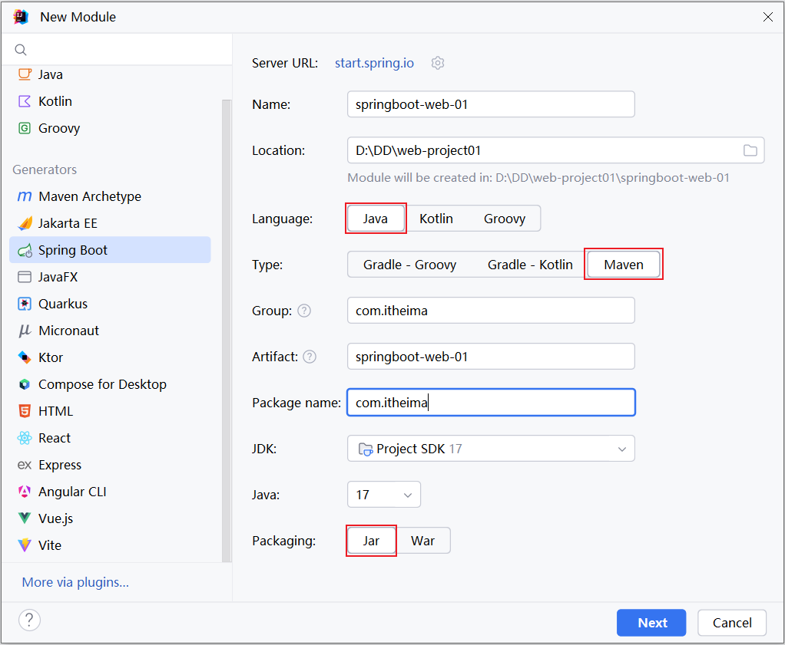

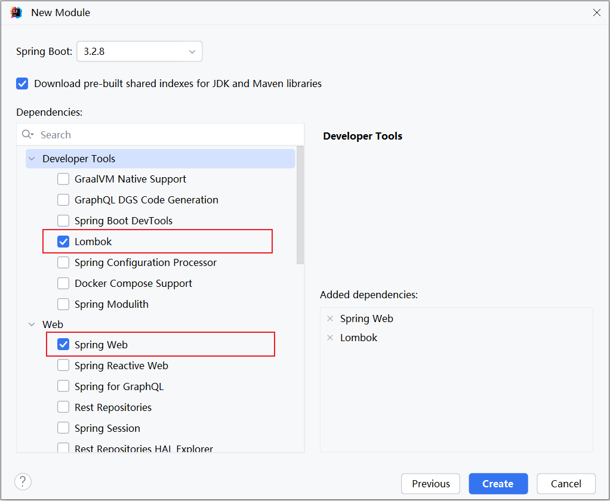

**2）准备工作**：引入资料中准备好的数据文件 `user.txt`，以及 static 下的前端静态页面。

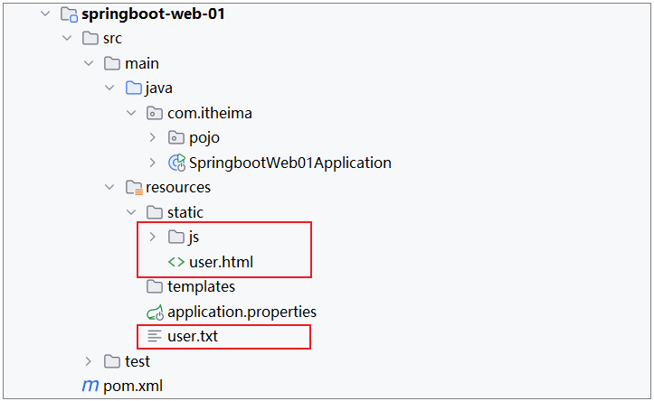

这些文件，在提供的资料中，已经提供了直接导入进来即可。

**3）准备工作**：定义封装用户信息的实体类。

在 `com.itheima` 下再定义一个包 `pojo`，专门用来存放实体类。在该包下定义一个实体类 `User`：

```java
package com.itheima.pojo;

import lombok.AllArgsConstructor;
import lombok.Data;
import lombok.NoArgsConstructor;
import java.time.LocalDateTime;

/**
 * 封装用户信息
 */
@Data
@NoArgsConstructor
@AllArgsConstructor
public class User {
    private Integer id;
    private String username;
    private String password;
    private String name;
    private Integer age;
    private LocalDateTime updateTime;
}
```

**4）开发服务端程序，接收请求，读取文本数据并响应。**

由于在案例中，需要读取文本中的数据，并且还需要将对象转为 json 格式，所以这里呢，我们在项目中再引入一个非常常用的工具包 **hutool**。然后调用里面的工具类，就可以非常方便快捷的完成业务操作。

- 在 `pom.xml` 中引入依赖：

```xml
<dependency>
    <groupId>cn.hutool</groupId>
    <artifactId>hutool-all</artifactId>
    <version>5.8.27</version>
</dependency>
```

- 在 `com.itheima` 包下新建一个子包 `controller`，在其中创建一个 `UserController`：

```java
import cn.hutool.core.io.IoUtil;
import cn.hutool.json.JSONConfig;
import cn.hutool.json.JSONUtil;
import com.itheima.pojo.User;
import org.springframework.web.bind.annotation.RequestMapping;
import org.springframework.web.bind.annotation.RestController;
import java.io.InputStream;
import java.nio.charset.StandardCharsets;
import java.time.LocalDateTime;
import java.time.format.DateTimeFormatter;
import java.util.ArrayList;
import java.util.List;
import java.util.stream.Collectors;

@RestController
public class UserController {

    @RequestMapping("/list")
    public String list(){
        //1. 加载并读取文件
        InputStream in = this.getClass().getClassLoader().getResourceAsStream("user.txt");
        ArrayList<String> lines = IoUtil.readLines(in, StandardCharsets.UTF_8, new ArrayList<>());

        //2. 解析数据，封装成对象 --> 集合
        List<User> userList = lines.stream().map(line -> {
            String[] parts = line.split(",");
            Integer id = Integer.parseInt(parts[0]);
            String username = parts[1];
            String password = parts[2];
            String name = parts[3];
            Integer age = Integer.parseInt(parts[4]);
            LocalDateTime updateTime = LocalDateTime.parse(parts[5],
                    DateTimeFormatter.ofPattern("yyyy-MM-dd HH:mm:ss"));

            return new User(id, username, password, name, age, updateTime);
        }).collect(Collectors.toList());

        //3. 响应数据
        //return JSONUtil.toJsonStr(userList, JSONConfig.create().setDateFormat("yyyy-MM-dd HH:mm:ss"));
        return userList;
    }

}
```

**5）启动服务测试**，访问：`http://localhost:8080/user.html`。

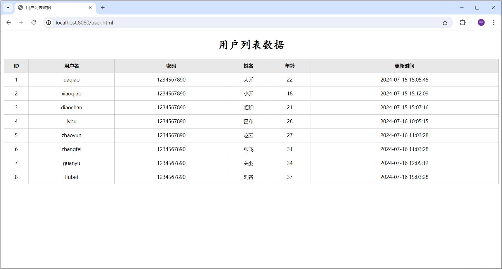

## 3.3 @ResponseBody

前面我们学习过 HTTP 协议的交互方式：请求响应模式（有请求就有响应）。那么 Controller 程序呢，除了接收请求外，还可以进行响应。

在我们前面所编写的 controller 方法中，都已经设置了响应数据。controller 方法中的 return 的结果，怎么就可以响应给浏览器呢？

> ✅ **答案：使用 `@ResponseBody` 注解。**

**`@ResponseBody` 注解：**

- **类型**：方法注解、类注解。
- **位置**：书写在 Controller 方法上或类上。
- **作用**：将方法返回值直接响应给浏览器，如果返回值类型是实体对象/集合，将会转换为 JSON 格式后在响应给浏览器。

但是在我们所书写的 Controller 中，只在类上添加了 `@RestController` 注解、方法添加了 `@RequestMapping` 注解，并没有使用 `@ResponseBody` 注解，怎么给浏览器响应呢？

这是因为，我们在类上加了 `@RestController` 注解，而这个注解是由两个注解组合起来的，分别是：`@Controller`、`@ResponseBody`。那也就意味着，我们在类上已经添加了 `@ResponseBody` 注解了，而一旦在类上加了 `@ResponseBody` 注解，就相当于该类所有的方法中都已经添加了 `@ResponseBody` 注解。

> 💡 **提示**：前后端分离的项目中，一般直接在请求处理类上加 `@RestController` 注解，就无需在方法上加 `@ResponseBody` 注解了。

## 3.4 问题分析

上述案例的功能，我们虽然已经实现，但是呢，我们会发现案例中：解析文本文件中的数据，处理数据的逻辑代码，给页面响应的代码全部都堆积在一起了，全部都写在 controller 方法中了。

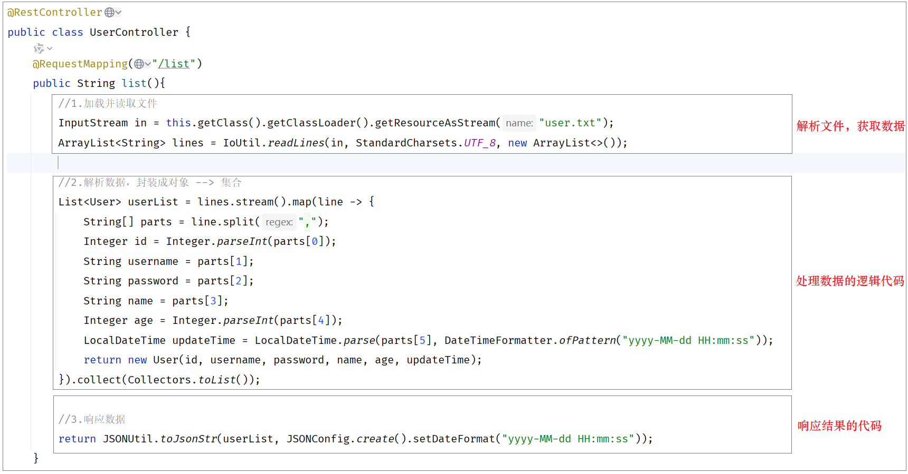

当前程序的这个业务逻辑还是比较简单的，如果业务逻辑再稍微复杂一点，我们会看到 Controller 方法的代码量就很大了。

- 当我们要修改操作数据部分的代码，需要改动 Controller
- 当我们要完善逻辑处理部分的代码，需要改动 Controller
- 当我们需要修改数据响应的代码，还是需要改动 Controller

这样呢，就会造成我们整个工程代码的复用性比较差，而且代码难以维护。那如何解决这个问题呢？其实在现在的开发中，有非常成熟的解决思路，那就是 **分层开发**。

---

# 4. 分层解耦

## 4.1 三层架构

### 4.1.1 介绍

在我们进行程序设计以及程序开发时，尽可能让每一个接口、类、方法的职责更单一些（**单一职责原则**）。

> ✅ **单一职责原则**：一个类或一个方法，就只做一件事情，只管一块功能。
>
> 这样就可以让类、接口、方法的复杂度更低，可读性更强，扩展性更好，也更利于后期的维护。

我们之前开发的程序呢，并不满足单一职责原则。下面我们来分析下之前的程序：

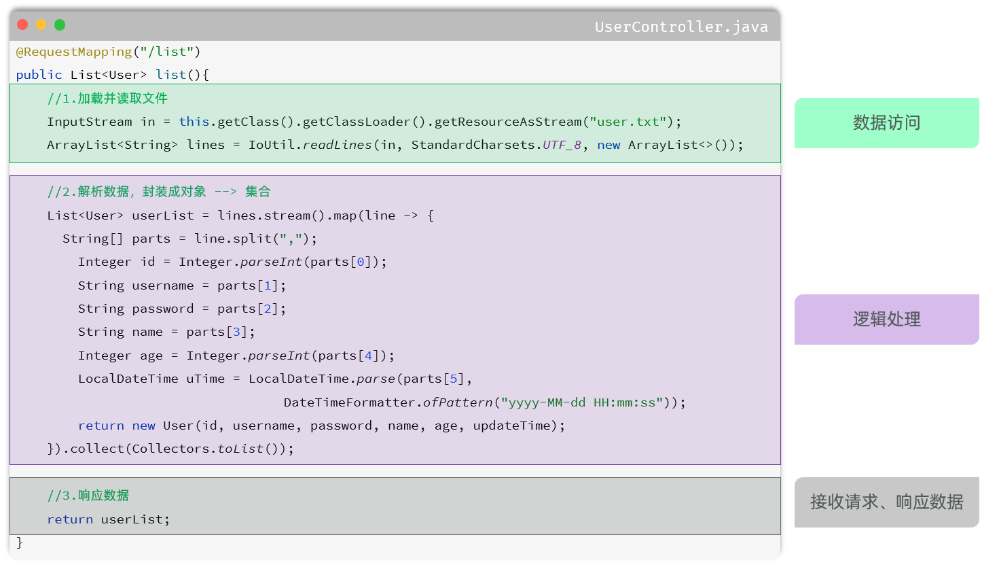

那其实我们上述案例的处理逻辑呢，从组成上看可以分为三个部分：

- **数据访问**：负责业务数据的维护操作，包括增、删、改、查等操作。
- **逻辑处理**：负责业务逻辑处理的代码。
- **请求处理、响应数据**：负责，接收页面的请求，给页面响应数据。

按照上述的三个组成部分，在我们项目开发中呢，可以将代码分为 **三层**，如图所示：

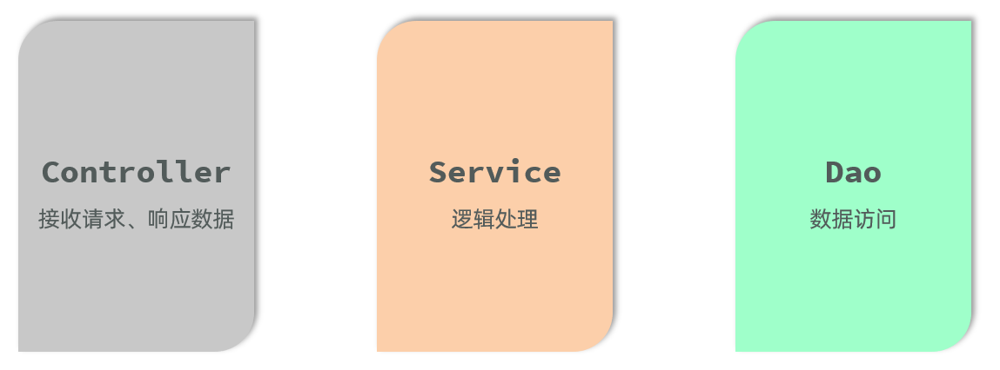

> ✅ **三层架构**
> - **Controller**：控制层。接收前端发送的请求，对请求进行处理，并响应数据。
> - **Service**：业务逻辑层。处理具体的业务逻辑。
> - **Dao**：数据访问层（Data Access Object），也称为持久层。负责数据访问操作，包括数据的增、删、改、查。

基于三层架构的程序执行流程，如图所示：

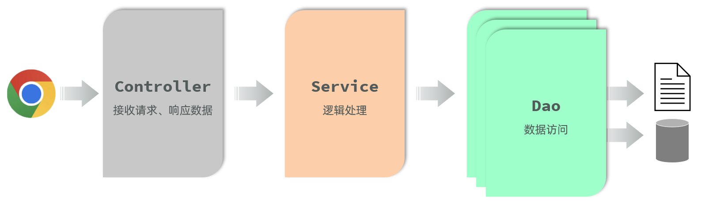

- 前端发起的请求，由 Controller 层接收（Controller 响应数据给前端）
- Controller 层调用 Service 层来进行逻辑处理（Service 层处理完后，把处理结果返回给 Controller 层）
- Service 层调用 Dao 层（逻辑处理过程中需要用到的一些数据要从 Dao 层获取）
- Dao 层操作文件中的数据（Dao 拿到的数据会返回给 Service 层）

> 📌 **思考**：按照三层架构的思想，如果要对业务逻辑（Service 层）进行变更，会影响到 Controller 层和 Dao 层吗？
>
> **答案**：不会影响。（程序的扩展性、维护性变得更好了）

### 4.1.2 代码拆分

我们使用三层架构思想，来改造下之前的程序：

- 控制层包名：`com.itheima.controller`
- 业务逻辑层包名：`com.itheima.service`
- 数据访问层包名：`com.itheima.dao`

**1）控制层**：接收前端发送的请求，对请求进行处理，并响应数据。

在 `com.itheima.controller` 中创建 UserController 类，代码如下：

```java
package com.itheima.controller;

import com.itheima.pojo.User;
import com.itheima.service.UserService;
import com.itheima.service.impl.UserServiceImpl;
import org.springframework.web.bind.annotation.RequestMapping;
import org.springframework.web.bind.annotation.RestController;
import java.util.List;

@RestController
public class UserController {

    private UserService userService = new UserServiceImpl();

    @RequestMapping("/list")
    public List<User> list(){
        //1. 调用Service
        List<User> userList = userService.findAll();
        //2. 响应数据
        return userList;
    }

}
```

**2）业务逻辑层**：处理具体的业务逻辑。

在 `com.itheima.service` 中创建 UserService 接口，代码如下：

```java
package com.itheima.service;

import com.itheima.pojo.User;
import java.util.List;

public interface UserService {

    public List<User> findAll();

}
```

在 `com.itheima.service.impl` 中创建 UserServiceImpl 实现类，代码如下：

```java
package com.itheima.service.impl;

import com.itheima.dao.UserDao;
import com.itheima.dao.impl.UserDaoImpl;
import com.itheima.pojo.User;
import com.itheima.service.UserService;

import java.time.LocalDateTime;
import java.time.format.DateTimeFormatter;
import java.util.List;
import java.util.stream.Collectors;

public class UserServiceImpl implements UserService {

    private UserDao userDao = new UserDaoImpl();

    @Override
    public List<User> findAll() {
        List<String> lines = userDao.findAll();
        List<User> userList = lines.stream().map(line -> {
            String[] parts = line.split(",");
            Integer id = Integer.parseInt(parts[0]);
            String username = parts[1];
            String password = parts[2];
            String name = parts[3];
            Integer age = Integer.parseInt(parts[4]);
            LocalDateTime updateTime = LocalDateTime.parse(parts[5],
                    DateTimeFormatter.ofPattern("yyyy-MM-dd HH:mm:ss"));
            return new User(id, username, password, name, age, updateTime);
        }).collect(Collectors.toList());
        return userList;
    }
}
```

**3）数据访问层**：负责数据的访问操作，包含数据的增、删、改、查。

在 `com.itheima.dao` 中创建 UserDao 接口，代码如下：

```java
package com.itheima.dao;

import java.util.List;

public interface UserDao {

    public List<String> findAll();

}
```

在 `com.itheima.dao.impl` 中创建 UserDaoImpl 实现类，代码如下：

```java
package com.itheima.dao.impl;

import cn.hutool.core.io.IoUtil;
import com.itheima.dao.UserDao;

import java.io.InputStream;
import java.nio.charset.StandardCharsets;
import java.util.ArrayList;
import java.util.List;

public class UserDaoImpl implements UserDao {
    @Override
    public List<String> findAll() {
        InputStream in = this.getClass().getClassLoader().getResourceAsStream("user.txt");
        ArrayList<String> lines = IoUtil.readLines(in, StandardCharsets.UTF_8, new ArrayList<>());
        return lines;
    }
}
```

具体的请求调用流程：

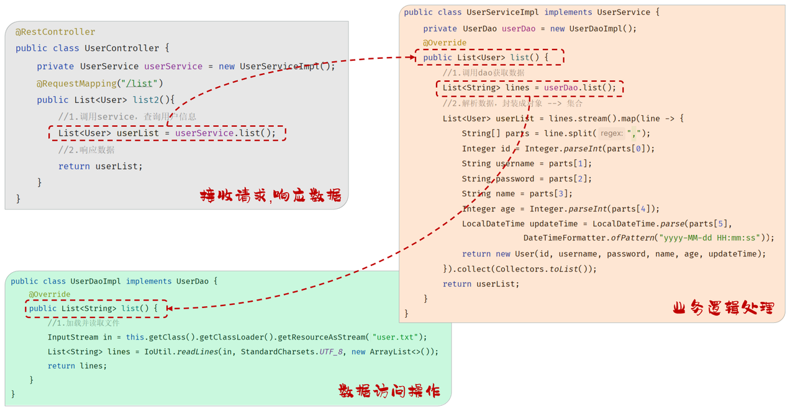

> 📌 **三层架构的好处：**
> 1. 复用性强
> 2. 便于维护
> 3. 利于扩展

## 4.2 分层解耦

### 4.2.1 问题分析

由于我们现在在程序中，需要什么对象，直接 new 一个对象 `new UserServiceImpl()`。

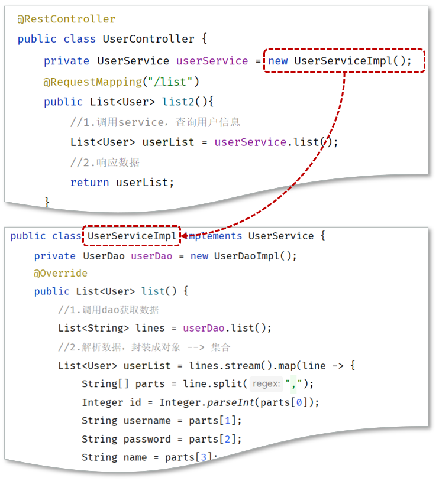

如果说我们需要更换实现类，比如由于业务的变更，`UserServiceImpl` 不能满足现有的业务需求，我们需要切换为 `UserServiceImpl2` 这套实现，就需要修改 Controller 的代码，需要创建 `UserServiceImpl2` 的实现 `new UserServiceImpl2()`。

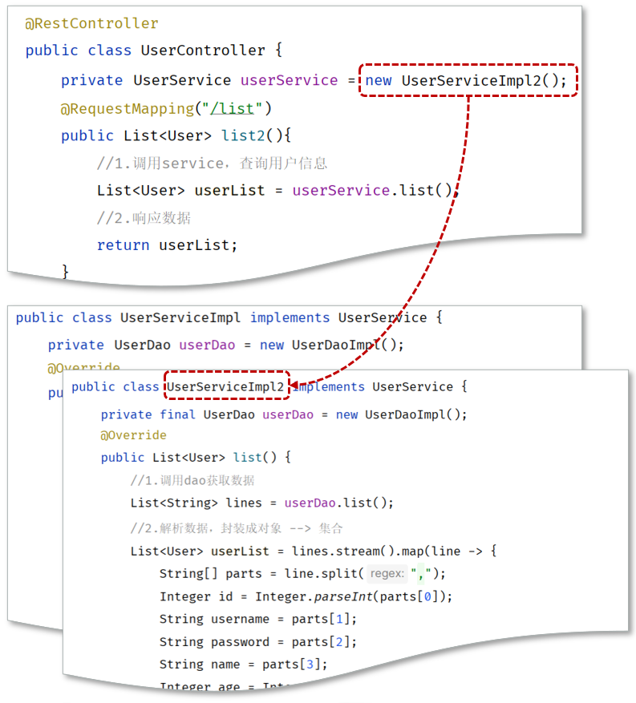

Service 中调用 Dao，也是类似的问题。这种呢，我们就称之为层与层之间 **耦合** 了。那什么是耦合呢？

首先需要了解软件开发涉及到的两个概念：**内聚** 和 **耦合**。

- **内聚**：软件中各个功能模块内部的功能联系。
- **耦合**：衡量软件中各个层/模块之间的依赖、关联的程度。

> ✅ **软件设计原则：高内聚低耦合。**
>
> - **高内聚**：指的是一个模块中各个元素之间的联系的紧密程度，如果各个元素（语句、程序段）之间的联系程度越高，则内聚性越高，即 "高内聚"。
> - **低耦合**：指的是软件中各个层、模块之间的依赖关联程序越低越好。

目前层与层之间是存在耦合的，Controller 耦合了 Service、Service 耦合了 Dao。而高内聚、低耦合的目的是使程序模块的可重用性、移植性大大增强。

那最终我们的目标呢，就是做到层与层之间，尽可能的降低耦合，甚至解除耦合。

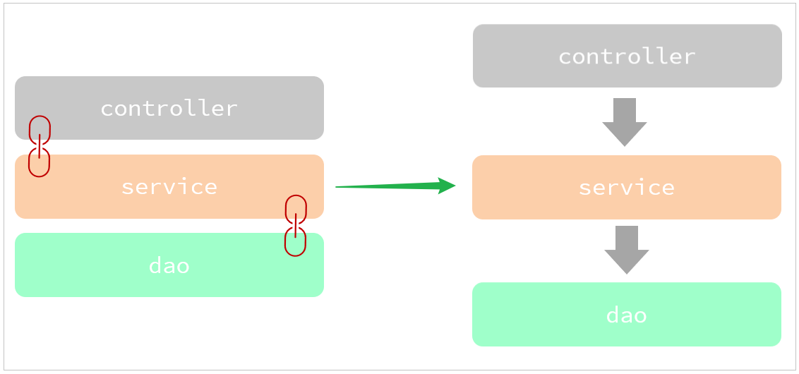

### 4.2.2 解耦思路

之前我们在编写代码时，需要什么对象，就直接 new 一个就可以了。这种做法呢，层与层之间代码就耦合了，当 service 层的实现变了之后，我们还需要修改 controller 层的代码。

那应该怎么解耦呢？

**1）首先不能在 EmpController 中使用 new 对象。代码如下：**

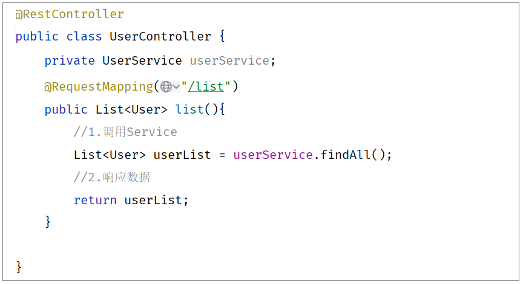

此时，就存在另一个问题了，不能 new，就意味着没有业务层对象（程序运行就报错），怎么办呢？

我们的解决思路是：

- 提供一个 **容器**，容器中存储一些对象（例：UserService 对象）
- Controller 程序从容器中获取 UserService 类型的对象

**2）将要用到的对象交给一个容器管理。**

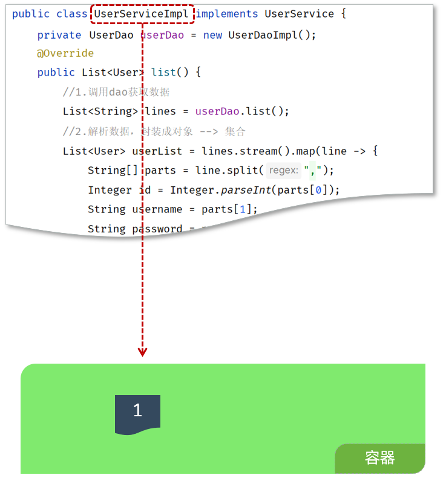

**3）应用程序中用到这个对象，就直接从容器中获取。**

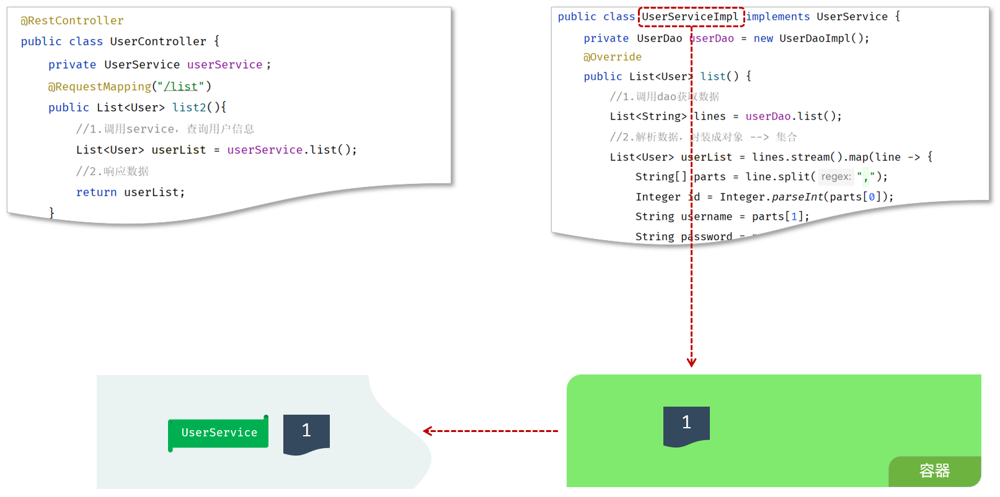

那问题来了，我们如何将对象交给容器管理呢？程序运行时，容器如何为程序提供依赖的对象呢？我们想要实现上述解耦操作，就涉及到 Spring 中的两个核心概念：

> 📌 **IOC 与 DI**
>
> - **控制反转**：Inversion Of Control，简称 **IOC**。对象的创建控制权由程序自身转移到外部（容器），这种思想称为控制反转。
>   - 对象的创建权由程序员主动创建转移到容器（由容器创建、管理对象）。这个容器称为：**IOC 容器** 或 **Spring 容器**。
> - **依赖注入**：Dependency Injection，简称 **DI**。容器为应用程序提供运行时，所依赖的资源，称之为依赖注入。
>   - 程序运行时需要某个资源，此时容器就为其提供这个资源。
>   - 例：EmpController 程序运行时需要 EmpService 对象，Spring 容器就为其提供并注入 EmpService 对象。
> - **bean 对象**：IOC 容器中创建、管理的对象，称之为：bean 对象。

## 4.3 IOC&DI 入门

**1）将 Service 及 Dao 层的实现类，交给 IOC 容器管理。**

在实现类加上 `@Component` 注解，就代表把当前类产生的对象交给 IOC 容器管理。

**A. UserDaoImpl**

```java
@Component
public class UserDaoImpl implements UserDao {
    @Override
    public List<String> findAll() {
        InputStream in = this.getClass().getClassLoader().getResourceAsStream("user.txt");
        ArrayList<String> lines = IoUtil.readLines(in, StandardCharsets.UTF_8, new ArrayList<>());
        return lines;
    }
}
```

**B. UserServiceImpl**

```java
@Component
public class UserServiceImpl implements UserService {

    private UserDao userDao;

    @Override
    public List<User> findAll() {
        List<String> lines = userDao.findAll();
        List<User> userList = lines.stream().map(line -> {
            String[] parts = line.split(",");
            Integer id = Integer.parseInt(parts[0]);
            String username = parts[1];
            String password = parts[2];
            String name = parts[3];
            Integer age = Integer.parseInt(parts[4]);
            LocalDateTime updateTime = LocalDateTime.parse(parts[5],
                    DateTimeFormatter.ofPattern("yyyy-MM-dd HH:mm:ss"));
            return new User(id, username, password, name, age, updateTime);
        }).collect(Collectors.toList());
        return userList;
    }
}
```

**2）为 Controller 及 Service 注入运行时所依赖的对象。**

**A. UserServiceImpl**

```java
@Component
public class UserServiceImpl implements UserService {

    @Autowired
    private UserDao userDao;

    @Override
    public List<User> findAll() {
        List<String> lines = userDao.findAll();
        List<User> userList = lines.stream().map(line -> {
            String[] parts = line.split(",");
            Integer id = Integer.parseInt(parts[0]);
            String username = parts[1];
            String password = parts[2];
            String name = parts[3];
            Integer age = Integer.parseInt(parts[4]);
            LocalDateTime updateTime = LocalDateTime.parse(parts[5],
                    DateTimeFormatter.ofPattern("yyyy-MM-dd HH:mm:ss"));
            return new User(id, username, password, name, age, updateTime);
        }).collect(Collectors.toList());
        return userList;
    }
}
```

**B. UserController**

```java
@RestController
public class UserController {

    @Autowired
    private UserService userService;

    @RequestMapping("/list")
    public List<User> list(){
        //1. 调用Service
        List<User> userList = userService.findAll();
        //2. 响应数据
        return userList;
    }

}
```

启动服务，运行测试。打开浏览器，地址栏直接访问：`http://localhost:8080/user.html`。依然正常访问，就说明入门程序完成了。已经完成了层与层之间的解耦。

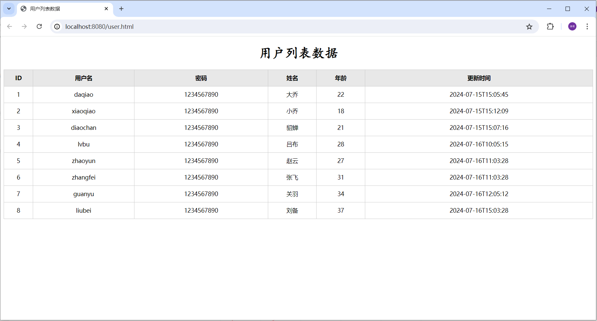

## 4.4 IOC 详解

通过 IOC 和 DI 的入门程序呢，我们已经基本了解了 IOC 和 DI 的基础操作。接下来呢，我们学习下 IOC 控制反转和 DI 依赖注入的细节。

### 4.3.4.1 Bean 的声明

前面我们提到 IOC 控制反转，就是将对象的控制权交给 Spring 的 IOC 容器，由 IOC 容器创建及管理对象。IOC 容器创建的对象称为 bean 对象。

在之前的入门案例中，要把某个对象交给 IOC 容器管理，需要在类上添加一个注解：`@Component`。

而 Spring 框架为了更好的标识 web 应用程序开发当中，bean 对象到底归属于哪一层，又提供了 `@Component` 的衍生注解：

| 注解 | 说明 | 位置 |
| --- | --- | --- |
| `@Component` | 声明 bean 的基础注解 | 不属于以下三类时，用此注解 |
| `@Controller` | `@Component` 的衍生注解 | 标注在控制层类上 |
| `@Service` | `@Component` 的衍生注解 | 标注在业务层类上 |
| `@Repository` | `@Component` 的衍生注解 | 标注在数据访问层类上（由于与 mybatis 整合，用的少） |

那么此时，我们就可以使用 `@Service` 注解声明 Service 层的 bean，使用 `@Repository` 注解声明 Dao 层的 bean。代码实现如下：

**Service 层：**

```java
@Service
public class UserServiceImpl implements UserService {

    private UserDao userDao;

    @Override
    public List<User> findAll() {
        List<String> lines = userDao.findAll();
        List<User> userList = lines.stream().map(line -> {
            String[] parts = line.split(",");
            Integer id = Integer.parseInt(parts[0]);
            String username = parts[1];
            String password = parts[2];
            String name = parts[3];
            Integer age = Integer.parseInt(parts[4]);
            LocalDateTime updateTime = LocalDateTime.parse(parts[5],
                    DateTimeFormatter.ofPattern("yyyy-MM-dd HH:mm:ss"));
            return new User(id, username, password, name, age, updateTime);
        }).collect(Collectors.toList());
        return userList;
    }
}
```

**Dao 层：**

```java
@Repository
public class UserDaoImpl implements UserDao {
    @Override
    public List<String> findAll() {
        InputStream in = this.getClass().getClassLoader().getResourceAsStream("user.txt");
        ArrayList<String> lines = IoUtil.readLines(in, StandardCharsets.UTF_8, new ArrayList<>());
        return lines;
    }
}
```

> 📌 **注意 1**：声明 bean 的时候，可以通过注解的 value 属性指定 bean 的名字，如果没有指定，默认为类名首字母小写。
>
> **注意 2**：使用以上四个注解都可以声明 bean，但是在 springboot 集成 web 开发中，声明控制器 bean 只能用 `@Controller`。

### 4.3.4.2 组件扫描

> ❗ **问题**：使用前面学习的四个注解声明的 bean，一定会生效吗？
>
> **答案**：不一定。（原因：bean 想要生效，还需要被组件扫描）

- 前面声明 bean 的四大注解，要想生效，还需要被组件扫描注解 `@ComponentScan` 扫描。
- 该注解虽然没有显式配置，但是实际上已经包含在了启动类声明注解 `@SpringBootApplication` 中，默认扫描的范围是 **启动类所在包及其子包**。

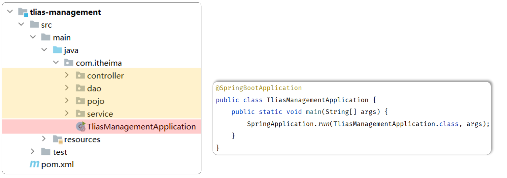

所以，我们在项目开发中，只需要按照如上项目结构，将项目中的所有的业务类，都放在启动类所在包的子包中，就无需考虑组件扫描问题。

## 4.5 DI 详解

上一小节我们讲解了控制反转 IOC 的细节，接下来呢，我们学习依赖注入 DI 的细节。

依赖注入，是指 IOC 容器要为应用程序去提供运行时所依赖的资源，而资源指的就是对象。

在入门程序案例中，我们使用了 `@Autowired` 这个注解，完成了依赖注入的操作，而这个 Autowired 翻译过来叫：**自动装配**。

`@Autowired` 注解，默认是按照 **类型** 进行自动装配的（去 IOC 容器中找某个类型的对象，然后完成注入操作）。

> 入门程序举例：在 EmpController 运行的时候，就要到 IOC 容器当中去查找 EmpService 这个类型的对象，而我们的 IOC 容器中刚好有一个 EmpService 这个类型的对象，所以就找到了这个类型的对象完成注入操作。

### 4.5.1 @Autowired 用法

`@Autowired` 进行依赖注入，常见的方式，有如下三种：

**1）属性注入**

```java
@RestController
public class UserController {

    //方式一: 属性注入
    @Autowired
    private UserService userService;

}
```

- 优点：代码简洁、方便快速开发。
- 缺点：隐藏了类之间的依赖关系、可能会破坏类的封装性。

**2）构造函数注入**

```java
@RestController
public class UserController {

    //方式二: 构造器注入
    private final UserService userService;

    @Autowired //如果当前类中只存在一个构造函数, @Autowired可以省略
    public UserController(UserService userService) {
        this.userService = userService;
    }

}
```

- 优点：能清晰地看到类的依赖关系、提高了代码的安全性。
- 缺点：代码繁琐、如果构造参数过多，可能会导致构造函数臃肿。
- **注意：如果只有一个构造函数，`@Autowired` 注解可以省略。**（通常来说，也只有一个构造函数）

**3）setter 注入**

```java
/**
 * 用户信息Controller
 */
@RestController
public class UserController {

    //方式三: setter注入
    private UserService userService;

    @Autowired
    public void setUserService(UserService userService) {
        this.userService = userService;
    }

}
```

- 优点：保持了类的封装性，依赖关系更清晰。
- 缺点：需要额外编写 setter 方法，增加了代码量。

> 🏕️ 在项目开发中，基于 `@Autowired` 进行依赖注入时，基本都是第一种和第二种方式。（官方推荐第二种方式，因为会更加规范）但是在企业项目开发中，很多的项目中，也会选择第一种方式因为更加简洁、高效（在规范性方面进行了妥协）。

### 4.5.2 注意事项

那如果在 IOC 容器中，存在多个相同类型的 bean 对象，会出现什么情况呢？

在下面的例子中，我们准备了两个 UserService 的实现类，并且都交给了 IOC 容器管理。代码如下：

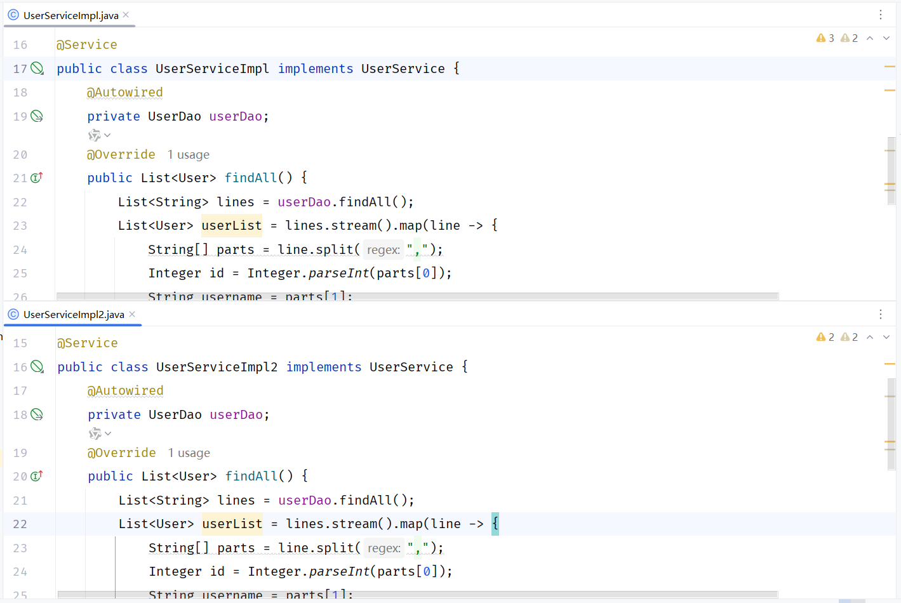

此时，我们启动项目会发现，控制台报错了：

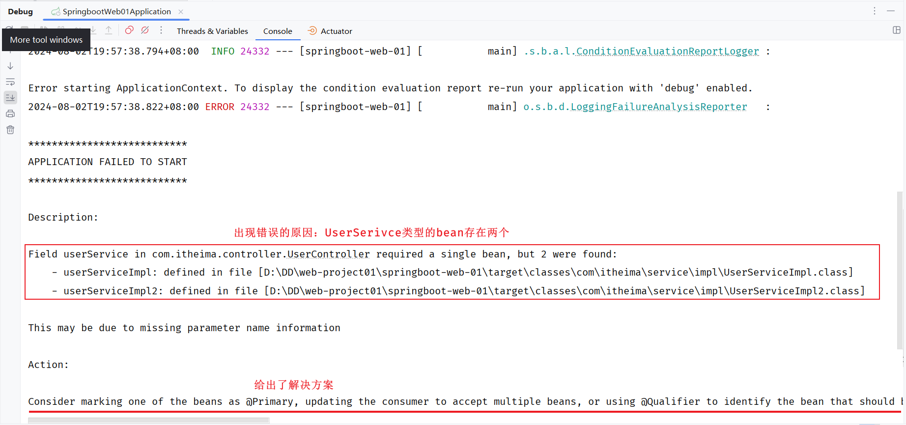

出现错误的原因呢，是因为在 Spring 的容器中，UserService 这个类型的 bean 存在两个，框架不知道具体要注入哪个 bean 使用，所以就报错了。

如何解决上述问题呢？Spring 提供了以下几种解决方案：

- `@Primary`
- `@Qualifier`
- `@Resource`

**方案一：使用 `@Primary` 注解**

当存在多个相同类型的 Bean 注入时，加上 `@Primary` 注解，来确定默认的实现。

```java
@Primary
@Service
public class UserServiceImpl implements UserService {
}
```

**方案二：使用 `@Qualifier` 注解**

指定当前要注入的 bean 对象。在 `@Qualifier` 的 value 属性中，指定注入的 bean 的名称。`@Qualifier` 注解不能单独使用，必须配合 `@Autowired` 使用。

```java
@RestController
public class UserController {

    @Qualifier("userServiceImpl")
    @Autowired
    private UserService userService;
```

**方案三：使用 `@Resource` 注解**

是按照 bean 的名称进行注入。通过 name 属性指定要注入的 bean 的名称。

```java
@RestController
public class UserController {

    @Resource(name = "userServiceImpl")
    private UserService userService;
```

> 📌 **面试题：`@Autowired` 与 `@Resource` 的区别**
>
> - `@Autowired` 是 spring 框架提供的注解，而 `@Resource` 是 JDK 提供的注解。
> - `@Autowired` 默认是按照类型注入，而 `@Resource` 是按照名称注入。

---

# 附录：常见状态码

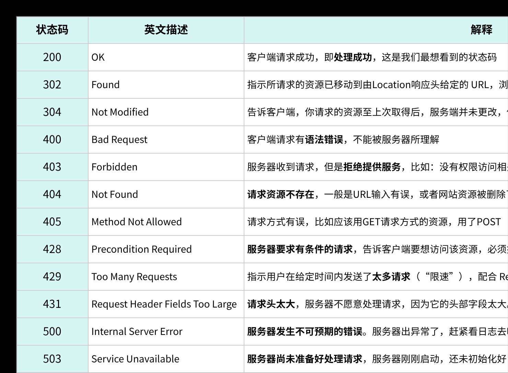

| 状态码 | 英文描述 | 解释 |
| --- | --- | --- |
| `200` | OK | 客户端请求成功，即处理成功，这是我们最想看到的状态码 |
| `302` | Found | 指示所请求的资源已移动到由 Location 响应头给定的 URL，浏览器会自动重新访问到这个页面 |
| `304` | Not Modified | 告诉客户端，你请求的资源至上次取得后，服务端并未更改，你直接用你本地缓存即可。隐式重定向 |
| `400` | Bad Request | 客户端请求有语法错误，不能被服务器所理解 |
| `403` | Forbidden | 服务器收到请求，但是拒绝提供服务，比如：没有权限访问相关资源 |
| `404` | Not Found | 请求资源不存在，一般是 URL 输入有误，或者网站资源被删除了 |
| `405` | Method Not Allowed | 请求方式有误，比如应该用 GET 请求方式的资源，用了 POST |
| `429` | Too Many Requests | 指示用户在给定时间内发送了太多请求（"限速"），配合 Retry-After（多长时间后可以请求）响应头一起使用 |
| `431` | Request Header Fields Too Large | 请求头太大，服务器不愿意处理请求，因为它的头字段太大。请求可以在减少请求头域的大小后重新提交 |
| `500` | Internal Server Error | 服务器发生不可预期的错误。服务器出异常了，赶紧通知后端程序员 |
| `503` | Service Unavailable | 服务器尚未准备好处理请求，服务器刚刚启动，还未初始化好 |

> 📎 **状态码大全**：https://cloud.tencent.com/developer/chapter/13553
