# 05-Web后端基础(数据库)

> ⛳ 如果大家在自学的过程中，时间紧迫、没有方向、经常遇到难以解决的 Bug、没有亮眼的项目、缺少 AI 大模型经验，而又想快速系统化的学习、高薪就业的小伙伴儿，大家都可以 🔗 直接点我，了解一下我们系统化的课程体系。

---

# 1. 前言

## 1.1 引言

在我们讲解 SpringBootWeb 基础知识（IOC、DI 等）的时候，我们讲到在 web 开发中，为了应用程序职责单一，方便维护，我们一般将 web 应用程序分为三层，即：**Controller、Service、Dao**。

之前我们的案例中，是这样子的请求流程：浏览器发起请求，先请求 Controller；Controller 接收到请求之后，调用 Service 进行业务逻辑处理；Service 再调用 Dao，Dao 再解析 `user.txt` 中所存储的数据。


txt 文件中可以存储数据，但是在企业项目开发中一般不会使用文本文件存储项目数据，因为不便管理维护，操作难度大。

在真实的企业开发中呢，都会采用 **数据库** 来存储和管理数据，那此时，web 开发调用流程图如下所示：

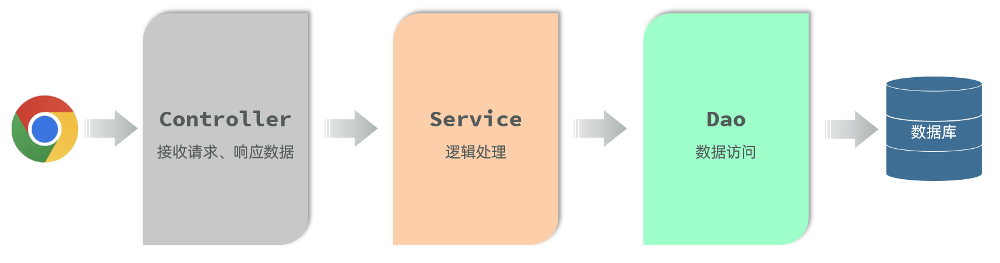

那么今天我们就要来学习数据库技术。

## 1.2 相关概念

首先来了解一下什么是数据库。

> ✅ **数据库**：英文为 DataBase，简称 **DB**，它是存储和管理数据的仓库。

像我们日常访问的电商网站京东，企业内部的管理系统 OA、ERP、CRM 这类的系统，以及大家每天都会刷的头条、抖音类的 app，那这些大家所看到的数据，其实都是存储在数据库中的。

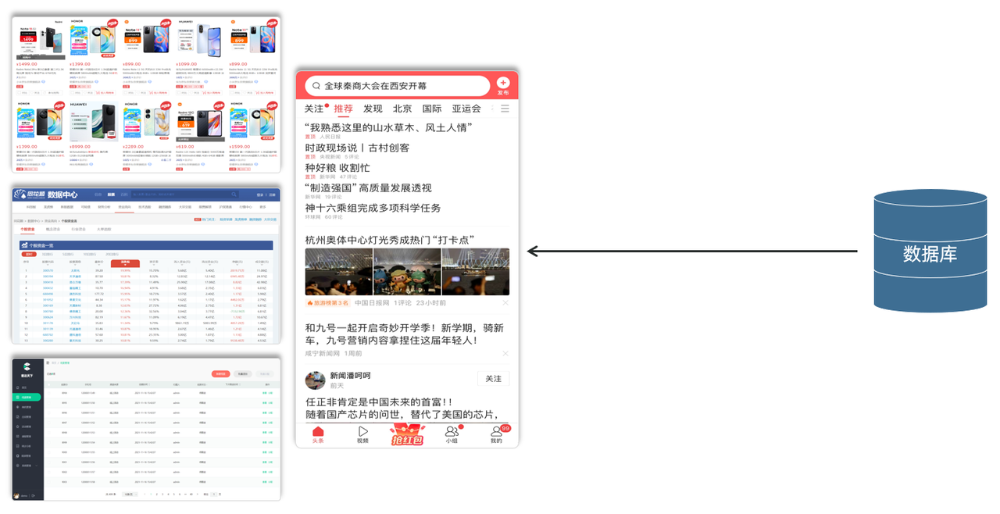

数据是存储在数据库中的，那我们要如何来操作数据库以及数据库中所存放的数据呢？那这里呢，会涉及到一个软件，那就是数据库管理系统。

> ✅ **数据库管理系统**（DataBase Management System，简称 **DBMS**），是操作和管理数据库的大型软件。

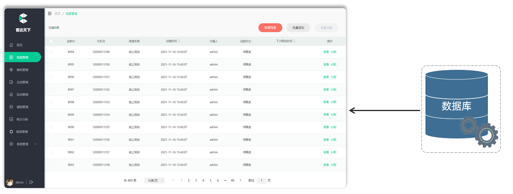

此时又出现一个问题：DBMS 这个软件怎么知道要操作的是哪个数据库、哪个数据呢？需要给 DBMS 软件发送一条指令，告诉这个软件我们要执行的是什么样的操作。而这个指令就是 **SQL 语句**。

> ✅ **SQL**（Structured Query Language，简称 SQL）：结构化查询语言，它是操作关系型数据库的编程语言，定义了一套操作关系型数据库的统一标准。

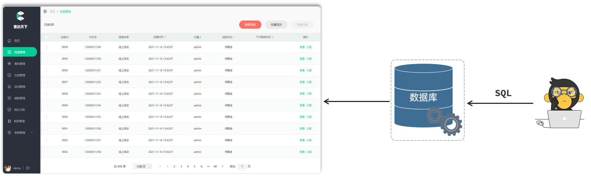

我们学习数据库开发，最为重要的就是学习 **SQL 语句**。

> 📌 **关系型数据库**：我们后面会详细讲解，现在大家只需要知道我们学习的数据库属于关系型数据库即可。

> ✅ **结论**：程序员给数据库管理系统（DBMS）发送 SQL 语句，再由数据库管理系统操作数据库当中的数据。

了解了数据库的一些简单概念之后，接下来我们再来介绍下目前主流的数据库，这里截取了排名前十的数据库：

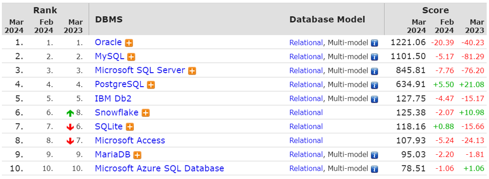

- **Oracle**：大型的收费数据库，Oracle 公司产品，价格昂贵。（通常是不差钱的公司会选择使用这个数据库）
- **MySQL**：开源免费的中小型数据库，后来 Sun 公司收购了 MySQL，而 Oracle 又收购了 Sun 公司。目前 Oracle 推出两个版本的 MySQL：社区版（开源免费）、商业版（收费）。
- **SQL Server**：Microsoft 公司推出的收费的中型数据库，C#、.net 等语言常用。
- **PostgreSQL**：开源免费的中小型数据库。
- **DB2**：IBM 公司的大型收费数据库产品。
- **SQLLite**：嵌入式的微型数据库。Android 内置的数据库采用的就是该数据库。
- **MariaDB**：开源免费的中小型数据库。是 MySQL 数据库的另外一个分支、另外一个衍生产品，与 MySQL 数据库有很好的兼容性。

我们此次课程中学习的数据库是现在互联网公司开发使用最为流行的 **MySQL** 数据库。

> ✅ **结论**：只要我们学会了 SQL 语句，就可以通过 SQL 语句来操作 MySQL，也可以通过 SQL 语句来操作 Oracle 或 SQL Server。（因为这些数据库都属于关系型数据库，而 SQL 语句是操作关系型数据库的统一标准）

**课程内容安排：**

1. MySQL 概述
2. SQL 语句（DDL、DML、DQL）
3. 多表设计
4. 多表查询
5. 事务
6. 索引

那么今天呢，我们先来学习前两个章节（MySQL 概述、SQL 语句）。

---

# 2. MySQL 概述


> 官网：https://dev.mysql.com/

**MySQL 官方提供了两个版本：**

- **商业版本（MySQL Enterprise Edition）**
  - 该版本是收费的，我们可以使用 30 天。官方会提供对应的技术支持。
- **社区版本（MySQL Community Server）**
  - 该版本是免费的，但是 MySQL 不会提供任何的技术支持。

> ✅ 本课程，采用的是 MySQL 的社区版本（**8.0.34**）。

## 2.1 安装

官网下载地址：https://downloads.mysql.com/archives/community/

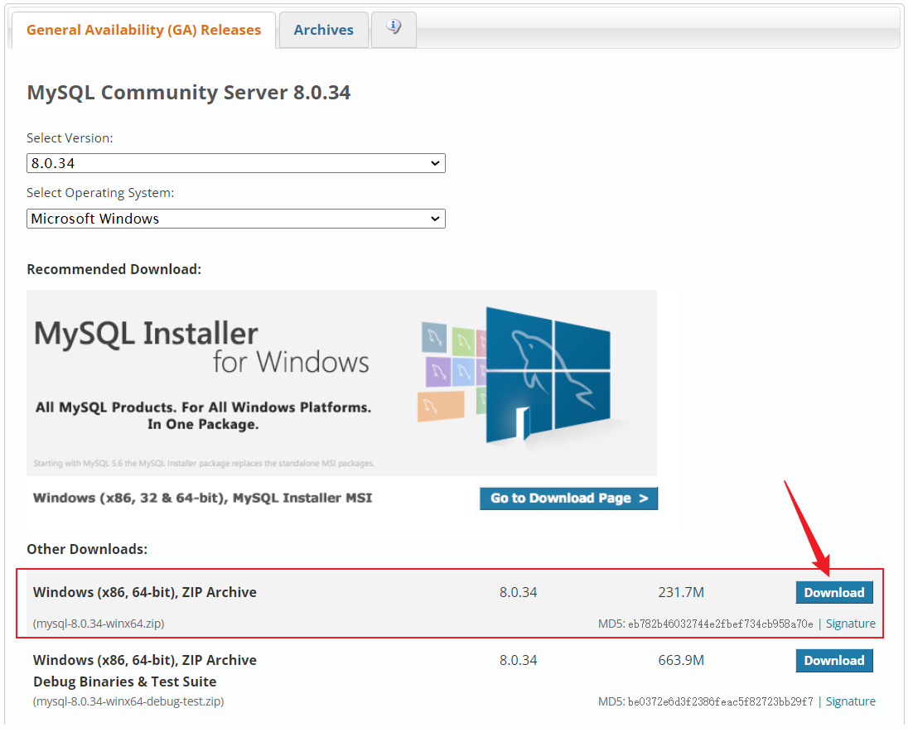

这个安装包呢，大家可以不用下载，因为资料中已提供现成的安装包。

> 📎 **附件**：`mysql-8.0.34-winx64.zip`

> ✅ 安装 MySQL 具体的步骤，参考 **《MySQL 安装文档》**，进行软件的安装即可。

## 2.2 连接

### 2.2.1 介绍

MySQL 服务器启动完毕后，然后再使用如下指令，来连接 MySQL 服务器：

```sql
mysql -u用户名 -p密码 [-h数据库服务器的IP地址 -P端口号]
```

- `-h` 参数不加，默认连接的是本地 `127.0.0.1` 的 MySQL 服务器。
- `-P` 参数不加，默认连接的端口号是 `3306`。

上述指令，可以有两种形式：

- 密码直接在 `-p` 参数之后直接指定（这种方式不安全，密码直接以明文形式出现在命令行）：

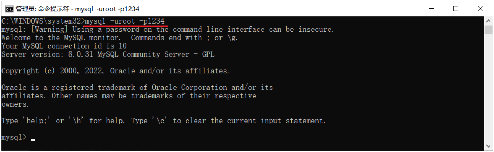

- 密码在 `-p` 回车之后，在命令行中输入密码，然后回车：

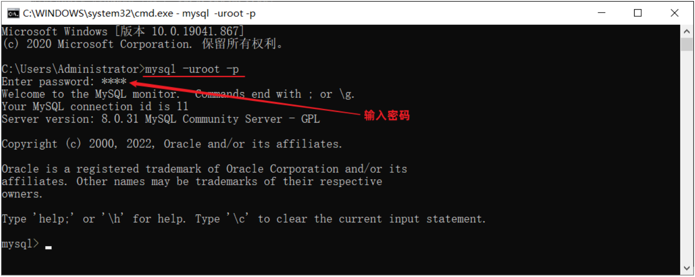

### 2.2.2 企业使用方式（了解）

上述的 MySQL 服务器我们是安装在本地的，这个仅仅是在我们学习阶段，在真实的企业开发中，MySQL 数据库服务器是不会在我们本地安装的，是在公司的服务器上安装的，而服务器还需要放置在专门的 IDC 机房中的，IDC 机房呢，就需要保证恒温、恒湿、恒压，而且还要保证网络、电源的可靠性（备用电源及网络）。


那我们要想使用服务器上的这台 MySQL 服务器，就需要在我们的电脑上去远程连接这台 MySQL。


接下来，就来演示一下，通过 MySQL 的客户端命令行，如何来连接服务器上部署的 MySQL：

```sql
mysql [-h数据库服务器的IP地址 -P端口号] -u用户名 -p密码
```

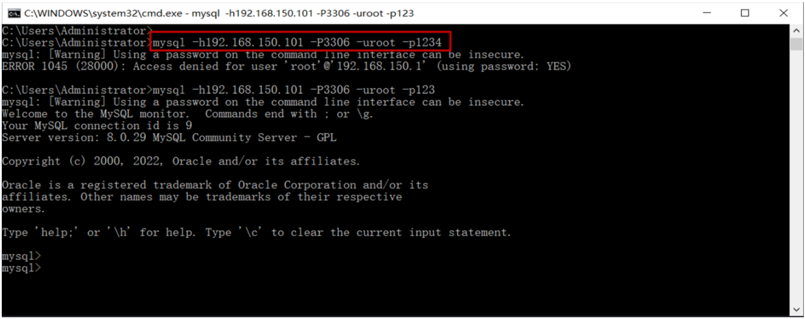

## 2.3 数据模型

在介绍 MySQL 的数据模型之前，需要先了解一个概念：关系型数据库。

### 2.3.1 关系型数据库（RDBMS）

**概念**：建立在关系模型基础上，由多张相互连接的 **二维表** 组成的数据库。而所谓二维表，指的是由行和列组成的表，如下图：

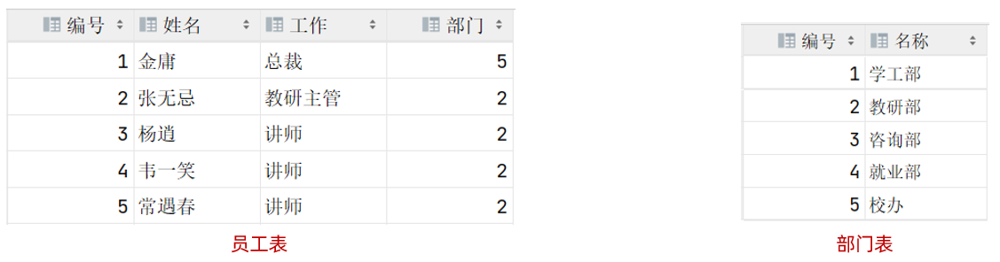

**二维表的优点：**

- 使用表存储数据，格式统一，便于维护。
- 使用 SQL 语言操作，标准统一，使用方便，可用于复杂查询。

> ✅ 我们之前提到的 MySQL、Oracle、DB2、SQLServer 这些都是属于关系型数据库，里面都是基于二维表存储数据的。
>
> **结论**：基于二维表存储数据的数据库就称为关系型数据库，不是基于二维表存储数据的数据库，就是非关系型数据库（比如大家后面要学习的 Redis，就属于非关系型数据库）。

### 2.3.2 数据模型

MySQL 是关系型数据库，是基于二维表进行数据存储的，具体的结构如下图：

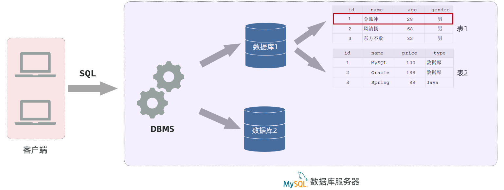

- 通过 MySQL 客户端连接数据库管理系统 DBMS，然后通过 DBMS 操作数据库。
- 使用 MySQL 客户端，向数据库管理系统发送一条 SQL 语句，由数据库管理系统根据 SQL 语句指令去操作数据库中的表结构及数据。
- 一个数据库服务器中可以创建多个数据库，一个数据库中也可以包含多张表，而一张表中又可以包含多行记录。

> ✅ 在 MySQL 数据库服务器当中存储数据，你需要：
> 1. 先去创建数据库（可以创建多个数据库，之间是相互独立的）
> 2. 在数据库下再去创建数据表（一个数据库下可以创建多张表）
> 3. 再将数据存放在数据表中（一张表可以存储多行数据）

---

# 3. SQL 语句

SQL：结构化查询语言。一门操作关系型数据库的编程语言，定义操作所有关系型数据库的统一标准。

> ✅ **SQL 语句根据其功能被分为四大类：DDL、DML、DQL、DCL。**

| 分类 | 全称 | 说明 |
| --- | --- | --- |
| **DDL** | Data Definition Language | 数据定义语言，用来定义数据库对象（数据库、表、字段） |
| **DML** | Data Manipulation Language | 数据操作语言，用来对数据库表中的数据进行增删改 |
| **DQL** | Data Query Language | 数据查询语言，用来查询数据库中表的记录 |
| **DCL** | Data Control Language | 数据控制语言，用来创建数据库用户、控制数据库的访问权限 |

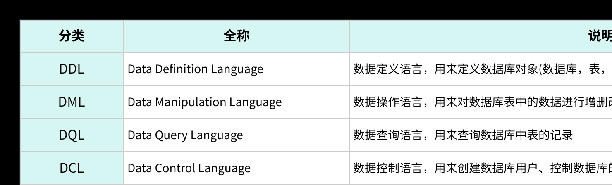

## 3.1 DDL 语句

DDL 英文全称是 Data Definition Language（数据定义语言），用来定义数据库对象（数据库、表）。

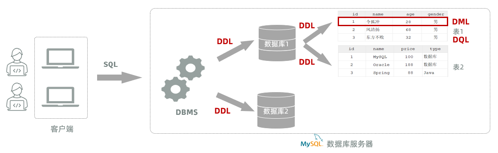

### 3.1.1 数据库操作

DDL 中数据库的常见操作：**查询、创建、使用、删除**。

#### 3.1.1.1 查询数据库

- **查询所有数据库：**

```sql
show databases;
```

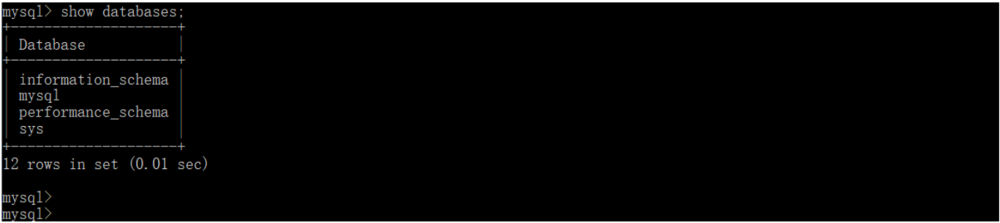

- **查询当前数据库：**

```sql
select database();
```

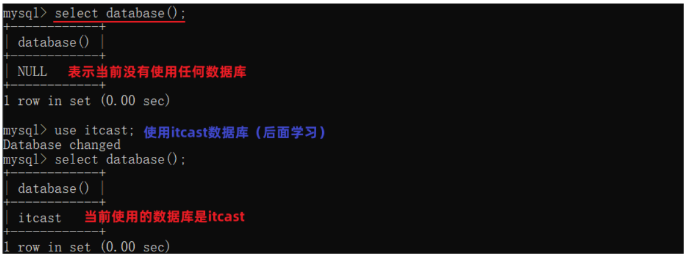

> ✅ 我们要操作某一个数据库，必须要切换到对应的数据库中。通过指令 `select database()`，就可以查询到当前所处的数据库。

#### 3.1.1.2 创建数据库

- **语法：**

```sql
create database [ if not exists ] 数据库名 [default charset utf8mb4];
```

创建数据库时，可以不指定字符集。因为在 MySQL8 版本之后，默认的字符集就是 `utf8mb4`。

- **案例**：创建一个 itcast 数据库。

```sql
create database itcast;
```

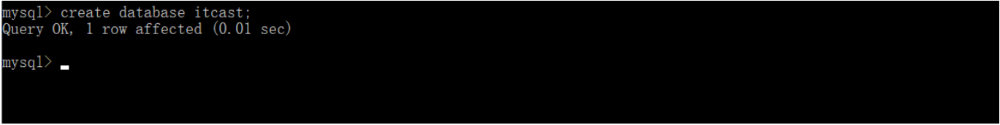

> ⚠️ **注意**：在同一个数据库服务器中，不能创建两个名称相同的数据库，否则将会报错。

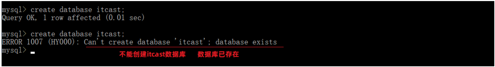

可以使用 `if not exists` 来避免这个问题：

```sql
-- 数据库不存在,则创建该数据库；如果存在则不创建
create database if not exists itcast;
```

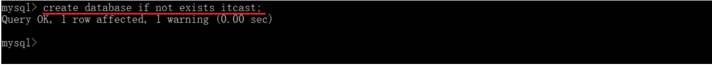

#### 3.1.1.3 使用数据库

- **语法：**

```sql
use 数据库名 ;
```

我们要操作某一个数据库下的表时，就需要通过该指令，切换到对应的数据库下，否则不能操作。

- **案例**：切换到 itcast 数据库。

```sql
use itcast;
```

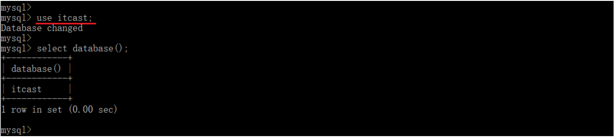

#### 3.1.1.4 删除数据库

- **语法：**

```sql
drop database [ if exists ] 数据库名 ;
```

- 如果删除一个不存在的数据库，将会报错。
- 可以加上参数 `if exists`，如果数据库存在，再执行删除，否则不执行删除。

- **案例**：删除 itcast 数据库。

```sql
drop database if exists itcast; -- itcast 数据库存在时删除
```

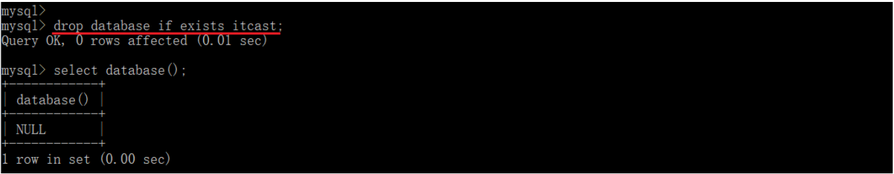

> ✅ **说明**：上述语法中的 `database`，也可以替换成 `schema`。
> - 如：`create schema db01;`
> - 如：`show schemas;`

### 3.1.2 图形化工具

#### 3.1.2.1 介绍

前面我们讲解了 DDL 中关于数据库操作的 SQL 语句，在我们编写这些 SQL 时，都是在命令行当中完成的。在命令行当中来敲这些 SQL 语句很不方便，主要的原因有以下 3 点：

1. 没有任何代码提示。（全靠记忆，容易敲错字母造成执行报错）
2. 操作繁琐，影响开发效率。（所有的功能操作都是通过 SQL 语句来完成的）
3. 编写过的 SQL 代码无法保存。

在项目开发当中，通常为了提高开发效率，都会借助于现成的图形化管理工具来操作数据库。目前 MySQL 主流的图形化界面工具有以下几种：


DataGrip 是 JetBrains 旗下的一款数据库管理工具，是管理和开发 MySQL、Oracle、PostgreSQL 的理想解决方案。官网：https://www.jetbrains.com/zh-cn/datagrip/

#### 3.1.2.2 安装

安装：参考资料中提供的《DataGrip 安装手册》。

> 📌 **说明**：DataGrip 这款工具可以不用安装，因为 Jetbrains 公司已经将 DataGrip 这款工具的功能已经集成到了 IDEA 当中，所以我们就可以使用 IDEA 来作为一款图形化界面工具来操作 MySQL 数据库。

#### 3.1.2.3 连接数据库

**1）创建 Project**

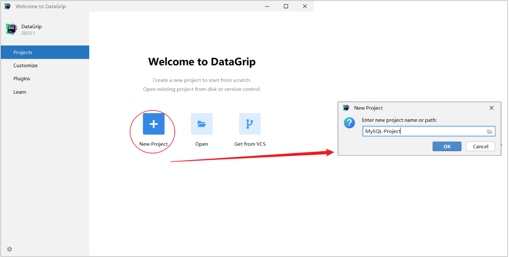

**2）创建连接**

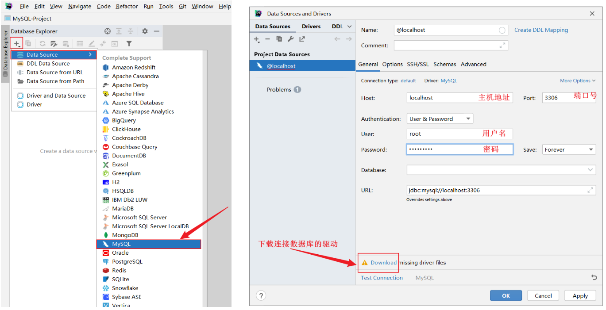

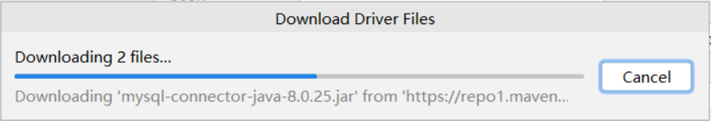

> 下载驱动，可能会比较耗时，耐心等待一会儿。

**3）测试连接**

下载完驱动之后，可以点击 `Test Connection` 来测试一下是否可以正常的连接数据库。

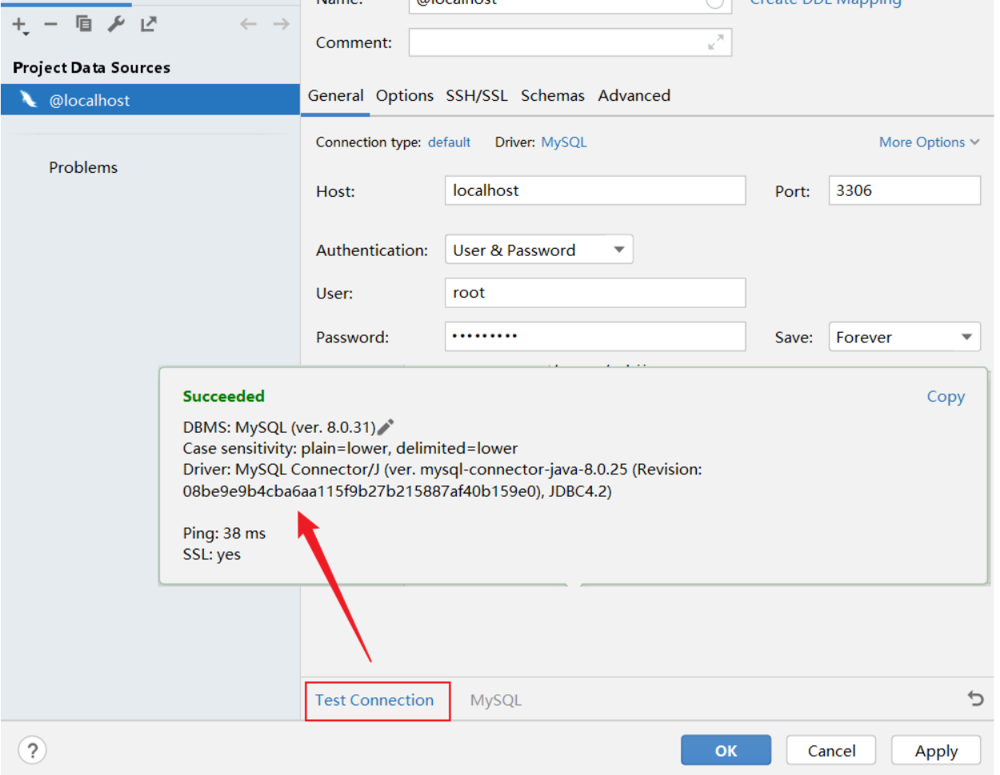

然后点击 `OK`，就已经连接上了 MySQL 数据库了。默认情况下，连接上了 MySQL 数据库之后，数据库并没有全部展示出来。需要选择要展示哪些数据库。

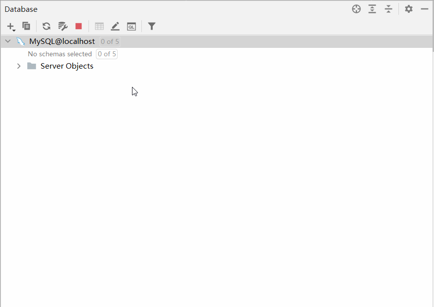

### 3.1.3 表操作

关于表结构的操作也是包含四个部分：**创建表、查询表、修改表、删除表**。

#### 3.1.3.1 创建

- **语法：**

```sql
create table 表名(
    字段1 字段1类型 [约束] [comment 字段1注释 ],
    字段2 字段2类型 [约束] [comment 字段2注释 ],
    ......
    字段n 字段n类型 [约束] [comment 字段n注释 ]
) [ comment 表注释 ] ;
```

> ⚠️ **注意**：`[ ]` 中的内容为可选参数；最后一个字段后面没有逗号。

- **案例**：创建 tb_user 表。

建表语句：

```sql
create table tb_user (
    id int comment 'ID,唯一标识',  # id 是一行数据的唯一标识（不能重复）
    username varchar(20) comment '用户名',
    name varchar(10) comment '姓名',
    age int comment '年龄',
    gender char(1) comment '性别'
) comment '用户表';
```

数据表创建完成后，双击打开 tb_user 表结构，会发现里面没有数据：

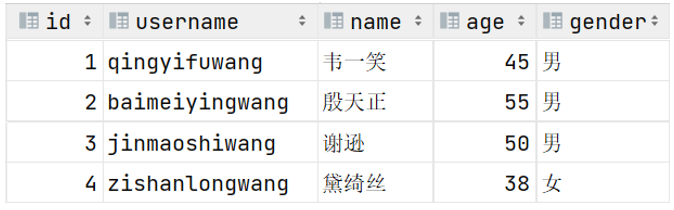

添加数据：

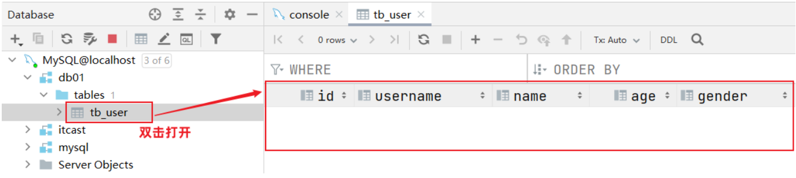

此时我们再插入一条数据：

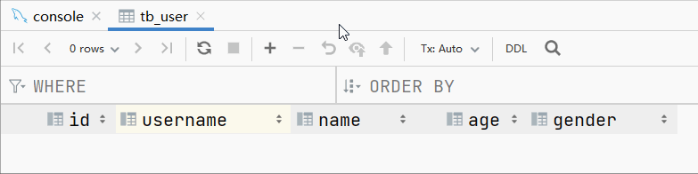

我们之前提到过：id 字段是一行数据的唯一标识，不能有重复值。但是现在数据表中有两个相同的 id 值，这是为什么呢？

- 其实我们现在创建表结构的时候，id 这个字段我们只加了一个备注信息说明它是一个唯一标识，但是在数据库层面呢，并没有去限制字段存储的数据。所以 id 这个字段没有起到唯一标识的作用。

> 📌 想要限制字段所存储的数据，就需要用到数据库中的 **约束**。

#### 3.1.3.2 约束

- **概念**：所谓约束就是作用在表中字段上的规则，用于限制存储在表中的数据。
- **作用**：就是来保证数据库当中数据的正确性、有效性和完整性。
- 在 MySQL 数据库当中，提供了以下 5 种约束：

| 约束 | 描述 |
| --- | --- |
| **非空约束** | 限制该字段值不能为 null |
| **唯一约束** | 保证字段的所有数据都是唯一、不重复的 |
| **主键约束** | 主键是一行数据的唯一标识，要求非空且唯一 |
| **默认约束** | 保存数据时，如果未指定该字段值，则采用默认值 |
| **外键约束** | 让两张表的数据建立连接，保证数据的一致性和完整性 |

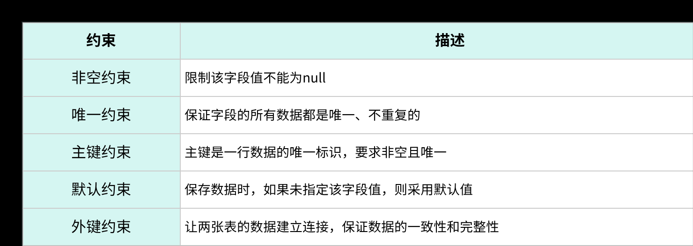

> 📌 **注意**：约束是作用于表中字段上的，可以在创建表/修改表的时候添加约束。

- **案例**：创建 tb_user 表。在上述的表结构中：
  - `id` 是一行数据的唯一标识
  - `username` 用户名字段是非空且唯一的
  - `name` 姓名字段是不允许存储空值的
  - `gender` 性别字段是有默认值，默认为男

建表语句：

```sql
create table tb_user (
    id int primary key comment 'ID,唯一标识',
    username varchar(20) not null unique comment '用户名',
    name varchar(10) not null comment '姓名',
    age int comment '年龄',
    gender char(1) default '男' comment '性别'
) comment '用户表';
```

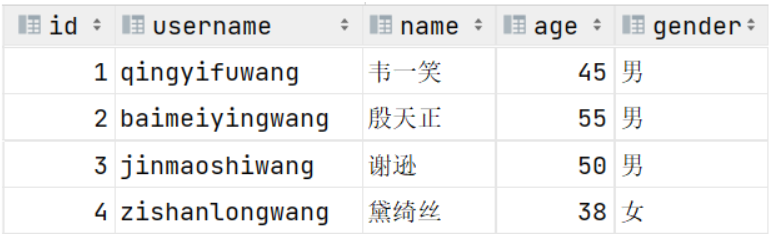

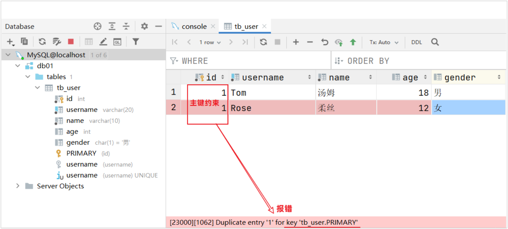

大家有没有发现一个问题：id 字段下存储的值，如果由我们自己来维护会比较麻烦（必须保证值的唯一性）。MySQL 数据库为了解决这个问题，给我们提供了一个关键字：`auto_increment`（自动增长）。

> 📌 **主键自增：`auto_increment`**
> - 每次插入新的行记录时，数据库自动生成 id 字段（主键）下的值。
> - 具有 `auto_increment` 的数据列是一个正数序列开始增长（从 1 开始自增）。

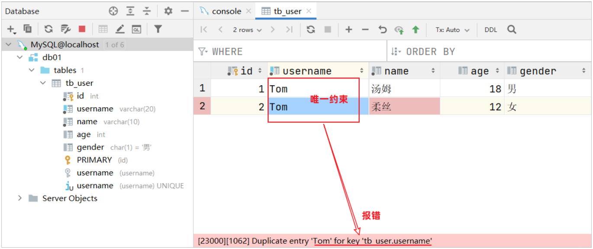

```sql
create table tb_user (
    id int primary key auto_increment comment 'ID,唯一标识', # 主键自动增长
    username varchar(20) not null unique comment '用户名',
    name varchar(10) not null comment '姓名',
    age int comment '年龄',
    gender char(1) default '男' comment '性别'
) comment '用户表';
```

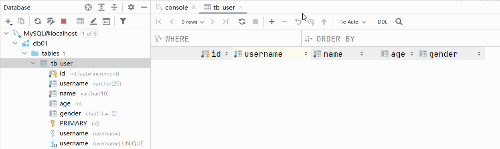

#### 3.1.3.3 数据类型

MySQL 中的数据类型有很多，主要分为三类：**数值类型、字符串类型、日期时间类型**。

**1）数值类型**

| 类型 | 大小 | 有符号（SIGNED）范围 | 无符号（UNSIGNED）范围 |
| --- | --- | --- | --- |
| TINYINT | 1 byte | (-128, 127) | (0, 255) |
| SMALLINT | 2 bytes | (-32768, 32767) | (0, 65535) |
| MEDIUMINT | 3 bytes | (-8388608, 8388607) | (0, 16777215) |
| INT/INTEGER | 4 bytes | (-2147483648, 2147483647) | (0, 4294967295) |
| BIGINT | 8 bytes | (-2^63, 2^63-1) | (0, 2^64-1) |
| FLOAT | 4 bytes | | |
| DOUBLE | 8 bytes | | |
| DECIMAL | | 依赖于 M（精度）和 D（标度）的值 | 依赖于 M（精度）和 D（标度）的值 |

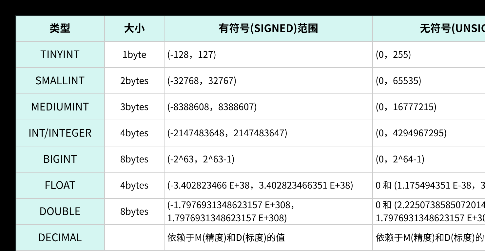

- **示例：**

```sql
-- 年龄字段 --- 不会出现负数, 而且人的年龄不会太大
age tinyint unsigned

-- 分数 --- 总分100分, 最多出现一位小数
score double(4,1)
```

**2）字符串类型**

| 类型 | 大小 | 描述 |
| --- | --- | --- |
| CHAR | 0-255 bytes | 定长字符串（需要指定长度） |
| VARCHAR | 0-65535 bytes | 变长字符串（需要指定长度） |
| TINYBLOB | 0-255 bytes | 不超过 255 个字符的二进制数据 |
| TINYTEXT | 0-255 bytes | 短文本字符串 |
| BLOB | 0-65 535 bytes | 二进制形式的长文本数据 |
| TEXT | 0-65 535 bytes | 长文本数据 |
| MEDIUMBLOB | 0-16 777 215 bytes | 二进制形式的中等长度文本数据 |
| MEDIUMTEXT | 0-16 777 215 bytes | 中等长度文本数据 |
| LONGBLOB | 0-4 294 967 295 bytes | 二进制形式的极大文本数据 |
| LONGTEXT | 0-4 294 967 295 bytes | 极大文本数据 |

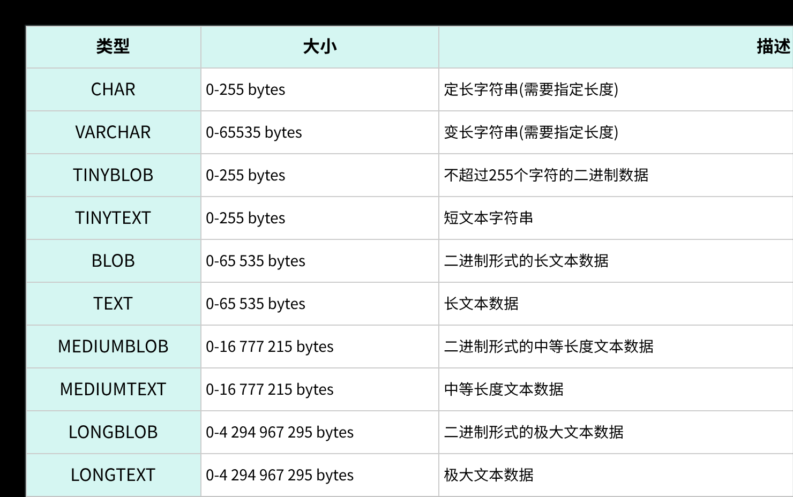

`char` 与 `varchar` 都可以描述字符串，**`char` 是定长字符串**，指定长度多长，就占用多少个字符，和字段值的长度无关。而 **`varchar` 是变长字符串**，指定的长度为最大占用长度。相对来说，`char` 的性能会更高些。

```sql
-- 示例:
-- 用户名 username --- 长度不定, 最长不会超过50
username varchar(50)

-- 手机号 phone --- 固定长度为11
phone char(11)
```

**3）日期时间类型**

| 类型 | 大小 | 范围 | 格式 |
| --- | --- | --- | --- |
| DATE | 3 | 1000-01-01 至 9999-12-31 | YYYY-MM-DD |
| TIME | 3 | -838:59:59 至 838:59:59 | HH:MM:SS |
| YEAR | 1 | 1901 至 2155 | YYYY |
| DATETIME | 8 | 1000-01-01 00:00:00 至 9999-12-31 23:59:59 | YYYY-MM-DD HH:MM:SS |
| TIMESTAMP | 4 | 1970-01-01 00:00:01 至 2038-01-19 03:14:07 | YYYY-MM-DD HH:MM:SS |

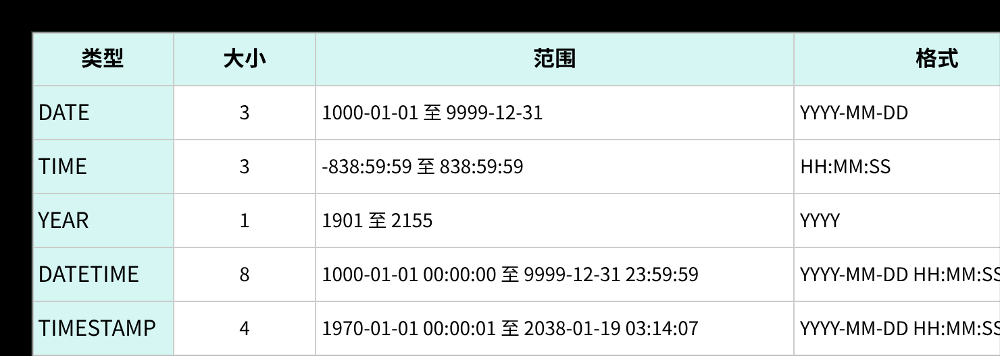

```sql
-- 示例:
-- 生日字段 birthday --- 生日只需要年月日
birthday date

-- 创建时间 createtime --- 需要精确到时分秒
createtime datetime
```

#### 3.1.3.4 表结构设计-案例

**需求**：根据产品原型/需求创建表（设计合理的数据类型、长度、约束）。

> 📌 参考资料中提供的《黑马-tlias 智能学习辅助系统》页面原型，设计员工管理模块的表结构。暂不考虑所属部门及工作经历字段。

**产品原型及需求如下：**

**1）列表展示**

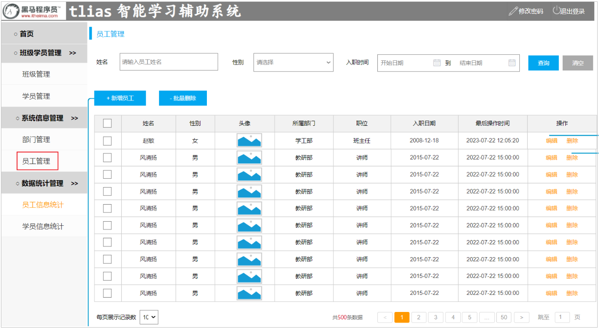

**2）新增员工**

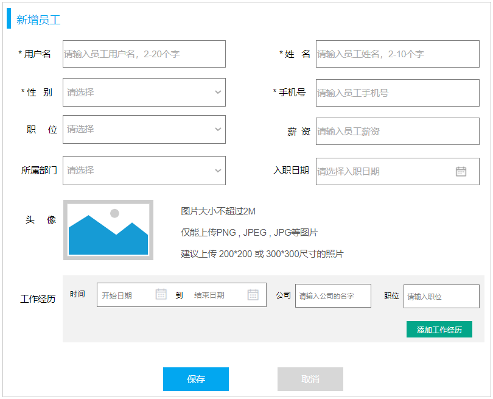

**3）需求说明及字段限制**

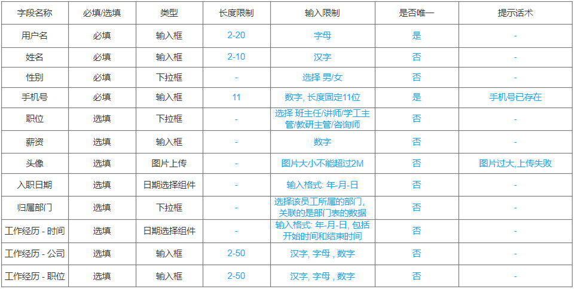

**步骤：**

1. 阅读产品原型及需求文档，看看里面涉及到哪些字段。
2. 查看需求文档说明，确认各个字段的类型以及字段存储数据的长度限制。
3. 在页面原型中描述的基础字段的基础上，再增加额外的基础字段。

**使用 SQL 创建表：**

```sql
create table emp(
    id int unsigned primary key auto_increment comment 'ID,主键',
    username varchar(20) not null unique comment '用户名',
    password varchar(32) not null comment '密码',
    name varchar(10) not null comment '姓名',
    gender tinyint unsigned not null comment '性别, 1:男, 2:女',
    phone char(11) not null unique comment '手机号',
    job tinyint unsigned comment '职位, 1:班主任,2:讲师,3:学工主管,4:教研主管,5:咨询师',
    salary int unsigned comment '薪资',
    image varchar(255) comment '头像',
    entry_date date comment '入职日期',
    create_time datetime comment '创建时间',
    update_time datetime comment '修改时间'
) comment '员工表';
```

> 📌 **设计表流程：**
> 1. 阅读页面原型及需求文档
> 2. 基于页面原型和需求文档，确定原型字段（类型、长度限制、约束）
> 3. 再增加表设计所需要的业务基础字段（`id`、`create_time`、`update_time`）
>    - `create_time`：记录的是当前这条数据插入的时间。
>    - `update_time`：记录当前这条数据最后更新的时间。

#### 3.1.3.5 表操作-其他操作

- **查询数据库表的具体语法：**

```sql
-- 查询当前数据库的所有表
show tables;

-- 查看指定的表结构
desc 表名 ;
-- 可以查看指定表的字段、字段的类型、是否可以为 NULL、是否存在默认值等信息

-- 查询指定表的建表语句
show create table 表名 ;
```

- **修改数据库表结构的具体语法：**

**添加字段：**

```sql
-- 添加字段
alter table 表名 add 字段名 类型(长度) [comment 注释] [约束];

-- 比如: 为 tb_emp 表添加字段 qq, 字段类型为 varchar(11)
alter table tb_emp add qq varchar(11) comment 'QQ号码';
```

**修改字段：**

```sql
-- 修改字段类型
alter table 表名 modify 字段名 新数据类型(长度);

-- 比如: 修改 qq 字段的字段类型, 将其长度由 11 修改为 13
alter table tb_emp modify qq varchar(13) comment 'QQ号码';
```

```sql
-- 修改字段名, 字段类型
alter table 表名 change 旧字段名 新字段名 类型(长度) [comment 注释] [约束];

-- 比如: 修改 qq 字段名为 qq_num, 字段类型 varchar(13)
alter table tb_emp change qq qq_num varchar(13) comment 'QQ号码';
```

**删除字段：**

```sql
-- 删除字段
alter table 表名 drop 字段名;

-- 比如: 删除 tb_emp 表中的 qq_num 字段
alter table tb_emp drop qq_num;
```

**修改表名：**

```sql
-- 修改表名
rename table 表名 to 新表名;

-- 比如: 将当前的 emp 表的表名修改为 tb_emp
rename table emp to tb_emp;
```

**删除表结构：**

```sql
-- 删除表
drop table [ if exists ] 表名;

-- 比如: 如果 tb_emp 表存在, 则删除 tb_emp 表
drop table if exists tb_emp; -- 在删除表时, 表中的全部数据也会被删除。
```

> 📌 关于表结构的查看、修改、删除操作，工作中一般都是直接基于图形化界面操作。

## 3.2 DML 语句

DML 英文全称是 Data Manipulation Language（数据操作语言），用来对数据库中表的数据记录进行 **增、删、改** 操作。

- 添加数据（INSERT）
- 修改数据（UPDATE）
- 删除数据（DELETE）

### 3.2.1 增加（insert）

#### 3.2.1.1 语法

- **向指定字段添加数据：**

```sql
insert into 表名 (字段名1, 字段名2) values (值1, 值2);
```

- **全部字段添加数据：**

```sql
insert into 表名 values (值1, 值2, ...);
```

- **批量添加数据（指定字段）：**

```sql
insert into 表名 (字段名1, 字段名2) values (值1, 值2), (值1, 值2);
```

- **批量添加数据（全部字段）：**

```sql
insert into 表名 values (值1, 值2, ...), (值1, 值2, ...);
```

#### 3.2.1.2 案例演示

- **案例 1**：向 emp 表的 username, name, gender, phone, create_time, update_time 字段插入数据。

```sql
-- 因为设计表时 create_time, update_time 两个字段不能为 NULL, 所以也作为要插入的字段
insert into emp(username, name, gender, phone, create_time, update_time)
values ('wuji', '张无忌', 1, '13309091231', now(), now());
```

- **案例 2**：向 emp 表的所有字段插入数据。

```sql
insert into emp2(id, username, password, name, gender, phone, job, salary, image, entry_date, create_time, update_time)
values (1,'shinaian','123456','施耐庵',1,'13309090001',4,15000,'1.jpg','2000-01-01',now(),now());
```

- **案例 3**：批量向 emp 表的 username、name、gender 字段插入数据。

```sql
insert into emp(username, name, gender, phone, create_time, update_time)
values ('Tom1', '汤姆1', 1, '13309091231', now(), now()),
       ('Tom2', '汤姆2', 1, '13309091232', now(), now());
```

> 📌 **insert 操作的注意事项：**
> 1. 插入数据时，指定的字段顺序需要与值的顺序是一一对应的。
> 2. 字符串和日期型数据应该包含在引号中。
> 3. 插入的数据大小，应该在字段的规定范围内。

### 3.2.2 修改（update）

#### 3.2.2.1 语法

```sql
update 表名 set 字段名1 = 值1 , 字段名2 = 值2 , .... [where 条件] ;
```

#### 3.2.2.2 案例演示

- **案例 1**：将 emp 表中 id 为 1 的员工，姓名 name 字段更新为 '张三'。

```sql
update emp set name='张三', update_time=now() where id=1;
```

- **案例 2**：将 emp 表的所有员工入职日期更新为 '2010-01-01'。

```sql
update emp set entry_date='2010-01-01', update_time=now();
```

> 📌 **注意事项：**
> 1. 修改语句的条件可以有，也可以没有，如果没有条件，则会修改整张表的所有数据。
> 2. 在修改数据时，一般需要同时修改公共字段 `update_time`，将其修改为当前操作时间。

### 3.2.3 删除（delete）

#### 3.2.3.1 语法

```sql
delete from 表名 [where 条件] ;
```

#### 3.2.3.2 案例演示

- **案例 1**：删除 emp 表中 id 为 1 的员工。

```sql
delete from emp where id = 1;
```

- **案例 2**：删除 emp 表中所有员工。

```sql
delete from tb_emp;
```

> 📌 **注意事项：**
> - DELETE 语句的条件可以有，也可以没有，如果没有条件，则会删除整张表的所有数据。
> - DELETE 语句不能删除某一个字段的值（可以使用 UPDATE，将该字段值置为 NULL 即可）。
> - 当进行删除全部数据操作时，会提示询问是否确认删除所有数据，直接点击 Execute 即可。

## 3.3 DQL 语句

### 3.3.1 介绍

DQL 英文全称是 Data Query Language（数据查询语言），用来查询数据库表中的记录。

> ✅ **查询关键字：`SELECT`**

查询操作是所有 SQL 语句当中最为常见，也是最为重要的操作。在一个正常的业务系统中，查询操作的使用频次是要远高于增删改操作的。当我们打开某个网站或 APP 所看到的展示信息，都是通过从数据库中查询得到的，而在这个查询过程中，还会涉及到 **条件、排序、分页** 等操作。

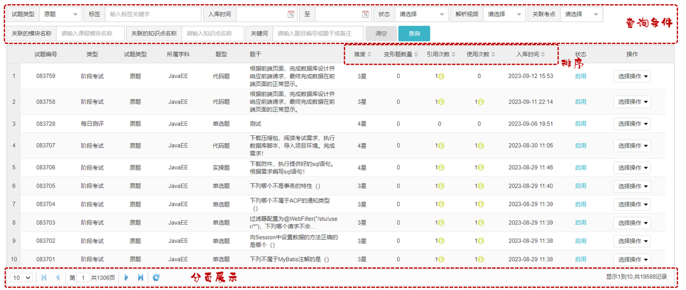

### 3.3.2 语法

DQL 查询语句，语法结构如下：

```sql
SELECT
    字段列表
FROM
    表名列表
WHERE
    条件列表
GROUP BY
    分组字段列表
HAVING
    分组后条件列表
ORDER BY
    排序字段列表
LIMIT
    分页参数
```

我们今天会将上面的完整语法拆分为以下几个部分学习：

- 基本查询（不带任何条件）
- 条件查询（where）
- 分组查询（group by）
- 排序查询（order by）
- 分页查询（limit）

**准备一些测试数据用于查询操作：**

```sql
create table emp(
    id int unsigned primary key auto_increment comment 'ID,主键',
    username varchar(20) not null unique comment '用户名',
    password varchar(32) not null comment '密码',
    name varchar(10) not null comment '姓名',
    gender tinyint unsigned not null comment '性别, 1:男, 2:女',
    phone char(11) not null unique comment '手机号',
    job tinyint unsigned comment '职位, 1:班主任,2:讲师,3:学工主管,4:教研主管,5:咨询师',
    salary int unsigned comment '薪资',
    image varchar(300) comment '头像',
    entry_date date comment '入职日期',
    create_time datetime comment '创建时间',
    update_time datetime comment '修改时间'
) comment '员工表';

-- 准备测试数据
INSERT INTO emp(id, username, password, name, gender, phone, job, salary, image, entry_date, create_time, update_time)
VALUES
(1,'shinaian','123456','施耐庵',1,'13309090001',4,15000,'1.jpg','2000-01-01','2024-04-11 16:35:33','2024-04-11 16:35:35'),
(2,'songjiang','123456','宋江',1,'13309090002',2,8600,'2.jpg','2015-01-01','2024-04-11 16:35:33','2024-04-11 16:35:37'),
(3,'lujunyi','123456','卢俊义',1,'13309090003',2,8900,'3.jpg','2008-05-01','2024-04-11 16:35:33','2024-04-11 16:35:39'),
(4,'wuyong','123456','吴用',1,'13309090004',2,9200,'4.jpg','2007-01-01','2024-04-11 16:35:33','2024-04-11 16:35:41'),
(5,'gongsunsheng','123456','公孙胜',1,'13309090005',2,9500,'5.jpg','2012-12-05','2024-04-11 16:35:33','2024-04-11 16:35:43'),
(6,'huosanniang','123456','扈三娘',2,'13309090006',3,6500,'6.jpg','2013-09-05','2024-04-11 16:35:33','2024-04-11 16:35:45'),
(7,'chaijin','123456','柴进',1,'13309090007',1,4700,'7.jpg','2005-08-01','2024-04-11 16:35:33','2024-04-11 16:35:47'),
(8,'likui','123456','李逵',1,'13309090008',1,4800,'8.jpg','2014-11-09','2024-04-11 16:35:33','2024-04-11 16:35:49'),
(9,'wusong','123456','武松',1,'13309090009',1,4900,'9.jpg','2011-03-11','2024-04-11 16:35:33','2024-04-11 16:35:51'),
(10,'lichong','123456','林冲',1,'13309090010',1,5000,'10.jpg','2013-09-05','2024-04-11 16:35:33','2024-04-11 16:35:53'),
(11,'huyanzhuo','123456','呼延灼',1,'13309090011',2,9700,'11.jpg','2007-02-01','2024-04-11 16:35:33','2024-04-11 16:35:55'),
(12,'xiaoliguang','123456','小李广',1,'13309090012',2,10000,'12.jpg','2008-08-18','2024-04-11 16:35:33','2024-04-11 16:35:57'),
(13,'yangzhi','123456','杨志',1,'13309090013',1,5300,'13.jpg','2012-11-01','2024-04-11 16:35:33','2024-04-11 16:35:59'),
(14,'shijin','123456','史进',1,'13309090014',2,10600,'14.jpg','2002-08-01','2024-04-11 16:35:33','2024-04-11 16:36:01'),
(15,'sunerniang','123456','孙二娘',2,'13309090015',2,10900,'15.jpg','2011-05-01','2024-04-11 16:35:33','2024-04-11 16:36:03'),
(16,'luzhishen','123456','鲁智深',1,'13309090016',2,9600,'16.jpg','2010-01-01','2024-04-11 16:35:33','2024-04-11 16:36:05'),
(17,'liying','12345678','李应',1,'13309090017',1,5800,'17.jpg','2015-03-21','2024-04-11 16:35:33','2024-04-11 16:36:07'),
(18,'shiqian','123456','时迁',1,'13309090018',2,10200,'18.jpg','2015-01-01','2024-04-11 16:35:33','2024-04-11 16:36:09'),
(19,'gudasao','123456','顾大嫂',2,'13309090019',2,10500,'19.jpg','2008-01-01','2024-04-11 16:35:33','2024-04-11 16:36:11'),
(20,'ruanxiaoer','123456','阮小二',1,'13309090020',2,10800,'20.jpg','2018-01-01','2024-04-11 16:35:33','2024-04-11 16:36:13'),
(21,'ruanxiaowu','123456','阮小五',1,'13309090021',5,5200,'21.jpg','2015-01-01','2024-04-11 16:35:33','2024-04-11 16:36:15'),
(22,'ruanxiaoqi','123456','阮小七',1,'13309090022',5,5500,'22.jpg','2016-01-01','2024-04-11 16:35:33','2024-04-11 16:36:17'),
(23,'ruanji','123456','阮籍',1,'13309090023',5,5800,'23.jpg','2012-01-01','2024-04-11 16:35:33','2024-04-11 16:36:19'),
(24,'tongwei','123456','童威',1,'13309090024',5,5000,'24.jpg','2006-01-01','2024-04-11 16:35:33','2024-04-11 16:36:21'),
(25,'tongmeng','123456','童猛',1,'13309090025',5,4800,'25.jpg','2002-01-01','2024-04-11 16:35:33','2024-04-11 16:36:23'),
(26,'yanshun','123456','燕顺',1,'13309090026',5,5400,'26.jpg','2011-01-01','2024-04-11 16:35:33','2024-04-11 16:36:25'),
(27,'lijun','123456','李俊',1,'13309090027',5,6600,'27.jpg','2004-01-01','2024-04-11 16:35:33','2024-04-11 16:36:27'),
(28,'lizhong','123456','李忠',1,'13309090028',5,5000,'28.jpg','2007-01-01','2024-04-11 16:35:33','2024-04-11 16:36:29'),
(29,'songqing','123456','宋清',1,'13309090029',5,5100,'29.jpg','2020-01-01','2024-04-11 16:35:33','2024-04-11 16:36:31'),
(30,'liyun','123456','李云',1,'13309090030',NULL,NULL,'30.jpg','2020-03-01','2024-04-11 16:35:33','2024-04-11 16:36:31');
```

### 3.3.3 基本查询

在基本查询的 DQL 语句中，不带任何的查询条件。

- **查询多个字段：**

```sql
select 字段1, 字段2, 字段3 from 表名;
```

- **查询所有字段（通配符）：**

```sql
select * from 表名;
```

- **设置别名：**

```sql
select 字段1 [ as 别名1 ] , 字段2 [ as 别名2 ] from 表名;
```

- **去除重复记录：**

```sql
select distinct 字段列表 from 表名;
```

**案例演示：**

- **案例 1**：查询指定字段 name，entry_date 并返回。

```sql
select name,entry_date from emp;
```

- **案例 2**：查询返回所有字段。

```sql
select * from emp;
```

> 📌 `*` 号代表查询所有字段，在实际开发中尽量少用（不直观、影响效率）。

- **案例 3**：查询所有员工的 name, entry_date，并起别名（姓名、入职日期）。

```sql
-- 方式1：
select name AS 姓名, entry_date AS 入职日期 from emp;

-- 方式2： 别名中有特殊字符时，使用 '' 或 "" 包含
select name AS '姓 名', entry_date AS '入职日期' from emp;

-- 方式3：
select name AS "姓名", entry_date AS "入职日期" from emp;
```

- **案例 4**：查询已有的员工关联了哪几种职位（不要重复）。

```sql
select distinct job from emp;
```

### 3.3.4 条件查询

**语法：**

```sql
select 字段列表 from 表名 where 条件列表 ; -- 条件列表：意味着可以有多个条件
```

学习条件查询就是学习条件的构建方式，而在 SQL 语句当中构造条件的运算符分为两类：**比较运算符** 和 **逻辑运算符**。

**常用的比较运算符如下：**

| 比较运算符 | 功能 |
| --- | --- |
| `>` | 大于 |
| `>=` | 大于等于 |
| `<` | 小于 |
| `<=` | 小于等于 |
| `=` | 等于 |
| `<>` 或 `!=` | 不等于 |
| `between ... and ...` | 在某个范围之内（含最小、最大值） |
| `in(...)` | 在 in 之后的列表中的值，多选一 |
| `like 占位符` | 模糊匹配（`_` 匹配单个字符，`%` 匹配任意个字符） |
| `is null` | 是 null |

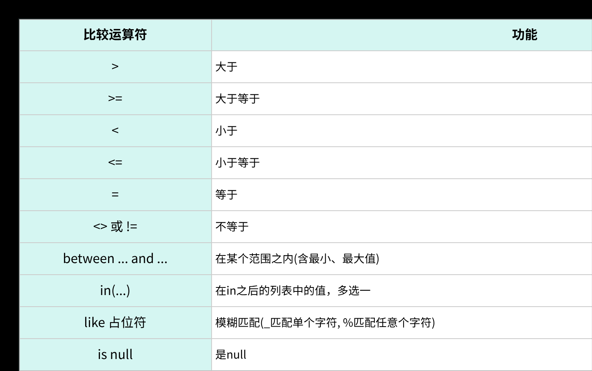

**常用的逻辑运算符如下：**

| 逻辑运算符 | 功能 |
| --- | --- |
| `and` 或 `&&` | 并且（多个条件同时成立） |
| `or` 或 `\|\|` | 或者（多个条件任意一个成立） |
| `not` 或 `!` | 非，不是 |


- **案例 1**：查询 姓名 为 '杨逍' 的员工。

```sql
select id, username, password, name, gender, phone, salary, job, image, entry_date, create_time, update_time
from emp
where name = '杨逍'; -- 字符串使用 '' 或 "" 包含
```

- **案例 2**：查询 薪资小于等于 5000 的员工信息。

```sql
select id, username, password, name, gender, phone, salary, job, image, entry_date, create_time, update_time
from emp
where salary <=5000;
```

- **案例 3**：查询 没有分配职位 的员工信息。

```sql
select id, username, password, name, gender, phone, salary, job, image, entry_date, create_time, update_time
from emp
where job is null ;
```

> 📌 **注意**：查询为 NULL 的数据时，不能使用 `= null` 或 `!=null`。得使用 `is null` 或 `is not null`。

- **案例 4**：查询 有职位 的员工信息。

```sql
select id, username, password, name, gender, phone, salary, job, image, entry_date, create_time, update_time
from emp
where job is not null ;
```

- **案例 5**：查询 密码不等于 '123456' 的员工信息。

```sql
-- 方式1：
select id, username, password, name, gender, phone, salary, job, image, entry_date, create_time, update_time
from emp
where password <> '123456';

-- 方式2：
select id, username, password, name, gender, phone, salary, job, image, entry_date, create_time, update_time
from emp
where password != '123456';
```

- **案例 6**：查询 入职日期 在 '2000-01-01'（包含）到 '2010-01-01'（包含）之间的员工信息。

```sql
-- 方式1：
select id, username, password, name, gender, phone, salary, job, image, entry_date, create_time, update_time
from emp
where entry_date >= '2000-01-01' and entry_date <= '2010-01-01';

-- 方式2： between...and
select id, username, password, name, gender, phone, salary, job, image, entry_date, create_time, update_time
from emp
where entry_date between '2000-01-01' and '2010-01-01';
```

- **案例 7**：查询 入职时间 在 '2000-01-01'（包含）到 '2010-01-01'（包含）之间 且 性别为女 的员工信息。

```sql
select id, username, password, name, gender, phone, salary, job, image, entry_date, create_time, update_time
from emp
where entry_date between '2000-01-01' and '2010-01-01'
and gender = 2;
```

- **案例 8**：查询 职位是 2（讲师）, 3（学工主管）, 4（教研主管）的员工信息。

```sql
-- 方式1：使用 or 连接多个条件
select id, username, password, name, gender, phone, salary, job, image, entry_date, create_time, update_time
from emp
where job=2 or job=3 or job=4;

-- 方式2：in 关键字
select id, username, password, name, gender, phone, salary, job, image, entry_date, create_time, update_time
from emp
where job in (2,3,4);
```

- **案例 9**：查询 姓名 为两个字的员工信息。

```sql
select id, username, password, name, gender, phone, salary, job, image, entry_date, create_time, update_time
from emp
where name like '__'; # 通配符 "_" 代表任意 1 个字符
```

- **案例 10**：查询 姓 '张' 的员工信息。

```sql
select id, username, password, name, gender, phone, salary, job, image, entry_date, create_time, update_time
from emp
where name like '张%'; # 通配符 "%" 代表任意个字符（0个 ~ 多个）
```

- **案例 11**：查询 姓名中包含 '二' 的员工信息。

```sql
select id, username, password, name, gender, phone, salary, job, image, entry_date, create_time, update_time
from emp
where name like '%二%'; # 通配符 "%" 代表任意个字符（0个 ~ 多个）
```

### 3.3.5 聚合函数

之前我们做的查询都是横向查询，就是根据条件一行一行的进行判断，而使用聚合函数查询就是 **纵向查询**，它是对一列的值进行计算，然后返回一个结果值。（将一列数据作为一个整体，进行纵向计算）

**常用聚合函数：**

| 函数 | 功能 |
| --- | --- |
| `count` | 统计数量 |
| `max` | 最大值 |
| `min` | 最小值 |
| `avg` | 平均值 |
| `sum` | 求和 |

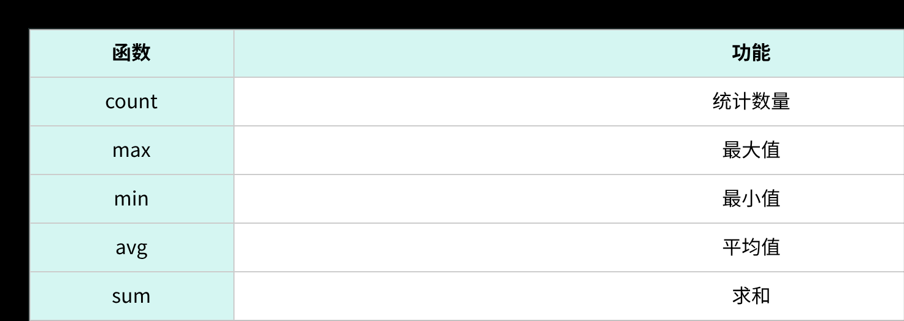

> 📌 **注意**：聚合函数会忽略空值，对 NULL 值不作为统计。
>
> - `count`：按照列去统计有多少行数据。在根据指定的列统计的时候，如果这一列中有 null 的行，该行不会被统计在其中。
> - `sum`：计算指定列的数值和，如果不是数值类型，那么计算结果为 0。
> - `max`：计算指定列的最大值。
> - `min`：计算指定列的最小值。
> - `avg`：计算指定列的平均值。

**案例演示：**

- **案例 1**：统计该企业员工数量。

```sql
-- count(字段)
select count(id) from emp;  -- 结果：30
select count(job) from emp; -- 结果：29 （聚合函数对 NULL 值不做计算）

-- count(常量)
select count(0) from emp;
select count('A') from emp;

-- count(*) 推荐此写法（MySQL 底层进行了优化）
select count(*) from emp;
```

- **案例 2**：统计该企业员工的平均薪资。

```sql
select avg(salary) from emp;
```

- **案例 3**：统计该企业员工的最低薪资。

```sql
select min(salary) from emp;
```

- **案例 4**：统计该企业员工的最高薪资。

```sql
select max(salary) from emp;
```

- **案例 5**：统计该企业每月要给员工发放的薪资总额（薪资之和）。

```sql
select sum(salary) from emp;
```

### 3.3.6 分组查询

- **分组**：按照某一列或者某几列，把相同的数据进行合并输出。
  - 分组其实就是按列进行分类（指定列下相同的数据归为一类），然后可以对分类完的数据进行合并计算。
  - 分组查询通常会使用聚合函数进行计算。

**语法：**

```sql
select 字段列表 from 表名 [where 条件] group by 分组字段名 [having 分组后过滤条件];
```

**案例演示：**

- **案例 1**：根据性别分组，统计男性和女性员工的数量。

```sql
select gender, count(*)
from emp
group by gender; -- 按照 gender 字段进行分组（gender 字段下相同的数据归为一组）
```

- **案例 2**：查询入职时间在 '2015-01-01'（包含）以前的员工，并对结果根据职位分组，获取员工数量大于等于 2 的职位。

```sql
select job, count(*)
from emp
where entry_date <= '2015-01-01'  -- 分组前条件
group by job                      -- 按照 job 字段分组
having count(*) >= 2;             -- 分组后条件
```

> 📌 **注意事项：**
> - 分组之后，查询的字段一般为聚合函数和分组字段，查询其他字段无任何意义。
> - 执行顺序：`where` > 聚合函数 > `having`。

> 📌 **where 与 having 区别（面试题）**
> - **执行时机不同**：`where` 是分组之前进行过滤，不满足 `where` 条件，不参与分组；而 `having` 是分组之后对结果进行过滤。
> - **判断条件不同**：`where` 不能对聚合函数进行判断，而 `having` 可以。

### 3.3.7 排序查询

排序在日常开发中是非常常见的一个操作，有升序排序，也有降序排序。

**语法：**

```sql
select 字段列表
from 表名
[where 条件列表]
[group by 分组字段 ]
order by 字段1 排序方式1 , 字段2 排序方式2 … ;
```

- **排序方式：**
  - `ASC`：升序（默认值）
  - `DESC`：降序

**案例演示：**

- **案例 1**：根据入职时间，对员工进行升序排序。

```sql
select id, username, password, name, gender, phone, salary, job, image, entry_date, create_time, update_time
from emp
order by entry_date ASC; -- 按照 entry_date 字段下的数据进行升序排序

select id, username, password, name, gender, phone, salary, job, image, entry_date, create_time, update_time
from emp
order by entry_date; -- 默认就是 ASC（升序）
```

> 📌 **注意事项**：如果是升序，可以不指定排序方式 ASC。

- **案例 2**：根据入职时间，对员工进行降序排序。

```sql
select id, username, password, name, gender, phone, salary, job, image, entry_date, create_time, update_time
from emp
order by entry_date DESC; -- 按照 entry_date 字段下的数据进行降序排序
```

- **案例 3**：根据入职时间对公司的员工进行升序排序，入职时间相同，再按照更新时间进行降序排序。

```sql
select id, username, password, name, gender, phone, salary, job, image, entry_date, create_time, update_time
from emp
order by entry_date ASC , update_time DESC;
```

> 📌 **注意事项**：如果是多字段排序，当第一个字段值相同时，才会根据第二个字段进行排序。

### 3.3.8 分页查询

分页操作在业务系统开发时，也是非常常见的一个功能，日常我们在网站中看到的各种各样的分页条，后台也都需要借助于数据库的分页操作。

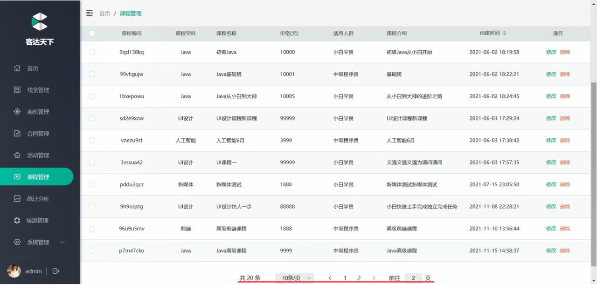

**分页查询语法：**

```sql
select 字段列表 from 表名 limit 起始索引, 查询记录数 ;
```

- **案例 1**：从起始索引 0 开始查询员工数据，每页展示 5 条记录。

```sql
select id, username, password, name, gender, phone, salary, job, image, entry_date, create_time, update_time
from emp
limit 0 , 5; -- 从索引 0 开始，向后取 5 条记录
```

- **案例 2**：查询 第 1 页 员工数据，每页展示 5 条记录。

```sql
select id, username, password, name, gender, phone, salary, job, image, entry_date, create_time, update_time
from emp
limit 5; -- 如果查询的是第 1 页数据，起始索引可以省略，直接简写为：limit 条数
```

- **案例 3**：查询 第 2 页 员工数据，每页展示 5 条记录。

```sql
select id, username, password, name, gender, phone, salary, job, image, entry_date, create_time, update_time
from emp
limit 5 , 5; -- 从索引 5 开始，向后取 5 条记录
```

- **案例 4**：查询 第 3 页 员工数据，每页展示 5 条记录。

```sql
select id, username, password, name, gender, phone, salary, job, image, entry_date, create_time, update_time
from emp
limit 10 , 5; -- 从索引 10 开始，向后取 5 条记录
```

> 📌 **注意事项：**
> 1. 起始索引从 0 开始。计算公式：**起始索引 = （查询页码 - 1）* 每页显示记录数**。
> 2. 分页查询是数据库的方言，不同的数据库有不同的实现，MySQL 中是 `LIMIT`。
> 3. 如果查询的是第一页数据，起始索引可以省略，直接简写为 `limit 条数`。
