# 06-Web后端基础(java操作数据库)

> ⛳ 如果大家在自学的过程中，时间紧迫、没有方向、经常遇到难以解决的 Bug、没有亮眼的项目、缺少 AI 大模型经验，而又想快速系统化的学习、高薪就业的小伙伴儿，大家都可以 🔗 直接点我，了解一下我们系统化的课程体系。

---

# 1. 前言

在前面我们学习 MySQL 数据库时，都是利用图形化客户端工具（如：idea、datagrip），来操作数据库的。

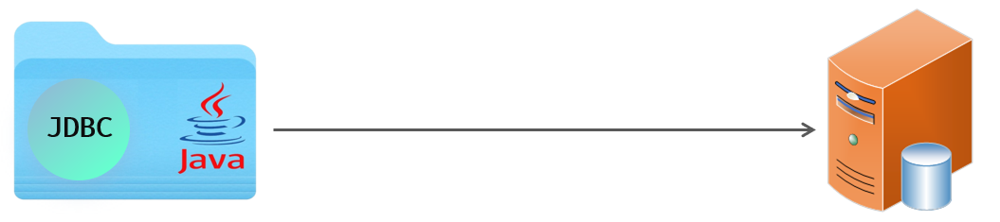

我们作为后端程序开发人员，通常会使用 Java 程序来完成对数据库的操作。Java 程序操作数据库的技术呢，有很多啊，而最为底层、最为基础的就是 **JDBC**。

> ✅ **JDBC**：（Java DataBase Connectivity），就是使用 Java 语言操作关系型数据库的一套 API。【是操作数据库最为基础、底层的技术】

但是使用 JDBC 来操作数据库，会比较繁琐，所以现在在企业项目开发中呢，一般都会使用基于 JDBC 的封装的高级框架，比如：**Mybatis、MybatisPlus、Hibernate、SpringDataJPA**。

而这些技术，目前的市场占有份额如下图所示：

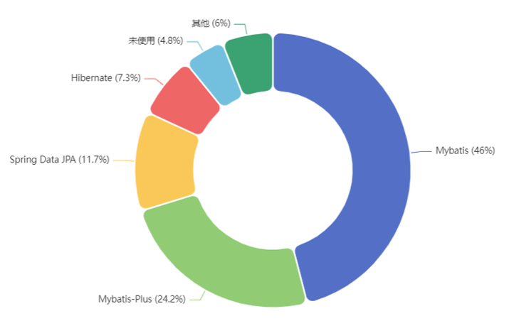

从上图中，我们也可以看到，目前最为主流的就是 **Mybatis**，其次是 **MybatisPlus**。

所以，在我们的课程体系中呢，这两种主流的操作数据库的框架我们都要学习。而我们在学习这两个主流的框架之前，还需要学习一下操作数据库的基础基础 JDBC。然后接下来，再来学习 Mybatis。而在我们后面的课程中，我们还要学习 MybatisPlus 框架。

> 📌 **今天课程安排：**
> 1. JDBC
> 2. Mybatis
> 3. SpringBoot 配置文件

---

# 2. JDBC

## 2.1 介绍

**JDBC**：（Java DataBase Connectivity），就是使用 Java 语言操作关系型数据库的一套 API。

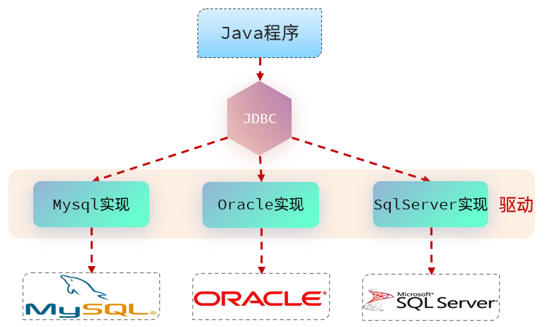

**本质：**

- sun 公司官方定义的一套操作所有关系型数据库的规范，即接口。
- 各个数据库厂商去实现这套接口，提供数据库驱动 jar 包。
- 我们可以使用这套接口（JDBC）编程，真正执行的代码是驱动 jar 包中的实现类。

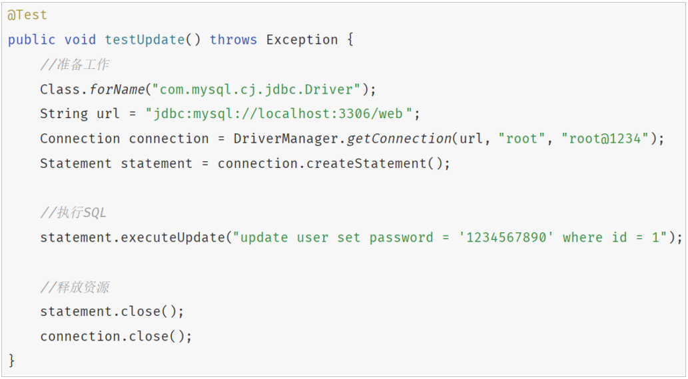

那有了 JDBC 之后，我们就可以直接在 java 代码中来操作数据库了，只需要编写这样一段 java 代码，就可以来操作数据库中的数据。示例代码如下：

```java
@Test
public void testJdbcA() throws Exception {
    Connection connection = DriverManager.getConnection("jdbc:mysql://localhost:3306/web", "root", "1234");
    Statement statement = connection.createStatement();
    statement.executeUpdate("update user set age = '123456789' where id = 1");
    statement.close();
    connection.close();
}
```

## 2.2 查询数据

### 2.2.1 需求

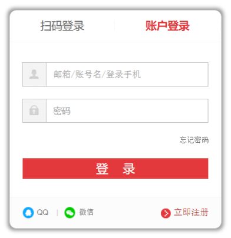

> ✅ **需求**：基于 JDBC 实现用户登录功能。
>
> **本质**：其本质呢，其实就是基于 JDBC 程序，执行如下 select 语句，并将查询的结果输出到控制台。

**SQL 语句：**

```sql
select * from user where username = 'linchong' and password = '123456';
```

### 2.2.2 准备工作

**1）创建一个 maven 项目**

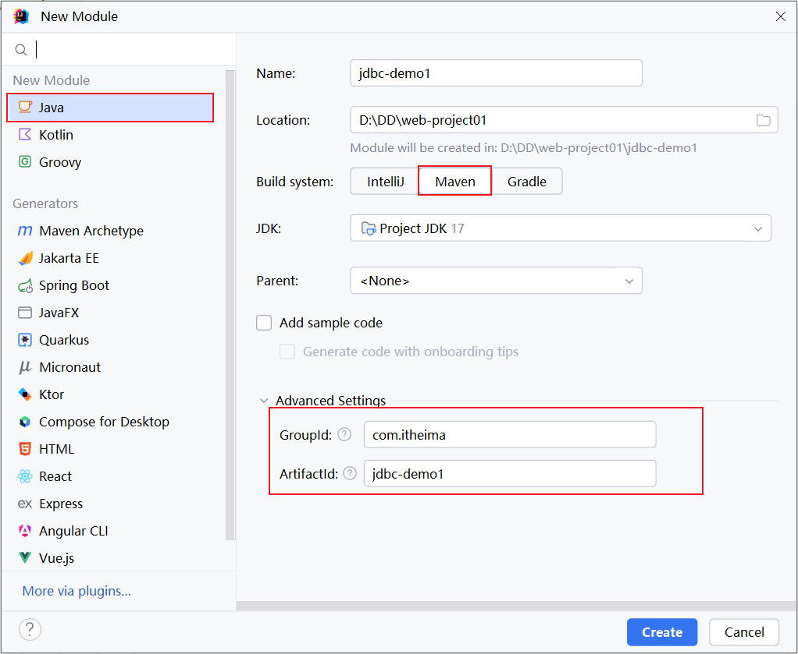

**2）创建一个数据库 web，并在该数据库中创建 user 表**

```sql
create table user(
    id int unsigned primary key auto_increment comment 'ID,主键',
    username varchar(20) comment '用户名',
    password varchar(32) comment '密码',
    name varchar(10) comment '姓名',
    age tinyint unsigned comment '年龄'
) comment '用户表';

insert into user(id, username, password, name, age) values
(1, 'daqiao',   '123456',   '大乔', 22),
(2, 'xiaoqiao', '123456',   '小乔', 18),
(3, 'diaochan', '123456',   '貂蝉', 24),
(4, 'lvbu',     '123456',   '吕布', 28),
(5, 'zhaoyun',  '12345678', '赵云', 27);
```

### 2.2.3 代码实现

> 💡 **AI 提示词（prompt）：**
>
> 你是一名 java 开发工程师，帮我基于 JDBC 程序来操作数据库，执行如下 SQL 语句：
>
> `select * from user where username = 'daqiao' and password = '123456'`

**具体的代码为：**

**1）在 `pom.xml` 文件中引入依赖**

```xml
<dependencies>
    <!-- MySQL JDBC driver -->
    <dependency>
        <groupId>mysql</groupId>
        <artifactId>mysql-connector-java</artifactId>
        <version>8.0.30</version>
    </dependency>

    <dependency>
        <groupId>org.junit.jupiter</groupId>
        <artifactId>junit-jupiter</artifactId>
        <version>5.9.3</version>
        <scope>test</scope>
    </dependency>
</dependencies>
```

**2）在 `src/main/test/java` 目录下编写测试类，定义测试方法**

```java
public class JDBCTest {

    /**
     * 编写 JDBC 程序, 查询数据
     */
    @Test
    public void testJdbc() throws Exception {
        // 获取连接
        Connection conn = DriverManager.getConnection("jdbc:mysql://localhost:3306/web", "root", "1234");
        // 创建预编译的 PreparedStatement 对象
        PreparedStatement pstmt = conn.prepareStatement("SELECT * FROM user WHERE username = ? AND password = ?");
        // 设置参数
        pstmt.setString(1, "daqiao"); // 第一个问号对应的参数
        pstmt.setString(2, "123456"); // 第二个问号对应的参数
        // 执行查询
        ResultSet rs = pstmt.executeQuery();
        // 处理结果集
        while (rs.next()) {
            int id = rs.getInt("id");
            String uName = rs.getString("username");
            String pwd = rs.getString("password");
            String name = rs.getString("name");
            int age = rs.getInt("age");

            System.out.println("ID: " + id + ", Username: " + uName + ", Password: " + pwd + ", Name: " + name + ", Age: " + age);
        }
        // 关闭资源
        rs.close();
        pstmt.close();
        conn.close();
    }
}
```

而上述的单元测试中，我们在 SQL 语句中，将 用户名 和 密码 的值都写死了，而这两个值应该是动态的，是将来页面传递到服务端的。那么，我们可以基于前面所讲解的 JUnit 中的参数化测试进行单元测试，代码改造如下：

```java
public class JDBCTest {

    /**
     * 编写 JDBC 程序, 查询数据
     */
    @ParameterizedTest
    @CsvSource({"daqiao,123456"})
    public void testJdbc(String _username, String _password) throws Exception {
        // 获取连接
        Connection conn = DriverManager.getConnection("jdbc:mysql://localhost:3306/web", "root", "1234");
        // 创建预编译的 PreparedStatement 对象
        PreparedStatement pstmt = conn.prepareStatement("SELECT * FROM user WHERE username = ? AND password = ?");
        // 设置参数
        pstmt.setString(1, _username); // 第一个问号对应的参数
        pstmt.setString(2, _password); // 第二个问号对应的参数
        // 执行查询
        ResultSet rs = pstmt.executeQuery();
        // 处理结果集
        while (rs.next()) {
            int id = rs.getInt("id");
            String uName = rs.getString("username");
            String pwd = rs.getString("password");
            String name = rs.getString("name");
            int age = rs.getInt("age");

            System.out.println("ID: " + id + ", Username: " + uName + ", Password: " + pwd + ", Name: " + name + ", Age: " + age);
        }
        // 关闭资源
        rs.close();
        pstmt.close();
        conn.close();
    }
}
```

> 📌 如果在测试时，需要传递一组参数，可以使用 `@CsvSource` 注解。

### 2.2.4 代码剖析

#### 2.2.4.1 ResultSet

**ResultSet**（结果集对象）：封装了 DQL 查询语句查询的结果。

- **`next()`**：将光标从当前位置向前移动一行，并判断当前行是否为有效行，返回值为 boolean。
  - `true`：有效行，当前行有数据
  - `false`：无效行，当前行没有数据
- **`getXxx(...)`**：获取数据，可以根据列的编号获取，也可以根据列名获取（推荐）。

**结果解析步骤：**

```java
while (resultSet.next()) {
    int id = resultSet.getInt("id");
    // 省略
}
```

#### 2.2.4.2 预编译 SQL

其实我们在编写 SQL 语句的时候，有两种风格：

- **静态 SQL（参数硬编码）**

```java
conn.prepareStatement("SELECT * FROM user WHERE username = 'daqiao' AND password = '123456'");
ResultSet resultSet = pstmt.executeQuery();
```

这种呢，就是参数值，直接拼接在 SQL 语句中，参数值是写死的。

- **预编译 SQL（参数动态传递）**

```java
conn.prepareStatement("SELECT * FROM user WHERE username = ? AND password = ?");
pstmt.setString(1, "daqiao");
pstmt.setString(2, "123456");
ResultSet resultSet = pstmt.executeQuery();
```

这种呢，并未将参数值在 SQL 语句中写死，而是使用 `？` 进行占位，然后再指定每一个占位符对应的值是多少，而最终在执行 SQL 语句的时候，程序会将 SQL 语句（`SELECT * FROM user WHERE username = ? AND password = ?`），以及参数值（`"daqiao", "123456"`）都发送给数据库，然后在执行的时候，会使用参数值，将 `?` 占位符替换掉。

> ✅ 那这种预编译的 SQL，也是在项目开发中推荐使用的 SQL 语句。主要的作用有两个：
> - **防止 SQL 注入**
> - **性能更高**

那接下来，我们就来介绍一下这两点。

##### 2.2.4.2.1 SQL 注入

- **SQL 注入**：通过控制输入来修改事先定义好的 SQL 语句，以达到执行代码对服务器进行 **攻击** 的方法。

SQL 注入最典型的场景，就是用户登录功能。

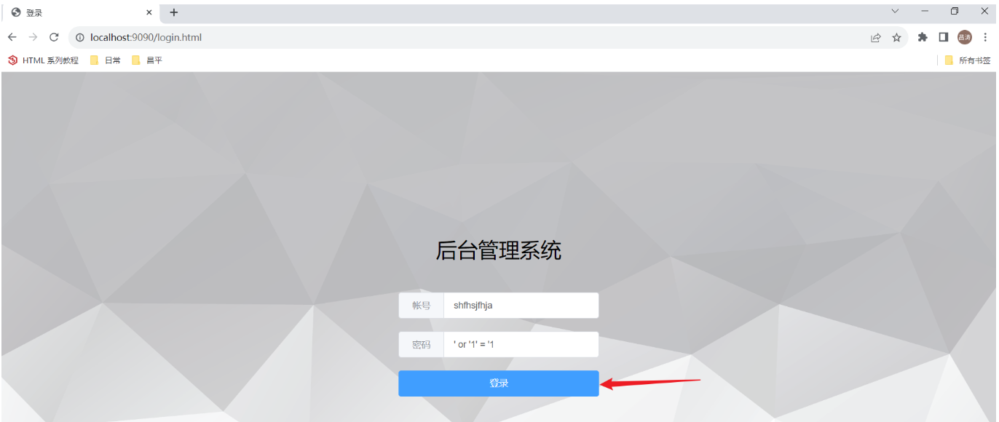

**注入演示：**

**1）打开课程资料中的文件夹 `资料/02. SQL注入演示`，运行其中的 jar 包 `sql_Injection_demo-0.0.1-SNAPSHOT.jar`，进入该目录后，执行命令：**

```bash
java -jar sql_Injection_demo-0.0.1-SNAPSHOT.jar
```

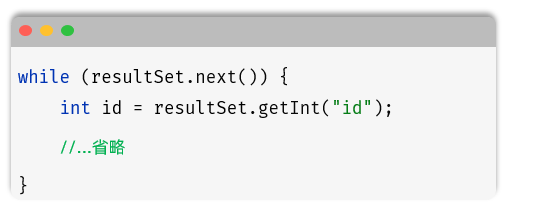

**2）打开浏览器访问 `http://localhost:9090/`，必须登录后才能访问到系统。我们先测试正常的用户名和密码**


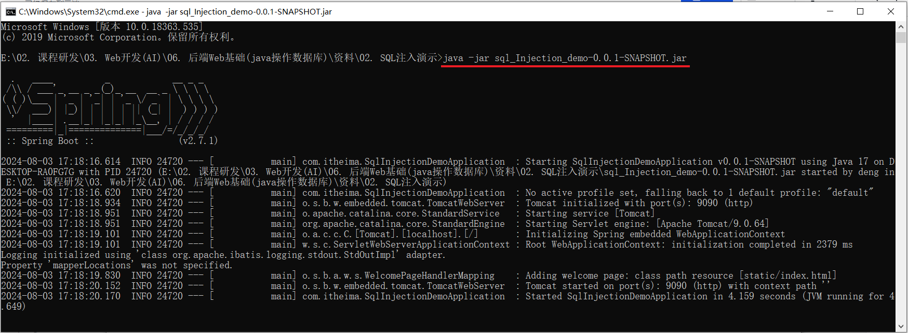

**3）接下来，我们再来测试一下错误的用户名和密码。**

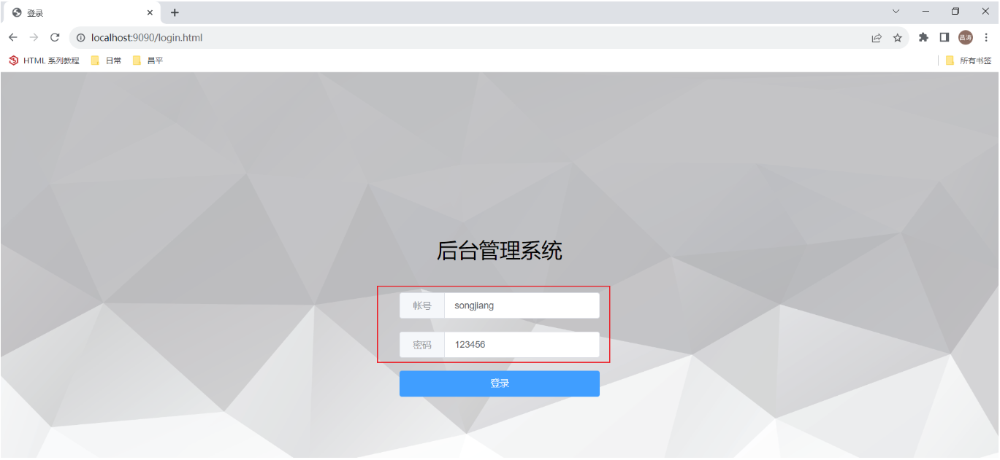

我们看到，如果用户名密码错误，是不能进入到系统中进行访问的，会提示 `用户名和密码错误`。

**4）那接下来，我们就要演示一下 SQL 注入现象，我们可以通过控制表单输入，来修改事先定义好的 SQL 语句的含义。从而来攻击服务器。**

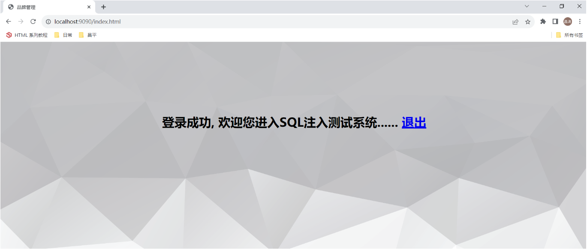

点击登录后，我们看到居然可以成功进入到系统中。

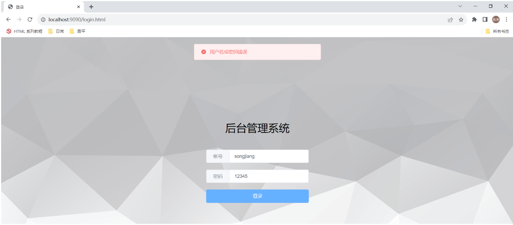

**为什么会出现这种现象呢？**

在进行登录操作时，怎么样才算登录成功呢？如果我们查询到了数据，就说明用户名密码是对的。如果没有查询到数据，就说明用户名或密码错误。

而出现上述现象，原因就是因为，我们编写的 SQL 语句是 **基于字符串进行拼接的**。我们输入的用户名无所谓，比如：`shfhsjfhja`，而密码呢，就是我们精心设计的，如：`' or '1' = '1`。

那最终拼接的 SQL 语句，如下所示：

```sql
select * from user where username = 'shfhsjfhja' and password = '' or '1' = '1';
```

> 📌 我们知道，`or` 连接的条件，是 **或** 的关系，两者满足其一就可以。所以，虽然用户名密码输入错误，也是可以查询返回结果的，而只要查询到了数据，就说明用户名和密码是正确的。

##### 2.2.4.2.2 SQL 注入解决

而通过预编译 SQL（`select * from user where username = ? and password = ?`），就可以直接解决上述 SQL 注入的问题。接下来，我们再来演示一下，通过预编译 SQL 是否能够解决 SQL 注入问题。

**1）打开课程资料中的文件夹 `资料/02. SQL注入演示`，运行其中的 jar 包 `sql_prepared_demo-0.0.1-SNAPSHOT.jar`，进入该目录后，执行命令：**

```bash
java -jar sql_prepared_demo-0.0.1-SNAPSHOT.jar
```

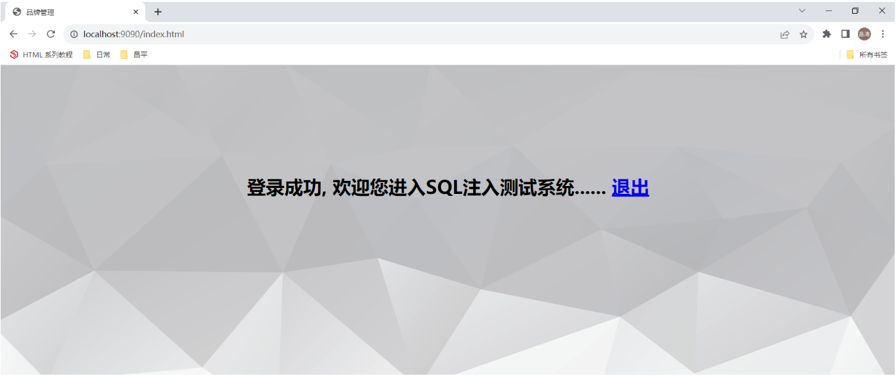

**2）打开浏览器访问 `http://localhost:9090/`，必须登录后才能访问到系统。我们先测试正常的用户名和密码**

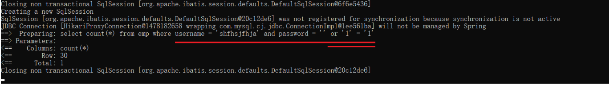

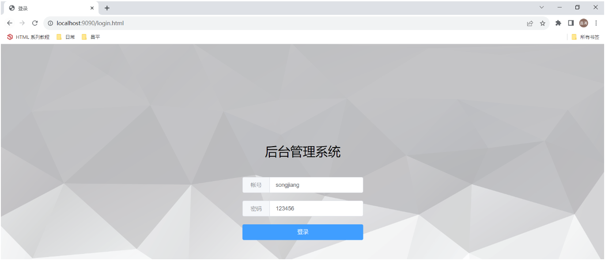

**3）那接下来，我们就要演示一下是否可以基于上述的密码 `' or '1' = '1`，来完成 SQL 注入。**

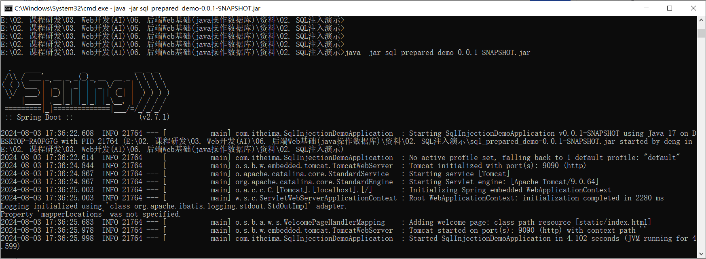

通过控制台，可以看到输入的 SQL 语句，是预编译 SQL 语句。

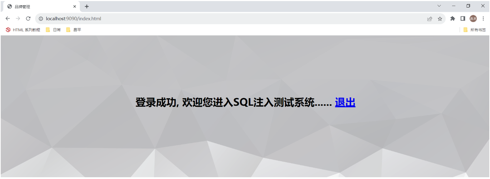

而在预编译 SQL 语句中，当我们执行的时候，会把整个 `' or '1'='1` 作为一个完整的参数，赋值给第 2 个问号（`' or '1'='1` 进行了转义，只当做字符串使用）。

那么此时再查询时，就查询不到对应的数据了，登录失败。

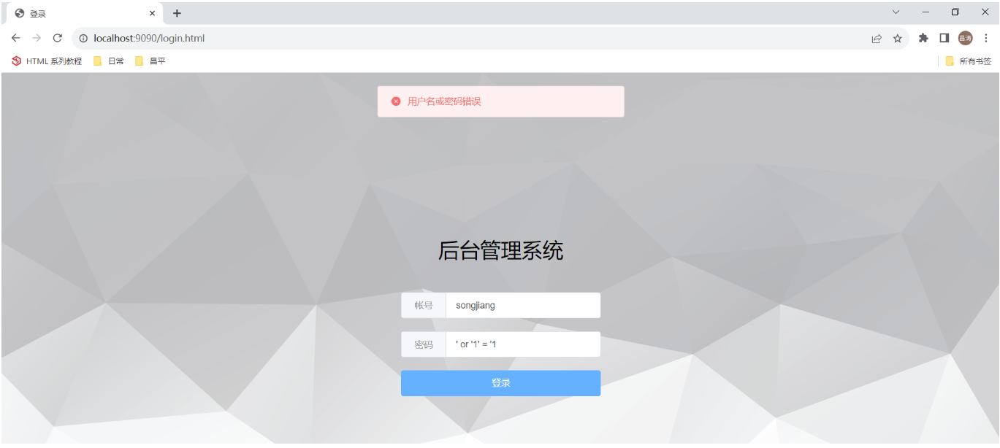

> 💡 **注意**：在以后的项目开发中，我们使用的基本全部都是预编译 SQL 语句。

##### 2.2.4.2.3 性能更高

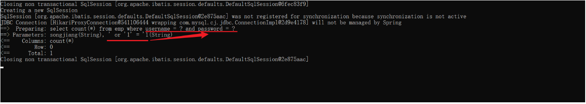

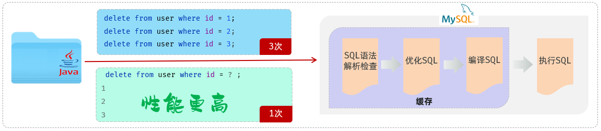

## 2.3 增删改数据

### 2.3.1 需求

- **需求**：基于 JDBC 程序，执行如下 update 语句。
- **SQL：**

```sql
update user set password = '123456', gender = 2 where id = 1;
```

### 2.3.2 代码实现

> 💡 **AI 提示词（prompt）：**
>
> 你是一名 java 开发工程师，帮我基于 JDBC 程序来操作数据库，执行如下 SQL 语句：
>
> `update user set password = '123456', gender = 2 where id = 1;`

**代码实现如下：**

```java
@ParameterizedTest
@CsvSource({"1,123456,25"})
public void testUpdate(int userId, String newPassword, int newAge) throws Exception {
    // 建立数据库连接
    Connection conn = DriverManager.getConnection("jdbc:mysql://localhost:3306/web", "root", "1234");
    // SQL 更新语句
    String sql = "UPDATE user SET password = ?, age = ? WHERE id = ?";
    // 创建预编译的 PreparedStatement 对象
    PreparedStatement pstmt = conn.prepareStatement(sql);

    // 设置参数
    pstmt.setString(1, newPassword); // 第一个问号对应的参数
    pstmt.setInt(2, newAge);         // 第二个问号对应的参数
    pstmt.setInt(3, userId);         // 第三个问号对应的参数

    // 执行更新
    int rowsUpdated = pstmt.executeUpdate();

    // 输出结果
    System.out.println(rowsUpdated + " row(s) updated.");

    // 关闭资源
    pstmt.close();
    conn.close();
}
```

> 💡 **核心区别：**
> - **JDBC 程序执行 DML 语句**：`int rowsUpdated = pstmt.executeUpdate();` // 返回值是 **影响的记录数**
> - **JDBC 程序执行 DQL 语句**：`ResultSet resultSet = pstmt.executeQuery();` // 返回值是 **查询结果集**

---

# 3. Mybatis

## 3.1 介绍


**什么是 MyBatis ?**

- MyBatis 是一款优秀的 **持久层** 框架，用于简化 JDBC 的开发。
- MyBatis 本是 Apache 的一个开源项目 iBatis，2010 年这个项目由 apache 迁移到了 google code，并且改名为 MyBatis。2013 年 11 月迁移到 Github。
- **官网**：https://mybatis.org/mybatis-3/zh/index.html

在上面我们提到了两个词：一个是 **持久层**，另一个是 **框架**。

- **持久层**：指的是就是数据访问层（dao），是用来操作数据库的。

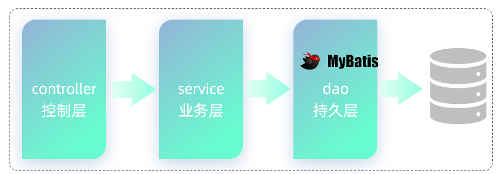

- **框架**：是一个半成品软件，是一套可重用的、通用的、软件基础代码模型。在框架的基础上进行软件开发更加高效、规范、通用、可拓展。

通过 Mybatis 就可以大大简化原生的 JDBC 程序的代码编写，比如通过 `select * from user` 查询所有的用户数据，通过 JDBC 程序操作呢，需要大量的代码实现，而如果通过 Mybatis 实现相同的功能，只需要简单的三四行就可以搞定。

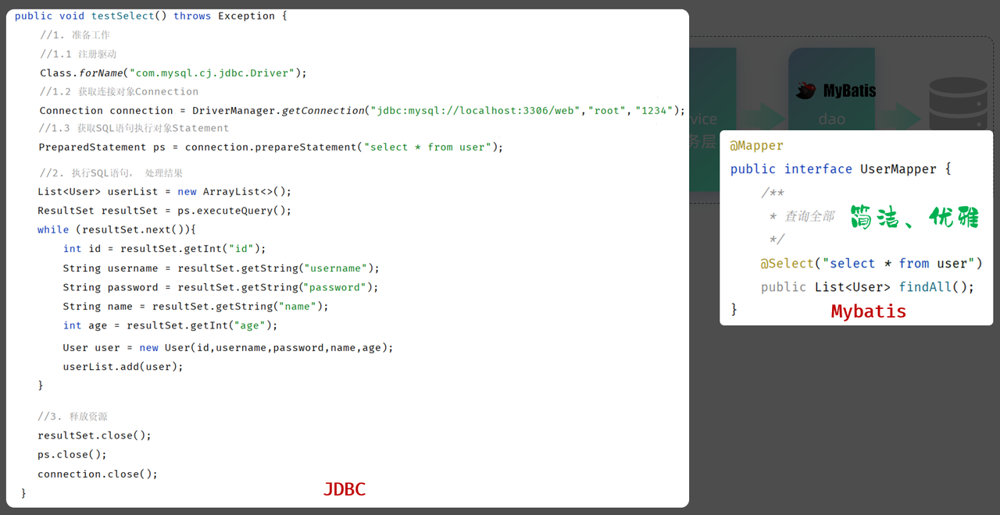

### 3.1.1 快速入门

**需求**：使用 Mybatis 查询所有用户数据。

**1）创建 springboot 工程，并导入 mybatis 的起步依赖、mysql 的驱动包、lombok。**

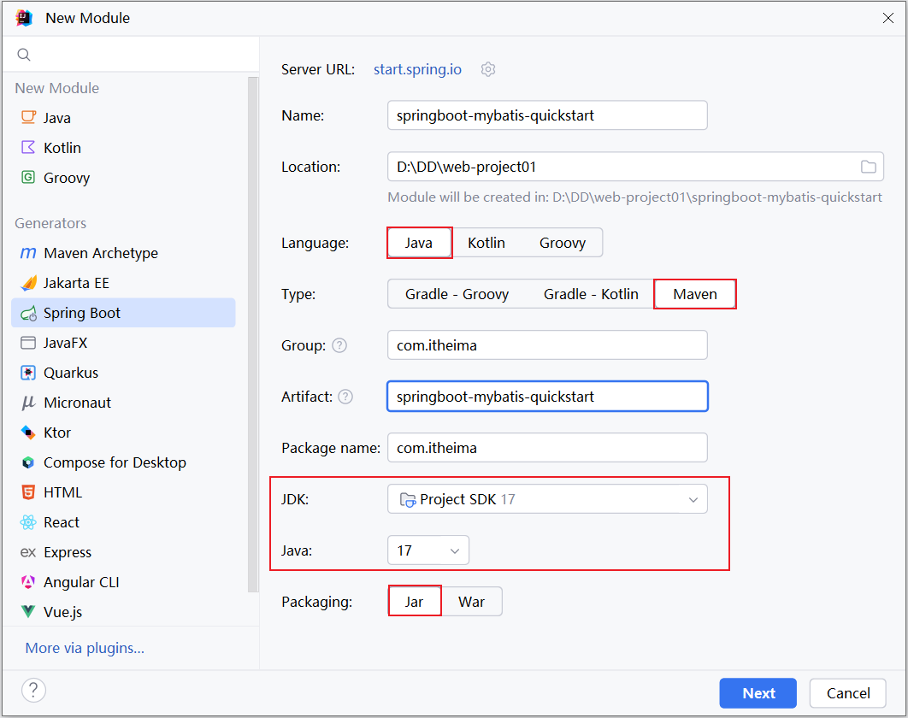

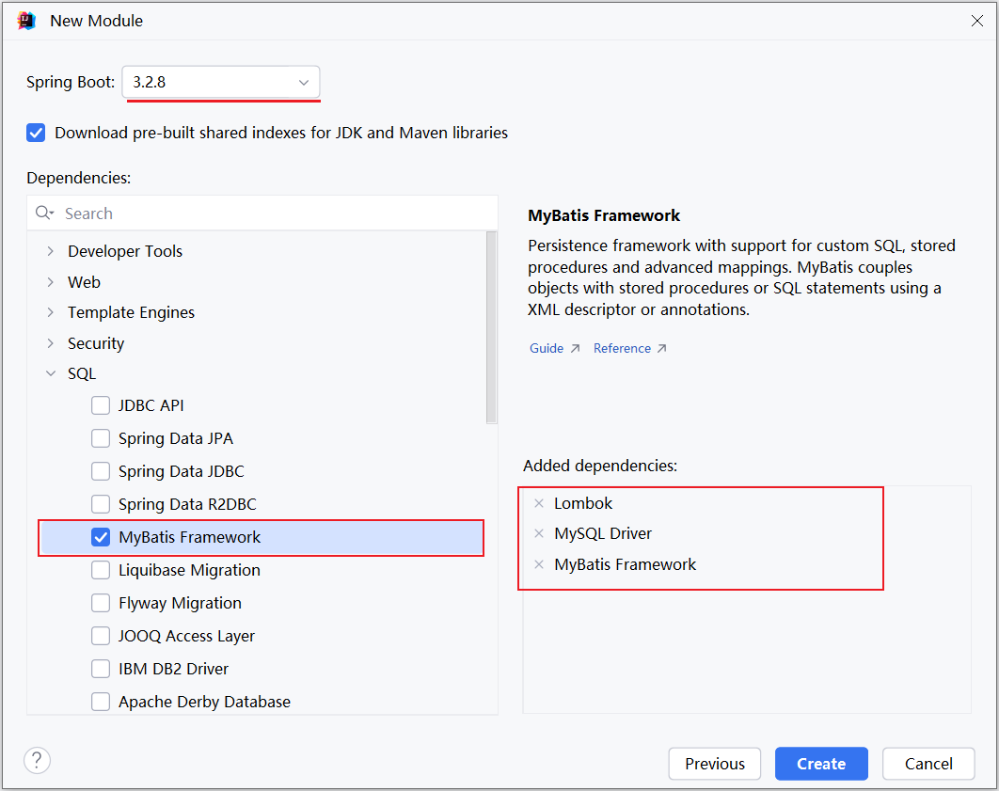

项目工程创建完成后，自动在 `pom.xml` 文件中，导入 Mybatis 依赖和 MySQL 驱动依赖。如下所示：

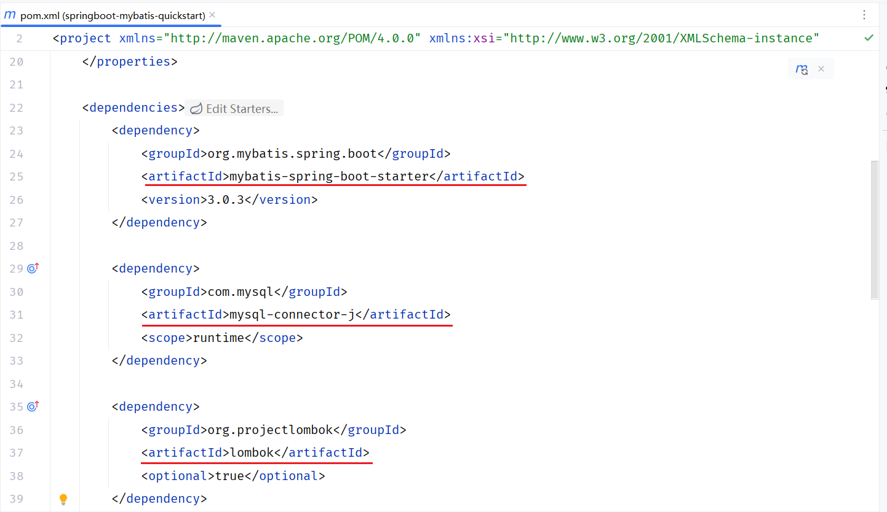

**2）数据准备：创建用户表 user，并创建对应的实体类 User。**

- **用户表 user**（如果已经存在，就不用创建了）

```sql
create table user(
    id int unsigned primary key auto_increment comment 'ID,主键',
    username varchar(20) comment '用户名',
    password varchar(32) comment '密码',
    name varchar(10) comment '姓名',
    age tinyint unsigned comment '年龄'
) comment '用户表';

insert into user(id, username, password, name, age) values
(1, 'daqiao',   '123456',   '大乔', 22),
(2, 'xiaoqiao', '123456',   '小乔', 18),
(3, 'diaochan', '123456',   '貂蝉', 24),
(4, 'lvbu',     '123456',   '吕布', 28),
(5, 'zhaoyun',  '12345678', '赵云', 27);
```

- **实体类**：实体类的属性名与表中的字段名一一对应。实体类放在 `com.itheima.pojo` 包下。

```java
@Data
@NoArgsConstructor
@AllArgsConstructor
public class User {
    private Integer id;       //ID
    private String username;  //用户名
    private String password;  //密码
    private String name;      //姓名
    private Integer age;      //年龄
}
```

**3）配置 Mybatis**

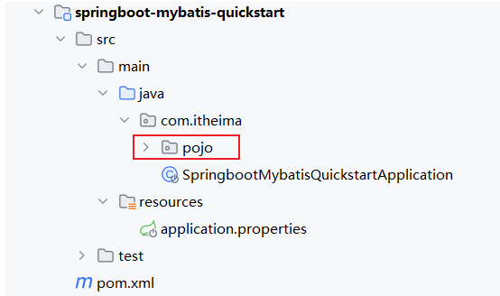

在 `application.properties` 中配置数据库的连接信息。

```properties
#数据库访问的url地址
spring.datasource.url=jdbc:mysql://localhost:3306/web
#数据库驱动类类名
spring.datasource.driver-class-name=com.mysql.cj.jdbc.Driver
#访问数据库-用户名
spring.datasource.username=root
#访问数据库-密码
spring.datasource.password=root@1234
```

> 📌 上述的配置，可以直接复制过去，不要敲错了。全部都是 `spring.datasource.xxxx` 开头。

**4）编写 Mybatis 程序：编写 Mybatis 的持久层接口，定义 SQL 语句（注解）**

在创建出来的 springboot 工程中，在引导类所在包下，再创建一个包 `mapper`。在 `mapper` 包下创建一个接口 `UserMapper`，这是一个持久层接口（Mybatis 的持久层接口规范一般都叫 `XxxMapper`）。

`UserMapper` 接口的内容如下：

```java
import com.itheima.pojo.User;
import org.apache.ibatis.annotations.Mapper;
import org.apache.ibatis.annotations.Select;
import java.util.List;

@Mapper
public interface UserMapper {
    /**
     * 查询全部
     */
    @Select("select * from user")
    public List<User> findAll();
}
```

> 💡 **注解说明：**
> - **`@Mapper` 注解**：表示是 mybatis 中的 Mapper 接口
>   - 程序运行时，框架会自动生成接口的实现类对象（代理对象），并交给 Spring 的 IOC 容器管理
> - **`@Select` 注解**：代表的就是 select 查询，用于书写 select 查询语句

**5）单元测试**

在创建出来的 SpringBoot 工程中，在 src 下的 test 目录下，已经自动帮我们创建好了测试类，并且在测试类上已经添加了注解 `@SpringBootTest`，代表该测试类已经与 SpringBoot 整合。

该测试类在运行时，会自动通过引导类加载 Spring 的环境（IOC 容器）。我们要测试哪个 bean 对象，就可以直接通过 `@Autowired` 注解直接将其注入进来，然后就可以测试了。

**测试类代码如下：**

```java
@SpringBootTest
class SpringbootMybatisQuickstartApplicationTests {

    @Autowired
    private UserMapper userMapper;

    @Test
    public void testFindAll(){
        List<User> userList = userMapper.findAll();
        for (User user : userList) {
            System.out.println(user);
        }
    }
}
```

**运行结果：**

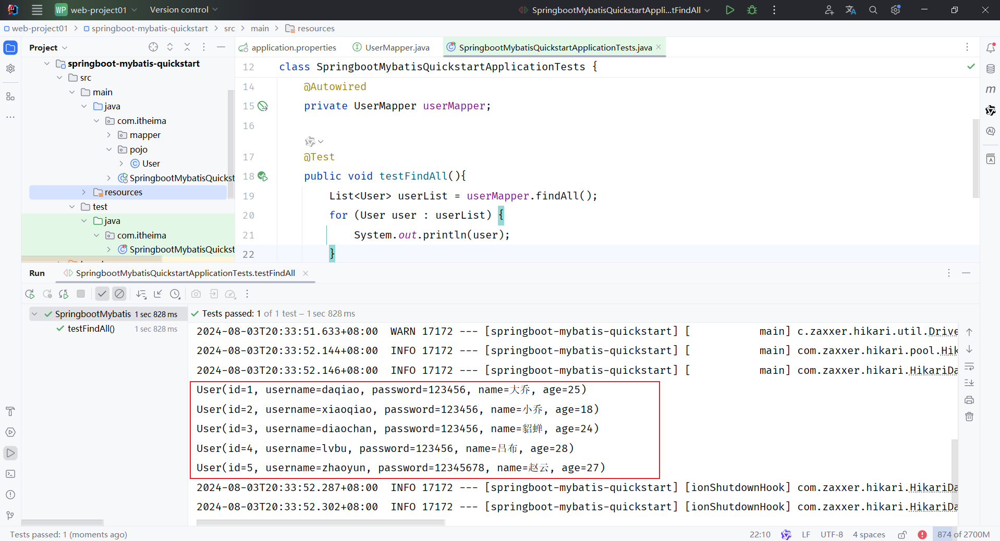

> 📌 **注意**：测试类所在包，需要与引导类所在包相同。

### 3.1.2 辅助配置

#### 3.1.2.1 配置 SQL 提示

默认我们在 `UserMapper` 接口上加的 `@Select` 注解中编写 SQL 语句是没有提示的。如果想让 idea 给我们提示对应的 SQL 语句，我们需要在 IDEA 中配置与 MySQL 数据库的链接。

默认我们在 `UserMapper` 接口上的 `@Select` 注解中编写 SQL 语句是没有提示的。如果想让 idea 给出提示，可以做如下配置：

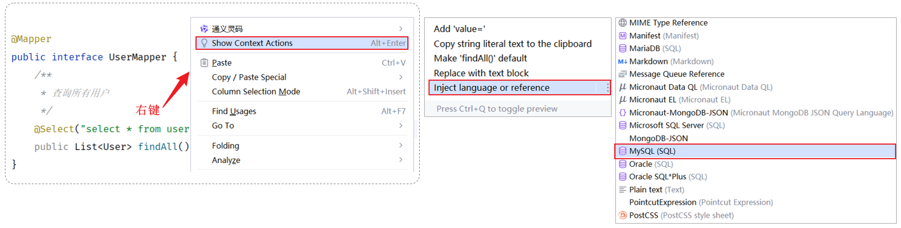

配置完成之后，发现 SQL 语句中的关键字有提示了，但还存在不识别表名（列名）的情况：

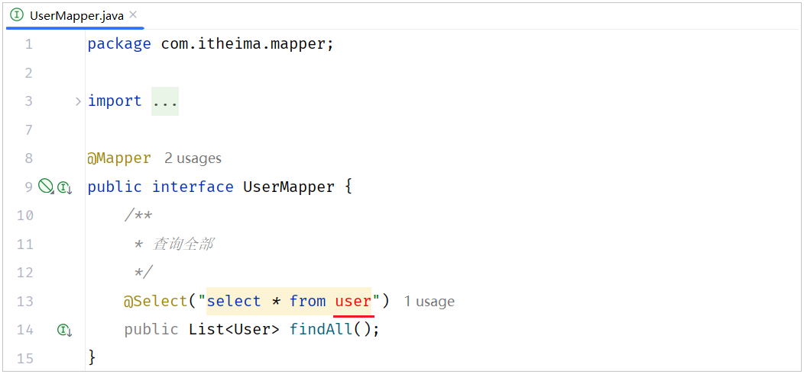

- **产生原因**：Idea 和数据库没有建立连接，不识别表信息
- **解决方案**：在 Idea 中配置 MySQL 数据库连接

按照如下方式，来配置当前 IDEA 关联的 MySQL 数据库（必须要指定连接的是哪个数据库）。

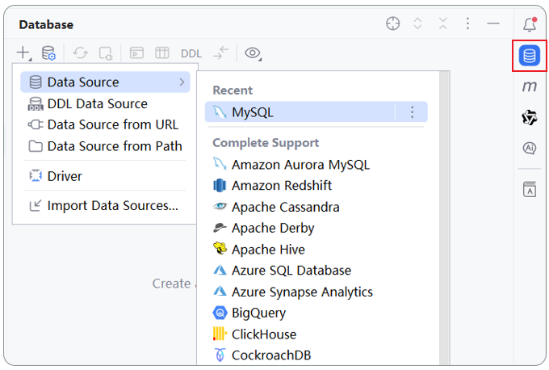

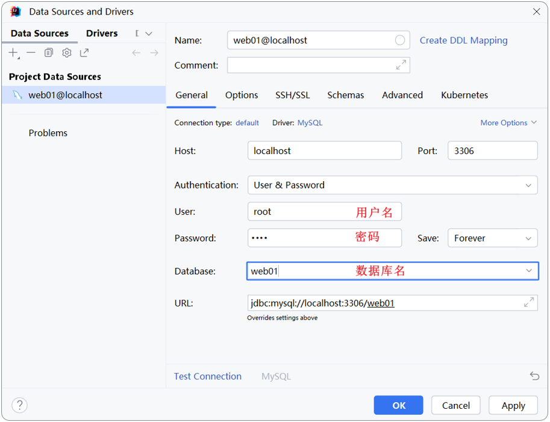

在配置的时候指定连接哪个数据库，如上图所示连接的就是 `mybatis` 数据库（自己的数据库名是什么就指定什么）。

> 💡 **注意**：该配置的目的，仅仅是为了在编写 SQL 语句时，有语法提示（写错了会报错），不会影响运行，即使不配置也是可以的。

#### 3.1.2.2 配置 Mybatis 日志输出

默认情况下，在 Mybatis 中，SQL 语句执行时，我们并看不到 SQL 语句的执行日志。在 `application.properties` 加入如下配置，即可查看日志：

```properties
#mybatis 的配置
mybatis.configuration.log-impl=org.apache.ibatis.logging.stdout.StdOutImpl
```

打开上述开关之后，再次运行单元测试，就可以看到控制台输出的 SQL 语句是什么样子的。

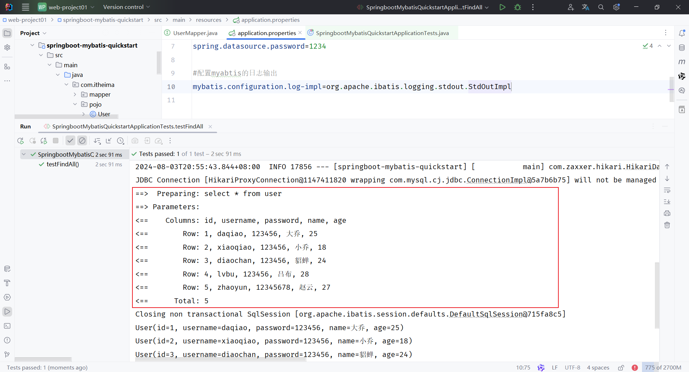

### 3.1.3 JDBC VS Mybatis

**JDBC 程序的缺点：**

- `url`、`username`、`password` 等相关参数全部硬编码在 java 代码中。
- 查询结果的解析、封装比较繁琐。
- 每一次操作数据库之前，先获取连接，操作完毕之后，关闭连接。频繁的获取连接、释放连接造成资源浪费。

分析了 JDBC 的缺点之后，我们再来看一下在 mybatis 中，是如何解决这些问题的：

- 数据库连接四要素（驱动、链接、用户名、密码），都配置在 springboot 默认的配置文件 `application.properties` 中
- 查询结果的解析及封装，由 mybatis 自动完成映射封装，我们无需关注
- 在 mybatis 中使用了数据库连接池技术，从而避免了频繁的创建连接、销毁连接而带来的资源浪费。

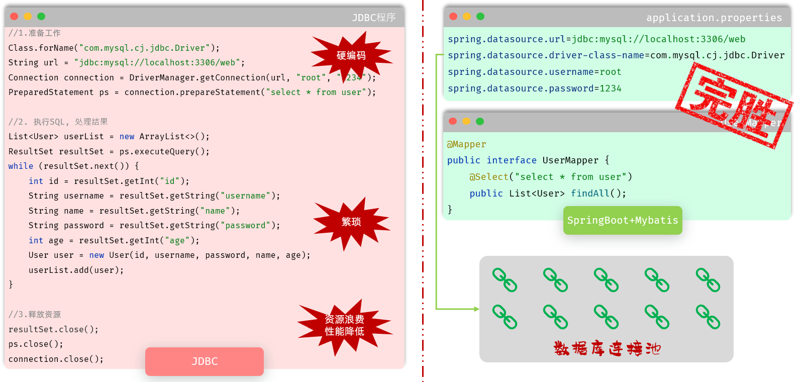

> 💡 使用 **SpringBoot + Mybatis** 的方式操作数据库，能够提升开发效率、降低资源浪费

而对于 Mybatis 来说，我们在开发持久层程序操作数据库时，需要重点关注以下两个方面：

**1. `application.properties`**

```properties
#驱动类名称
spring.datasource.driver-class-name=com.mysql.cj.jdbc.Driver
#数据库连接的url
spring.datasource.url=jdbc:mysql://localhost:3306/web01
#连接数据库的用户名
spring.datasource.username=root
#连接数据库的密码
spring.datasource.password=1234
```

**2. Mapper 接口（编写 SQL 语句）**

```java
@Mapper
public interface UserMapper {
    @Select("select * from user")
    public List<User> list();
}
```

### 3.1.4 数据库连接池

在前面我们所讲解的 mybatis 中，使用了数据库连接池技术，避免频繁的创建连接、销毁连接而带来的资源浪费。

下面我们就具体的了解下数据库连接池。

#### 3.1.4.1 介绍

**1）没有数据库连接池的情况**


客户端执行 SQL 语句：要先创建一个新的连接对象，然后执行 SQL 语句，SQL 语句执行后又需要关闭连接对象从而释放资源，每次执行 SQL 时都需要创建连接、销毁连接，这种频繁的重复创建销毁的过程是比较耗费计算机的性能。

**2）有数据库连接池的情况**

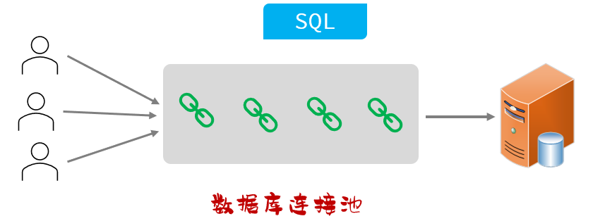

**数据库连接池是个容器，负责分配、管理数据库连接（Connection）**

- 程序在启动时，会在数据库连接池（容器）中，创建一定数量的 Connection 对象

> ✅ 允许应用程序重复使用一个现有的数据库连接，而不是再重新建立一个

- 客户端在执行 SQL 时，先从连接池中获取一个 Connection 对象，然后再执行 SQL 语句，SQL 语句执行完之后，释放 Connection 时就会把 Connection 对象归还给连接池（Connection 对象可以复用）

> ✅ 释放空闲时间超过最大空闲时间的连接，来避免因为没有释放连接而引起的数据库连接遗漏

- 客户端获取到 Connection 对象了，但是 Connection 对象并没有去访问数据库（处于空闲），数据库连接池发现 Connection 对象的空闲时间 > 连接池中预设的最大空闲时间，此时数据库连接池就会自动释放掉这个连接对象

**数据库连接池的好处：**

- 资源重用
- 提升系统响应速度
- 避免数据库连接遗漏

#### 3.1.4.2 产品

要怎么样实现数据库连接池呢？

- 官方（sun）提供了数据库连接池标准（`javax.sql.DataSource` 接口）
- 功能：获取连接

```java
public Connection getConnection() throws SQLException;
```

- 第三方组织必须按照 `DataSource` 接口实现

> 📌 **常见的数据库连接池**：**C3P0、DBCP、Druid、Hikari（springboot 默认）**
>
> 现在使用更多的是：**Hikari、Druid（性能更优越）**

**1）Hikari（追光者）[默认的连接池]**

从控制台输出的日志，我们也可以看出，springboot 底层默认使用的数据库连接池就是 **Hikari**。

**2）Druid（德鲁伊）**

- Druid 连接池是阿里巴巴开源的数据库连接池项目
- 功能强大，性能优秀，是 Java 语言最好的数据库连接池之一

如果我们想把默认的数据库连接池切换为 Druid 数据库连接池，只需要完成以下两步操作即可：

> 参考官方地址：https://github.com/alibaba/druid/tree/master/druid-spring-boot-starter

**①. 在 `pom.xml` 文件中引入依赖**

```xml
<dependency>
    <!-- Druid 连接池依赖 -->
    <groupId>com.alibaba</groupId>
    <artifactId>druid-spring-boot-starter</artifactId>
    <version>1.2.19</version>
</dependency>
```

**②. 在 `application.properties` 中引入数据库连接配置**

```properties
spring.datasource.type=com.alibaba.druid.pool.DruidDataSource
spring.datasource.druid.driver-class-name=com.mysql.cj.jdbc.Driver
spring.datasource.druid.url=jdbc:mysql://localhost:3306/web
spring.datasource.druid.username=root
spring.datasource.druid.password=1234
```

配置完毕之后，我们再次运行单元测试，大家会看到控制台输出的日志中，已经将连接池切换为了 Druid 连接池。

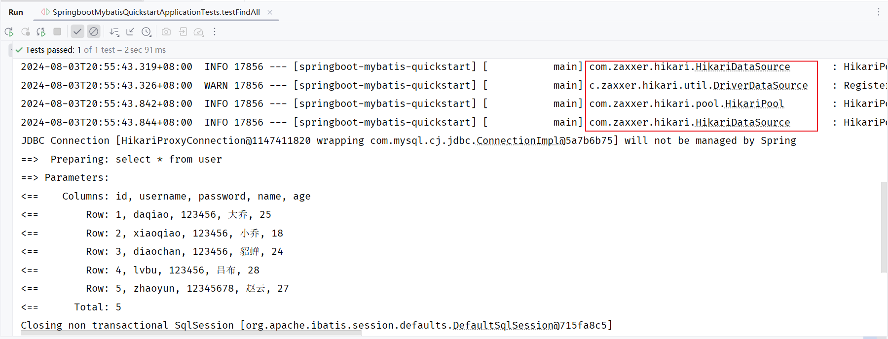

### 3.1.5 增删改查操作

#### 3.1.5.1 删除

- **需求**：根据 ID 删除用户信息
- **SQL**：`delete from user where id = 5;`
- **Mapper 接口方法：**

**◦ 方式一：**

```java
/**
 * 根据 id 删除
 */
@Delete("delete from user where id = 5")
public void deleteById();
```

这种方式执行删除操作，调用 `deleteById` 方法只能删除 id 为 5 的用户信息，因为将 id 直接写死在代码中了，不可取。

**◦ 方式二：**

```java
/**
 * 根据 id 删除
 */
@Delete("delete from user where id = #{id}")
public void deleteById(Integer id);
```

> 📌 在 Mybatis 中，我们可以通过参数占位符号 `#{...}` 来占位，在调用 `deleteById` 方法时，传递的参数值，最终会替换占位符。

- **编写单元测试方法进行测试**

在单元测试类中，增加如下测试方法。

```java
@Test
public void testDeleteById(){
    userMapper.deleteById(36);
}
```

**运行单元测试，结果如下：**

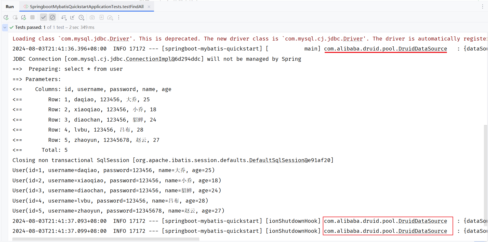

运行之后，我们发现，`#{...}` 占位符，其实最终被替换成了 `?` 占位符，生成的是预编译的 SQL 语句。【推荐】

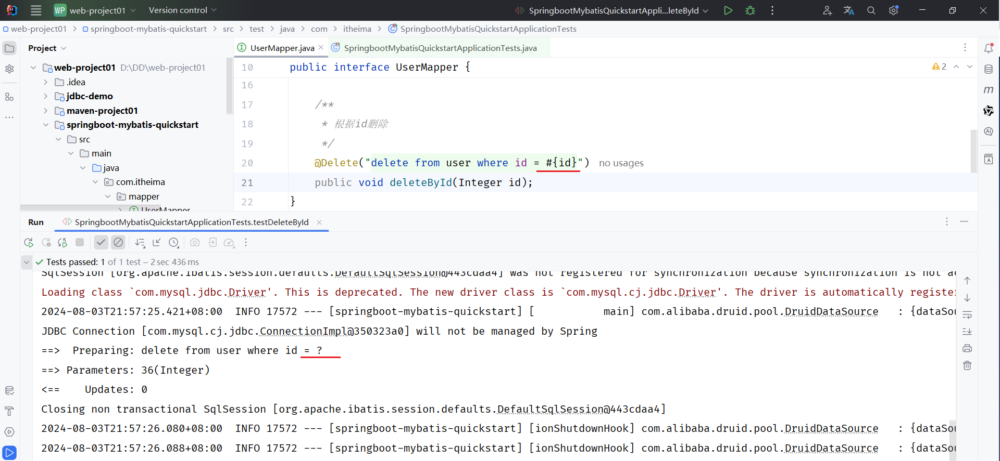

- **DML 语句执行完毕，是有返回值的，我们可以为 Mapper 接口方法定义返回值来接收，如下：**

```java
/**
 * 根据 id 删除
 */
@Delete("delete from user where id = #{id}")
public Integer deleteById(Integer id);
```

> 📌 Integer 类型的返回值，表示 DML 语句执行完毕影响的记录数。

- **Mybatis 提供的符号，有两个，一个是 `#{...}`，另一个是 `${...}`，区别如下：**

| 符号 | 说明 | 场景 |
| --- | --- | --- |
| **`#{...}`** | 占位符，执行时，会将其替换为 `?`，生成预编译 SQL | 参数传递，都使用 `#{...}` |
| **`${...}`** | 拼接符，直接将参数值拼接在 SQL 语句中，存在 SQL 注入问题 | 表名、字段名动态设置时使用 |

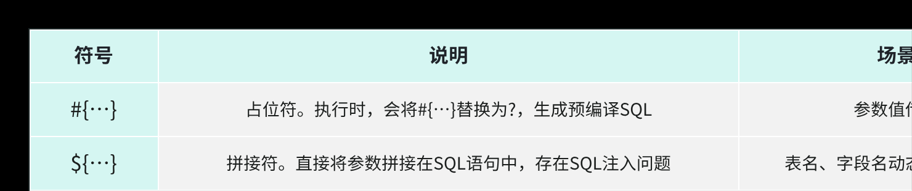

> 📌 那在企业项目开发中，**强烈建议使用 `#{...}`**。

#### 3.1.5.2 新增

- **需求**：添加一个用户
- **SQL**：`insert into user(username,password,name,age) values('zhouyu','123456','周瑜',20);`
- **Mapper 接口：**

```java
/**
 * 添加用户
 */
@Insert("insert into user(username,password,name,age) values(#{username},#{password},#{name},#{age})")
public void insert(User user);
```

> 📌 如果在 SQL 语句中，我们需要传递多个参数，我们可以把多个参数封装到一个对象中。然后在 SQL 语句中，我们可以通过 `#{对象属性名}` 的方式，获取到对象中封装的属性值。

- **单元测试：**

在测试类中添加测试方法，代码如下：

```java
@Test
public void testInsert(){
    User user = new User();
    user.setUsername("admin");
    user.setPassword("123456");
    user.setName("管理员");
    user.setAge(30);
    userMapper.insert(user);
}
```

**运行结果如下：**

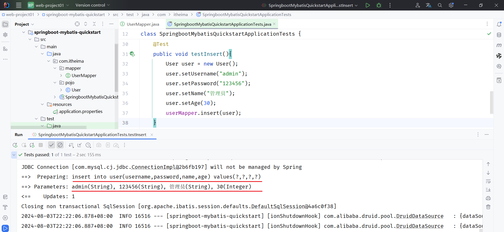

#### 3.1.5.3 修改

- **需求**：根据 ID 更新用户信息
- **SQL**：`update user set username = 'zhouyu', password = '123456', name = '周瑜', age = 20 where id = 1;`
- **Mapper 接口方法：**

```java
/**
 * 根据 id 更新用户信息
 */
@Update("update user set username = #{username},password = #{password},name = #{name},age = #{age} where id = #{id}")
public void update(User user);
```

- **单元测试：**

在测试类中添加测试方法，代码如下：

```java
@Test
public void testUpdate(){
    User user = new User();
    user.setId(6);
    user.setUsername("admin666");
    user.setPassword("123456");
    user.setName("管理员");
    user.setAge(30);
    userMapper.update(user);
}
```

**运行结果如下：**

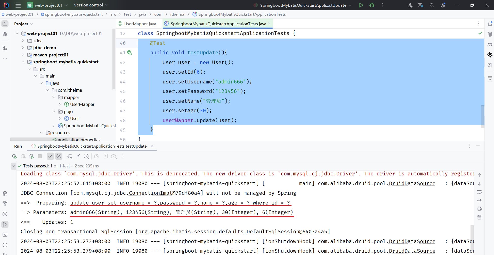

#### 3.1.5.4 查询

- **需求**：根据用户名和密码查询用户信息
- **SQL**：`select * from user where username = 'zhouyu' and password = '123456'`
- **Mapper 接口方法：**

```java
/**
 * 根据用户名和密码查询用户信息
 */
@Select("select * from user where username = #{username} and password = #{password}")
public User findByUsernameAndPassword(@Param("username") String username, @Param("password") String password);
```

> 📌 `@Param` 注解的作用是为接口的方法形参起名字的。（由于用户名是唯一的，所以查询返回的结果最多只有一个，可以直接封装到一个对象中）

- **单元测试：**

在测试类中添加测试方法，代码如下：

```java
@Test
public void testFindByUsernameAndPassword(){
    User user = userMapper.findByUsernameAndPassword("admin666", "123456");
    System.out.println(user);
}
```

**运行结果如下：**

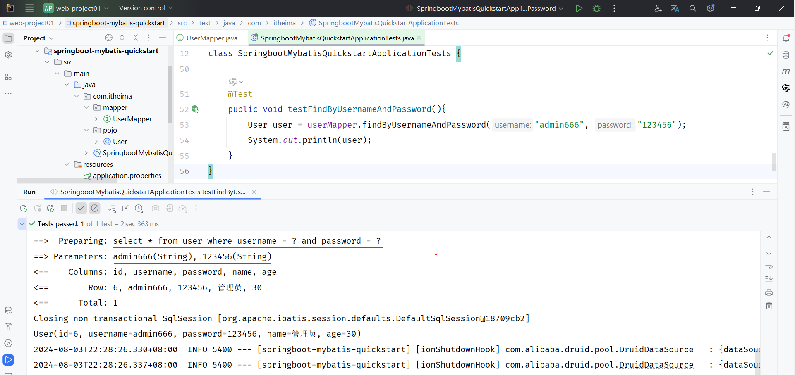

> 💡 **说明**：基于官方骨架创建的 springboot 项目中，接口编译时会保留方法形参名，`@Param` 注解可以省略（`#{形参名}`）。

### 3.1.6 XML 映射配置

Mybatis 的开发有两种方式：

1. **注解**
2. **XML**

#### 3.1.6.1 XML 配置文件规范

使用 Mybatis 的注解方式，主要是来完成一些简单的增删改查功能。如果需要实现复杂的 SQL 功能，建议使用 XML 来配置映射语句，也就是将 SQL 语句写在 XML 配置文件中。

> 💡 **在 Mybatis 中使用 XML 映射文件方式开发，需要符合一定的规范：**
> 1. XML 映射文件的名称与 Mapper 接口名称一致，并且将 XML 映射文件和 Mapper 接口放置在相同包下（同包同名）
> 2. XML 映射文件的 `namespace` 属性为 Mapper 接口全限定名一致
> 3. XML 映射文件中 sql 语句的 `id` 与 Mapper 接口中的方法名一致，并保持返回类型一致。

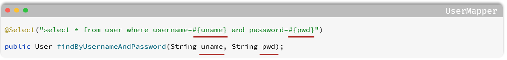

- **`<select>` 标签**：就是用于编写 select 查询语句的。
- **`resultType` 属性**，指的是查询返回的单条记录所封装的类型。

#### 3.1.6.2 XML 配置文件实现

**第 1 步：创建 XML 映射文件**

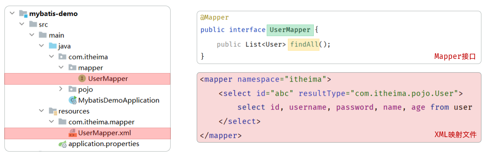

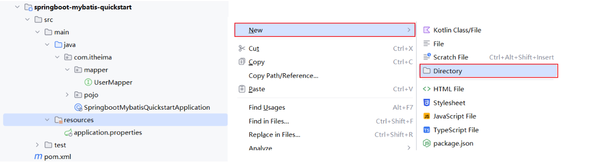

**第 2 步：编写 XML 映射文件**

xml 映射文件中的 dtd 约束，直接从 mybatis 官网复制即可；或者直接 AI 生成。

```xml
<?xml version="1.0" encoding="UTF-8" ?>
<!DOCTYPE mapper
        PUBLIC "-//mybatis.org//DTD Mapper 3.0//EN"
        "https://mybatis.org/dtd/mybatis-3-mapper.dtd">
<mapper namespace="">

</mapper>
```

**第 3 步：配置**

**a. XML 映射文件的 `namespace` 属性为 Mapper 接口全限定名**

```xml
<?xml version="1.0" encoding="UTF-8" ?>
<!DOCTYPE mapper
        PUBLIC "-//mybatis.org//DTD Mapper 3.0//EN"
        "https://mybatis.org/dtd/mybatis-3-mapper.dtd">
<mapper namespace="com.itheima.mapper.UserMapper">

</mapper>
```

**b. XML 映射文件中 sql 语句的 `id` 与 Mapper 接口中的方法名一致，并保持返回类型一致**

```xml
<?xml version="1.0" encoding="UTF-8" ?>
<!DOCTYPE mapper
        PUBLIC "-//mybatis.org//DTD Mapper 3.0//EN"
        "https://mybatis.org/dtd/mybatis-3-mapper.dtd">
<mapper namespace="com.itheima.mapper.EmpMapper">

    <!-- 查询操作 -->
    <select id="findAll" resultType="com.itheima.pojo.User">
        select * from user
    </select>

</mapper>
```

> 📌 `resultType` 属性的值，与查询返回的单条记录封装的类型一致。

**运行测试类，执行结果：**

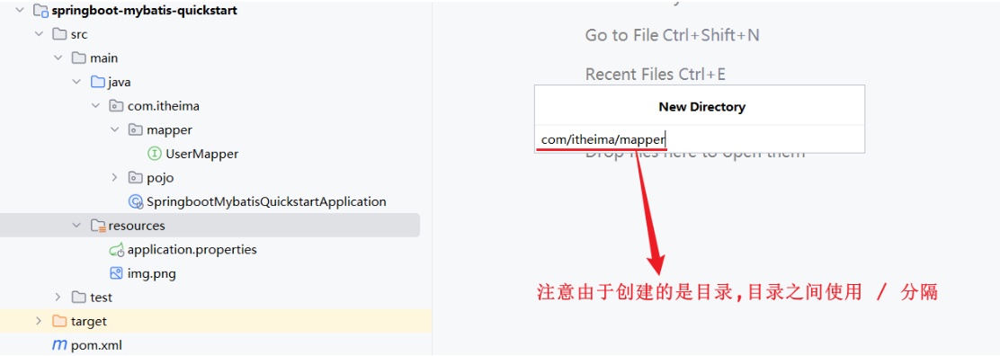

> 📌 **注意**：一个接口方法对应的 SQL 语句，要么使用注解配置，要么使用 XML 配置，**切不可同时配置**。

#### 3.1.6.3 MybatisX 的使用

**MybatisX** 是一款基于 IDEA 的快速开发 Mybatis 的插件，为效率而生。

**MybatisX 的安装：**

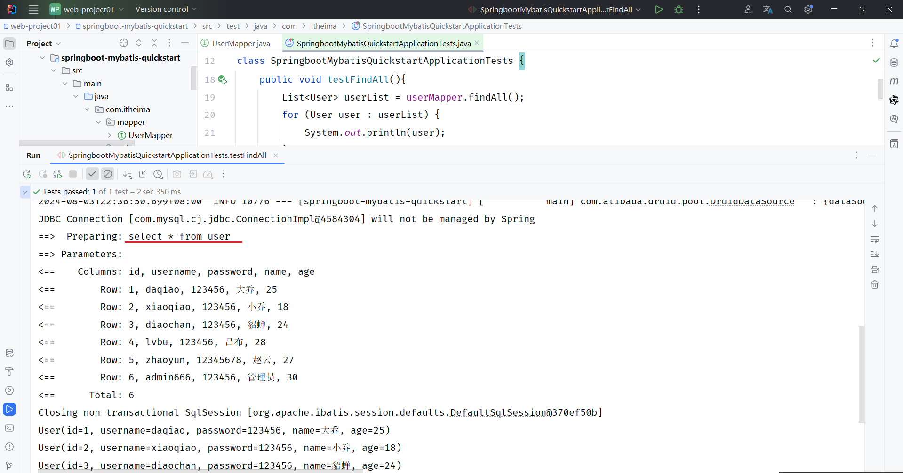

**可以通过 MybatisX 快速定位：**

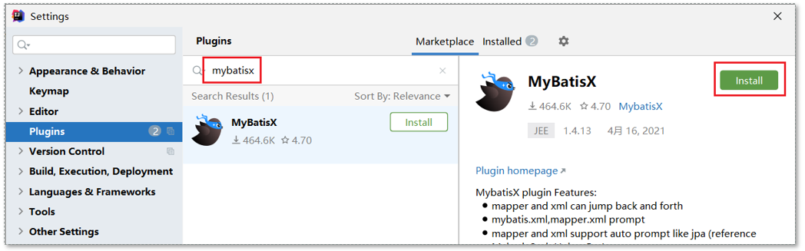

> ✅ MybatisX 的使用在后续学习中会继续分享。

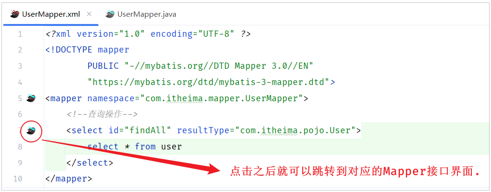

> 👀 学习了 Mybatis 中 XML 配置文件的开发方式了，大家可能会存在一个疑问：到底是使用注解方式开发还是使用 XML 方式开发？
>
> 官方说明：https://mybatis.net.cn/getting-started.html 。下面是官方说明：

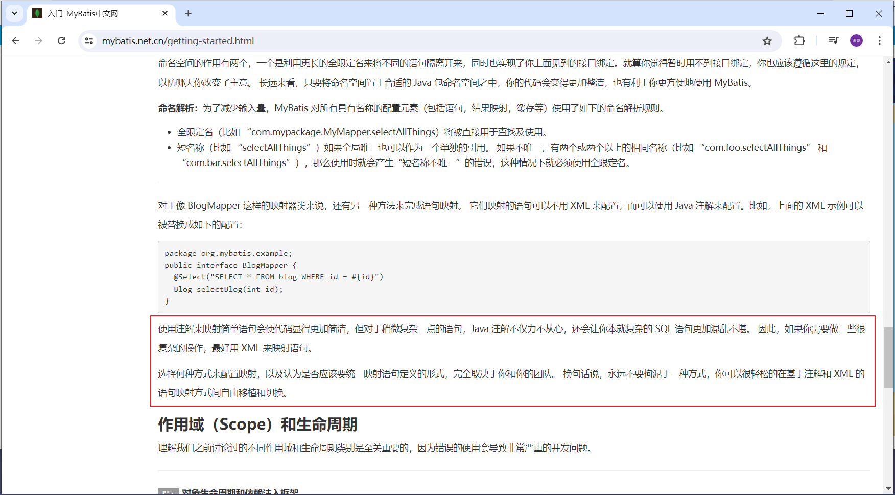

> ✅ **结论**：使用 Mybatis 的注解，主要是来完成一些简单的增删改查功能。如果需要实现复杂的 SQL 功能，建议使用 XML 来配置映射语句。

---

# 4. SpringBoot 配置文件

## 4.1 介绍

前面我们一直使用 springboot 项目创建完毕后自带的 `application.properties` 进行属性的配置，而如果在项目中，我们需要配置大量的属性，采用 properties 配置文件这种 `key=value` 的配置形式，就会显得配置文件的层级结构不清晰，也比较臃肿。

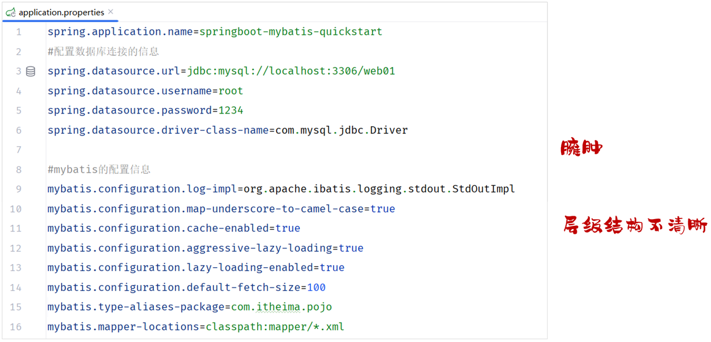

那其实呢，在 springboot 项目当中是支持多种配置方式的，除了支持 properties 配置文件以外，还支持另外一种类型的配置文件，就是我们接下来要讲解的 **yml 格式** 的配置文件。yml 格式配置文件名字为：`application.yaml`、`application.yml`，这两个配置文件的后缀名虽然不一样，但是里面配置的内容形式都是一模一样的。

我们可以来对比一下，采用 `application.properties` 和 `application.yml` 来配置同一段信息（数据库连接信息），两者之间的配置对比：

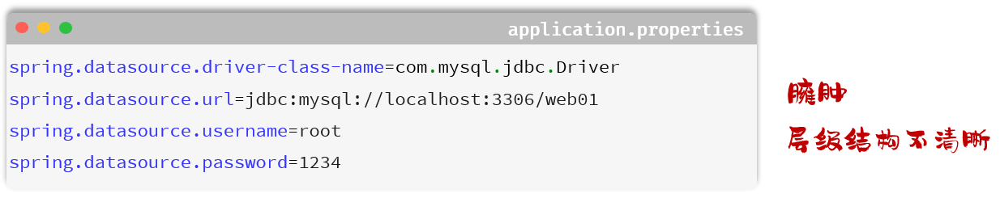

> ✅ 在项目开发中，我们推荐使用 `application.yml` 配置文件来配置信息，**简洁、明了、以数据为中心**。

## 4.2 语法

简单的了解过 springboot 所支持的配置文件，以及不同类型配置文件之间的优缺点之后，接下来我们就来了解下 yml 配置文件的基本语法：

- **大小写敏感**
- 数值前边必须有空格，作为分隔符
- 使用 **缩进** 表示层级关系，缩进时，**不允许使用 Tab 键**，只能用空格（idea 中会自动将 Tab 转换为空格）
- 缩进的空格数目不重要，只要相同层级的元素左侧对齐即可
- `#` 表示注释，从这个字符一直到行尾，都会被解析器忽略

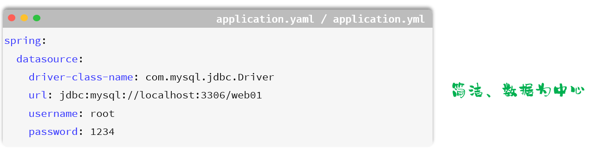

了解完 yml 格式配置文件的基本语法之后，接下来我们再来看下 yml 文件中常见的数据格式。在这里我们主要介绍最为常见的两类：

1. 定义对象或 Map 集合
2. 定义数组、list 或 set 集合

- **对象 / Map 集合**

```yml
user:
  name: zhangsan
  age: 18
  password: 123456
```

- **数组 / List / Set 集合**

```yml
hobby:
  - java
  - game
  - sport
```

> 📌 在 yml 格式的配置文件中，如果配置项的值是以 `0` 开头的，值需要使用 `''` 引起来，因为以 `0` 开头在 yml 中表示 **8 进制** 的数据。

## 4.3 案例

熟悉完了 yml 文件的基本语法后，我们修改下之前案例中使用的配置文件，变更为 `application.yml` 配置方式：

1. 修改 `application.properties` 名字为：`_application.properties`（名字随便更换，只要加载不到即可）
2. 创建新的配置文件：`application.yml`

- **原有的 `application.properties` 配置文件**

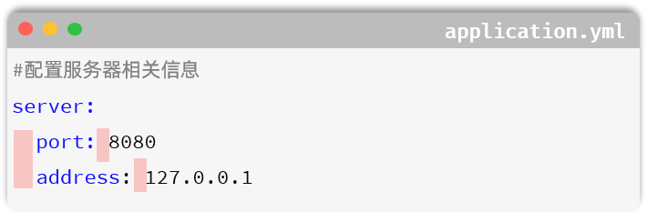

- **新建的 `application.yml` 配置文件**

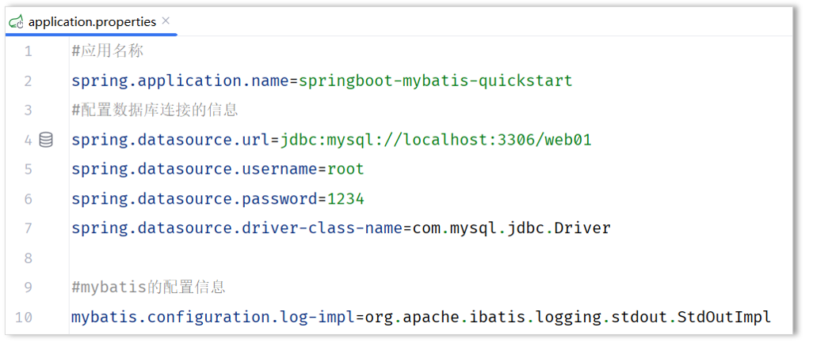

**配置文件的内容如下：**

```yml
#数据源配置
spring:
  datasource:
    driver-class-name: com.mysql.cj.jdbc.Driver
    url: jdbc:mysql://localhost:3306/web01
    username: root
    password: root@1234

#mybatis 配置
mybatis:
  configuration:
    log-impl: org.apache.ibatis.logging.stdout.StdOutImpl
```

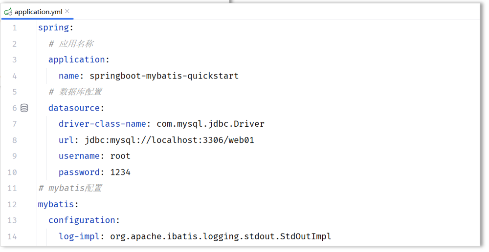
