# 19-项目部署(Linux)

> ⛳ 如果大家在自学的过程中，时间紧迫、没有方向、经常遇到难以解决的 Bug、没有亮眼的项目、缺少 AI 大模型经验，而又想快速系统化的学习、高薪就业的小伙伴儿，大家都可以 🔗 直接点我，了解一下我们系统化的课程体系。

---


Linux 是一套免费使用和自由传播的操作系统。说到操作系统，大家比较熟知的应该就是 Windows 和 MacOS 操作系统，我们今天所学习的 Linux 也是一款操作系统。

我们作为 javaEE 开发工程师，将来在企业中开发时会涉及到很多的数据库、中间件等技术，比如 MySQL、Redis、MQ 等技术，而这些应用软件大多都是需要安装在 Linux 系统中使用的。我们做为开发人员，是需要通过远程工具连接 Linux 操作系统，然后来操作这些软件的。而且一些小公司，可能还需要我们自己在服务器上安装这些软件。

所以，不管从企业的用人需求层面，还是个人发展需要层面来讲，我们作为服务端开发工程师，**Linux 的基本使用是我们必不可少的技能**。

> 📌 对于 Linux 的常用指令的学习，最好的学习方法就是：**多敲**

> ✅ **课程内容：**
> 1. Linux 概述
> 2. Linux 常用命令
> 3. Linux 软件安装
> 4. 项目部署

---

# 1. Linux 概述

## 1.1 主流操作系统

不同领域的主流操作系统，主要分为以下这么几类：**桌面操作系统、服务器操作系统、移动设备操作系统、嵌入式操作系统**。接下来，这几个领域中，代表性的操作系统是哪些?

**1）桌面操作系统**

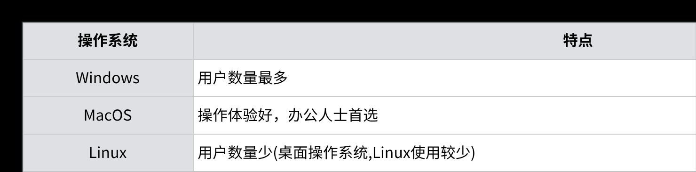

**2）服务器操作系统**

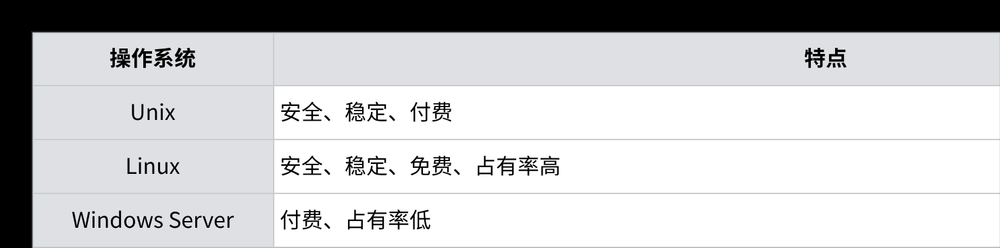

**3）移动设备操作系统**

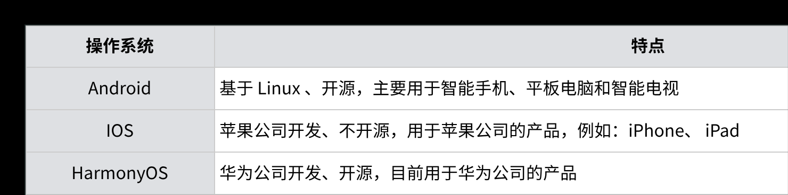

## 1.2 Linux 系统版本

Linux 系统的版本分为两种，分别是：**内核版** 和 **发行版**。

**1）内核版**

- 由 **Linus Torvalds** 及其团队开发、维护
- 免费、开源
- 负责控制硬件

**2）发行版**

- 基于 Linux 内核版进行扩展
- 由各个 Linux 厂商开发、维护
- 有收费版本和免费版本

我们使用 Linux 操作系统，实际上选择的是 Linux 的发行版本。在 linux 系统中，有各种各样的发行版本，具体如下：

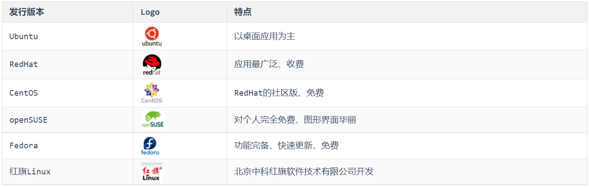

## 1.3 系统安装

### 1.3.1 安装方式

Linux 系统的安装方式，主要包含以下两种：


> ✅ **虚拟机（Virtual Machine）**：指通过软件模拟的具有完整硬件系统功能、运行在完全隔离环境中的完整计算机系统。

**常用虚拟机软件：**

- **VMWare**
- VirtualBox
- VMLite WorkStation
- Qemu
- HopeddotVOS

那么我们就可以在课程中将 Linux 操作系统安装在虚拟机中，我们课上选择的虚拟机软件是 **VMware**。

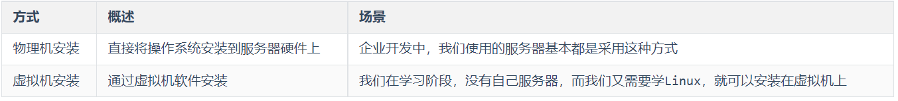

### 1.3.2 安装 VMware

在我们的课程资料中提供了 VMware 的安装程序。找到课程资料中的 Vmware 的安装包（exe 文件），然后双击下一步下一步的安装即可。


> ⚠️ **备注**：如果之前安装过，就不用安装了。**不要卸载！！！！**

**安装步骤：**

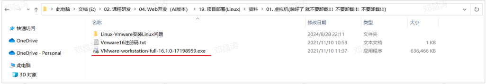

以上就是 VMware 在安装时的每一步操作，基本上就是点击 "下一步" 一直进行安装。

### 1.3.3 挂载 Linux 系统

**1）打开 Vmware 虚拟机，打开 `编辑 -> 虚拟网络编辑器(N)...`**

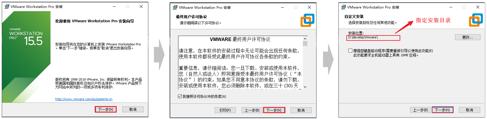

选择 **NAT 模式**，然后选择右下角的 **更改设置**。

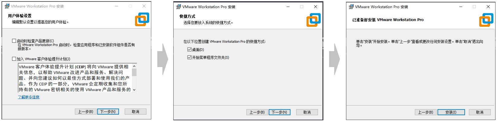

设置 **子网 IP 为 `192.168.100.0`**，然后选择 **应用 -> 确定**。

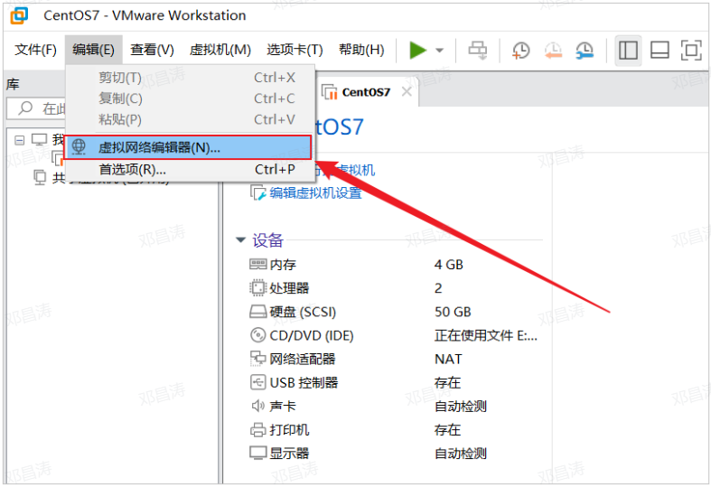

**2）解压 `资料/Linux镜像/CentOS7-1.zip` 到一个比较大的磁盘中（没有中文的目录）。**

**3）打开解压目录，双击 `.vmx` 文件，选择以 Vmware Workstation 打开这个文件。**

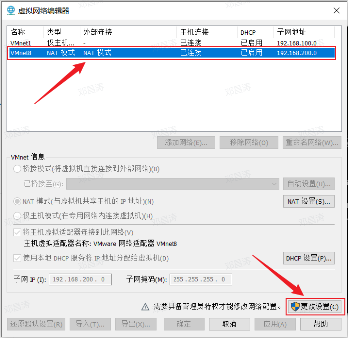

**4）挂载完毕之后，启动 Linux 服务器。**

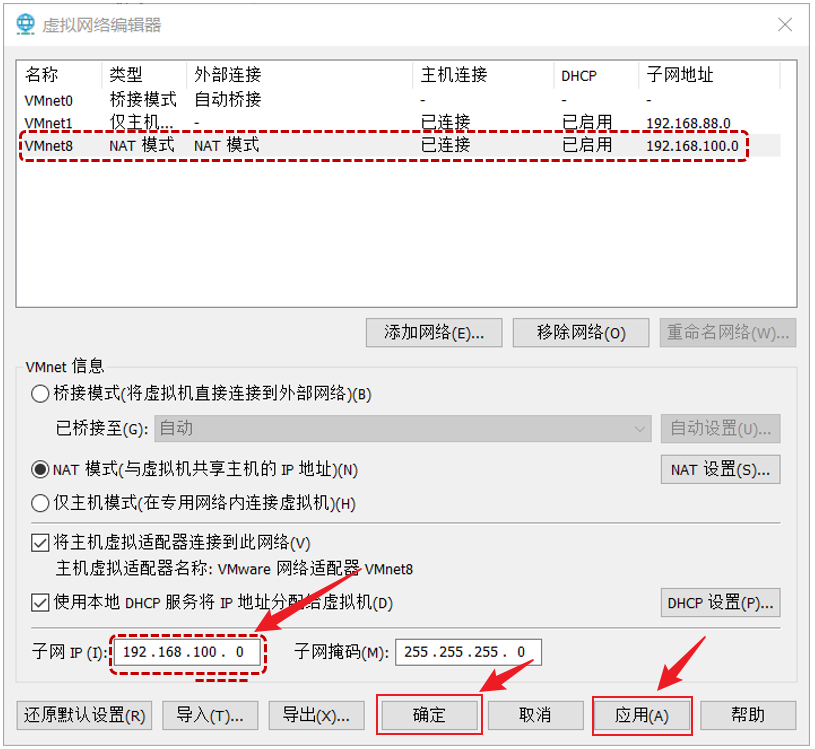

启动过程中，如果出现如下界面，选择 **我已移动该虚拟机**。

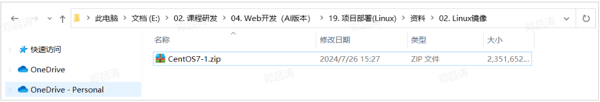

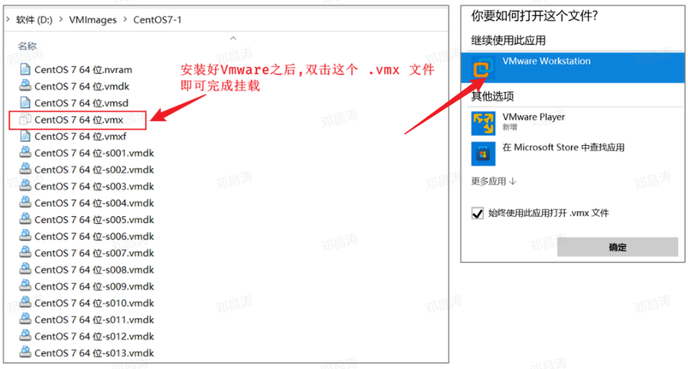

**5）启动完毕之后，登录服务器。**

> 📌 输入用户名：`root`，密码：`1234`（注意：linux 系统输入密码是不显示的，输入完毕，回车即可登录）

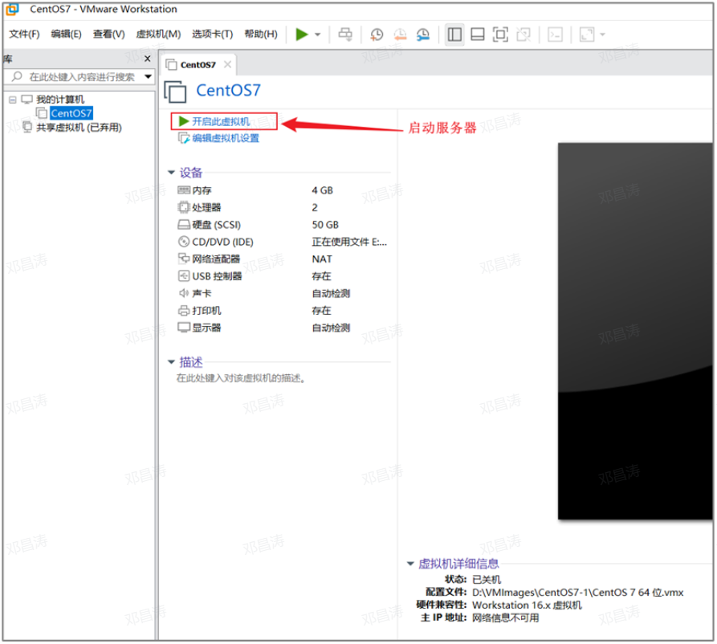

## 1.4 安装 SSH 连接工具

### 1.4.1 SSH 连接工具介绍

Linux 已经安装并且配置好了，接下来我们要来学习 Linux 的基本操作指令。而在学习之前，我们还需要做一件事情，由于我们企业开发时，Linux 服务器一般都是在远程的机房部署的，我们要操作服务器，不会每次都跑到远程的机房里面操作，而是会直接通过 **SSH 连接工具** 进行连接操作。

> ✅ **SSH（Secure Shell）**：建立在应用层基础上的安全协议。

**常用的 SSH 连接工具：**

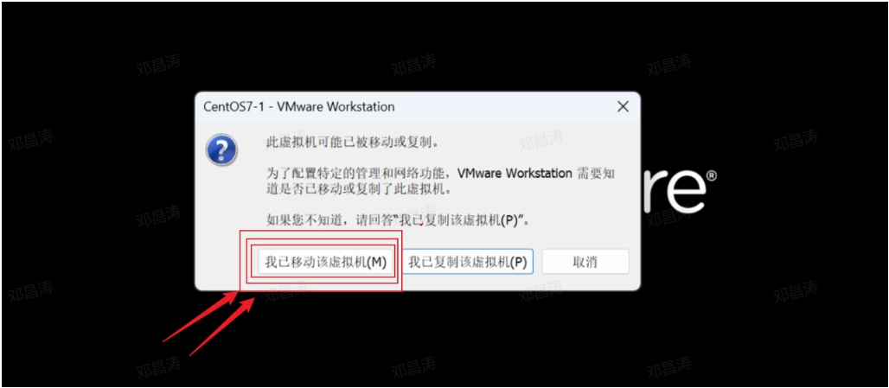

### 1.4.2 FinalShell 安装

在课程资料中，提供了 finalShell 的安装包（`资料/03. 远程连接工具`）。双击 `.exe` 文件，然后进行正常的安装即可。

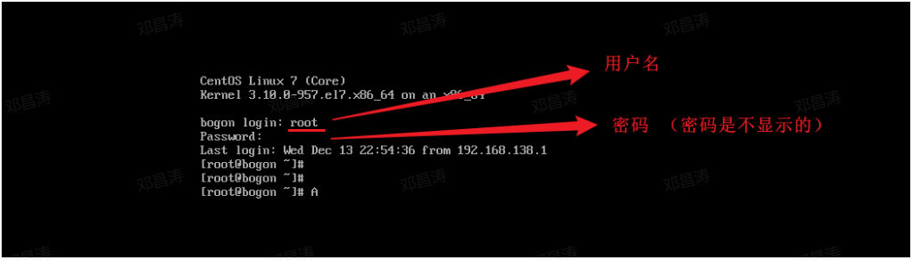

### 1.4.3 连接 Linux

- 打开 FinalShell，选择 SSH 连接。


- 连接服务器，输入服务器的信息，IP 固定的：`192.168.100.128`，用户名：`root`，密码：`1234`

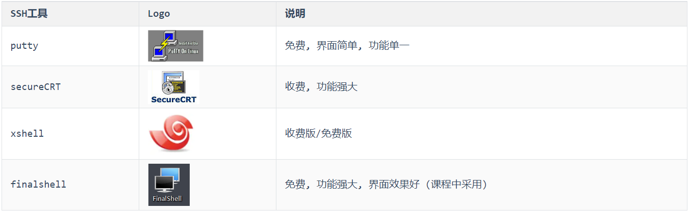

- 配置完毕后，双击即可连接服务器。


## 1.5 目录结构

登录到 Linux 系统之后，我们需要先来熟悉一下 Linux 的目录结构。在 Linux 系统中，也是存在目录的概念的，但是 Linux 的目录结构和 Windows 的目录结构是存在比较多的差异的。在 Windows 目录下，是一个一个的盘符（C 盘、D 盘、E 盘），目录是归属于某一个盘符的。

> 📌 **Linux 系统中的目录有以下特点：**
> - **`/` 是所有目录的顶点**
> - **目录结构像一颗倒挂的树**

**Linux 和 Windows 的目录结构对比：**

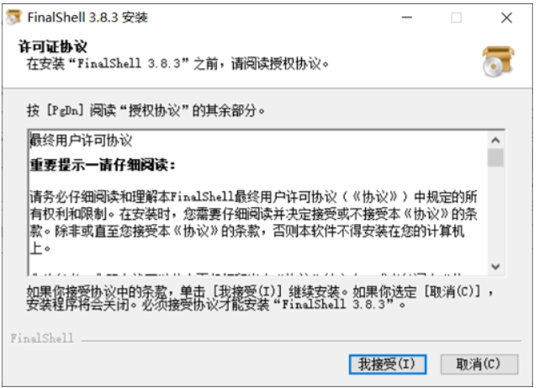

Linux 的目录结构，如下：

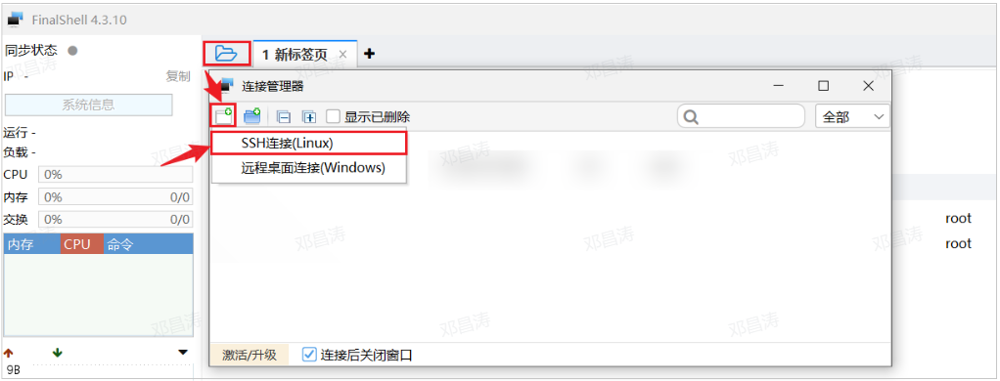

根目录 `/` 下各个目录的作用及含义说明：

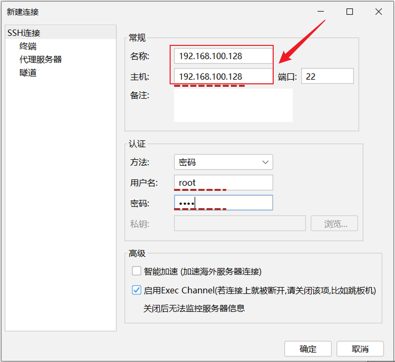

---

# 2. Linux 常用命令

## 2.1 Linux 命令初体验

> ✅ **Linux 命令格式**：`command [-options] [parameter]`

**说明：**

- **`command`**：命令名
- **`[-options]`**：选项，可用来对命令进行控制，也可以省略（可选）
- **`[parameter]`**：参数，可以是零个、一个或多个（可选）

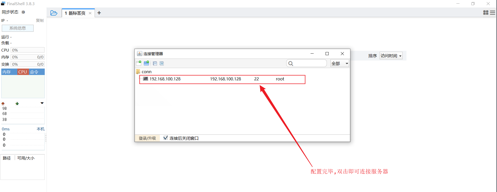

**例如：**

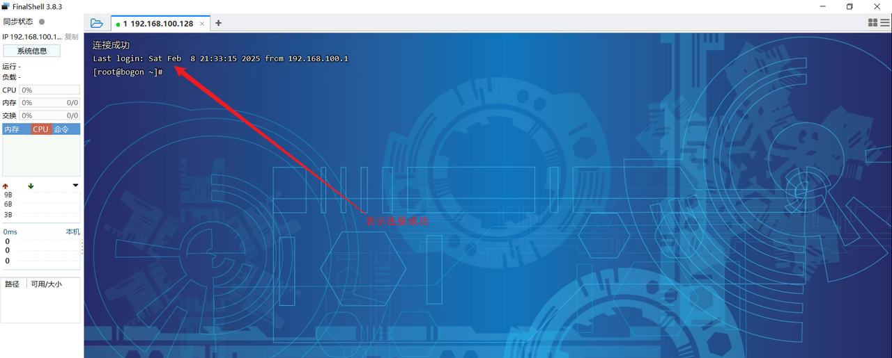

> 💡 **使用技巧：**
> - **Tab 键自动补全**
> - 连续两次 Tab 键，给出操作提示
> - 使用上下箭头快速调出曾经使用过的命令
> - 使用 `clear` 命令或 `Ctrl+l` 快捷键实现 **清屏**

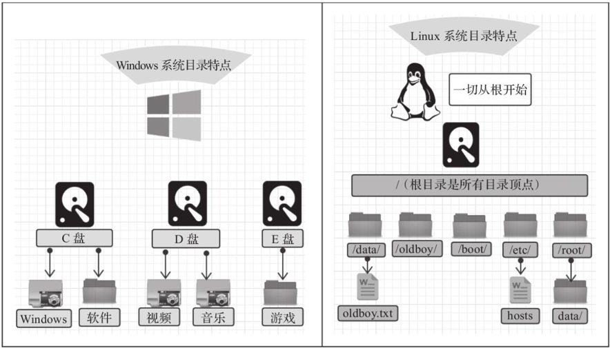

## 2.2 目录操作命令

### 2.2.1 ls

> 💡 **`ls` 命令**
>
> - **作用**：显示指定目录下的内容
> - **语法**：`ls [-al] [dir]`
> - **说明：**
>   - `-a` 显示所有文件及目录（`.` 开头的隐藏文件也会列出）
>   - `-l` 除文件名称外，同时将文件型态（`d` 表示目录，`-` 表示文件）、权限、拥有者、文件大小等信息详细列出
> - **注意**：由于我们使用 ls 命令时经常需要加入 `-l` 选项，所以 Linux 为 `ls -l` 命令提供了一种简写方式，即 **`ll`**

**常见用法：**

| 命令 | 说明 |
| --- | --- |
| `ls -al` | 查看当前目录的所有文件及目录详细信息 |
| `ls -al /etc` | 查看 /etc 目录下所有文件及目录详细信息 |
| `ll` | 查看当前目录文件及目录的详细信息 |

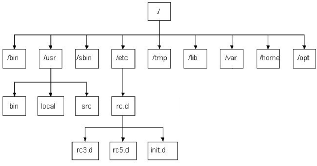

**操作示例：**

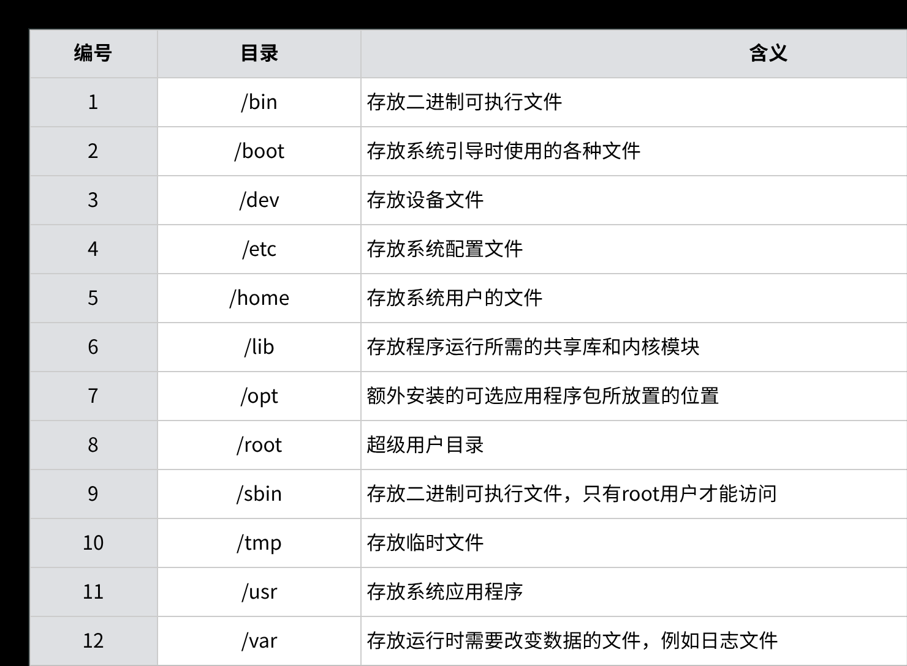

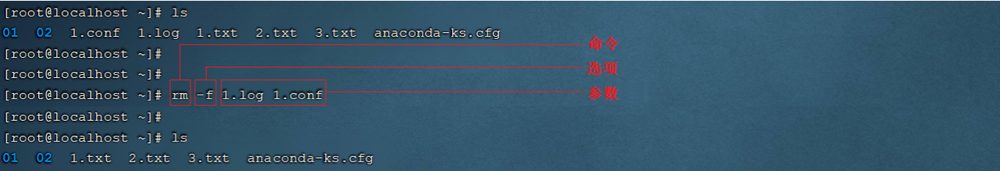

### 2.2.2 cd

> 💡 **`cd` 命令**
>
> - **作用**：用于切换当前工作目录，即进入指定目录
> - **语法**：`cd [dirName]`
> - **特殊说明：**
>   - `~` 表示用户的 home 目录
>   - `.` 表示目前所在的目录
>   - `..` 表示目前目录位置的上级目录

**举例：**

| 命令 | 说明 |
| --- | --- |
| `cd ..` | 切换到当前目录的上级目录 |
| `cd ~` | 切换到用户的 home 目录 |
| `cd /usr/local` | 切换到 /usr/local 目录 |

> 📌 **备注**：用户的 home 目录：
> - root 用户：`/root`
> - 其他用户：`/home/xxx`

**操作示例：**

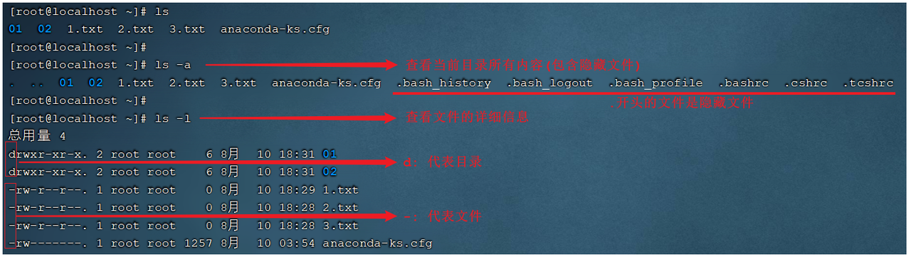

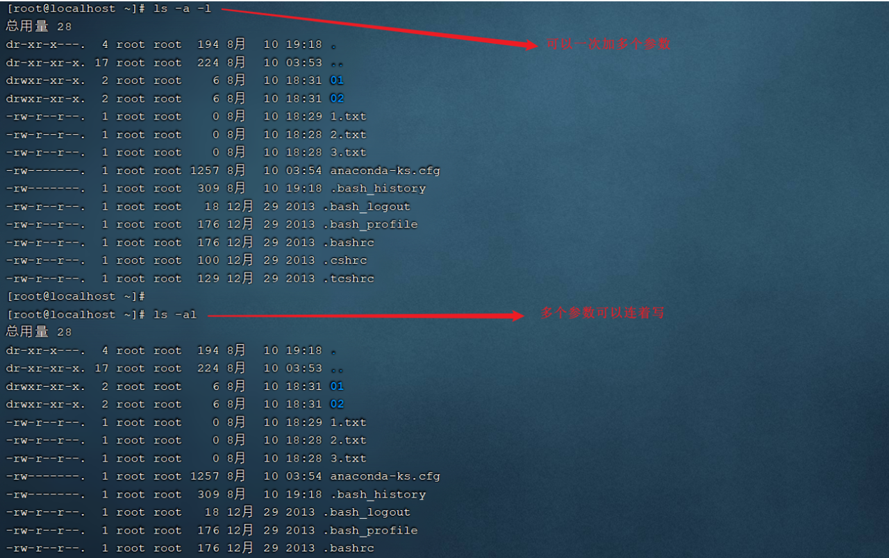

> `cd ..` 切换到当前目录位置的上级目录；可以通过 `cd ../..` 来切换到上级目录的上级目录。

### 2.2.3 mkdir

> 💡 **`mkdir` 命令**
>
> - **作用**：创建目录
> - **语法**：`mkdir [-p] dirName`
> - **说明：**
>   - `-p`：确保目录名称存在，不存在的就创建一个。通过此选项，可以实现多层目录同时创建

**举例：**

| 命令 | 说明 |
| --- | --- |
| `mkdir itcast` | 在当前目录下，建立一个名为 itcast 的子目录 |
| `mkdir -p itcast/test` | 在工作目录下的 itcast 目录中建立一个名为 test 的子目录，若 itcast 目录不存在，则建立一个 |

**操作演示：**

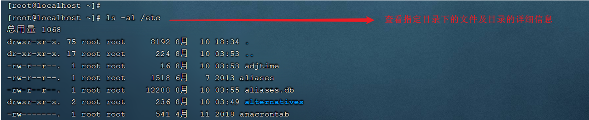

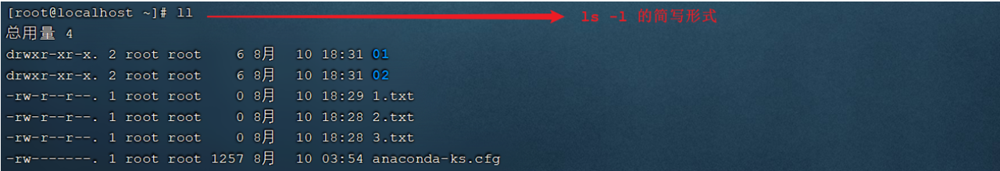

### 2.2.4 rm

> 💡 **`rm` 命令**
>
> - **作用**：删除文件或者目录
> - **语法**：`rm [-rf] name`
> - **说明：**
>   - `-r`：将目录及目录中所有文件（目录）逐一删除，即 **递归删除**
>   - `-f`：无需确认，**直接删除**

**举例：**

| 命令 | 说明 |
| --- | --- |
| `rm -r itcast/` | 删除名为 itcast 的目录和目录中所有文件，删除前需确认 |
| `rm -rf itcast/` | 无需确认，直接删除名为 itcast 的目录和目录中所有文件 |
| `rm -f hello.txt` | 无需确认，直接删除 hello.txt 文件 |

**操作示例：**

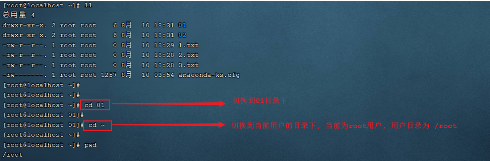

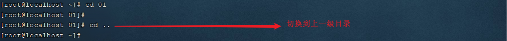

> ⚠️ **注意**：对于 `rm -rf xxx` 这样的指令，在执行的时候，**一定要慎重**，确认无误后再进行删除，**避免误删**。

## 2.3 文件操作命令

### 2.3.1 cat

> 💡 **`cat` 命令**
>
> - **作用**：用于显示文件内容
> - **语法**：`cat [-n] fileName`
> - **说明：**
>   - `-n`：由 1 开始对所有输出的行数编号

**举例：**

- `cat /etc/profile` 查看 /etc 目录下的 profile 文件内容

**操作演示：**

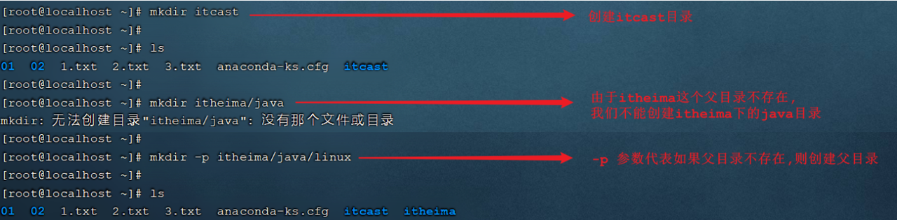

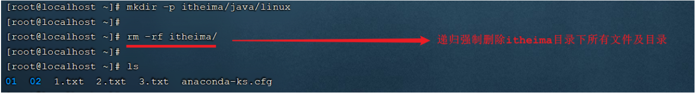

> 📌 cat 指令会一次性查看文件的所有内容，如果文件内容比较多，这个时候查看起来就不是很方便了，这个时候我们可以通过一个新的指令 **more**。

### 2.3.2 more

> 💡 **`more` 命令**
>
> - **作用**：以 **分页** 的形式显示文件内容
> - **语法**：`more fileName`
> - **操作说明：**
>   - **回车键**：向下滚动一行
>   - **空格键**：向下滚动一屏
>   - **`b`**：返回上一屏
>   - **`q` 或 `Ctrl+C`**：退出 more

**举例：**

- `more /etc/profile` 以分页方式显示 /etc 目录下的 profile 文件内容

**操作示例：**

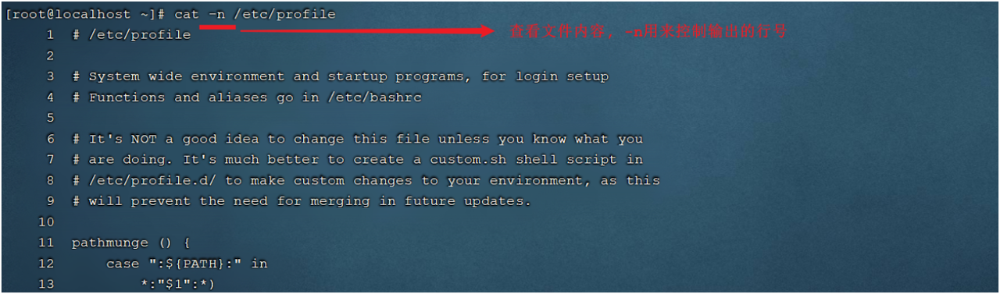

### 2.3.3 head

> 💡 **`head` 命令**
>
> - **作用**：查看文件 **开头** 的内容
> - **语法**：`head [-n] fileName`
> - **说明：**
>   - `-n`：输出文件开头的 n 行内容

**举例：**

| 命令 | 说明 |
| --- | --- |
| `head 1.log` | 默认显示 1.log 文件开头的 **10** 行内容 |
| `head -20 1.log` | 显示 1.log 文件开头的 20 行内容 |

### 2.3.4 tail

> 💡 **`tail` 命令**
>
> - **作用**：查看文件 **末尾** 的内容
> - **语法**：`tail [-f] fileName`
> - **说明：**
>   - `-f`：**动态读取** 文件末尾内容并显示，通常用于日志文件的内容输出

**举例：**

| 命令 | 说明 |
| --- | --- |
| `tail /etc/profile` | 显示 /etc 目录下的 profile 文件末尾 10 行的内容 |
| `tail -20 /etc/profile` | 显示 /etc 目录下的 profile 文件末尾 20 行的内容 |
| `tail -f /itcast/my.log` | 动态读取 /itcast 目录下的 my.log 文件末尾内容并显示 |

**操作示例：**

**A. 默认查询文件尾部 10 行记录**

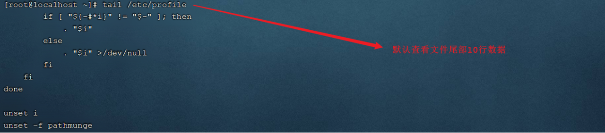

**B. 可以通过指定参数设置查询尾部指定行数的数据**

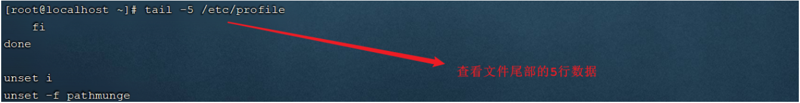

**C. 动态读取文件尾部的数据**

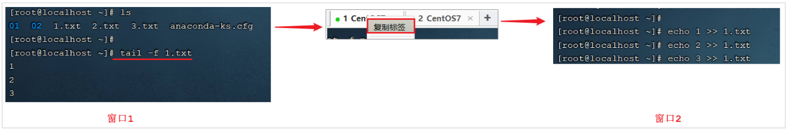

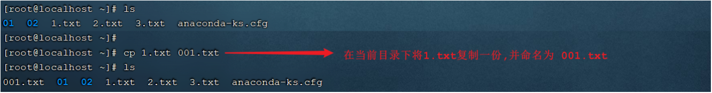

> 在窗口 1 中执行指令 `tail -f 1.txt` 动态查看文件尾部的数据。然后在顶部的标签中右键选择 **"复制标签"**，打开新的窗口 2，此时再新打开的窗口 2 中执行指令 `echo 1 >> 1.txt`，往 1.txt 文件尾部追加内容，然后我们就可以在窗口 1 中看到最新的文件尾部的数据。

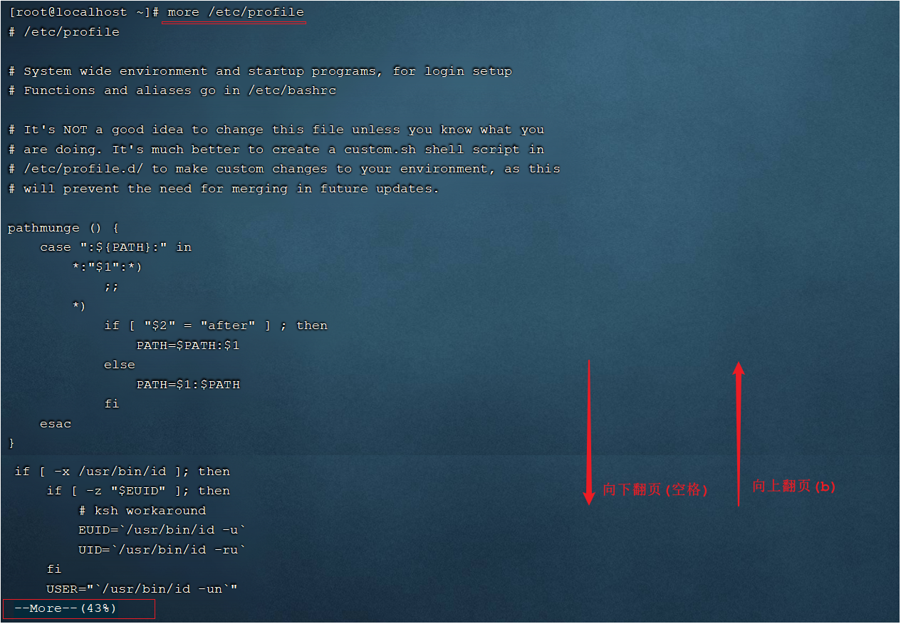

如果我们不想查看文件尾部的数据了，可以直接使用快捷键 **`Ctrl+C`**，结束当前进程。

## 2.4 拷贝移动命令

### 2.4.1 cp

> 💡 **`cp` 命令**
>
> - **作用**：用于 **复制** 文件或目录
> - **语法**：`cp [-r] source dest`
> - **说明：**
>   - `-r`：如果复制的是目录需要使用此选项，此时将复制该目录下所有的子目录和文件

**举例：**

| 命令 | 说明 |
| --- | --- |
| `cp hello.txt itcast/` | 将 hello.txt 复制到 itcast 目录中 |
| `cp hello.txt ./hi.txt` | 将 hello.txt 复制到当前目录，并改名为 hi.txt |
| `cp -r itcast/ ./itheima/` | 将 itcast 目录和目录下所有文件复制到 itheima 目录下 |
| `cp -r itcast/* ./itheima/` | 将 itcast 目录下所有文件复制到 itheima 目录下 |

**操作示例：**

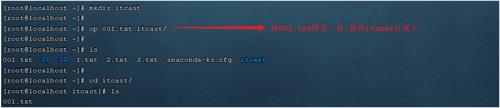

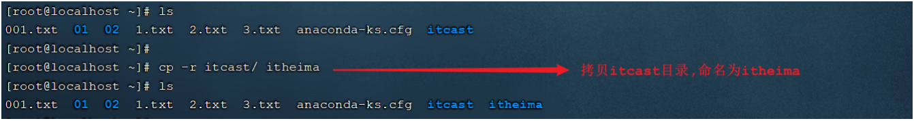

> 📌 如果拷贝的内容是目录，需要加上参数 `-r`

### 2.4.2 mv

> 💡 **`mv` 命令**
>
> - **作用**：为文件或目录 **改名**、或将文件或目录 **移动** 到其它位置
> - **语法**：`mv source dest`

**举例：**

| 命令 | 说明 |
| --- | --- |
| `mv hello.txt hi.txt` | 将 hello.txt 改名为 hi.txt |
| `mv hi.txt itheima/` | 将文件 hi.txt 移动到 itheima 目录中 |
| `mv hi.txt itheima/hello.txt` | 将 hi.txt 移动到 itheima 目录中，并改名为 hello.txt |
| `mv itcast/ itheima/` | 如果 itheima 目录不存在，将 itcast 目录改名为 itheima |
| `mv itcast/ itheima/` | 如果 itheima 目录存在，将 itcast 目录移动到 itheima 目录中 |

**操作示例：**

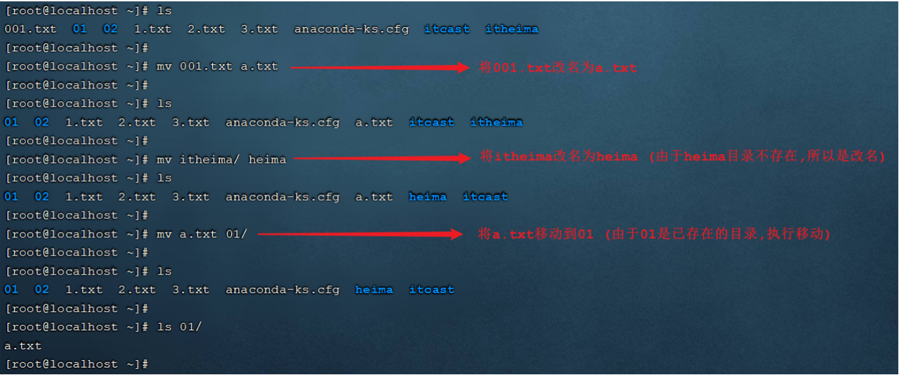

> 📌 `mv` 命令既能够改名，又可以移动，具体是改名还是移动，系统会根据我们输入的参数进行判定（**如果第二个参数 dest 是一个已存在的目录，将执行移动操作，其他情况都是改名**）

## 2.5 打包压缩命令

> 💡 **`tar` 命令**
>
> - **作用**：对文件进行 **打包、解包、压缩、解压**
> - **语法**：`tar [-zcxvf] fileName [files]`
>   - 包文件后缀为 `.tar` 表示只是完成了 **打包**，并没有压缩
>   - 包文件后缀为 `.tar.gz` 表示打包的同时还进行了 **压缩**
> - **说明：**
>   - **`-z`**：z 代表的是 gzip，通过 gzip 命令处理文件，gzip 可以对文件压缩或者解压
>   - **`-c`**：c 代表的是 create，即创建新的包文件
>   - **`-x`**：x 代表的是 extract，实现从包文件中还原文件
>   - **`-v`**：v 代表的是 verbose，显示命令的执行过程
>   - **`-f`**：f 代表的是 file，用于指定包文件的名称

**举例：**

**打包：**

| 命令 | 说明 |
| --- | --- |
| `tar -cvf hello.tar ./*` | 将当前目录下所有文件打包，打包后的文件名为 hello.tar |
| `tar -zcvf hello.tar.gz ./*` | 将当前目录下所有文件打包并压缩，打包后的文件名为 hello.tar.gz |

**解包：**

| 命令 | 说明 |
| --- | --- |
| `tar -xvf hello.tar` | 将 hello.tar 文件进行解包，并将解包后的文件放在当前目录 |
| `tar -zxvf hello.tar.gz` | 将 hello.tar.gz 文件进行解压，并将解压后的文件放在当前目录 |
| `tar -zxvf hello.tar.gz -C /usr/local` | 将 hello.tar.gz 文件进行解压，并将解压后的文件放在 /usr/local 目录 |

**操作示例：**

**A. 打包**

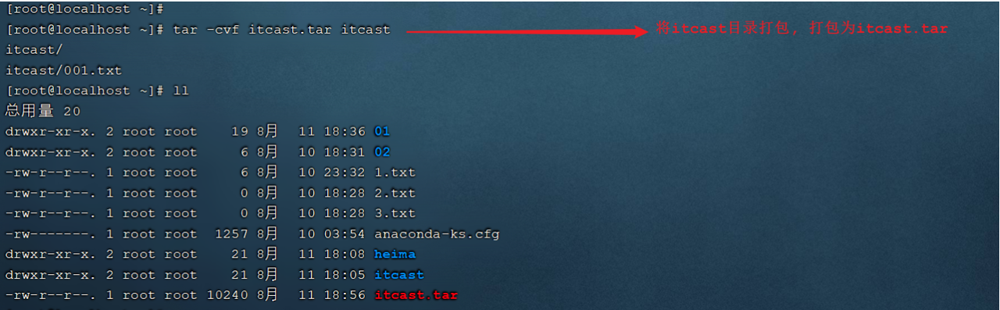

**B. 打包并压缩**

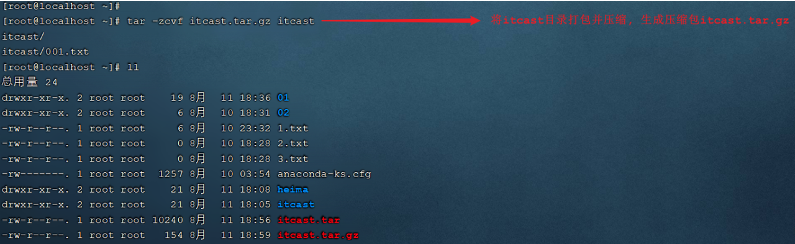

**C. 解包**

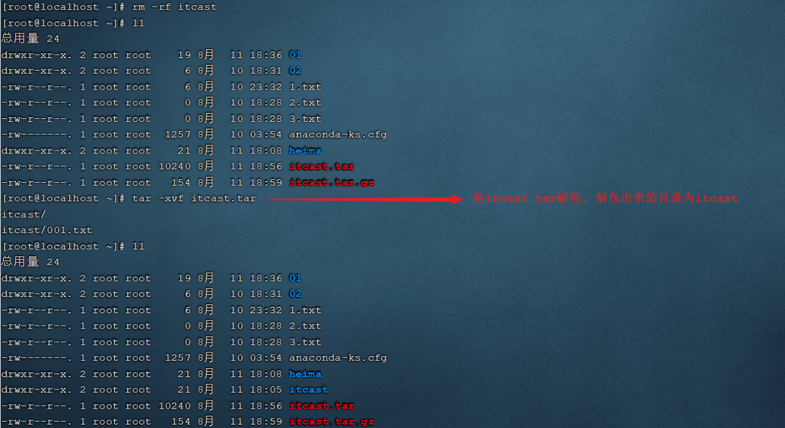

**D. 解压**

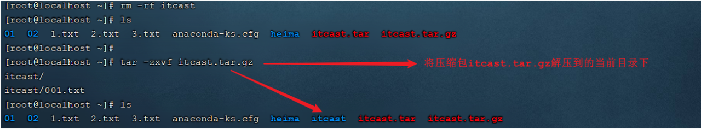

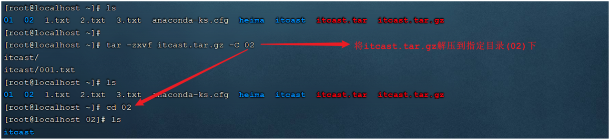

> 📌 解压到指定目录，需要加上参数 **`-C`**

## 2.6 文本编辑命令

文本编辑的命令，主要包含两个：`vi` 和 `vim`，两个命令的用法类似，我们课程中主要讲解 **vim** 的使用。

### 2.6.1 vi & vim 介绍

- **作用**：vi 命令是 Linux 系统提供的一个文本编辑工具，可以对文件内容进行编辑，类似于 Windows 中的记事本
- **语法**：`vi fileName`
- **说明：**
  - **vim 是从 vi 发展来的一个功能更加强大的文本编辑工具**，编辑文件时可以对文本内容进行着色，方便我们对文件进行编辑处理，所以实际工作中 vim 更加常用。
  - 要使用 vim 命令，需要我们自己完成安装。可以使用下面的命令来完成安装：`yum install vim`

### 2.6.2 vim 安装

**命令**：`yum install vim`

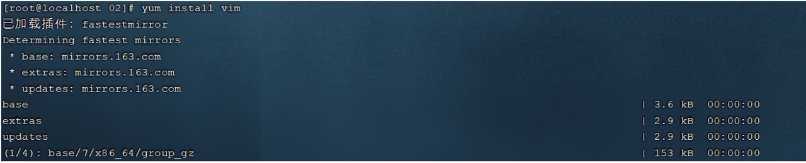

安装过程中，会有确认提示，此时输入 `y`，然后回车，继续安装：

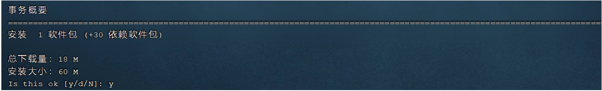

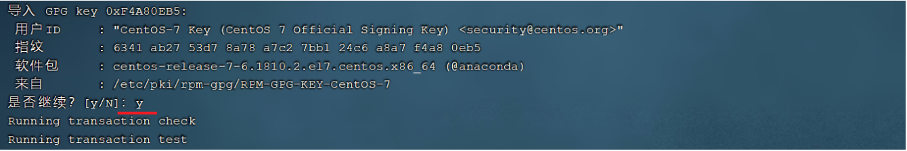

### 2.6.3 vim 使用

- **作用**：对文件内容进行编辑，vim 其实就是一个文本编辑器
- **语法**：`vim fileName`
- **说明：**
  - 在使用 vim 命令编辑文件时，如果指定的文件存在则直接打开此文件。如果指定的文件不存在则新建文件。
  - vim 在进行文本编辑时共分为 **三种模式**，分别是 **命令模式（Command mode），插入模式（Insert mode）和底行模式（Last line mode）**。这三种模式之间可以相互切换。

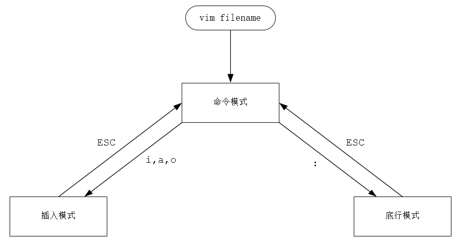

> 📌 **三种模式：**

**◦ 命令模式**

- A. 命令模式下可以查看文件内容、移动光标（上下左右箭头、gg、G）
- B. 通过 vim 命令打开文件后，**默认进入命令模式**
- C. 另外两种模式需要首先进入命令模式，才能进入彼此

| 命令模式指令 | 含义 |
| --- | --- |
| `gg` | 定位到文本内容的第一行 |
| `G` | 定位到文本内容的最后一行 |
| `dd` | 删除光标所在行的数据 |
| `ndd` | 删除当前光标所在行及之后的 n 行数据 |
| `u` | 撤销操作 |
| `i` 或 `a` 或 `o` | 进入插入模式（进入后光标所处的位置不同而已） |

**◦ 插入模式**

- A. 插入模式下可以对文件内容进行编辑
- B. 在命令模式下按下 `i, a, o` 任意一个，可以进入插入模式。进入插入模式后，下方会出现 **【insert】** 字样
- C. 在插入模式下按下 **`ESC`** 键，回到命令模式

**◦ 底行模式**

- A. 底行模式下可以通过命令对文件内容进行查找、显示行号、退出等操作
- B. 在命令模式下按下 `:, /` 任意一个，可以进入底行模式
- C. 通过 `/` 方式进入底行模式后，可以对文件内容进行查找
- D. 通过 `:` 方式进入底行模式后，可以输入 `wq`（保存并退出）、`q!`（不保存退出）、`set nu`（显示行号）

| 底行模式指令 | 含义 |
| --- | --- |
| `:wq` | 保存并退出 |
| `:q!` | 不保存退出 |
| `:set nu` | 显示行号 |
| `:set nonu` | 取消行号显示 |
| `:n` | 定位到第 n 行，如 `:10` 就是定位到第 10 行 |

## 2.7 查找命令

### 2.7.1 find

> 💡 **`find` 命令**
>
> - **作用**：在指定目录下查找文件
> - **语法**：`find dirName -option fileName`

**举例：**

| 命令 | 说明 |
| --- | --- |
| `find . –name "*.java"` | 在当前目录及其子目录下查找 .java 结尾的文件 |
| `find /itcast -name "*.java"` | 在 /itcast 目录及其子目录下查找 .java 结尾文件 |

**操作示例：**

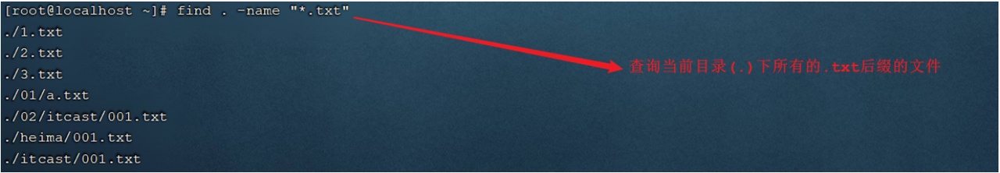

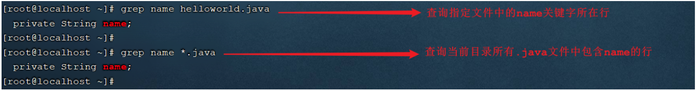

### 2.7.2 grep

> 💡 **`grep` 命令**
>
> - **作用**：从指定文件中查找指定的文本内容
> - **语法**：`grep word fileName`
> - **选项：**
>   - **`-i`**：检索的关键字忽略（ignore）大小写
>   - **`-n`**：显示关键字所在的这一行的行号
>   - **`-A`**：输出关键字所在行及之后（After）的几行记录（如：`-A5` 表示输出关键字所在行之后的 5 行记录）
>   - **`-B`**：输出关键字所在行及之前（Before）的几行记录（如：`-B5` 表示输出关键字所在行之前的 5 行记录）

**举例：**

| 命令 | 说明 |
| --- | --- |
| `grep Hello HelloWorld.java` | 查找 HelloWorld.java 文件中出现的 Hello 字符串的位置 |
| `grep hello *.java` | 查找当前目录中所有 .java 结尾的文件中包含 hello 字符串的位置 |

**操作示例：**

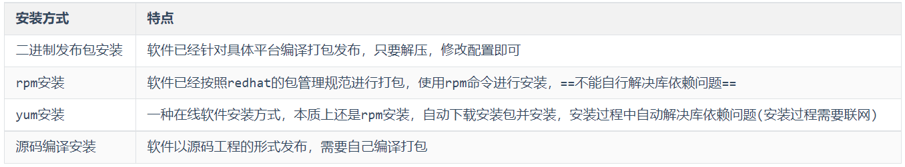


---

# 3. 软件安装

## 3.1 软件安装方式

在 Linux 系统中，安装软件的方式主要有四种，这四种安装方式的特点如下：

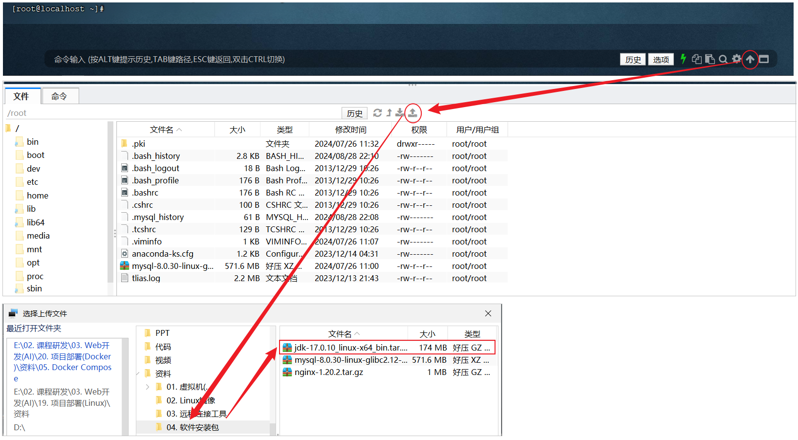

## 3.2 安装 JDK

上述我们介绍了 Linux 系统软件安装的四种形式，接下来我们就通过 **第一种（二进制发布包）形式** 来安装 JDK。JDK 对应的二进制发布包，在课程资料中已经提供。

**JDK 具体安装步骤如下：**

**1）上传安装包**

使用 FinalShell 自带的上传工具将 jdk 的二进制发布包上传到 Linux

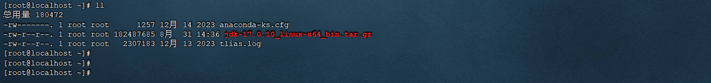

由于上述在进行文件上传时，选择的上传目录 `/root`，上传完毕后，我们执行指令 `cd /root` 切换到根目录下，查看上传的安装包。

**2）解压安装包**

执行如下指令，将上传上来的压缩包进行解压，并通过 `-C` 参数指定解压文件存放目录为 `/usr/local`。

```bash
tar -zxvf jdk-21_linux-x64_bin.tar.gz -C /usr/local/
```

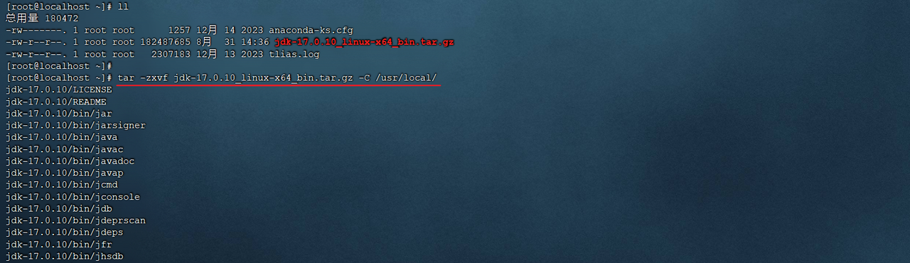

**3）配置环境变量**

使用 vim 命令修改 `/etc/profile` 文件，在文件末尾加入如下配置

```bash
export JAVA_HOME=/usr/local/jdk-17.0.10
export PATH=$JAVA_HOME/bin:$PATH
```

**具体操作指令如下：**

```bash
# 1). 编辑 /etc/profile 文件，进入命令模式
vim /etc/profile

# 2). 在命令模式中，输入指令 G ，切换到文件最后
G

# 3). 在命令模式中输入 i/a/o 进入插入模式，然后切换到文件最后一行
i

# 4). 将上述的配置拷贝到文件中
export JAVA_HOME=/usr/local/jdk-17.0.10
export PATH=$JAVA_HOME/bin:$PATH

# 5). 从插入模式，切换到指令模式
ESC

# 6). 按:进入底行模式，然后输入wq，回车保存
:wq
```

**4）重新加载 profile 文件**

为了使更改的配置立即生效，需要重新加载 profile 文件，执行命令：

```bash
source /etc/profile
```

**5）检查安装是否成功**

```bash
java -version
```

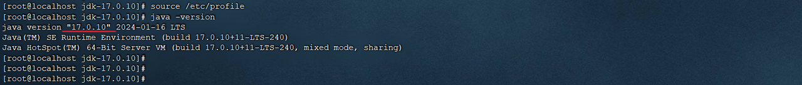

## 3.3 安装 MySQL

### 3.3.1 MySQL 安装

对于 MySQL 数据库的安装，我们将要使用前面讲解的 **第一种安装方式** 进行安装。

**1）准备工作**

在安装 MySQL 数据库之前，我们需要先检查一下当前 Linux 系统中，是否安装的有 MySQL 的相关服务（很多 linux 安装完毕之后，自带了低版本的 mysql 的依赖包），如果有，先需要卸载掉，然后再进行安装。

**A. 通过 rpm 相关指令，来查询当前系统中是否存在已安装的 mysql 软件包，执行指令如下：**

| 命令 | 说明 |
| --- | --- |
| `rpm -qa` | 查询当前系统中安装的所有软件 |
| `rpm -qa \| grep mysql` | 查询当前系统中安装的名称带 mysql 的软件 |
| `rpm -qa \| grep mariadb` | 查询当前系统中安装的名称带 mariadb 的软件 |

> 通过 `rpm -qa` 查询到系统通过 rpm 安装的所有软件，太多了，不方便查看，所以我们可以通过 **管道符 `|`** 配合着 grep 进行过滤查询。

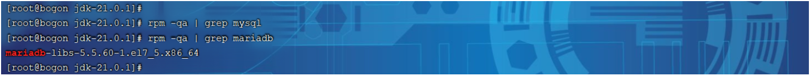

通过查询，我们发现在当前系统中存在 mariadb 数据库，是 CentOS7 中自带的，而这个数据库和 MySQL 数据库是冲突的，所以要想保证 MySQL 成功安装，需要卸载 mariadb 数据库。

> 💡 **RPM**：全称为 **Red-Hat Package Manager**，RPM 软件包管理器，是红帽 Linux 用于管理和安装软件的工具。

**B. 通过 rpm 相关指令，来卸载对应的组件，执行指令如下：**

在 rpm 中，卸载软件的语法为：`rpm -e --nodeps 软件名称`

那么，我们就可以通过指令，卸载 mariadb，具体指令为：`rpm -e --nodeps mariadb-libs-5.5.60-1.el7_5.x86_64`

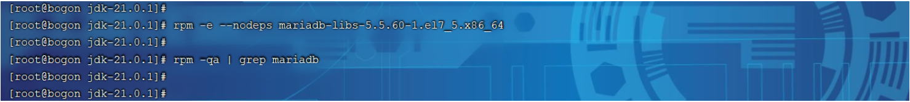

我们看到执行完毕之后，再次查询 mariadb，就查不到了，因为已经被成功卸载了。


**2）将资料中提供的 MySQL 安装包上传到 Linux 并解压**

**A. 上传 MySQL 安装包**

在课程资料中，提供的有 MySQL 的安装包，我们需要将该安装包上传到 Linux 系统的根目录 `/root` 下面。

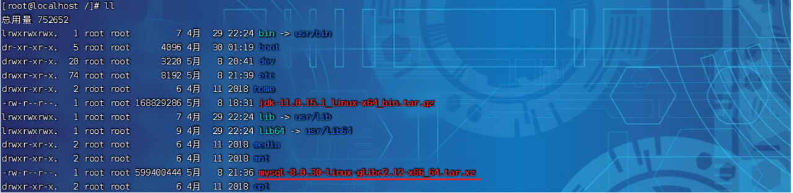

**B. 解压到 当前目录**

执行如下指令：

```bash
tar -xvf mysql-8.0.30-linux-glibc2.12-x86_64.tar.xz
```

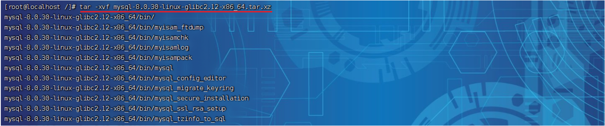

**C. 将解压后的文件夹移动到 `/usr/local` 目录下，并改名为 `mysql`**

```bash
mv mysql-8.0.30-linux-glibc2.12-x86_64 /usr/local/mysql

cd /usr/local/mysql
```

**3）配置系统环境变量**

配置 MySQL 的环境变量，通过 vi 编辑器编辑 `/etc/profile` 文件，在尾部追加：

```bash
export MYSQL_HOME=/usr/local/mysql
export PATH=$MYSQL_HOME/bin:$PATH
```

**4）注册 MySQL 为系统服务**

并执行如下指令，注册 MySQL 为系统服务：

```bash
cp /usr/local/mysql/support-files/mysql.server /etc/init.d/mysql
chkconfig --add mysql
```

**5）初始化数据库**

```bash
# 创建一个用户组, 组名就叫 mysql
groupadd mysql

# 创建一个系统用户 mysql, 并归属于用户组 mysql
useradd -r -g mysql -s /bin/false mysql
```

```bash
# 初始化 mysql
mysqld --initialize --user=mysql --basedir=/usr/local/mysql --datadir=/usr/local/mysql/data
```

执行上述指令时，会输入如下日志，在日志中就输出了 MySQL 中 root 用户的一个 **临时密码**【记得复制出来，记录下来】：

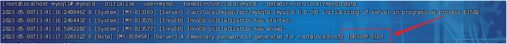

### 3.3.2 启动 MySQL

**A. 启动 MySQL 服务**

```bash
systemctl start mysql
```

**B. 通过命令，登录 MySQL**

```bash
# xxxxx 代表上述生成的 root 的临时密码
mysql -uroot -pxxxxx
```

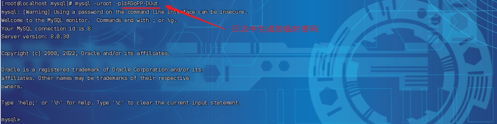

### 3.3.3 配置 MySQL

**A. 修改 root 用户的密码**

```sql
ALTER USER 'root'@'localhost' IDENTIFIED WITH mysql_native_password BY '1234';
```

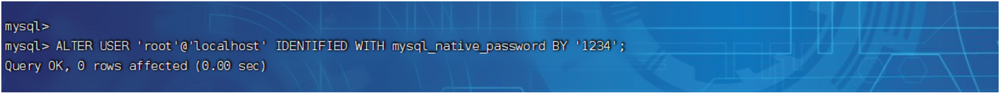

> 📌 **注意**：这个 root 账号仅仅能够在本机 localhost 上访问，我们在 windows 上是无法访问的。如果需要在 window 上或其他服务器上也能远程访问，需要创建一个账号，用于远程访问的。

**B. 创建账号，并授权远程访问**

```sql
CREATE USER 'root'@'%' IDENTIFIED BY '1234';

GRANT ALL PRIVILEGES ON *.* TO 'root'@'%';

FLUSH PRIVILEGES;
```

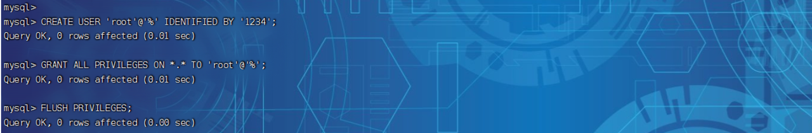

我们已经开启了 MySQL 的远程访问的权限，为什么还是连接不上 MySQL 服务器呢？？这是因为 Linux 系统的 **防火墙**，将我们的访问拦截了。

### 3.3.4 防火墙操作

Linux 系统安装完毕后，系统启动时，防火墙自动启动，防火墙拦截了所有端口的访问。接下来我们就需要学习一下，如何操作防火墙，具体指令如下：

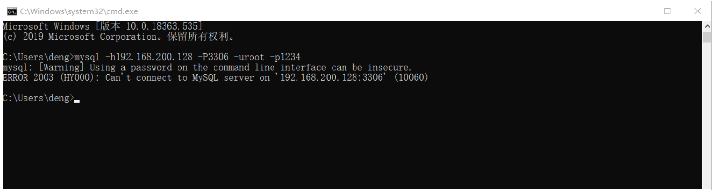

> 📌 **注意**：要想在 windows 上能够访问 MySQL，需要 **开放防火墙的 3306 端口** 或者 **直接关闭防火墙**，执行如下指令：

```bash
# 开放防火墙的 3306 端口号
firewall-cmd --zone=public --add-port=3306/tcp --permanent

# 重新加载
firewall-cmd --reload

# 查看开放的端口号
firewall-cmd --zone=public --list-ports
```

或者直接关闭防火墙：

```bash
systemctl stop firewalld
```

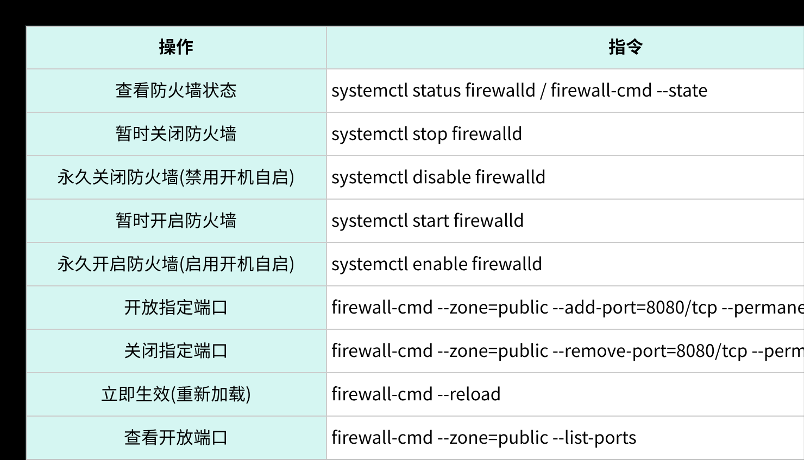

### 3.3.5 连接测试

关闭掉 linux 系统的防火墙之后，我们就可以打开 windows 上的命令行，通过 mysql 的客户端（命令行/图形化界面）来连接远程 linux 上安装的 MySQL 数据库了。

**1）客户端连接**

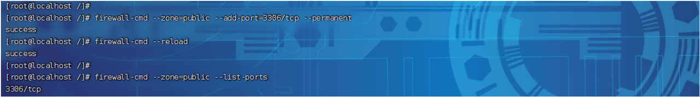

**2）打开 DataGrip 图形化工具连接**

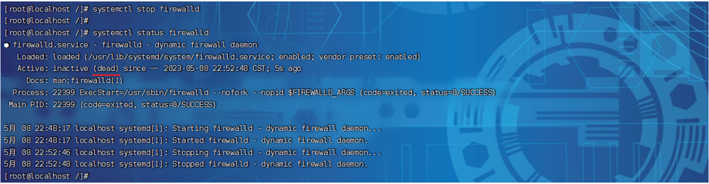

执行资料中提供的 SQL 脚本 `tlias.sql`。

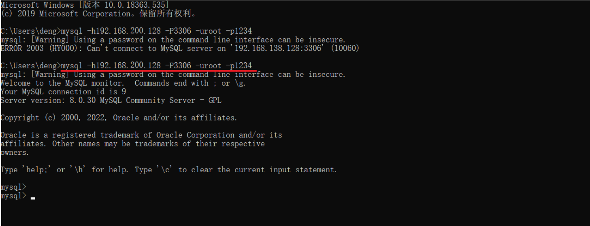

## 3.4 安装 Nginx

### 3.4.1 安装

Nginx 的安装包，从官方下载下来的是 c 语言的源码包，我们需要自己编译安装。具体操作步骤如下：

**1）安装 Nginx 运行时需要的依赖**

```bash
yum install -y pcre pcre-devel zlib zlib-devel openssl openssl-devel
```

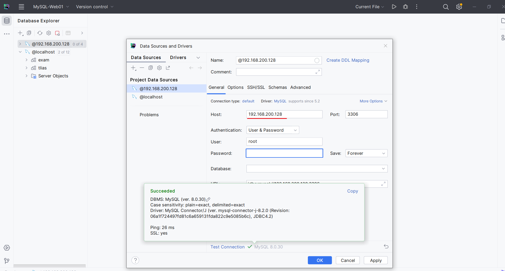

安装 C 语言的编译环境：

```bash
yum install gcc-c++
```

**2）上传 Nginx 的源码包**

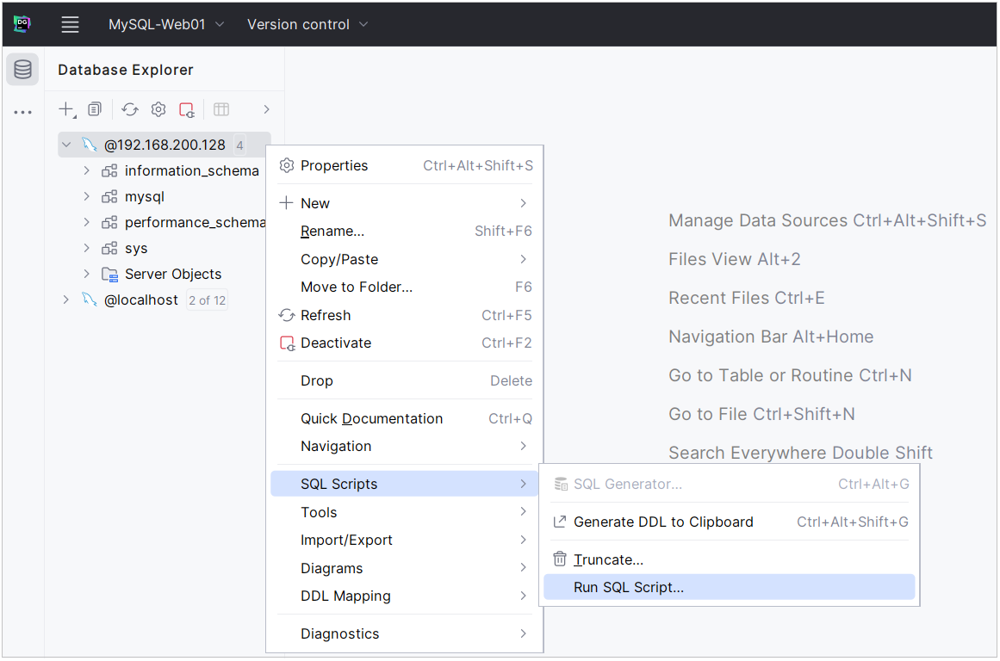

**3）解压源码包到当前目录**

```bash
tar -zxvf nginx-1.20.2.tar.gz
```

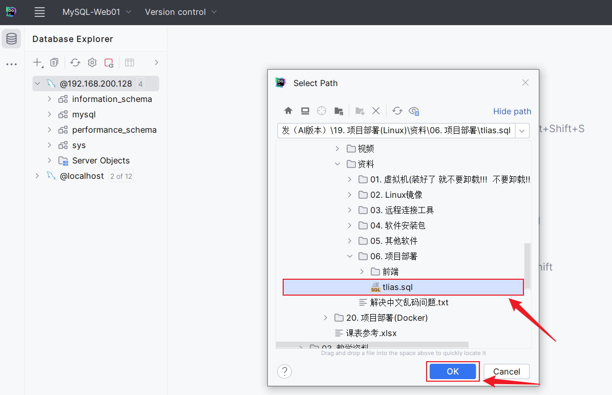

**4）进入到解压目录后，执行指令**

```bash
# 进入解压目录
cd nginx-1.20.2

# 执行命令配置, 生成 Makefile 文件
./configure --prefix=/usr/local/nginx
```

**5）执行命令进行编译和安装**

```bash
# 编译
make

# 编译安装
make install
```

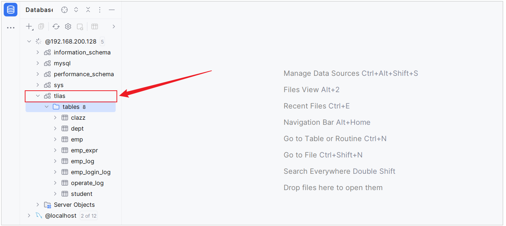

### 3.4.2 启动 Nginx

进入到 nginx 安装目录 `/usr/local/nginx`，启动 nginx 服务

```bash
cd /usr/local/nginx/
sbin/nginx
```


启动完毕之后，我们可以通过 `ps` 指令查询当前系统中的 nginx 进程，从而确认 nginx 是否启动。

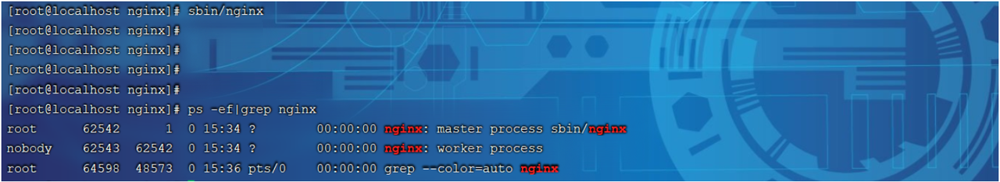

然后，我们就可以打开浏览器，访问服务器上的 nginx。

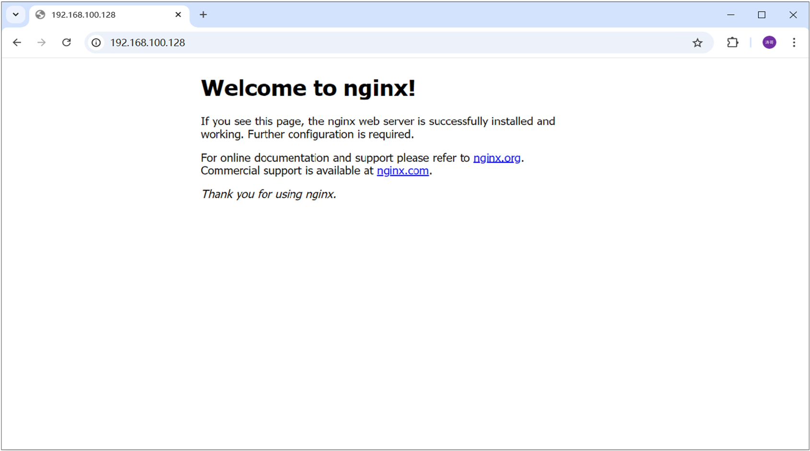

---

# 4. 项目部署

## 4.1 前端项目部署

**1）将 nginx 的安装目录的 html 中的静态资源文件先删除掉。**

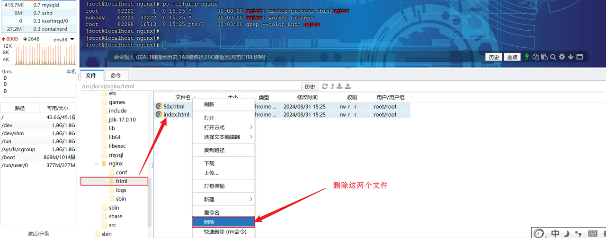

**2）将资料中提供的 "资料/06. 项目部署/前端/页面资源" 目录下的静态资源文件，全部上传到 nginx 安装目录下的 `html` 目录中。**

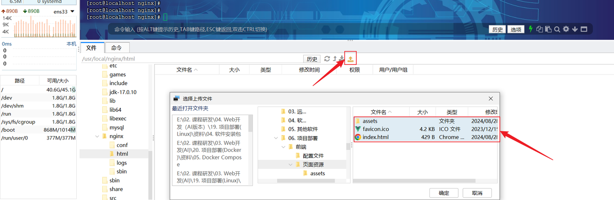

**3）修改资料中提供的 `nginx.conf` 配置文件，将其上传到 nginx 安装目录下的 `conf` 目录中。**

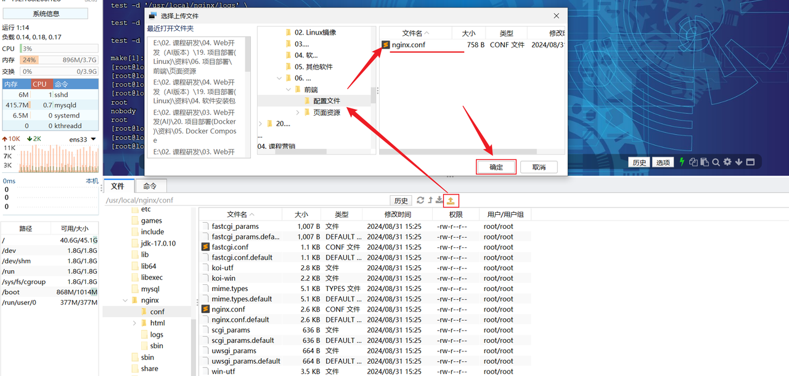

**4）重新加载 nginx 服务的配置文件**

```bash
# 重新加载配置文件
sbin/nginx -s reload
```

**5）再次访问 nginx（可能会存在浏览器缓存，可以按 `Ctrl+F5`，强制刷新清理缓存）**

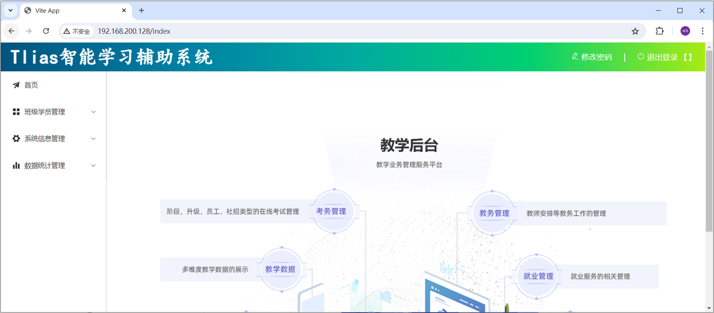

> 💡 **nginx 服务常见操作指令：**
> - **启动**：`sbin/nginx`
> - **重载**：`sbin/nginx -s reload`
> - **停止**：`sbin/nginx -s stop`

## 4.2 后端项目部署

之前我们讲解 Linux 操作系统时，就提到，我们服务端开发工程师学习 Linux 系统的目的就是 **将来我们开发的项目绝大部分情况下都需要部署在 Linux 系统中**。

### 4.2.1 环境准备

那现在，项目要上线了，要部署到 linux 服务器上，我们也需要使用 linux 服务器上所安装的 mysql 数据库。

那此时，我们就可以再准备一份文件 `application.yml` 将里面的配置的 mysql 的 ip 地址及相关配置信息修改一下（配置 Linux 上安装的 MySQL 的信息）：

```yml
#配置数据库连接信息
spring:
  datasource:
    driver-class-name: com.mysql.cj.jdbc.Driver
    url: jdbc:mysql://192.168.100.128:3306/tlias
    username: root
    password: 1234
  servlet:
    multipart:
      max-file-size: 10MB         #单个文件最大大小限制 10MB
      max-request-size: 100MB     #单个请求最大大小限制 100MB

#配置 mybatis 的日志输出到控制台
mybatis:
  configuration:
    log-impl: org.apache.ibatis.logging.stdout.StdOutImpl
    #配置 mybatis 的驼峰命名的映射开关
    map-underscore-to-camel-case: true

#查看事务管理的日志
logging:
  level:
    org.springframework.jdbc.support.JdbcTransactionManager: debug

#阿里云 oss 配置
aliyun:
  oss:
    endpoint: https://oss-cn-beijing.aliyuncs.com
    bucketName: java422-web-ai
```

> 改造完毕之后，可以在本地的 idea 中先启动当前项目，然后访问一下，看看工程是否正常访问。

### 4.2.2 打包部署

**1）执行 `package` 指令，进行打包操作，将当前的 springboot 项目，打成一个 jar 包。（跳过测试）**

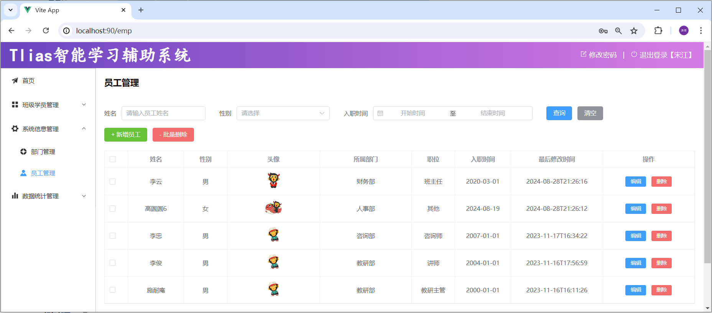

**2）在 Linux 服务器上创建一个目录，将 jar 包上传到服务器。**

```bash
mkdir -p /usr/local/app
```

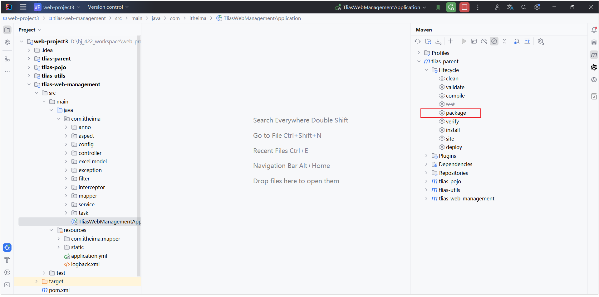

**3）通过 java 命令，启动项目**

```bash
# 进入目录 /usr/local/app
cd /usr/local/app

# 运行 jar 包
java -jar tlias-web-management-0.0.1-SNAPSHOT.jar
```

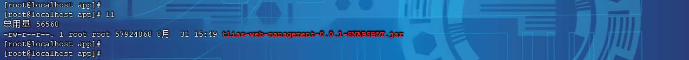

项目启动起来之后，就可以打开浏览器测试啦。

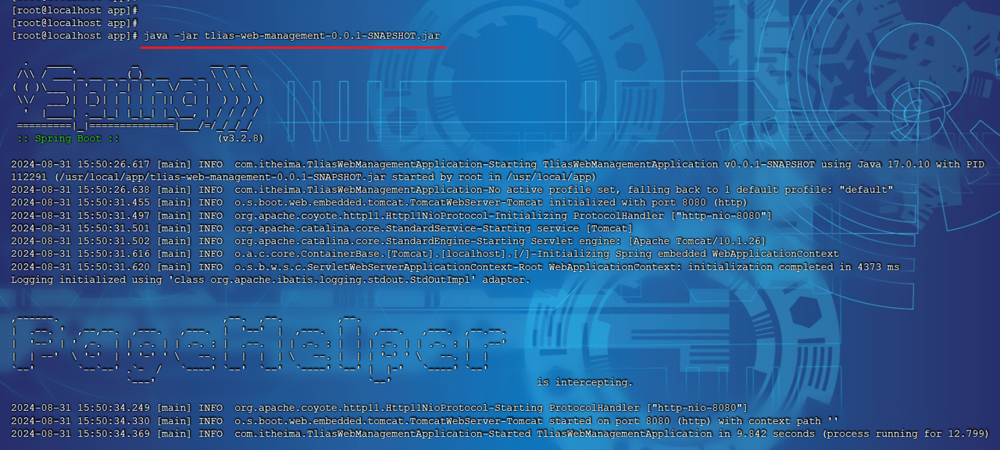

### 4.2.3 阿里云 OSS 秘钥配置

由于在开发的时候，我们将访问阿里云 OSS 的 `AccessKeyId`，`AccessKeySecret` 都配置在了系统的环境变量中了。那现在项目部署到了 Linux 服务器中，调用阿里云 OSS 进行文件上传时，程序就会获取 Linux 系统中的环境变量。所以此时，我们需要将 `AccessKeyId`，`AccessKeySecret` 配置为 Linux 系统的环境变量。

**1）查看 Windows 系统之前配置的环境变量**

```cmd
echo %OSS_ACCESS_KEY_ID%

echo %OSS_ACCESS_KEY_SECRET%
```

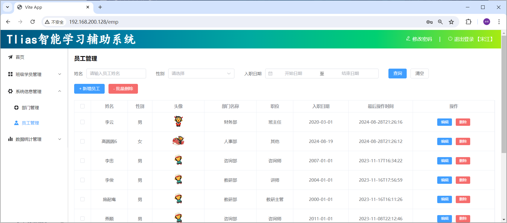

我们将上述自己的 AccessKeyId 与 AccessKeySecret 复制出来，然后在 linux 系统中配置环境变量。

**2）执行如下指令：**

```bash
echo "export OSS_ACCESS_KEY_ID=your-access-key-id" >> /etc/profile

echo "export OSS_ACCESS_KEY_SECRET=your-access-key-secret" >> /etc/profile

source /etc/profile
```

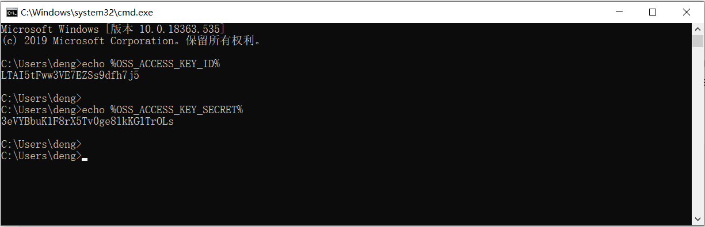

> ⚠️ **注意!!!**：上述的绿色背景部分，是自己的阿里云 OSS 账号的 `OSS_ACCESS_KEY_ID`，`OSS_ACCESS_KEY_SECRET`，**一个字符都不能错**，在记事本中将命令组装好，然后再到命令行中执行。

执行完毕后，将 finalShell 的窗口关闭掉，重新打开一个新窗口（让环境变量生效），重新运行项目测试。

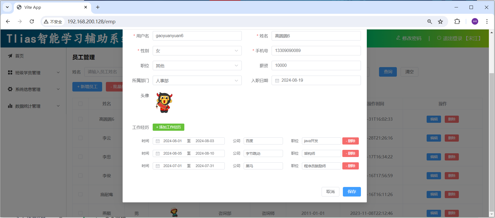

> 📌 **当前程序中存在的问题：**
> - 线上程序不会采用 **控制台霸屏** 的形式运行程序，而是将程序在 **后台运行**
> - 线上程序不会将日志输出到控制台，而是 **输出到日志文件**，方便运维查阅信息

要解决上述这两个问题，我们就可以通过 **`nohup` 指令** 让程序在后台运行。

### 4.2.4 后台运行

**1）后台运行程序**

```bash
nohup java -jar tlias-web-management-0.0.1-SNAPSHOT.jar &> tlias.log &
```

通过上述指令就可以后台运行服务，服务运行之后，所有的日志信息都会输出到 `tlias.log` 文件中。

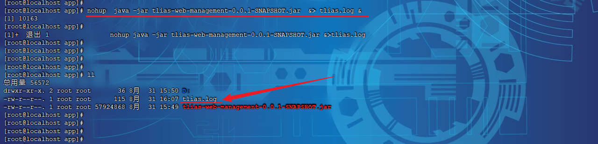

**2）停止服务**

```bash
# 查看服务的进程信息
ps -ef|grep tlias

# 杀掉进程
kill -9 xxxxx
```

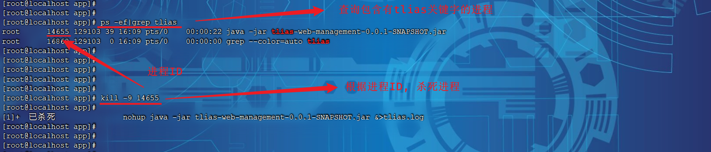

> 💡 **nohup 命令说明：**
>
> - **nohup 命令**：英文全称 **no hang up**（不挂起），用于不挂断地运行指定命令，**退出终端不会影响程序的运行**
> - **语法格式**：`nohup command [ args … ] [&]`
> - **参数说明：**
>   - `command`：要执行的命令
>   - `args`：一些参数，可以指定输出文件
>   - `&`：让命令在后台运行
> - **举例：**
>   - `nohup java -jar boot工程.jar &> hello.log &`
>   - 上述指令的含义为：**后台运行 java -jar 命令，并将日志输出到 hello.log 文件**
