# 20-项目部署(Docker)

> ⛳ 如果大家在自学的过程中，时间紧迫、没有方向、经常遇到难以解决的 Bug、没有亮眼的项目、缺少 AI 大模型经验，而又想快速系统化的学习、高薪就业的小伙伴儿，大家都可以 🔗 直接点我，了解一下我们系统化的课程体系。

---

在昨天的课程中，我们学习了 Linux 操作系统的常见命令，在 Linux 上安装软件，以及如何在 Linux 上部署一个单体项目。大家想一想自己最大的感受是什么？

我相信，除了个别天赋异禀的同学以外，大多数同学都会有相同的感受，那就是 **麻烦**。核心体现在三点：

- **命令太多了，记不住**
- **软件安装包名字复杂，不知道去哪里找**
- **安装和部署步骤复杂，容易出错**

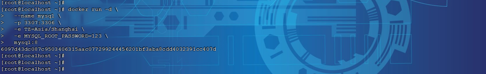

其实上述问题不仅仅是新手，即便是运维在安装、部署的时候一样会觉得麻烦、容易出错。

特别是我们即将进入项目阶段的学习，项目动辄就是几台、几十台、甚至上百台服务需要部署，有些大型项目甚至达到成千上万台服务。而由于每台服务器的运行环境不同，你写好的安装流程、部署脚本并不一定在每个服务器都能正常运行，经常会出错。这就给系统的部署运维带来了很多困难。

那么，有没有一种技术能够避免部署对服务器环境的依赖，减少复杂的部署流程呢？

> ✅ 答案是肯定的，这就是我们今天要学习的 **Docker** 技术。你会发现，有了 Docker 以后项目的部署如丝般顺滑，大大减少了运维工作量。即便你对 Linux 不熟悉，你也能轻松部署各种常见软件、Java 项目。

> 💡 **通过今天的学习，大家要能够达成下面的学习目标：**
> - 能利用 Docker 部署常见软件
> - 能利用 Docker 打包并部署 Java 应用
> - 理解 Docker 数据卷的基本作用
> - 能看懂 DockerCompose 文件

---

# 1. 快速入门

要想让 Docker 帮我们安装和部署软件，肯定要保证你的机器上有 Docker。由于大家的操作系统各不相同，安装方式也不同。为了便于大家学习，我们统一在之前提供给大家的 CentOS 的虚拟机中已经安装了 Docker，统一学习环境。

> 📌 如果大家需要自己在别的机器上安装 Docker 环境，可以参照最后的 **附录中的：Docker 安装文档**

## 1.1 部署 MySQL

首先，我们利用 Docker 来安装一个 MySQL 软件，大家可以对比一下之前传统的安装方式，看看哪个效率更高一些。

**如果是利用传统方式部署 MySQL，大概的步骤有：**

- 搜索并下载 MySQL 安装包
- 上传至 Linux 环境
- 解压和配置环境
- 安装
- 初始化和配置

**而使用 Docker 安装，仅仅需要一步即可**，在命令行输入下面的命令（建议采用 CV 大法）：

```bash
docker run -d \
  --name mysql \
  -p 3307:3306 \
  -e TZ=Asia/Shanghai \
  -e MYSQL_ROOT_PASSWORD=123 \
  mysql:8
```

运行效果如图（在给大家提供的资料中，已经下载好了 mysql 8 版本的镜像）：

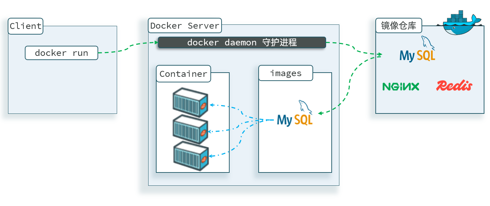

MySQL 安装完毕！通过任意客户端工具即可连接到 MySQL。

> ✅ **说明：**
>
> 其实，当我们执行命令后，Docker 做的第一件事情，是去自动搜索并下载了 MySQL，然后会自动运行 MySQL，我们完全不用插手，是非常方便的。
>
> 而且，这种安装方式你完全不用考虑运行的操作系统环境，它不仅仅在 CentOS 系统是这样，在 Ubuntu 系统、macOS 系统、甚至是装了 WSL 的 Windows 下，都可以使用这条命令来安装 MySQL。

> 📌 **注意：**
>
> 这里下载的不是安装包，而是 **镜像**。镜像中不仅包含了 MySQL 本身，还包含了其运行所需要的环境、配置、系统级函数库。因此它在运行时就有自己独立的环境，就可以跨系统运行，也不需要手动再次配置环境了。这套独立运行的隔离环境我们称为 **容器**。

> **说明：**
> - **镜像**：英文是 **image**
> - **容器**：英文是 **container**

> 💡 **因此，Docker 安装软件的过程，就是自动搜索下载镜像，然后创建并运行容器的过程。**

Docker 会根据命令中的镜像名称自动搜索并下载镜像，那么问题来了，它是去哪里搜索和下载镜像的呢？这些镜像又是谁制作的呢？

Docker 官方提供了一个专门管理、存储镜像的网站，并对外开放了镜像上传、下载的权利。Docker 官方提供了一些基础镜像，然后各大软件公司又在基础镜像基础上，制作了自家软件的镜像，全部都存放在这个网站。这个网站就成了 Docker 镜像交流的社区：https://hub.docker.com

基本上我们常用的各种软件都能在这个网站上找到，我们甚至可以自己制作镜像上传上去。【但是该网站，目前国内上不去了】

像这种提供存储、管理 Docker 镜像的服务器，被称为 **DockerRegistry**，可以翻译为 **镜像仓库**。DockerHub 网站是官方仓库，阿里云、华为云会提供一些第三方仓库，我们也可以自己搭建私有的镜像仓库。

> 📌 官方仓库在国外，下载速度较慢，一般我们都会使用第三方仓库提供的镜像加速功能，提高下载速度。而企业内部的机密项目，往往会采用私有镜像仓库。

**总之，镜像的来源有两种：**

- **基于官方基础镜像自己制作**
- **直接去 DockerRegistry 下载**

> 💡 **总结一下：**
>
> Docker 本身包含一个后台服务，我们可以利用 Docker 命令告诉 Docker 服务，帮助我们快速部署指定的应用。Docker 服务部署应用时，首先要去搜索并下载应用对应的镜像，然后根据镜像创建并运行容器，应用就部署完成了。

用一幅图表示如下：

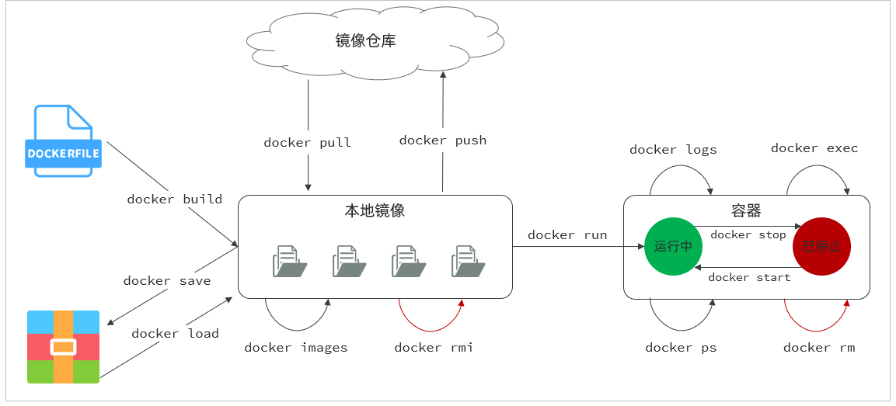

## 1.2 命令解读

利用 Docker 快速的安装了 MySQL，非常的方便，不过我们执行的命令到底是什么意思呢？

```bash
docker run -d \
  --name mysql \
  -p 3307:3306 \
  -e TZ=Asia/Shanghai \
  -e MYSQL_ROOT_PASSWORD=123 \
  mysql:8
```

> 💡 **解读：**
>
> - **`docker run -d`**：创建并运行一个容器，`-d` 则是让容器以 **后台进程** 运行
>
> - **`--name mysql`**：给容器起个名字叫 `mysql`，你可以叫别的
>
> - **`-p 3307:3306`**：设置端口映射。
>   - 容器是隔离环境，外界不可访问。但是可以将宿主机端口映射容器内到端口，当访问宿主机指定端口时，就是在访问容器内的端口了。
>   - 容器内端口往往是由容器内的进程决定，例如 MySQL 进程默认端口是 3306，因此容器内端口一定是 3306；而宿主机端口则可以任意指定，一般与容器内保持一致。
>   - **格式**：`-p 宿主机端口:容器内端口`，示例中就是将宿主机的 3307 映射到容器内的 3306 端口
>
> - **`-e TZ=Asia/Shanghai`**：配置容器内进程运行时的一些参数
>   - **格式**：`-e KEY=VALUE`，KEY 和 VALUE 都由容器内进程决定
>   - 案例中，`TZ=Asia/Shanghai` 是设置时区；`MYSQL_ROOT_PASSWORD=123` 是设置 MySQL 默认密码
>
> - **`mysql:8`**：设置镜像名称，Docker 会根据这个名字搜索并下载镜像
>   - **格式**：`REPOSITORY:TAG`，例如 `mysql:8.0`，其中 `REPOSITORY` 可以理解为镜像名，`TAG` 是版本号
>   - 在未指定 `TAG` 的情况下，默认是最新版本，也就是 `mysql:latest`

镜像的名称不是随意的，而是要到 DockerRegistry 中寻找，镜像运行时的配置也不是随意的，要参考镜像的帮助文档，这些在 DockerHub 网站或者软件的官方网站中都能找到。

如果我们要安装其它软件，也可以到 DockerRegistry 中寻找对应的镜像名称和版本，阅读相关配置即可。

---

# 2. Docker 基础

接下来，我们一起来学习 Docker 使用的一些基础知识，为将来部署项目打下基础。

## 2.1 常见命令

### 2.1.1 命令介绍

其中，比较常见的命令有：

| 命令 | 说明 |
| --- | --- |
| `docker pull` | 拉取镜像 |
| `docker push` | 推送镜像到 DockerRegistry |
| `docker images` | 查看本地镜像 |
| `docker rmi` | 删除本地镜像 |
| `docker run` | 创建并运行容器（不能重复创建） |
| `docker stop` | 停止指定容器 |
| `docker start` | 启动指定容器 |
| `docker restart` | 重新启动容器 |
| `docker rm` | 删除指定容器 |
| `docker ps` | 查看容器 |
| `docker logs` | 查看容器运行日志 |
| `docker exec` | 进入容器 |
| `docker save` | 保存镜像到本地压缩文件 |
| `docker load` | 加载本地压缩文件到镜像 |
| `docker inspect` | 查看容器详细信息 |

用一副图来表示这些命令的关系：

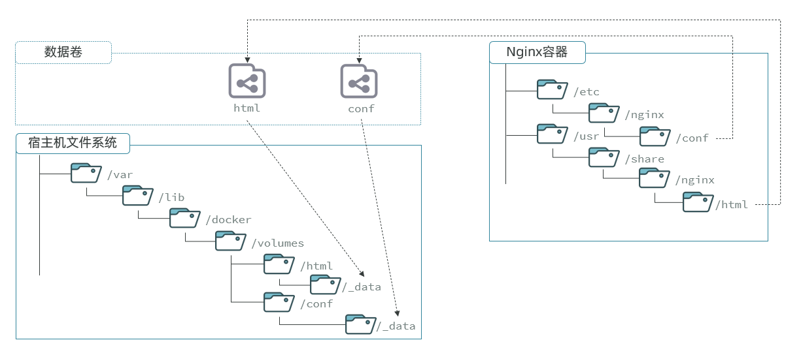

> 📌 **补充：**
>
> 默认情况下，每次重启虚拟机我们都需要手动启动 Docker 和 Docker 中的容器。通过命令可以实现开机自启：

```bash
# Docker 开机自启
systemctl enable docker

# Docker 容器开机自启
docker update --restart=always [容器名/容器id]
```

### 2.1.2 演示

我们以 Nginx 为例给大家演示上述命令。

```bash
# 第1步，去 DockerHub 查看 nginx 镜像仓库及相关信息

# 第2步，拉取 Nginx 镜像 (比较耗时)
docker pull nginx:1.20.2

# 第3步，查看镜像
docker images

# 第4步，创建并运行 Nginx 容器
docker run -d --name nginx -p 80:80 nginx

# 第5步，查看运行中容器
docker ps

# 也可以加格式化方式访问，格式会更加清爽
docker ps --format "table {{.ID}}\t{{.Image}}\t{{.Ports}}\t{{.Status}}\t{{.Names}}"

# 第6步，访问网页，地址：http://虚拟机地址

# 第7步，停止容器
docker stop nginx

# 第8步，查看所有容器
docker ps -a --format "table {{.ID}}\t{{.Image}}\t{{.Ports}}\t{{.Status}}\t{{.Names}}"

# 第9步，再次启动 nginx 容器
docker start nginx

# 第10步，再次查看容器
docker ps --format "table {{.ID}}\t{{.Image}}\t{{.Ports}}\t{{.Status}}\t{{.Names}}"

# 第11步，查看容器详细信息
docker inspect nginx

# 第12步，进入容器,查看容器内目录
docker exec -it nginx bash

# 或者，可以进入 MySQL
docker exec -it mysql mysql -uroot -p

# 第13步，删除容器
docker rm nginx

# 发现无法删除，因为容器运行中，强制删除容器
docker rm -f nginx
```

## 2.2 数据卷

容器是隔离环境，容器内程序的文件、配置、运行时产生的容器都在容器内部，我们要读写容器内的文件非常不方便。大家思考几个问题：

- **如果要升级 MySQL 版本，需要销毁旧容器，那么数据岂不是跟着被销毁了？**
- **MySQL、Nginx 容器运行后，如果我要修改其中的某些配置该怎么办？**
- **我想要让 Nginx 代理我的静态资源怎么办？**

> ✅ 因此，**容器提供程序的运行环境，但是程序运行产生的数据、程序运行依赖的配置都应该与容器解耦**。

### 2.2.1 介绍

> 📌 **数据卷（volume）** 是一个 **虚拟目录**，是 **容器内目录与宿主机目录之间映射的桥梁**。

以 Nginx 为例，我们知道 Nginx 中有两个关键的目录：

- **`html`**：放置一些静态资源
- **`conf`**：放置配置文件

如果我们要让 Nginx 代理我们的静态资源，最好是放到 `html` 目录；如果我们要修改 Nginx 的配置，最好是找到 `conf` 下的 `nginx.conf` 文件。

但遗憾的是，容器运行的 Nginx 所有的文件都在容器内部。所以我们必须利用数据卷将两个目录与宿主机目录关联，方便我们操作。

如图：

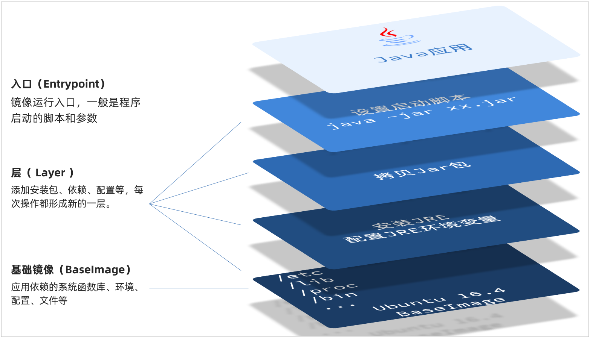

在上图中：

- 我们创建了两个数据卷：`conf`、`html`
- Nginx 容器内部的 `conf` 目录和 `html` 目录分别与两个数据卷关联。
- 而数据卷 conf 和 html 分别指向了宿主机的 `/var/lib/docker/volumes/conf/_data` 目录和 `/var/lib/docker/volumes/html/_data` 目录

> 📌 这样以来，容器内的 `conf` 和 `html` 目录就与宿主机的 `conf` 和 `html` 目录关联起来，我们称为 **挂载**。

此时，我们操作宿主机的 `/var/lib/docker/volumes/html/_data` 就是在操作容器内的 `/usr/share/nginx/html/_data` 目录。只要我们将静态资源放入宿主机对应目录，就可以被 Nginx 代理了。

> 💡 **小提示：**
>
> `/var/lib/docker/volumes` 这个目录就是默认的存放所有容器数据卷的目录，其下再根据数据卷名称创建新目录，格式为 `/数据卷名/_data`。
>
> **为什么不让容器目录直接指向宿主机目录呢？**
>
> - 因为直接指向宿主机目录就与宿主机强耦合了，如果切换了环境，宿主机目录就可能发生改变了。由于容器一旦创建，目录挂载就无法修改，这样容器就无法正常工作了。
> - 但是容器指向数据卷，一个逻辑名称，而数据卷再指向宿主机目录，就不存在强耦合。如果宿主机目录发生改变，只要改变数据卷与宿主机目录之间的映射关系即可。
>
> 不过，由于数据卷目录比较深，不好寻找，通常我们也允许让容器直接与宿主机目录挂载而不使用数据卷，具体参考 2.2.3 小节。

### 2.2.2 命令

数据卷的相关命令有：

| 命令 | 说明 |
| --- | --- |
| `docker volume create` | 创建数据卷 |
| `docker volume ls` | 查看所有数据卷 |
| `docker volume rm` | 删除指定数据卷 |
| `docker volume inspect` | 查看某个数据卷的详情 |
| `docker volume prune` | 清除数据卷 |

> 📌 **注意**：容器与数据卷的挂载要在 **创建容器时配置**，对于创建好的容器，是不能设置数据卷的。而且创建容器的过程中，数据卷会自动创建。

**教学演示环节：演示一下 nginx 的 html 目录挂载**

```bash
# 1. 首先创建容器并指定数据卷，注意通过 -v 参数来指定数据卷
docker run -d --name nginx -p 80:80 -v html:/usr/share/nginx/html nginx:1.20.2

# 2. 然后查看数据卷
docker volume ls

# 3. 查看数据卷详情
docker volume inspect html

# 4. 查看 /var/lib/docker/volumes/html/_data 目录
ll /var/lib/docker/volumes/html/_data

# 5. 进入该目录，并随意修改 index.html 内容
cd /var/lib/docker/volumes/html/_data
vi index.html

# 6. 打开页面，查看效果

# 7. 进入容器内部，查看 /usr/share/nginx/html 目录内的文件是否变化
docker exec -it nginx bash
```

**教学演示环节：演示一下 MySQL 的匿名数据卷**

```bash
# 1. 查看 MySQL 容器详细信息
docker inspect mysql

# 关注其中 .Config.Volumes 部分和 .Mounts 部分
```

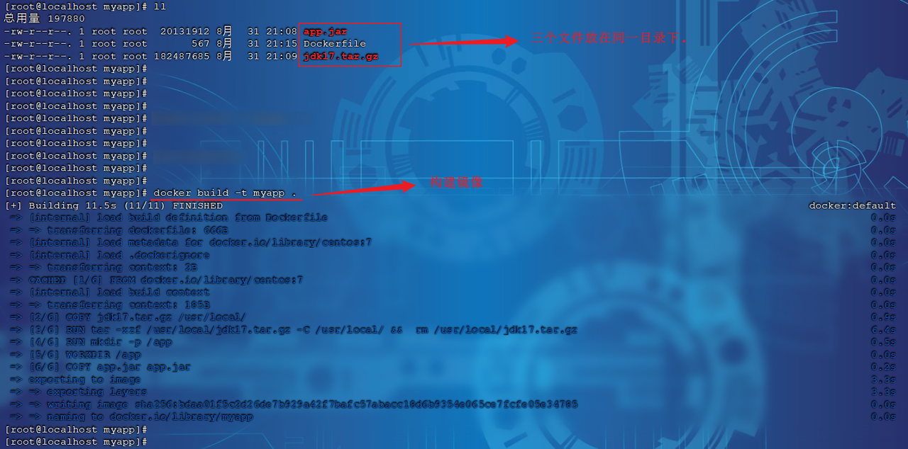

我们关注两部分内容，第一是 `.Config.Volumes` 部分：

```json
{
  "Config": {
    // ... 略
    "Volumes": {
      "/var/lib/mysql": {}
    }
    // ... 略
  }
}
```

可以发现这个容器声明了一个本地目录，需要挂载数据卷，但是数据卷未定义。这就是 **匿名卷**。

然后，我们再看结果中的 `.Mounts` 部分：

```json
{
  "Mounts": [
    {
      "Type": "volume",
      "Name": "29524ff09715d3688eae3f99803a2796558dbd00ca584a25a4bbc193ca82459f",
      "Source": "/var/lib/docker/volumes/29524ff09715d3688eae3f99803a2796558dbd00ca584a25a4bbc193ca82459f/_data",
      "Destination": "/var/lib/mysql",
      "Driver": "local"
    }
  ]
}
```

可以发现，其中有几个关键属性：

- **`Name`**：数据卷名称。由于定义容器未设置容器名，这里的就是匿名卷自动生成的名字，一串 hash 值。
- **`Source`**：宿主机目录
- **`Destination`**：容器内的目录

上述配置是将容器内的 `/var/lib/mysql` 这个目录，与数据卷 `29524ff09715d3688eae3f99803a2796558dbd00ca584a25a4bbc193ca82459f` 挂载。于是在宿主机中就有了 `/var/lib/docker/volumes/29524ff09715d3688eae3f99803a2796558dbd00ca584a25a4bbc193ca82459f/_data` 这个目录。这就是匿名数据卷对应的目录，其使用方式与普通数据卷没有差别。

接下来，可以查看该目录下的 MySQL 的 data 文件：

```bash
ls -l /var/lib/docker/volumes/29524ff09715d3688eae3f99803a2796558dbd00ca584a25a4bbc193ca82459f/_data
```

> 📌 **注意**：每一个不同的镜像，将来创建容器后内部有哪些目录可以挂载，可以参考 DockerHub 对应的页面。

### 2.2.3 挂载本地目录或文件

可以发现，数据卷的目录结构较深，如果我们去操作数据卷目录会不太方便。在很多情况下，我们会直接将容器目录与宿主机指定目录挂载。挂载语法与数据卷类似：

```bash
# 挂载本地目录
-v 本地目录:容器内目录

# 挂载本地文件
-v 本地文件:容器内文件
```

> ⚠️ **注意**：**本地目录或文件必须以 `/` 或 `./` 开头**，如果直接以名字开头，会被识别为数据卷名而非本地目录名。

**例如：**

```bash
-v mysql:/var/lib/mysql      # 会被识别为一个数据卷叫 mysql，运行时会自动创建这个数据卷
-v ./mysql:/var/lib/mysql    # 会被识别为当前目录下的 mysql 目录，运行时如果不存在会创建目录
```

**教学演示，删除并重新创建 mysql 容器，并完成本地目录挂载：**

- 挂载 `/root/mysql/data` 到容器内的 `/var/lib/mysql` 目录
- 挂载 `/root/mysql/init` 到容器内的 `/docker-entrypoint-initdb.d` 目录（初始化的 SQL 脚本目录）
- 挂载 `/root/mysql/conf` 到容器内的 `/etc/mysql/conf.d` 目录（这个是 MySQL 配置文件目录）

> 在课前资料中已经准备好了 mysql 的 `init` 目录、`conf` 目录、`data` 目录，可以直接将其上传到 Linux 服务器中的 `/root/mysql` 目录下。

**最终执行的指令如下：**

```bash
docker run -d \
  --name mysql \
  -p 3307:3306 \
  -e MYSQL_ROOT_PASSWORD=123 \
  -e TZ=Asia/Shanghai \
  -v /root/mysql/data:/var/lib/mysql \
  -v /root/mysql/init:/docker-entrypoint-initdb.d \
  -v /root/mysql/conf:/etc/mysql/conf.d \
  mysql:8
```

## 2.3 自定义镜像

前面我们一直在使用别人准备好的镜像，那如果我要部署一个 Java 项目，把它打包为一个镜像该怎么做呢？那接下来，我们就来介绍一下如何自定义镜像。

### 2.3.1 镜像结构

要想自己构建镜像，必须先了解镜像的结构。

之前我们说过，镜像之所以能让我们快速跨操作系统部署应用而忽略其运行环境、配置，就是因为镜像中包含了程序运行需要的系统函数库、环境、配置、依赖。

> ✅ **因此，自定义镜像本质就是依次准备好程序运行的基础环境、依赖、应用本身、运行配置等文件，并且打包而成**。

举个例子，我们要从 0 部署一个 Java 应用，大概流程是这样：

- 准备一个 linux 服务（CentOS 或者 Ubuntu 均可）
- 安装并配置 JDK
- 上传 Jar 包
- 运行 jar 包

那因此，我们打包镜像也是分成这么几步：

- 准备 Linux 运行环境（java 项目并不需要完整的操作系统，仅仅是基础运行环境即可）
- 安装并配置 JDK
- 拷贝 jar 包
- 配置启动脚本

上述步骤中的每一次操作其实都是在生产一些文件（系统运行环境、函数库、配置最终都是磁盘文件），所以镜像就是一堆文件的集合。

> 📌 但需要注意的是，**镜像文件不是随意堆放的，而是按照操作的步骤分层叠加而成**，每一层形成的文件都会单独打包并标记一个唯一 id，称为 **Layer（层）**。这样，如果我们构建时用到的某些层其他人已经制作过，就可以直接拷贝使用这些层，而不用重复制作。

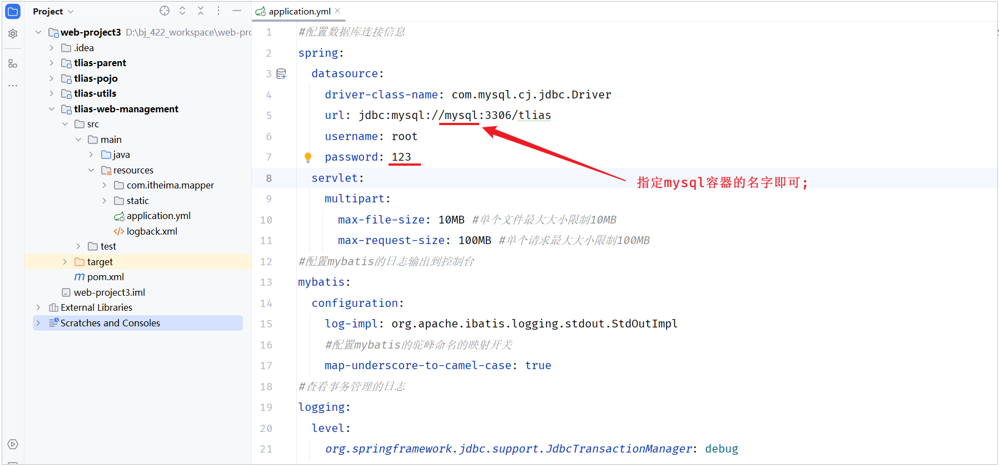

例如，第一步中需要的 Linux 运行环境，通用性就很强，所以 Docker 官方就制作了这样的只包含 Linux 运行环境的镜像。我们在制作 java 镜像时，就无需重复制作，直接使用 Docker 官方提供的 CentOS 或 Ubuntu 镜像作为基础镜像。

### 2.3.2 Dockerfile

由于制作镜像的过程中，需要逐层处理和打包，比较复杂，所以 Docker 就提供了自动打包镜像的功能。我们只需要将打包的过程，每一层要做的事情用固定的语法写下来，交给 Docker 去执行即可。

> ✅ 而这种记录镜像结构的文件就称为 **Dockerfile**。

**其中的语法比较多，比较常用的有：**

| 指令 | 说明 | 示例 |
| --- | --- | --- |
| **`FROM`** | 指定基础镜像 | `FROM centos:7` |
| **`ENV`** | 设置环境变量，可在后面指令使用 | `ENV key value` |
| **`COPY`** | 拷贝本地文件到镜像的指定目录 | `COPY ./xx.jar /tmp/app.jar` |
| **`RUN`** | 执行 Linux 的 shell 命令，一般是安装过程的命令 | `RUN yum install gcc` |
| **`EXPOSE`** | 指定容器运行时监听的端口，是给镜像使用者看的 | `EXPOSE 8080` |
| **`ENTRYPOINT`** | 镜像中应用的启动命令，容器运行时调用 | `ENTRYPOINT java -jar xx.jar` |

例如，要基于 `centos:7` 镜像来构建一个 Java 应用，其 Dockerfile 内容如下：

```dockerfile
# 使用 CentOS 7 作为基础镜像
FROM centos:7

# 添加 JDK 到镜像中
COPY jdk17.tar.gz /usr/local/
RUN tar -xzf /usr/local/jdk17.tar.gz -C /usr/local/ && rm /usr/local/jdk17.tar.gz

# 设置环境变量
ENV JAVA_HOME=/usr/local/jdk-17.0.10
ENV PATH=$JAVA_HOME/bin:$PATH

# 创建应用目录
RUN mkdir -p /app
WORKDIR /app

# 复制应用 JAR 文件到容器
COPY app.jar app.jar

# 暴露端口
EXPOSE 8080

# 运行命令
ENTRYPOINT ["java","-Djava.security.egd=file:/dev/./urandom","-jar","/app/app.jar"]
```

Dockerfile 文件编写好了之后，就可以使用如下命令来构建镜像了。

```bash
docker build -t 镜像名 .
```

- **`-t`**：是给镜像起名，格式依然是 `repository:tag` 的格式，不指定 tag 时，默认为 latest
- **`.`**：是指定 Dockerfile 所在目录，如果就在当前目录，则指定为 `.`

**演示：**

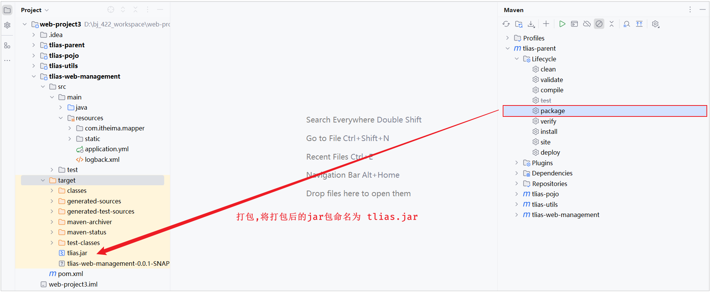


## 2.4 网络

上节课我们创建了一个 Java 项目的容器，而 Java 项目往往需要访问其它各种中间件，例如 MySQL、Redis 等。现在，我们的容器之间能否互相访问呢？我们来测试一下

首先，我们查看下 MySQL 容器的详细信息，重点关注其中的网络 IP 地址：

```bash
# 1. 用基本命令，寻找 Networks.bridge.IPAddress 属性
docker inspect mysql

# 也可以使用 format 过滤结果
docker inspect --format='{{range .NetworkSettings.Networks}}{{println .IPAddress}}{{end}}' mysql

# 得到 IP 地址如下：
172.17.0.2

# 2. 然后通过命令进入 dd 容器
docker exec -it dd bash

# 3. 在容器内，通过 ping 命令测试网络
ping 172.17.0.2

# 结果
PING 172.17.0.2 (172.17.0.2) 56(84) bytes of data.
64 bytes from 172.17.0.2: icmp_seq=1 ttl=64 time=0.053 ms
64 bytes from 172.17.0.2: icmp_seq=2 ttl=64 time=0.059 ms
64 bytes from 172.17.0.2: icmp_seq=3 ttl=64 time=0.058 ms
```

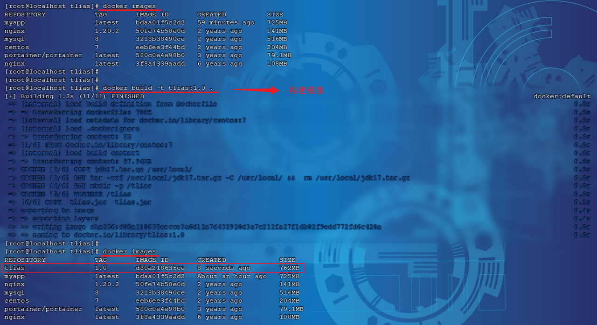

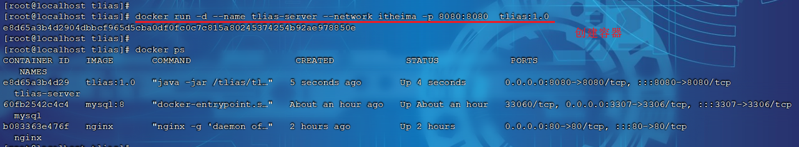

> 📌 发现可以互联，没有问题。

但是，容器的网络 IP 其实是一个 **虚拟的 IP**，其值并不固定与某一个容器绑定，如果我们在开发时写死某个 IP，而在部署时很可能 MySQL 容器的 IP 会发生变化，连接会失败。

**常见命令有：**

| 命令 | 说明 |
| --- | --- |
| `docker network create` | 创建一个网络 |
| `docker network ls` | 查看所有网络 |
| `docker network rm` | 删除指定网络 |
| `docker network prune` | 清除未使用的网络 |
| `docker network connect` | 使指定容器连接加入某网络 |
| `docker network disconnect` | 使指定容器连接离开某网络 |
| `docker network inspect` | 查看网络详细信息 |

**教学演示：自定义网络**

```bash
# 1. 首先通过命令创建一个网络
docker network create itheima

# 2. 然后查看网络
docker network ls

# 结果：
NETWORK ID     NAME      DRIVER    SCOPE
639bc44d0a87   bridge    bridge    local
403f16ec62a2   itheima   bridge    local
0dc0f72a0fbb   host      host      local
cd8d3e8df47b   none      null      local
# 其中，除了 itheima 以外，其它都是默认的网络

# 3. 让 myapp 和 mysql 都加入该网络
# 3.1. mysql 容器，加入 itheima 网络
docker network connect itheima mysql

# 3.2. myapp 容器，也就是我们的 java 项目, 加入 itheima 网络
docker network connect itheima myapp

# 4. 进入 dd 容器，尝试利用别名访问 db
# 4.1. 进入容器
docker exec -it myapp bash

# 4.2. 用容器名访问
ping mysql

# 结果：
PING mysql (172.18.0.2) 56(84) bytes of data.
64 bytes from mysql.itheima (172.18.0.2): icmp_seq=1 ttl=64 time=0.044 ms
64 bytes from mysql.itheima (172.18.0.2): icmp_seq=2 ttl=64 time=0.054 ms
```

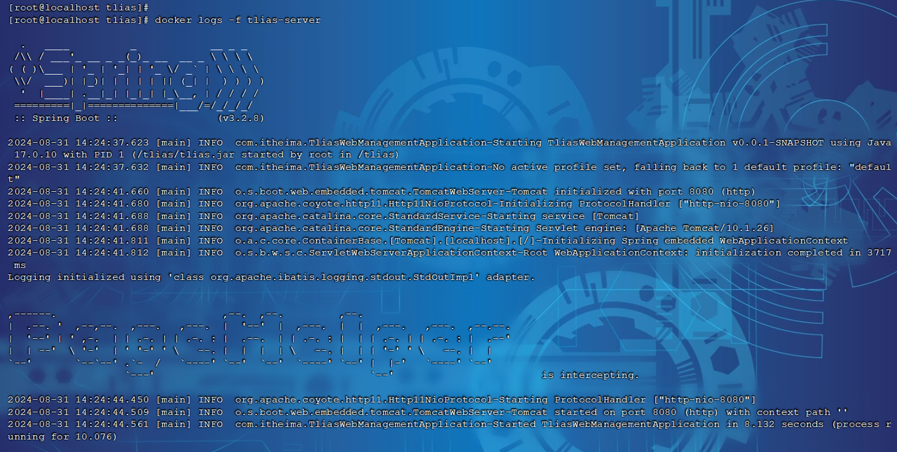

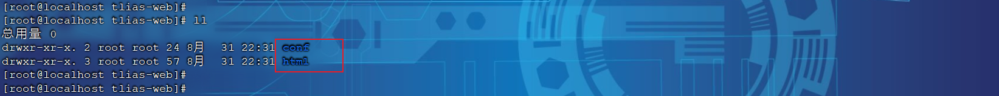

> ✅ OK，现在 **无需记住 IP 地址也可以实现容器互联了**。

---

# 3. 项目部署

## 3.1 部署服务端

> ✅ **需求**：将我们开发的 `tlias-web-management` 项目打包为镜像，并部署。

**步骤：**

a. 修改项目的配置文件，修改数据库服务地址（打包 package）。
b. 编写 Dockerfile 文件（AI 辅助）。
c. 构建 Docker 镜像，部署 Docker 容器，运行测试。

**1）修改项目的配置文件，修改数据库服务地址（打包 package）。**

然后，执行 maven 中的 package 生命周期，进行打包（跳过测试），并将打包后的 jar 包命名为 `tlias.jar`。

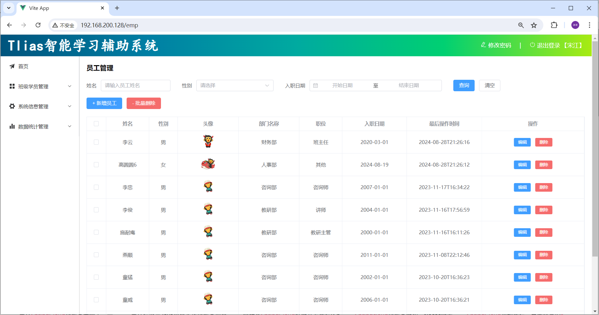

**2）编写 Dockerfile 文件（AI 辅助）。**

文件名 `Dockerfile`：

```dockerfile
# 使用 CentOS 7 作为基础镜像
FROM centos:7

# 添加 JDK 到镜像中
COPY jdk17.tar.gz /usr/local/
RUN tar -xzf /usr/local/jdk17.tar.gz -C /usr/local/ && rm /usr/local/jdk17.tar.gz

# 设置环境变量
ENV JAVA_HOME=/usr/local/jdk-17.0.10
ENV PATH=$JAVA_HOME/bin:$PATH

# 阿里云 OSS 环境变量
ENV OSS_ACCESS_KEY_ID=your-access-key-id
ENV OSS_ACCESS_KEY_SECRET=your-access-key-secret

# 统一编码
ENV LANG=en_US.UTF-8
ENV LANGUAGE=en_US:en
ENV LC_ALL=en_US.UTF-8

# 创建应用目录
RUN mkdir -p /tlias
WORKDIR /tlias

# 复制应用 JAR 文件到容器
COPY tlias.jar tlias.jar

# 暴露端口
EXPOSE 8080

# 运行命令
ENTRYPOINT ["java","-jar","/tlias/tlias.jar"]
```

> 由于项目要运行，需要依赖 jdk 的环境，所以这里我们需要将 `tlias.jar`，`jdk17.tar.gz`，`Dockerfile` 三个文件，上传到 Linux 服务器的 `/root/tlias` 目录下（如果没有这个目录，提前创建好）。

**3）构建 Docker 镜像，部署 Docker 容器，运行测试。**

- **构建 Docker 镜像**

```bash
docker build -t tlias:1.0 .
```

- **部署 Docker 容器**

```bash
docker run -d --name tlias-server --network itheima -p 8080:8080 tlias:1.0
```

> 💡 **`--network itheima`**：将创建的容器，加入到 itheima 网络，就可以和 itheima 网络中的容器通信了。

通过 `docker logs -f 容器名`，就可以查看容器的运行日志。

这样后端服务，就已经启动起来了。

## 3.2 部署前端

> ✅ **需求**：创建一个新的 nginx 容器，将资料中提供的前端项目的静态资源部署到 nginx 中。

**步骤：**

- 在宿主机上准备静态文件及配置文件存放目录（在 `/usr/local` 目录下创建 `tlias-web` 目录）。
- 部署 nginx 容器
  - `-v /usr/local/tlias-web/html:/usr/share/nginx/html`
  - `-v /usr/local/tlias-web/conf/nginx.conf:/etc/nginx/nginx.conf`

**1）部署 nginx 容器（设置目录映射）。**

- 将资料 `资料/04. 项目部署/前端项目` 中的目录 `html` 和配置文件存放目录 `conf`，上传至服务器端的 `/usr/local/tlias-web` 目录下。
- 执行如下命令，部署 nginx 容器

```bash
docker run -d \
  --name nginx-tlias \
  -v /usr/local/tlias-web/html:/usr/share/nginx/html \
  -v /usr/local/tlias-web/conf/nginx.conf:/etc/nginx/nginx.conf \
  --network itheima \
  -p 80:80 \
  nginx:1.20.2
```

前后端都部署完毕后，就可以打开浏览器，来测试一下。访问前端的 nginx 服务器。

## 3.3 DockerCompose

大家可以看到，我们部署一个简单的 java 项目，其中包含 3 个容器：

- **MySQL**
- **Nginx**
- **Java 项目**

而稍微复杂的项目，其中还会有各种各样的其它中间件，需要部署的东西远不止 3 个。如果还像之前那样手动的逐一部署，就太麻烦了。

> ✅ 而 **Docker Compose** 就可以帮助我们实现 **多个相互关联的 Docker 容器的快速部署**。它允许用户通过一个单独的 `docker-compose.yml` 模板文件（YAML 格式）来定义一组相关联的应用容器。

### 3.3.1 基本语法

docker-compose 文件中可以定义多个相互关联的应用容器，每一个应用容器被称为一个 **服务（service）**。由于 service 就是在定义某个应用的运行时参数，因此与 `docker run` 参数非常相似。

举例来说，用 `docker run` 部署 MySQL 的命令如下：

```bash
docker run -d \
  --name nginx-tlias \
  -p 80:80 \
  -v /usr/local/app/html:/usr/share/nginx/html \
  -v /usr/local/app/conf/nginx.conf:/etc/nginx/nginx.conf \
  --network itheima \
  nginx:1.20.2
```

如果用 `docker-compose.yml` 文件来定义，就是这样：

```yml
services:
  mysql:
    image: "nginx:1.20.2"
    container_name: nginx-tlias
    ports:
      - "80:80"
    volumes:
      - "/usr/local/app/html:/usr/share/nginx/html"
      - "/usr/local/app/conf/nginx.conf:/etc/nginx/nginx.conf"
    networks:
      - itheima
networks:
  itheima:
    name: itheima
```

**对比如下：**

| docker run 参数 | docker compose 指令 | 说明 |
| --- | --- | --- |
| `--name` | `container_name` | 容器名称 |
| `-p` | `ports` | 端口映射 |
| `-e` | `environment` | 环境变量 |
| `-v` | `volumes` | 数据卷配置 |
| `--network` | `networks` | 网络 |

明白了其中的对应关系，相信编写 `docker-compose` 文件应该难不倒大家。

```yml
services:
  mysql:
    image: mysql:8
    container_name: mysql
    ports:
      - "3307:3306"
    environment:
      TZ: Asia/Shanghai
      MYSQL_ROOT_PASSWORD: 123
    volumes:
      - "/usr/local/app/mysql/conf:/etc/mysql/conf.d"
      - "/usr/local/app/mysql/data:/var/lib/mysql"
      - "/usr/local/app/mysql/init:/docker-entrypoint-initdb.d"
    networks:
      - tlias-net
  tlias:
    build:
      context: .
      dockerfile: Dockerfile
    container_name: tlias-server
    ports:
      - "8080:8080"
    networks:
      - tlias-net
    depends_on:
      - mysql
  nginx:
    image: nginx:1.20.2
    container_name: nginx
    ports:
      - "80:80"
    volumes:
      - "/usr/local/app/nginx/conf/nginx.conf:/etc/nginx/nginx.conf"
      - "/usr/local/app/nginx/html:/usr/share/nginx/html"
    depends_on:
      - tlias
    networks:
      - tlias-net
networks:
  tlias-net:
    name: itheima
```

### 3.3.2 基础命令

编写好 docker-compose.yml 文件，就可以部署项目了。语法如下：

```bash
docker compose [OPTIONS] [COMMAND]
```

其中，OPTIONS 和 COMMAND 都是可选参数，比较常见的有：

| 类型 | 参数或指令 | 说明 |
| --- | --- | --- |
| **Options** | `-f` | 指定 compose 文件的路径和名称 |
| | `-p` | 指定 project 名称。project 就是当前 compose 文件中设置的多个 service 的集合，是逻辑概念 |
| **Commands** | `up` | 创建并启动所有 service 容器 |
| | `down` | 停止并移除所有容器、网络 |
| | `ps` | 列出所有启动的容器 |
| | `logs` | 查看指定容器的日志 |
| | `stop` | 停止容器 |
| | `start` | 启动容器 |
| | `restart` | 重启容器 |
| | `top` | 查看运行的进程 |
| | `exec` | 在指定的运行中容器中执行命令 |

### 3.3.3 操作演示

**1）在 Linux 服务器的 `/usr/local` 目录下创建目录 `app`，并切换到 `/usr/local/app` 目录。**

**2）上传资料中提供的 `资料/05. Docker Compose` 中的文件及文件夹到 `/usr/local/app` 目录中，如下所示：**

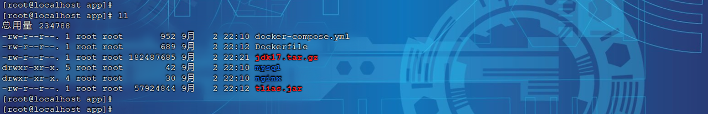

> ⚠️ 注意，资料中提供的 Dockerfile 文件中的阿里云 OSS 的 `AccessKeyId`，`AccessKeySecret` 需要替换成自己的。

**3）执行如下指令，基于 DockerCompose 部署项目。**

```bash
docker compose up -d
```

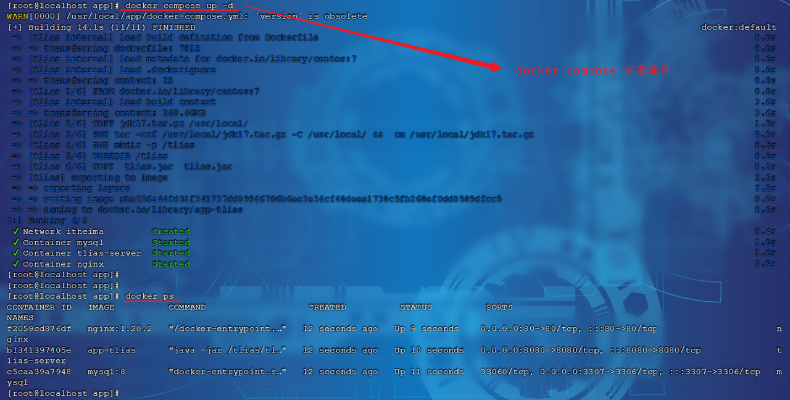

项目启动完毕之后，就可以启动服务器测试啦。

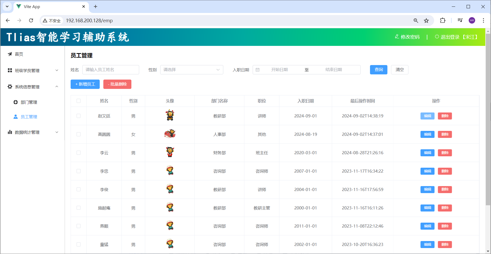

---

# 4. 附录：Docker 安装

## 4.1 卸载旧版

首先如果系统中已经存在旧的 Docker，则先卸载：

```bash
yum remove docker \
  docker-client \
  docker-client-latest \
  docker-common \
  docker-latest \
  docker-latest-logrotate \
  docker-logrotate \
  docker-engine \
  docker-selinux
```

## 4.2 配置 Docker 的 yum 库

首先要安装一个 yum 工具

```bash
sudo yum install -y yum-utils device-mapper-persistent-data lvm2
```

安装成功后，执行命令，配置 Docker 的 yum 源（已更新为阿里云源）：

```bash
sudo yum-config-manager --add-repo https://mirrors.aliyun.com/docker-ce/linux/centos/docker-ce.repo

sudo sed -i 's+download.docker.com+mirrors.aliyun.com/docker-ce+' /etc/yum.repos.d/docker-ce.repo
```

更新 yum，建立缓存

```bash
sudo yum makecache fast
```

## 4.3 安装 Docker

最后，执行命令，安装 Docker

```bash
yum install -y docker-ce docker-ce-cli containerd.io docker-buildx-plugin docker-compose-plugin
```

## 4.4 启动和校验

```bash
# 启动 Docker
systemctl start docker

# 停止 Docker
systemctl stop docker

# 重启
systemctl restart docker

# 设置开机自启
systemctl enable docker

# 执行 docker ps 命令，如果不报错，说明安装启动成功
docker ps
```

## 4.5 配置镜像加速

镜像地址可能会变更，如果失效可以百度找最新的 docker 镜像。

**配置镜像步骤如下：**

```bash
# 创建目录
rm -f /etc/docker/daemon.json

# 复制内容
tee /etc/docker/daemon.json <<-'EOF'
{
  "registry-mirrors": [
    "http://hub-mirror.c.163.com",
    "https://mirrors.tuna.tsinghua.edu.cn",
    "http://mirrors.sohu.com",
    "https://ustc-edu-cn.mirror.aliyuncs.com",
    "https://ccr.ccs.tencentyun.com",
    "https://docker.m.daocloud.io",
    "https://docker.awsl9527.cn"
  ]
}
EOF

# 重新加载配置
systemctl daemon-reload

# 重启 Docker
systemctl restart docker
```
