# 第三章：LangChain4j

聊完了大模型的基本使用，接下来我们学习 **LangChain4j**。之前我们调用大模型都是借助于 Apifox 发送 HTTP 请求完成的，但是在实际开发中我们肯定不能这么调用，我们需要写代码调用大模型，这样才能真正的做到将大模型和我们传统的软件深度融合。

那究竟应该怎么写代码才能调用大模型呢？我们可以借助于一些工具库来完成。目前市面上有关 Java 调用大模型的工具库，主流的有两种：

- **LangChain4j**
- **SpringAI**

> 📌 有关使用 SpringAI 如何调用大模型，黑马已经提供了对应的课程《SpringAI+DeepSeek》，有需要的同学可以直接上 B 站观看。咱们本次课程，主要给大家介绍如何使用 **LangChain4j** 调用大模型。

LangChain4j 的官网是：<https://docs.langchain4j.dev>。里面提供了 LangChain4j 的详细使用教程，大家有兴趣的可以自己去看一看，咱们课程中就不带着大家看了，直接教大家怎么操作。

---

## 3.1 快速入门

### 3.1.1 创建一个普通的 maven 工程

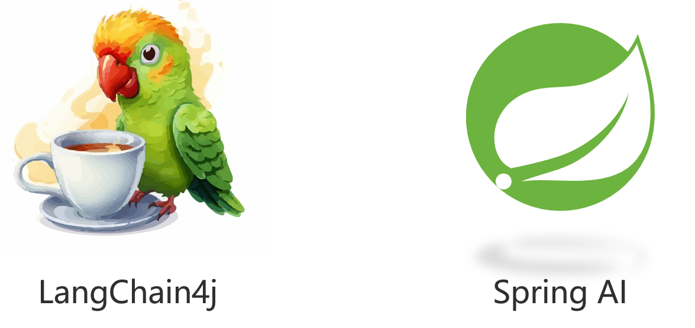

### 3.1.2 引入依赖

**pom.xml**

```xml
<dependency>
  <groupId>dev.langchain4j</groupId>
  <artifactId>langchain4j-open-ai</artifactId>
  <version>1.0.1</version>
</dependency>
```

### 3.1.3 构建聊天对象 OpenAiChatModel

构建 `OpenAiChatModel` 对象的时候，需要指定大模型的 url 地址、百炼平台的 API-KEY，以及调用的模型名称。

> ⚠️ **关于 API-KEY 的安全提示**
> API-KEY 可以直接写死到代码中，也可以配置到操作系统的环境变量中，然后通过代码获取再使用。**推荐大家把 API-KEY 配置到系统的环境变量中再使用**，因为如果直接写死在代码里面，会存在 API-KEY 泄露的风险。
> 所以在写代码前，请先在系统的用户变量中创建一个名字叫 `API-KEY` 的环境变量，值就是你在百炼平台申请的 api-key。**最后一定记得重启 IDEA！**

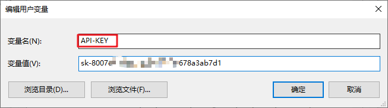

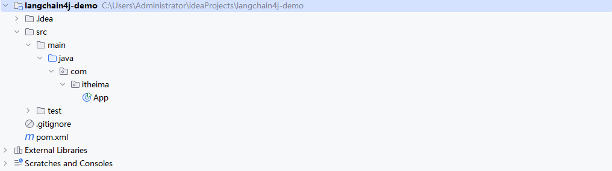

下面是构建 `OpenAiChatModel` 对象的代码：

**App.java**

```java
OpenAiChatModel model = OpenAiChatModel.builder()
        .baseUrl("https://dashscope.aliyuncs.com/compatible-mode/v1")//url参考百炼平台API文档
        .apiKey(System.getenv("API-KEY"))//获取环境变量API-KEY使用
        .modelName("qwen-plus")//设置模型名称
        .build();
```

### 3.1.4 调用方法与大模型交互

**App.java**

```java
public class App {
    public static void main(String[] args) {
        //2.构建OpenAiChatModel对象
        OpenAiChatModel model = OpenAiChatModel.builder()
                .baseUrl("https://dashscope.aliyuncs.com/compatible-mode/v1")
                .apiKey(System.getenv("API-KEY"))
                .modelName("qwen-plus")
                .build();

        //3.调用chat方法,交互
        String result = model.chat("东哥帅不帅?");
        System.out.println(result);
    }
}
```

### 3.1.5 查看日志信息

为了查看与大模型交互过程中具体发送的请求消息和大模型响应的数据，**可以打开日志开关**，我们只需要在构建 `OpenAiChatModel` 对象的时候调用 **`logRequests`** 和 **`logResponses`** 方法设置一下即可。

**App.java**

```java
public class App {
    public static void main(String[] args) {
        //2.构建OpenAiChatModel对象
        OpenAiChatModel model = OpenAiChatModel.builder()
                .baseUrl("https://dashscope.aliyuncs.com/compatible-mode/v1")
                .apiKey(System.getenv("API-KEY"))
                .modelName("qwen-plus")
                .logRequests(true)//设置打印请求日志
                .logResponses(true)//设置打印响应日志
                .build();

        //3.调用chat方法,交互
        String result = model.chat("东哥帅不帅?");
        System.out.println(result);
    }
}
```

---

## 3.2 Spring 整合 LangChain4j

因为将来我们的 Java 项目，必然是离不开 Spring 的，既然我们做的是大模型与传统软件的结合，那么毫无疑问，LangChain4j 的使用必然要和 Spring 结合起来才可以。

### 3.2.1 创建 SpringBoot 项目

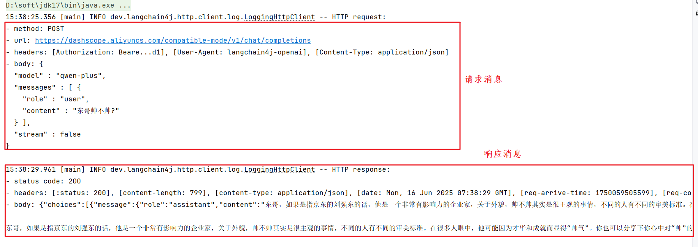

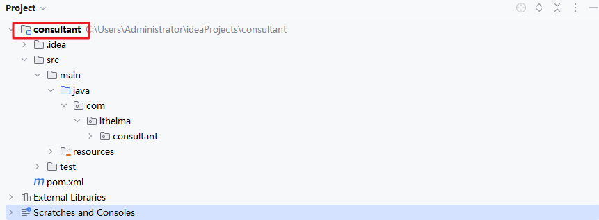

### 3.2.2 引入 LangChain4j 起步依赖

**pom.xml**

```xml
<dependency>
    <groupId>dev.langchain4j</groupId>
    <artifactId>langchain4j-open-ai-spring-boot-starter</artifactId>
    <version>1.0.1-beta6</version>
</dependency>
```

### 3.2.3 在 application.yml 中配置调用大模型的信息

**application.yml**

```yaml
langchain4j:
  open-ai:
    chat-model:
      base-url: https://dashscope.aliyuncs.com/compatible-mode/v1
      api-key: ${API-KEY}
      model-name: qwen-plus
```

> 💡 起步依赖会检测到配置信息，**自动的往 IOC 容器中注入一个 `OpenAiChatModel` 对象**。

### 3.2.4 开发接口，调用大模型

**ChatController.java**

```java
@RestController
public class ChatController {
    @Autowired
    private OpenAiChatModel model;
    @RequestMapping("/chat")
    public String chat(String message){
        String result = model.chat(message);
        return result;
    }
}
```

> **问题：为什么这里可以直接使用写 @Autowired  private OpenAiChatModel model;？**
>
> * 因为你引入了 `langchain4j-open-ai-spring-boot-starter`，这个 starter 通过 Spring Boot 的**自动配置（AutoConfiguration）机制**，已经帮你把 `OpenAiChatModel` 注册成 Bean 放到容器里了。


### 3.2.5 查看日志信息

为了查看与大模型交互过程中具体发送的请求消息和大模型响应的数据，我们需要在 `application.yml` 配置文件中开启配置即可。

**application.yml**

```yaml
langchain4j:
  open-ai:
    chat-model:
      base-url: https://dashscope.aliyuncs.com/compatible-mode/v1
      api-key: ${API-KEY}
      model-name: qwen-plus
      log-requests: true #请求消息日志
      log-responses: true #响应消息日志
logging:
  level:
    dev.langchain4j: debug #日志级别
```

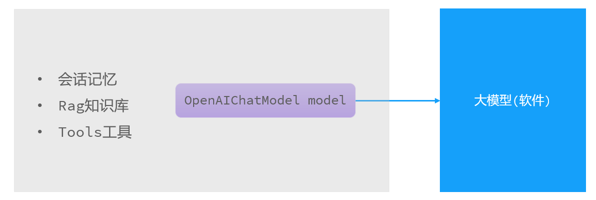

> **注意：**
>
> * `logging.level.dev.langchain4j: debug` 设置的是**输出阈值**（threshold），不是**改写日志输出的级别**。它的作用只是「DEBUG 及以上都放行」，

---

## 3.3 AiServices 工具类

接下来我们学习 LangChain4j 提供的工具类 **`AiServices`**，一个非常宝藏的工具。在之前的案例中，我们访问大模型是借助于 `OpenAiChatModel` 的 `chat` 方法完成的。其实这种方式在实际开发中并不是很常用，因为如果使用这种方式调用大模型，将来我们完成一些高阶的功能，比如**会话记忆 / RAG 知识库 / Tools 工具**的时候，在调用 chat 方法访问大模型前，我们需要自己做很多很多的工作，完成起来是比较复杂的。

为了简化我们程序员的使用，LangChain4j 提供了 `AiServices` 工具类，封装了有关 model 对象和其它一些功能的操作，用起来会非常简单。接下来我们先来聊一聊 `AiServices` 工具类的基本使用。

> 这是 langchain4j 的核心特性 —— **声明式 AI Service**。一句话概括：用一个接口描述「想要的对话能力」，langchain4j 帮你生成一个实现了这个接口的代理对象，调用接口方法时它会自动去调大模型。


### 3.3.1 AiServices 工具类基本使用

#### 3.3.1.1 引入 AiServices 相关依赖

**pom.xml**

```xml
<dependency>
    <groupId>dev.langchain4j</groupId>
    <artifactId>langchain4j-spring-boot-starter</artifactId>
    <version>1.0.1-beta6</version>
</dependency>
```

#### 3.3.1.2 声明用于封装聊天方法的接口

**ConsultantService.java**

```java
public interface ConsultantService {
    //用于聊天的方法,message为用户输入的内容
    public String chat(String message);
}
```

#### 3.3.1.3 使用 AiServices 工具类创建接口的动态代理对象

**CommonConfig.java**

```java
@Configuration
public class CommonConfig {
    @Autowired
    private OpenAiChatModel model;
    @Bean
    public ConsultantService consultantService() {
        ConsultantService cs = AiServices.builder(ConsultantService.class)
                .chatModel(model)//设置对话时使用的模型对象
                .build();
        return cs;
    }
}
```


#####  问题：为什么这样写？⭐ 

**为什么可以这样去写？我首先有三个疑问：**

1. builder的括号里面为什么要加ConsultantService.class，一般不用加吧？

2. 不是已经定义了一个consultantService接口吗，为什么这里还要把consultantService注入IOC里

3. AiServices里只有chatModel一个属性吗？


###### 问题1：

**1. 为什么 `builder()` 里要传 `ConsultantService.class`?**

因为 `AiServices` 是一个**动态代理工厂**,它的核心工作就是:**你只写了一个接口,它在运行时帮你生成这个接口的实现类**。

```java
public interface ConsultantService {
    String chat(String message);   // 你只声明,没写实现
}
```

`ConsultantService` 这个接口你根本没有写实现类。那 LangChain4j 怎么知道要给"哪个接口"生成实现?就是靠你传进去的 `ConsultantService.class`。

它内部做的事情大致是(简化版):

```java
Proxy.newProxyInstance(
    classLoader,
    new Class[]{ ConsultantService.class },  // ← 就是你传的这个
    invocationHandler                         // 拦截方法调用 → 拼 prompt → 调大模型 → 返回结果
);
```

所以这里的 `ConsultantService.class` 不是"多余的",而是**必须的**——它告诉工厂"按这个接口的方法签名去生成代理对象"。

你说的"一般不用加",那是指普通的 builder(比如 `Xxx.builder().a().b().build()` 返回固定类型)。但 `AiServices` 是泛型工厂,一次能给任意接口造实现,所以必须把目标接口的 Class 告诉它。其实方法签名是这样的:

```java
public static <T> AiServices<T> builder(Class<T> aiService)
```

泛型 `T` 由你传的 Class 推断出来,`build()` 返回的就是 `T`(也就是 `ConsultantService`)。

###### 问题2：

**2.接口都定义了,为什么还要注入 IOC?**

这里要区分两个东西:

|                                              | 是什么                       | Spring 知道吗                     |
| :------------------------------------------- | :--------------------------- | :-------------------------------- |
| `ConsultantService` 接口                     | 你写的一个 `.java` 接口文件  | 知道有这个"类型",但**没有实现类** |
| `AiServices.builder(...).build()` 返回的对象 | 运行时动态生成的代理**实例** | **不知道**,除非你手动告诉它       |

关键点:**接口本身不是 Bean,接口的实现对象才是 Bean。**

- 接口 `ConsultantService` 没有 `@Service`、`@Component`,也没有实现类,Spring 启动时扫描不到任何能注入的实例。
- 那个真正能干活的对象是 `AiServices` 在运行时 new 出来的代理,Spring 完全不认识它。

所以这段 `@Bean` 方法的作用是:**手动把这个代理对象放进 IOC 容器**,这样别的地方才能直接注入使用:

```java
@Autowired
private ConsultantService consultantService;  // ← 拿到的就是上面 @Bean 造出来的代理对象
```

如果不写这个 `@Bean`,容器里压根没有 `ConsultantService` 类型的对象,`@Autowired` 会直接报 `NoSuchBeanDefinitionException`。

> 补充:如果你用的是 `langchain4j-spring-boot-starter`,可以直接在接口上加 `@AiService` 注解,starter 会自动帮你做这件事(自动 builder + 自动注册 Bean),那样就不用手写这个 `@Bean` 方法了。你现在这种是**手动装配**的写法。
>
> 

###### 问题3：

**`AiServices` 只有 `chatModel` 一个属性吗?**

不是,`chatModel` 只是最基础的一个(模型对象是必填的)。常用的还有很多,例如:

```java
ConsultantService cs = AiServices.builder(ConsultantService.class)
        .chatModel(model)                          // 对话模型(必填)
        .streamingChatModel(streamingModel)        // 流式输出模型
        .chatMemory(chatMemory)                     // 单会话记忆
        .chatMemoryProvider(memoryId -> ...)        // 多会话记忆(按 memoryId 隔离)
        .contentRetriever(contentRetriever)         // RAG:向量检索
        .retrievalAugmentor(retrievalAugmentor)     // RAG:更完整的检索增强
        .tools(new MyTools())                       // Function Calling 工具
        .systemMessageProvider(id -> "你是一个顾问") // 系统提示词
        .moderationModel(moderationModel)           // 内容审核
        .build();
```

你现在只配了 `chatModel`,是最小可用配置——只能"无记忆地单轮问答"。等你后面要做**多轮对话记忆**、**知识库检索(RAG)**、**调用工具**时,就会往这个 builder 上继续链式追加对应的方法。


###### 总结

一句话总结:`AiServices` 是个"给接口造实现"的动态代理工厂,`ConsultantService.class` 告诉它造哪个接口,`@Bean` 把造出来的实例交给 Spring 管理,而 `chatModel` 只是它众多能力中的一个起点。


#### 3.3.1.4 ChatController 中注入 ConsultantService 并使用

**ChatController.java**

```java
@RestController
public class ChatController {
    @Autowired
    private ConsultantService consultantService;
    @RequestMapping("/chat")
    public String chat(String message){
        String result = consultantService.chat(message);
        return result;
    }
}
```

### 3.3.2 AiServices 工具类声明式使用

为了简化 `AiServices` 工具类的使用，LangChain4j 提供了**声明式使用方法**：想为哪个接口创建代理对象，只需要在该接口上添加 `@AiService` 注解并指定要使用的模型，将来 LangChain4j 扫描到该注解后会自动的创建该接口的代理对象并注入到 IOC 容器中。接下来修改 `ConsultantService` 中的代码，并重新测试。

```java
@AiService(
        wiringMode = AiServiceWiringMode.EXPLICIT,
        chatModel = "openAiChatModel"
)
public interface ConsultantService {
       //用于聊天的方法,message为用户输入的内容
    public String chat(String message);
}
```

> 💡 **`@AiService` 注解参数说明**
> - **`wiringMode`**：指定装配模式，默认取值为 `AiServiceWiringMode.AUTOMATIC`（自动装配），这里我们设置为手动装配 `AiServiceWiringMode.EXPLICIT`。
> - **`chatModel`**：指定对话时需要使用的模型对象在 IOC 容器中的名字。由于 IOC 容器中 Bean 对象的名字**默认是类名首字母小写**，所以这里的取值为 `openAiChatModel`。

实际上，在使用 `@AiService` 注解时，我们不手动的指定这两个属性的值，也就是说采用 `@AiService` 的自动装配模式也是可以的。

**ConsultantService.java**

```java
@AiService
public interface ConsultantService {
       //用于聊天的方法,message为用户输入的内容
    public String chat(String message);
}
```

> ⭐ 只是如果我们手动设置的话，大家更容易理解这里究竟在做什么，所以将来咱们在使用 `@AiService` 注解的时候，都采用**手动装配**的方式。


> ⭐ **详细解释下wiringMode和chatModel这两个参数:**
>
> 好的,聚焦讲这两个参数。
>
> ## `wiringMode = AiServiceWiringMode.EXPLICIT`
>
> `wiringMode` 翻译过来是"**装配模式**",它控制 starter **如何去寻找这个 AiService 需要的依赖**(主要是模型 chatModel,还有 tools、记忆、检索器等)。
>
> 它有两个取值:
>
> | 取值                | 行为                                                         |
> | :------------------ | :----------------------------------------------------------- |
> | `AUTOMATIC`(默认值) | **自动找**。容器里如果只有一个 chatModel,就自动拿来用,不用你指定名字。 |
> | `EXPLICIT`          | **手动指定**。starter 不自己猜,你必须明确告诉它用哪个 Bean。 |
>
> **为什么这里要用 `EXPLICIT`?**
>
> 因为一旦你项目里有**多个模型 Bean**(比如同时接了 OpenAI 和通义千问/Ollama),`AUTOMATIC` 模式就不知道该用哪个,启动会直接报错(找到多个候选,无法唯一确定)。
>
> 用了 `EXPLICIT`,就等于跟 starter 说:"**别自动猜了,我自己来指定**" —— 而具体指定哪个,就靠下面第二个参数。
>
> ## `chatModel = "openAiChatModel"`
>
> 这个参数的值是一个**字符串**,它填的是 **Spring 容器里某个 Bean 的名字**。
>
> 意思是:"这个 AiService 在对话时,请使用名字叫 `openAiChatModel` 的那个模型 Bean。"
>
> **`openAiChatModel` 这个名字哪来的?**
>
> 通常是 `langchain4j-open-ai-spring-boot-starter` 根据你 `application.yml` 里的 OpenAI 配置**自动创建**的一个 Bean,默认名字就叫 `openAiChatModel`。
>
> ```
> langchain4j:
>   open-ai:
>     chat-model:
>       api-key: ${OPENAI_API_KEY}
>       model-name: gpt-4o-mini
> ```
>
> 配好后,starter 自动注册一个 `openAiChatModel` Bean,你这里就按名字把它引用过来。
>
> ## 两者的关系
>
> 这两个参数是**配套使用**的:
>
> ```
> EXPLICIT          →  "我不要自动,我要手动指定"
> chatModel="..."   →  "手动指定的结果:就用这个名字的模型"
> ```
>
> - `EXPLICIT` 是"开关":关掉自动装配
> - `chatModel = "openAiChatModel"` 是"答案":手动给出具体用哪个
>
> > 反过来说,如果你用默认的 `AUTOMATIC` 且容器里只有一个模型,这两行其实都可以省略,starter 会自动搞定。写出这两行,通常就是为了**应对多模型场景,精确控制用哪个模型**。

---

## 3.4 流式调用

在第二章大模型的使用中我们有讲到，调用大模型有两种方式：**流式调用**和**阻塞式调用**。在我们前面演示的过程中，其实都用的是阻塞式调用，结果是一次性响应的；接下来我们学习如何使用 LangChain4j 发起流式调用。

### 3.4.1 流式调用步骤

#### 3.4.1.1 引入依赖

**pom.xml**

```xml
<dependency>
    <groupId>org.springframework.boot</groupId>
    <artifactId>spring-boot-starter-webflux</artifactId>
 </dependency>
 <dependency>
    <groupId>dev.langchain4j</groupId>
    <artifactId>langchain4j-reactor</artifactId>
    <version>1.0.1-beta6</version>
 </dependency>
```

#### 3.4.1.2 配置流式模型对象

之前咱们配置的是阻塞式对话模型对象，在流式调用中，我们需要使用 LangChain4j 的**流式模型对象**。和之前一样，也需要在配置文件中完成配置。

```yaml
langchain4j:
  open-ai:
    streaming-chat-model: #流式模型配置
      base-url: https://dashscope.aliyuncs.com/compatible-mode/v1
      api-key: ${API-KEY}
      model-name: qwen-plus
      log-requests: true
      log-responses: true
```

#### 3.4.1.3 调整 ConsultantService 中的代码

`ConsultantService` 中的 `chat` 方法的返回值类型，需要修改为支持流式处理的类型 **`Flux`**，同时还需要在 `@AiService` 注解中，通过 **`streamingChatModel`** 属性配置一下流式调用的模型对象，值为 `openAiStreamingChatModel`。

**ConsultantService.java**

```java
@AiService(
        wiringMode = AiServiceWiringMode.EXPLICIT,
        chatModel = "openAiChatModel",
        streamingChatModel = "openAiStreamingChatModel"
)
public interface ConsultantService {
    public Flux<String> chat(String message);
}
```

#### 3.4.1.4 调整 ChatController 中的代码

**ChatController.java**

```java
@RestController
public class ChatController {
    @Autowired
    private ConsultantService consultantService;

    @RequestMapping(value = "/chat",produces = "text/html;charset=utf-8")
    public Flux<String> chat(String memoryId,String message){
        Flux<String> result = consultantService.chat(memoryId,message);
        return result;
    }
}
```

> ⚠️ 其中 `@RequestMapping` 注解的 **`produces`** 属性，用于解决**乱码问题**。
>
> * Spring 会把它写进响应头:Content-Type: text/html;charset=utf-8
> *  对应请求头的是Accept

### 3.4.2 对接前端页面

我们将来成熟的项目肯定不能让用户通过地址栏输入，所以我们需要提供前端页面供用户更方便的使用。有关前端的知识不是本次课程的核心内容，所以这里就不带着大家一点一点儿写了，我已经提前给大家准备好了，大家只需要把资料中提供的前端页面直接拷贝到当前项目的 `static` 目录下，浏览器就能直接访问了。

资料位置：

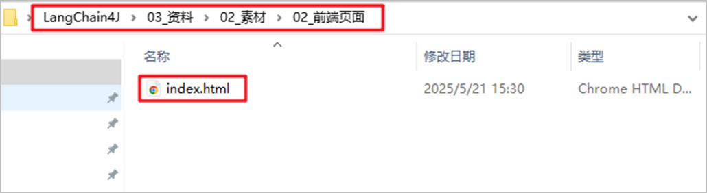

项目结构：

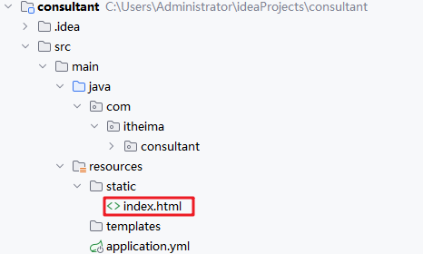

浏览器访问：

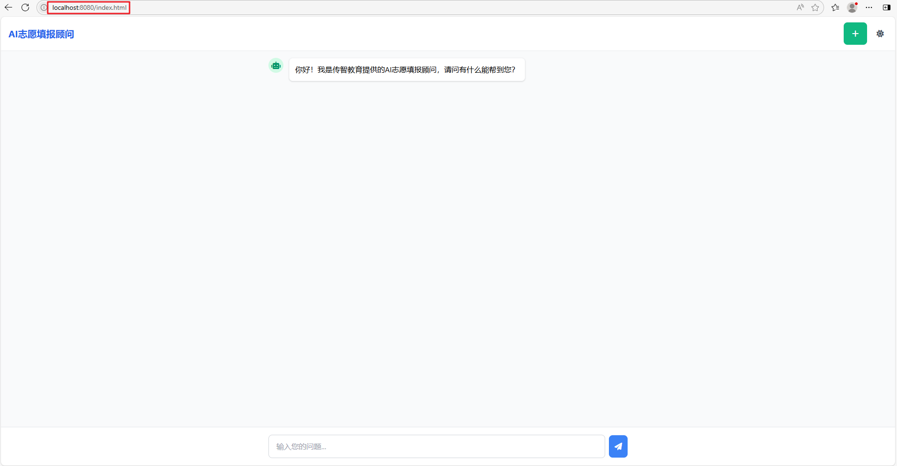

---

## 3.5 消息注解

接下来我们学习 LangChain4j 中提供的消息注解。将来我们开发的项目叫做 **AI 志愿填报顾问**，它只能回答志愿填报相关的问题，如果用户问其他的问题，则不予回答。比如你问它"特朗普靠谱吗？"它是不能回答你的。如果要实现这样的效果，我们就需要通过设定系统消息的方式来完成了。

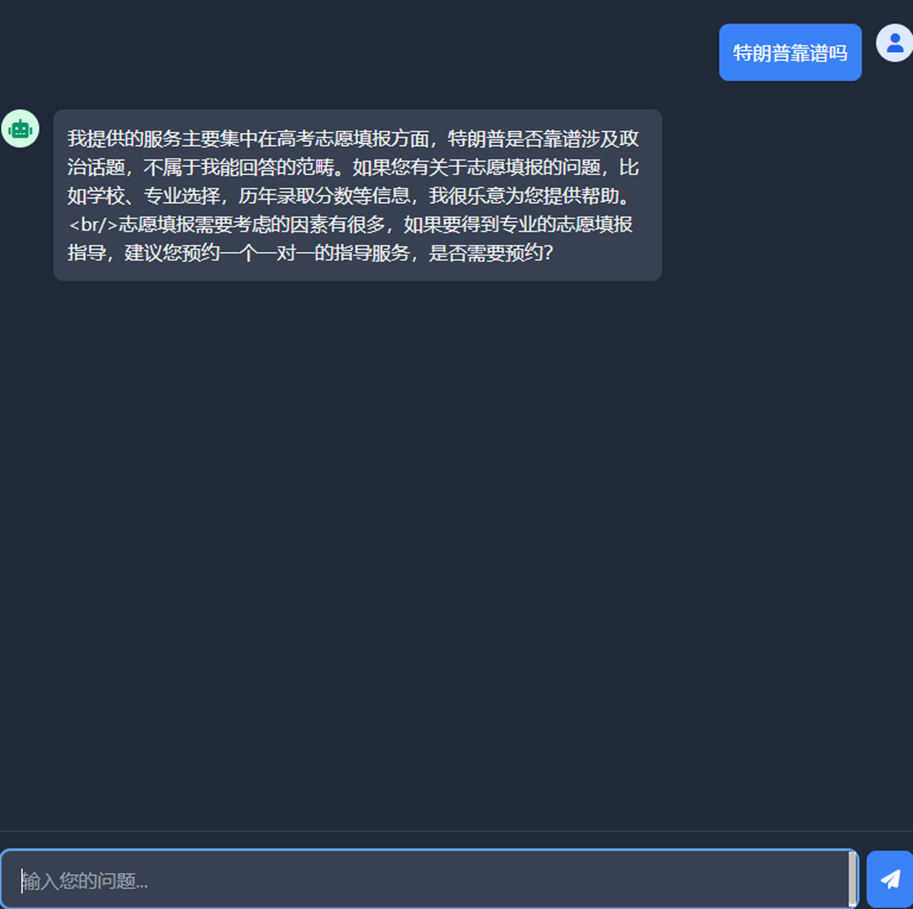

在 LangChain4j 中，提供了两个有关设置消息的注解：

- **`@SystemMessage`**：用于设置系统消息
- **`@UserMessage`**：用于设置用户消息

### 3.5.1 SystemMessage

先看 `@SystemMessage`，顾名思义，它是用于设置系统消息的，你可以直接在接口的方法上添加这个注解，在注解中书写系统消息即可。当然了，如果我们的系统消息很长，直接在代码中写不方便，它还提供了另外一种使用方式，通过 **`fromResource`** 属性，指定一个外部的文件。这样我们就可以把系统消息一次性的写入到外部文件中，管理起来也比较方便。

**ConsultantService.java**

```java
@AiService(
        wiringMode = AiServiceWiringMode.EXPLICIT,//手动装配
        chatModel = "openAiChatModel",//指定模型
        streamingChatModel = "openAiStreamingChatModel"
)
//@AiService
public interface ConsultantService {
    //@SystemMessage("你是东哥的助手小月月,人美心善又多金!")
    @SystemMessage(fromResource = "system.txt")
    public Flux<String> chat(String message);
}
```

咱们 AI 志愿填报顾问项目中使用到的系统消息在资料中有提供，大家可以直接把资料中提供的 `system.txt` 复制到当前项目的 `resources` 目录下进行测试。

资料位置：

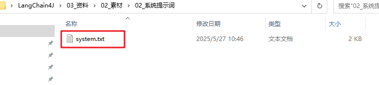

项目结构：

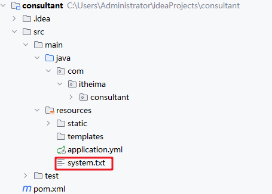

### 3.5.2 UserMessage

假设现在没有 `@SystemMessage`，那么我们可以借助于 `@UserMessage` 注解完成同样的效果，我们可以在用户消息前后，拼接提前预设的内容。下面给出一个使用示例：

```java
@UserMessage("你是东哥的助手小月月，温柔貌美又多金。{{it}}")
public Flux<String> chat(String message);
```

上面示例中的参数 `message` 是用户传递的消息，我们在使用 `@UserMessage` 注解的时候，可以通过 **`{{it}}`** 的方式动态的获取到用户传递的消息，然后再往它的前后拼接上预设的内容即可，想拼什么拼什么。

这里有一点需要说明，这个花括号内的 `it` 是**固定的**，不能随便写。假设你不想使用 `it` 这个名字，LangChain4j 提供了一个 **`@V` 注解**，用于解决这个问题。我们在参数前面通过 `@V` 注解给这个参数起一个名字，然后在花括号内写上同样的名字就能获取到了，下面是一个使用示例：

```java
@UserMessage("你是东哥的助手小月月，温柔貌美又多金。{{msg}}")
public Flux<String> chat(@V("msg") String message);
```

> ⚠️ **重要提示**
> 为了后续 AI 志愿填报顾问这个项目的效果，测试完毕后请记得**注释掉 `@UserMessage` 相关的代码**，保留 `@SystemMessage(fromResource = "system.txt")` 设置。

---

## 3.6 会话记忆

之前我们学习大模型使用的时候有讲过，**大模型不具备记忆能力**，每次会话都是独立的。要想让大模型产生记忆的效果，唯一的方法就是把之前聊天的内容和新的内容一起发送给大模型。

之前我们在 Apifox 中演示会话记忆效果的时候，是手动拼接多条消息的，有了 LangChain4j 之后就不需要这么麻烦了，**它能够帮我们记录聊天消息并自动发送！**

### 3.6.1 会话记忆原理

我们通过下面这幅图给大家解释一下 LangChain4j 是如何实现会话记忆效果的。图中三个框，分别代表**浏览器**、**Web 后端**和**大模型**。将来我们借助于 LangChain4j 可以准备一个专门用于存储会话记录的存储对象。


当用户问"西北大学是 211 吗？"，它会把消息传递给后端，后端接收到消息后，会自动把消息存放到存储对象中，然后再获取存储对象中记录的所有会话消息，一块发送给大模型。当然现在存储对象中只记录了一条消息，所以只把一条消息发送给大模型。大模型根据接收到的消息，生成答案（比如说"是的"），再把答案响应给 Web 后端，此时 Web 后端会把得到的响应消息往存储对象中拷贝一份，然后再把响应消息发送给用户。

用户接收到答案后，接着问"是 985 吗？"，这条消息发送给 Web 后端后，Web 后端依然会自动的把消息存放到存储对象中，此时存储对象中就存放了三条消息了，紧接着获取到存储对象中所有的会话消息，一并发送给大模型，**这一次大模型就能够根据用户发送的所有会话记录进行推断回答了，这就是会话记忆的原理！**

### 3.6.2 会话记忆基本实现

LangChain4j 提供了一个接口叫做 **`ChatMemory`**，该接口中提供了：

- **`add` 方法**：用于添加一条记录
- **`messages` 方法**：用于获取所有的会话记录
- **`clear` 方法**：用于清除所有的会话记录
- **`id` 方法**：用于唯一的标识一个存储对象（这个 id 暂时我们用不着，等会儿我们讲解会话记忆隔离的时候再给大家详细的讲解）

同时 LangChain4j 还提供了该接口的两个实现类：

- **`TokenWindowChatMemory`**
- **`MessageWindowChatMemory`**

咱们暂时先使用 `MessageWindowChatMemory` 来存储会话记录。

**ChatMemory.java**

```java
public interface ChatMemory {
       Object id();//记忆存储对象的唯一标识

    void add(ChatMessage var1);//添加一条会话记忆

    List<ChatMessage> messages();//获取所有会话记忆

    void clear();//清除所有会话记忆
}
```

#### 3.6.2.1 定义会话记忆对象

我们需要在 `CommonConfig` 类中，构建 `MessageWindowChatMemory` 对象，并注入到 IOC 容器中。构建的时候我们可以指定该对象中最大的会话存储数量。

> 💡 **为什么要有一个最大的会话存储数量？**
> 1. **大模型上下文有限**：一般目前大模型支持的上下文最大在 **10w 个 token** 左右，也就是说你发送给大模型的消息不是无限制的，你发的太多了大模型也吃不消。
> 2. **费用考虑**：如果会话记录存储的太多，费用就会越贵。所有发送给大模型的消息都会转换成 token，而平台就是按照 token 数量收费的，你发送的越多收费越高。
>
> 所以这里我们需要设置一个合适的数量，**一般设置 20 就够用了**。如果要存储的消息超过了 20 条，那么最早存储的消息就会被淘汰，在存储对象中最多保留最新的 20 条消息。

**CommonConfig.java**

```java
@Bean
public ChatMemory chatMemory() {
    return MessageWindowChatMemory.builder()
            .maxMessages(20)//最大保存的会话记录数量
            .build();
}
```

#### 3.6.2.2 配置会话记忆对象

我们需要在 `ConsultantService` 接口上的 `@AiService` 注解中借助于 **`chatMemory`** 属性完成配置，值就是 IOC 容器中 `ChatMemory` 对象的名字，也就是我们构建该对象时使用的方法名。

**ConsultantService.java**

```java
@AiService(
        wiringMode = AiServiceWiringMode.EXPLICIT,
        chatModel = "openAiChatModel",
        streamingChatModel = "openAiStreamingChatModel",
        chatMemory = "chatMemory"//配置会话记忆对象
)
public interface ConsultantService {
    @SystemMessage(fromResource = "system.txt")
    public Flux<String> chat(String message);
}
```

### 3.6.3 会话记忆隔离

刚才我们借助于 `MessageWindowChatMemory` 实现了会话记忆的效果，看起来还不错，但是还是有一些小问题的。当**不同的用户访问我们的程序时，无法区分不同用户的会话记录**，因为刚才实现的会话记忆，所有用户存储会话记录都是用的是同一个会话记忆对象，所以会话记忆并没有做到隔离，那应该怎么办呢？

还能不能记得当时我们介绍 `ChatMemory` 接口的时候，它提供了一个 `id` 方法，我们当时说它是用来唯一的标识某一个会话记忆对象的，**在这里，我们需要借助它来完成会话记忆隔离**。同样的，我们先通过一副动图来讲解一下 LangChain4j 是如何做到会话记忆隔离的。


在 LangChain4j 中可以准备一个容器，专门用于存储当前程序中所有的会话记忆对象。假设有一个用户访问我们的程序，此时它除了要把用户问题 `message` 携带给后端，还需要携带一个 **`memoryId`**：

- 假设它携带的 `memoryId` 为 **1**，此时 LangChain4j 会先从容器中找有没有一个 `ChatMemory` 对象的 id 为 1，如果有就使用，但是很明显现在没有。所以它会新创建一个 `ChatMemory` 对象，并把当前的 `memoryId 1` 设置给这个 `ChatMemory` 对象，并把会话记录存储到该对象中使用。
- 假设又有一个用户访问我们的程序，它携带的 `memoryId` 为 **2**，同样的，LangChain4j 也会从容器中找有没有一个 `ChatMemory` 对象的 id 为 2，很显然还是没有，所以会创建一个新的 `ChatMemory` 对象，并把 `memoryId 2` 设置给这个 `ChatMemory` 对象，并把会话记录存储到该对象中使用。

> ⚠️ 注意，假设第二个用户继续访问我们的程序，它携带了同样的 `memoryId 2` 给后端，此时 LangChain4j 从容器中查找的时候发现已经存在一个 `ChatMemory` 对象的 id 为 2，所以**直接复用这个已经存在的 `ChatMemory` 对象**，这样我们就可以借助于 `ChatMemory` 的 id 值实现不同会话之间的记忆隔离效果。

了解完了原理，接下来我们学习如何写代码才能实现会话记忆隔离。

#### 3.6.3.1 定义会话记忆对象提供者

LangChain4j 中提供了一个类 **`ChatMemoryProvider`**，将来 LangChain4j 如果从容器中没有找到指定 id 的 `ChatMemory` 对象，就会调用 `ChatMemoryProvider` 对象的 `get` 方法获取一个新的 `ChatMemory` 对象使用。因此我们需要提供这个 `ChatMemoryProvider` 对象，实现 `get` 方法。这里的 `get` 方法会接收一个参数，这个参数就是 `memoryId`，返回一个结果就是 `ChatMemory` 对象。我们只需要在 `get` 方法中写清楚根据 `memoryId` 如何构建 `ChatMemory` 对象并返回的逻辑即可。当然这里我们依然构建的是 `MessageWindowChatMemory` 对象，只不过我们在构建的时候，除了要指定最大的会话记录数量外，**还需要把 `memoryId` 设置给当前的 `ChatMemory` 对象**。

**CommonConfig.java**

```java
@Bean
public ChatMemoryProvider chatMemoryProvider() {
    ChatMemoryProvider chatMemoryProvider = new ChatMemoryProvider() {
        @Override
        public ChatMemory get(Object memoryId) {
            return MessageWindowChatMemory.builder()
                    .id(memoryId)//id值
                    .maxMessages(20)//最大会话记录数量
                    .build();
        }
    };
    return chatMemoryProvider;
}
```

> ⭐ ⭐ ⭐ ⭐ ⭐ ChatMemoryProvider这个对象的作用是:
>
> 1. 前端传递过来memoryId之后，langchain4j就会拿着这个memoryId去匹配对应的id值的ChatMemory对象
> 2. 一旦没有匹配到的话就会调用ChatMemoryProvider的get方法来获取一个ChatMemory对象


#### 3.6.3.2 配置会话记忆对象提供者

我们需要在 `@AiService` 注解中，借助于 **`chatMemoryProvider`** 这个属性指定一下会话记忆对象提供者，跟之前的套路都是一样的。只不过我们既然提供了 `ChatMemoryProvider`，之前提供的这个公有的 `ChatMemory` 就没有必要了，可以把它注释掉。

**ConsultantService.java**

```java
@AiService(
        wiringMode = AiServiceWiringMode.EXPLICIT,
        chatModel = "openAiChatModel",
        streamingChatModel = "openAiStreamingChatModel",
        //chatMemory = "chatMemory",
        chatMemoryProvider = "chatMemoryProvider"//配置会话记忆对象提供者
)
```

#### 3.6.3.3 ConsultantService 接口的方法中添加参数 memoryId

我们在 `ConsultantService` 接口中，给 `chat` 方法添加一个参数 `memoryId`，并且需要添加注解 **`@MemoryId`** 明确的告诉 LangChain4j，将来我的第一个参数就是用于标识 `ChatMemory` 对象的 id 值，将来你就拿这个参数的值去容器中帮我匹配对象的 `ChatMemory` 对象，如果匹配到就复用，如果没有匹配到就调用 `ChatMemoryProvider` 对象的 `get` 方法获取一个新的使用。

> ⚠️ 这里有个小细节要注意：如果 `chat` 方法**只有一个参数**，那 LangChain4j 会默认把这个参数当做用户消息来处理；如果 `chat` 方法**有多个参数**，我们就必须手动的指定哪个参数对应的是用户消息，所以我们需要在 `message` 参数前面手动的添加 **`@UserMessage` 注解**，用于标识 `message` 对应的就是用户消息。

**ConsultantService.java**

```java
@AiService(
        wiringMode = AiServiceWiringMode.EXPLICIT,
        chatModel = "openAiChatModel",
        streamingChatModel = "openAiStreamingChatModel",
        //chatMemory = "chatMemory",
        chatMemoryProvider = "chatMemoryProvider"//配置会话记忆对象提供者
)
public interface ConsultantService {
    @SystemMessage(fromResource = "system.txt")
    public Flux<String> chat(@MemoryId String memoryId, @UserMessage String message);
}
```

#### 3.6.3.4 ChatController 中 chat 接口接收前端传递的 memoryId

**ChatController.java**

```java
@RequestMapping(value = "/chat",produces = "text/html;charset=utf-8")
public Flux<String> chat(String memoryId,String message){
    Flux<String> result = consultantService.chat(memoryId,message);
    return result;
}
```

#### 3.6.3.5 前端访问 /chat 接口时提交 memoryId 参数

在咱们之前提供的 `index.html` 前端页面中，已经提交了这个参数，只是之前的代码我们一直没有接收这个参数。所以这一块我们无需写任何代码，直接启动测试即可。

### 3.6.4 会话记忆持久化

刚才我们完成了会话记忆隔离，其实我们的会话记忆还是有一些瑕疵的，**只要后端重启，会话记忆就没有了，丢失了**。先分析一下为什么会存在这种问题。

之前我们一直构建的用于存储会话记录的对象是 `MessageWindowChatMemory`，而这个对象内部维护了一个成员变量 **`ChatMemoryStore`**。其实我们使用 `MessageWindowChatMemory` 对象的 `add` 方法添加会话记录的时候，真正用于存储的对象是这个 `ChatMemoryStore`，所以要分析为什么重启之后会话记录会丢失，我们得分析 `ChatMemoryStore` 是如何存储会话记录的。

**MessageWindowChatMemory.java**

```java
public class MessageWindowChatMemory implements ChatMemory {
    private final String id;
    private final ChatMemoryStore store;//这个对象用于存储会话记录

    public void add(ChatMessage message) {
        this.store.updateMessages(this.id, messages);
    }
    public List<ChatMessage> messages() {
        return this.store.getMessages(this.id);
    }
    public void clear() {
        this.store.deleteMessages(this.id);
    }
 }
```

`ChatMemoryStore` 是一个接口，它里面提供了 `getMessages`、`updateMessages`、`deleteMessages` 方法，分别用于根据 `memoryId` **获取**、**更新**、**删除**会话记录。

**ChatMemoryStore.java**

```java
public interface ChatMemoryStore {
    List<ChatMessage> getMessages(Object memoryId);
    void updateMessages(Object memoryId,List<ChatMessage> messages);
    void deleteMessages(Object memoryId);
}
```

LangChain4j 为该接口提供了两个实现类：

- **`InMemoryChatMemoryStore`**
- **`SingleSlotMemoryStore`**

而我们 `MessageWindowChatMemory` 中默认使用的 Store 对象就是这个 `SingleSlotChatMemoryStore`。接下来我们重点分析它里面又是如何存储会话记录的。

**SingleSlotChatMemoryStore.java**

```java
class SingleSlotChatMemoryStore implements ChatMemoryStore {
    private List<ChatMessage> messages = new ArrayList();//用于存储会话记录
    public List<ChatMessage> getMessages(Object memoryId) {
        return this.messages;
    }
    public void updateMessages(Object memoryId,
                               List<ChatMessage> messages) {
        this.messages = messages;
    }
    public void deleteMessages(Object memoryId) {
        this.messages = new ArrayList();
    }
}
```

在 `SingleSlotChatMemoryStore` 中维护了一个集合对象 `messages`，它就是使用这个集合存储会话消息的，**所以很明显这是内存存储，一旦当服务器重启后这些消息必然会丢失！**

接下里我们要做的事情就是将会话记录**持久化存储到外部的存储器**中，比如 MySQL、Redis、MongoDB 等等都可以。最直观的解决思路就是：我不让 `MessageWindowChatMemory` 使用 `SingleSlotChatMemoryStore` 去维护会话记录，咱们自己提供一个 `ChatMemoryStore` 的实现类，在实现类中把消息存储到其它地方，然后再把咱们自己提供的 `ChatMemoryStore` 交给 `MessageWindowChatMemory` 即可。**在咱们本次课程中，我们把会话记录存储在 Redis 中**。

#### 3.6.4.1 准备 Redis 环境


首先参考资料中提供的 docker desktop 安装文档，在 windows 上搭建 docker 环境。

其次在命令符提示窗口中执行命令安装 Redis，在 windows 上映射的端口为 **6379**。

```bash
docker run --name redis -d -p 6379:6379 redis
```

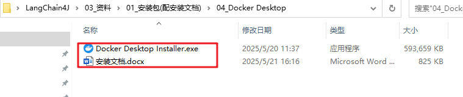

最后参考资料中提供的 RedisInsight 安装文档，安装 Redis 图形化界面客户端。

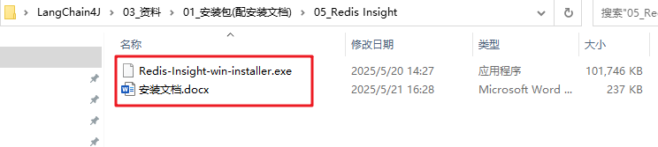

#### 3.6.4.2 引入 Redis 起步依赖

**pom.xml**

```xml
<dependency>
    <groupId>org.springframework.boot</groupId>
    <artifactId>spring-boot-starter-data-redis</artifactId>
</dependency>
```

#### 3.6.4.3 配置 Redis 连接信息

```yaml
spring:
  data:
    redis:
      host: localhost
      port: 6379
```

#### 3.6.4.4 提供 ChatMemory 实现类操作 Redis

定义实现类实现 `ChatMemory` 接口，重写 `getMessages`、`updateMessages`、`deleteMessages` 方法，用于操作 Redis，并且把实现类的对象注入到 IOC 容器中。

**RedisChatMemoryStore.java**

```java
import dev.langchain4j.data.message.ChatMessage;
import dev.langchain4j.data.message.ChatMessageDeserializer;
import dev.langchain4j.data.message.ChatMessageSerializer;
import dev.langchain4j.store.memory.chat.ChatMemoryStore;
import org.springframework.beans.factory.annotation.Autowired;
import org.springframework.data.redis.core.StringRedisTemplate;
import org.springframework.stereotype.Repository;

import java.time.Duration;
import java.util.List;

@Repository
public class RedisChatMemoryStore implements ChatMemoryStore {
    //注入RedisTemplate
    @Autowired
    private StringRedisTemplate redisTemplate;
    @Override
    public List<ChatMessage> getMessages(Object memoryId) {
        //获取会话消息
        String json = redisTemplate.opsForValue().get(memoryId);
        //把json字符串转化成List<ChatMessage>
        List<ChatMessage> list = ChatMessageDeserializer.messagesFromJson(json);
        return list;
    }

    @Override
    public void updateMessages(Object memoryId, List<ChatMessage> list) {
        //更新会话消息
        //1.把list转换成json数据
        String json = ChatMessageSerializer.messagesToJson(list);
        //2.把json数据存储到redis中
        redisTemplate.opsForValue().set(memoryId.toString(),json, Duration.ofDays(1));
    }

    @Override
    public void deleteMessages(Object memoryId) {
        //删除会话消息
        redisTemplate.delete(memoryId.toString());
    }
}
```

> **⭐ ⭐ ⭐ ⭐ ⭐ String json = redisTemplate.opsForValue().get(memoryId);这种是redis的固定写法吗?**
>
> 不是"固定写法"，而是 **Spring Data Redis 这套 API 的惯用写法**。要分两层理解：Redis 本身、和 Spring 封装的模板。
>
> ## 1. `opsForValue()` 只是「String 类型」的入口
>
> Redis 有多种数据结构（String、Hash、List、Set、ZSet…）。`RedisTemplate` 为每种结构提供了一个"操作入口"方法，你要操作哪种结构就调对应的：
>
> | Redis 数据结构   | 获取操作对象的方法 | 返回类型          |
> | :--------------- | :----------------- | :---------------- |
> | String（字符串） | `opsForValue()`    | `ValueOperations` |
> | Hash（哈希）     | `opsForHash()`     | `HashOperations`  |
> | List（列表）     | `opsForList()`     | `ListOperations`  |
> | Set（集合）      | `opsForSet()`      | `SetOperations`   |
> | ZSet（有序集合） | `opsForZSet()`     | `ZSetOperations`  |
>
> 所以 `opsForValue().get(key)` 的含义是：「我要操作 String 类型，执行 GET」。如果你存的是 Hash，就得写 `opsForHash().get(key, field)`，完全不同。
>
> ## 2. 方法名基本对应 Redis 原生命令
>
> 拿到 `ValueOperations` 后，方法名几乎和 Redis 命令一一对应：
>
> ```java
> opsForValue().set(key, value);      // SET
> opsForValue().get(key);             // GET
> opsForValue().increment(key);       // INCR
> opsForValue().setIfAbsent(key, v);  // SETNX
> ```
>
> 这是约定，不是唯一写法。


#### 3.6.4.5 配置 ChatMemoryStore

将我们提供的 `ChatMemoryStore` 配置给 `MessageWindowChatMemory` 对象使用。

**CommonConfig.java**

```java
@Autowired
private ChatMemoryStore redisChatMemoryStore;

@Bean
public ChatMemoryProvider chatMemoryProvider(){
    ChatMemoryProvider chatMemoryProvider = new ChatMemoryProvider() {
        @Override
        public ChatMemory get(Object memoryId) {
            return MessageWindowChatMemory.builder()
                    .id(memoryId)
                    .maxMessages(20)
                    .chatMemoryStore(redisChatMemoryStore)//配置ChatMemoryStore
                    .build();
        }
    };
    return chatMemoryProvider;
}
```

---

## 3.7 RAG 知识库

咱们目前的 AI 志愿填报顾问还存在一个问题，**无法查询各个高校 2024 年最新的录取分数**，其原因在于咱们使用的 qwen-plus 大模型最后一次训练是在 2023 年 10 月，在这个时间之后产生的新的数据，大模型是无法感知的。

如果要解决这个问题，就需要使用 RAG 相关的知识了。

### 3.7.1 RAG 原理

> 💡 **RAG 全称**：Retrieval Augmented Generation，翻译过来是**检索增强生成**，简单理解就是**通过检索外部知识库的方式增强大模型的生成能力**。

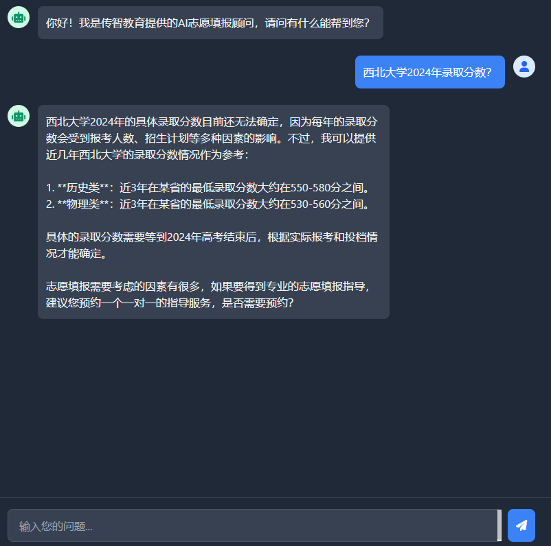

正常情况下当用户把问题发送给 AI 应用，AI 应用内部组织调用大模型的数据并发送给大模型，接下来大模型会根据接收到的数据生成结果并响应给 AI 应用，然后 AI 应用再把接收到的消息响应给用户。这是咱们目前程序的一个基本工作流程。

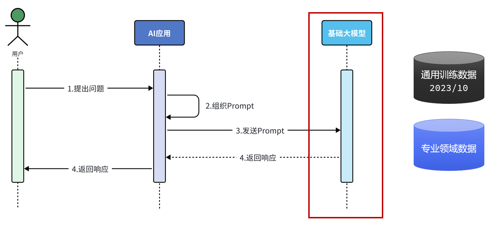

由于咱们一旦把大模型训练完毕后，随着时间的推移产生的新数据大模型是无法感知的，而且训练大模型的时候一般使用的都是通用的训练数据，**有关专业领域的知识，大模型也是不知道的**。所以，如果要想让大模型能根据最新的数据或者专业领域的数据回答问题，我们就需要给它**外挂一个知识库**，这就是 RAG 要做的事情。

一旦当我们外挂了知识库后，整个工作流程会发生一些变化。

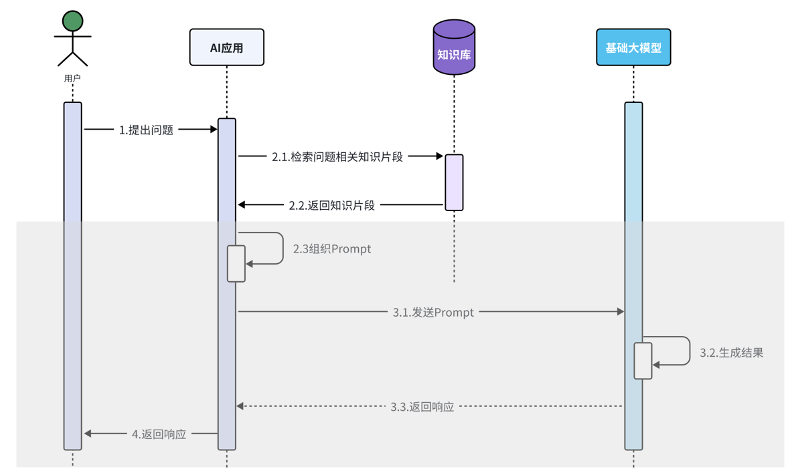

当用户把问题发送给 AI 应用，AI 应用会先根据用户的问题从知识库中检索对应的知识片段，得到知识片段后 AI 应用需要结合用户的问题以及知识库中检索到的知识片段组织要发送给大模型的消息，大模型接收到消息后会同时根据**用户的问题、知识库检索到的知识片段以及自身的知识储备**，生成对应的结果响应给 AI 应用，最终再返回给用户。这是我们外挂知识库后，AI 应用的工作流程。

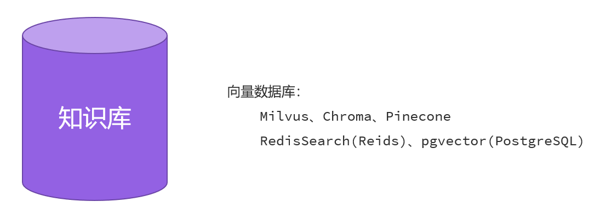

看起来比之前要复杂一些，但好消息是，下面的这一部分工作 **LangChain4j 都能帮我们自动完成**，我们需要关注的核心有两个：

1. **知识库应该怎么搭建**
2. **如何从知识库中检索出用户问题相关的知识片段**

这个知识库一般采取的是一种特殊的数据库，叫**向量数据库**。目前市面上常见的向量数据库有很多：

- 专用的向量数据库：**Milvus**、**Chroma**、**Pinecone**
- 传统数据库的向量化扩展：Redis 提供了 **RedisSearch**，PostgreSQL 提供了 **pgvector**

不管是哪一种向量数据库原理都是一样的，使用也都大差不差。

接下来我们聊一聊向量数据库是如何存储数据以及如何检索与用户问题相关的数据片段，要搞清楚这些首先我们得搞清楚什么是**向量**。其实向量这个东西咱们高中数学都有学过，我在这里带着大家一块复习一下。

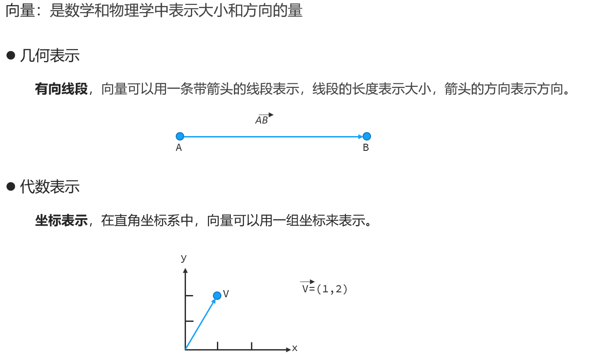

向量是数学和物理中表示**大小**和**方向**的量，常见的表示方式有**两种：**

- **几何表示**：在几何中，向量可以用一条带箭头的线段表示，线段的长度表示大小，箭头的方向表示方向。比如有两个点 A 点和 B 点，那么 A 点到 B 点之间的有向线段就可以记作向量 AB。
- **代数表示**：在代数中向量可以表示为一组坐标，比如一个直角坐标系，横轴为 X，纵轴为 Y，在坐标系中有一个点 V，我们记作向量 V(1,2)，其中 1 是 V 点在 X 轴的取值，2 是 V 点在 Y 轴的取值。其实在坐标系中表示的向量也可以转化为几何向量表示，V 是终点，默认的起点是坐标原点，那么向量 V 表示的是原点到 V 点的有向线段。

了解完什么是向量我们接着聊一聊与向量有关的一个知识，叫做**余弦相似度**。

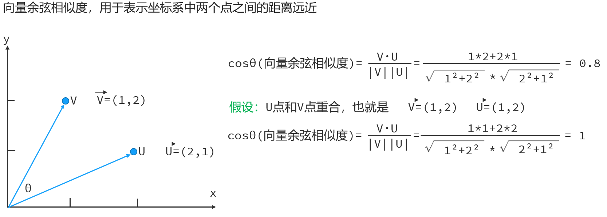

> 💡 **余弦相似度**用于标识坐标系中两个点之间的距离远近。

在直角坐标系中有两个向量 v 和 u，向量 v 和向量 u 之间有一个夹角 θ，我们所说的向量的余弦相似度其实就是指的这个夹角 θ 的 cos 值。根据高中学过的公式：

> ⭐ **向量夹角的 cos 值 = 向量的内积 ÷ 向量模长的乘积**

两个向量的内积为对应坐标的乘积和，所以分子是 `1*2 + 2*1`；向量的模长为当前向量所有坐标的平方和再开方，所以分母为 `根号(1²+2²) × 根号(2²+1²)`。分母是 5，分子是 4，最终的出的结果是 **0.8**。

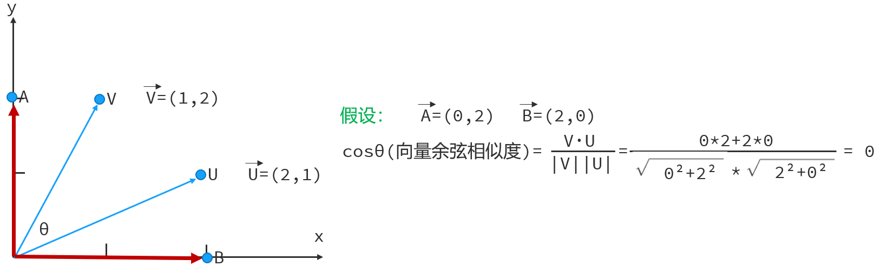

接下来我们脑补一下，假设 U 点和 V 点重合了，也就是说两个向量重合了，两个点之间的距离为 0，我们计算一下重合的两个向量的余弦相似度为多少？依然是内积除以模的乘积，分子为 `1*1 + 2*2` 得到 5，分母为 `根号(1²+2²) × 根号(2²+1²)` 得到也是 5，所以**余弦相似度为 1**。也就是说如果两个向量重合，对应的两个点之间的距离为 0，此时余弦相似度为 1，这是非常极端的一种情况。

接下来我们考虑另外一种非常极端的情况。

假设有两个向量 A 和 B，其中 A 向量的 x 坐标为 0，y 坐标为 2，B 向量的 x 坐标为 2，y 坐标为 0。此时两个向量处于正交状态，也就是夹角 θ 为 90 度。接下来我们算一下它们的余弦相似度。依然是内积除以模的乘积，分子为 `0*2 + 2*0` 得到 0，分母是 `根号(0²+2²) × 根号(2²+0²)` 得到 4，**最终余弦相似度为 0**。

> ⭐ **重要结论**：保持模长不变的情况下，当余弦相似度为 0 时，两点之间的距离最远；当余弦相似度为 1 时，两点之间的距离最近；而余弦相似度处于 0~1 之间时，两点之间的距离也是介于两种极端情况中间的。

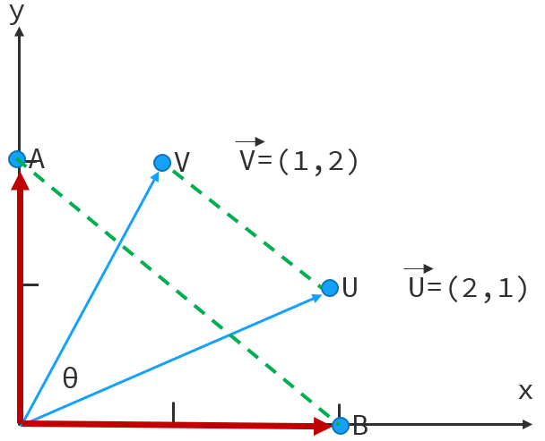

因此我们得出一个结论，<span style="color:red;">**在第一象限中，向量之间的余弦相似度的取值范围为 0~1，而且余弦相似度越大，说明向量的方向越接近，对应的两点之间的距离越小**</span>。

刚才我们举的例子都是二维向量，其实当你把二维向量搞明白了，多维向量也是一模一样的：

- **二维向量**：V = (v1, v2)
- **三维向量**：V = (v1, v2, v3)
- **四维向量**：V = (v1, v2, v3, v4)
- **N 维向量**：V = (v1, v2, v3, …, vn)

而我们 RAG 知识库中使用的向量，一般是**几百个维度到几千个维度**不等，不管它们有多少个维度，咱们之前得出的公式和结论都是通用的。**余弦相似度的算法都是内积除以模的乘积，而且两个向量的余弦相似度越大，向量方向越接近，两点之间的距离也就越小。**

聊完了向量相关的知识接下来我们聊一聊 RAG 中如何使用向量数据库存储数据。下面的流程图是 LangChain4j 官网给出的针对于 RAG 知识库存储流程的解释，我们简单的看一看。

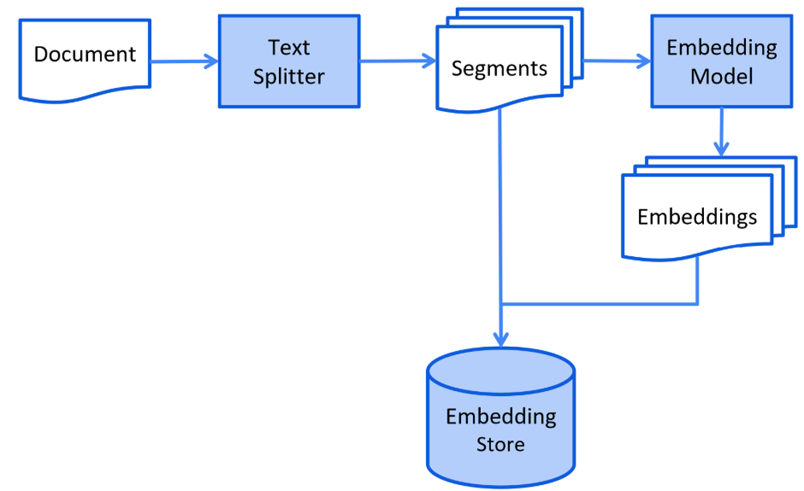

首先我们需要把最新的数据或者专业的数据存储到文档中，接下来借助于**文本分割器**把一个大的文档分割成一个一个小的文本片段，然后这些小的文本片段要使用一种专门的大模型——**向量模型**。之前我们介绍大模型的时候有讲过，不同的大模型擅长的领域不一样，有擅长文本处理的、有擅长图片处理的，其中就有一种大模型擅长**文本向量化**。借助于向量模型把一个一个的文本片段转换成向量，接下来把每一个向量和其对应的文本片段一块存储到向量数据库中。

为了大家更好的理解，我给大家举个例子。


比如我有一个大的文档，里面存储了一些文本信息，接下来借助于文本分割器把大的文档切割成一个一个的文本片段，比如这里切割为"我爱上班"、"上班真好"、"我爱工作"、"拒绝加班"、"我要躺平"这五个小片段。紧接着使用向量模型把文本片段转化为向量。我们之前聊过所谓的向量在坐标系中表示就是记录每一个轴的坐标，说白了就是一堆数字，最后再把每一个向量和其对应的文本片段组合成一条一条的数据存储到向量数据库中。

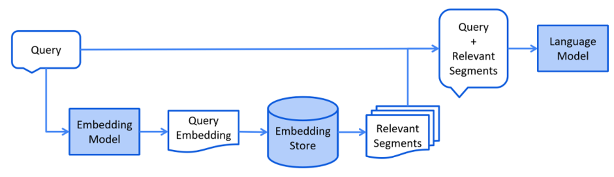

这样，就给大家介绍完了在 RAG 中往向量数据库中存储数据的过程。接下来给大家介绍一下如何从向量数据库中检索出跟用户问题相关的文本片段，这里同样是一副 LangChain4j 提供的流程图，用于说明整个检索过程的，我们简单的看一看。


用户提交的消息需要使用向量模型转换为向量，接下来拿着该向量和向量数据库中已经存在的向量进行比对，计算他们之间的余弦相似度，把满足要求的向量筛选出来得到其对应的文本片段，最后结合用户提交的消息和从向量数据库中检索到的文本片段，组织数据发送给大模型。

同样的，为了大家更好的理解我在这里也给大家举个例子。

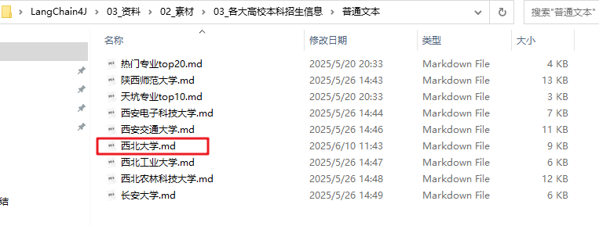

假如用户提交了一条消息"你爱上班吗？"接下来需要使用向量模型将这条消息转换成向量，其实得到的就是一组坐标数据。紧接着拿着该向量和向量数据库中的向量比对，计算余弦相似度，假设最终计算的结果分别为 `0.8、0.6、0.7、0.3、0.2`。之前我们讲过，两个向量的余弦相似度越大说明向量方向越接近，两点之间的距离越小。由于 RAG 中，向量都是由文本转换过来的，**不同文本对应的向量余弦相似度越大说明对应文本之间的距离越近，那么对应文本的相似度就越高**。也就是说该向量对应的文本片段跟用户问的问题相关度越高。

假设我设置一个标准：只有余弦相似度超过 **0.5** 的文本能被查出来。此时，"我爱上班"、"上班真好"、"我爱工作"这三个片段就被检索出来了，最后再把用户的问题和检索出来的这三个文本片段一并发送给大模型，让大模型生成结果即可。

截此为止，有关 RAG 知识库的原理就给大家解释完了，有了这个理解基础，接下来我们的操作你就会理解的更加透彻！

**⭐ ⭐ ⭐ ⭐ ⭐ 小结：**

1. <span style="color: red;"> 两个向量的余弦相似度越高，说明向量对应的文本相似度越高</span>
2. <span style="color: red;"> 向量数据库使用流程</span>
   1. 借助于向量模型，把文档知识数据向量化后存储到向量数据库
   2. 用户输入的内容，借助于向量模型转化为向量后，与数据库中的向量通过计算余弦相似度的方式，找出相似度比较高的文本片段


### 3.7.2 RAG 快速入门

要在我们的案例中通过 RAG 的方式增强大模型的生成能力，从而让我们能够查询出最新的 2024 年的录取分数，我们有两个工作要完成：**存储**和**检索**。


<span style="color: red;"> **⭐ ⭐ ⭐ ⭐ ⭐ 步骤:** </span>

1. 存储（构建向量数据库操作对象）
   - 引入依赖
     - 加载知识数据文档
     - 构建向量数据库操作对象
     - 把文档切割、向量化并存储到向量数据库中

2. 检索（构建向量数据库检索对象）

   - 构建向量数据库检索对象

   - 配置向量数据库检索对象

#### 3.7.2.1 存储

##### 3.7.2.1.1 引入依赖

这一块我们引入的依赖是 **`langchain4j-easy-rag`**，看名字我们就知道这是一个简易版本的 RAG 实现方案，这个依赖中提供了**内存版的向量数据库**和**向量模型**供我们使用。

```xml
<dependency>
    <groupId>dev.langchain4j</groupId>
    <artifactId>langchain4j-easy-rag</artifactId>
    <version>1.0.1-beta6</version>
</dependency>
```

##### 3.7.2.1.2 加载知识数据文档

**A.** 将资料中准备的《西北大学.pdf》拷贝到当前工程的 `resources/content` 目录下

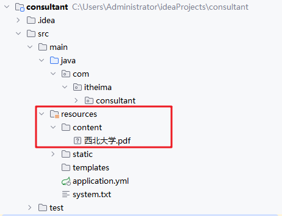

**B.** LangChain4j 提供的 **`ClassPathDocumentLoader`** 可以让我们快速的将指定目录下的文档加载进内存中，并且每一个文档，都会对应的生成一个 `Document` 对象来记录文档的内容。这一部分工作需要在 `CommonConfig.java` 中完成。

**CommonConfig.java**

```java
@Bean
public EmbeddingStore store(){
    //1.加载文档进内存
    List<Document> documents = ClassPathDocumentLoader.loadDocuments("content");
    return null;
}
```

##### 3.7.2.1.3 构建向量数据库操作对象 EmbeddingStore

其实在我们引入的依赖中已经提供了一个用于操作内存版本的向量数据库的类 **`InMemoryEmbeddingStore`**：

- **Inmemory** 是内存的意思
- **Embedding** 翻译过来是嵌入/向量的意思
- **Store** 是存储的意思

顾名思义，**操作内存向量数据库**。我们只要 new 出来一个对象即可。

**CommonConfig.java**

```java
@Bean
public EmbeddingStore store(){
    //1.加载文档进内存
    List<Document> documents = ClassPathDocumentLoader.loadDocuments("content");
    //2.构建向量数据库操作对象  操作的是内存版本的向量数据库
    InMemoryEmbeddingStore store = new InMemoryEmbeddingStore();
    return store;
}
```

##### 3.7.2.1.4 切割文档、向量化并存储到向量数据库

LangChain4j 中给我们提供了一个类 **`EmbeddingStoreIngestor`**，它把很多细节都封装起来了，可以帮我们快速的完成这一步的操作。

首先我们构建 `EmbeddingStoreIngestor` 对象，构建的时候告诉它我要把向量化的数据存储到哪里？也就是把第三步构建的 `EmbeddingStore` 设置给它。接下来调用它的 **`ingest` 方法**，把需要存储数据的文档对象 `documents` 给它传递进去。在这个方法的内部会使用它**内置的文本分割器**先分割，然后使用**内置的向量模型**完成向量化，最后再把向量存储到向量数据库中。

**CommonConfig.java**

```java
@Bean
public EmbeddingStore store(){
    //1.加载文档进内存
    List<Document> documents = ClassPathDocumentLoader.loadDocuments("content");
    //2.构建向量数据库操作对象  操作的是内存版本的向量数据库
    InMemoryEmbeddingStore store = new InMemoryEmbeddingStore();
    //3.构建一个EmbeddingStoreIngestor对象,完成文本数据切割,向量化, 存储
    EmbeddingStoreIngestor ingestor = EmbeddingStoreIngestor.builder()
            .embeddingStore(store)
            .build();
    ingestor.ingest(documents);
    return store;
}
```

#### 3.7.2.2 检索

##### 3.7.2.2.1 构建 ContentRetriever 对象

LangChain4j 提供的向量数据库检索对象叫做 **`EmbeddingStoreContentRetriever`**，构建的时候我们可以设置三个内容：

1. **`embeddingStore` 方法**：告诉它从哪里检索，其实就是我们刚才构建的这个 `InMemoryEmbeddingStore` 给它即可
2. **`minScore` 方法**：设置一下最小余弦相似度的值。之前我们讲过检索的时候会把用户的问题向量化，然后与向量数据库中已经存在的向量计算余弦相似度，值越大相似度越高。这里通过 `minScore` 方法设置一个最低的相似度分数，**可以确保检索出来的内容跟用户问题的相关度比较高**
3. **`maxResults` 方法**：设置一个最大检索出来的片段数量值。因为将来如果检索出来的片段太多，一并发送给大模型，**token 的消耗是比较大的**，而且分数低的片段你发送给大模型还会影响生成的结果。这里通过 `maxResults` 方法设置最大的片段数量后，它会保留分数最高的前几个片段使用
   1. 就是Top K


这些操作也是在 `CommonConfig.java` 中完成。

**CommonConfig.java**

```java
@Bean
public ContentRetriever contentRetriever(EmbeddingStore store){
    return EmbeddingStoreContentRetriever.builder()
            .embeddingStore(store)//设置向量数据库操作对象
            .minScore(0.5)//设置最小分数
            .maxResults(3)//设置最大片段数量
            .build();
}
```

##### 3.7.2.2.2 配置 ContentRetriever 对象

跟我们前面是类似的，在 `@AiService` 注解中借助于 **`contentRetriever`** 这个属性完成配置即可。

```java
@AiService(
        wiringMode = AiServiceWiringMode.EXPLICIT,//手动装配
        chatModel = "openAiChatModel",//指定模型
        streamingChatModel = "openAiStreamingChatModel",
        //chatMemory = "chatMemory",//配置会话记忆对象
        chatMemoryProvider = "chatMemoryProvider",//配置会话记忆提供者对象
        contentRetriever = "contentRetriever"//配置向量数据库检索对象
)
//@AiService
public interface ConsultantService {
    //用于聊天的方法
    //public String chat(String message);
    //@SystemMessage("你是东哥的助手小月月,人美心善又多金!")
    @SystemMessage(fromResource = "system.txt")
    //@UserMessage("你是东哥的助手小月月,人美心善又多金!{{it}}")
    //@UserMessage("你是东哥的助手小月月,人美心善又多金!{{msg}}")
    public Flux<String> chat(/*@V("msg")*/@MemoryId String memoryId, @UserMessage String message);
}
```

#### 3.7.2.3 测试

查询 AI 志愿填报顾问："西北大学 2024 年录取分数？" 已经可以正确的根据知识库的内容回答了。

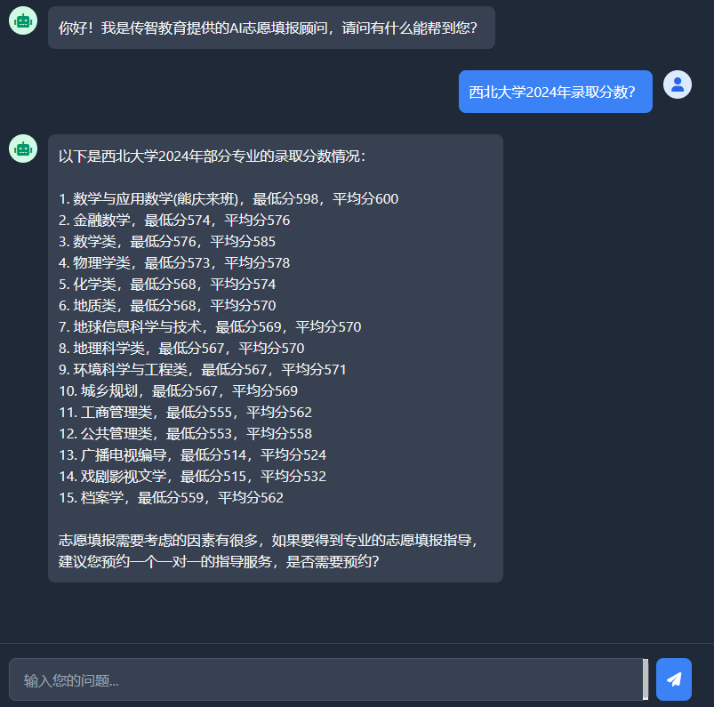

可以在 IDEA 的控制台查看日志，会发现发送给大模型的用户消息中，格式是这样的：

```
用户问题\n\nAnswer using the following information:\n检索出来的知识片段
```

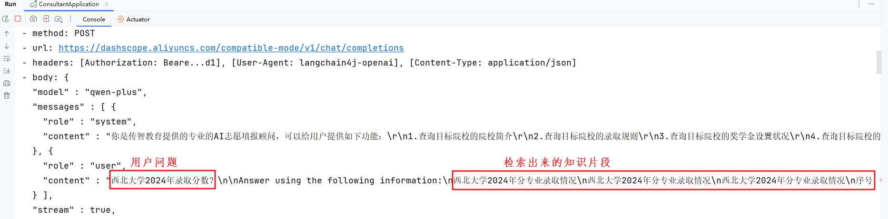

### 3.7.3 核心 API

为了梳理 RAG 的核心 API，我们再来回顾一下知识库的存储流程。


首先我们需要在项目中准备存储数据的文档，这些文档需要使用**文档加载器 Document Loader** 加载进内存。由于加载的过程中需要解析文档的内容，所以还要使用到**文档解析器**来解析文档的内容，最后在内存中生成一个一个的 `Document` 对象用于记录文档的内容。由于每个 `Document` 对象中记录的是对应文档中的全部内容，如果我们直接把整个文档的内容一次性向量化存储到向量数据库中，**不利于检索**，所以这些文档对象需要使用**文档分割器 Document Splitter** 分割成一个一个的文本片段，而每一个文本片段只是记录整个文档中的一小部分内容，这样将来根据用户问题检索相关片段的时候就会更精准。这些文本片段需要使用**向量模型**转化为一个一个向量。之前讲过其实就是一串一串的数字记录的是不同维度的坐标，LangChain4j 中提供了 **`Embedding` 对象**用于记录这些坐标，因此这里得到的是一个一个的 `Embedding` 对象。最后再使用 **`EmbeddingStore`** 这种向量数据库操作对象将向量和对应的文本片段存储到向量数据库中。

> ⭐ **核心 5 类 API**
> 在整个流程中，主要用到了**文档加载器、文档解析器、文档分割器、向量模型以及向量数据库操作对象**这五类 API。其中有关文档分割器、向量模型、还有向量数据库操作对象的具体方法的调用都被封装到了 `EmbeddingStoreIngestor` 中了，对于咱们来说无需过多关注，我们主要关注的是**使用哪种文档分割器、哪种向量模型、哪种向量数据库操作对象**即可，将来用哪种把哪种交给 `EmbeddingStoreIngestor` 就可以了。

#### 3.7.3.1 文档加载器

文档加载器的作用是**把磁盘或者网络中的数据加载进程序**。LangChain4j 给我们提供了多个文档加载器，其中常见的有以下三种：

- **`FileSystemDocumentLoader`**：根据本地磁盘绝对路径加载
- **`ClassPathDocumentLoader`**：相对于类路径加载
- **`UrlDocumentLoader`**：根据 URL 路径加载
- ……

大家可以把之前代码中的 `ClassPathDocumentLoader` 替换为 `FileSystemDocumentLoader` 做一个尝试。

```java
@Bean
public EmbeddingStore store(){
    //1.加载文档进内存
    //List<Document> documents = ClassPathDocumentLoader.loadDocuments("content");
    List<Document> documents = FileSystemDocumentLoader.loadDocuments("C:\\Users\\Administrator\\ideaProjects\\consultant\\src\\main\\resources\\content");
    //2.构建向量数据库操作对象  操作的是内存版本的向量数据库
    InMemoryEmbeddingStore store = new InMemoryEmbeddingStore();
    //3.构建一个EmbeddingStoreIngestor对象,完成文本数据切割,向量化, 存储
    EmbeddingStoreIngestor ingestor = EmbeddingStoreIngestor.builder()
            .embeddingStore(store)
            .build();
    ingestor.ingest(documents);
    return store;
}
```

#### 3.7.3.2 文档解析器

文档解析器就是用于**解析文档中的内容，把原本非纯文本数据转化成纯文本**。比如初始的文档是 PDF 格式的，它的内容就不是纯文本的，此时需要借助于文档解析器将非纯文本数据转化成纯文本。

在 LangChain4j 中提供了几个常用的文档解析器：

- **`TextDocumentParser`**：解析纯文本格式的文件
- **`ApachePdfBoxDocumentParser`**：解析 PDF 格式文件
- **`ApachePoiDocumentParser`**：解析微软的 Office 文件，例如 DOC、PPT、XLS
- **`ApacheTikaDocumentParser`**（默认）：几乎可以解析所有格式的文件

> 💡 由于默认的 `ApacheTikaDocumentParser` 虽然可以解析所有格式的文件，但是它可能在纯 PDF 文件方面的表现没有那么优秀，或者使用起来没有那么方便。此时我们可以将默认的解析器切换成 **`ApachePdfBoxDocumentParser`**，具体的操作如下：

**A.** 准备 PDF 格式的数据

将资料中准备的《西北大学.pdf》拷贝到 `resources/content` 目录下，**删除原来的《西北大学.md》**。

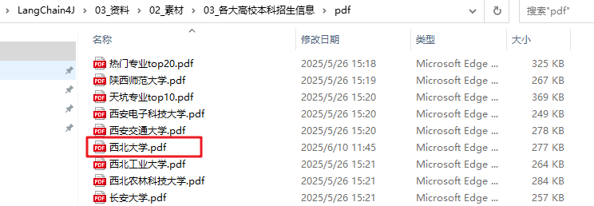

**B.** 引入依赖

**pom.xml**

```xml
<dependency>
    <groupId>dev.langchain4j</groupId>
    <artifactId>langchain4j-document-parser-apache-pdfbox</artifactId>
    <version>1.0.1-beta6</version>
 </dependency>
```

**C.** 指定解析器

```java
@Bean
public EmbeddingStore store(){
    //1.加载文档进内存
    //List<Document> documents = ClassPathDocumentLoader.loadDocuments("content");
    //加载文档的时候指定解析器
    List<Document> documents = ClassPathDocumentLoader.loadDocuments("content",new ApachePdfBoxDocumentParser());
    //2.构建向量数据库操作对象  操作的是内存版本的向量数据库
    InMemoryEmbeddingStore store = new InMemoryEmbeddingStore();
    //3.构建一个EmbeddingStoreIngestor对象,完成文本数据切割,向量化, 存储
    EmbeddingStoreIngestor ingestor = EmbeddingStoreIngestor.builder()
            .embeddingStore(store)
            .build();
    ingestor.ingest(documents);
    return store;
}
```

#### 3.7.3.3 文档分割器

文档分割器主要用于**把一个大的文档切割成一个一个的小片段**。在 LangChain4j 中提供了多种文档分割器，大概有以下 7 种：

- **`DocumentByParagraphSplitter`**：按照段落分割文本
- **`DocumentByLineSplitter`**：按照行分割文本
- **`DocumentBySentenceSplitter`**：按照句子分割文本
- **`DocumentByWordSplitter`**：按照词分割文本
- **`DocumentByCharacterSplitter`**：按照固定数量的字符分割文本
- **`DocumentByRegexSplitter`**：按照正则表达式分割文本
- **`DocumentSplitters.recursive(…)`**（默认）：递归分割器，优先段落分割，再按照行分割，再按照句子分割，再按照词分割


先说第一种**按照段落分割文本**，举个例子，假设我们文本中的内容是一篇散文，总共由 6 个段落组成。

那么 `DocumentByParagraphSplitter` 就会把文档分割成 6 个部分，但是**这里大家要注意的是这每一部分并不是将来进行向量化的文本片段**，文本片段是根据这 6 部分的内容组合而成的。通常情况下 LangChain4j 是允许我们指定文本片段的字符容量的，假设我指定单个文本片段的字符容量为 300，那么在组合文本片段的时候，第一部分的自然段和第二部分的自然段的字符总和不到 300，可以放到同一个文本片段中，但是加上第三部分的自然段，字符总和超过了 300，那么第三部分的自然段就不能再放到这个文本片段中了，而是放到下一个新的文本片段中。

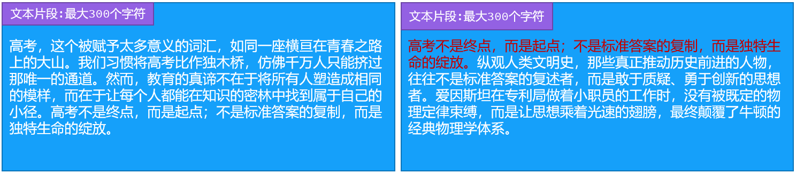

当然除了按照段落分割文本，LangChain4j 还提供了按行分割、按句子分割、按单词分割、按固定数量的字符分割等等不同方式的文档分割器，都可以使用。这里我们关注一下最后一种文本分割器，它是通过一个静态方法 `recursive` 创建出来的，叫做**递归分割器**，它组合了段落分割器、行分割器、句子分割器以及词分割器，它会按照优先级进行分割文档：**先按照段落分割，再按照行，再按照句子，最后按照词**。有什么用呢？

咱们刚才按段落分割，第三个自然段是不是放不下了？此时如果是递归分割器的话它会继续使用行分割器，把第三个自然段进一步分割，尝试把得到的内容放到当前文本片段中，如果还是不行，再按照句子分割，这就是它的作用。

咱们默认使用的也是这种递归分割器，**默认使用的单个文本最大字符个数就是 300**。当然了，我不想使用这个默认的切割器，我觉得 300 个字符太少了，我想多设置一点儿，行不行呢？也可以，接下来我们看应该如何操作。

##### 3.7.3.3.1 构建文本分割器对象

```java
DocumentSplitter documentSplitter = DocumentSplitters.recursive(
  每个片段最大容纳的字符,
  两个片段之间重叠字符的个数
);
```

构建的时候需要指定**每个片段最大容纳的字符数量**和**两个片段之间重叠字符的个数**。第一个好理解，给大家解释一下第二个是什么意思。

> 💡 **重叠字符的作用**
> 假如我有一篇以"高考"为题目的散文需要存储到向量数据库中，将来分割后得到的两个文本片段，第一个片段里写到"高考....."，而第二个片段中完全没有出现"高考"相关的字眼，那到时候我去检索"高考"相关的内容时第二个片段将不会被检索出来，但实质上按照语义它是应该被检索出来的。
> 我们解决的办法就是**让两个片段存储的内容有重叠的部分**，上一个片段的末尾与下一个片段的开头重复，这样就可以保持**语义的连贯性**了。比如我把"高考不是重点，而是起点..."这句话存储到第二个片段的开头就能解决这个问题。咱们第二个参数就是用于指定重叠部分字符的数量。

##### 3.7.3.3.2 配置文本分割器对象

真正分割文本的操作被封装到 `EmbeddingStoreIngestor` 中了，所以我们需要在构建该对象的时候，通过 **`documentSplitter` 方法**告诉它将来使用哪个文本分割器。

**CommonConfig.java**

```java
@Bean
public EmbeddingStore store(){
    //1.加载文档进内存
    //List<Document> documents = ClassPathDocumentLoader.loadDocuments("content");
    //加载文档的时候指定解析器
    List<Document> documents = ClassPathDocumentLoader.loadDocuments("content",new ApachePdfBoxDocumentParser());
    //2.构建向量数据库操作对象  操作的是内存版本的向量数据库
    InMemoryEmbeddingStore store = new InMemoryEmbeddingStore();
    //构建文档分割器对象
    DocumentSplitter ds = DocumentSplitters.recursive(500,100);
    //3.构建一个EmbeddingStoreIngestor对象,完成文本数据切割,向量化, 存储
    EmbeddingStoreIngestor ingestor = EmbeddingStoreIngestor.builder()
            .embeddingStore(store)
            .documentSplitter(ds)
            .build();
    ingestor.ingest(documents);
    return store;
}
```

#### 3.7.3.4 向量模型

向量模型的作用是**把分割后的文本片段向量化或者把用户消息向量化**。

**EmbeddingModel.java**

```java
public interface EmbeddingModel {
    default Response<Embedding> embed(String text) {
        return this.embed(TextSegment.from(text));
    }

    default Response<Embedding> embed(TextSegment textSegment) {
    }

    Response<List<Embedding>> embedAll(List<TextSegment> texts);

    default int dimension() {
        return ((Embedding)this.embed("test").content()).dimension();
    }
 }
```

LangChain4j 中提供了 **`EmbeddingModel` 接口**用于定义有关向量模型的方法，例如有 `embed`、`embedAll` 等等方法用于把文本片段向量化。LangChain4j 提供了一个内存版本的向量模型实现方案，而咱们快速入门中使用的就是这个向量模型，只是咱们当时并没有指定这个向量模型，因为它被封装到 `EmbeddingStoreIngestor` 中了，所以我们并没有看到。

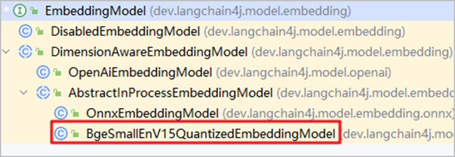

但是这种内置的向量模型有时候功能没有那么强大，说白了就是**支持的向量维度太少，检索的时候没有那么精准**，所以有些情况下我们需要替换它，使用一些功能更强大的向量模型。阿里云百炼平台也提供了专门用于向量化的向量模型 **`text-embedding-v3`**，接下来我们看应该如何把我们程序中内存版本的向量模型替换成阿里云百炼提供的向量模型。

##### 3.7.3.4.1 配置向量模型

和咱们之前配置文本模型类似，只不过这里不再是 `chat-model` 或者 `streaming-chat-model`，而是 **`embedding-model`**。其它的配置一样，也需要配置 url、apikey、modelname 以及日志相关的配置。

```yaml
langchain4j:
  open-ai:
    embedding-model:
      base-url: https://dashscope.aliyuncs.com/compatible-mode/v1
      api-key: ${API-KEY}
      model-name: text-embedding-v3
      log-requests: true
      log-responses: true
```

##### 3.7.3.4.2 设置向量模型

当我们配置完毕后，LangChain4j 会自动的根据我们的配置信息往 IOC 容器中注入一个 `EmbeddingModel` 对象供我们使用。所以接下来我们只需要把这个 `EmbeddingModel` 对象交给 `EmbeddingStoreIngestor` 和 `EmbeddingStoreContentRetriever` 即可，**一个是存储的时候使用，一个是检索的时候使用**。

**CommonConfig.java**

```java
@Autowired
private EmbeddingModel embeddingModel;

@Bean
public EmbeddingStore store(){
    //1.加载文档进内存
    //List<Document> documents = ClassPathDocumentLoader.loadDocuments("content");
    //加载文档的时候指定解析器
    List<Document> documents = ClassPathDocumentLoader.loadDocuments("content",new ApachePdfBoxDocumentParser());
    //2.构建向量数据库操作对象  操作的是内存版本的向量数据库
    InMemoryEmbeddingStore store = new InMemoryEmbeddingStore();
    //构建文档分割器对象
    DocumentSplitter ds = DocumentSplitters.recursive(500,100);
    //3.构建一个EmbeddingStoreIngestor对象,完成文本数据切割,向量化, 存储
    EmbeddingStoreIngestor ingestor = EmbeddingStoreIngestor.builder()
            .embeddingStore(store)
            .documentSplitter(ds)
            .embeddingModel(embeddingModel)
            .build();
    ingestor.ingest(documents);
    return store;
}

@Bean
public ContentRetriever contentRetriever(EmbeddingStore store){
    return EmbeddingStoreContentRetriever.builder()
            .embeddingStore(store)
            .minScore(0.5)
            .maxResults(3)
            .embeddingModel(embeddingModel)
            .build();
}
```

测试的时候大家可以查看 IDEA 控制台的日志，确保替换完成。

#### 3.7.3.5 向量数据库操作对象 EmbeddingStore

`EmbeddingStore` 是用来操作向量数据库的 API，将来不管是存储还是检索都需要借助于它来完成。LangChain4j 提供的 `EmbeddingStore` 接口中提供了两组方法：

- **`add`**：用于存储数据
- **`search`**：用于检索数据

**EmbeddingStore.java**

```java
public interface EmbeddingStore<Embedded> {
    String add(Embedding embedding);

    void add(String text, Embedding embedding);

    String add(Embedding embedding, Embedded embedded);

    List<String> addAll(List<Embedding> embeddings);

    EmbeddingSearchResult<Embedded> search(EmbeddingSearchRequest request);
}
```


同时 LangChain4j 还提供了一个实现方案 `InMemoryEmbeddingStore`，也就是咱们之前一直使用的方案，但是它操作的是**内存向量数据库**，有些情况下不能满足实际开发中的需求。大家可以想一下：

> ⚠️ **内存方案的问题**
> 1. 如果我们使用内存向量数据库，**一旦服务器重启数据就丢失了**，又得重新加载文档、重新向量化，这样每次启动都会比较耗时
> 2. **每次启动都会使用百炼平台提供的向量模型完成向量化，它是收费的**，每次都这么干那是跟钱过不去，没必要对吧

所以咱们得考虑把向量化后的数据存储到外部的向量数据库中。之前给大家介绍过常见的向量数据库有 Milvus、Chroma、Pinecone、RediSearch 以及 pgvector，用哪一种都行，LangChain4j 对这些向量数据库都做了支持。**咱们本次课程中采用 RediSearch 存储向量数据**。接下来我们看看具体的操作。

##### 3.7.3.5.1 准备向量数据库 RediSearch

这一块我们依然使用 docker 来部署 RediSearch，由于 RediSearch 是 Redis 扩展的一个功能，所以我们得把之前部署的 Redis 先卸载掉，然后部署一个扩展了 RediSearch 的 Redis 即可。这里我们需要执行三条命令：

**安装 Redis**

```bash
docker stop redis # 停止原有的redis镜像
docker rm redis #删除原有的redis镜像
docker run --name redis-vector -d -p 6379:6379 redislabs/redisearch #安装扩展redisearch功能的redis
```

##### 3.7.3.5.2 引入依赖

**pom.xml**

```xml
<dependency>
    <groupId>dev.langchain4j</groupId>
    <artifactId>langchain4j-community-redis-spring-boot-starter</artifactId>
    <version>1.0.1-beta6</version>
</dependency>
```

##### 3.7.3.5.3 配置向量数据库连接信息

> ⚠️ 大家要注意的是这里的配置和我们之前配置的 redis **不相干**，这里配置的是 `langchain4j.community` 下的，而之前配置的是 `spring.data` 下的。

**application.yml**

```yaml
langchain4j:
  community:
    redis:
      host: localhost
      port: 6379
```

当引入的起步依赖检测我们这一段配置信息后，会自动的往 IOC 容器中注入一个 **`RedisEmbeddingStore` 对象**，这个对象实现了 `EmbeddingStore` 接口，封装了操作 RediSearch 的 API，我们可以直接使用。

##### 3.7.3.5.4 注入 RedisEmbeddingStore 对象使用

和之前一样，将 IOC 容器中的 `RedisEmbeddingStore` 对象分别设置给 `EmbeddingStoreIngestor` 和 `EmbeddingStoreContentRetriever`，用于存储和检索。

**CommonConfig.java**

```java
@Autowired
private RedisEmbeddingStore redisEmbeddingStore;

@Bean
public EmbeddingStore store(){//embeddingStore的对象, 这个对象的名字不能重复,所以这里使用store
    //1.加载文档进内存
    //List<Document> documents = ClassPathDocumentLoader.loadDocuments("content");
    List<Document> documents = ClassPathDocumentLoader.loadDocuments("content",new ApachePdfBoxDocumentParser());
    //List<Document> documents = FileSystemDocumentLoader.loadDocuments("C:\\Users\\Administrator\\ideaProjects\\consultant\\src\\main\\resources\\content");
    //2.构建向量数据库操作对象  操作的是内存版本的向量数据库
    //InMemoryEmbeddingStore store = new InMemoryEmbeddingStore();

    //构建文档分割器对象
    DocumentSplitter ds = DocumentSplitters.recursive(500,100);
    //3.构建一个EmbeddingStoreIngestor对象,完成文本数据切割,向量化, 存储
    EmbeddingStoreIngestor ingestor = EmbeddingStoreIngestor.builder()
            //.embeddingStore(store)
            .embeddingStore(redisEmbeddingStore)
            .documentSplitter(ds)
            .embeddingModel(embeddingModel)
            .build();
    ingestor.ingest(documents);
    return redisEmbeddingStore;
}

@Bean
public ContentRetriever contentRetriever(/*EmbeddingStore store*/){
    return EmbeddingStoreContentRetriever.builder()
            .embeddingStore(redisEmbeddingStore)
            .minScore(0.5)
            .maxResults(3)
            .embeddingModel(embeddingModel)
            .build();
}
```

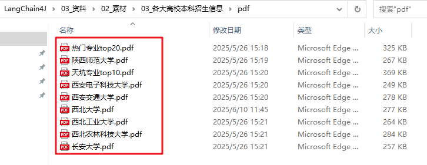


**⭐⭐⭐⭐⭐因为百炼的向量模型对片段有限制，一次最多划分10个片段，超过10个会报错，解决办法就是：**

* 告诉LangChain4j一次最多划分10个片段，如果一次划分不完就多划分几次。加个max-segments-per-batch: 10即可

  ~~~yaml
  langchain4j:
    open-ai:
      embedding-model:
        base-url: https://dashscope.aliyuncs.com/compatible-mode/v1
        api-key: sk-255506ca196b48f38e686b3e82efac58
        model-name: text-embedding-v4
        log-requests: true
        log-responses: true
        max-segments-per-batch: 10
  ~~~

  


### 3.7.4 收尾工作

#### 3.7.4.1 完整知识库

将资料中提供的所有 PDF 文档，全部拷贝到 `resources/content` 目录下，重新启动测试，让向量数据库保存所有的数据。

#### 3.7.4.2 避免每次启动程序都做向量化的操作

由于咱们准备向量数据库的操作是在 `CommonConfig` 配置类中完成的，在该类中我们提供了一个 `store` 方法，方法上添加了一个 `@Bean` 注解，所以每次启动程序，该方法都会执行一遍，文档就会重新加载，重新向量化，**不合适**。

所以当我们把所有文档拷贝到 `content` 目录中，启动测试一遍后，Redis 中就已经存好了所有的数据，接下来**把 `store` 方法上的 `@Bean` 注解注释掉**，可以避免每次启动都做向量化的操作。

**CommonConfig.java**

```java
//@Bean
public EmbeddingStore store(){
    //.......
    return redisEmbeddingStore;
}
```

---

## 3.8 Tools 工具

在咱们的 AI 志愿填报顾问中，将来要做这么一个功能：**每次回答完用户的问题后，都会在答案的最后附上这么一句话**：

> 志愿填报需要考虑的因素有很多，如果要得到专业的志愿填报指导，建议您预约一个一对一的指导服务，是否需要预约?

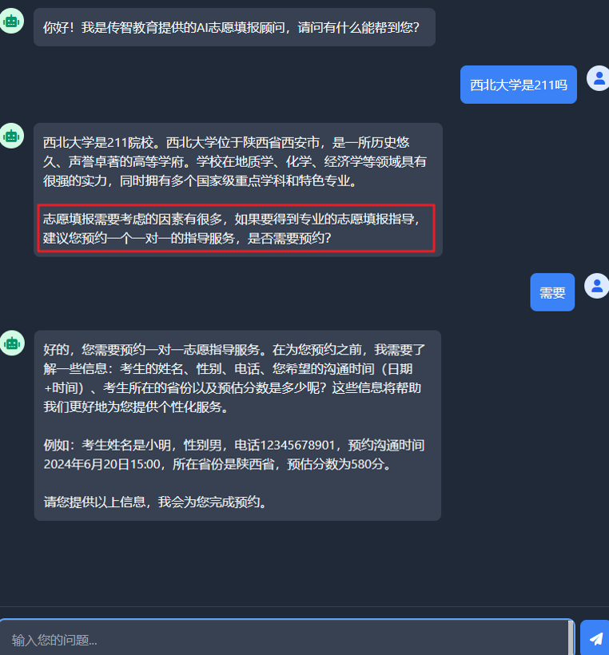

当用户表达出需要预约的意愿并提交了**姓名、性别、电话**等信息后，我们的程序就需要数据库中添加一条信息，记录预约详情。

所以开发这个功能的前提是我们得先准备好 MySQL 数据库环境，把 CRUD 的代码开发好，将来当用户提交了考生信息后才能调用这些代码往数据库中添加数据。

### 3.8.1 准备工作

#### 3.8.1.1 准备数据库环境

这里依然采用 docker 部署，执行下面这条命令安装并运行 MySQL（**注意，这里 Windows 系统下映射了 3307 端口**）：

```bash
docker run --name mysql -d -p 3307:3306 -e MYSQL_ROOT_PASSWORD=1234 mysql
```

同时需要把资料中提供的 SQL 脚本执行一下，导入到安装的 MySQL 中，SQL 如下：

**volunteer.sql**

```sql
create database  if  not exists volunteer;
use volunteer;
create table if not exists reservation
(
    id                 bigint  primary key auto_increment   not null comment '主键ID',
    name               varchar(50) not null comment '考生姓名',
    gender             varchar(2)  not null comment '考生性别',
    phone              varchar(20) not null comment '考生手机号',
    communication_time datetime    not null comment '沟通时间',
    province           varchar(32) not null comment '考生所处的省份',
    estimated_score    int         not null comment '考生预估分数'
)
```

#### 3.8.1.2 引入依赖

**pom.xml**

```xml
<dependency>
    <groupId>org.projectlombok</groupId>
    <artifactId>lombok</artifactId>
 </dependency>

<dependency>
    <groupId>org.mybatis.spring.boot</groupId>
    <artifactId>mybatis-spring-boot-starter</artifactId>
    <version>3.0.3</version>
 </dependency>

<dependency>
    <groupId>com.mysql</groupId>
    <artifactId>mysql-connector-j</artifactId>
</dependency>
```

#### 3.8.1.3 配置数据库连接信息

**application.yml**

```yaml
spring:
  datasource:
    username: root
    password: 1234
    url: jdbc:mysql://localhost:3307/volunteer?useUnicode=true&characterEncoding=utf-8&useSSL=false&serverTimezone=Asia/Shanghai&allowPublicKeyRetrieval=true
    driver-class-name: com.mysql.cj.jdbc.Driver

mybatis:
  configuration:
    map-underscore-to-camel-case: true
```

#### 3.8.1.4 准备实体类

**Reservation.java**

```java
import lombok.AllArgsConstructor;
import lombok.Data;
import lombok.NoArgsConstructor;

import java.time.LocalDateTime;

@Data
@NoArgsConstructor
@AllArgsConstructor
public class Reservation {
    private Long id;
    private String name;
    private String gender;
    private String phone;
    private LocalDateTime communicationTime;
    private String province;
    private Integer estimatedScore;
}
```

#### 3.8.1.5 开发 Mapper

**ReservationMapper.java**

```java
import com.itheima.consultant.pojo.Reservation;
import org.apache.ibatis.annotations.Insert;
import org.apache.ibatis.annotations.Mapper;
import org.apache.ibatis.annotations.Select;

@Mapper
public interface ReservationMapper {

    //1.添加预约信息
    @Insert("insert into reservation(name,gender,phone,communication_time,province,estimated_score) values(#{name},#{gender},#{phone},#{communicationTime},#{province},#{estimatedScore})")
    void insert(Reservation reservation);
    //2.根据手机号查询预约信息
    @Select("select * from reservation where phone=#{phone}")
    Reservation findByPhone(String phone);

}
```

#### 3.8.1.6 开发 Service

**ReservationService.java**

```java
import com.itheima.consultant.mapper.ReservationMapper;
import com.itheima.consultant.pojo.Reservation;
import org.springframework.beans.factory.annotation.Autowired;
import org.springframework.stereotype.Service;

@Service
public class ReservationService {
    @Autowired
    private ReservationMapper reservationMapper;

    //1.添加预约信息的方法
    public void insert(Reservation reservation) {
        reservationMapper.insert(reservation);
    }

    //2.查询预约信息的方法(根据手机号查询)
    public Reservation findByPhone(String phone) {
        return reservationMapper.findByPhone(phone);
    }
}
```

#### 3.8.1.7 测试

**ReservationServiceTest.java**

```java
import com.itheima.consultant.pojo.Reservation;
import com.itheima.consultant.service.ReservationService;
import org.junit.jupiter.api.Test;
import org.springframework.beans.factory.annotation.Autowired;
import org.springframework.boot.test.context.SpringBootTest;

import java.time.LocalDateTime;

@SpringBootTest
public class ReservationServiceTest {
    @Autowired
    private ReservationService reservationService;
    //测试添加
    @Test
    void testInsert(){
        Reservation reservation = new Reservation(null, "小王", "男", "13800000001", LocalDateTime.now(), "上海", 580);
        reservationService.insert(reservation);
    }
    //测试查询
    @Test
    void testFindByPhone(){
        String phone = "13800000001";
        Reservation reservation = reservationService.findByPhone(phone);
        System.out.println(reservation);
    }
}
```

### 3.8.2 Tools 工具原理

**Tools 工具**，以前也叫做 **function calling**，翻译过来叫做**函数调用**。如果在我们的程序中添加了 function calling 功能，那整个工作流程会发生一些改变，我们简单的看一看。

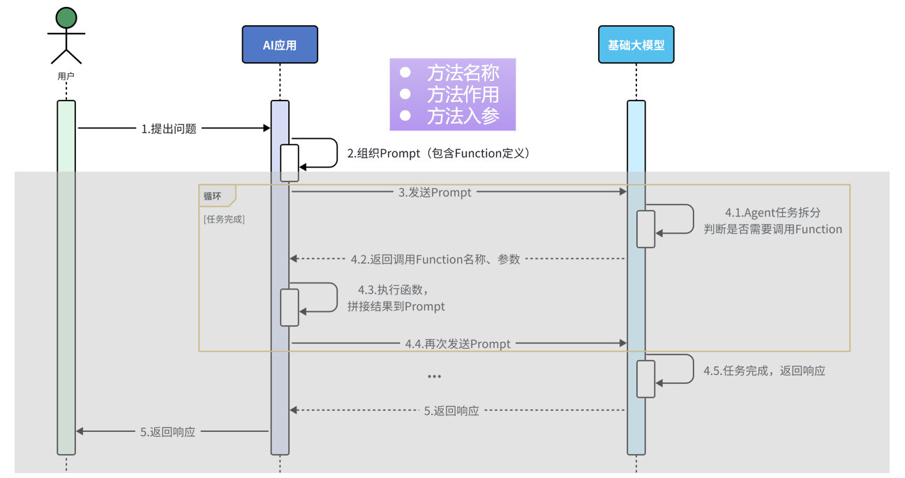

当用户把问题发送给 AI 应用，在 AI 应用的内部需要组织提交给大模型的数据，而这些数据中需要描述清楚我们的 AI 应用中有哪些函数能够被大模型调用。**每一个函数的描述都包含三个部分：**

- **方法名称**
- **方法作用**
- **方法入参**

当 AI 应用把这些数据发送给大模型后，大模型会先根据用户的问题以及上下文**拆解任务**，从而判断是否需要调用函数。如果有函数需要调用，则把需要调用的函数的名称，以及调用时需要使用的参数准备好一并响应给 AI 应用。AI 应用接收到响应后需要执行对应的函数，得到对应的结果，接下来把得到的结果和之前信息一块组织好再发送给大模型。

> ⚠️ 这里需要注意的是由于在一次任务的处理过程中**可能需要根据顺序调用多个函数**，所以当大模型接收到 AI 应用发送的数据继续拆解任务，如果发现还需要调用其他的函数，则会重复 4.1~4.4 这几个步骤，直到无需调用函数，最终把生成的结果响应该 AI 应用，并由 AI 应用发送给用户。

这就是增加了 function calling 或者 Tools 工具后整个 AI 应用的工作流程，比之前要复杂不少，不过好消息是下面的这些工作 **LangChain4j 都能帮我们自动的完成**，对于咱们来说只需要按照 LangChain4j 的规则描述清楚有哪些方法可以被大模型调用，方法名的名字是什么、有什么作用、以及都需要哪些参数？

#### 3.8.2.1 准备工具方法

LangChain4j 提供了：

- **`@Tool` 注解**：用于对方法的作用进行描述
- **`@P` 注解**：用于对方法的参数进行描述

将来 LangChain4j 就能通过反射的方式获取到 `@Tool` 注解中的作用描述、`@P` 注解中的参数描述、以及方法的名称，组织数据一并发送给大模型。

> ⚠️ 这里需要注意，`ReservationTool` 需要**注入到 IOC 容器对象中**。

**ReservationTool.java**

```java
import com.itheima.consultant.pojo.Reservation;
import com.itheima.consultant.service.ReservationService;
import dev.langchain4j.agent.tool.P;
import dev.langchain4j.agent.tool.Tool;
import org.springframework.beans.factory.annotation.Autowired;
import org.springframework.stereotype.Component;

import java.time.LocalDateTime;

@Component
public class ReservationTool {
    @Autowired
    private ReservationService reservationService;

    //1.工具方法: 添加预约信息
    @Tool("预约志愿填报服务")
    public void  addReservation(
            @P("考生姓名") String name,
           @P("考生性别") String gender,
            @P("考生手机号") String phone,
            @P("预约沟通时间,格式为: yyyy-MM-dd'T'HH:mm") String communicationTime,
            @P("考生所在省份") String province,
            @P("考生预估分数") Integer estimatedScore
    ){
        Reservation reservation = new Reservation(null,name,gender,phone, LocalDateTime.parse(communicationTime),province,estimatedScore);
        reservationService.insert(reservation);
    }
    //2.工具方法: 查询预约信息
    @Tool("根据考生手机号查询预约单")
    public Reservation findReservation(@P("考生手机号") String phone){
        return reservationService.findByPhone(phone);
    }
}
```

#### 3.8.2.2 配置工具方法

配置的方法和之前的类似，在 `@AiService` 注解中过一个叫做 **`tools`** 的属性完成配置，值写上包含了工具方法的 Bean 对象的名字即可。

**ConsultantService.java**

```java
@AiService(
        wiringMode = AiServiceWiringMode.EXPLICIT,//手动装配
        chatModel = "openAiChatModel",//指定模型
        streamingChatModel = "openAiStreamingChatModel",
        //chatMemory = "chatMemory",//配置会话记忆对象
        chatMemoryProvider = "chatMemoryProvider",//配置会话记忆提供者对象
        contentRetriever = "contentRetriever",//配置向量数据库检索对象
        tools = "reservationTool"
)
//@AiService
public interface ConsultantService {
    //用于聊天的方法
    //public String chat(String message);
    //@SystemMessage("你是东哥的助手小月月,人美心善又多金!")
    @SystemMessage(fromResource = "system.txt")
    //@UserMessage("你是东哥的助手小月月,人美心善又多金!{{it}}")
    //@UserMessage("你是东哥的助手小月月,人美心善又多金!{{msg}}")
    public Flux<String> chat(/*@V("msg")*/@MemoryId String memoryId, @UserMessage String message);
}
```

功能已经实现完毕了，测试的时候注意观察 IDEA 控制台的信息，**LangChain4j 给大模型发送消息的时候会使用 `tools` 参数告诉大模型，有哪些函数可以调用**。

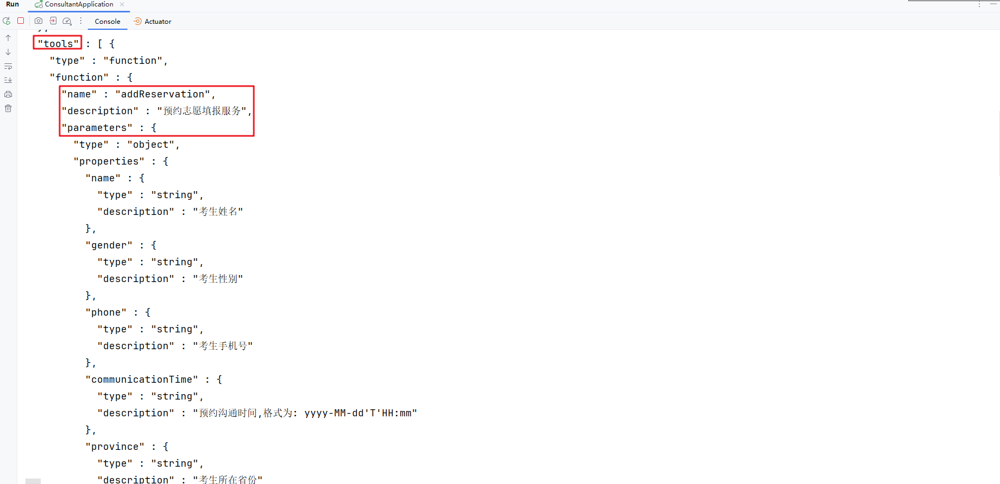
