# Docker

> **Docker —— 快速构建、运行、管理应用的工具。**
>
> 本文按官方课程结构整理，覆盖 **安装 Docker、快速入门、Docker 基础、项目部署** 四大部分。

## 目录

- [一、安装 Docker](#一安装-docker)
  - [1.1 卸载旧版](#11-卸载旧版)
  - [1.2 配置 Docker 的 yum 库](#12-配置-docker-的-yum-库)
  - [1.3 安装 Docker](#13-安装-docker)
  - [1.4 启动和校验](#14-启动和校验)
  - [1.5 配置镜像加速](#15-配置镜像加速)
- [二、快速入门](#二快速入门)
  - [2.1 为什么需要 Docker](#21-为什么需要-docker)
  - [2.2 部署 MySQL](#22-部署-mysql)
  - [2.3 镜像与容器](#23-镜像与容器)
  - [2.4 命令解读](#24-命令解读)
  - [2.5 镜像命名规范](#25-镜像命名规范)
- [三、Docker 基础](#三docker-基础)
  - [3.1 常见命令](#31-常见命令)
  - [3.2 数据卷](#32-数据卷)
  - [3.3 自定义镜像](#33-自定义镜像)
  - [3.4 网络](#34-网络)
- [四、项目部署](#四项目部署)
  - [4.1 部署 Java 应用](#41-部署-java-应用)
  - [4.2 部署前端](#42-部署前端)
  - [4.3 Docker Compose](#43-docker-compose)

---

# 一、安装 Docker

## 1.1 卸载旧版

首先如果系统中已经存在旧的 Docker，则先卸载：

```Shell
yum remove docker \
    docker-client \
    docker-client-latest \
    docker-common \
    docker-latest \
    docker-latest-logrotate \
    docker-logrotate \
    docker-engine \
    docker-selinux 
```

## 1.2 配置 Docker 的 yum 库

首先要安装一个 yum 工具

```Bash
sudo yum install -y yum-utils device-mapper-persistent-data lvm2
```

安装成功后，执行命令，配置 Docker 的 yum 源（已更新为阿里云源）：

```Bash
sudo yum-config-manager --add-repo https://mirrors.aliyun.com/docker-ce/linux/centos/docker-ce.repo

sudo sed -i 's+download.docker.com+mirrors.aliyun.com/docker-ce+' /etc/yum.repos.d/docker-ce.repo
```

更新 yum，建立缓存

```Bash
sudo yum makecache fast
```

## 1.3 安装 Docker

最后，执行命令，安装 Docker

```Bash
yum install -y docker-ce docker-ce-cli containerd.io docker-buildx-plugin docker-compose-plugin
```

## 1.4 启动和校验

```Bash
# 启动 Docker
systemctl start docker

# 停止 Docker
systemctl stop docker

# 重启
systemctl restart docker

# 设置开机自启
systemctl enable docker

# 执行 docker ps 命令，如果不报错，说明安装启动成功
docker ps
```

## 1.5 配置镜像加速

镜像地址可能会变更，如果失效可以百度找最新的 docker 镜像。

配置镜像步骤如下：

```Bash
# 创建目录
mkdir -p /etc/docker

# 复制内容
tee /etc/docker/daemon.json <<-'EOF'
{
  "registry-mirrors": [
    "https://docker.xuanyuan.me",
    "https://docker.1ms.run",
    "https://docker.m.daocloud.io"
  ]
}
EOF

# 重新加载配置
systemctl daemon-reload

# 重启 Docker
systemctl restart docker
```

---

# 二、快速入门

## 2.1 为什么需要 Docker

在传统方式下，安装一个 MySQL 往往要经历**卸载旧版本 → 上传安装包 → 解压 → 逐个 rpm 安装依赖 → 安装服务端**等一长串步骤：

```bash
# 查看并卸载已安装的 MySQL/MariaDB
[root@heima ~]# rpm -qa | grep mysql
[root@heima ~]# rpm -qa | grep mariadb
mariadb-libs-5.5.68-1.el7.x86_64
[root@heima ~]# rpm -e --nodeps mariadb-libs-5.5.68-1.el7.x86_64

# 上传并解压 MySQL
[root@heima ~]# mkdir /usr/local/mysql
[root@heima ~]# tar -zxvf mysql-5.7.25-1.el7.x86_64.rpm-bundle.tar.gz -C /usr/local/mysql

# 逐个安装 rpm 包
[root@heima ~]# rpm -ivh mysql-community-common-5.7.25-1.el7.x86_64.rpm
[root@heima ~]# rpm -ivh mysql-community-libs-5.7.25-1.el7.x86_64.rpm
[root@heima ~]# rpm -ivh mysql-community-devel-5.7.25-1.el7.x86_64.rpm
[root@heima ~]# rpm -ivh mysql-community-libs-compat-5.7.25-1.el7.x86_64.rpm
[root@heima ~]# rpm -ivh mysql-community-client-5.7.25-1.el7.x86_64.rpm
[root@heima ~]# yum install net-tools
[root@heima ~]# yum install openssl-devel -y
[root@heima ~]# rpm -ivh mysql-community-server-5.7.25-1.el7.x86_64.rpm
```

> ❌ **传统安装的痛点**：命令太多记不住、安装包太多不知道去哪里下、安装步骤太复杂容易出错！

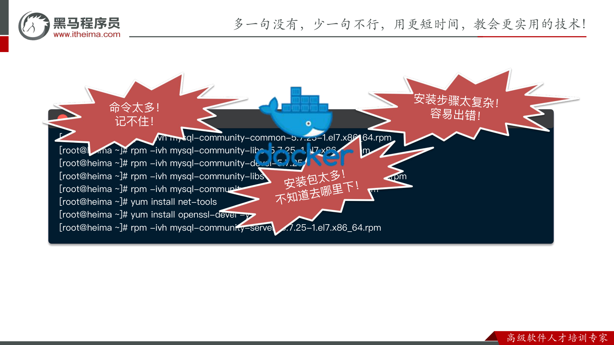

而使用 Docker，**一行命令**就能完成安装与启动（自动下载镜像、创建并运行容器）：

```bash
docker run -d --name ms -p 3306:3306 -e MYSQL_ROOT_PASSWORD=123456 mysql:8.0
# Unable to find image 'mysql:latest' locally
# latest: Pulling from library/mysql
# ...
# Status: Downloaded newer image for mysql:latest
```

---

## 2.2 部署 MySQL

先停掉虚拟机中的 MySQL，**确保虚拟机已经安装 Docker，且网络已开通**的情况下，执行下面命令即可安装 MySQL：

```bash
docker run -d \
  --name mysql \
  -p 3306:3306 \
  -e TZ=Asia/Shanghai \
  -e MYSQL_ROOT_PASSWORD=123456 \
  mysql:8.0
```

---

## 2.3 镜像与容器

当我们利用 Docker 安装应用时，Docker 会**自动搜索并下载应用镜像（image）**。镜像不仅包含应用本身，还包含应用运行所需要的**环境、配置、系统函数库**。Docker 会在运行镜像时创建一个**隔离环境**，称为**容器（container）**。

- **镜像仓库**：存储和管理镜像的平台。Docker 官方维护了一个公共仓库 —— **Docker Hub**。


**⭐注意：**

* 注意这里**镜像（image）**和**容器（container）**的区别

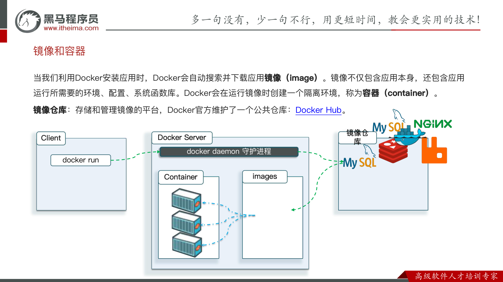

> ✅ **小结**：
>
> - **Docker 是做什么的？** —— 帮助我们下载应用镜像，创建并运行镜像的容器，从而**快速部署应用**。
> - **什么是镜像？** —— 将应用所需的函数库、依赖、配置等**与应用一起打包**得到的就是镜像。
> - **什么是容器？** —— 为每个镜像的应用进程创建的**隔离运行环境**就是容器。
> - **什么是镜像仓库？** —— 存储和管理镜像的服务就是镜像仓库；**Docker Hub** 是目前最大的镜像仓库，包含各种常见应用镜像。

---

## 2.4 命令解读

以部署 MySQL 的命令为例，逐个参数解读：

```bash
docker run -d \
  --name mysql \
  -p 3306:3306 \
  -e TZ=Asia/Shanghai \
  -e MYSQL_ROOT_PASSWORD=123 \
  mysql
```

| 参数 | 含义 |
| --- | --- |
| **`docker run`** | 创建并运行一个容器 |
| **`-d`** | 让容器在**后台运行** |
| **`--name mysql`** | 给容器起个名字，**必须唯一** |
| **`-p 3306:3306`** | 设置**端口映射**（`宿主机端口:容器内端口`） |
| **`-e KEY=VALUE`** | 设置**环境变量** |
| **`mysql`** | 指定运行的**镜像的名字** |

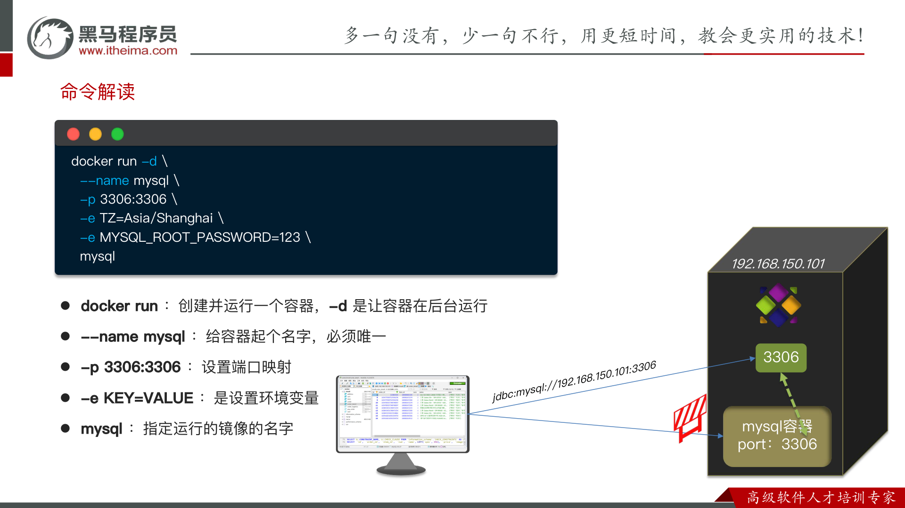

> 💡 **端口映射**：`-p 3306:3306` 表示把宿主机的 3306 端口映射到容器内的 3306 端口。外部就可以通过 `jdbc:mysql://192.168.150.101:3306` 访问容器内的 MySQL。


**⭐⭐⭐⭐⭐⭐注意：**

* 直接在电脑上Ping这个docker inspect mysql命令里的IpAddress是ping不通的，因为是对外隔离的
* 直接连mysql这个容器是连不了的，但连接mysql所在的这个容器是没问题的，也就是这里的192.168.150.101，我们称之为**宿主机**。
  * ⭐比如说**宿主机**就是**这个 Ubuntu 虚拟机**,
  * 比如说当我们访问宿主机的3306端口时，**docker**就会把这个请求转到容器内的3306端口，**就相当于间接访问到了容器**
  
    ~~~
    你的 Windows
       └─ Ubuntu 虚拟机(宿主机)          ← 左边的 3306 是这一层的端口
            └─ MySQL 容器(就是个 Docker 容器)
                 └─ 容器里运行的 mysqld    ← 右边的 3306 是这一层监听的端口
    ~~~
  
    

---

## 2.5 镜像命名规范

镜像名称一般由两部分组成：**`[repository]:[tag]`**。

- **`repository`**：镜像名
- **`tag`**：镜像的版本

> ⚠️ 在没有指定 `tag` 时，默认是 **`latest`**，代表最新版本的镜像。

```text
mysql:5.7
└─┬─┘ └┬┘
Repository Tag
```

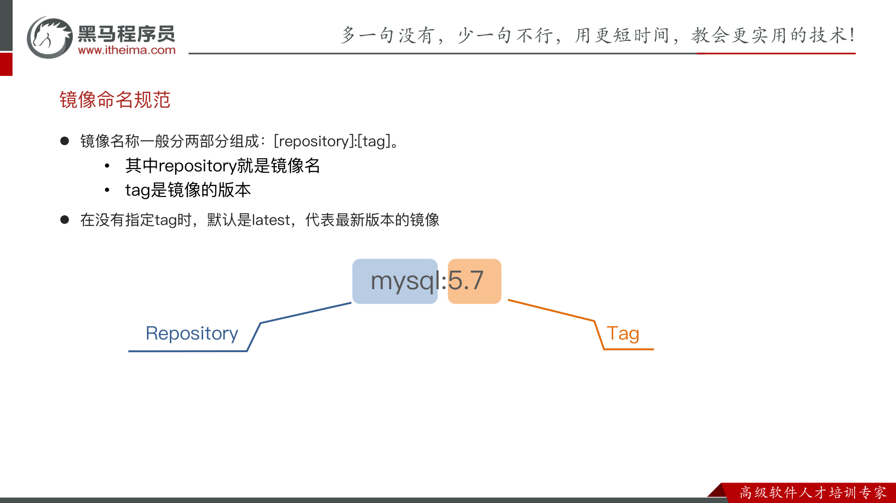

## 2.6 小结

docker run` 常见参数：`

* -d：让容器后台运行
* --name：给容器命名
* -e：环境变量
* -p：宿主机端口映射到容器内端口


镜像名称结构：

* `Repository:TAG`（镜像名 : 版本号）。


**示例：**

~~~bash
docker run -d \
  --name nginx \
  -p 80:80 \
  nginx
~~~


---

# 三、Docker 基础

## 3.1 常见命令

Docker 最常见的命令就是操作**镜像、容器**的命令，详见官方文档：<https://docs.docker.com/>

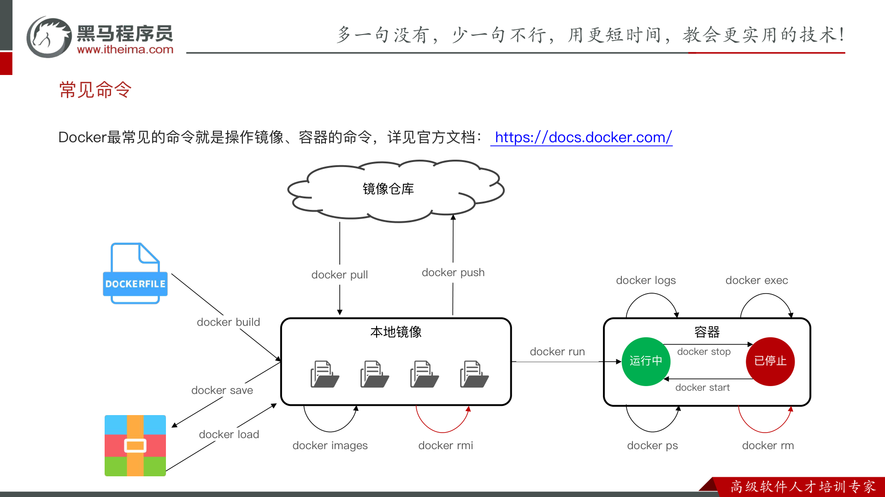

上图展示了**镜像仓库、本地镜像、容器**三者之间命令的关系：

| 操作对象 | 命令 | 说明 |
| --- | --- | --- |
| 镜像仓库 ↔ 本地 | `docker pull` | 从镜像仓库**拉取**镜像到本地 |
| 镜像仓库 ↔ 本地 | `docker push` | **推送**本地镜像到镜像仓库 |
| 本地镜像 | `docker images` | 查看本地镜像列表 |
| 本地镜像 | `docker rmi` | 删除本地镜像 |
| 本地镜像 → 容器 | `docker run` | 用镜像**创建并运行**容器**（注意：会创建一个容器）** |
| 容器 | `docker ps` | 查看容器运行状态（`-a` 查看所有，含已停止），docker ps 默认查看**运行中**容器 |
| 容器 | `docker stop` | 停止运行中的容器，**但容器还在** |
| 容器 | `docker start` | 启动已停止的容器 |
| 容器 | `docker rm` | 删除容器 |
| 容器 | `docker logs` | 查看容器日志 |
| 容器 | `docker exec` | 进入容器内部执行命令**（进入容器内如何交互呢？采用命令行交互，而docker exer -it 就是添加一个可输入的终端，如docker exec -it nginx bash 意思就是进入nginx容器，然后采用bash进行交互）** |
| 镜像构建/迁移 | `docker build` | 根据 Dockerfile 构建镜像 |
| 镜像构建/迁移 | `docker save` | 把镜像打包成压缩文件 |
| 镜像构建/迁移 | `docker load` | 从压缩文件加载镜像 |

### 案例：操作 Nginx 镜像与容器

**需求**：查看 DockerHub，拉取 Nginx 镜像，创建并运行 Nginx 容器。

```bash
# 1.在 DockerHub 中搜索 Nginx 镜像，查看镜像名称（略，网页操作）
# 2.拉取 Nginx 镜像
docker pull nginx
# 3.查看本地镜像列表
docker images
# 4.创建并运行 Nginx 容器
docker run -d --name nginx -p 80:80 nginx
# 5.查看容器
docker ps
# 6.停止容器
docker stop nginx
# 7.再次启动容器
docker start nginx
# 8.进入 Nginx 容器
docker exec -it nginx bash
# 9.删除容器（需先停止，或用 -f 强制删除）
docker rm nginx
```

---

## 3.2 命令别名

采用下述命令去设置命令的别名

~~~bash
# 修改.bashrc文件
vi ~/.bashrc

# 执行命令使别名生效
source ~/.bashrc
~~~

**注意：**

* 定义格式显示运行中的容器列表

  ~~~bash
  docker ps --format "table {{.ID}}\t{{.Image}}\t{{.Ports}}\t{{.Status}}\t{{.Names}}"
  ~~~

  

## 3.3 数据卷

**⭐注意：**

* 数据卷是容器内目录何宿主机目录之间的桥梁，⭐**一旦关联后，docker就会实现宿主机目录与容器内目录的双向映射**
  * 也就是说修改了宿主机内这个目录里做了修改，那容器内的这个目录也会修改；反之亦然

**数据卷（volume）** 是一个**虚拟目录**，是**容器内目录**与**宿主机目录**之间映射的桥梁。

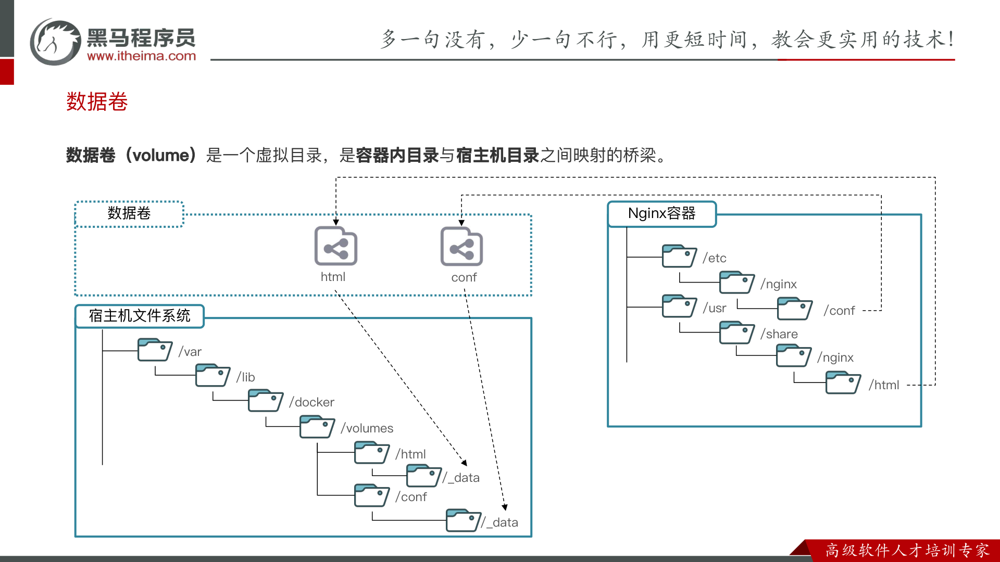

如上图：宿主机的 `/var/lib/docker/volumes/<卷名>/_data` 通过数据卷（如 `html`、`conf`）映射到 Nginx 容器内的 `/usr/share/nginx/html`、`/etc/nginx/conf` 等目录。

### 数据卷常见命令

| 命令 | 说明 |
| --- | --- |
| `docker volume create` | 创建数据卷 |
| `docker volume ls` | 查看所有数据卷 |
| `docker volume rm` | 删除指定数据卷 |
| `docker volume inspect` | 查看某个数据卷的详情 |
| `docker volume prune` | 清除（删除未使用的）数据卷 |

**⭐注意：**

* 不用死记硬背，可以通过docker volume --help去查看各个命令信息
* 然后还可以通过类似docker volume create --help去更详细的查看命令信息

### 案例 1：利用 Nginx 容器部署静态资源

**需求**：

* 创建 Nginx 容器，修改容器内 html 目录下的 `index.html`；
* 将静态资源部署到 nginx 的 html 目录。

> 💡 **提示**：
>
> - 在执行 `docker run` 命令时，使用 **`-v 数据卷:容器内目录`** 可以完成数据卷挂载；
> - 当创建容器时，如果挂载了数据卷且**数据卷不存在，会自动创建数据卷**。

```bash
docker run -d --name nginx -p 80:80 -v html:/usr/share/nginx/html nginx
```


**⭐问题：这里的html:/usr/share/nginx/html里左边的html指的是哪个目录？**

* 左边的 `html`（因为没有 `/`）是一个**命名卷的名字**，它**不指向你电脑上你能直接看到的某个目录**，而是由 Docker 在内部托管的一块存储。

* **既然 `html` 只是个名字，那它对应的物理位置到底由谁决定、在哪里？**

  * 答案是：**位置不用你指定，Docker 自动按一个固定规则算出来。**

    * 命名卷的物理位置 = 一个固定前缀 + 卷名：

      ~~~bash
      /var/lib/docker/volumes/<卷名>/_data
      ~~~

    * 所以你这个 `html` 卷，位置就是：

      ~~~bash
      /var/lib/docker/volumes/html/_data
      ~~~

* **可以通过docker inspect nginx 去查看详情**

### 案例 2：MySQL 容器的数据挂载

可以发现，数据卷的目录结构较深，如果我们去操作数据卷目录会不太方便。在很多情况下，我们会直接将容器目录与宿主机指定目录挂载。挂载语法与数据卷类似：

~~~bash
# 挂载本地目录
-v 本地目录:容器内目录
# 挂载本地文件
-v 本地文件:容器内文件
~~~


**需求**：

* 查看 mysql 容器是否有数据卷挂载；
* 基于**宿主机目录**实现 MySQL 数据目录、配置文件、初始化脚本的挂载（查阅官方镜像文档）。

> 💡 **提示**：在执行 `docker run` 命令时，使用 **`-v 本地目录:容器内目录`** 可以完成本地目录挂载。
>
> ① 挂载 `/root/mysql/data` 到容器内的 `/var/lib/mysql` 目录；
> ② 挂载 `/root/mysql/init` 到容器内的 `/docker-entrypoint-initdb.d` 目录，携带准备好的 SQL 脚本；
> ③ 挂载 `/root/mysql/conf` 到容器内的 `/etc/mysql/conf.d` 目录，携带准备好的配置文件。

> ⚠️ **本地目录 vs 数据卷的区分**：本地目录必须以 **`/`** 或 **`./`** 开头，如果直接以名称开头，会被识别为**数据卷**而非本地目录。
>
> - `-v mysql:/var/lib/mysql` → 会被识别为一个**数据卷** `mysql`
> - `-v ./mysql:/var/lib/mysql` → 会被识别为**当前目录下的 mysql 目录**


~~~bash
docker run -d \
  --name mysql \
  -p 3306:3306 \
  -e TZ=Asia/Shanghai \
  -e MYSQL_ROOT_PASSWORD=123456 \
  -v /root/mysql/data:/var/lib/mysql \
  -v /root/mysql/init:/docker-entrypoint-initdb.d \
  -v /root/mysql/conf:/etc/mysql/conf.d \
  mysql:8.0
~~~


### 小结

**什么是数据卷？**

*  数据卷是一个虚拟目录，它将宿主机目录映射到容器内目录，方便我们操作容器内文件，或者方便迁移容器产生的数据

**如何挂载数据卷？** 

* 在创建容器时，利用 `-v 数据卷名:容器内目录` 完成挂载
*  容器创建时，如果发现挂载的数据卷不存在时，会自动创建

**数据卷的常见命令有哪些？**

* `docker volume ls`: 查看数据卷
* `docker volume rm`: 删除数据卷
* `docker volume inspect`: 查看数据卷详情
*  `docker volume prune`: 删除未使用的数据卷


---

## 3.4 自定义镜像

镜像就是包含了**应用程序、程序运行的系统函数库、运行配置**等文件的文件包。**构建镜像的过程其实就是把上述文件打包的过程。**

对比「部署 Java 应用」与「构建 Java 镜像」的步骤：

| 部署一个 Java 应用 | 构建一个 Java 镜像 |
| --- | --- |
| ① 准备一个 Linux 服务器 | ① 准备一个 Linux 运行环境 |
| ② 安装 JRE 并配置环境变量 | ② 安装 JRE 并配置环境变量 |
| ③ 拷贝 Jar 包 | ③ 拷贝 Jar 包 |
| ④ 运行 Jar 包 | ④ 编写运行脚本 |

### 镜像结构

要想自己构建镜像，必须先了解镜像的结构。

之前我们说过，镜像之所以能让我们快速跨操作系统部署应用而忽略其运行环境、配置，就是因为镜像中包含了程序运行需要的系统函数库、环境、配置、依赖。

因此，自定义镜像本质就是依次准备好程序运行的基础环境、依赖、应用本身、运行配置等文件，并且打包而成。


**举个例子，我们要从0部署一个Java应用，大概流程是这样：**

- 准备一个linux服务（CentOS或者Ubuntu均可）
- 安装并配置JDK
- 上传Jar包
- 运行jar包


**那因此，我们打包镜像也是分成这么几步：**

- 准备Linux运行环境（java项目并不需要完整的操作系统，仅仅是基础运行环境即可）
- 安装并配置JDK
- 拷贝jar包
- 配置启动脚本


上述步骤中的每一次操作其实都是在生产一些文件（系统运行环境、函数库、配置最终都是磁盘文件），所以**镜像就是一堆文件的集合**。

但需要注意的是，镜像文件不是随意堆放的，而是按照操作的步骤分层叠加而成，每一层形成的文件都会单独打包并标记一个唯一id，称为**Layer**（**层**）。这样，如果我们构建时用到的某些层其他人已经制作过，就可以直接拷贝使用这些层，而不用重复制作。


例如，第一步中需要的Linux运行环境，通用性就很强，所以Docker官方就制作了这样的只包含Linux运行环境的镜像。我们在制作java镜像时，就无需重复制作，直接使用Docker官方提供的CentOS或Ubuntu镜像作为基础镜像。然后再搭建其它层即可，这样逐层搭建，最终整个Java项目的镜像结构如图所示：

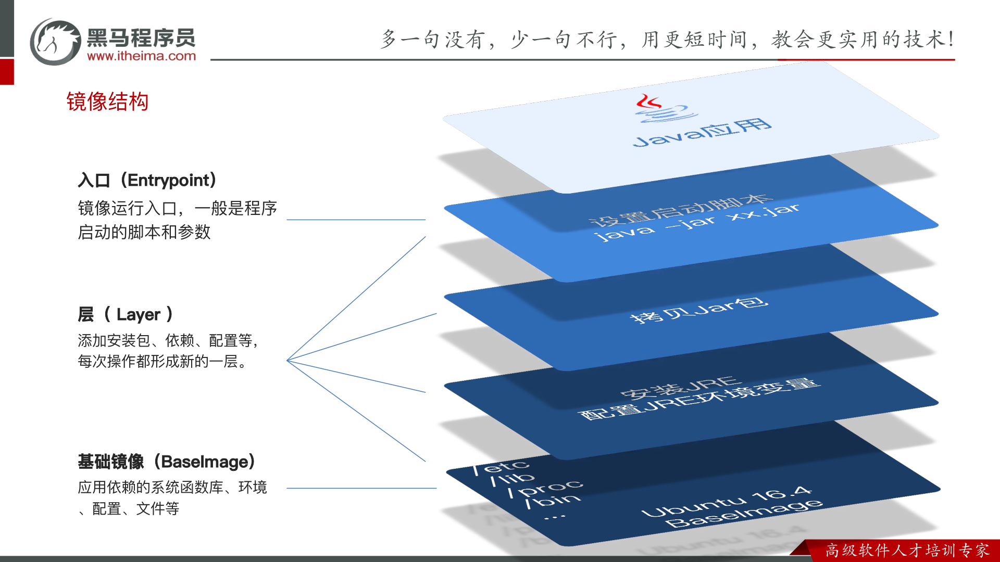

**⭐注意：**

* docker镜像其实是由多个压缩包合并而成的，每次操作产生的这些压缩包就称为一层


> ✅ **镜像采用分层结构**，自底向上分为：
>
> - **基础镜像（BaseImage）**：应用依赖的系统函数库、环境、配置、文件等（如 `Ubuntu 16.4`）。
> - **层（Layer）**：添加安装包、依赖、配置等，**每次操作都形成新的一层**。
> - **入口（Entrypoint）**：镜像运行入口，一般是程序启动的脚本和参数（如 `java -jar xx.jar`）。

### Dockerfile

**Dockerfile** 就是一个文本文件，其中包含一个个的**指令（Instruction）**，用指令来说明要执行什么操作来构建镜像。将来 Docker 可以根据 Dockerfile 帮我们**构建镜像**。常见指令如下：

| 指令 | 说明 | 示例 |
| --- | --- | --- |
| **`FROM`** | 指定基础镜像 | `FROM centos:6` |
| **`ENV`** | 设置环境变量，可在后面指令使用 | `ENV key value` |
| **`COPY`** | 拷贝本地文件到镜像的指定目录 | `COPY ./jre11.tar.gz /tmp` |
| **`RUN`** | 执行 Linux 的 shell 命令，一般是安装过程的命令 | `RUN tar -zxvf /tmp/jre11.tar.gz && EXPORTS path=/tmp/jre11:$path` |
| **`EXPOSE`** | 指定容器运行时监听的端口，是给镜像使用者看的 | `EXPOSE 8080` |
| **`ENTRYPOINT`** | 镜像中应用的启动命令，容器运行时调用 | `ENTRYPOINT java -jar xx.jar` |

> 📖 更详细的语法说明，请参考官网文档：<https://docs.docker.com/engine/reference/builder>

**示例**：基于 Ubuntu 基础镜像，利用 Dockerfile 描述镜像结构：

```dockerfile
# 指定基础镜像
FROM ubuntu:16.04
# 配置环境变量，JDK 的安装目录、容器内时区
ENV JAVA_DIR=/usr/local
# 拷贝 jdk 和 java 项目的包
COPY ./jdk8.tar.gz $JAVA_DIR/
COPY ./docker-demo.jar /tmp/app.jar
# 安装 JDK
RUN cd $JAVA_DIR \
 && tar -xf ./jdk8.tar.gz \
 && mv ./jdk1.8.0_144 ./java8
# 配置环境变量
ENV JAVA_HOME=$JAVA_DIR/java8
ENV PATH=$PATH:$JAVA_HOME/bin
# 入口，java 项目的启动命令
ENTRYPOINT ["java", "-jar", "/app.jar"]
```

也可以**直接基于 JDK 为基础镜像**，省略前面安装 JDK 的步骤：

```dockerfile
# 基础镜像
FROM openjdk:11.0-jre-buster
# 拷贝 jar 包
COPY docker-demo.jar /app.jar
# 入口
ENTRYPOINT ["java", "-jar", "/app.jar"]
```

**注意：**

* FROM openjdk:11.0-jre-buster已经做好了以下操作

  ~~~bash
  # 指定基础镜像
  FROM ubuntu:16.04
  # 配置环境变量，JDK 的安装目录、容器内时区
  ENV JAVA_DIR=/usr/local
  # 拷贝 jdk 和 java 项目的包
  COPY ./jdk8.tar.gz $JAVA_DIR/
  
  # 安装 JDK
  RUN cd $JAVA_DIR \
   && tar -xf ./jdk8.tar.gz \
   && mv ./jdk1.8.0_144 ./java8
  # 配置环境变量
  ENV JAVA_HOME=$JAVA_DIR/java8
  ENV PATH=$PATH:$JAVA_HOME/bin
  ~~~

* 所以我们只需要做这两步即可。

  ~~~bash
  # 拷贝 jar 包
  COPY docker-demo.jar /app.jar
  # 入口
  ENTRYPOINT ["java", "-jar", "/app.jar"]
  ~~~

  

### 构建镜像

我们可以基于Ubuntu基础镜像，利用Dockerfile描述镜像结构 ，也可以直接基于JDK为基础镜像，省略前面的步骤：

~~~bash
# 基础镜像
FROM openjdk:11.0-jre-buster
# 拷贝 jar 包
COPY docker-demo.jar /app.jar
# 入口
ENTRYPOINT ["java", "-jar", "/app.jar"]
~~~


当编写好了 Dockerfile，可以利用下面命令来构建镜像：

```bash
docker build -t myImage:1.0 .
```

> ✅ **参数说明**：
>
> - **`-t`**：给镜像起名，格式依然是 `repository:tag`，不指定 tag 时默认为 `latest`；
> - **`.`**：指定 Dockerfile 所在目录，如果就在当前目录，则指定为 `.`。


### 小结

**镜像的结构是怎样的？**

* 镜像中包含了应用程序所需要的运行环境、函数库、配置、以及应用本身等各种文件，这些文件分层打包而成

**Dockerfile 是做什么的？** 

* Dockerfile就是利用固定的指令来描述镜像的结构和构建过程，这样Docker才可以依次来构建镜像

**构建镜像的命令**

* `docker build -t 镜像名 Dockerfile目录`。


---

## 3.5 网络

默认情况下，所有容器都是以 **bridge（网桥）** 方式连接到 Docker 的一个**虚拟网桥 `docker0`** 上：

**⭐注意：**

* 172.17.0.1/16后面的16意思就是这个IP地址的前16位不能动，因为IP地址每一段最大为255，所以每一段为8位，所以/16的意思就是说这个IP地址的前两段是不能动，后面可以动，意思就是172.17不能动，后面可以动

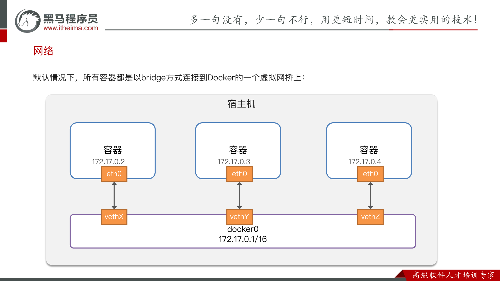

如上图：虚拟网桥 `docker0`（`172.17.0.1/16`）上挂载了多个容器，每个容器通过自己的 `eth0` 网卡与宿主机上的 `vethX` 虚拟网卡相连，从而分配到 `172.17.0.2`、`172.17.0.3`、`172.17.0.4` 等 IP。

> ⚠️ **重点**：**加入自定义网络的容器才可以通过容器名互相访问。**

### 网络常见命令

上节课我们创建了一个Java项目的容器，而Java项目往往需要访问其它各种中间件，例如MySQL、Redis等。现在，我们的容器之间能否互相访问呢？我们来测试一下

首先，我们查看下MySQL容器的详细信息，重点关注其中的网络IP地址：

```Bash
# 1.用基本命令，寻找Networks.bridge.IPAddress属性
docker inspect mysql
# 也可以使用format过滤结果
docker inspect --format='{{range .NetworkSettings.Networks}}{{println .IPAddress}}{{end}}' mysql
# 得到IP地址如下：
172.17.0.2

# 2.然后通过命令进入dd容器
docker exec -it dd bash

# 3.在容器内，通过ping命令测试网络
ping 172.17.0.2
# 结果
PING 172.17.0.2 (172.17.0.2) 56(84) bytes of data.
64 bytes from 172.17.0.2: icmp_seq=1 ttl=64 time=0.053 ms
64 bytes from 172.17.0.2: icmp_seq=2 ttl=64 time=0.059 ms
64 bytes from 172.17.0.2: icmp_seq=3 ttl=64 time=0.058 ms
```

发现可以互联，没有问题。


但是，容器的网络IP其实是一个虚拟的IP，其值并不固定与某一个容器绑定，如果我们在开发时写死某个IP，而在部署时很可能MySQL容器的IP会发生变化，连接会失败。

所以，我们必须借助于docker的网络功能来解决这个问题，官方文档：

https://docs.docker.com/engine/reference/commandline/network/


Docker的网络操作命令如下：

| 命令 | 说明 |
| --- | --- |
| `docker network create` | 创建一个网络 |
| `docker network ls` | 查看所有网络 |
| `docker network rm` | 删除指定网络 |
| `docker network prune` | 清除未使用的网络 |
| `docker network connect` | 使指定容器连接加入某网络 |
| `docker network disconnect` | 使指定容器连接离开某网络 |
| `docker network inspect` | 查看网络详细信息 |


教学演示：自定义网络

~~~bash
# 1.首先通过命令创建一个网络
docker network create hmall

# 2.然后查看网络
docker network ls
# 结果：
NETWORK ID     NAME      DRIVER    SCOPE
639bc44d0a87   bridge    bridge    local
403f16ec62a2   hmall     bridge    local
0dc0f72a0fbb   host      host      local
cd8d3e8df47b   none      null      local
# 其中，除了hmall以外，其它都是默认的网络

# 3.让dd和mysql都加入该网络，注意，在加入网络时可以通过--alias给容器起别名
# 这样该网络内的其它容器可以用别名互相访问！
# 3.1.mysql容器，指定别名为db，另外每一个容器都有一个别名是容器名
docker network connect hmall mysql --alias db
# 3.2.db容器，也就是我们的java项目
docker network connect hmall dd

# 4.进入dd容器，尝试利用别名访问db
# 4.1.进入容器
docker exec -it dd bash
# 4.2.用db别名访问
ping db
# 结果
PING db (172.18.0.2) 56(84) bytes of data.
64 bytes from mysql.hmall (172.18.0.2): icmp_seq=1 ttl=64 time=0.070 ms
64 bytes from mysql.hmall (172.18.0.2): icmp_seq=2 ttl=64 time=0.056 ms
# 4.3.用容器名访问
ping mysql
# 结果：
PING mysql (172.18.0.2) 56(84) bytes of data.
64 bytes from mysql.hmall (172.18.0.2): icmp_seq=1 ttl=64 time=0.044 ms
64 bytes from mysql.hmall (172.18.0.2): icmp_seq=2 ttl=64 time=0.054 ms
~~~


OK，现在无需记住IP地址也可以实现容器互联了。

⭐⭐**总结**：

- 在自定义网络中，可以给容器起多个别名，默认的别名是容器名本身
- 在同一个自定义网络中的容器，可以通过别名互相访问
-  ⭐加入自定义网络的容器才可以通过容器名**互相访问**

---

# 四、项目部署

## 4.1 部署 Java 应用

**需求**：将课前资料提供的 **hmall** 项目打包为镜像并部署，镜像名 `hmall`。

```dockerfile
# Dockerfile（基于 JDK 基础镜像）
FROM openjdk:11.0.16-jre-buster
COPY hm-service.jar /app.jar
ENTRYPOINT ["java", "-jar", "/app.jar"]
```

```bash
# 1.构建项目镜像，不指定tag，则默认为latest
docker build -t hmall .

# 2.查看镜像
docker images
# 结果
REPOSITORY    TAG       IMAGE ID       CREATED          SIZE
hmall         latest    0bb07b2c34b9   43 seconds ago   362MB
docker-demo   1.0       49743484da68   24 hours ago     327MB
nginx         latest    605c77e624dd   16 months ago    141MB
mysql         latest    3218b38490ce   17 months ago    516MB

# 3.创建并运行容器，并通过--network将其加入hmall网络，这样才能通过容器名访问mysql
docker run -d --name hmall --network hmall -p 8080:8080 hmall
```

测试，通过浏览器访问：http://你的虚拟机地址:8080/search/list


**⭐注意：**

* **使用docker logs -f 可以查看容器的运行日志**
  * 比如说：docker logs -f hmall就可以查看到接口调用情况

---

## 4.2 部署前端

然后创建nginx容器并完成两个挂载：

- 把`/root/nginx/nginx.conf`挂载到`/etc/nginx/ng``inx.conf`
- 把`/root/nginx/html`挂载到`/usr/share/nginx/html`

由于需要让nginx同时代理hmall-portal和hmall-admin两套前端资源，因此我们需要暴露两个端口：

- 18080：对应hmall-portal
- 18081：对应hmall-admin

命令如下：

```bash
docker run -d \
  --name nginx \
  -p 18080:18080 \
  -p 18081:18081 \
  -v /root/nginx/nginx.conf:/etc/nginx/nginx.conf \
  -v /root/nginx/html:/usr/share/nginx/html \
  --network hmall \
  nginx
```

测试，通过浏览器访问：http://你的虚拟机ip:18080


~~~conf
location / {
            root /usr/share/nginx/html/hmall-portal;  //为什么不是/root/nginx/html/hmall-portal;
}
~~~

**⭐⭐上述代码是为什么？**

* **配置文件nginx.conf里写的全是「容器内」的路径**

  * 我的挂载参数：-v /root/nginx/html:/usr/share/nginx/html

    意思是：把**宿主机**的 `/root/nginx/html` 目录，挂载（映射）到**容器内**的 `/usr/share/nginx/html`。

  * 而 nginx 进程是**跑在容器里**的，它只认容器内的路径。所以配置里必须写容器内的路径：

    root /usr/share/nginx/html/hmall-portal;

  * 如果你在配置里写成宿主机的 `/root/nginx/html/...`，容器内根本没有这个路径，nginx 会 404。

---

## 4.3 Docker Compose

大家可以看到，我们部署一个简单的java项目，其中包含3个容器：

- MySQL
- Nginx
- Java项目

而稍微复杂的项目，其中还会有各种各样的其它中间件，需要部署的东西远不止3个。如果还像之前那样手动的逐一部署，就太麻烦了。

而Docker Compose就可以帮助我们实现**多个相互关联的Docker容器的快速部署**。它允许用户通过一个单独的 docker-compose.yml 模板文件（YAML 格式）来定义一组相关联的应用容器。


**Docker Compose** 通过一个单独的 **`docker-compose.yml`** 模板文件（YAML 格式）来定义一组相关联的应用容器，帮助我们实现**多个相互关联的 Docker 容器的快速部署**。

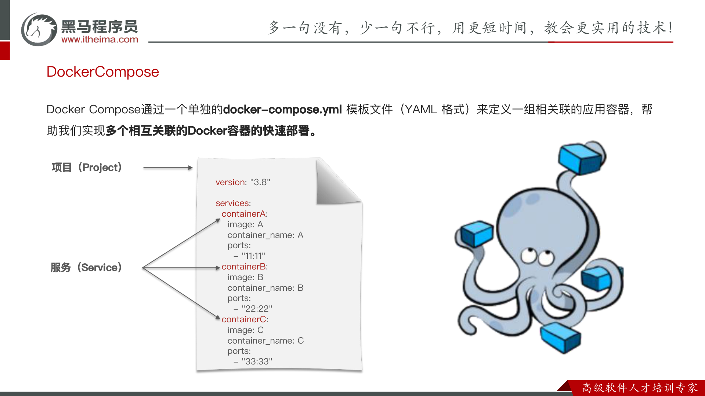

> ✅ **核心概念**：
>
> - **项目（Project）**：一个 `docker-compose.yml` 文件就是一个项目，包含一组相关联的容器。
> - **服务（Service）**：项目下的每一个容器即一个 service。

### 4.3.1 基本语法

docker-compose.yml文件的基本语法可以参考官方文档：

https://docs.docker.com/compose/compose-file/compose-file-v3/


docker-compose文件中可以定义多个相互关联的应用容器，每一个应用容器被称为一个服务（service）。由于service就是在定义某个应用的运行时参数，因此与`docker run`参数非常相似。

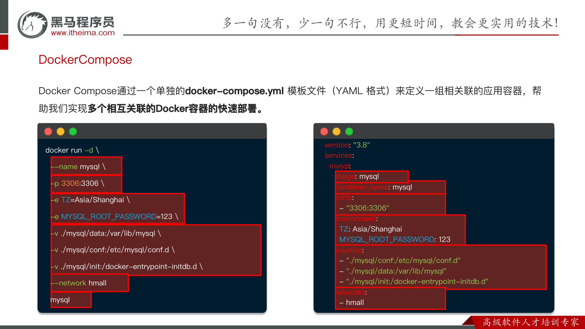

`docker-compose.yml` 中的配置项与 `docker run` 的参数一一对应。例如下面的 `docker run`：

```bash
docker run -d \
  --name mysql \
  -p 3306:3306 \
  -e TZ=Asia/Shanghai \
  -e MYSQL_ROOT_PASSWORD=123 \
  -v ./mysql/data:/var/lib/mysql \
  -v ./mysql/conf:/etc/mysql/conf.d \
  -v ./mysql/init:/docker-entrypoint-initdb.d \
  --network hmall \
  mysql:8.0
```

等价于 compose 中的：

```yaml
version: "3.8"
services:
  mysql:
    image: mysql:8.0
    container_name: mysql
    ports:
      - "3306:3306"
    environment:
      TZ: Asia/Shanghai
      MYSQL_ROOT_PASSWORD: 123
    volumes:
      - "./mysql/conf:/etc/mysql/conf.d"
      - "./mysql/data:/var/lib/mysql"
      - "./mysql/init:/docker-entrypoint-initdb.d"
    networks:
      - hmall
```


**对比如下：**

| **docker run 参数** | **docker compose 指令** | **说明**   |
| :------------------ | :---------------------- | :--------- |
| --name              | container_name          | 容器名称   |
| -p                  | ports                   | 端口映射   |
| -e                  | environment             | 环境变量   |
| -v                  | volumes                 | 数据卷配置 |
| --network           | networks                | 网络       |

明白了其中的对应关系，相信编写`docker-compose`文件应该难不倒大家。


### 完整示例：hmall 项目的 docker-compose.yml

把 mysql、hmall（Java 应用）、nginx 三个服务一起编排：

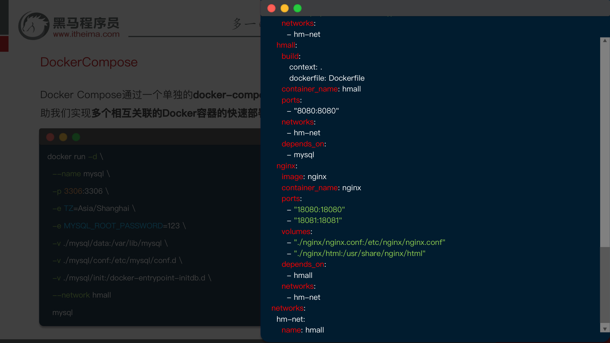

```yaml
version: "3.8"
services:
  mysql:
    image: mysql:8.0
    container_name: mysql
    ports:
      - "3306:3306"
    environment:
      TZ: Asia/Shanghai
      MYSQL_ROOT_PASSWORD: 123456
    volumes:
      - "/root/mysql/conf:/etc/mysql/conf.d"
      - "/root/mysql/data:/var/lib/mysql"
      - "/root/mysql/init:/docker-entrypoint-initdb.d"
    networks:
      - hm-net
  hmall:
    build:
      context: .
      dockerfile: Dockerfile
    container_name: hmall
    ports:
      - "8080:8080"
    networks:
      - hm-net
    depends_on:
      - mysql
  nginx:
    image: nginx
    container_name: nginx
    ports:
      - "18080:18080"
      - "18081:18081"
    volumes:
      - "/root/nginx/nginx.conf:/etc/nginx/nginx.conf"
      - "/root/nginx/html:/usr/share/nginx/html"
    depends_on:
      - hmall
    networks:
      - hm-net
networks:
  hm-net:
    name: hmall
```

**⭐注意：**

* 这里build下的context写的是. 

  * 意思就是当前目录，会去当前目录下找Dockerfile文件，完成镜像构建

* depends_on的意思就是依赖

  * 在这里的意思就是我这个容器依赖于mysql容器，创建的时候会先去创建mysql容器

* 以前都是手动创建网络，但在这里dockercompose会自动帮我们创建网络，只需要标注出来

  ~~~yml
  networks:
    hm-net:
      name: hmall
  ~~~

  

### 4.3.2 基础命令

编写好docker-compose.yml文件，就可以部署项目了。常见的命令：

https://docs.docker.com/compose/reference/


基本语法如下：

```Bash
docker compose [OPTIONS] [COMMAND]
```

其中，OPTIONS和COMMAND都是可选参数，比较常见的有：

| 类型 | 参数或指令 | 说明 |
| --- | --- | --- |
| Options | `-f` | 指定 compose 文件的路径和名称 |
| Options | `-p` | 指定project名称。project就是当前compose文件中设置的多个service的集合，是逻辑概念 |
| Commands | `up` | 创建并启动所有 service 容器 |
| Commands | `down` | 停止并移除所有容器、网络 |
| Commands | `ps` | 列出所有启动的容器 |
| Commands | `logs` | 查看指定容器的日志 |
| Commands | `stop` | 停止容器 |
| Commands | `start` | 启动容器 |
| Commands | `restart` | 重启容器 |
| Commands | `top` | 查看运行的进程 |
| Commands | `exec` | 在指定的运行中容器中执行命令 |

> 💡 **常用启动命令**：`docker compose up -d`（后台创建并启动全部服务）。


教学演示：

```Bash
# 1.进入root目录
cd /root

# 2.删除旧容器
docker rm -f $(docker ps -qa)

# 3.删除hmall镜像
docker rmi hmall

# 4.清空MySQL数据
rm -rf mysql/data

# 5.启动所有, -d 参数是后台启动
docker compose up -d
# 结果：
[+] Building 15.5s (8/8) FINISHED
 => [internal] load build definition from Dockerfile                                    0.0s
 => => transferring dockerfile: 358B                                                    0.0s
 => [internal] load .dockerignore                                                       0.0s
 => => transferring context: 2B                                                         0.0s
 => [internal] load metadata for docker.io/library/openjdk:11.0-jre-buster             15.4s
 => [1/3] FROM docker.io/library/openjdk:11.0-jre-buster@sha256:3546a17e6fb4ff4fa681c3  0.0s
 => [internal] load build context                                                       0.0s
 => => transferring context: 98B                                                        0.0s
 => CACHED [2/3] RUN ln -snf /usr/share/zoneinfo/Asia/Shanghai /etc/localtime && echo   0.0s
 => CACHED [3/3] COPY hm-service.jar /app.jar                                           0.0s
 => exporting to image                                                                  0.0s
 => => exporting layers                                                                 0.0s
 => => writing image sha256:32eebee16acde22550232f2eb80c69d2ce813ed099640e4cfed2193f71  0.0s
 => => naming to docker.io/library/root-hmall                                           0.0s
[+] Running 4/4
 ✔ Network hmall    Created                                                             0.2s
 ✔ Container mysql  Started                                                             0.5s
 ✔ Container hmall  Started                                                             0.9s
 ✔ Container nginx  Started                                                             1.5s

# 6.查看镜像
docker compose images
# 结果
CONTAINER           REPOSITORY          TAG                 IMAGE ID            SIZE
hmall               root-hmall          latest              32eebee16acd        362MB
mysql               mysql               latest              3218b38490ce        516MB
nginx               nginx               latest              605c77e624dd        141MB

# 7.查看容器
docker compose ps
# 结果
NAME                IMAGE               COMMAND                  SERVICE             CREATED             STATUS              PORTS
hmall               root-hmall          "java -jar /app.jar"     hmall               54 seconds ago      Up 52 seconds       0.0.0.0:8080->8080/tcp, :::8080->8080/tcp
mysql               mysql               "docker-entrypoint.s…"   mysql               54 seconds ago      Up 53 seconds       0.0.0.0:3306->3306/tcp, :::3306->3306/tcp, 33060/tcp
nginx               nginx               "/docker-entrypoint.…"   nginx               54 seconds ago      Up 52 seconds       80/tcp, 0.0.0.0:18080-18081->18080-18081/tcp, :::18080-18081->18080-18081/tcp
```

打开浏览器，访问：http://yourIp:8080


### 小结

---

> 📌 **全文小结**：Docker 通过**镜像 + 容器 + 镜像仓库**实现应用的快速部署；掌握**常见命令**（镜像 / 容器 / 数据卷 / 网络）、**Dockerfile** 自定义镜像、以及 **Docker Compose** 多容器编排，即可完成从单容器到完整项目（前端 + Java + MySQL）的部署。
