# 微服务01（day03）：认识微服务 · 服务拆分 · 服务治理 · OpenFeign

> 本文档由飞书知识库《微服务框架 · day03-微服务01》整理导出，保留原文结构与图片。

> 🏖️ 号外号外！现在点击 🌈 黑马逆袭之路！！！，添加黑马老师即可领取多套试学课程。还可以预约1V1职业规划咨询帮你找准定位、不再盲目。赶快行动起来吧！

本篇文档对应B站视频：

【黑马程序员SpringCloud微服务技术栈实战教程，涵盖springcloud微服务架构+Nacos配置中心+分布式事务等】

之前我们学习的项目一是单体项目，可以满足小型项目或传统项目的开发。而在互联网时代，越来越多的一线互联网公司都在使用微服务技术。

从谷歌搜索指数来看，国内从自2016年底开始，微服务热度突然暴涨：

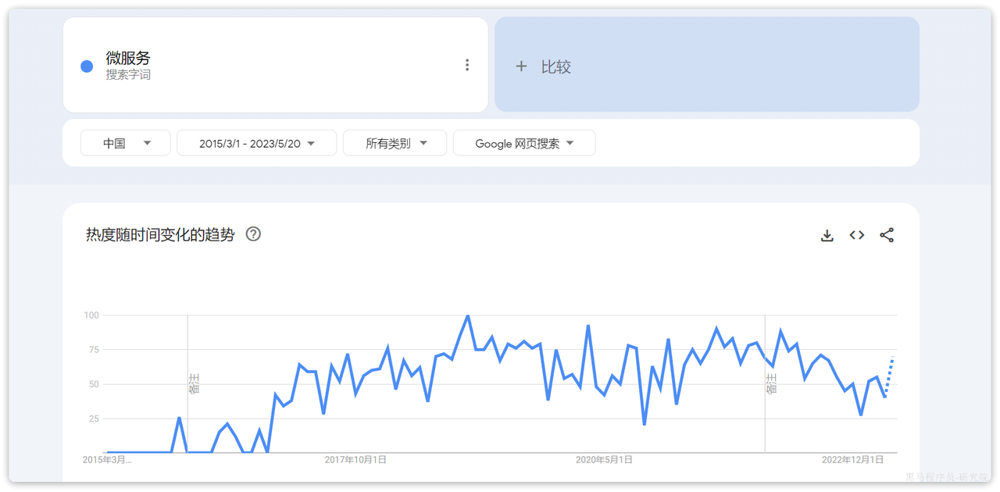

那么：

- 到底什么是微服务？
- 企业该不该引入微服务？
- 微服务技术该如何在企业落地？

接下来几天，我们就一起来揭开它的神秘面纱。

计划是这样的，课前资料中给大家准备了一个单体的电商小项目：黑马商城，我们会基于这个单体项目来演示从单体架构到微服务架构的演变过程、分析其中存在的问题，以及微服务技术是如何解决这些问题的。

你会发现每一个微服务技术都是在解决服务化过程中产生的问题，你对于每一个微服务技术具体的应用场景和使用方式都会有更深层次的理解。

今天作为课程的第一天，我们要完成下面的内容：

- 知道单体架构的特点
- 知道微服务架构的特点
- 学会拆分微服务
- 会使用Nacos实现服务治理
- 会使用OpenFeign实现远程调用

## 0.导入黑马商城项目

在课前资料中给大家提供了黑马商城项目的资料，我们需要先导入这个单体项目。不过需要注意的是，本篇及后续的微服务学习都是基于Centos7系统下的Docker部署，因此你必须做好一些准备：

- Centos7的环境及一个好用的SSH客户端
- 安装好Docker
- 会使用Docker

如果你没有这样的Linux环境，或者不是Centos7的话，那么这里有一篇参考文档：

- Linux环境搭建

建议按照上面的文档来搭建虚拟机环境，使用其它版本会出现一些环境问题，比较痛苦。

如果已经有Linux环境，但是没有安装Docker的话，那么这里还有一篇参考文档：

- 安装Docker

如果不会使用Docker的话可以参考黑马的微服务前置Docker课程，B站地址如下：

> 🔗 https://www.bilibili.com/video/BV1HP4118797/?share_source=copy_web&vd_source=3362e6914fb759983690e6e0f1072453
黑马程序员Docker快速入门到项目部署，MySQL部署+Nginx部署+docker自定义镜像+DockerCompose项目实战一套搞定_哔哩哔哩_bilibili
黑马程序员Docker快速入门到项目部署，MySQL部署+Nginx部署+docker自定义镜像+DockerCompose项目实战一套搞定共计14条视频，包括:01.Docker课程介绍、02.Docker的安装、03.快速入门-部署MySQL等，UP主更多精彩视频，请关注UP账号。

> ❗ 注意： 如果是学习过上面Docker课程的同学，虚拟机中已经有了黑马商城项目及MySQL数据库了，不过为了跟其他同学保持一致，可以先将整个项目移除。使用下面的命令： cd /root docker compose down

### 0.1.安装MySQL

在课前资料提供好了MySQL的一个目录：

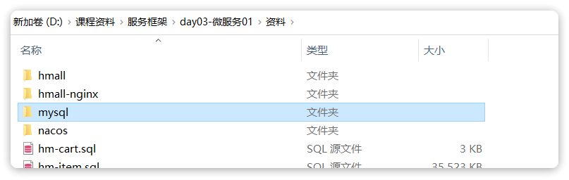

其中有MySQL的配置文件和初始化脚本：

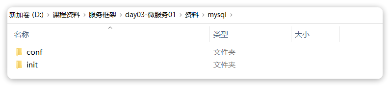

我们将其复制到虚拟机的/root目录。如果/root下已经存在mysql目录则删除旧的，如果不存在则直接复制本地的：

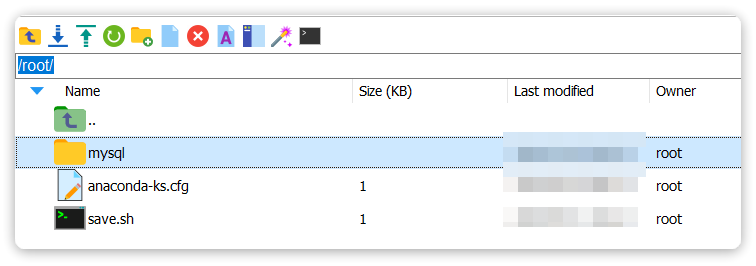

然后创建一个通用网络：

```bash
docker network create hm-net
```

使用下面的命令来安装MySQL：

```bash
docker run -d \
  --name mysql \
  -p 3306:3306 \
  -e TZ=Asia/Shanghai \
  -e MYSQL_ROOT_PASSWORD=123 \
  -v /root/mysql/data:/var/lib/mysql \
  -v /root/mysql/conf:/etc/mysql/conf.d \
  -v /root/mysql/init:/docker-entrypoint-initdb.d \
  --network hm-net\
  mysql
```

此时，通过命令查看mysql容器：

```bash
docker ps
```

如图：

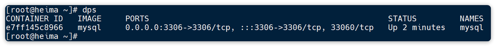

发现mysql容器正常运行。

注：图片中的dps命令是我设置的别名，等同于docker ps --format，可以简化命令格式。你可以参考黑马的
day02-Docker 的2.1.3小节来配置。

此时，如果我们使用MySQL的客户端工具连接MySQL，应该能发现已经创建了黑马商城所需要的表：

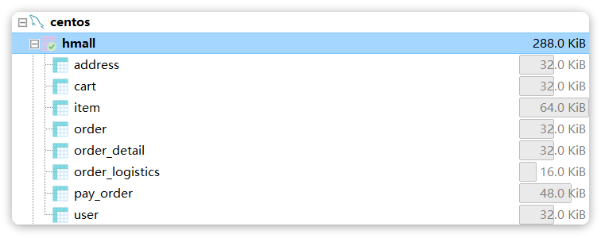

### 0.2.后端

然后是Java代码，在课前资料提供了一个hmall目录：

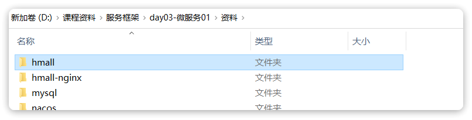

将其复制到你的工作空间，然后利用Idea打开。

项目结构如下：

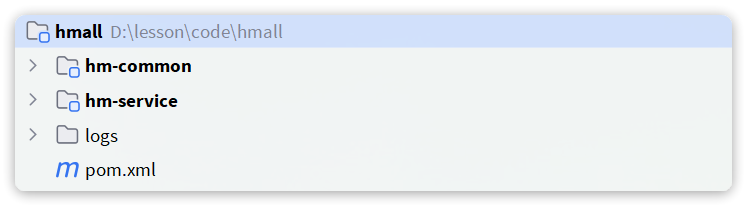

按下ALT + 8键打开services窗口，新增一个启动项：

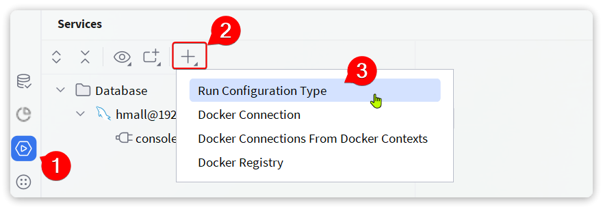

在弹出窗口中鼠标向下滚动，找到Spring Boot:

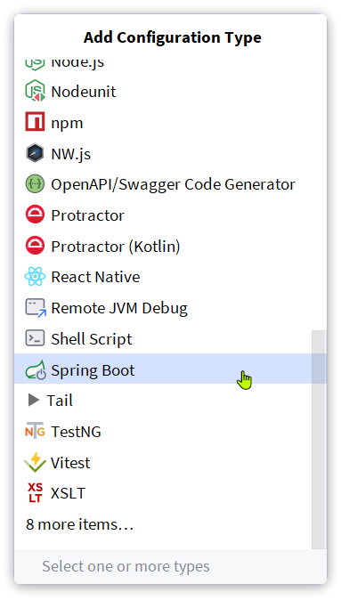

点击后应该会在services中出现hmall的启动项：

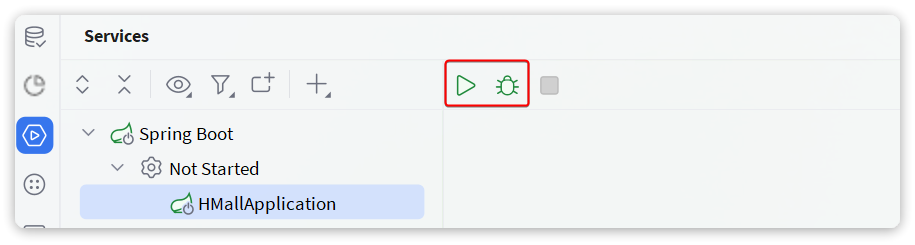

点击对应按钮，即可实现运行或DEBUG运行。

不过别着急！！

我们还需要对这个启动项做简单配置，在HMallApplication上点击鼠标右键，会弹出窗口，然后选择Edit Configuration：

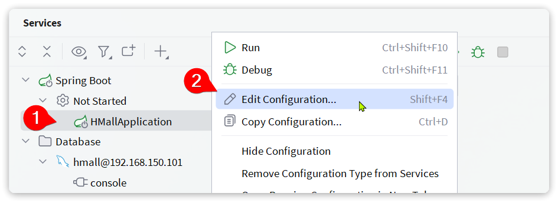

在弹出窗口中配置SpringBoot的启动环境为local：

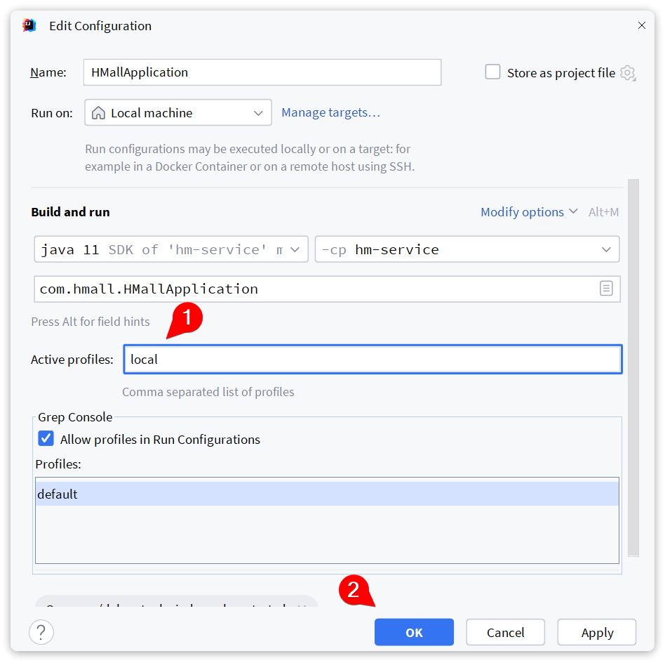

点击OK配置完成。接下来就可以运行了！

启动完成后，试试看访问下 http://localhost:8080/hi 吧！

### 0.3.前端

在课前资料中还提供了一个hmall-nginx的目录：

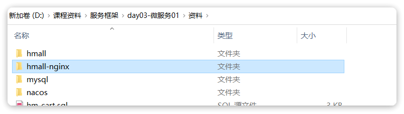

其中就是一个nginx程序以及我们的前端代码，直接在windows下将其复制到一个非中文、不包含特殊字符的目录下。然后进入hmall-nginx后，利用cmd启动即可：

```powershell
# 启动nginx
start nginx.exe
# 停止
nginx.exe -s stop
# 重新加载配置
nginx.exe -s reload
# 重启
nginx.exe -s restart
```

> ❗ 特别注意： nginx.exe 不要双击启动，而是打开cmd窗口，通过命令行启动。停止的时候也一样要是用命令停止。如果启动失败不要重复启动，而是查看logs目录中的error.log日志，查看是否是端口冲突。如果是端口冲突则自行修改端口解决。

启动成功后，访问http://localhost:18080，应该能看到我们的门户页面：

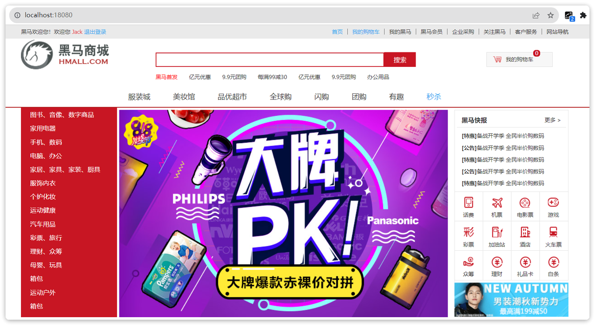

## 1.认识微服务

这一章我们从单体架构的优缺点来分析，看看开发大型项目采用单体架构存在哪些问题，而微服务架构又是如何解决这些问题的。

### 1.1.单体架构

**单体架构（monolithic structure）**：顾名思义，整个项目中所有功能模块都在一个工程中开发；项目部署时需要对所有模块一起编译、打包；项目的架构设计、开发模式都非常简单。

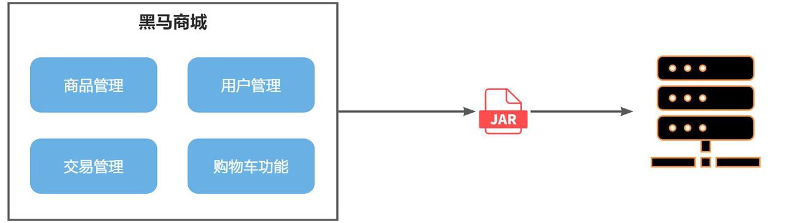

当项目规模较小时，这种模式上手快，部署、运维也都很方便，因此早期很多小型项目都采用这种模式。

但随着项目的业务规模越来越大，团队开发人员也不断增加，单体架构就呈现出越来越多的问题：

- **团队协作成本高**：试想一下，你们团队数十个人同时协作开发同一个项目，由于所有模块都在一个项目中，不同模块的代码之间物理边界越来越模糊。最终要把功能合并到一个分支，你绝对会陷入到解决冲突的泥潭之中。
- **系统发布效率低**：任何模块变更都需要发布整个系统，而系统发布过程中需要多个模块之间制约较多，需要对比各种文件，任何一处出现问题都会导致发布失败，往往一次发布需要数十分钟甚至数小时。
- **系统可用性差**：单体架构各个功能模块是作为一个服务部署，相互之间会互相影响，一些热点功能会耗尽系统资源，导致其它服务低可用。

在上述问题中，前两点相信大家在实战过程中应该深有体会。对于第三点系统可用性问题，很多同学可能感触不深。接下来我们就通过黑马商城这个项目，给大家做一个简单演示。

首先，我们修改hm-service模块下的com.hmall.controller.HelloController中的hello方法，模拟方法执行时的耗时：

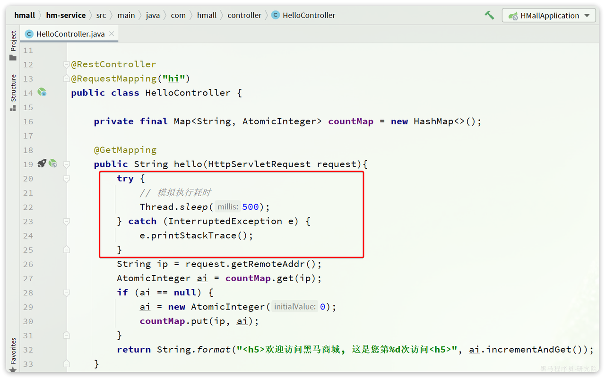

接下来，启动项目，目前有两个接口是无需登录即可访问的：

- http://localhost:8080/hi
- http://localhost:8080/search/list

经过测试，目前/search/list 是比较正常的，访问耗时在30毫秒左右。

接下来，我们假设/hi这个接口是一个并发较高的热点接口，我们通过Jemeter来模拟500个用户不停访问。在课前资料中已经提供了Jemeter的测试脚本：

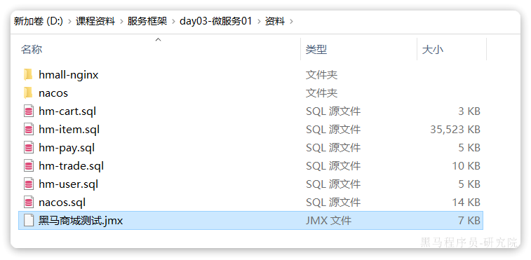

导入Jemeter并测试：

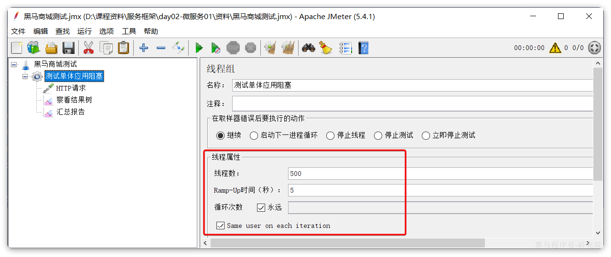

这个脚本会开启500个线程并发请求http://localhost/hi这个接口。由于该接口存在执行耗时（500毫秒），这就服务端导致每秒能处理的请求数量有限，最终会有越来越多请求积压，直至Tomcat资源耗尽。这样，其它本来正常的接口（例如/search/list）也都会被拖慢，甚至因超时而无法访问了。

我们测试一下，启动测试脚本，然后在浏览器访问http://localhost:8080/search/list这个接口，会发现响应速度非常慢：

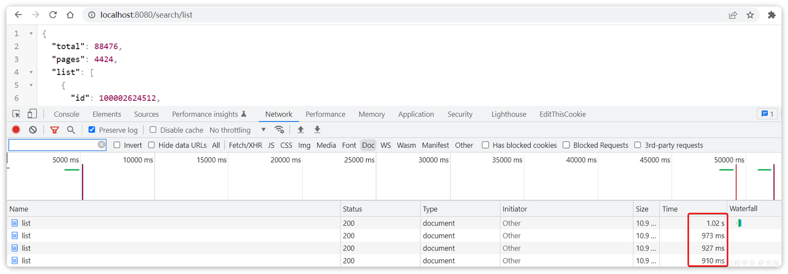

如果进一步提高/hi这个接口的并发，最终会发现/search/list接口的请求响应速度会越来越慢。

可见，单体架构的可用性是比较差的，功能之间相互影响比较大。

当然，有同学会说我们可以做水平扩展。

此时如果我们对系统做水平扩展，增加更多机器，资源还是会被这样的热点接口占用，从而影响到其它接口，并不能从根本上解决问题。这也就是单体架构的扩展性差的一个原因。

而要想解决这些问题，就需要使用微服务架构了。

### 1.2.微服务

**微服务架构**，首先是**服务化**，就是将单体架构中的功能模块从单体应用中拆分出来，独立部署为多个服务。同时要满足下面的一些特点：

- **单一职责**：一个微服务负责一部分业务功能，并且其核心数据不依赖于其它模块。
- **团队自治**：每个微服务都有自己独立的开发、测试、发布、运维人员，团队人员规模不超过10人（2张披萨能喂饱）
- **服务自治**：每个微服务都独立打包部署，访问自己独立的数据库。并且要做好服务隔离，避免对其它服务产生影响

例如，黑马商城项目，我们就可以把商品、用户、购物车、交易等模块拆分，交给不同的团队去开发，并独立部署：

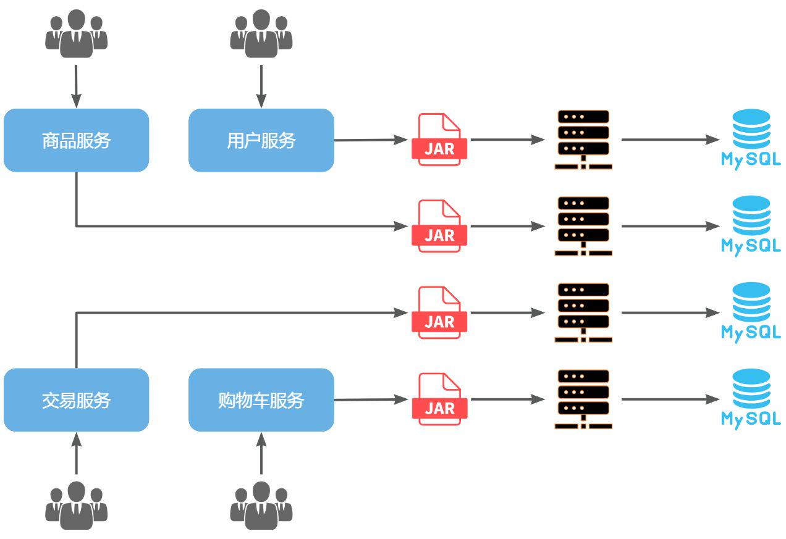

那么，单体架构存在的问题有没有解决呢？

- 团队协作成本高？
  - 由于服务拆分，每个服务代码量大大减少，参与开发的后台人员在1~3名，协作成本大大降低
- 系统发布效率低？
  - 每个服务都是独立部署，当有某个服务有代码变更时，只需要打包部署该服务即可
- 系统可用性差？
  - 每个服务独立部署，并且做好服务隔离，使用自己的服务器资源，不会影响到其它服务。

综上所述，微服务架构解决了单体架构存在的问题，特别适合大型互联网项目的开发，因此被各大互联网公司普遍采用。大家以前可能听说过分布式架构，分布式就是服务拆分的过程，其实微服务架构正式分布式架构的一种最佳实践的方案。

当然，微服务架构虽然能解决单体架构的各种问题，但在拆分的过程中，还会面临很多其它问题。比如：

- 如果出现跨服务的业务该如何处理？
- 页面请求到底该访问哪个服务？
- 如何实现各个服务之间的服务隔离？

这些问题，我们在后续的学习中会给大家逐一解答。

### 1.3.SpringCloud

微服务拆分以后碰到的各种问题都有对应的解决方案和微服务组件，而 **SpringCloud** 框架可以说是目前 Java 领域**最全面的微服务组件集合**。

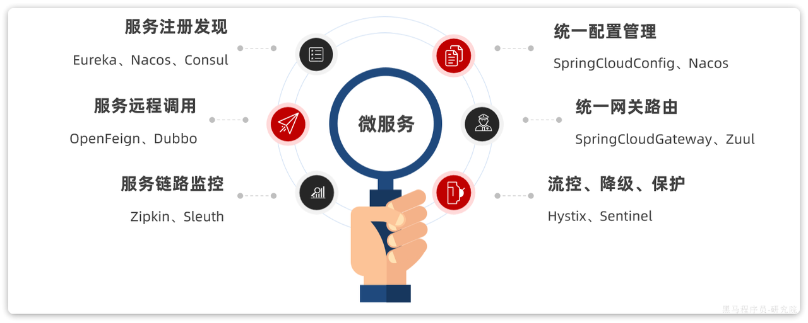

而且SpringCloud依托于SpringBoot的自动装配能力，大大降低了其项目搭建、组件使用的成本。对于没有自研微服务组件能力的中小型企业，使用SpringCloud全家桶来实现微服务开发可以说是最合适的选择了！

> 🔗 https://spring.io/projects/spring-cloud#overview
Spring Cloud
Level up your Java code and explore what Spring can do for you.

目前SpringCloud最新版本为2022.0.x版本，对应的SpringBoot版本为3.x版本，但它们全部依赖于JDK17，目前在企业中使用相对较少。

| SpringCloud 版本 | SpringBoot 版本 |
| --- | --- |
| **2022.0.x** aka Kilburn | 3.0.x |
| **2021.0.x** aka Jubilee | 2.6.x, 2.7.x (Starting with 2021.0.3) |
| **2020.0.x** aka Ilford | 2.4.x, 2.5.x (Starting with 2020.0.3) |
| Hoxton | 2.2.x, 2.3.x (Starting with SR5) |
| Greenwich | 2.1.x |
| Finchley | 2.0.x |
| Edgware | 1.5.x |
| Dalston | 1.5.x |

因此，我们推荐使用次新版本：**Spring Cloud 2021.0.x** 以及 **Spring Boot 2.7.x** 版本。

另外，Alibaba的微服务产品SpringCloudAlibaba目前也成为了SpringCloud组件中的一员，我们课堂中也会使用其中的部分组件。

在我们的父工程hmall中已经配置了SpringCloud以及SpringCloudAlibaba的依赖：

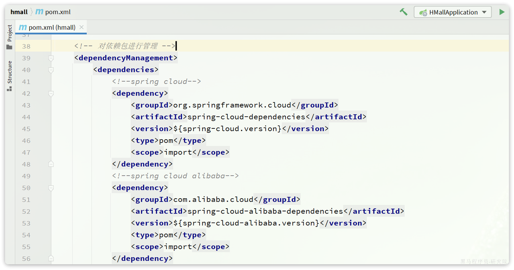

对应的版本：

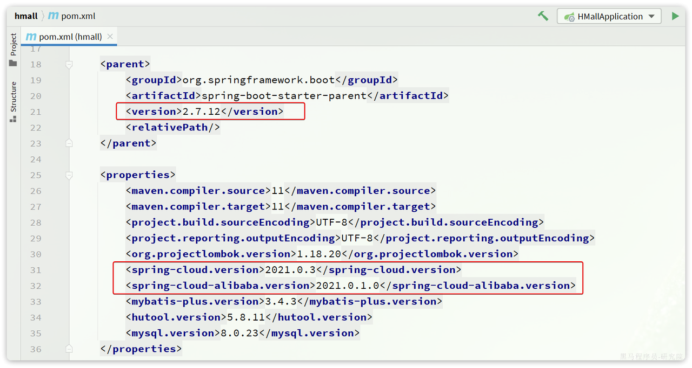

这样，我们在后续需要使用SpringCloud或者SpringCloudAlibaba组件时，就无需单独指定版本了。

## 2.微服务拆分

接下来，我们就一起将黑马商城这个单体项目拆分为微服务项目，并解决其中出现的各种问题。

### 2.1.熟悉黑马商城

首先，我们需要熟悉黑马商城项目的基本结构：

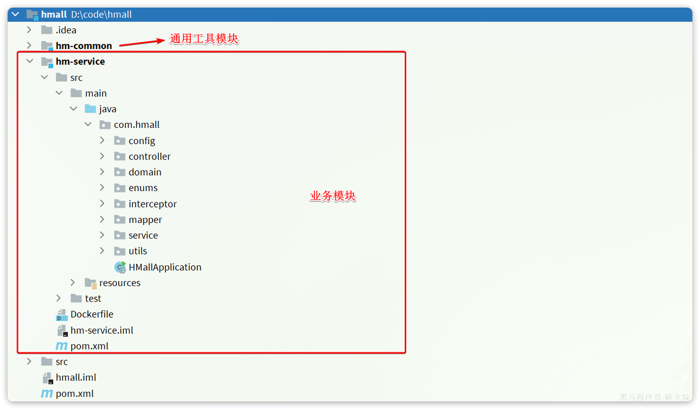

大家可以直接启动该项目，测试效果。不过，需要修改数据库连接参数，在application-local.yaml中：

```yaml
hm:
  db:
    host: 192.168.150.101 # 修改为你自己的虚拟机IP地址
    pw: 123 # 修改为docker中的MySQL密码
```

同时配置启动项激活的是local环境：

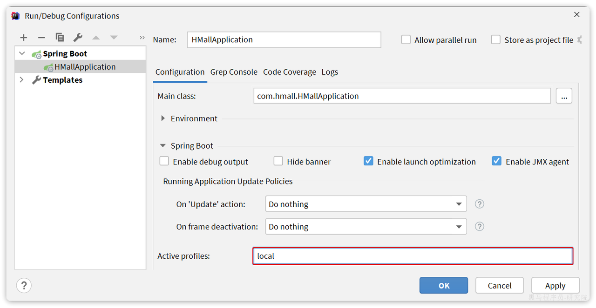

#### 2.1.1.登录

首先来看一下登录业务流程：

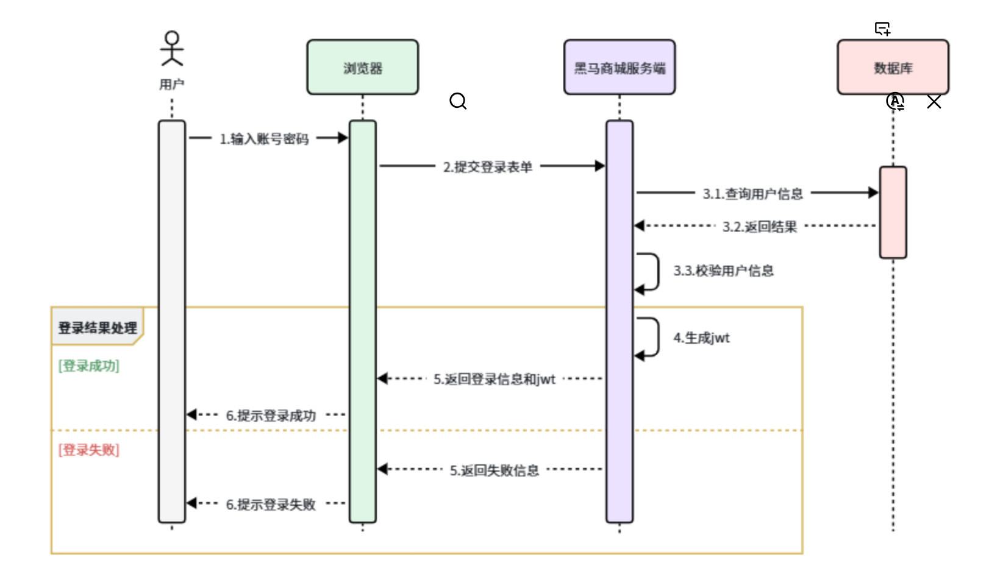

登录入口在com.hmall.controller.UserController中的login方法：

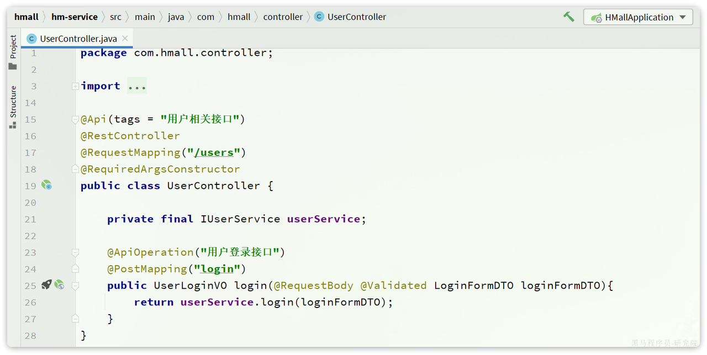

#### 2.2.2.搜索商品

在首页搜索框输入关键字，点击搜索即可进入搜索列表页面：

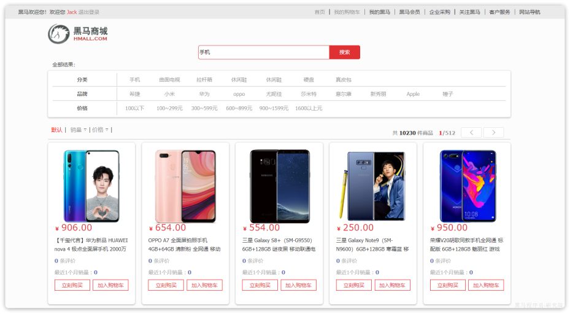

该页面会调用接口：/search/list，对应的服务端入口在com.hmall.controller.SearchController中的search方法：

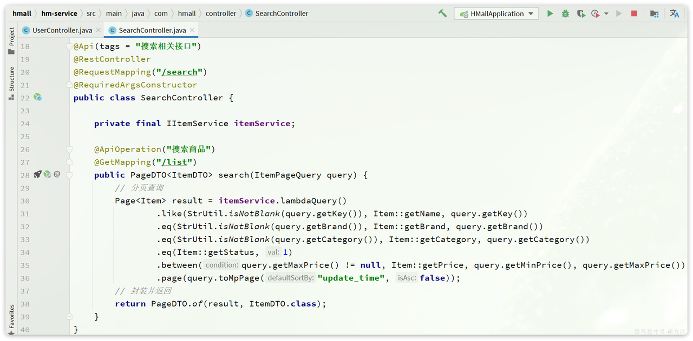

这里目前是利用数据库实现了简单的分页查询。

#### 2.2.3.购物车

在搜索到的商品列表中，点击按钮加入购物车，即可将商品加入购物车：


加入成功后即可进入购物车列表页，查看自己购物车商品列表：

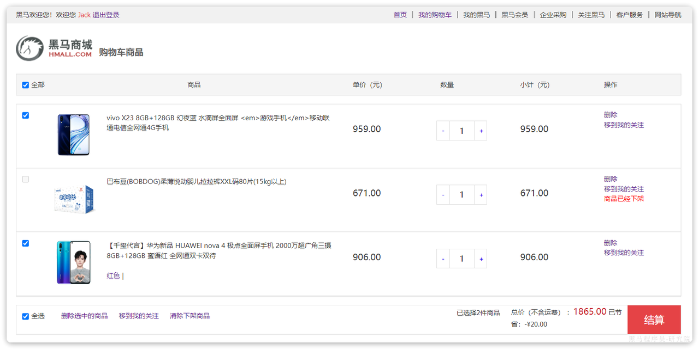

同时这里还可以对购物车实现修改、删除等操作。

相关功能全部在com.hmall.controller.CartController中：

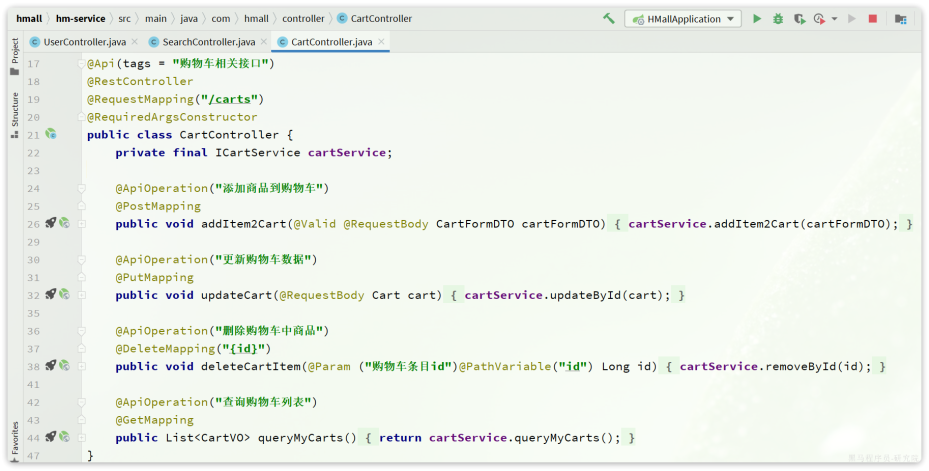

其中，查询购物车列表时，由于要判断商品最新的价格和状态，所以还需要查询商品信息，业务流程如下：

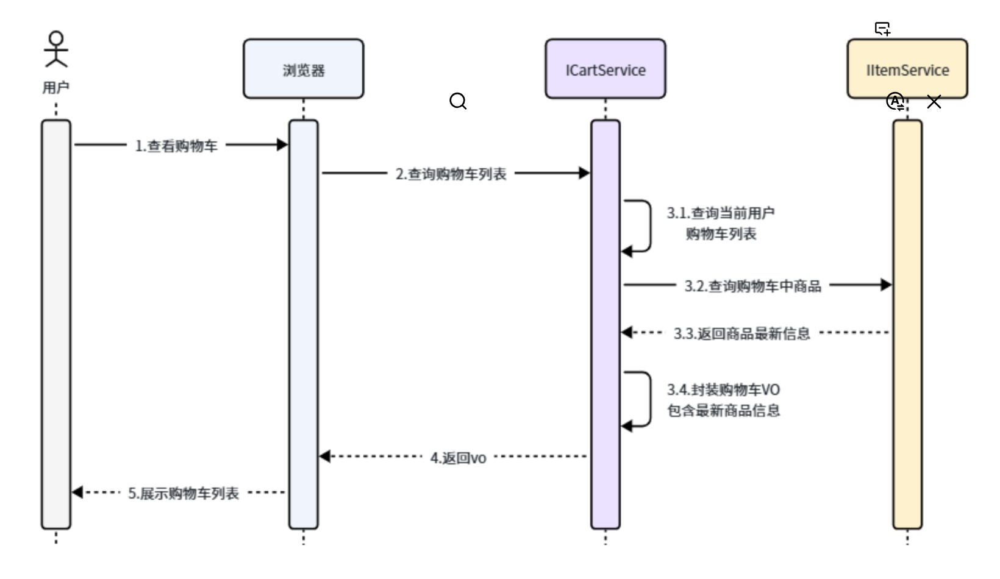

#### 2.2.4.下单

在购物车页面点击结算按钮，会进入订单结算页面：

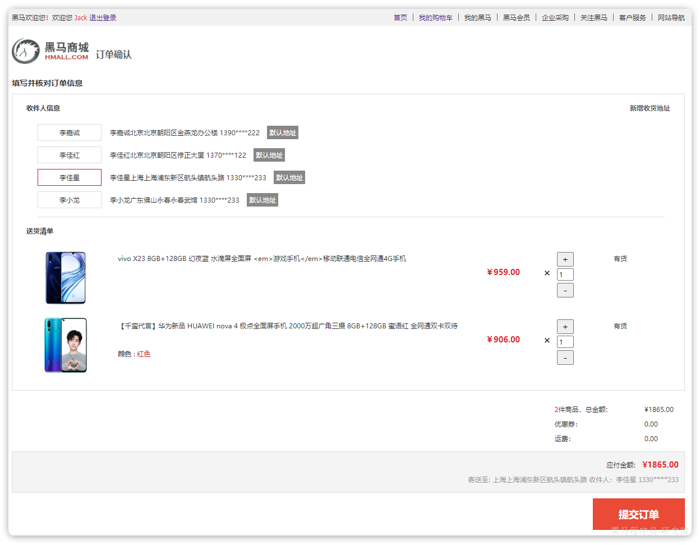

点击提交订单，会提交请求到服务端，服务端做3件事情：

- 创建一个新的订单
- 扣减商品库存
- 清理购物车中商品

业务入口在com.hmall.controller.OrderController中的createOrder方法：

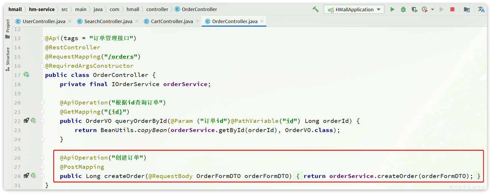

#### 2.2.5.支付

下单完成后会跳转到支付页面，目前只支持余额支付：

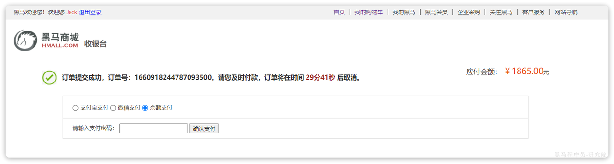

在选择余额支付这种方式后，会发起请求到服务端，服务端会立刻创建一个支付流水单，并返回支付流水单号到前端。

当用户输入用户密码，然后点击确认支付时，页面会发送请求到服务端，而服务端会做几件事情：

- 校验用户密码
- 扣减余额
- 修改支付流水状态
- 修改交易订单状态

请求入口在com.hmall.controller.PayController中：

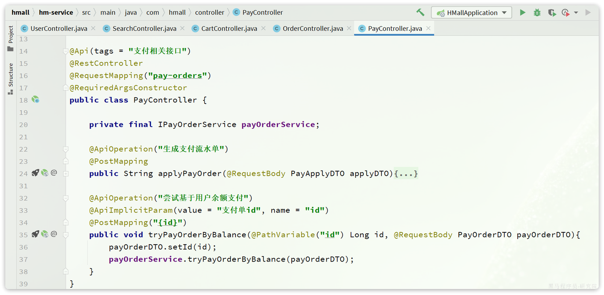

### 2.2.服务拆分原则

服务拆分一定要考虑几个问题：

- 什么时候拆？
- 如何拆？

#### 2.2.1.什么时候拆

一般情况下，对于一个初创的项目，首先要做的是验证项目的可行性。因此这一阶段的首要任务是敏捷开发，快速产出生产可用的产品，投入市场做验证。为了达成这一目的，该阶段项目架构往往会比较简单，很多情况下会直接采用单体架构，这样开发成本比较低，可以快速产出结果，一旦发现项目不符合市场，损失较小。

如果这一阶段采用复杂的微服务架构，投入大量的人力和时间成本用于架构设计，最终发现产品不符合市场需求，等于全部做了无用功。

所以，对于大多数小型项目来说，一般是先采用单体架构，随着用户规模扩大、业务复杂后再逐渐拆分为微服务架构。这样初期成本会比较低，可以快速试错。但是，这么做的问题就在于后期做服务拆分时，可能会遇到很多代码耦合带来的问题，拆分比较困难（前易后难）。

而对于一些大型项目，在立项之初目的就很明确，为了长远考虑，在架构设计时就直接选择微服务架构。虽然前期投入较多，但后期就少了拆分服务的烦恼（前难后易）。

#### 2.2.2.怎么拆

之前我们说过，微服务拆分时粒度要小，这其实是拆分的目标。具体可以从两个角度来分析：

- **高内聚**：每个微服务的职责要尽量单一，包含的业务相互关联度高、完整度高。
- **低耦合**：每个微服务的功能要相对独立，尽量减少对其它微服务的依赖，或者依赖接口的稳定性要强。

高内聚首先是单一职责，但不能说一个微服务就一个接口，而是要保证微服务内部业务的完整性为前提。目标是当我们要修改某个业务时，最好就只修改当前微服务，这样变更的成本更低。

一旦微服务做到了高内聚，那么服务之间的耦合度自然就降低了。

当然，微服务之间不可避免的会有或多或少的业务交互，比如下单时需要查询商品数据。这个时候我们不能在订单服务直接查询商品数据库，否则就导致了数据耦合。而应该由商品服务对应暴露接口，并且一定要保证微服务对外接口的稳定性（即：尽量保证接口外观不变）。虽然出现了服务间调用，但此时无论你如何在商品服务做内部修改，都不会影响到订单微服务，服务间的耦合度就降低了。

明确了拆分目标，接下来就是拆分方式了。我们在做服务拆分时一般有两种方式：

- 纵向拆分
- 横向拆分

所谓纵向拆分，就是按照项目的功能模块来拆分。例如黑马商城中，就有用户管理功能、订单管理功能、购物车功能、商品管理功能、支付功能等。那么按照功能模块将他们拆分为一个个服务，就属于纵向拆分。这种拆分模式可以尽可能提高服务的内聚性。

而横向拆分，是看各个功能模块之间有没有公共的业务部分，如果有将其抽取出来作为通用服务。例如用户登录是需要发送消息通知，记录风控数据，下单时也要发送短信，记录风控数据。因此消息发送、风控数据记录就是通用的业务功能，因此可以将他们分别抽取为公共服务：消息中心服务、风控管理服务。这样可以提高业务的复用性，避免重复开发。同时通用业务一般接口稳定性较强，也不会使服务之间过分耦合。

当然，由于黑马商城并不是一个完整的项目，其中的短信发送、风控管理并没有实现，这里就不再考虑了。而其它的业务按照纵向拆分，可以分为以下几个微服务：

- 用户服务
- 商品服务
- 订单服务
- 购物车服务
- 支付服务

### 2.3.拆分购物车、商品服务

接下来，我们先把商品管理功能、购物车功能抽取为两个独立服务。

一般微服务项目有两种不同的工程结构：

- **完全解耦**：每一个微服务都创建为一个独立的工程，甚至可以使用不同的开发语言来开发，项目完全解耦。
  - **优点**：服务之间耦合度低
  - **缺点**：每个项目都有自己的独立仓库，管理起来比较麻烦
  - **优点**：服务之间耦合度低
  - **缺点**：每个项目都有自己的独立仓库，管理起来比较麻烦
- **Maven聚合**：整个项目为一个Project，然后每个微服务是其中的一个Module
  - **优点**：项目代码集中，管理和运维方便（授课也方便）
  - **缺点**：服务之间耦合，编译时间较长
  - **优点**：项目代码集中，管理和运维方便（授课也方便）
  - **缺点**：服务之间耦合，编译时间较长

> ❗ 注意： 为了授课方便，我们会采用Maven聚合工程，大家以后到了企业，可以根据需求自由选择工程结构。

在hmall父工程之中，我已经提前定义了SpringBoot、SpringCloud的依赖版本，所以为了方便期间，我们直接在这个项目中创建微服务module.

#### 2.3.1.商品服务

在hmall中创建module：

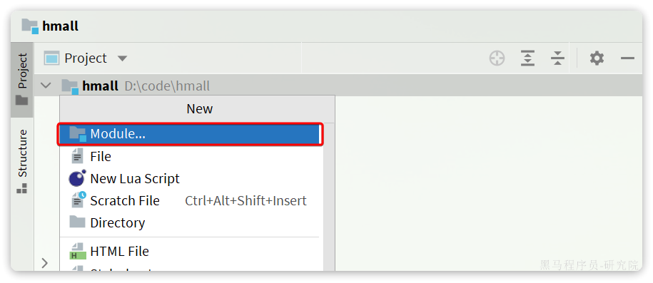

选择maven模块，并设定JDK版本为11：

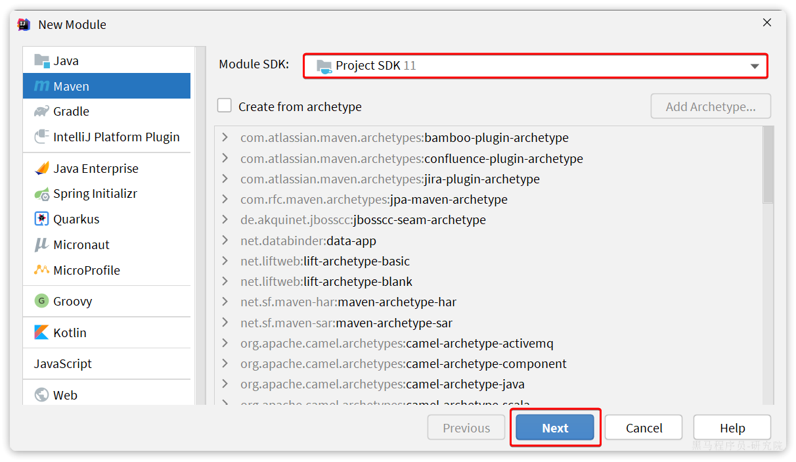

商品模块，我们起名为item-service：

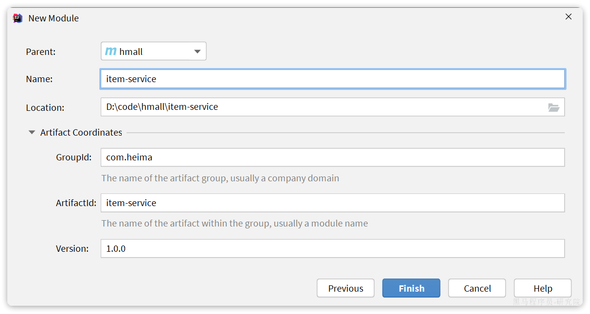

引入依赖：

```xml
<?xml version="1.0" encoding="UTF-8"?>
<project xmlns="http://maven.apache.org/POM/4.0.0"
         xmlns:xsi="http://www.w3.org/2001/XMLSchema-instance"
         xsi:schemaLocation="http://maven.apache.org/POM/4.0.0 http://maven.apache.org/xsd/maven-4.0.0.xsd">
    <parent>
        <artifactId>hmall</artifactId>
        <groupId>com.heima</groupId>
        <version>1.0.0</version>
    </parent>
    <modelVersion>4.0.0</modelVersion>

    <artifactId>item-service</artifactId>

    <properties>
        <maven.compiler.source>11</maven.compiler.source>
        <maven.compiler.target>11</maven.compiler.target>
    </properties>
    <dependencies>
        <!--common-->
        <dependency>
            <groupId>com.heima</groupId>
            <artifactId>hm-common</artifactId>
            <version>1.0.0</version>
        </dependency>
        <!--web-->
        <dependency>
            <groupId>org.springframework.boot</groupId>
            <artifactId>spring-boot-starter-web</artifactId>
        </dependency>
        <!--数据库-->
        <dependency>
            <groupId>mysql</groupId>
            <artifactId>mysql-connector-java</artifactId>
        </dependency>
        <!--mybatis-->
        <dependency>
            <groupId>com.baomidou</groupId>
            <artifactId>mybatis-plus-boot-starter</artifactId>
        </dependency>
        <!--单元测试-->
        <dependency>
            <groupId>org.springframework.boot</groupId>
            <artifactId>spring-boot-starter-test</artifactId>
        </dependency>
    </dependencies>
    <build>
        <finalName>${project.artifactId}</finalName>
        <plugins>
            <plugin>
                <groupId>org.springframework.boot</groupId>
                <artifactId>spring-boot-maven-plugin</artifactId>
            </plugin>
        </plugins>
    </build>
</project>
```

编写启动类：

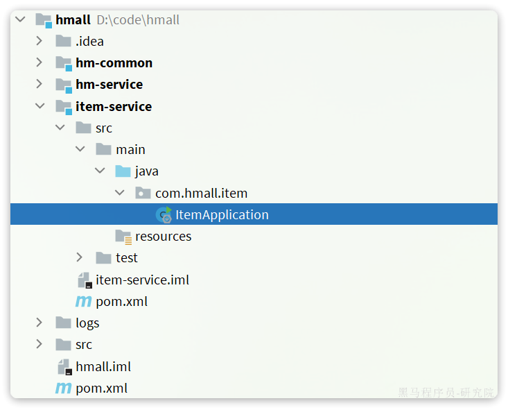

代码如下：

```java
package com.hmall.item;

import org.mybatis.spring.annotation.MapperScan;
import org.springframework.boot.SpringApplication;
import org.springframework.boot.autoconfigure.SpringBootApplication;

@MapperScan("com.hmall.item.mapper")
@SpringBootApplication
public class ItemApplication {
    public static void main(String[] args) {
        SpringApplication.run(ItemApplication.class, args);
    }
}
```

接下来是配置文件，可以从hm-service中拷贝：

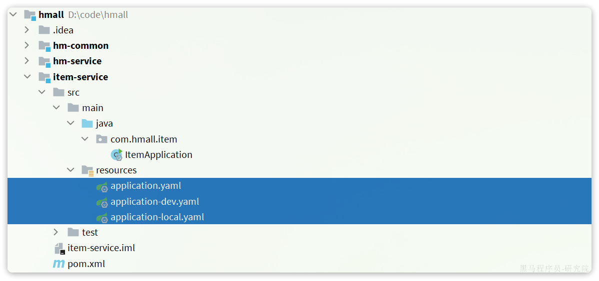

其中，application.yaml内容如下：

```yaml
server:
  port: 8081
spring:
  application:
    name: item-service
  profiles:
    active: dev
  datasource:
    url: jdbc:mysql://${hm.db.host}:3306/hm-item?useUnicode=true&characterEncoding=UTF-8&autoReconnect=true&serverTimezone=Asia/Shanghai
    driver-class-name: com.mysql.cj.jdbc.Driver
    username: root
    password: ${hm.db.pw}
mybatis-plus:
  configuration:
    default-enum-type-handler: com.baomidou.mybatisplus.core.handlers.MybatisEnumTypeHandler
  global-config:
    db-config:
      update-strategy: not_null
      id-type: auto
logging:
  level:
    com.hmall: debug
  pattern:
    dateformat: HH:mm:ss:SSS
  file:
    path: "logs/${spring.application.name}"
knife4j:
  enable: true
  openapi:
    title: 商品服务接口文档
    description: "信息"
    email: zhanghuyi@itcast.cn
    concat: 虎哥
    url: https://www.itcast.cn
    version: v1.0.0
    group:
      default:
        group-name: default
        api-rule: package
        api-rule-resources:
          - com.hmall.item.controller
```

剩下的application-dev.yaml和application-local.yaml直接从hm-service拷贝即可。

然后拷贝hm-service中与商品管理有关的代码到item-service，如图：

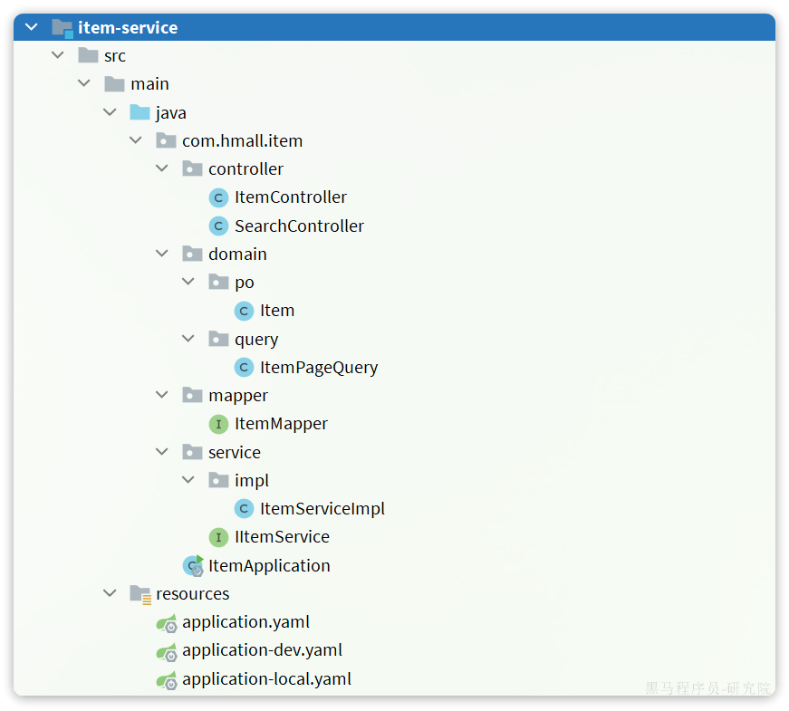

这里有一个地方的代码需要改动，就是ItemServiceImpl中的deductStock方法：

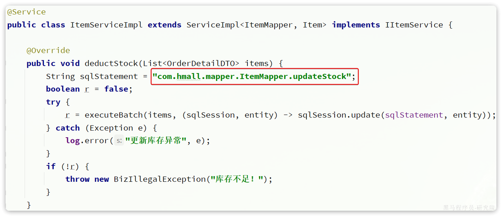

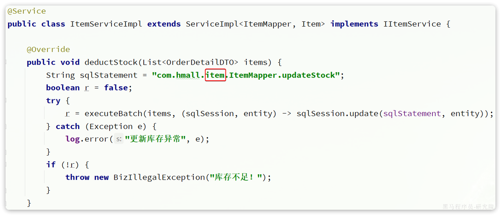

改动后

改动前

这也是因为ItemMapper的所在包发生了变化，因此这里代码必须修改包路径。

最后，还要导入数据库表。默认的数据库连接的是虚拟机，在你docker数据库执行课前资料提供的SQL文件：

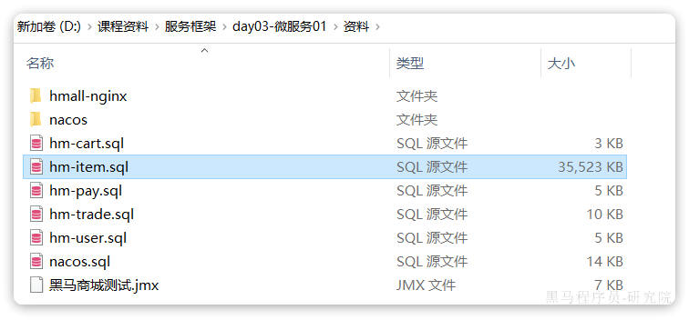

最终，会在数据库创建一个名为hm-item的database，将来的每一个微服务都会有自己的一个database：

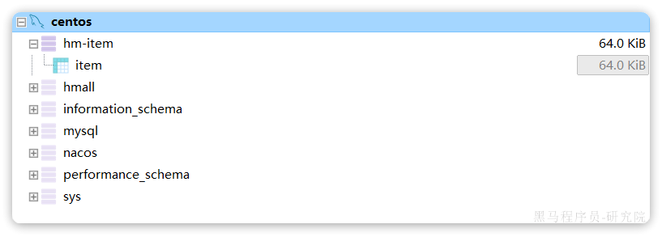

> ❗ 注意：在企业开发的生产环境中，每一个微服务都应该有自己的独立数据库服务，而不仅仅是database，课堂我们用database来代替。

接下来，就可以启动测试了，在启动前我们要配置一下启动项，让默认激活的配置为local而不是dev：

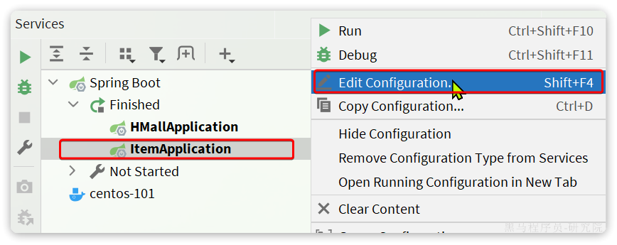

在打开的编辑框填写active profiles:

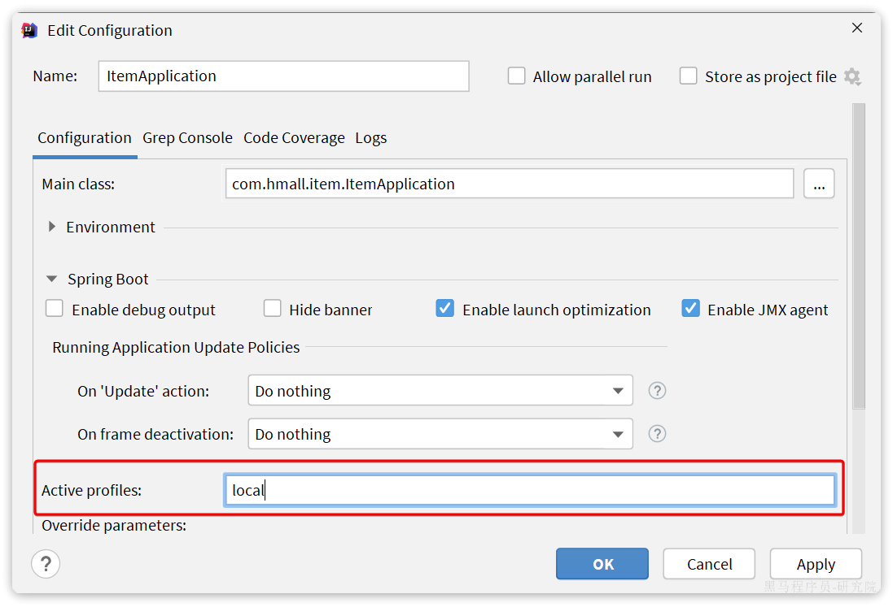

接着，启动item-service，访问商品微服务的swagger接口文档：http://localhost:8081/doc.html

然后测试其中的根据id批量查询商品这个接口：

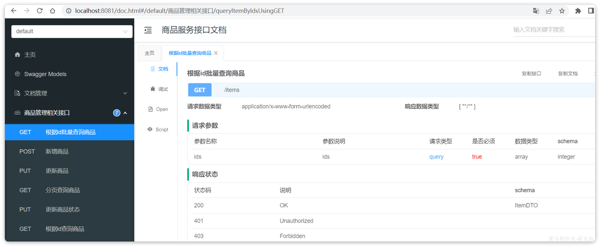

测试参数：100002672302,100002624500,100002533430，结果如下：

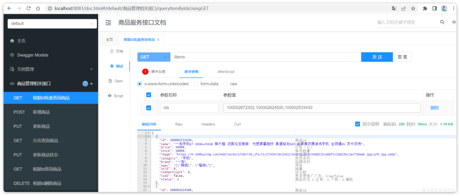

说明商品微服务抽取成功了。

#### 2.3.2.购物车服务

与商品服务类似，在hmall下创建一个新的module，起名为cart-service:

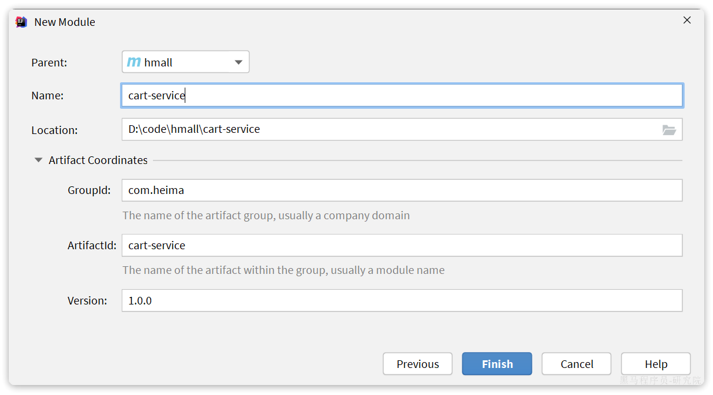

然后是依赖：

```xml
<?xml version="1.0" encoding="UTF-8"?>
<project xmlns="http://maven.apache.org/POM/4.0.0"
         xmlns:xsi="http://www.w3.org/2001/XMLSchema-instance"
         xsi:schemaLocation="http://maven.apache.org/POM/4.0.0 http://maven.apache.org/xsd/maven-4.0.0.xsd">
    <parent>
        <artifactId>hmall</artifactId>
        <groupId>com.heima</groupId>
        <version>1.0.0</version>
    </parent>
    <modelVersion>4.0.0</modelVersion>

    <artifactId>cart-service</artifactId>

    <properties>
        <maven.compiler.source>11</maven.compiler.source>
        <maven.compiler.target>11</maven.compiler.target>
    </properties>

    <dependencies>
        <!--common-->
        <dependency>
            <groupId>com.heima</groupId>
            <artifactId>hm-common</artifactId>
            <version>1.0.0</version>
        </dependency>
        <!--web-->
        <dependency>
            <groupId>org.springframework.boot</groupId>
            <artifactId>spring-boot-starter-web</artifactId>
        </dependency>
        <!--数据库-->
        <dependency>
            <groupId>mysql</groupId>
            <artifactId>mysql-connector-java</artifactId>
        </dependency>
        <!--mybatis-->
        <dependency>
            <groupId>com.baomidou</groupId>
            <artifactId>mybatis-plus-boot-starter</artifactId>
        </dependency>
        <!--单元测试-->
        <dependency>
            <groupId>org.springframework.boot</groupId>
            <artifactId>spring-boot-starter-test</artifactId>
        </dependency>
    </dependencies>
    <build>
        <finalName>${project.artifactId}</finalName>
        <plugins>
            <plugin>
                <groupId>org.springframework.boot</groupId>
                <artifactId>spring-boot-maven-plugin</artifactId>
            </plugin>
        </plugins>
    </build>
</project>
```

然后是启动类：

```java
package com.hmall.cart;

import org.mybatis.spring.annotation.MapperScan;
import org.springframework.boot.SpringApplication;
import org.springframework.boot.autoconfigure.SpringBootApplication;

@MapperScan("com.hmall.cart.mapper")
@SpringBootApplication
public class CartApplication {
    public static void main(String[] args) {
        SpringApplication.run(CartApplication.class, args);
    }
}
```

然后是配置文件，同样可以拷贝自item-service，不过其中的application.yaml需要修改：

```yaml
server:
  port: 8082
spring:
  application:
    name: cart-service
  profiles:
    active: dev
  datasource:
    url: jdbc:mysql://${hm.db.host}:3306/hm-cart?useUnicode=true&characterEncoding=UTF-8&autoReconnect=true&serverTimezone=Asia/Shanghai
    driver-class-name: com.mysql.cj.jdbc.Driver
    username: root
    password: ${hm.db.pw}
mybatis-plus:
  configuration:
    default-enum-type-handler: com.baomidou.mybatisplus.core.handlers.MybatisEnumTypeHandler
  global-config:
    db-config:
      update-strategy: not_null
      id-type: auto
logging:
  level:
    com.hmall: debug
  pattern:
    dateformat: HH:mm:ss:SSS
  file:
    path: "logs/${spring.application.name}"
knife4j:
  enable: true
  openapi:
    title: 商品服务接口文档
    description: "信息"
    email: zhanghuyi@itcast.cn
    concat: 虎哥
    url: https://www.itcast.cn
    version: v1.0.0
    group:
      default:
        group-name: default
        api-rule: package
        api-rule-resources:
          - com.hmall.cart.controller
```

最后，把hm-service中的与购物车有关功能拷贝过来，最终的项目结构如下：

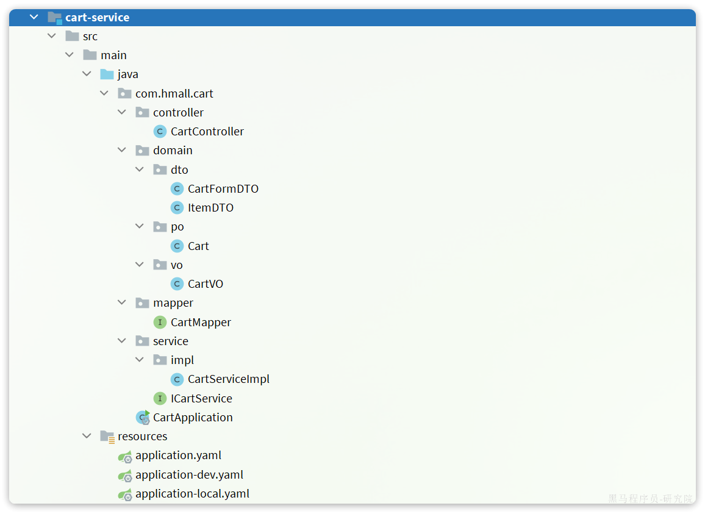

特别注意的是com.hmall.cart.service.impl.CartServiceImpl，其中有两个地方需要处理：

- 需要获取登录用户信息，但登录校验功能目前没有复制过来，先写死固定用户id
- 查询购物车时需要查询商品信息，而商品信息不在当前服务，需要先将这部分代码注释

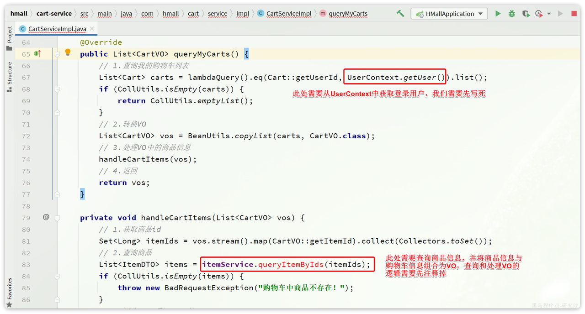

我们对这部分代码做如下修改：

```java
    @Override
    public void addItem2Cart(CartFormDTO cartFormDTO) {
        // 1.获取登录用户
        Long userId = UserContext.getUser();

        // 2.判断是否已经存在
        if (checkItemExists(cartFormDTO.getItemId(), userId)) {
            // 2.1.存在，则更新数量
            baseMapper.updateNum(cartFormDTO.getItemId(), userId);
            return;
        }
        // 2.2.不存在，判断是否超过购物车数量
        checkCartsFull(userId);

        // 3.新增购物车条目
        // 3.1.转换PO
        Cart cart = BeanUtils.copyBean(cartFormDTO, Cart.class);
        // 3.2.保存当前用户
        cart.setUserId(userId);
        // 3.3.保存到数据库
        save(cart);
    }

    @Override
    public List<CartVO> queryMyCarts() {
        // 1.查询我的购物车列表
        List<Cart> carts = lambdaQuery().eq(Cart::getUserId, 1L /*TODO UserContext.getUser()*/).list();
        if (CollUtils.isEmpty(carts)) {
            return CollUtils.emptyList();
        }
        // 2.转换VO
        List<CartVO> vos = BeanUtils.copyList(carts, CartVO.class);
        // 3.处理VO中的商品信息
        handleCartItems(vos);
        // 4.返回
        return vos;
    }

    private void handleCartItems(List<CartVO> vos) {
        // 1.获取商品id TODO 处理商品信息
        /*Set<Long> itemIds = vos.stream().map(CartVO::getItemId).collect(Collectors.toSet());
        // 2.查询商品
        List<ItemDTO> items = itemService.queryItemByIds(itemIds);
        if (CollUtils.isEmpty(items)) {
            throw new BadRequestException("购物车中商品不存在！");
        }
        // 3.转为 id 到 item的map
        Map<Long, ItemDTO> itemMap = items.stream().collect(Collectors.toMap(ItemDTO::getId, Function.identity()));
        // 4.写入vo
        for (CartVO v : vos) {
            ItemDTO item = itemMap.get(v.getItemId());
            if (item == null) {
                continue;
            }
            v.setNewPrice(item.getPrice());
            v.setStatus(item.getStatus());
            v.setStock(item.getStock());
        }*/
    }

    @Override
    public void removeByItemIds(Collection<Long> itemIds) {
        // 1.构建删除条件，userId和itemId
        QueryWrapper<Cart> queryWrapper = new QueryWrapper<Cart>();
        queryWrapper.lambda()
                .eq(Cart::getUserId, UserContext.getUser())
                .in(Cart::getItemId, itemIds);
        // 2.删除
        remove(queryWrapper);
    }

    private void checkCartsFull(Long userId) {
        int count = lambdaQuery().eq(Cart::getUserId, userId).count();
        if (count >= 10) {
            throw new BizIllegalException(StrUtil.format("用户购物车课程不能超过{}", 10));
        }
    }

    private boolean checkItemExists(Long itemId, Long userId) {
        int count = lambdaQuery()
                .eq(Cart::getUserId, userId)
                .eq(Cart::getItemId, itemId)
                .count();
        return count > 0;
    }
```

最后，还是要导入数据库表，在本地数据库直接执行课前资料对应的SQL文件：

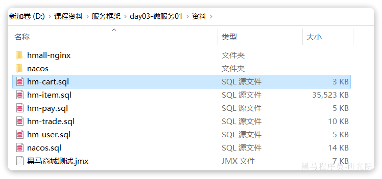

在数据库中会出现名为hm-cart的database，以及其中的cart表，代表购物车：

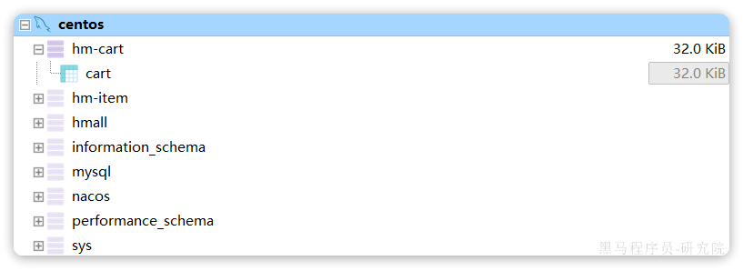

接下来，就可以测试了。不过在启动前，同样要配置启动项的active profile为local：

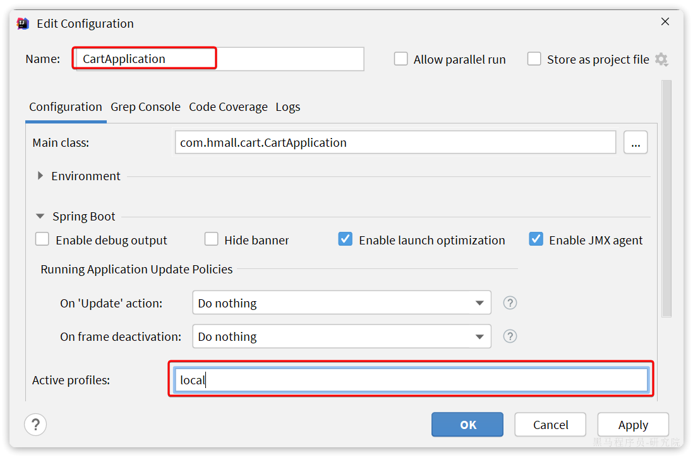

然后启动CartApplication，访问swagger文档页面：http://localhost:8082/doc.html

我们测试其中的查询我的购物车列表接口：

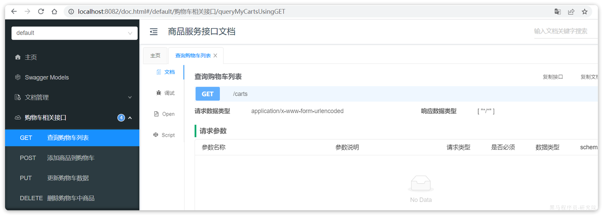

无需填写参数，直接访问：

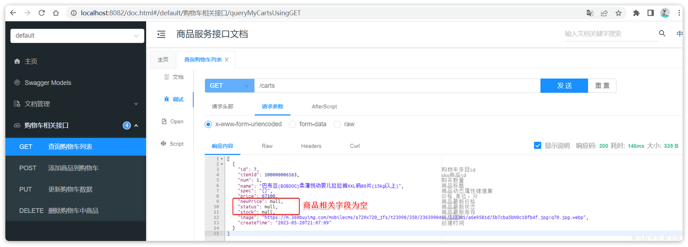

我们注意到，其中与商品有关的几个字段值都为空！这就是因为刚才我们注释掉了查询购物车时，查询商品信息的相关代码。

那么，我们该如何在cart-service服务中实现对item-service服务的查询呢？

### 2.4.服务调用

在拆分的时候，我们发现一个问题：就是购物车业务中需要查询商品信息，但商品信息查询的逻辑全部迁移到了item-service服务，导致我们无法查询。

最终结果就是查询到的购物车数据不完整，因此要想解决这个问题，我们就必须改造其中的代码，把原本本地方法调用，改造成**跨微服务的远程调用（RPC，即 Remote Procedure Call）**。

因此，现在查询购物车列表的流程变成了这样：

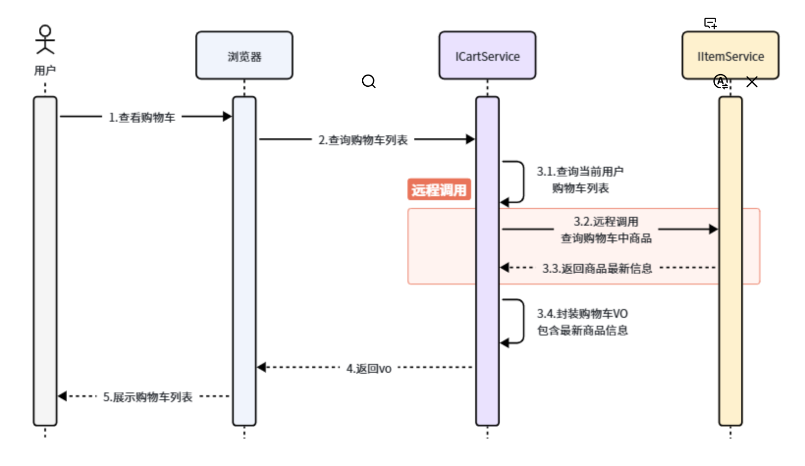

代码中需要变化的就是这一步：

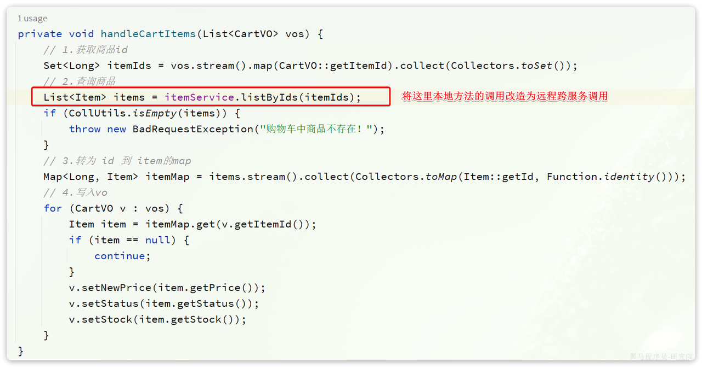

那么问题来了：我们该如何跨服务调用，准确的说，如何在cart-service中获取item-service服务中的提供的商品数据呢？

大家思考一下，我们以前有没有实现过类似的远程查询的功能呢？

答案是肯定的，我们前端向服务端查询数据，其实就是从浏览器远程查询服务端数据。比如我们刚才通过Swagger测试商品查询接口，就是向http://localhost:8081/items这个接口发起的请求：

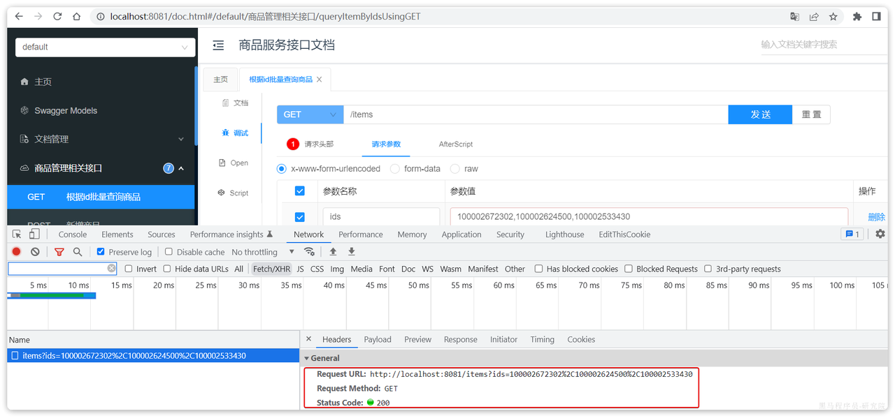

而这种查询就是通过http请求的方式来完成的，不仅仅可以实现远程查询，还可以实现新增、删除等各种远程请求。

> 💡 假如我们在cart-service中能模拟浏览器，发送http请求到item-service，是不是就实现了跨微服务的远程调用了呢？

那么：我们该如何用Java代码发送Http的请求呢？

#### ⭐2.4.1.RestTemplate

⭐⭐Spring给我们提供了一个RestTemplate的API，可以方便的实现Http请求的发送。使用步骤如下：

**① 注入RestTemplate到Spring容器**

~~~java
@Bean
public RestTemplate restTemplate(){
    return new RestTemplate();
}
~~~

**② 发起远程调用**

~~~java
public <T> ResponseEntity<T> exchange(
        String url,                          // 请求路径        "http://localhost:8081/items?id={id}"
        HttpMethod method,                   // 请求方式        HttpMethod.GET
        @Nullable HttpEntity<?> requestEntity, // 请求实体，可以为空
        Class<T> responseType,               // 返回值类型      User.class
        Map<String, ?> uriVariables          // 请求参数        Map.of("id", "1")
)
~~~

**⭐注意：**

* 用下面两行代码可以起到**代替代码@Autowired private RestTemplate restTemplate;**的作用

  ~~~java
  @RequiredArgsConstructor
  
  private final RestTemplate restTemplate;
  ~~~

  

>同步客户端执行HTTP请求，在底层HTTP客户端库(如JDK HttpURLConnection、Apache HttpComponents等)上公开一个简单的模板方法API。RestTemplate通过HTTP方法为常见场景提供了模板，此外还提供了支持不太常见情况的通用交换和执行方法。 RestTemplate通常用作共享组件。然而，它的配置不支持并发修改，因此它的配置通常是在启动时准备的。如果需要，您可以在启动时创建多个不同配置的RestTemplate实例。如果这些实例需要共享HTTP客户端资源，它们可以使用相同的底层ClientHttpRequestFactory。 注意:从5.0开始，这个类处于维护模式，只有对更改和错误的小请求才会被接受。请考虑使用org.springframework.web.react .client. webclient，它有更现代的API，支持同步、异步和流场景。
>
>---
>
>自: 3.0 参见: HttpMessageConverter, RequestCallback, ResponseExtractor, ResponseErrorHandler

其中提供了大量的方法，方便我们发送Http请求，例如：

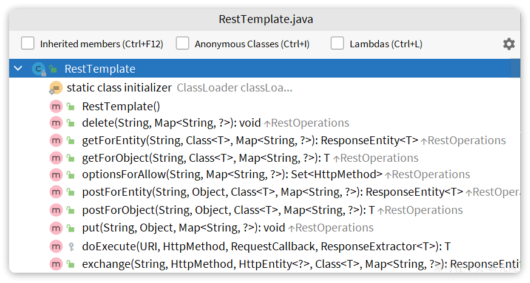

可以看到常见的Get、Post、Put、Delete请求都支持，如果请求参数比较复杂，还可以使用exchange方法来构造请求。

我们在cart-service服务中定义一个配置类：

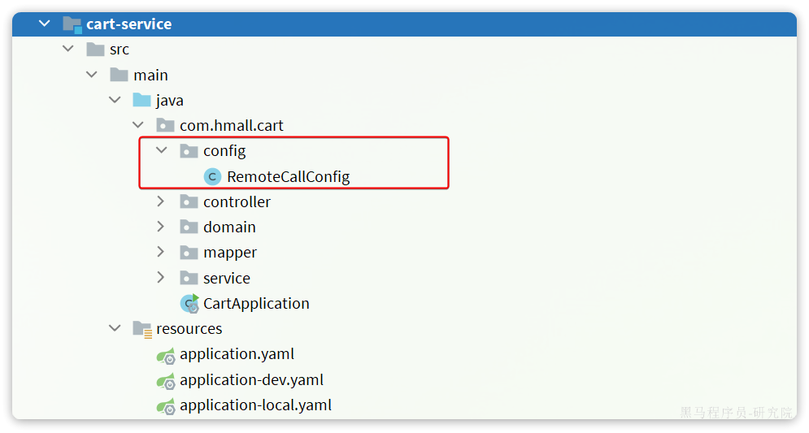

先将RestTemplate注册为一个Bean：

```java
package com.hmall.cart.config;

import org.springframework.context.annotation.Bean;
import org.springframework.context.annotation.Configuration;
import org.springframework.web.client.RestTemplate;

@Configuration
public class RemoteCallConfig {

    @Bean
    public RestTemplate restTemplate() {
        return new RestTemplate();
    }
}
```

#### 2.4.2.远程调用

接下来，我们修改cart-service中的com.hmall.cart.service.impl.CartServiceImpl的handleCartItems方法，发送http请求到item-service：

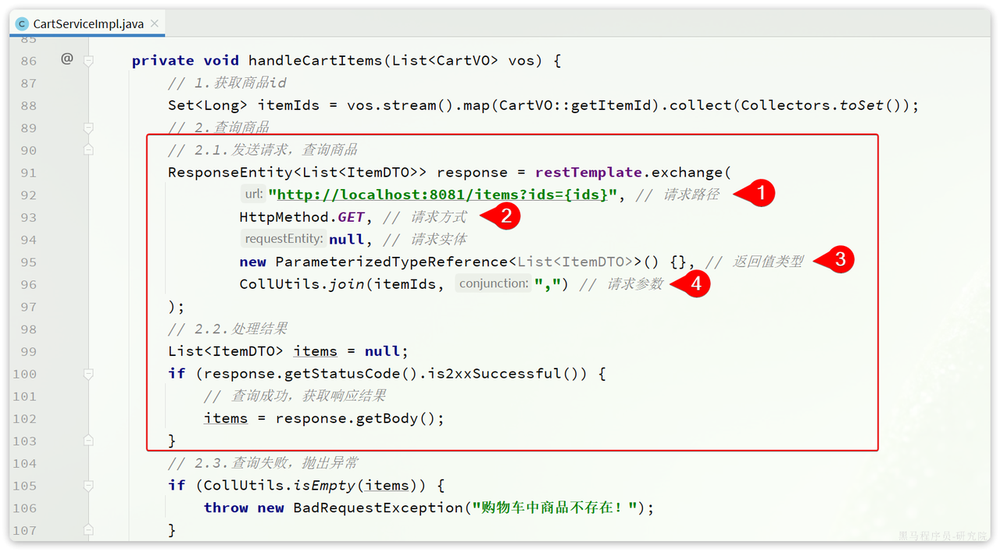

可以看到，利用RestTemplate发送http请求与前端ajax发送请求非常相似，都包含四部分信息：

- ① 请求方式
- ② 请求路径
- ③ 请求参数
- ④  返回值类型

handleCartItems方法的完整代码如下：

```java
private void handleCartItems(List<CartVO> vos) {
    // TODO 1.获取商品id
    Set<Long> itemIds = vos.stream().map(CartVO::getItemId).collect(Collectors.toSet());
    // 2.查询商品
    // List<ItemDTO> items = itemService.queryItemByIds(itemIds);
    // 2.1.利用RestTemplate发起http请求，得到http的响应
    ResponseEntity<List<ItemDTO>> response = restTemplate.exchange(
            "http://localhost:8081/items?ids={ids}",
            HttpMethod.GET,
            null,
            new ParameterizedTypeReference<List<ItemDTO>>() {
            },
            Map.of("ids", CollUtil.join(itemIds, ","))
    );
    // 2.2.解析响应
    if(!response.getStatusCode().is2xxSuccessful()){
        // 查询失败，直接结束
        return;
    }
    List<ItemDTO> items = response.getBody();
    if (CollUtils.isEmpty(items)) {
        return;
    }
    // 3.转为 id 到 item的map
    Map<Long, ItemDTO> itemMap = items.stream().collect(Collectors.toMap(ItemDTO::getId, Function.identity()));
    // 4.写入vo
    for (CartVO v : vos) {
        ItemDTO item = itemMap.get(v.getItemId());
        if (item == null) {
            continue;
        }
        v.setNewPrice(item.getPrice());
        v.setStatus(item.getStatus());
        v.setStock(item.getStock());
    }
}
```

好了，现在重启cart-service，再次测试查询我的购物车列表接口：

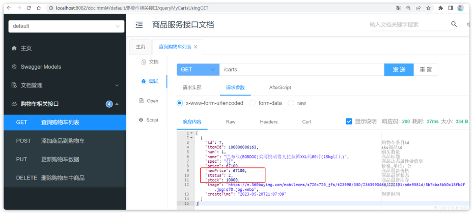

可以发现，所有商品相关数据都已经查询到了。

在这个过程中，item-service提供了查询接口，cart-service利用Http请求调用该接口。因此 item-service 称为**服务的提供者**，而 cart-service 称为**服务的消费者（服务调用者）**。

### 2.5.总结

什么时候需要拆分微服务？

- 如果是创业型公司，最好先用单体架构快速迭代开发，验证市场运作模型，快速试错。当业务跑通以后，随着业务规模扩大、人员规模增加，再考虑拆分微服务。
- 如果是大型企业，有充足的资源，可以在项目开始之初就搭建微服务架构。

如何拆分？

- 首先要做到高内聚、低耦合
- 从拆分方式来说，有横向拆分和纵向拆分两种。纵向就是按照业务功能模块，横向则是拆分通用性业务，提高复用性

服务拆分之后，不可避免的会出现跨微服务的业务，此时微服务之间就需要进行远程调用。微服务之间的远程调用被称为 **RPC（远程过程调用）**。RPC的实现方式有很多，比如：

- 基于Http协议
- 基于Dubbo协议

我们课堂中使用的是Http方式，这种方式不关心服务提供者的具体技术实现，只要对外暴露Http接口即可，更符合微服务的需要。

Java发送http请求可以使用Spring提供的RestTemplate，使用的基本步骤如下：

- 注册RestTemplate到Spring容器
- 调用RestTemplate的API发送请求，常见方法有：
  - **getForObject**：发送Get请求并返回指定类型对象
  - **PostForObject**：发送Post请求并返回指定类型对象
  - **put**：发送PUT请求
  - **delete**：发送Delete请求
  - **exchange**：发送任意类型请求，返回ResponseEntity
  - **getForObject**：发送Get请求并返回指定类型对象
  - **PostForObject**：发送Post请求并返回指定类型对象
  - **put**：发送PUT请求
  - **delete**：发送Delete请求
  - **exchange**：发送任意类型请求，返回ResponseEntity

## 3.服务注册和发现

在上一章我们实现了微服务拆分，并且通过Http请求实现了跨微服务的远程调用。不过这种手动发送Http请求的方式存在一些问题。

试想一下，假如商品微服务被调用较多，为了应对更高的并发，我们进行了多实例部署，如图：

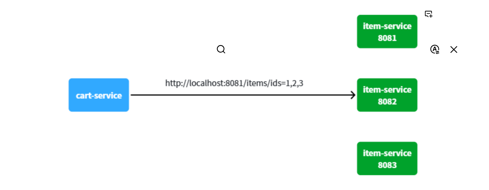

**此时，每个item-service的实例其IP或端口不同，问题来了：**

- item-service这么多实例，cart-service如何知道每一个实例的地址？
- http请求要写url地址，cart-service服务到底该调用哪个实例呢？
- 如果在运行过程中，某一个item-service实例宕机，cart-service依然在调用该怎么办？
- 如果并发太高，item-service临时多部署了N台实例，cart-service如何知道新实例的地址？

为了解决上述问题，就必须引入**注册中心**的概念了，接下来我们就一起来分析下注册中心的原理。

### ⭐3.1.注册中心原理

在微服务远程调用的过程中，包括两个角色：

- **服务提供者**：提供接口供其它微服务访问，比如item-service
- **服务消费者**：调用其它微服务提供的接口，比如cart-service

在大型微服务项目中，服务提供者的数量会非常多，为了管理这些服务就引入了注册中心的概念。**注册中心、服务提供者、服务消费者**三者间关系如下：

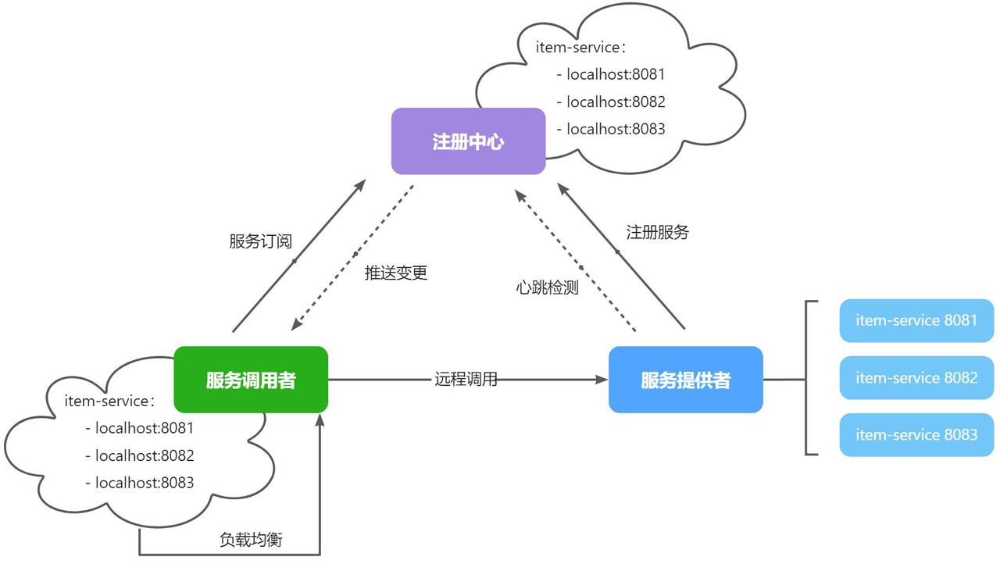

**⭐流程如下：**

- 服务启动时就会注册自己的服务信息（服务名、IP、端口）到注册中心
- 调用者可以从注册中心订阅想要的服务，获取服务对应的实例列表（1个服务可能多实例部署）
- 调用者自己对实例列表负载均衡，挑选一个实例
- 调用者向该实例发起远程调用

**⭐当服务提供者的实例宕机或者启动新实例时，调用者如何得知呢？**

- 服务提供者会定期向注册中心发送请求，报告自己的健康状态（心跳请求）
- 当注册中心长时间收不到提供者的心跳时，会认为该实例宕机，将其从服务的实例列表中剔除
- 当服务有新实例启动时，会发送注册服务请求，其信息会被记录在注册中心的服务实例列表
- 当注册中心服务列表变更时，会主动通知微服务，更新本地服务列表


> ⭐⭐
>
> **服务治理中的三个角色分别是什么？**
>
> - 服务提供者：暴露服务接口，供其它服务调用
> - 服务消费者：调用其它服务提供的接口
> - 注册中心：记录并监控微服务各实例状态，推送服务变更信息
>
> **消费者如何知道提供者的地址？**
>
> - 服务提供者会在启动时注册自己信息到注册中心，消费者可以从注册中心订阅和拉取服务信息
>
> **消费者如何得知服务状态变更？**
>
> - 服务提供者通过心跳机制向注册中心报告自己的健康状态，当心跳异常时注册中心会将异常服务剔除，并通知订阅了该服务的消费者
>
> **当提供者有多个实例时，消费者该选择哪一个？**
>
> - 消费者可以通过负载均衡算法，从多个实例中选择一个

### 3.2.Nacos注册中心

目前开源的注册中心框架有很多，国内比较常见的有： 

- **Eureka**：Netflix公司出品，目前被集成在SpringCloud当中，一般用于Java应用
- **Nacos**：Alibaba公司出品，目前被集成在SpringCloudAlibaba中，一般用于Java应用
- **Consul**：HashiCorp公司出品，目前集成在SpringCloud中，不限制微服务语言

以上几种注册中心都遵循SpringCloud中的API规范，因此在业务开发使用上没有太大差异。由于Nacos是国内产品，中文文档比较丰富，而且同时具备配置管理功能（后面会学习），因此在国内使用较多，课堂中我们会Nacos为例来学习。

官方网站如下：

我们基于Docker来部署Nacos的注册中心，首先我们要准备MySQL数据库表，用来存储Nacos的数据。由于是Docker部署，所以大家需要将资料中的SQL文件导入到你Docker中的MySQL容器中：

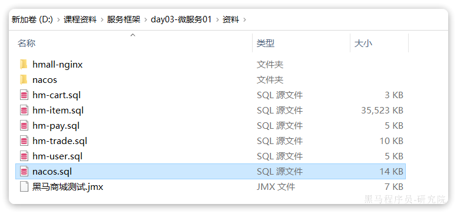

最终表结构如下：

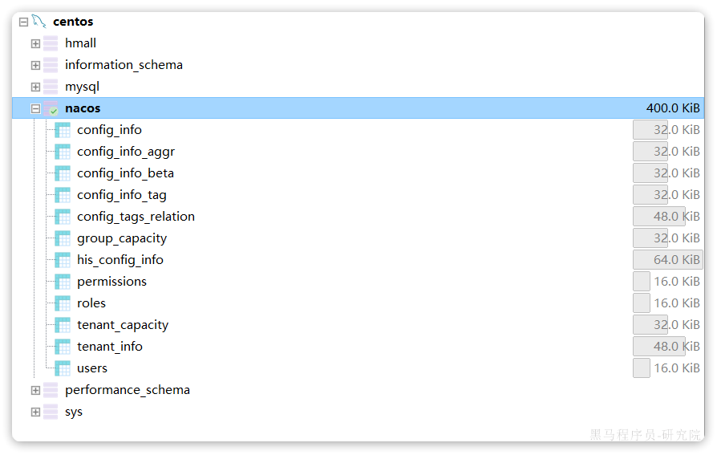

然后，找到课前资料下的nacos文件夹：

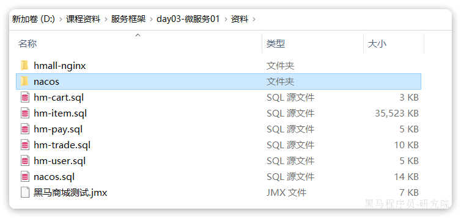

其中的nacos/custom.env文件中，有一个MYSQL_SERVICE_HOST也就是mysql地址，需要修改为你自己的虚拟机IP地址：

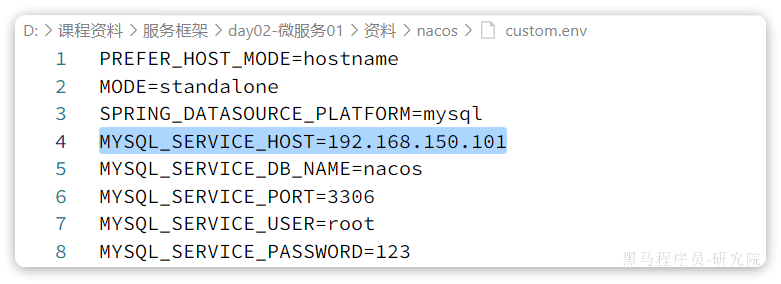

然后，将课前资料中的nacos目录上传至虚拟机的/root目录。

进入root目录，然后执行下面的docker命令：

```powershell
docker run -d \
--name nacos \
--env-file /root/nacos/custom.env \
-p 8848:8848 \
-p 9848:9848 \
-p 9849:9849 \
--restart=always \
nacos/nacos-server:v2.1.0-slim
```

启动完成后，访问下面地址：http://192.168.150.101:8848/nacos/，注意将192.168.150.101替换为你自己的虚拟机IP地址。

首次访问会跳转到登录页，账号密码都是nacos

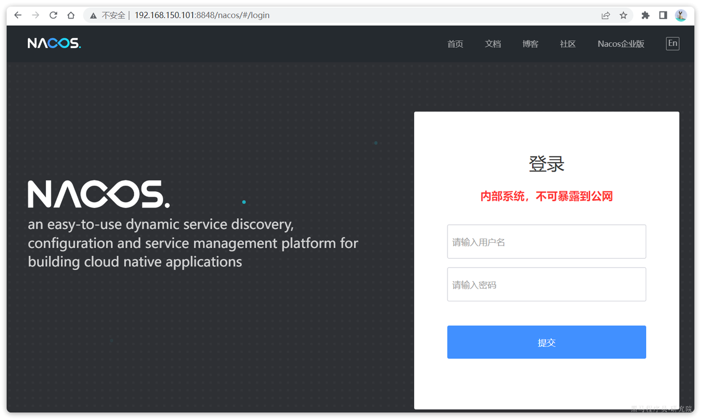

### 3.3.服务注册

接下来，我们把item-service注册到Nacos，步骤如下：

- 引入依赖
- 配置Nacos地址
- 重启

#### 3.3.1.添加依赖

在item-service的pom.xml中添加依赖：

```xml
<!--nacos 服务注册发现-->
<dependency>
    <groupId>com.alibaba.cloud</groupId>
    <artifactId>spring-cloud-starter-alibaba-nacos-discovery</artifactId>
</dependency>
```

#### 3.3.2.配置Nacos

在item-service的application.yml中添加nacos地址配置：

```yaml
spring:
  application:
    name: item-service # 服务名称
  cloud:
    nacos:
      server-addr: 192.168.150.101:8848 # nacos地址
```

#### 3.3.3.启动服务实例

为了测试一个服务多个实例的情况，我们再配置一个item-service的部署实例：

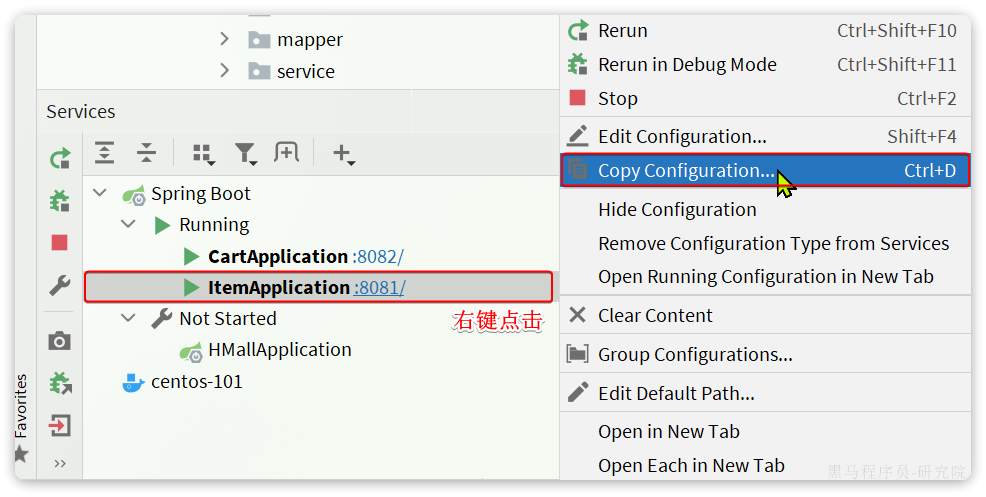

然后配置启动项，注意重命名并且配置新的端口，避免冲突：

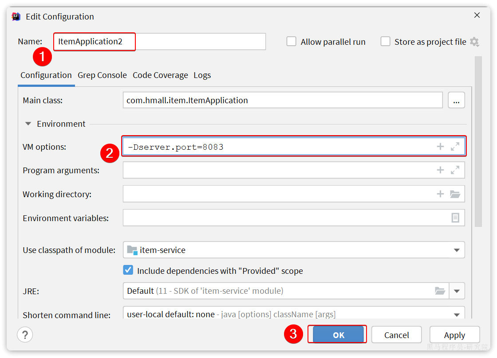

重启item-service的两个实例：

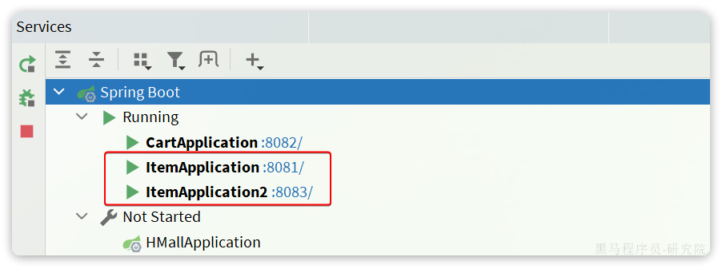

访问nacos控制台，可以发现服务注册成功：

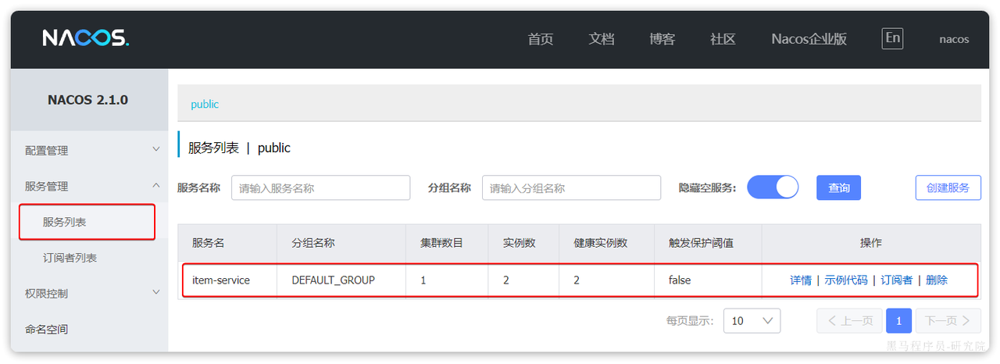

点击详情，可以查看到item-service服务的两个实例信息：

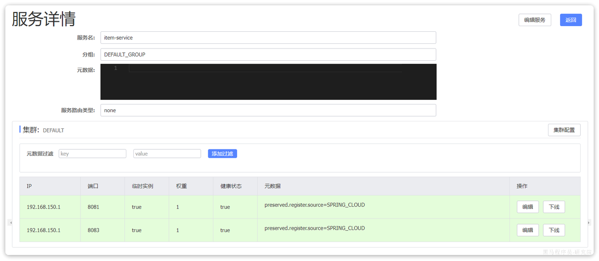

### 3.4.服务发现

服务的消费者要去nacos订阅服务，这个过程就是服务发现，步骤如下：

- 引入依赖
- 配置Nacos地址
- 发现并调用服务

#### 3.4.1.引入依赖

服务发现除了要引入nacos依赖以外，由于还需要负载均衡，因此要引入SpringCloud提供的LoadBalancer依赖。

我们在cart-service中的pom.xml中添加下面的依赖：

```xml
<!--nacos 服务注册发现-->
<dependency>
    <groupId>com.alibaba.cloud</groupId>
    <artifactId>spring-cloud-starter-alibaba-nacos-discovery</artifactId>
</dependency>
```

可以发现，这里Nacos的依赖于服务注册时一致，这个依赖中同时包含了服务注册和发现的功能。因为任何一个微服务都可以调用别人，也可以被别人调用，即可以是调用者，也可以是提供者。

因此，等一会儿cart-service启动，同样会注册到Nacos

#### 3.4.2.配置Nacos地址

在cart-service的application.yml中添加nacos地址配置：

```yaml
spring:
  cloud:
    nacos:
      server-addr: 192.168.150.101:8848
```

#### 3.4.3.发现并调用服务

接下来，服务调用者cart-service就可以去订阅item-service服务了。不过item-service有多个实例，而真正发起调用时只需要知道一个实例的地址。

因此，服务调用者必须利用负载均衡的算法，从多个实例中挑选一个去访问。常见的负载均衡算法有：

- 随机
- 轮询
- IP的hash
- 最近最少访问
- ...

这里我们可以选择最简单的随机负载均衡。

另外，服务发现需要用到一个工具，DiscoveryClient，SpringCloud已经帮我们自动装配，我们可以直接注入使用：

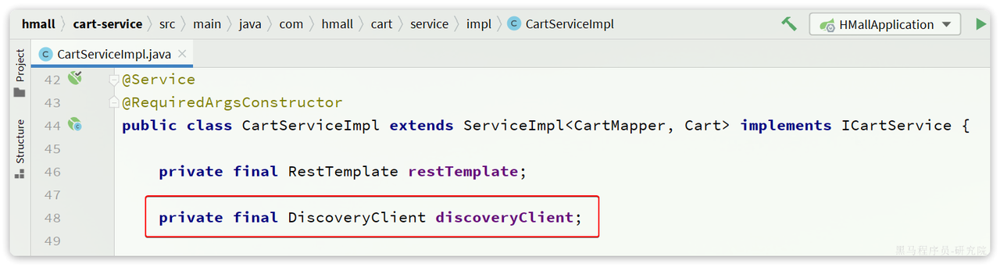

接下来，我们就可以对原来的远程调用做修改了，之前调用时我们需要写死服务提供者的IP和端口：

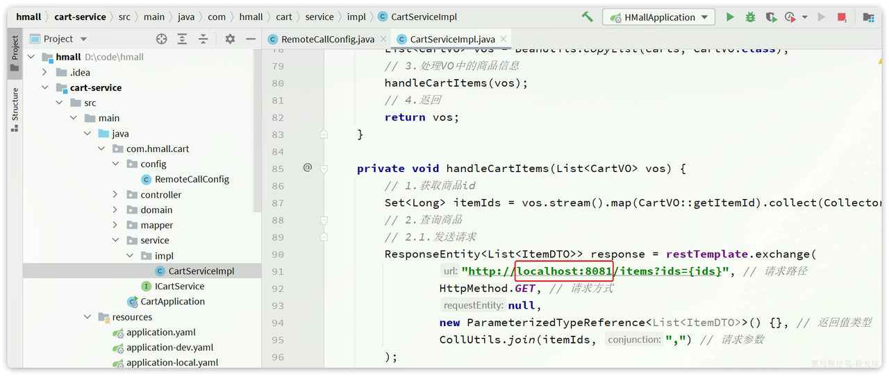

但现在不需要了，我们通过DiscoveryClient发现服务实例列表，然后通过负载均衡算法，选择一个实例去调用：

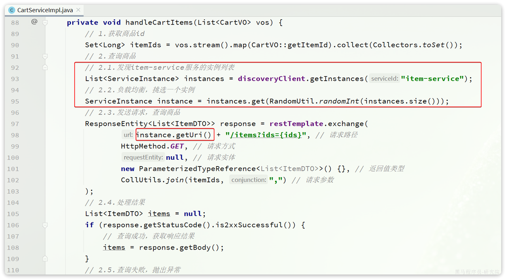

经过swagger测试，发现没有任何问题。

## 4.OpenFeign

在上一章，我们利用Nacos实现了服务的治理，利用RestTemplate实现了服务的远程调用。但是远程调用的代码太复杂了：

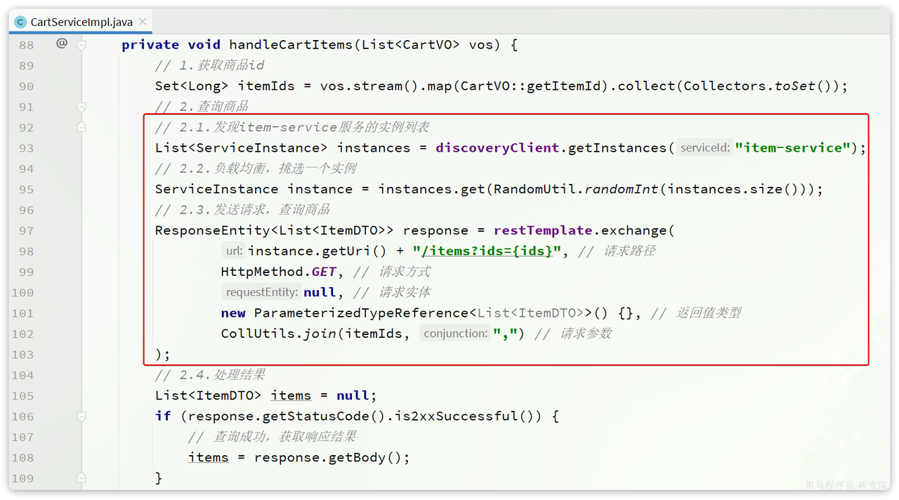

而且这种调用方式，与原本的本地方法调用差异太大，编程时的体验也不统一，一会儿远程调用，一会儿本地调用。

因此，我们必须想办法改变远程调用的开发模式，让远程调用像本地方法调用一样简单。而这就要用到 **OpenFeign** 组件了。

其实远程调用的关键点就在于四个：

- 请求方式
- 请求路径
- 请求参数
- 返回值类型

所以，OpenFeign就利用SpringMVC的相关注解来声明上述4个参数，然后基于动态代理帮我们生成远程调用的代码，而无需我们手动再编写，非常方便。

接下来，我们就通过一个快速入门的案例来体验一下OpenFeign的便捷吧。

### 4.1.快速入门

我们还是以cart-service中的查询我的购物车为例。因此下面的操作都是在cart-service中进行。

#### 4.1.1.引入依赖

在cart-service服务的pom.xml中引入OpenFeign的依赖和loadBalancer依赖：

```xml
  <!--openFeign-->
  <dependency>
      <groupId>org.springframework.cloud</groupId>
      <artifactId>spring-cloud-starter-openfeign</artifactId>
  </dependency>
  <!--负载均衡器-->
  <dependency>
      <groupId>org.springframework.cloud</groupId>
      <artifactId>spring-cloud-starter-loadbalancer</artifactId>
  </dependency>
```

#### 4.1.2.启用OpenFeign

接下来，我们在cart-service的CartApplication启动类上添加注解，启动OpenFeign功能：

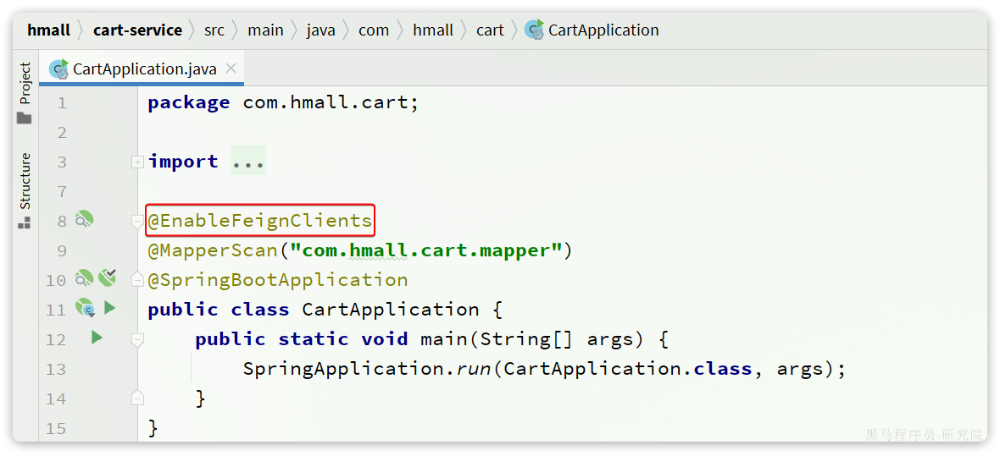

#### 4.1.3.编写OpenFeign客户端

在cart-service中，定义一个新的接口，编写Feign客户端：

其中代码如下：

```java
package com.hmall.cart.client;

import com.hmall.cart.domain.dto.ItemDTO;
import org.springframework.cloud.openfeign.FeignClient;
import org.springframework.web.bind.annotation.GetMapping;
import org.springframework.web.bind.annotation.RequestParam;

import java.util.List;

@FeignClient("item-service")
public interface ItemClient {

    @GetMapping("/items")
    List<ItemDTO> queryItemByIds(@RequestParam("ids") Collection<Long> ids);
}
```

这里只需要声明接口，无需实现方法。接口中的几个关键信息：

- @FeignClient("item-service") ：声明服务名称
- **@GetMapping**：声明请求方式
- **@GetMapping("/items")**：声明请求路径
- @RequestParam("ids") Collection<Long> ids ：声明请求参数
- **List<ItemDTO>**：返回值类型

有了上述信息，OpenFeign就可以利用动态代理帮我们实现这个方法，并且向http://item-service/items发送一个GET请求，携带ids为请求参数，并自动将返回值处理为List<ItemDTO>。

我们只需要直接调用这个方法，即可实现远程调用了。

#### 4.1.4.使用FeignClient

最后，我们在cart-service的com.hmall.cart.service.impl.CartServiceImpl中改造代码，直接调用ItemClient的方法：

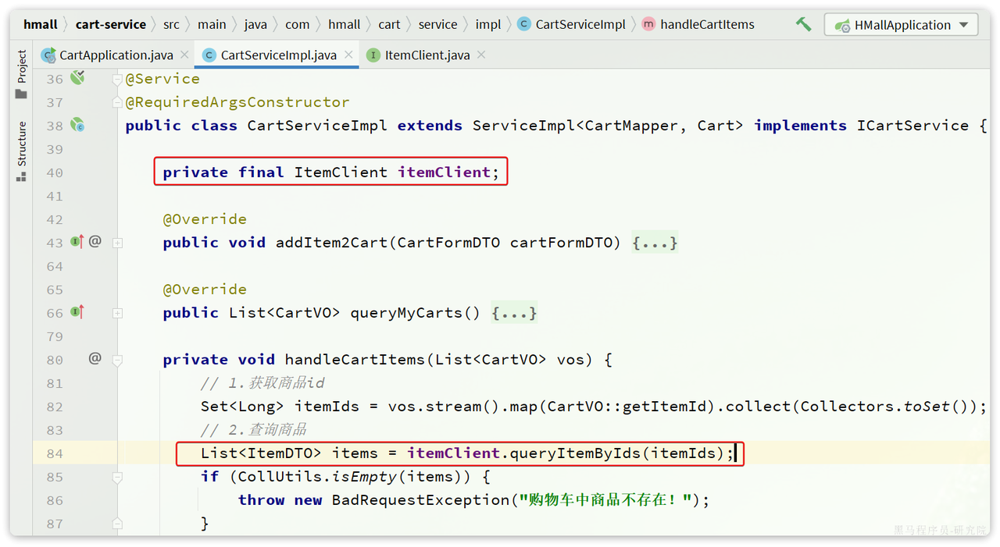

feign替我们完成了服务拉取、负载均衡、发送http请求的所有工作，是不是看起来优雅多了。

而且，这里我们不再需要RestTemplate了，还省去了RestTemplate的注册。

### 4.2.连接池

Feign底层发起http请求，依赖于其它的框架。其底层支持的http客户端实现包括：

- **HttpURLConnection**：默认实现，不支持连接池
- **Apache HttpClient**：支持连接池
- **OKHttp**：支持连接池

因此我们通常会使用带有连接池的客户端来代替默认的HttpURLConnection。比如，我们使用OK Http.

#### 4.2.1.引入依赖

在cart-service的pom.xml中引入依赖：

```xml
<!--OK http 的依赖 -->
<dependency>
  <groupId>io.github.openfeign</groupId>
  <artifactId>feign-okhttp</artifactId>
</dependency>
```

#### 4.2.2.开启连接池

在cart-service的application.yml配置文件中开启Feign的连接池功能：

```yaml
feign:
  okhttp:
    enabled: true # 开启OKHttp功能
```

重启服务，连接池就生效了。

#### 4.2.3.验证

我们可以打断点验证连接池是否生效，在org.springframework.cloud.openfeign.loadbalancer.FeignBlockingLoadBalancerClient中的execute方法中打断点：

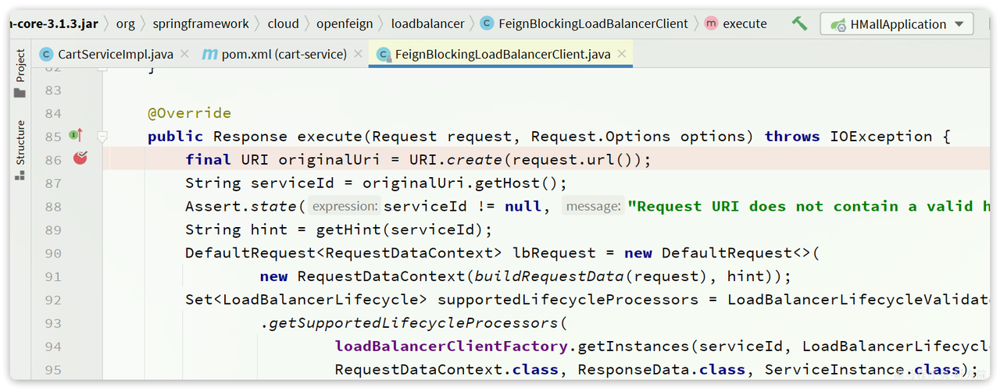

Debug方式启动cart-service，请求一次查询我的购物车方法，进入断点：

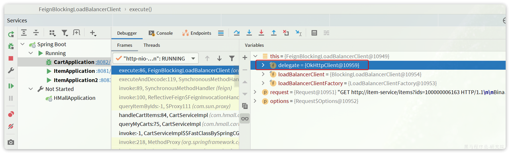

可以发现这里底层的实现已经改为OkHttpClient

### 4.3.最佳实践

将来我们要把与下单有关的业务抽取为一个独立微服务:trade-service，不过我们先来看一下hm-service中原本与下单有关的业务逻辑。

入口在com.hmall.controller.OrderController的createOrder方法，然后调用了IOrderService中的createOrder方法。

由于下单时前端提交了商品id，为了计算订单总价，需要查询商品信息：

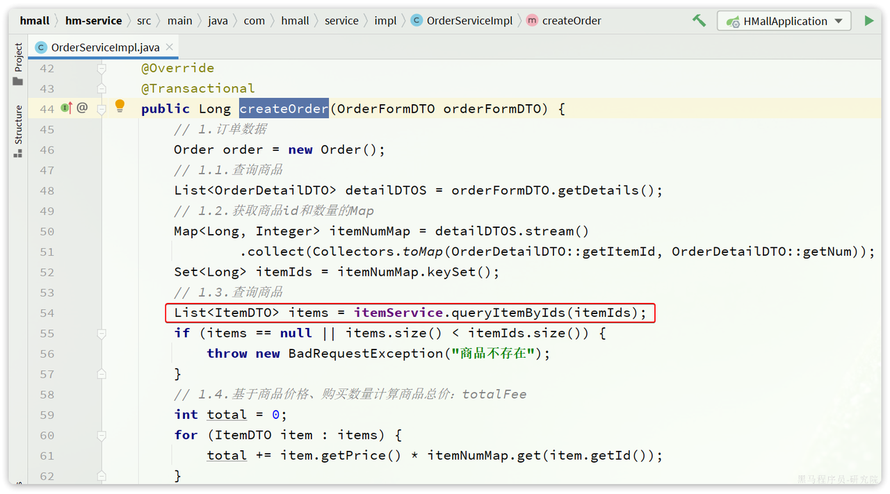

也就是说，如果拆分了交易微服务（trade-service），它也需要远程调用item-service中的根据id批量查询商品功能。这个需求与cart-service中是一样的。

因此，我们就需要在trade-service中再次定义ItemClient接口，这不是重复编码吗？ 有什么办法能加避免重复编码呢？

#### 4.3.1.思路分析

相信大家都能想到，避免重复编码的办法就是抽取。不过这里有两种抽取思路：

- **思路1**：抽取到微服务之外的公共module
- **思路2**：每个微服务自己抽取一个module

如图：

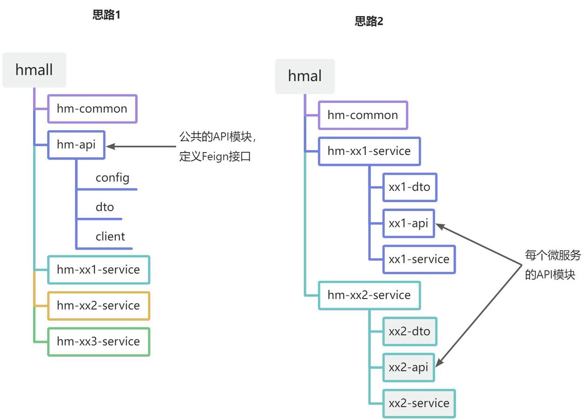

方案1抽取更加简单，工程结构也比较清晰，但缺点是整个项目耦合度偏高。

方案2抽取相对麻烦，工程结构相对更复杂，但服务之间耦合度降低。

由于item-service已经创建好，无法继续拆分，因此这里我们采用方案1.

#### 4.3.2.抽取Feign客户端

在hmall下定义一个新的module，命名为hm-api

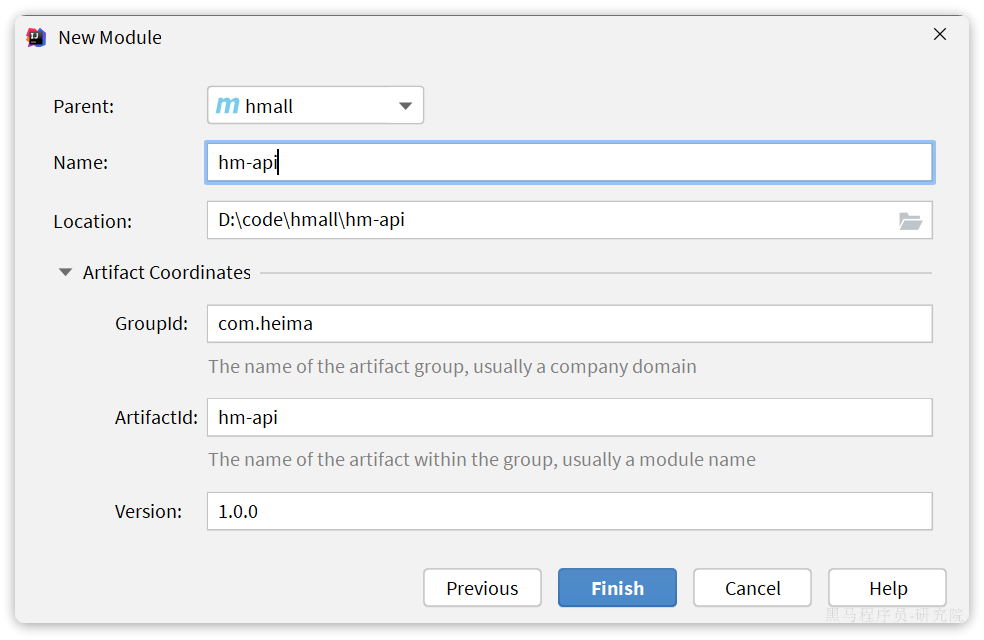

其依赖如下：

```xml
<?xml version="1.0" encoding="UTF-8"?>
<project xmlns="http://maven.apache.org/POM/4.0.0"
         xmlns:xsi="http://www.w3.org/2001/XMLSchema-instance"
         xsi:schemaLocation="http://maven.apache.org/POM/4.0.0 http://maven.apache.org/xsd/maven-4.0.0.xsd">
    <parent>
        <artifactId>hmall</artifactId>
        <groupId>com.heima</groupId>
        <version>1.0.0</version>
    </parent>
    <modelVersion>4.0.0</modelVersion>

    <artifactId>hm-api</artifactId>

    <properties>
        <maven.compiler.source>11</maven.compiler.source>
        <maven.compiler.target>11</maven.compiler.target>
    </properties>

    <dependencies>
        <!--open feign-->
        <dependency>
            <groupId>org.springframework.cloud</groupId>
            <artifactId>spring-cloud-starter-openfeign</artifactId>
        </dependency>
        <!-- load balancer-->
        <dependency>
            <groupId>org.springframework.cloud</groupId>
            <artifactId>spring-cloud-starter-loadbalancer</artifactId>
        </dependency>
        <!-- swagger 注解依赖 -->
        <dependency>
            <groupId>io.swagger</groupId>
            <artifactId>swagger-annotations</artifactId>
            <version>1.6.6</version>
            <scope>compile</scope>
        </dependency>
    </dependencies>
</project>
```

然后把ItemDTO和ItemClient都拷贝过来，最终结构如下：

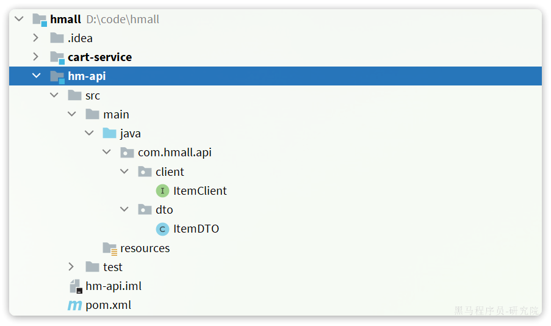

现在，任何微服务要调用item-service中的接口，只需要引入hm-api模块依赖即可，无需自己编写Feign客户端了。

#### 4.3.3.扫描包

接下来，我们在cart-service的pom.xml中引入hm-api模块：

```xml
  <!--feign模块-->
  <dependency>
      <groupId>com.heima</groupId>
      <artifactId>hm-api</artifactId>
      <version>1.0.0</version>
  </dependency>
```

删除cart-service中原来的ItemDTO和ItemClient，重启项目，发现报错了：

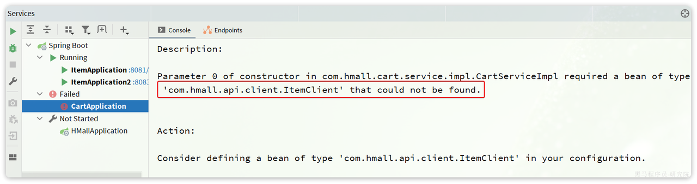

这里因为ItemClient现在定义到了com.hmall.api.client包下，而cart-service的启动类定义在com.hmall.cart包下，扫描不到ItemClient，所以报错了。

解决办法很简单，在cart-service的启动类上添加声明即可，两种方式：

- **方式1**：声明扫描包：

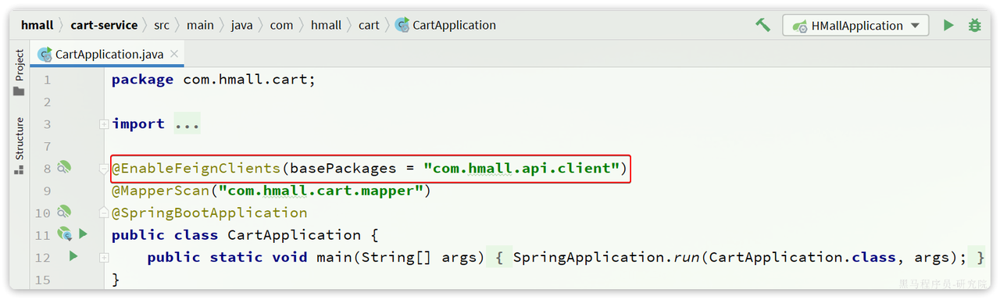

- **方式2**：声明要用的FeignClient

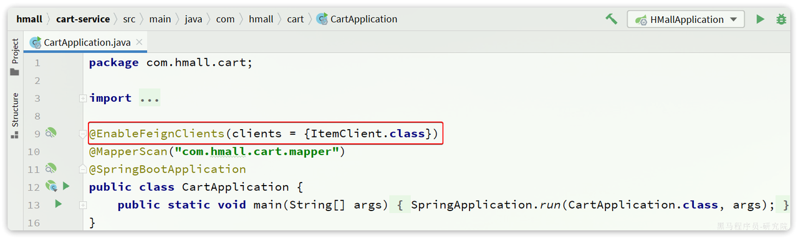

#### 4.4.4 定义client

~~~java
@FeignClient("item-service")
public interface ItemClient {

    @GetMapping("/items")
    List<ItemDTO> queryItemByIds(@RequestParam("ids") Collection<Long> ids);
}
~~~

> **⭐client里定义的方法名要和原先controller里的方法名一致吗?**
>
> 
>
> **不需要一致。** Feign 调用走的是 HTTP，服务端 Controller 根本感知不到客户端方法名叫什么。
>
> Feign 只认注解里的东西：
>
> | 关注点                 | 是否需要一致 |
> | :--------------------- | :----------- |
> | **方法名**             | ❌ 不需要     |
> | `@GetMapping` 路径     | ✅ 必须匹配   |
> | `@RequestParam` 参数名 | ✅ 必须匹配   |
> | 返回类型               | ✅ 结构需一致 |
>
> 举例，下面三种写法效果完全一样：
>
> ```
> // 和 Controller 方法名一致（推荐，可读性好）List<ItemDTO> queryItemByIds(@RequestParam("ids") Collection<Long> ids);
> // 随便起名List<ItemDTO> getItems(@RequestParam("ids") Collection<Long> ids);
> // 叫啥都行List<ItemDTO> whatever(@RequestParam("ids") Collection<Long> ids);
> ```
>
> Feign 在运行时根据 `@GetMapping("/items")` + `@RequestParam("ids")` 拼出 `GET /items?ids=1,2,3`，方法名纯粹是给 Java 代码调用用的，不参与序列化。保持和 Controller 一致纯粹是为了代码可读性。

### 4.4.日志配置

OpenFeign只会在FeignClient所在包的日志级别为DEBUG时，才会输出日志。而且其日志级别有4级：

- **NONE**：不记录任何日志信息，这是默认值。
- **BASIC**：仅记录请求的方法，URL以及响应状态码和执行时间
- **HEADERS**：在BASIC的基础上，额外记录了请求和响应的头信息
- **FULL**：记录所有请求和响应的明细，包括头信息、请求体、元数据。

Feign默认的日志级别就是NONE，所以默认我们看不到请求日志。

#### 4.4.1.定义日志级别

在hm-api模块下新建一个配置类，定义Feign的日志级别：

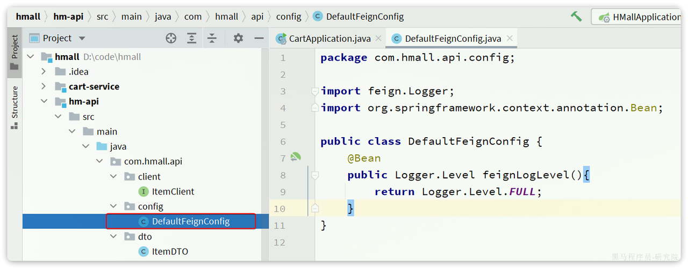

代码如下：

```java
package com.hmall.api.config;

import feign.Logger;
import org.springframework.context.annotation.Bean;

public class DefaultFeignConfig {
    @Bean
    public Logger.Level feignLogLevel(){
        return Logger.Level.FULL;
    }
}
```

#### 4.4.2.配置

接下来，要让日志级别生效，还需要配置这个类。有两种方式：

- **局部生效**：在某个FeignClient中配置，只对当前FeignClient生效

```java
@FeignClient(value = "item-service", configuration = DefaultFeignConfig.class)
```

- **全局生效**：在@EnableFeignClients中配置，针对所有FeignClient生效。

```java
@EnableFeignClients(defaultConfiguration = DefaultFeignConfig.class)
```

日志格式：

```text
17:35:32:148 DEBUG 18620 --- [nio-8082-exec-1] com.hmall.api.client.ItemClient          : [ItemClient#queryItemByIds] ---> GET http://item-service/items?ids=100000006163 HTTP/1.1
17:35:32:148 DEBUG 18620 --- [nio-8082-exec-1] com.hmall.api.client.ItemClient          : [ItemClient#queryItemByIds] ---> END HTTP (0-byte body)
17:35:32:278 DEBUG 18620 --- [nio-8082-exec-1] com.hmall.api.client.ItemClient          : [ItemClient#queryItemByIds] <--- HTTP/1.1 200  (127ms)
17:35:32:279 DEBUG 18620 --- [nio-8082-exec-1] com.hmall.api.client.ItemClient          : [ItemClient#queryItemByIds] connection: keep-alive
17:35:32:279 DEBUG 18620 --- [nio-8082-exec-1] com.hmall.api.client.ItemClient          : [ItemClient#queryItemByIds] content-type: application/json
17:35:32:279 DEBUG 18620 --- [nio-8082-exec-1] com.hmall.api.client.ItemClient          : [ItemClient#queryItemByIds] date: Fri, 26 May 2023 09:35:32 GMT
17:35:32:279 DEBUG 18620 --- [nio-8082-exec-1] com.hmall.api.client.ItemClient          : [ItemClient#queryItemByIds] keep-alive: timeout=60
17:35:32:279 DEBUG 18620 --- [nio-8082-exec-1] com.hmall.api.client.ItemClient          : [ItemClient#queryItemByIds] transfer-encoding: chunked
17:35:32:279 DEBUG 18620 --- [nio-8082-exec-1] com.hmall.api.client.ItemClient          : [ItemClient#queryItemByIds] 
17:35:32:280 DEBUG 18620 --- [nio-8082-exec-1] com.hmall.api.client.ItemClient          : [ItemClient#queryItemByIds] [{"id":100000006163,"name":"巴布豆(BOBDOG)柔薄悦动婴儿拉拉裤XXL码80片(15kg以上)","price":67100,"stock":10000,"image":"https://m.360buyimg.com/mobilecms/s720x720_jfs/t23998/350/2363990466/222391/a6e9581d/5b7cba5bN0c18fb4f.jpg!q70.jpg.webp","category":"拉拉裤","brand":"巴布豆","spec":"{}","sold":11,"commentCount":33343434,"isAD":false,"status":2}]
17:35:32:281 DEBUG 18620 --- [nio-8082-exec-1] com.hmall.api.client.ItemClient          : [ItemClient#queryItemByIds] <--- END HTTP (369-byte body)
```

## 5.作业

### 5.1.拆分微服务

将hm-service中的其它业务也都拆分为微服务，包括：

- **user-service**：用户微服务，包含用户登录、管理等功能
- **trade-service**：交易微服务，包含订单相关功能
- **pay-service**：支付微服务，包含支付相关功能

其中交易服务、支付服务、用户服务中的业务都需要知道当前登录用户是谁，目前暂未实现，先将用户id写死。

思考：如何才能在每个微服务中都拿到用户信息？如何在微服务之间传递用户信息？

### 5.2.定义FeignClient

在上述业务中，包含大量的微服务调用，将被调用的接口全部定义为FeignClient，将其与对应的DTO放在hm-api模块

### 5.3.将微服务与前端联调

课前资料提供了一个hmall-nginx目录，其中包含了Nginx以及我们的前端代码：

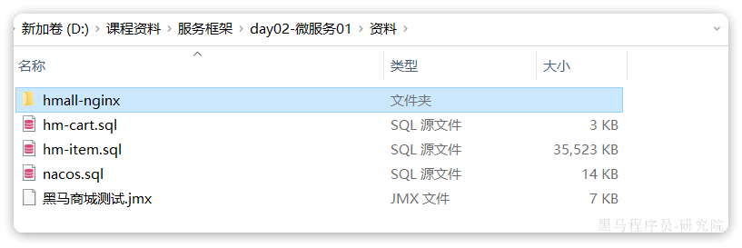

将其拷贝到一个不包含中文、空格、特殊字符的目录，启动后即可访问到页面：

- 18080是用户端页面
- 18081是管理端页面