# 微服务（一）：认识微服务 · 服务拆分 · 服务治理 · OpenFeign

> **微服务是一种软件架构风格，它以专注于单一职责的很多小型项目为基础，组合出复杂的大型应用。**
>
> 本文按课程结构整理，覆盖 **认识微服务、微服务拆分、服务治理（注册中心）、OpenFeign** 四大部分。

## 目录

- [一、认识微服务](#一认识微服务)
  - [1.1 单体架构](#11-单体架构)
  - [1.2 微服务](#12-微服务)
  - [1.3 SpringCloud](#13-springcloud)
- [二、微服务拆分](#二微服务拆分)
  - [2.1 熟悉黑马商城](#21-熟悉黑马商城)
  - [2.2 服务拆分原则](#22-服务拆分原则)
  - [2.3 拆分服务](#23-拆分服务)
  - [2.4 远程调用](#24-远程调用)
- [三、服务治理](#三服务治理)
  - [3.1 注册中心原理](#31-注册中心原理)
  - [3.2 Nacos 注册中心](#32-nacos-注册中心)
  - [3.3 服务注册](#33-服务注册)
  - [3.4 服务发现](#34-服务发现)
- [四、OpenFeign](#四openfeign)
  - [4.1 快速入门](#41-快速入门)
  - [4.2 连接池](#42-连接池)
  - [4.3 最佳实践](#43-最佳实践)
  - [4.4 日志](#44-日志)

---

# 一、认识微服务

## 1.1 单体架构

> **单体架构：将业务的所有功能集中在一个项目中开发，打成一个包部署。**

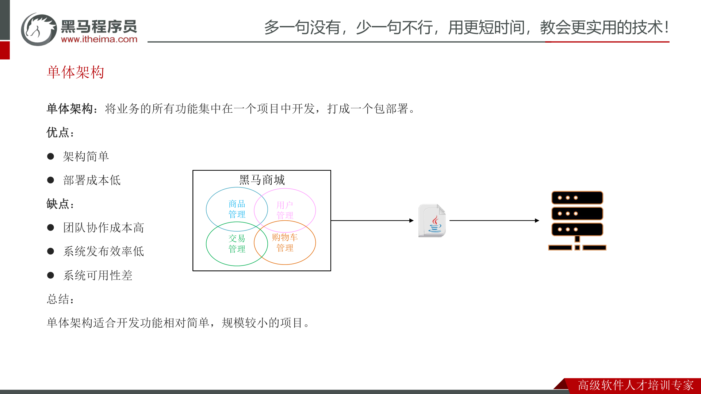

| 维度 | 说明 |
| --- | --- |
| **优点** | ① 架构简单；② 部署成本低 |
| **缺点** | ① 团队协作成本高；② 系统发布效率低；③ 系统可用性差 |
| **总结** | 单体架构适合开发功能相对简单、规模较小的项目 |

如下图所示，单体架构把"短信、积分、优惠券、用户、订单、商品、支付、购物车、评价……"等所有功能塞进同一个项目：

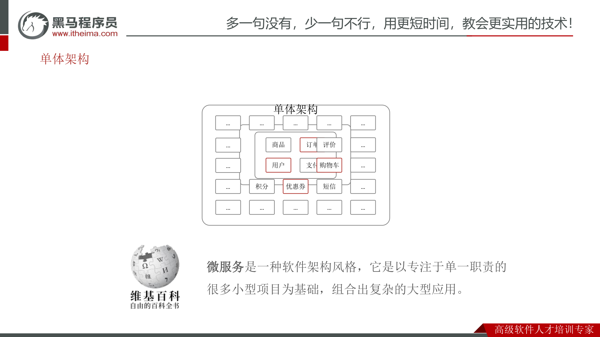

## 1.2 微服务

> **微服务架构，是服务化思想指导下的一套最佳实践架构方案。服务化，就是把单体架构中的功能模块拆分为多个独立项目。**

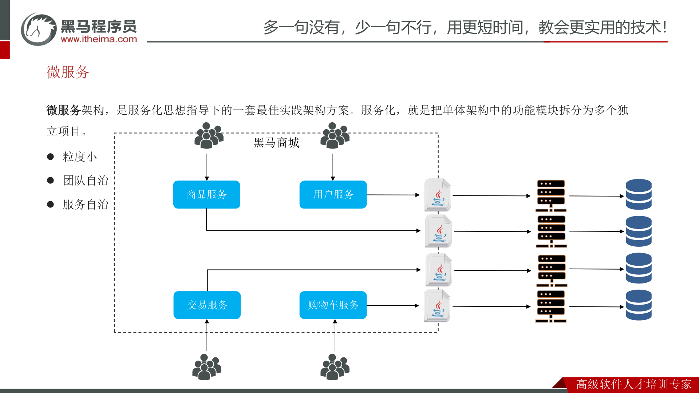

微服务架构相比单体架构的核心特征：

- **粒度小**：每个服务职责单一；
- **团队自治**：每个服务由独立团队负责；
- **服务自治**：每个服务独立开发、独立部署、独立运行。

一个完整的微服务集群通常需要解决以下问题：

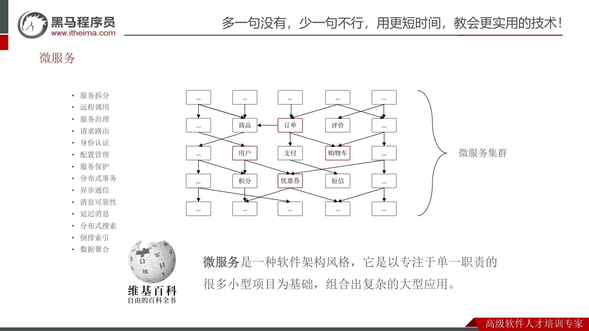

> 服务拆分、请求路由、服务保护、异步通信、分布式搜索、服务治理、远程调用、身份认证、分布式事务、倒排索引、消息可靠性、配置管理、延迟消息、数据聚合……

## 1.3 SpringCloud

> **SpringCloud 是目前国内使用最广泛的微服务框架。**
> 官网地址：<https://spring.io/projects/spring-cloud>

SpringCloud 集成了各种微服务功能组件，并基于 **SpringBoot** 实现了这些组件的自动装配，从而提供了良好的**开箱即用**体验：

| 微服务功能 | 常见组件 |
| --- | --- |
| 服务注册发现 | **Eureka、Nacos**、Consul |
| 服务远程调用 | **OpenFeign**、Dubbo |
| 服务链路监控 | Zipkin、Sleuth |
| 统一配置管理 | SpringCloudConfig、**Nacos** |
| 统一网关路由 | **SpringCloudGateway**、Zuul |
| 流控、降级、保护 | Hystrix、**Sentinel** |

> ⚠️ **版本要求**：SpringCloud 基于 SpringBoot 实现自动装配，因此对 SpringBoot 版本有严格的对应关系：

| SpringCloud 版本 | SpringBoot 版本 |
| --- | --- |
| 2022.0.x aka Kilburn | 3.0.x |
| 2021.0.x aka Jubilee | 2.6.x、2.7.x（Starting with 2021.0.3） |
| 2020.0.x aka Ilford | 2.4.x、2.5.x（Starting with 2020.0.3） |
| Hoxton | 2.2.x、2.3.x（Starting with SR5） |
| Greenwich | 2.1.x |
| Finchley | 2.0.x |
| Edgware | 1.5.x |
| Dalston | 1.5.x |

---

# 二、微服务拆分

## 2.1 熟悉黑马商城

本课程以**黑马商城**为案例项目，它包含用户、商品、购物车、订单、支付等多个模块：

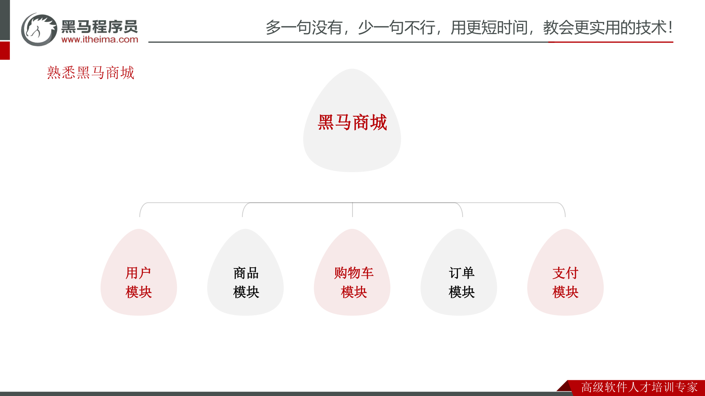

## 2.2 服务拆分原则

**① 什么时候拆分？**

- **创业型项目**：先采用单体架构，快速开发、快速试错。随着规模扩大，逐渐拆分。
- **确定的大型项目**：资金充足、目标明确，可以直接选择微服务架构，避免后续拆分的麻烦。

**② 怎么拆分？**

> 从**拆分目标**来说，要做到：
> - **高内聚**：每个微服务的职责要尽量单一，包含的业务相互关联度高、完整度高。
> - **低耦合**：每个微服务的功能要相对独立，尽量减少对其它微服务的依赖。

> 从**拆分方式**来说，一般包含两种方式：
> - **纵向拆分**：按照业务模块来拆分。
> - **横向拆分**：抽取公共服务，提高复用性。

## 2.3 拆分服务

微服务的工程结构有两种：

- **独立 Project**：每个微服务是一个独立的 Project。
- **Maven 聚合**：所有微服务作为 Module 聚合在同一个 Project 下。

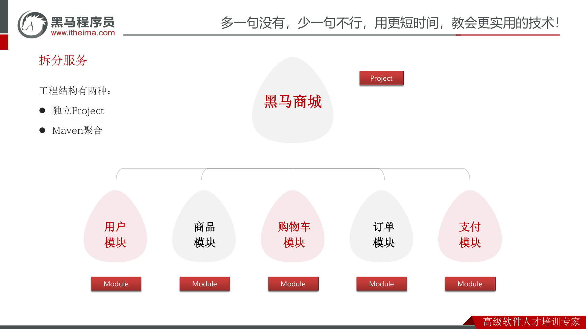

> **案例需求：**
> - 将 `hm-service` 中与**商品管理**相关功能拆分到一个微服务 module 中，命名为 **item-service**。
> - 将 `hm-service` 中与**购物车**有关的功能拆分到一个微服务 module 中，命名为 **cart-service**。

## 2.4 远程调用

服务拆分后会遇到第一个问题：购物车服务需要展示商品信息，但商品数据已经在商品服务的数据库里，**无法直接调用本地方法查询数据**。

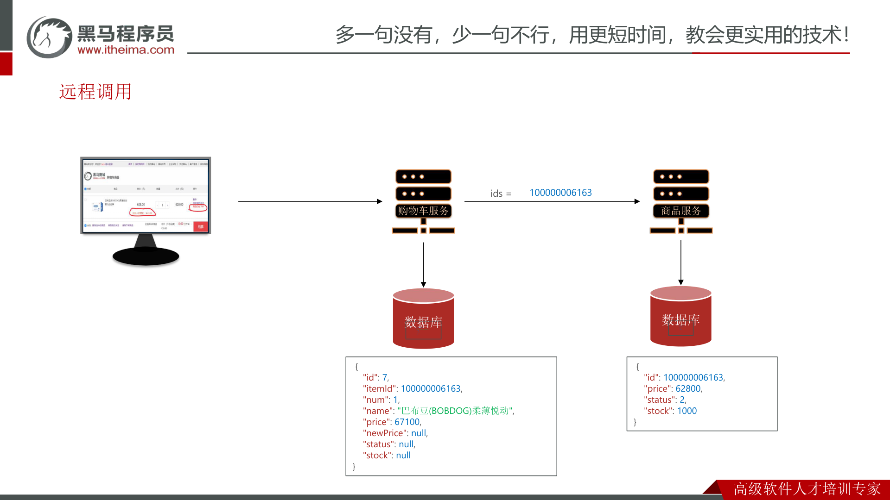

> Spring 提供了一个 **RestTemplate** 工具，可以方便地实现 Http 请求的发送。使用步骤如下：

**① 注入 RestTemplate 到 Spring 容器**

```java
@Bean
public RestTemplate restTemplate(){
    return new RestTemplate();
}
```

**② 发起远程调用**

```java
public <T> ResponseEntity<T> exchange(
    String url,                      // 请求路径
    HttpMethod method,               // 请求方式
    @Nullable HttpEntity<?> requestEntity, // 请求实体，可以为空
    Class<T> responseType,           // 返回值类型
    Map<String, ?> uriVariables      // 请求参数
)
```

调用示例（4 个关键参数）：

```java
restTemplate.exchange(
    "http://localhost:8081/items?id={id}", // 请求路径
    HttpMethod.GET,                        // 请求方式
    null,                                  // 请求实体
    ItemDTO.class,                         // 返回值类型
    Map.of("id", "1")                      // 请求参数
);
```

> **本章小结**
> - **什么时候拆分？** 初创型项目尽量用单体，快速试错；规模变大后再拆分。
> - **如何拆分？** 目标是高内聚、低耦合；方式有纵向拆分、横向拆分。
> - **拆分后的第一个问题？** 数据分散在不同服务，无法本地调用 → 利用 **RestTemplate 发送 Http 请求实现远程调用**。

---

# 三、服务治理

## 3.1 注册中心原理

RestTemplate 远程调用存在一个新问题：当服务提供者有**多个实例（多个 ip:port）**时，消费者把地址写死显然不行，实例上下线、扩容缩容时地址会不断变化。

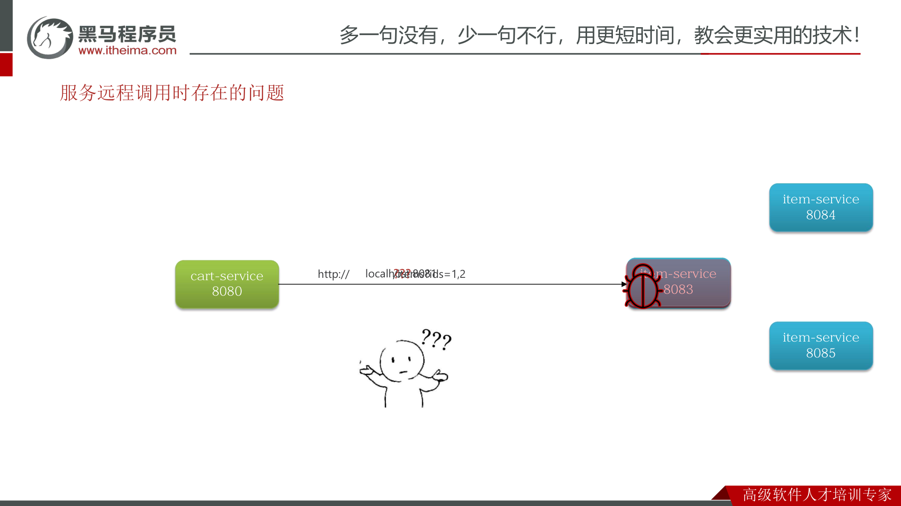

为此引入**注册中心**，服务治理中有三个角色：

> - **服务提供者（Provider）**：暴露服务接口，供其它服务调用。
> - **服务消费者（Consumer）**：调用其它服务提供的接口。
> - **注册中心（Registry）**：记录并监控微服务各实例状态，推送服务变更信息。

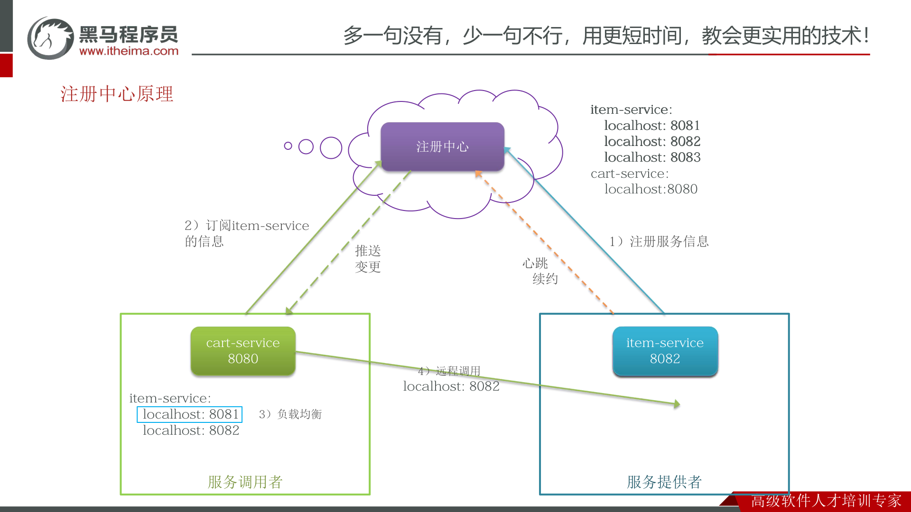

工作流程：

1. **注册服务信息**：服务提供者启动时把自己的信息注册到注册中心。
2. **订阅信息**：消费者从注册中心订阅、拉取 item-service 的实例列表。
3. **负载均衡**：消费者通过负载均衡算法，从多个实例中挑选一个。
4. **远程调用**：消费者向选中的实例发起调用。
5. **心跳续约 / 推送变更**：提供者通过心跳机制上报健康状态，心跳异常时注册中心剔除该实例，并推送变更给订阅的消费者。

> **本章小结**
> - **服务治理三角色**：服务提供者、服务消费者、注册中心。
> - **消费者如何知道提供者地址？** 提供者启动时注册信息到注册中心，消费者从注册中心订阅、拉取。
> - **消费者如何得知服务状态变更？** 提供者通过心跳上报健康状态，心跳异常时注册中心剔除并通知消费者。
> - **提供者有多个实例时怎么选？** 消费者通过负载均衡算法选择一个。

## 3.2 Nacos 注册中心

> **Nacos 是目前国内企业中占比最多的注册中心组件。** 它是阿里巴巴的产品，目前已经加入 **SpringCloudAlibaba** 中。

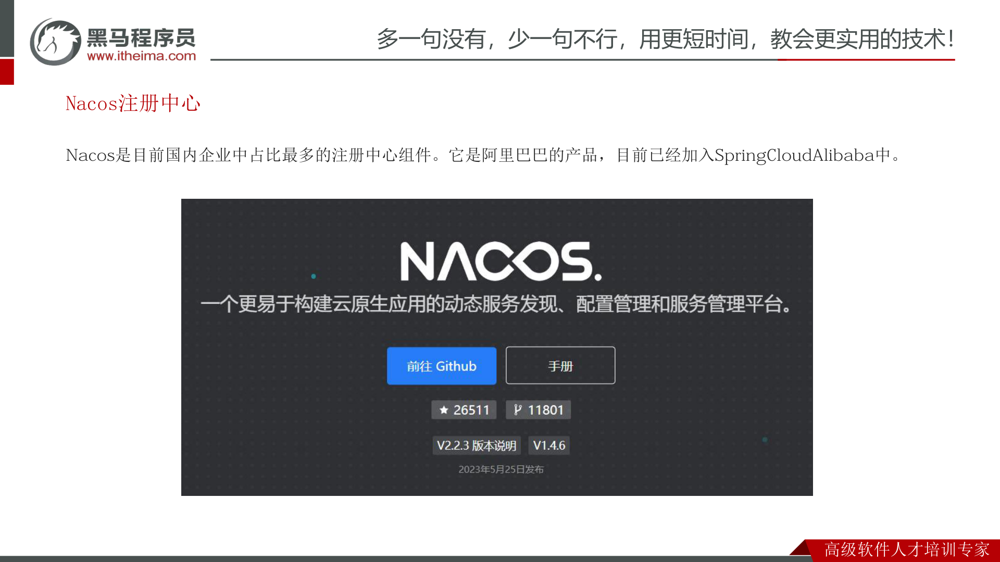

## 3.3 服务注册

**① 引入 nacos discovery 依赖：**

```xml
<!--nacos 服务注册发现-->
<dependency>
    <groupId>com.alibaba.cloud</groupId>
    <artifactId>spring-cloud-starter-alibaba-nacos-discovery</artifactId>
</dependency>
```

**② 配置 Nacos 地址：**

```yaml
spring:
  application:
    name: item-service # 服务名称
  cloud:
    nacos:
      server-addr: 192.168.150.101:8848 # nacos地址
```

## 3.4 服务发现

> 消费者需要连接 nacos 以拉取和订阅服务，因此服务发现的前两步与服务注册一样，后面再加上服务调用即可：
> ① 引入 nacos discovery 依赖 → ② 配置 nacos 地址 → ③ **服务发现**

```java
private final DiscoveryClient discoveryClient;

private void handleCartItems(List<CartVO> vos) {
    // 1.根据服务名称，拉取服务的实例列表
    List<ServiceInstance> instances = discoveryClient.getInstances("item-service");
    // 2.负载均衡，挑选一个实例
    ServiceInstance instance = instances.get(RandomUtil.randomInt(instances.size()));
    // 3.获取实例的IP和端口
    URI uri = instance.getUri();
    // ... 略
}
```

---

# 四、OpenFeign

## 4.1 快速入门

> **OpenFeign 是一个声明式的 http 客户端**，是 SpringCloud 在 Eureka 公司开源的 Feign 基础上改造而来。
> 官方地址：<https://github.com/OpenFeign/feign>
>
> 其作用就是基于 SpringMVC 的常见注解，帮我们**优雅地实现 http 请求的发送**。

回顾 RestTemplate 调用的四个关键要素（服务名称、请求方式和路径、返回值类型、请求参数），OpenFeign 正是把这些要素封装成了声明式接口：

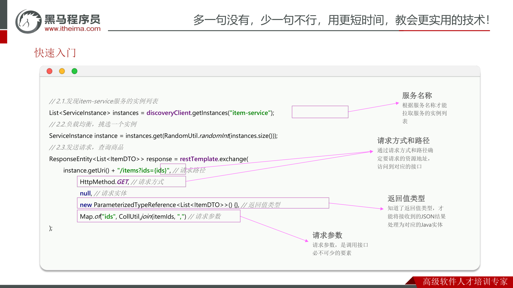

OpenFeign 已经被 SpringCloud 自动装配，实现起来非常简单：

**① 引入依赖**（OpenFeign + 负载均衡组件 SpringCloudLoadBalancer）

```xml
<!--OpenFeign-->
<dependency>
    <groupId>org.springframework.cloud</groupId>
    <artifactId>spring-cloud-starter-openfeign</artifactId>
</dependency>
<!--负载均衡-->
<dependency>
    <groupId>org.springframework.cloud</groupId>
    <artifactId>spring-cloud-starter-loadbalancer</artifactId>
</dependency>
```

**② 通过 `@EnableFeignClients` 注解，启用 OpenFeign 功能**

```java
@EnableFeignClients
@SpringBootApplication
public class CartApplication { /* ... 略 */ }
```

**③ 编写 FeignClient**

```java
@FeignClient(value = "item-service")
public interface ItemClient {
    @GetMapping("/items")
    List<ItemDTO> queryItemByIds(@RequestParam("ids") Collection<Long> ids);
}
```

**④ 使用 FeignClient，实现远程调用**

```java
List<ItemDTO> items = itemClient.queryItemByIds(List.of(1,2,3));
```

OpenFeign 在底层会自动完成"注册中心拉取实例 → 负载均衡 → 拼接 Http 请求"的全过程：

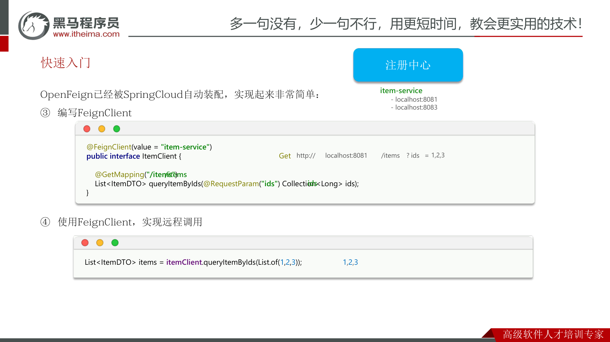

## 4.2 连接池

OpenFeign 对 Http 请求做了优雅的伪装，不过其底层发起 http 请求依赖于其它框架。可选的有三种：

| 实现 | 是否支持连接池 |
| --- | --- |
| **HttpURLConnection** | 默认实现，**不支持**连接池 |
| **Apache HttpClient** | 支持连接池 |
| **OKHttp** | 支持连接池 |

> 💡 具体源码可参考 `FeignBlockingLoadBalancerClient` 类中的 `delegate` 成员变量。

OpenFeign 整合 **OKHttp** 的步骤：

**① 引入依赖**

```xml
<!--ok-http-->
<dependency>
    <groupId>io.github.openfeign</groupId>
    <artifactId>feign-okhttp</artifactId>
</dependency>
```

**② 开启连接池功能**

```yaml
feign:
  okhttp:
    enabled: true # 开启OKHttp连接池支持
```

## 4.3 最佳实践

> **最佳实践：由服务提供者编写独立 module，将 FeignClient 及 DTO 抽取出来**，供消费者直接引入使用，避免重复编写。

当定义的 FeignClient **不在 `@SpringBootApplication` 的扫描包范围**时，这些 FeignClient 无法使用。有两种解决方式：

**方式一：指定 FeignClient 所在包**

```java
@EnableFeignClients(basePackages = "com.hmall.api.clients")
```

**方式二：指定 FeignClient 字节码**

```java
@EnableFeignClients(clients = {UserClient.class})
```

## 4.4 日志

> OpenFeign 只会在 FeignClient 所在包的日志级别为 **DEBUG** 时，才会输出日志。其日志级别有 4 级：

| 级别 | 说明 |
| --- | --- |
| **NONE** | 不记录任何日志信息，这是**默认值** |
| **BASIC** | 仅记录请求的方法、URL 以及响应状态码和执行时间 |
| **HEADERS** | 在 BASIC 的基础上，额外记录请求和响应的头信息 |
| **FULL** | 记录所有请求和响应的明细，包括头信息、请求体、元数据 |

> 由于 Feign 默认的日志级别就是 NONE，所以默认我们看不到请求日志。

**① 声明一个类型为 `Logger.Level` 的 Bean，定义日志级别：**

```java
public class DefaultFeignConfig {
    @Bean
    public Logger.Level feignLogLevel(){
        return Logger.Level.FULL;
    }
}
```

**② 局部生效**——在 `@FeignClient` 注解中声明，配置某个 FeignClient 的日志：

```java
@FeignClient(value = "item-service", configuration = DefaultFeignConfig.class)
```

**③ 全局生效**——在 `@EnableFeignClients` 注解中声明，让所有 FeignClient 都按此配置：

```java
@EnableFeignClients(defaultConfiguration = DefaultFeignConfig.class)
```

> **本章小结**
> - **如何利用 OpenFeign 实现远程调用？** 引入 OpenFeign 和 SpringCloudLoadBalancer 依赖 → `@EnableFeignClients` 开启功能 → 编写 FeignClient。
> - **如何配置连接池？** 引入 http 客户端依赖（OKHttp、HttpClient）→ 在 yaml 中打开连接池开关。
> - **最佳实践是什么？** 由服务提供者编写独立 module，将 FeignClient 及 DTO 抽取。
> - **如何配置日志级别？** 声明 `Logger.Level` 类型的 Bean → 在 `@FeignClient` 或 `@EnableFeignClients` 上使用。
