# 微服务（二）：网关及配置管理

> **网关：就是网络的关口，负责请求的路由、转发、身份校验。**
>
> 本文按课程结构整理，覆盖 **网关路由、网关登录校验、配置管理** 三大部分。

## 目录

- [一、初识网关](#一初识网关)
  - [1.1 为什么需要网关](#11-为什么需要网关)
  - [1.2 网关技术选型](#12-网关技术选型)
- [二、网关路由](#二网关路由)
  - [2.1 快速入门](#21-快速入门)
  - [2.2 路由属性](#22-路由属性)
- [三、网关登录校验](#三网关登录校验)
  - [3.1 网关请求处理流程](#31-网关请求处理流程)
  - [3.2 自定义过滤器](#32-自定义过滤器)
  - [3.3 实现登录校验](#33-实现登录校验)
  - [3.4 网关传递用户](#34-网关传递用户)
  - [3.5 OpenFeign 传递用户](#35-openfeign-传递用户)
  - [3.6 微服务登录解决方案](#36-微服务登录解决方案)
- [四、配置管理](#四配置管理)
  - [4.1 配置共享](#41-配置共享)
  - [4.2 配置热更新](#42-配置热更新)
  - [4.3 动态路由](#43-动态路由)

---

# 一、初识网关

## 1.1 为什么需要网关

微服务拆分后，前端面对的是一堆 ip:port 各不相同的服务（订单、用户、支付、商品……），前端**不知道该请求谁**，也无法逐一记忆地址。

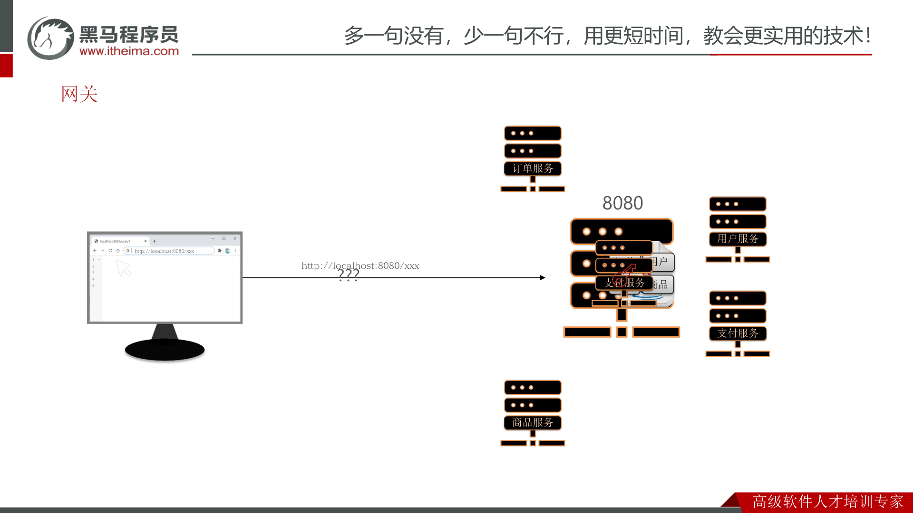

> **网关**就是所有请求的统一入口，对外只暴露一个地址，负责：**身份校验、路由转发、负载均衡**。

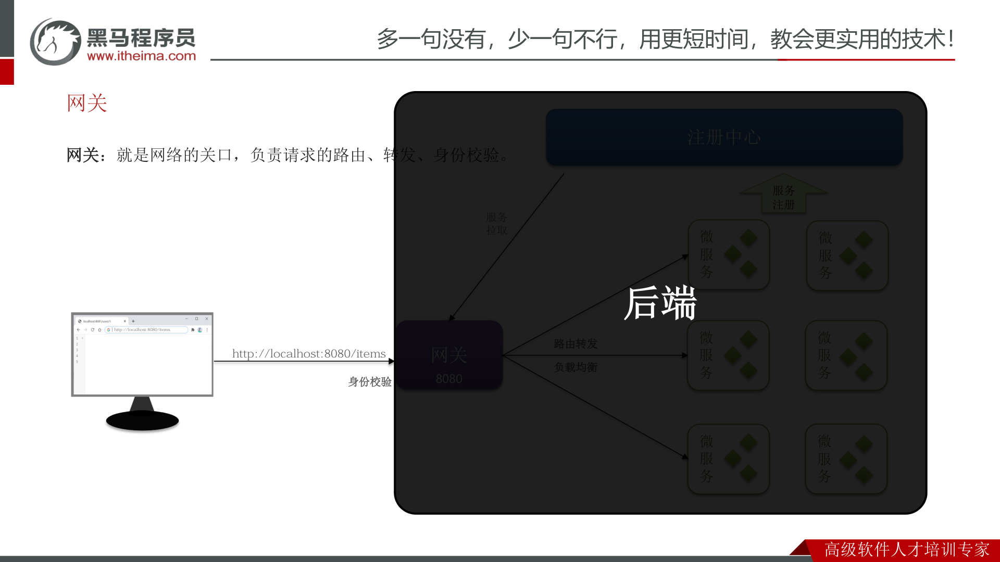

请求到达网关后的处理链路：

1. **身份校验**：先校验请求是否合法（你是谁？）。
2. **路由转发**：根据请求路径找到目标服务（你找谁？）。
3. **负载均衡**：从注册中心拉取目标服务实例列表，选择一个。
4. 转发到后端微服务。

## 1.2 网关技术选型

在 SpringCloud 中，网关的实现包括两种：

| 网关 | 特点 |
| --- | --- |
| **Spring Cloud Gateway** ✅ | Spring 官方出品；基于 **WebFlux 响应式编程**；**无需调优即可获得优异性能** |
| **Netflix Zuul** | Netflix 出品；基于 **Servlet 的阻塞式编程**；需要调优才能获得与 SpringCloudGateway 类似的性能 |

> 💡 本课程采用 **Spring Cloud Gateway**。

---

# 二、网关路由

## 2.1 快速入门

搭建网关的四个步骤：

> **① 创建新模块 → ② 引入网关依赖 → ③ 编写启动类 → ④ 配置路由规则**

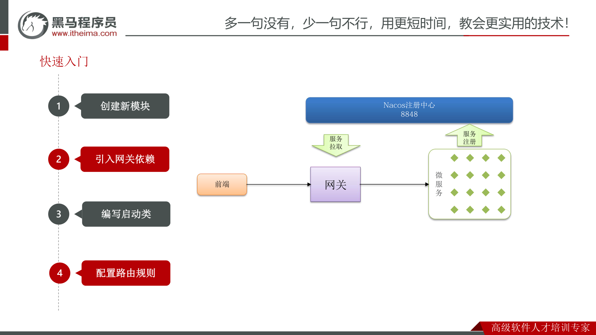

**② 引入网关依赖**

```xml
<!--网关-->
<dependency>
    <groupId>org.springframework.cloud</groupId>
    <artifactId>spring-cloud-starter-gateway</artifactId>
</dependency>
```

**④ 配置路由规则**

```yaml
spring:
  cloud:
    gateway:
      routes:
        - id: item                 # 路由规则id，自定义，唯一
          uri: lb://item-service   # 路由目标微服务，lb 代表负载均衡
          predicates:              # 路由断言，判断请求是否符合规则，符合则路由到目标
            - Path=/items/**       # 以请求路径做判断，以 /items 开头则符合
        - id: xx
          uri: lb://xx-service
          predicates:
            - Path=/xx/**
```

网关转发请求的完整流程：

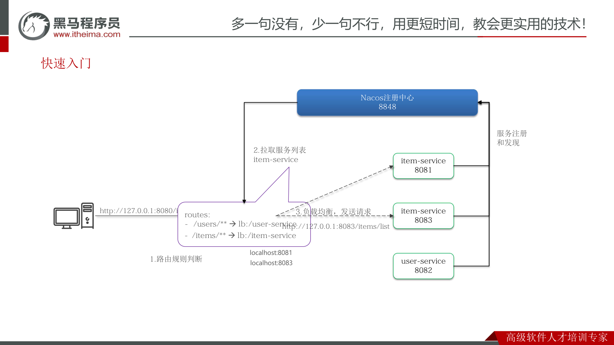

1. **路由规则判断**：根据请求路径匹配路由（`/items/**` → `lb://item-service`）。
2. **拉取服务列表**：从 Nacos 注册中心拉取 item-service 的实例列表。
3. **负载均衡，发送请求**：选中一个实例（如 `localhost:8083`），转发请求。

## 2.2 路由属性

> 网关路由对应的 Java 类型是 **`RouteDefinition`**，其中常见的属性有：
> - **id**：路由唯一标示。
> - **uri**：路由目标地址。
> - **predicates**：路由断言，判断请求是否符合当前路由。
> - **filters**：路由过滤器，对请求或响应做特殊处理。

**路由断言（Predicate）**——Spring 提供了 12 种基本的 `RoutePredicateFactory` 实现：

| 名称 | 说明 | 示例 |
| --- | --- | --- |
| After | 是某个时间点后的请求 | `- After=2037-01-20T17:42:47.789-07:00[America/Denver]` |
| Before | 是某个时间点之前的请求 | `- Before=2031-04-13T15:14:47.433+08:00[Asia/Shanghai]` |
| Between | 是某两个时间点之间的请求 | `- Between=2037-01-20T...[America/Denver], 2037-01-21T...[America/Denver]` |
| Cookie | 请求必须包含某些 cookie | `- Cookie=chocolate, ch.p` |
| Header | 请求必须包含某些 header | `- Header=X-Request-Id, \d+` |
| Host | 请求必须是访问某个 host（域名） | `- Host=**.somehost.org,**.anotherhost.org` |
| Method | 请求方式必须是指定方式 | `- Method=GET,POST` |
| Path | 请求路径必须符合指定规则 | `- Path=/red/{segment},/blue/**` |
| Query | 请求参数必须包含指定参数 | `- Query=name, Jack` 或 `- Query=name` |
| RemoteAddr | 请求者的 ip 必须是指定范围 | `- RemoteAddr=192.168.1.1/24` |
| Weight | 权重处理 | `- Weight=group1, 2` |
| XForwarded Remote Addr | 基于请求的来源 IP 做判断 | `- XForwardedRemoteAddr=192.168.1.1/24` |

**路由过滤器（Filter）**——网关中提供了 33 种路由过滤器，常见的有：

| 名称 | 说明 | 示例 |
| --- | --- | --- |
| AddRequestHeader | 给当前请求添加一个请求头 | `AddRequestHeader=headerName,headerValue` |
| RemoveRequestHeader | 移除请求中的一个请求头 | `RemoveRequestHeader=headerName` |
| AddResponseHeader | 给响应结果中添加一个响应头 | `AddResponseHeader=headerName,headerValue` |
| RemoveResponseHeader | 从响应结果中移除一个响应头 | `RemoveResponseHeader=headerName` |
| RewritePath | 请求路径重写 | `RewritePath=/red/?(?<segment>.*), /$\{segment}` |
| StripPrefix | 去除请求路径中的 N 段前缀 | `StripPrefix=1`，则路径 `/a/b` 转发时只保留 `/b` |

---

# 三、网关登录校验

> 核心问题：**如何在网关转发之前做登录校验？网关如何将用户信息传递给微服务？如何在微服务之间传递用户信息？**

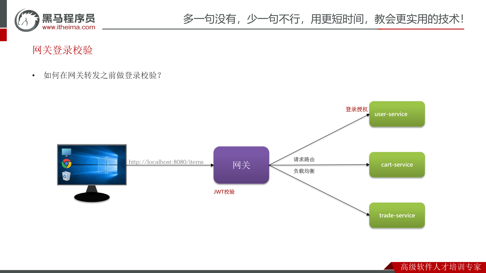

## 3.1 网关请求处理流程

要在网关做登录校验，必须先理解网关内部的请求处理流程：

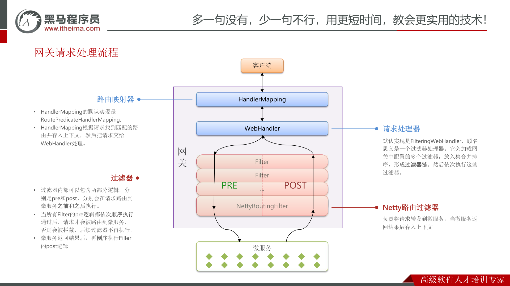

| 组件 | 作用 |
| --- | --- |
| **HandlerMapping（路由映射器）** | 默认实现是 `RoutePredicateHandlerMapping`。根据请求找到匹配的路由并存入上下文，然后把请求交给 WebHandler 处理。 |
| **WebHandler（请求处理器）** | 默认实现是 `FilteringWebHandler`，它会加载网关中配置的多个过滤器，放入集合并排序，形成**过滤器链**，然后依次执行。 |
| **Filter（过滤器）** | 内部包含 **pre** 和 **post** 两部分逻辑，分别在请求路由到微服务**之前**和**之后**执行。 |
| **NettyRoutingFilter** | Netty 路由过滤器，负责将请求转发到微服务，当微服务返回结果后存入上下文。 |

> **执行顺序（重点）：**
> - 当所有 Filter 的 **pre** 逻辑都依次顺序执行通过后，请求才会被路由到微服务；否则会被拦截，后续过滤器不再执行。
> - 微服务返回结果后，再**倒序**执行 Filter 的 **post** 逻辑。

## 3.2 自定义过滤器

网关过滤器有两种：

> - **GatewayFilter**：路由过滤器，作用于任意指定的路由；**默认不生效，要配置到路由后生效**。
> - **GlobalFilter**：全局过滤器，作用范围是所有路由；**声明后自动生效**。

两种过滤器的过滤方法签名完全一致：

```java
public interface GlobalFilter {
    /**
     * @param exchange 请求上下文，包含整个过滤器链内共享数据（request、response 等）
     * @param chain    过滤器链。当前过滤器执行完后，要调用过滤器链中的下一个过滤器
     */
    Mono<Void> filter(ServerWebExchange exchange, GatewayFilterChain chain);
}
```

**自定义 GlobalFilter**——直接实现 `GlobalFilter` 接口即可：

```java
@Component
public class MyGlobalFilter implements GlobalFilter, Ordered {
    @Override
    public Mono<Void> filter(ServerWebExchange exchange, GatewayFilterChain chain) {
        // 1.获取请求
        ServerHttpRequest request = exchange.getRequest();
        // 2.过滤器业务处理（pre 阶段）
        System.out.println("GlobalFilter pre阶段 执行了。");
        // 3.放行
        return chain.filter(exchange);
    }

    @Override
    public int getOrder() {
        // 过滤器执行顺序，值越小，优先级越高
        return 0;
    }
}
```

如果需要 **post** 阶段逻辑，可以在 `chain.filter(exchange)` 之后接 `then`：

```java
return chain.filter(exchange)
    .then(Mono.fromRunnable(() -> {
        System.out.println("post阶段 执行了。");
    }));
```

**自定义 GatewayFilter**——不是直接实现 `GatewayFilter`，而是实现 `AbstractGatewayFilterFactory`：

```java
@Component
public class PrintAnyGatewayFilterFactory
        extends AbstractGatewayFilterFactory<PrintAnyGatewayFilterFactory.Config> {

    @Override
    public GatewayFilter apply(Config config) {
        return new GatewayFilter() {
            @Override
            public Mono<Void> filter(ServerWebExchange exchange, GatewayFilterChain chain) {
                // 编写过滤器逻辑
                System.out.println("PrintAny filter 执行了");
                // 放行
                return chain.filter(exchange);
            }
        };
    }

    // 自定义配置属性，成员变量名称很重要，下面会用到
    @Data
    public static class Config {
        private String a;
        private String b;
        private String c;
    }

    // 将变量名称依次返回，顺序很重要，将来读取参数时需要按顺序获取
    @Override
    public List<String> shortcutFieldOrder() {
        return List.of("a", "b", "c");
    }

    // 将 Config 字节码传递给父类，父类负责帮我们读取 yaml 配置
    public PrintAnyGatewayFilterFactory() {
        super(Config.class);
    }
}
```

> ⚠️ **命名约定**：工厂类名必须以固定后缀 `GatewayFilterFactory` 结尾（如 `PrintAnyGatewayFilterFactory`），配置时使用前缀 `PrintAny`，方便配置使用。

配置默认过滤器（对所有路由生效）：

```yaml
spring:
  cloud:
    gateway:
      default-filters:
        - AddRequestHeader=a,b
        - PrintAny=1,2,3
```

## 3.3 实现登录校验

> **案例需求：在网关中基于过滤器实现登录校验功能。**
>
> 提示：黑马商城是基于 **JWT** 实现的登录校验，相关功能原本在 `hm-service` 模块。可以将其中的 **JWT 工具拷贝到 gateway 模块**，然后基于 **GlobalFilter** 来实现登录校验。

## 3.4 网关传递用户

登录校验通过后，需要把用户信息传递到下游微服务，并在微服务内部用 **ThreadLocal** 保存，供业务随时获取：

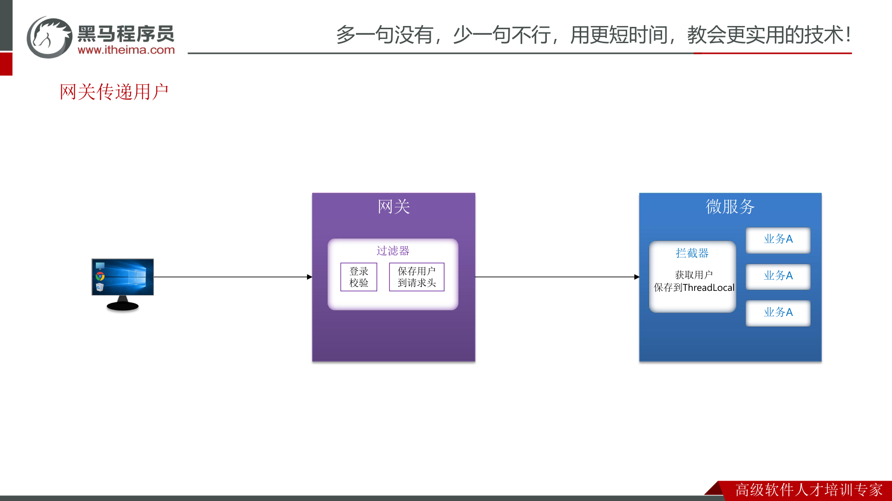

**步骤一：在网关的登录校验过滤器中，把获取到的用户写入请求头**

> 需求：修改 gateway 模块中的登录校验过滤器，在校验成功后保存用户到下游请求的请求头中。
> 提示：要修改转发到微服务的请求，需要用到 `ServerWebExchange` 类提供的 API：

```java
exchange.mutate() // mutate 就是对下游请求做更改
        .request(builder -> builder.header("user-info", userInfo))
        .build();
```

**步骤二：在 hm-common 中编写 SpringMVC 拦截器，获取登录用户**

> 由于每个微服务都可能有获取登录用户的需求，因此直接在 **hm-common 模块**定义拦截器（`HandlerInterceptor`），这样微服务只需要引入依赖即可生效，无需重复编写。拦截器从请求头取出用户信息，保存到 **ThreadLocal**。

## 3.5 OpenFeign 传递用户

微服务项目中很多业务需要多个微服务共同合作完成，这个过程中也需要传递登录用户信息。例如下单：交易服务要调用商品服务（扣减库存）、购物车服务（清理购物车），用户信息必须一路传递下去：

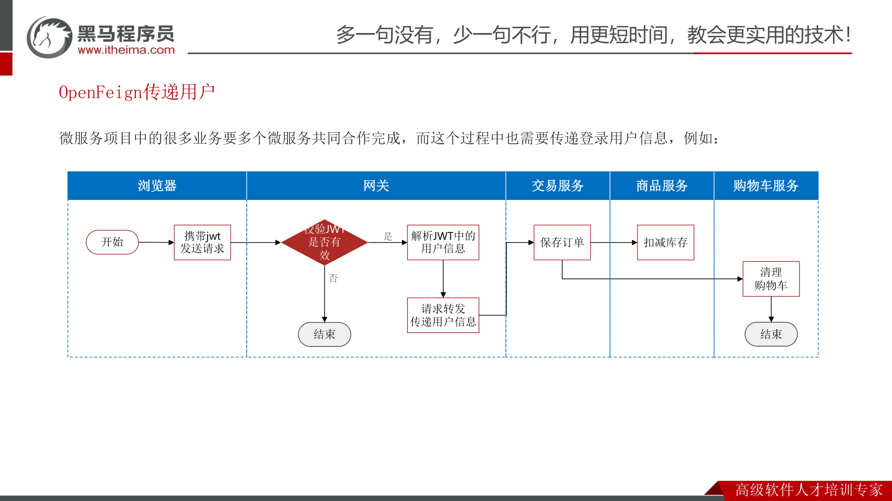

> OpenFeign 中提供了一个**拦截器接口 `RequestInterceptor`**，所有由 OpenFeign 发起的请求都会先调用拦截器处理请求：

```java
public interface RequestInterceptor {
  /**
   * Called for every request. Add data using methods on the supplied {@link RequestTemplate}.
   */
  void apply(RequestTemplate template);
}
```

其中的 `RequestTemplate` 类提供了一些方法，可以让我们修改请求头，从而把当前线程 ThreadLocal 中的用户信息塞进 OpenFeign 请求。

## 3.6 微服务登录解决方案

综合以上，微服务登录的完整解决方案如下图：

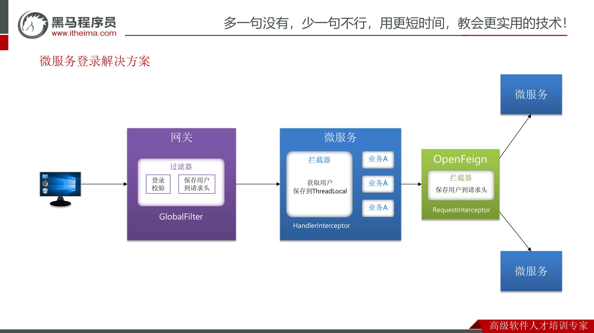

> **完整链路（重点）：**
> 1. **网关 GlobalFilter**：登录校验，校验成功后保存用户到请求头。
> 2. **微服务 HandlerInterceptor**：拦截器从请求头获取用户，保存到 **ThreadLocal**。
> 3. **OpenFeign RequestInterceptor**：服务间调用时，从 ThreadLocal 取出用户再写入请求头，实现用户信息在微服务之间的传递。

---

# 四、配置管理

> 微服务架构下，配置面临三大痛点：
> - **微服务重复配置过多，维护成本高**；
> - **业务配置经常变动，每次修改都要重启服务**；
> - **网关路由配置写死，如果变更要重启网关**。

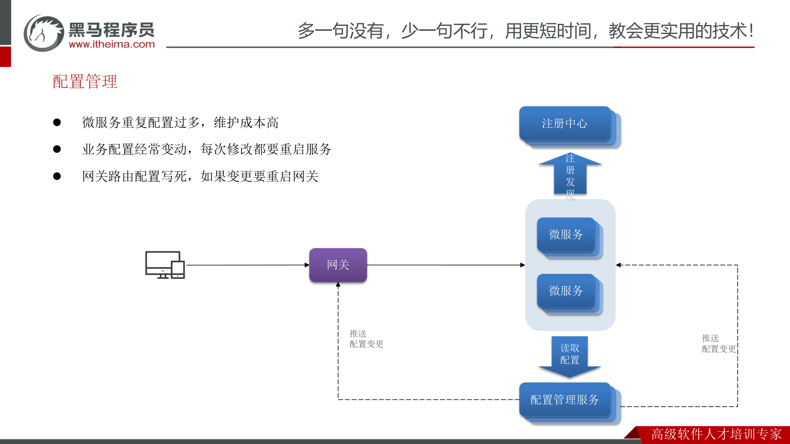

解决方案：使用 **Nacos** 作为配置管理服务（Nacos 同时承担注册中心 + 配置管理）。微服务统一从 Nacos 读取配置，配置变更时 Nacos 主动推送：

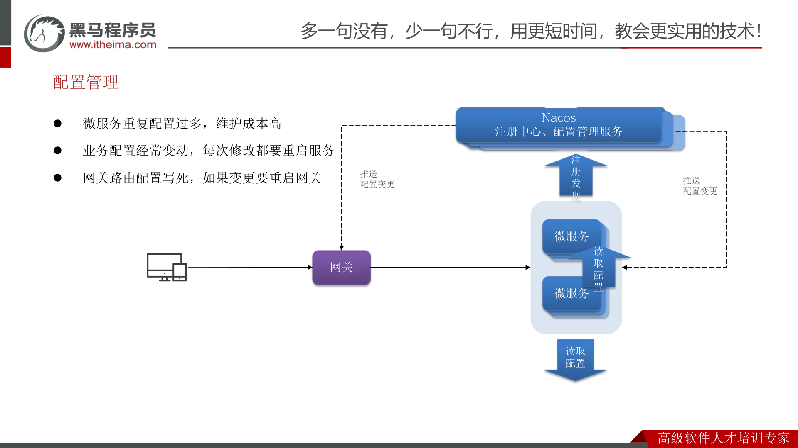

## 4.1 配置共享

**步骤一：添加配置到 Nacos**

> 添加一些共享配置到 Nacos 中，包括：**Jdbc、MybatisPlus、日志、Swagger、OpenFeign** 等配置。

**步骤二：拉取共享配置**

基于 NacosConfig 拉取共享配置，代替微服务的本地配置。注意 SpringBoot 与 SpringCloud 上下文的加载顺序：

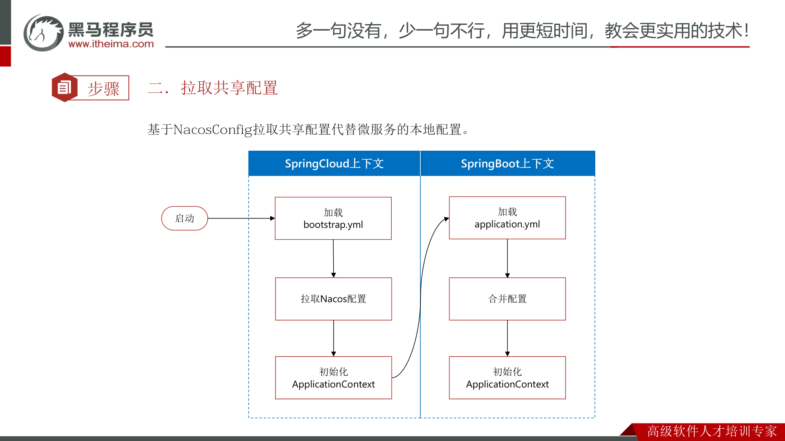

> **加载顺序：** 加载 `bootstrap.yml` → 拉取 Nacos 配置 → 初始化 SpringCloud 上下文 → 加载 `application.yml` → 初始化 SpringBoot 上下文 → **合并配置**。
>
> 因为要在 SpringBoot 启动前就拉取 Nacos 配置，所以需要把 Nacos 地址等信息放在优先级更高的 **`bootstrap.yaml`** 中。

**① 引入依赖**

```xml
<!--nacos配置管理-->
<dependency>
    <groupId>com.alibaba.cloud</groupId>
    <artifactId>spring-cloud-starter-alibaba-nacos-config</artifactId>
</dependency>
<!--读取bootstrap文件-->
<dependency>
    <groupId>org.springframework.cloud</groupId>
    <artifactId>spring-cloud-starter-bootstrap</artifactId>
</dependency>
```

**② 新建 `bootstrap.yaml`**

```yaml
spring:
  application:
    name: cart-service # 服务名称
  profiles:
    active: dev
  cloud:
    nacos:
      server-addr: 192.168.150.101:8848 # nacos地址
      config:
        file-extension: yaml # 文件后缀名
        shared-configs:      # 共享配置
          - dataId: shared-jdbc.yaml     # 共享 jdbc 配置
          - dataId: shared-log.yaml      # 共享日志配置
          - dataId: shared-swagger.yaml  # 共享 swagger 配置
```

## 4.2 配置热更新

> **配置热更新：当修改配置文件中的配置时，微服务无需重启即可使配置生效。**

实现配置热更新需要满足两个**前提条件**：

**① Nacos 中要有一个与微服务名有关的配置文件**，dataId 格式如下：

```
[spring.application.name]-[spring.profiles.active].[file-extension]
        微服务名称          项目profile（可选）      文件后缀名
```

**② 微服务中要以特定方式读取需要热更新的配置属性**，有两种方式：

方式一：`@ConfigurationProperties`（推荐，自动支持热更新）

```java
@Data
@ConfigurationProperties(prefix = "hm.cart")
public class CartProperties {
    private int maxItems;
}
```

方式二：`@Value` + `@RefreshScope`

```java
@Data
@RefreshScope
public class CartProperties {
    @Value("${hm.cart.maxItems}")
    private int maxItems;
}
```

> **案例需求：** 购物车的限定数量目前写死在业务中，将其改为读取配置文件属性，并将配置交给 Nacos 管理，实现热更新。

## 4.3 动态路由

> 要实现动态路由，首先要将路由配置保存到 Nacos；当 Nacos 中的路由配置变更时，推送最新配置到网关，实时更新网关中的路由信息。
>
> 需要完成两件事：
> ① **监听 Nacos 配置变更的消息**；
> ② **当配置变更时，将最新的路由信息更新到网关路由表**。

**① 监听 Nacos 配置变更**（参考官方文档：<https://nacos.io/zh-cn/docs/sdk.html>）

```java
private final NacosConfigManager nacosConfigManager;

public void initRouteConfigListener() throws NacosException {
    // 1.注册监听器并首次拉取配置
    String configInfo = nacosConfigManager.getConfigService()
            .getConfigAndSignListener(dataId, group, 5000, new Listener() {
                @Override
                public Executor getExecutor() {
                    return null;
                }
                @Override
                public void receiveConfigInfo(String configInfo) {
                    // TODO 监听到配置变更，更新一次配置
                }
            });
    // TODO 2.首次启动时，更新一次配置
}
```

**② 更新路由表**——利用 `RouteDefinitionWriter` 来更新路由：

```java
/**
 * @author Spencer Gibb
 */
public interface RouteDefinitionWriter {
    /**
     * 更新路由到路由表，如果路由id重复，则会覆盖旧的路由
     */
    Mono<Void> save(Mono<RouteDefinition> route);
    /**
     * 根据路由id删除某个路由
     */
    Mono<Void> delete(Mono<String> routeId);
}
```

**③ 路由配置语法**——为方便解析从 Nacos 读取到的路由配置，推荐使用 **json 格式**：

```json
{
    "id": "item",
    "uri": "lb://item-service",
    "predicates": [{
        "name": "Path",
        "args": {
            "_genkey_0": "/items/**",
            "_genkey_1": "/search/**"
        }
    }],
    "filters": []
}
```

> 对应的 yaml 形式（等价）：

```yaml
spring:
  cloud:
    gateway:
      routes:
        - id: item
          uri: lb://item-service
          predicates:
            - Path=/items/**,/search/**
```
