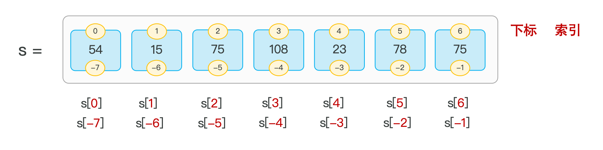
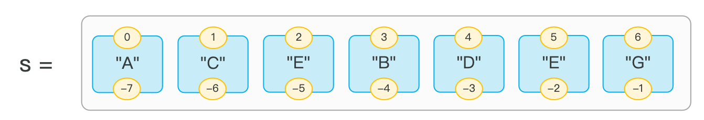
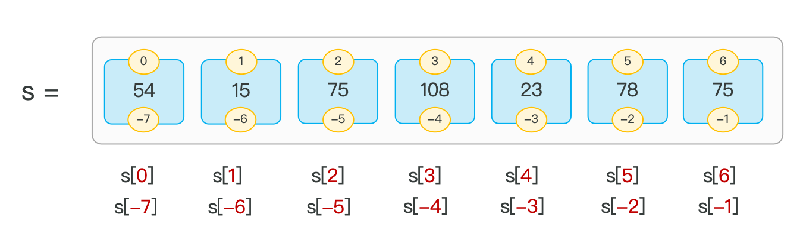
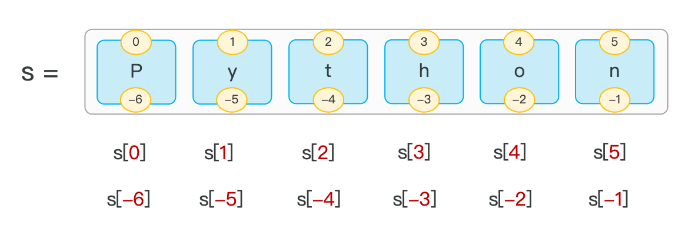

# Python 核心语法：数据存储容器

> **学习目标：** 依据顺序、可变性、唯一性和键值映射需求选择合适的容器。

## 容器选择

**一种可以容纳多份数据的数据类型（容器），容纳的每一份数据称之为 1 个元素，每一个元素都可以是任意类型的数据，如：字符串、数字、布尔等。**

| 容器 | 有序 | 可修改 | 特点 |
| --- | --- | --- | --- |
| `list` | 是 | 是 | 可变的项目集合 |
| `tuple` | 是 | 否 | 固定结构的数据 |
| `str` | 是 | 否 | 文本序列 |
| `set` | 不保证顺序 | 是 | 元素唯一，适合去重 |
| `dict` | 按插入顺序 | 是 | 键唯一的映射 |

### 列表

#### 介绍

* 列表是数据容器中的一类，是一次性可以存储多个数据（元素）的。

* 定义：

  ~~~py
  列表名称 = [元素1，元素2，元素3，元素4，元素5...]
  s = [54, 15, 75, 108, 23, 78, 75]
  ~~~

* 特点：

  - 可以存储不同类型的元素
  - 元素有序，可以重复，元素可以修改


> 序列类型：
>
> * 容器中的元素按特定顺序排列的、可通过索引访问的容器类型称之为序列。

> 注意：
>
> * 从前向后（正向索引），下标从 0 开始；从后向前（反向索引），下标从 -1 开始。


**总结**

* 列表的定义方式及特点

  - 列表名 = [元素1, 元素2, 元素3]
  - 可以存放不同类型元素、可重复、有序、元素可以修改

* 列表的索引

  - 正向索引：从 0 开始
  - 反向索引：从 -1 开始

* 列表元素的查看、修改、删除

  - 查看：`list1[0]`
  - 修改：`list1[0] = "A"`
  - 删除：`del list1[3]`

  > 注意：如果指定的索引值超出范围，将会报错。

#### 切片

* 介绍：切片是指对操作的数据截取其中一部分的操作。列表、字符串、元组都支持切片操作。

* 语法：

  ```python
  序列数据[开始索引:结束索引:步长]
  ```

  * 不包含结束索引位置对应的元素（开始索引未指定默认为 0；结束索引未指定默认为列表长度，即到列表末尾；步长未指定默认为 1）
  * 索引采用正向、反向索引都可以
  * 步长是选取间隔，默认步长为 1

* 举例：

  - `S[0:5:1]` 切片后的结果为 `["A", "C", "E", "B", "D"]`
  - `S[0:5:2]` 切片后的结果为 `["A", "E", "D"]`


**总结**

* 列表的切片

  - 语法：`S[start:end:step]`

  - 特点：

    - `start`：开始索引，不指定默认为 0（第一个元素的索引）
    - `end`：结束索引，不指定默认为列表长度（直到列表末尾）
    - `step`：步长，不指定默认为 1


#### 常见方法

| 方法        | 作用                                                         | 样例                   |
| ----------- | ------------------------------------------------------------ | ---------------------- |
| `append()`  | 在列表的尾部追加元素                                         | `s.append(10086)`      |
| `insert()`  | 在指定索引之前，插入该元素                                   | `s.insert(0, 92)`      |
| `remove()`  | 移除列表中第一个匹配到的值                                   | `s.remove(75)`         |
| `pop()`     | 删除列表中指定索引位置的元素（如果未指定索引，默认删最后一个） | `s.pop(2)` / `s.pop()` |
| `sort()`    | 对列表进行排序（列表元素的数据类型一致，才可以进行排序）     | `s.sort()`             |
| `reverse()` | 反转列表元素                                                 | `s.reverse()`          |



**例子：**

~~~py
# 创建列表
students = ["小明", "小红", "小刚"]

# 查看元素
print(students[0])  # 小明

# 修改元素
students[1] = "小丽"

# 添加元素
students.append("小强")

# 删除元素
students.remove("小刚")

# 切片
print(students[0:2])

# 遍历列表
for student in students:
    print(student)

print(students)
~~~


### 字符串

#### 介绍

* 介绍：字符串是字符的容器，一个字符串中可以存放任意数量的字符。如：`"Python"`、`'Python'`
* 特点：不可变性（无法修改）、有序性、可迭代性。
*  字符串中的每一个字符元素都有其对应的下标（索引），通过元素对应的索引，就可以获取到对应的元素。

> 注意：从前向后（正向索引），下标从 0 开始；从后向前（反向索引），下标从 -1 开始。


**小结**

* 字符串的特点

  - 不可变性（无法修改）、有序性、可迭代性
2. 字符串的索引

   - 正向索引：从 0 开始
   - 反向索引：从 -1 开始

3. 字符串的切片

   - 语法：`s[start:end:step]`

   - 特点：

     - `start`：开始索引，不指定默认为 0（第一个元素的索引）
     - `end`：结束索引，不指定默认为 -1（最后一个元素的索引）
     - `step`：步长，不指定默认为 1（-1 表示从后向前）

#### 切片

* 介绍：切片是指对操作的对象截取其中一部分的操作。字符串、列表、元组都支持切片操作。

* 语法：序列对象[开始索引:结束索引:步长]

  * 不包含结束索引位置对应的元素（开始索引未指定默认为 0；结束索引未指定默认为 -1；步长未指定默认为 1）
  * 索引采用正向、反向索引都可以
  * 步长是选取间隔，默认步长为 1（如果是 -1，表示从后向前）

* 举例：

  - `s[0:5:1]` 切片后的结果为 `"Pytho"`

  - `s[0:5:2]` 切片后的结果为 `"Pto"`


**小结**

* 字符串的特点

  - 不可变性（无法修改）、有序性、可迭代性
2. 字符串的索引

   - 正向索引：从 0 开始
   - 反向索引：从 -1 开始

3. 字符串的切片

   - 语法：`s[start:end:step]`

   - 特点：

     - `start`：开始索引，不指定默认为 0（第一个元素的索引）
     - `end`：结束索引，不指定默认为 -1（最后一个元素的索引）
     - `step`：步长，不指定默认为 1（-1 表示从后向前）


#### 常用方法

| 方法           | 作用                                                         | 样例                         |
| -------------- | ------------------------------------------------------------ | ---------------------------- |
| `find()`       | 在字符串中查找子串，返回第一次出现的索引位置，找不到返回 `-1` | `s.find('Python')`           |
| `count()`      | 统计子串在字符串中出现的次数                                 | `s.count('H')`               |
| `upper()`      | 将字符串中的所有字母转换为大写                               | `s.upper()`                  |
| `lower()`      | 将字符串中的所有字母转换为小写                               | `s.lower()`                  |
| `split()`      | 将字符串按指定分隔符分割成列表                               | `s.split(' ')`               |
| `strip()`      | 去除字符串两端的空白字符或指定字符                           | `s.strip()` / `s.strip('*')` |
| `replace()`    | 将字符串中的指定子串替换为新的子串                           | `s.replace('H', 'C')`        |
| `startswith()` | 检查字符串是否以指定子串开头，返回布尔值                     | `s.startswith('P')`          |


例如：

~~~py
s = "  Hello Python  "

# 查找子串
print(s.find("Python"))       # 8

# 统计字符出现次数
print(s.count("l"))           # 2

# 转换为大写
print(s.upper())              #   HELLO PYTHON

# 转换为小写
print(s.lower())              #   hello python

# 去除两端空格
text = s.strip()
print(text)                   # Hello Python

# 按空格分割
print(text.split(" "))        # ['Hello', 'Python']

# 替换内容
print(text.replace("Python", "World"))  # Hello World

# 判断是否以指定内容开头
print(text.startswith("Hello"))        # True
~~~


### 元组

#### 基本操作

* 介绍：元组是**不可变**的序列，类似于列表，但创建后不能修改。

* 特点：

    - 可以存储不同类型的元素
    - 元素可以重复、有序、不可修改（支持索引访问、切片）

* 定义：

  ~~~py
  # 定义元组
  元组名称 = (元素1，元素2，...)
  # 定义空元组
  元组名称 = ()
  元组名称 = tuple()
  
  ==========举例===================
  
  t1 = (5, 7, 9, 1, 2, 3, 10, 6, 4, 8, 12, 7, 5)
  
  t2 = ()
  t3 = tuple()
  ~~~

- 方法：
  - `count()`：统计某元素在元组中出现的次数
  - `index()`：查找某个元素在元组中的索引位置（第一次出现的位置）


**小结**

* 元组有什么特点？

  - 元素可以重复
  - 有序
  - 不可修改（只读）
2. 元组的两个查询方法？

   - `count()`：统计指定元素的数量
   - `index()`：获取指定元素的索引，如果该元素不存在将报错

3. 元组使用注意事项？

   - 定义单元素元组时，需要在结尾加上逗号，例如：`('A',)`


#### 组包与解包

- 组包（Packing）：将多个值合并到一个容器（元组、列表）中。

- 解包（Unpacking）：将容器（元组、列表）解开成独立的元素，分别赋值给多个变量。

  ~~~python
  # 定义元组，组包
  t1 = (5, 7, 9, 1)
  
  # 定义元组，组包
  t2 = 5, 7, 9, 1
  
  # 基础解包
  a, b, c, d = t1
  
  # (*) 扩展解包
  x, *y, z = t2  # x 为 5，y 为 [7, 9]，z 为 1
  
  s, *o = t2     # s 为 5，o 为 [7, 9, 1]
  
  *o, e = t2     # o 为 [5, 7, 9]，e 为 1
  ~~~

> **说明：** 在元组解包时，`*` 表示收集剩余的所有元素，允许处理不确定数量的元素（生成列表，以便可以进行进一步的处理）。


**小结**

* 组包与解包？

  - 组包（Packing）：将多个值合并到一个容器（元组、列表）中。

  - 解包（Unpacking）：将容器中的元素分别赋值给多个变量。

    - 在元组解包时，`*` 表示收集剩余的所有元素，允许处理不确定数量的元素。

### 集合

#### 为什么要用集合？

**为什么要用集合？**

* 场景：在业务中，需要定义一个变量，来批量存储用户的手机号（唯一的）？
  - 列表 `list`、元组 `tuple` 可以存吗？
    不可以，因为这两种类型是可以存储重复元素的。
  - 此时就可以使用集合 `set` 来存储，`set` 会自动去重，只存储不重复的元素。


#### 介绍

- 介绍：集合（`set`）是一种无序的、不可重复、可修改的数据容器。

- 定义：

  ```python
  # 定义集合
  s1 = {"C", "D", "X", "T", "O", "U"}
  
  # 定义空集合
  s2 = set()
  ```

> **注意：** 空集合的定义不可以使用 `{}`，`{}` 表示的是空字典；由于集合是无序的，因此不支持下标索引访问。

#### 常用方法

`集合（set）`中的常见方法：

| 操作             | 含义                                                         | 样例                  |
| ---------------- | ------------------------------------------------------------ | --------------------- |
| `add()`          | 添加元素到集合中                                             | `s1.add('t')`         |
| `remove()`       | 移除集合中的指定元素（指定元素不存在将报错）                 | `s1.remove('t')`      |
| `pop()`          | 随机删除集合中的元素并返回                                   | `e = s1.pop()`        |
| `clear()`        | 清空集合                                                     | `s1.clear()`          |
| `difference()`   | 求取两个集合的差集（包含在第一个集合但不包含在第二个集合的元素） | `s1.difference(s2)`   |
| `union()`        | 求取两个集合的并集                                           | `s1.union(s2)`        |
| `intersection()` | 求取两个集合的交集                                           | `s1.intersection(s2)` |

#### 小结

1. 集合（`set`）的特点？

- 无序、不可重复、可修改（不要依赖显示顺序）

2. 集合（`set`）的定义及常用操作

- 定义 1：`集合名 = {元素1, 元素2, 元素3...}`
- 定义 2：`集合名 = set()`
- 常用操作：
  - 添加：`s1.add(...)`
  - 删除：`s1.remove(...)` / `s1.pop()` / `s1.clear()`
  - 交、并、差集：`s1.intersection(s2)` / `s1.union(s2)` / `s1.difference(s2)`

3. 集合 `set` 操作的运算符 `&`、`|`、`-`

- `&`：交集
- `|`：并集
- `-`：差集

4. 集合推导式的写法

- `变量名称 = {表达式 for i in 列表}`
- `变量名称 = {表达式 for i in 列表 if 条件}`


### 字典

#### 什么是字典？

- 通过【字/词语】，找到该字对应的【解释】。
- 每个【字/词语】对应一个解释，【字/词语】是不能重复的。


> Python 中的字典（`dict`），里面存储的是键值对（`key: value`）类型的数据，可以根据键（`key`）找到对应的值（`value`）。

#### 为什么要使用字典呢？

- 现需要存储班级学员高考成绩，其中包含王林（670）、韩立（556）、李慕婉（582）、紫灵（435）、许立国（608）……，该如何存储呢？

  ~~~python
  # 定义列表存储
  name_list = ["王林", "韩立", "李慕婉", "紫灵", "许立国", "王政", "张紫"]
  
  score_list = [670, 556, 582, 435, 608, 512, 678]
  ~~~

  ~~~python
  # 定义字典存储
  dict1 = {
      "王林": 670,
      "韩立": 556,
      "李慕婉": 582,
      "紫灵": 435,
      "许立国": 608,
      "王政": 512,
      "张紫": 678
  }
  ~~~


#### 介绍

- 字典：使用键值对（`key: value`）来存储数据，每一个键都对应一个值，通过键（`key`）可以快速找到对应的值（`value`）。

- 特点：键值对（`key: value`）存储、键（`key`）不能重复、可修改。

- 定义：

  ```python
  # 定义字典
  字典名称 = {key: value, key: value, key: value, ...}
  
  # 定义空字典
  字典名称 = {}
  字典名称 = dict()
  ```

  ```python
  dict1 = {"王林": 675, "李慕婉": 608, "许立国": 478, ...}
  
  dict2 = {}
  dict3 = dict()
  ```

- 根据 `key` 获取 `value`：

  ```
  值 = 字典名称[key]
  ```

  ```
  score = dict1["李思"]
  ```

> **注意：** 字典（`dict`）中的 `value` 可以是任何类型的数据，而 `key` 不能为可变类型（如：不能为列表 `list`、集合 `set`、字典 `dict`）。


**小结**

1. 字典的存储形式及特点？
   - 字典（`dict`）存储的是键值对（`key: value`）形式的数据。
   - 特点：键值对、`key` 是唯一的、可修改。
2. 字典定义的语法？
   - 定义：`dict1 = {"王林": 675, "李慕婉": 608, "许立国": 478, ...}`
   - 获取：`v = dict1["王林"]`
3. 字典的注意事项
   - `value` 可以是任意类型，但 `key` 必须是不可变类型（不能为 `list`、`set`、`dict`）。
   - 字典内的 `key` 不允许重复，如果重复定义，后面的覆盖前面的。
   - 字典没有索引下标，不能根据索引获取值，只可以根据 `key` 获取 `value`。


#### 常用操作

字典的增删改查操作方式如下：

| 类型 | 操作                    | 含义                                                  | 样例                        |
| ---- | ----------------------- | ----------------------------------------------------- | --------------------------- |
| 添加 | `字典名称[key] = value` | 往指定字典中添加 `key-value` 键值对                   | `dict1["涛哥"] = 688`       |
| 删除 | `字典名称.pop(key)`     | 删除字典中指定的 `key`，并返回该 `key` 对应的 `value` | `score = dict1.pop("涛哥")` |
| 删除 | `del 字典名称[key]`     | 删除字典中指定的键值对                                | `del dict1["涛哥"]`         |
| 修改 | `字典名称[key] = value` | 修改字典中指定的 `key` 对应的值                       | `dict1["小智"] = 658`       |
| 查询 | `字典名称[key]`         | 根据 `key` 获取 `value`                               | `dict1["涛哥"]`             |
| 查询 | `字典名称.get(key)`     | 根据 `key` 获取 `value`                               | `dict1.get("涛哥")`         |
| 查询 | `字典名称.keys()`       | 获取所有的 `key`                                      | `dict1.keys()`              |
| 查询 | `字典名称.values()`     | 获取所有的 `value`                                    | `dict1.values()`            |
| 查询 | `字典名称.items()`      | 获取所有的 `key-value` 键值对                         | `dict1.items()`             |


例如：

~~~python
student = {
    "name": "Alice",
    "age": 18,
    "score": 95
}

# 1. 访问值
print(student["name"])
print(student.get("gender"))              # 不存在时返回 None
print(student.get("gender", "未知"))      # 不存在时返回默认值

# 2. 添加或修改
student["gender"] = "女"                  # 添加
student["score"] = 98                     # 修改
student.update({"age": 19, "city": "Tokyo"})

# 3. 判断键是否存在
print("name" in student)
print("phone" not in student)

# 4. 获取所有键、值、键值对
print(student.keys())
print(student.values())
print(student.items())

# 5. 遍历字典
for key, value in student.items():
    print(key, value)

# 6. 删除元素
student.pop("city")                       # 删除指定键
student.pop("phone", None)                # 不存在时不报错
del student["gender"]                     # 删除指定键

# 7. 设置默认值
student.setdefault("hobby", "reading")    # 不存在时添加
student.setdefault("name", "Bob")         # 已存在，不会修改

# 8. 获取字典长度
print(len(student))

# 9. 清空字典
# student.clear()

print(student)
~~~


#### 小结

1. 字典的常用操作？
   - 添加：`字典[key] = value`（`key` 不存在，就会执行新增）
   - 删除：`del 字典[key]` / `value = 字典.pop(key)`
   - 修改：`字典[key] = value`（`key` 存在，就会执行修改）
   - 查询：`字典[key]` / `字典.get(key)`；`字典.keys()` / `字典.values()` / `字典.items()`
2. 字典的遍历？
   - 字典支持 `for` 循环遍历。
   - 通过 `keys()`、`values()`、`items()` 进行循环遍历。


### 容器对比与选择

数据容器总结与对比

| 特性     | 字符串（`str`） | 列表（`list`）     | 元组（`tuple`） | 集合（`set`） | 字典（`dict`） |
| -------- | --------------- | ------------------ | --------------- | ------------- | -------------- |
| 有序性   | 有序            | 有序               | 有序            | `无序`        | 有序（3.7+）   |
| 重复元素 | 允许            | 允许               | 允许            | `不允许`      | `key 不允许`   |
| 可变性   | `不可变`        | 可变               | `不可变`        | 可变          | 可变           |
| 索引访问 | 支持            | 支持               | 支持            | `不支持`      | `不支持`       |
| 切片操作 | 支持            | 支持               | 支持            | `不支持`      | `不支持`       |
| 使用场景 | 文本处理        | 有序可重复数据集合 | 固定数据记录    | 去重数据集合  | 键值对         |
