# Python 核心语法：函数与类型注解

> **学习目标：** 用函数封装可复用逻辑，掌握参数、返回值、作用域与类型注解。

# 函数

## 什么是函数？

* 函数是组织好的、可重复使用的、用来实现特定功能的代码片段。
* 要输入，直接调用input()
* 要输出，直接调用print()
* 例如：
  * max()
  * min()
  * len()
  * sum()

> 因为 input()、print() 是Python的内置函数：
>
> * 是提前定义好的
> * 可以重复使用
> * 实现特定功能的


## 函数基础

### 函数定义

- 函数是组织良好的、可重复使用的、用来实现特定功能的代码片段。

- 函数定义与调用：

  ```python
  # 定义函数
  def 函数名(参数列表):
      函数体
      ......
      return 返回值
  
  # 调用函数
  函数名(参数)
  ```

  ```python
  # 定义函数
  def out_line():
      print('-------------------------')
  
  # 调用函数
  out_line()
  ```

> **注意：** 函数定义时的参数列表与返回值语句是可有可无的（由需求确定），函数必须先定义后调用执行（函数定义时，内部代码并未执行，在调用时才执行）。


**小结**

1. 函数定义及调用的语法？

   ~~~python
   # 函数的定义
   def out_line():
       print('-----------------------------------------')
   
   # 函数的调用
   out_line()
   ~~~

2. `函数使用的注意事项`

   - `函数必须先定义，在调用`。

   - `函数定义时，并不会执行，只有在调用函数时，函数体的逻辑才会运行`。

   - `函数中通过缩进来描绘归属关系`。


### 函数的参数与返回值

- 在定义函数时，根据业务需要，可以指定参数与返回值，具体格式如下：

  ~~~python
  # 定义函数
  def 函数名(参数列表):
      函数体
      ......
      return 返回值
  
  # 调用函数
  函数名(参数)
  # 计算圆的面积
  def circle_area(r):
      area = 3.14 * r * r
      return area
  
  # 调用函数
  c_area = circle_area(10)
  print(c_area)
  # 计算长方形的面积
  def rectangle_area(l, w):
      area = l * w
      return area
  
  # 调用函数
  r_area = rectangle_area(20, 10)
  print(r_area)
  ~~~

  

  - **形参（形式参数）：**函数定义时括号里的参数，只能在函数内使用（局部变量）。

  - **实参（实际参数）：**函数在实际调用时传入的参数。

> **注意：** 函数定义时如果有多个参数，多个参数之间使用逗号（`,`）分隔。

> **注意：** `return` 语句只有返回功能，而没有输出打印的功能，如果要输出，需要结合 `print()` 函数来实现。


**小结**

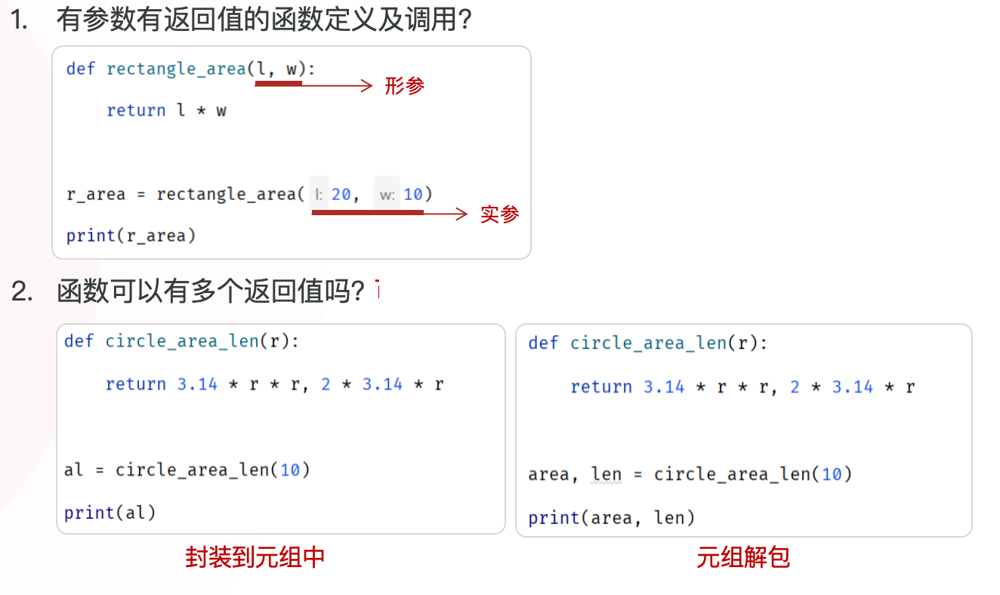

### 函数说明文档

函数的说明文档（Docstring）是写在函数开头，用三个引号包裹的字符串，用于解释函数的功能、参数、返回值等信息，方便调用者清楚函数的具体作用及细节。

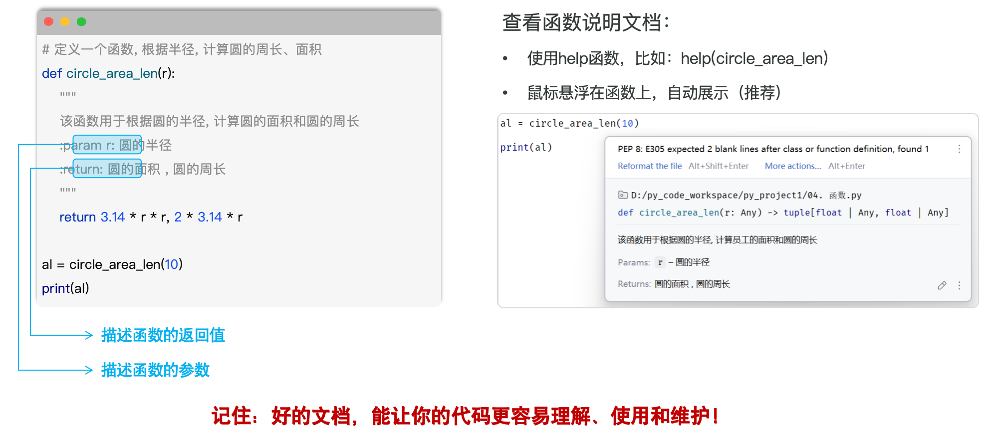

### 函数的嵌套调用

- 嵌套调用指的是在一个函数中，又调用了另外一个函数。
- 函数调用遵循栈结构，最后被调用的函数最先返回（LIFO，Last In First Out，后进先出）。

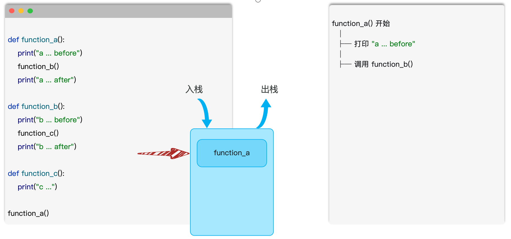

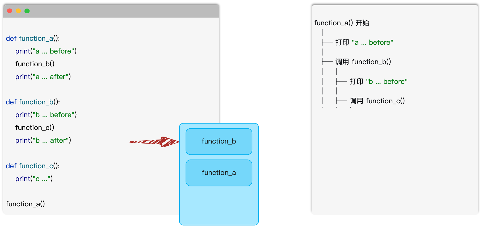

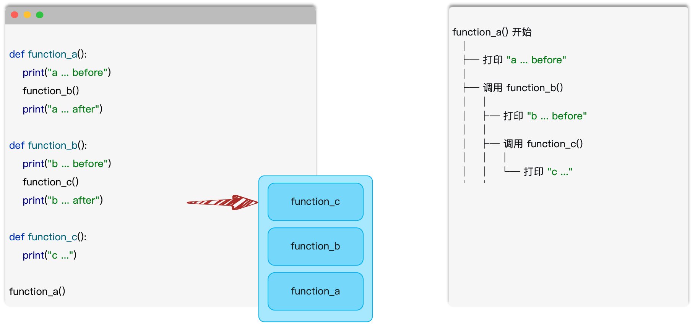

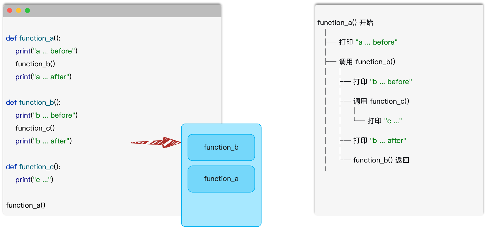

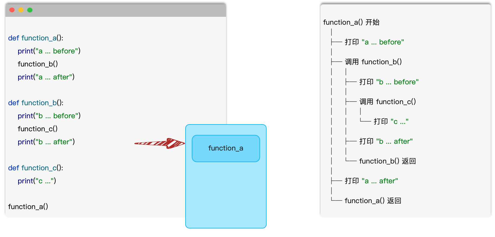

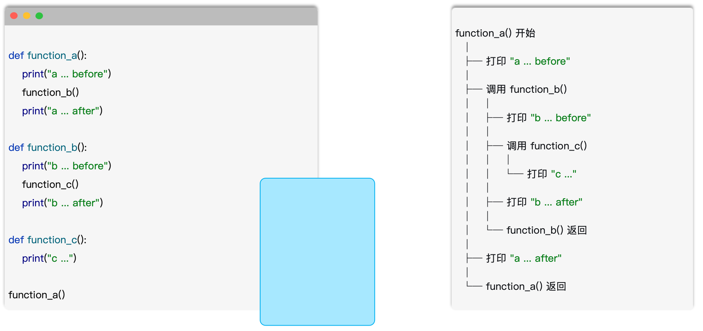

### 案例


## 函数进阶

### 函数变量的作用域

* 变量的作用域指的是变量的作用范围（标识这个变量在哪里可以使用，在哪儿不可以使用）。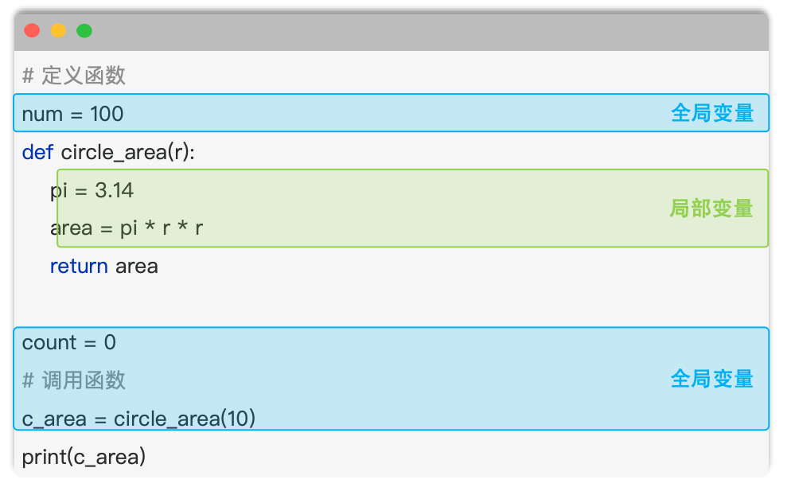


> **全局变量：** 在函数之外定义的变量，称之为全局变量，在整个文件中（包括函数内）都可以使用（通常定义在文件的顶部）。

> **局部变量：** 在函数内部定义的变量，称之为局部变量，只能在该函数内部使用，外部无法访问（函数执行完毕后，会自动销毁其内部的局部变量）。


#### global关键字

* `global` 关键字用于明确地告诉 Python 解释器，在函数中要使用全局变量，使得可以在函数内部修改全局变量的值。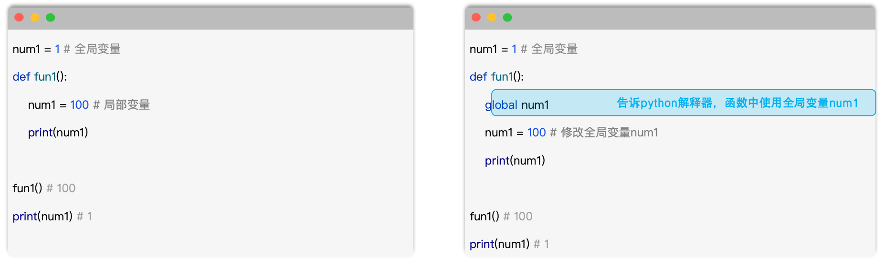

> **注意：** 在基于 `global` 声明全局变量时，要先声明，再使用。

#### 小结

1. 什么是局部变量、全局变量？
   - 在函数内部定义的变量就是局部变量，函数外声明的变量是全局变量。
2. `global` 关键字的作用？
   - 在函数内部使用，声明接下来要使用的是全局变量，语法：`global xxx`
3. 注意事项
   - 尽量避免在函数中使用全局变量，因为会使代码难以维护和调试。
   - 考虑使用函数参数和返回值来传递数据，而不是依赖全局变量。
   - `global` 主要用在程序的状态、配置和计数器等场景中。


### 函数参数详解

#### 传参方式

**传参方式指的是，在调用函数时，传递实参的方式。**

1. `位置参数：`调用函数时根据函数定义时的位置来传递参数。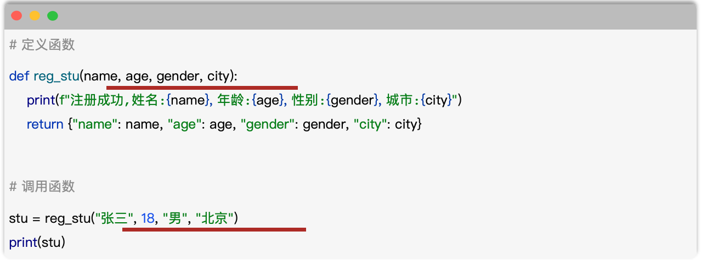

   > `要求：调用函数时参数顺序与定义函数时参数顺序完全一致`

2. `关键字参数：`调用函数时以函数定义时形参名称作为关键字，以 "键=值" 的形式来传递参数(不要求顺序)。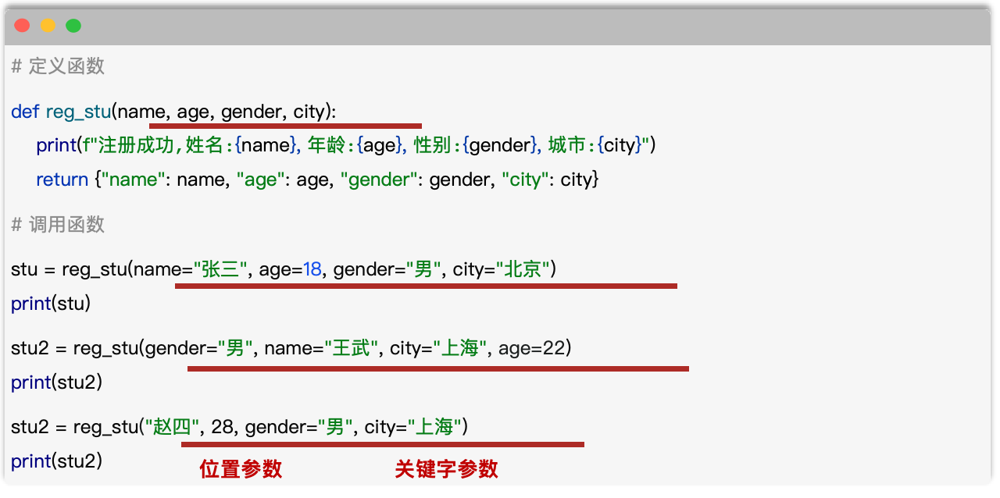

   > `要求：如果位置参数与关键字参数混用, 关键字参数必须在位置参数之后(关键字参数之间,没有顺序要求)`


##### 小结

1. 位置参数

   - 调用函数时，传入的实参的顺序与定义函数时形参的顺序完全一致。

   ```
   stu = reg_stu("小六子", 15, gender="男", city="深圳")
   
   print(stu)
   ```

2. 关键字参数

   - 调用函数时，通过 `"形参名=值"` 的形式传递参数，顺序没有要求。
   - `如果同时存在位置参数与关键字参数，位置参数在前，关键字参数在后。`

3. 两种传参方式的适用场景

   - 一切以代码结构清晰明了（可读性）、便于维护（维护性）为目标。
   - 如果参数比较少（不超过 3 个），可直接使用位置参数。
   - 如果参数数量较多，建议使用关键字参数。

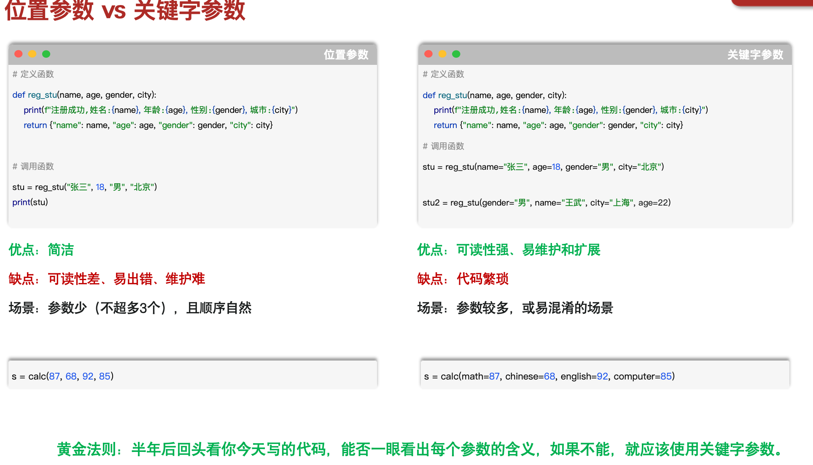


#### 默认参数

* 默认参数也称为缺省参数，用于在定义函数时，为参数提供默认值，调用函数时，可以不传递有默认值的参数。

  * ``city='北京 是默认参数`

  ~~~python
  # 定义函数
  def reg_stu(name, age, gender, city='北京'):
      print(f"注册成功，姓名：{name}，年龄：{age}，性别：{gender}，城市：{city}")
      return {"name": name, "age": age, "gender": gender, "city": city}
  
  
  # 调用函数
  stu = reg_stu("张三", 18, "男")
  print(stu)
  
  stu = reg_stu("赵四", 22, "男", "深圳")
  print(stu)
  ~~~

  

> 注意：默认参数必须放在没有默认值的参数列表的后面，一个函数在定义时是可以设置多个默认参数的。

> 注意：函数调用时，如果为默认参数传递了值，则会修改默认的参数值；如果没有传递该参数，则直接使用默认值。


#### 不定长参数

- 介绍：不定长参数也叫可变参数，用于函数定义及调用时参数个数不确定（0 个或多个）的场景。
- 类型：
  - `位置传递`
  - `关键字传递`


##### 位置传递(*args)

```python
# 定义函数
def calc_data(*args):
    pass


# 调用函数
data = calc_data(10, 20, 30, 40, 50, 60, 70, 80, 90, 100)
print(data)

data = calc_data(100, 200, 300, 400, 500)
print(data)
```

> **注意：** 传递的所有匹配的位置参数都会被 `args` 变量收集，这些参数会合并封装为一个元组，`args` 是元组类型（注意并不会封装关键字参数）。

> **注意：** `args` 只是约定俗成的变量名，并不是关键字，这里可以使用任何合法的变量名（如 `*data`）。


##### 关键字传递(**kwargs)

```python
# 定义函数
def calc_data(*args, **kwargs):
    min_data = min(args)
    max_data = max(args)
    avg_data = sum(args) / len(args)

    if kwargs.get('round'):
        avg_data = round(avg_data, kwargs.get('round'))

    return min_data, max_data, avg_data


data = calc_data(100, 200, 300, 400, round=2, count=0)
print(data)

data = calc_data(33, 11, 28, 91, 32, 75, 49)
print(data)
```

> **注意：** 参数是以“键=值”形式传递的关键字参数，这些“键=值”参数都会被 `kwargs` 接受，并合并封装为一个字典类型。

> **注意：** `kwargs` 只是约定俗成的变量名，并不是关键字，这里可以使用任何合法的变量名（如 `**options`）。


##### 小结

1. 什么是不定长参数？

   - 参数个数不确定，此时就可以使用不定长参数解决这类问题。
     - `如：`def calc_data(*args, **kwargs):

2. 不定长参数的分类？

   - `*args`：不定长位置参数，函数调用时，通过位置参数传递多个参数，封装到一个元组（`tuple`）中。
   - `**kwargs`：不定长关键字参数，函数调用时，通过关键字参数传递多个参数，封装到一个字典（`dict`）中。

3. `*args` 与 `**kwargs` 的应用场景？

   - `*args` 适用于处理数量不确定的数据。

   - `**kwargs` 适用于处理数量不确定的选项（函数的配置参数，用来定制函数的行为）。

     ~~~python
     # 核心数据：你要什么
     点奶茶("珍珠奶茶")
     
     # 选项：你要什么样的
     点奶茶("珍珠奶茶",甜度="少糖",冰度="去冰",加料=["布丁", "珍珠"],大小="大杯")
     ~~~

     


#### 参数类型

**函数中的参数类型**

* 普通参数：数字、布尔、字符串、列表、元组、集合、字典等。

* 特殊参数：函数。

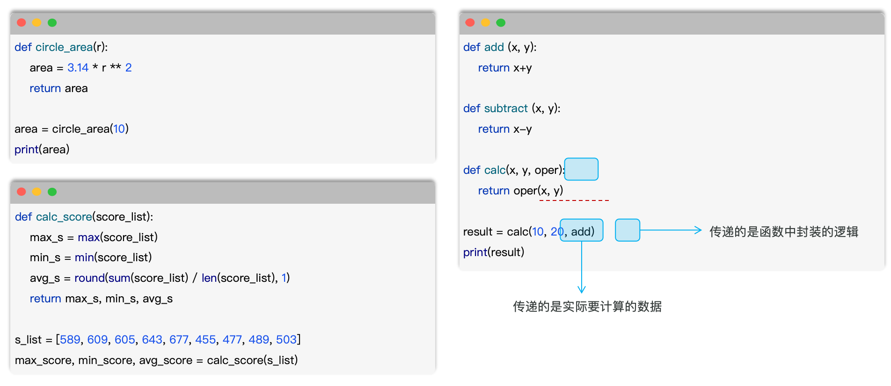

### 匿名函数

* 匿名函数指的是没有名称的函数，需要通过lambda表达式来声明函数，可以简化简单函数的编写（单行表达式）。

  * `命名函数`

    ~~~python
    # 定义命名函数
    def 函数名(参数列表):
        函数体...
    
    
    def out_line():
        print('-------------------------')
    
    
    def add(x, y):
        return x + y
    
    
    out_line()
    print(add(10, 20))
    ~~~

    

  * `匿名函数`

    ~~~python
    # 定义匿名函数
    lambda 参数列表：函数体
    
    lambda: print('-------------------------')
    
    lambda x, y: x + y
    ~~~

    

> **注意：**函数逻辑比较简单(单行表达式)且只在一个地方使用时，可以考虑使用匿名函数，简化书写（通常作为高阶函数的参数使用）。

> **注意：**匿名函数中可以返回结果，也可以不返回结果 。返回结果时，不需要写return，表达式的运行结果就是要返回的结果。


#### 小结

1. 匿名函数的定义方式

   ~~~python
   # 定义匿名函数
   lambda 参数列表：函数体
   ~~~

2. 命名函数与匿名函数的选择？

   - 建议使用匿名函数的情况：函数逻辑简单，只在一个地方调用（常作为高阶函数的参数）。

   - 建议使用命名函数的情况：函数逻辑复杂，需要多步操作，需要多个地方重复使用或需要加文档说明的场景。

> 代码的可读性和可维护性比简洁性更重要。

### 案例


## 类型注解

### 基本介绍

#### 类型注解

类型注解是 Python 中的一种语法特性，用于明确标识变量、函数参数和返回值的数据类型，从而使代码更清晰、更安全、更易维护。

```python
# 定义变量
a = 695

score = 98.5

hobby = "Python"

flag = True

pic = None

names = ["A", "C", "E"]

phones = {"13309091111", "15209109121"}

options = {"count": 0, "total": 0}

goods = ("手机", 5999, 1)
```

添加类型注解后：

```python
# 定义变量
a: int = 695

score: float = 98.5

hobby: str = "Python"

flag: bool = True

pic: None = None

names: list[str] = ["A", "C", "E"]

phones: set[str] = {"13309091111", "15209109121"}

options: dict[str, int] = {"count": 0, "total": 0}

goods: tuple[str, int, int] = ("手机", 5999, 1)
```


#### 类型判断

类型推断是指 Python 解释器自动推断出变量、表达式或函数返回值的数据类型的能力，而无需开发者显式声明。

```python
a = 695

score = 98.5

hobby = "Python"

flag = True

pic = None

names = ["A", "C", "E"]

phones = {"13309091111", "15209109121"}

options = {"count": 0, "total": 0}

goods = ("手机", 5999, 1)
a = 695

score = 98.5

hobby = "football"

flag = True

pic = None

names: list[str] = ["张三", "李四", "王五"]

goods = ("鼠标", "键盘", "USB")
```

> **注意：** 在对变量进行直接赋值，或者涉及变量的运算、容器的推导等场景时，解释器会自动推导出变量的类型。


#### 小结

1. 类型注解的写法？
   - 变量：数据类型，例如 `a: int`
2. 常见类型的写法
   - `int`、`float`、`bool`、`str`、`None`、`list`、`set`、`tuple`、`dict`
   - `str | int`
3. 为什么要使用类型注解，有什么好处呢？
   - 代码结构更清晰、代码逻辑更安全、易维护
   - 更准确的代码自动提示
   - 提前发现代码潜在问题

> **注意：** Python 是动态类型语言，添加的类型注解只是提示，并不是强制约束！

### 函数类型注解

为函数添加类型注解，其实主要就是为函数的参数和返回值添加类型注解，具体语法如下：

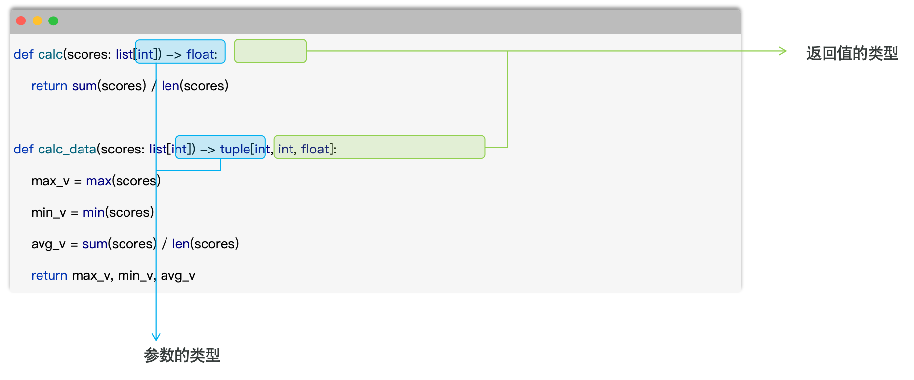

## lambda 与类型注解

`lambda` 适合一次性的单表达式函数，例如 `sorted(items, key=lambda item: item[1])`；复杂逻辑使用 `def`。类型注解提升可读性并帮助 IDE 和检查工具，但不会替代运行时的输入校验。

```python
def average(values: list[float]) -> float:
    return sum(values) / len(values)
```


