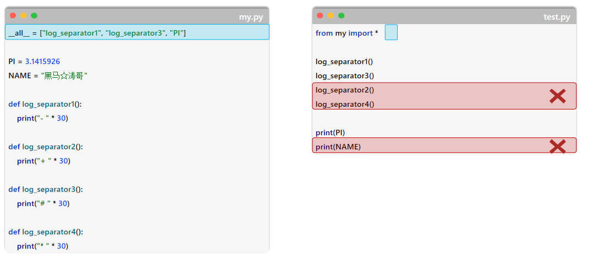

# Python 核心语法：模块与包

> **学习目标：** 按职责拆分代码，通过导入复用功能，并理解模块执行入口。

# 模块

* Python模块(module)：一个.py文件就是一个模块，模块是Python程序的基本组织单位。在模块中可以定义变量、函数、类，以及可执行的代码。

作用

* 提高代码复用性
* 降低开发门槛
* 避免命名冲突


## 导入模块

* 在使用模块中提供的功能之前，必须得先导入，再使用。
* 导入模块的具体语法如下：

| 导入形式                          | 代码样例                           | 调用方式      | 调用方式                |
| --------------------------------- | ---------------------------------- | ------------- | ----------------------- |
| import 模块名                     | import random, os                  | 模块名.功能名 | random.randint(10, 100) |
| import 模块名 as 别名             | import random as rd                | 别名.功能名   | rd.randint(10, 100)     |
| from 模块名 import 功能名         | from random import randint, choice | 功能名        | randint(10, 100)        |
| from 模块名 import 功能名 as 别名 | from random import randint as rint | 别名          | rint(10, 100)           |
| from 模块名 import *              | from random import *               | 功能名        | randint(10, 100)        |


**小结**

* 什么是模块? 有什么用?
  * 模块：就是一个python文件(.py)，其中就包含了变量、函数、类，以及可执行的代码。
  * 作用：提高代码复用性，降低开发门槛

* 导入模块的常用语法? 
  * import 模块名 [as 别名]
  * from 模块名 import 功能名 [as 别名]
  * from 模块名 import *

## 自定义模块

当开发一些复杂的项目，为了让项目结构更清晰，更便于项目的维护管理 及 代码的复用，可能会把一个项目拆分为若干个模块。

~~~python
# 基础配置
st.set_page_config(
    page_title="AI助手",  # 页面标题
    page_icon="🤖",  # 页面icon
    layout="wide",  # 页面布局，可选值有:"centered" | "wide"
    initial_sidebar_state="expanded",  # 侧边栏初始状态
    menu_items={  # 右上角的菜单项
        "Get Help": "https://www.extremelycoolapp.com/help",
        "Report a bug": "https://www.extremelycoolapp.com/bug",
    },
)

# 加载会话列表
def load_session():
    sessions = []
    if os.path.exists("sessions"):
        for filename in os.listdir("sessions"):
            if filename.endswith(".json"):
                sessions.append(filename[:-5])
    return sorted(sessions, reverse=True)


# 保存当前会话
def save_session(session_name):
    if session_name:
        session_data = {
            "messages": st.session_state.messages,
            "name": st.session_state.name,
            "temperature": st.session_state.temperature,
            "model": st.session_state.model,
            ......
~~~

**可以拆分为**

`config.py`

```python
# 基础配置
PAGE_TITLE = "AI树洞"  # 页面标题
PAGE_ICON = "🤖"  # 页面icon
LAYOUT = "wide"  # 页面布局，可选值有:"centered" | "wide"
INITIAL_SIDEBAR_STATE = "expanded"  # 侧边栏初始状态
HELP_URL = "https://www.extremelycoolapp.com/help"
SESSION_LOCATION = "sessions/"  # 会话数据存储位置
```

`session.py`

```python
# 加载会话列表
def load_session():
    sessions = []
    if os.path.exists("sessions"):
        for filename in os.listdir("sessions"):
            if filename.endswith(".json"):
                sessions.append(filename[:-5])
    return sorted(sessions, reverse=True)
```

`ai_partner.py`

```python
# 导入
from session import load_session, save_session

# 新建会话按钮
if st.button("新建会话", icon="➕", use_container_width=True):
    # 保存当前会话（如果有）
    if st.session_state.current_session:
        save_session(st.session_state.current_session)

    # 创建新会话
    new_session_name = generate_new_session_name()
    st.session_state.current_session = new_session_name
    st.session_state.messages = []
    save_session(new_session_name)
    st.session_state.sessions = load_sessions()
    st.rerun()
```

> 
>
> 注意：每一个python文件都可以作为一个模块，`模块的名字就是文件的名字`（建议使用python标识符定义，规范命名） 。

### _ all _

_all__是一个模块级别的特殊变量，用于指定 from 模块名 import * 时会导入哪些功能(*通配了哪些功能)。



> 注意：__all__控制的是 from ... import * 时，要导入的功能，并不会影响直接导入具体的功能（如: from ... import 功能） 。


#### 小结

1. __ name__与__all __  这两个特殊变量的作用是什么？
   - __ name __是 Python 中非常重要的内置变量，表示的是当前模块的名称。
     - 当模块直接运行时：`__name__` 的值为 `"__main__"`（`if __name__ == "__main__"`）。
     - 当模块被导入时：`__name__` 等于模块的文件名（不含 `.py` 后缀）。
   - `__all__`：控制 `import *` 时导入哪些功能。

## 软件包(package)

* 包：本质就是一个文件夹，该文件夹中可以包含若干python模块（.py文件），文件夹下还包含了一个__init__.py。
* 作用：模块文件较多时，用来管理多个模块。（包的本质也是一个模块）


| 导入形式                       | 代码样例                                | 调用方式           | 调用方式                      |
| ------------------------------ | --------------------------------------- | ------------------ | ----------------------------- |
| import 包名.模块名             | import utils.my_fun                     | 包名.模块名.功能名 | utils.my_fun.log_separator1() |
| from 包名 import 模块名        | from utils import my_fun                | 模块名.功能名      | my_fun.log_separator1()       |
| from 包名 import *             | from utils import *                     | 模块名.功能名      | my_fun.log_separator1()       |
| from 包名.模块名 import 功能名 | from utils.my_fun import log_separator1 | 功能名             | log_separator1()              |
| from 包名.模块名 import *      | from utils.my_fun import *              | 功能名             | log_separator1()              |

> **注意：** 在通过 `from 包名 import *` 导入全部模块的时候，需要在 `__init__.py` 文件中添加 `__all__=[]`，控制允许导入的模块列表。


#### 小结

1. 什么是包？有什么作用？
   - 包就是一个文件夹，里面可以存储很多 Python 模块（`.py` 文件），通过包可以对模块进行归类。
2. __ init __.py 文件的作用？
   - 标识这是一个包，而不是普通的文件夹。
   - 控制在 `import *` 时导入的模块列表（`__all__` 变量）。
3. 导入包的方式？
   - `import 包名.模块名`
   - `from 包名 import 模块名`
   - `from 包名 import *`
   - `from 包名.模块名 import 功能名`
   - `from 包名.模块名 import *`
