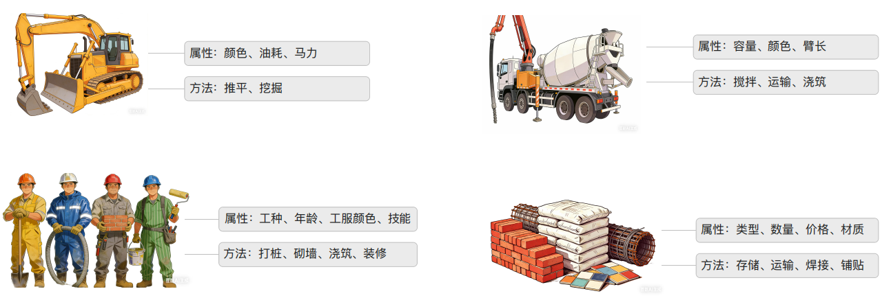
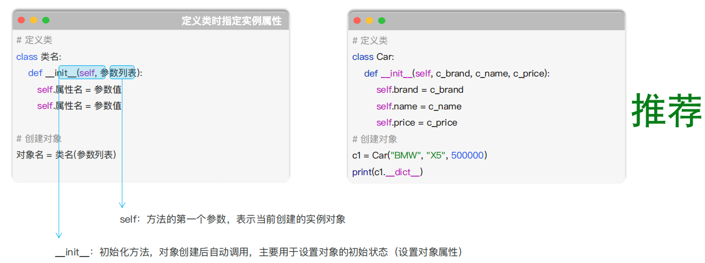
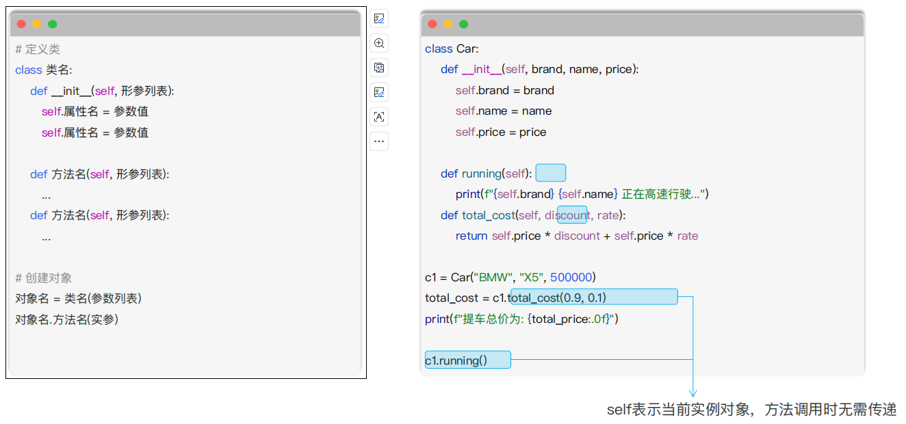
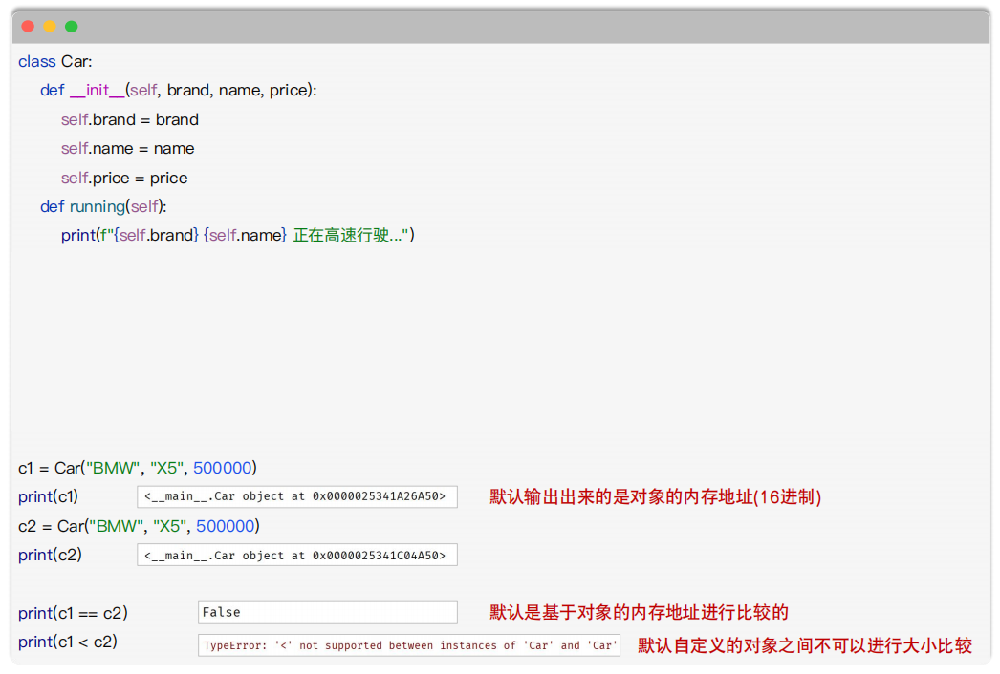
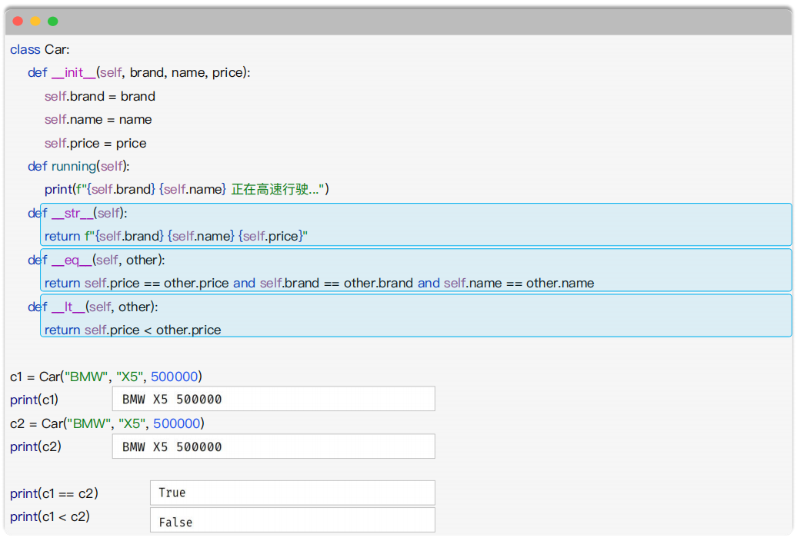
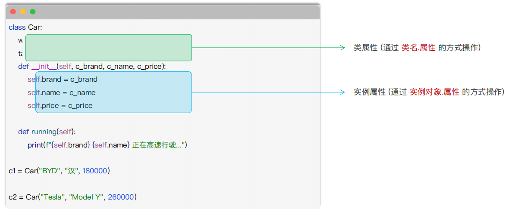
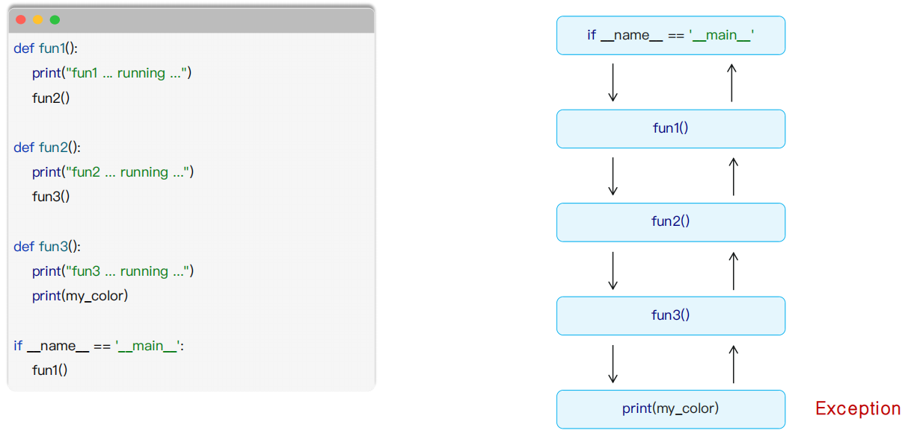

# Python 核心语法：面向对象基础与异常

> **学习目标：** 用类描述业务对象，区分实例与类属性，并以异常处理保证程序稳定。

# 面向对象基础

## 面向过程编程

* 核心思想：把一个需求分解成一系列要执行的步骤，然后按照步骤依次执行这些任务(关注的是流程、步骤)。
* 适用场景：面向过程编程非常直接，适合简单、线性的任务。


## 面向对象编程

* 对象可以理解为现实中具体的人/物在程序中的数字化身（**万物皆对象**）。

* 它把一个人/物的特征和功能打包到一起，是面向对象编程的基本单元。
  * `特征 对应 属性`
  * `功能 对应 方法`



## 类与对象

### 介绍

* 类：描述的是一组具有相同属性（特征）和方法（功能/行为）的模板
* 对象：对象是类的实例，是基于类创建出来的 （实例对象）。

> **提示：**对象是由类创建出来的，创建对象的过程，也称为对象的实例化。一个类可以创建无数个对象。


### 定义

* 定义类的语法如下:


~~~python
# 定义类
class 类名:
    pass

# 创建对象
对象名 = 类名()
对象名.属性名1 = 属性值1
对象名.属性名2 = 属性值2
~~~

~~~python
# 定义类
class Car:
    pass

# 创建对象
c1 = Car()
c1.brand = "BMW"
c1.name = "X5"
c1.price = 500000
print(c1.__dict__) # {'brand': 'BMW', 'name': 'X5', 'price': 500000}
~~~


> **说明：** 类名的命名规范，遵循大驼峰命名法，每个单词的首字母都是大写，单词之间没有分隔符，比如：`UserInfo`、`UserAccount`。

> **说明：** `__dict__` 是 Python 中用户自定义类实例的一个特殊属性，用于以字典形式存储对象的属性。
>
> * 它表示查看对象 `c1` 的**属性字典**，也就是对象当前保存的属性和值。

> **pass是什么意思？**
>
> * `pass` 表示“暂时什么也不做”，是一个占位语句。
> * `pass` 不会创建属性，也不会执行任何操作。以后可以在类中加入属性和方法：



> **说明：** 定义在类的外面的称之为函数，定义在类中的函数称之为方法。


#### 小结

1. 定义类时，类名的命名规范？
   - 大驼峰命名法，`UserInfo`、`UserAccount`
2. 定义类时，__ init __方法的作用？self参数的作用？
   - `__init__` 是初始化方式，对象创建时自动调用，主要用于设置对象的初始状态（设置对象属性）。
   - `self` 是类中定义的方法的第一个参数，表示当前创建的实例对象。


## 实例方法

在类中定义`实例方法`时，`定义语法`与之前学习的`函数定义`的方式是`一致`的。



## 魔法方法

- 魔法方法是指 Python 中提供的以双下划线开头和结尾的特殊方法，用于定义类的特殊行为，比如：`__init__`。
- 魔法方法是`不需要我们手动调用`的，Python 会在合适的时机`自动调用`。

| 魔法方法                               | 描述                                                         |
| -------------------------------------- | ------------------------------------------------------------ |
| `__init__`                             | 初始化方法                                                   |
| `__str__`                              | 字符串表示的方法                                             |
| `__eq__`                               | 比较两个对象是否相等（equal）                                |
| `__lt__`、`__le__`、`__gt__`、`__ge__` | 支持比较两个对象的大小（小于（`l`ess `t`han）、小于等于（`l`ess than or `e`qual）、大于（`g`reater `t`han）、大于等于（`g`reater than or `e`qual）） |





> ⭐️`__str__` 是 Python 的一个特殊方法，用来定义对象转换成字符串时显示的内容。

### 小结

1. 什么是魔法方法？
   - Python 中提供的 `__xxx__` 形式的特殊方法。
   - 魔法方法无需手动调用，Python 会在合适的时机自动调用。
2. 常用的魔法方法有哪些，作用是什么？
   - `__init__`
   - `__str__`
   - `__eq__`
   - `__lt__`、`__le__`、`__gt__`、`__ge__`


## 实例属性与类属性

**属性分为：**

- **实例属性：** 实例属性属于每个具体对象的属性，每个对象都是独立的。（各个对象特有的数据）
- **类属性：** 类属性是属于类本身的属性，所有实例共享的。（所有对象共享的数据或配置）



> ⭐️⭐️**说明：** 通过`实例`查找属性时，会先查找`实例属性`，实例属性`不存在`时，再查找`类属性`。

~~~python
class Car:
    wheels = 4  # 类属性

    def __init__(self, brand):
        self.brand = brand  # 实例属性


c1 = Car("BMW")
c2 = Car("Audi")

print(c1.wheels)       # 4
print(c2.wheels)       # 4
print(Car.wheels)      # 4
~~~


## 异常

### 什么是异常?

* 异常（也称为Bug）就是程序运行过程中出现的错误，它会中断程序的正常执行流程。
* 作用：
  * 保证数据、逻辑的正确性，避免程序执行混乱
  * 在开发阶段，尽量发现更多的问题，尽早解决问题，保障程序正常执行
* 例如：
  * NameError
  * TypeError
  * IndexError 
  * KeyError
  * ValueError


### 异常处理

- 程序运行过程中出现异常，**有两种处理方案：**

  1. `不做处理：`整个程序因为一个 Bug，中断执行。（之前编程的程序）

  2. `捕获异常：`按照我们自己的处理方式，处理完异常，程序继续执行。（编写程序时，做好预案，出现异常，按照预案处理）

```python
try:
    可能出现异常的业务代码1
    可能出现异常的业务代码2
    ...

except [异常类型 as 变量名]:
    出现异常时的预案

[finally:
    不管是否出现异常，都会执行的代码]

====================示例=====================

try:
    print("============")
    print(my_name)
    print("============")

except NameError as e:
    print("程序运行报错，错误信息：", e)

finally:
    print("释放资源 ~")
```


### 小结

1. 为什么要捕获异常？

   - 当程序运行出现异常，提供预案，处理异常，`而不是让其中止程序运行`。

2. 如何捕获异常，具体的语法？

   ~~~python
   try:
       print("ABC".hello)
   
   except NameError as e:
       print("名称不存在，请检查，具体信息：", e)
   
   except ZeroDivisionError as e:
       print("0不能做被除数，请检查，具体信息：", e)
   
   except IndexError as e:
       print("索引错误，请检查，具体信息：", e)
   
   except Exception as e:
       print("其他错误，请检查，具体信息：", e)
   
   finally:
       print("无论正常执行还是出现异常，都要释放资源 ~")
   ~~~

   * `finally` 可有可无。


### 异常的传递

* 异常传递就是异常在函数调用中层层上报的过程，直到有人处理它，或者程序崩溃。



> ⭐️⭐️这是一个**异常传播**的示例。
>
> 
>
> 调用关系是：
>
> ```python
> fun1() → fun2() → fun3()
> ```
>
> 在 `fun3()` 中：
>
> ```python
> print(my_color)
> ```
>
> 如果 `my_color` 没有提前定义，就会产生：
>
> ```python
> NameError
> ```
>
> 因为 `fun3()`、`fun2()`、`fun1()` 都没有捕获异常，所以异常会逐层向上传播：
>
> ```python
> fun3 → fun2 → fun1 → 主程序
> ```
>
> 最终程序输出错误 traceback 并停止。
>
> 可以用 `try...except` 捕获：
>
> ```python
> try:
>     fun1()
> except NameError as e:
>     print("捕获到异常：", e)
> ```
>
> 如果想在 `fun2()` 中捕获：
>
> ```python
> def fun2():
>     print("fun2 ... running ...")
> 
>     try:
>         fun3()
>     except NameError as e:
>         print("fun2 捕获到异常：", e)
> ```
>
> 异常会在遇到能够处理它的 `try...except` 时停止继续向上传播。

## 类、对象与方法

面向过程关注步骤，面向对象关注对象的状态和行为。类是模板，对象是具体实例；实例方法的第一个参数通常是 `self`。

```python
class Student:
    school = "传智教育"

    def __init__(self, name, score):
        self.name = name
        self.score = score

    def passed(self):
        return self.score >= 60
```

`self.name` 是每个对象独有的实例属性；`school` 是所有实例共享的类属性。通过实例给同名属性赋值会创建实例属性，不会修改类属性。

> **重点：** `__init__` 用于初始化；`__str__`、`__len__` 等魔法方法只在能让对象更自然地使用时实现。

## 异常处理

异常是运行时错误。使用 `try...except` 在预期失败的位置捕获具体异常，`else` 放成功路径，`finally` 放必须执行的收尾逻辑。

```python
try:
    number = int(input("整数："))
except ValueError:
    print("输入不是整数")
else:
    print(number)
```

> ⭐️⭐️⭐️⭐️⭐️**重点：** 不要无差别捕获并静默忽略 `Exception`。异常会`沿调用栈向上传递`，直到被处理或导致程序终止。
