# Python 项目实战：AI 应用开发

> **学习目标：** 理解模型调用链路，使用 API、提示词、会话记忆和 Streamlit 构建聊天应用。

# AI应用开发

## 大模型调用 -- 基础

### 网络基础知识

* 网络，也就是我们通常所说的互联网（Internet），就是由无数个计算机网络设备连接起来形成的全球性的网络基础设施。
* IP
  * IP地址可以理解为就是设备在互联网中的地址(唯一身份证)，每一个连入网络的设备都有一个自己的IP地址，用来定位设备在互联网中的位置。
  * IPv4地址：32位二进制
  * IPv6地址：128位二进制
* 域名
  * 域名(Domain Name)，是由一串用点分隔的英文字母组成的。IP地址不便于记忆，因此设计出了域名，并通过DNS（域名解析服务器）来将域名和IP地址相互映射，便于记忆和访问。
* 端口
  * 端口号(Port)是整数，取值范围在0-65535，它是用来标识计算机设备中的运行中的程序。

> 注意：127.0.0.1 是一个非常特殊的IP地址，表示的是本机地址（也称为本地回环地址）。

> 注意：HTTP协议默认端口号为 80，HTTPS协议默认端口为 443 。

#### 小结

- 请描述 IP、域名、端口的作用是什么？
  - **IP**：唯一定位一台互联网上的设备（`127.0.0.1` 为本机地址）。
  - **域名**：降低 IP 地址的书写与记忆成本（`localhost` 为本机域名）。
  - **端口**：每一个程序启动运行后都会占用一个端口（`0-65535`）。
  
  


### 网络模型

互联网（Internet）连接了数以亿计的设备，网络四通八达就如同时城市的复杂的道路。网络中传输的数据就像是城市道路中的车流，如果不加以管理那必然会出现混乱。在国际ISO组织就统一了程序在`网络中通信的模型和标准`。包括：

* `OSI网络模型：`全球网络互连标准模型
* `TCP/IP网络模型：`可以认为是OSI的简化版


### HTTP协议

概念：`H`yper `T`ext `T`ransfer `P`rotocol，超文本传输协议，规定了客户端和服务器之间数据传输的规则。(只有在请求及响应中都遵循了统一的规则，服务端才能读懂客户端发送来的请求，客户端才能解析服务端响应的结果)


**特点：**

1. **基于文本的协议**：请求和响应的部分的协议内容为文本格式，底层通过 TCP 协议传输，稳定性强。
2. **基于请求-响应模型**：一次请求对应一次响应，必须由客户端先发起请求，服务端才会返回响应。
3. **无状态**：服务端不会记忆与客户端的历史交互信息，每次请求-响应都是独立的。


#### 小结

1. TCP/IP 四层网络模型？
   - 应用层、传输层、网络层、网络接口层
2. 什么是 HTTP 协议？有什么特点？
   - 超文本传输协议，规定了客户端与服务端数据传输的规则。
   - 基于文本的协议、基于请求响应模型、无状态。


### HTTP协议

#### HTTP协议-请求数据格式

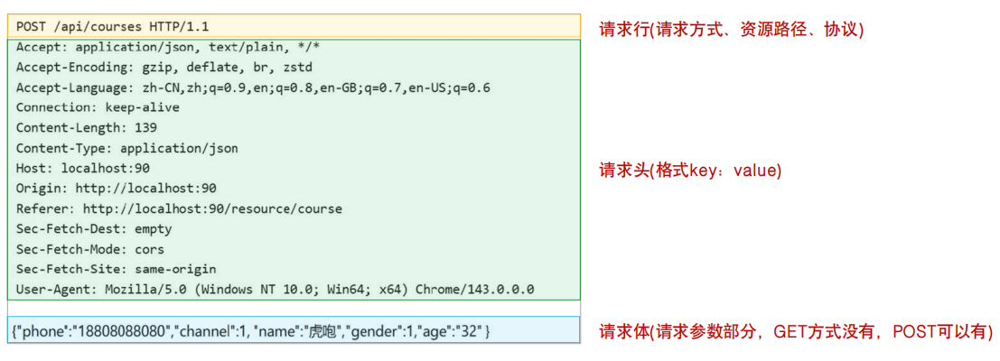

> **请求方式：**
>
> *  GET: 请求参数在请求行中，没有请求体。如：/api/courses?name=Python&status=1 。GET请求请求参数大小在浏览器中是有限制的。
> * POST: 请求参数在请求体中，POST请求大小是没有限制的。

#### **HTTP协议-响应数据格式**

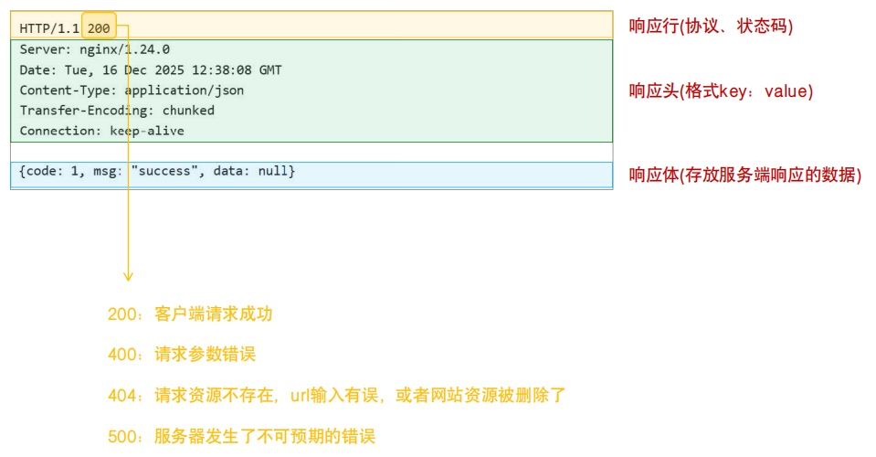


#### 小结

1. HTTP协议中请求及响应数据的数据格式？
   * 请求格式：请求行(请求方式、资源路径)、请求头(key:value)、请求体(post方式) 
   * 响应格式：响应行(状态码)、响应头(key:value)、响应体

### Apifox测试

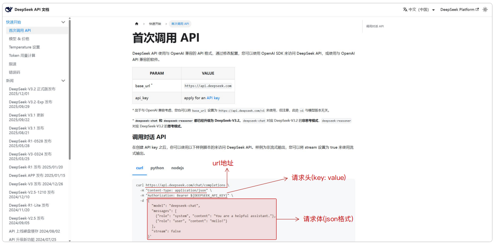


###  会话记忆-处理方案(会话历史滚雪球)

```json
{
  "messages": [
    {
      "role": "system",
      "content": "你是一名可爱的AI助手, 你的名字叫小甜甜, 请以亲切、可爱语气来回答用户的问题"
    },
    {
      "role": "user",
      "content": "12个苹果,3个人怎么均分"
    },
    {
      "role": "assistant",
      "content": "嘻嘻，12个苹果分给3个人，每个人可以分到 **4个苹果** 哦~ 算式是：12 ÷ 3 = 4"
    },
    {
      "role": "user",
      "content": "那2个人呢"
    },
    {
      "role": "assistant",
      "content": "哎呀，如果是2个人的话，每个人可以分到 **6个苹果** 呢~ 算式是：12 ÷ 2 = 6"
    },
    {
      "role": "user",
      "content": "那4个人呢"
    },
    {
      "role": "assistant",
      "content": "嘻嘻，4个人分的话，每个人可以拿到 **3个苹果** 哦~ 算式是：12 ÷ 4 = 3"
    }
  ]
}
```


### 代码调用测试

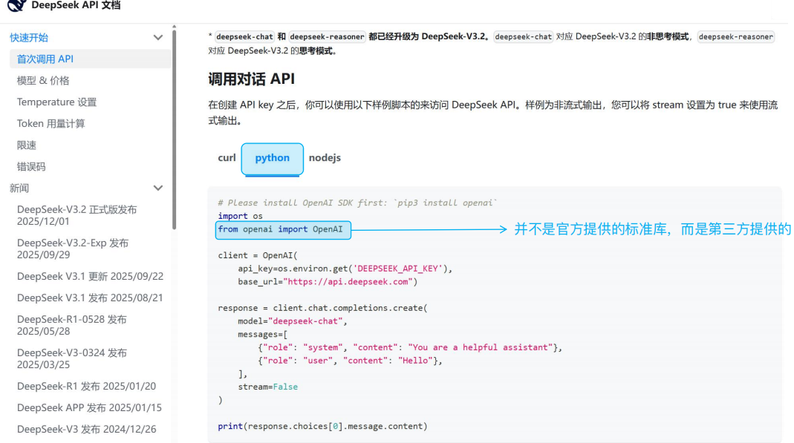

> **PyPI**：全程为 Python Package Index，是由Python官方和社区共同维护的Python第三方软件包的官方仓库 。
>
> **pip**：pip是Python官方提供的Python包的管理工具，提供了对Python包的查找、下载、安装、卸载等功能 。

#### 小结

- 如何安装第三方的软件包？
  - 安装软件包（最新版本）：`pip install openai`
  - 安装软件包（指定版本）：`pip install openai==2.13.0`
  - 卸载软件包：`pip uninstall openai`
  - 列出已安装的包：`pip list`
  - 查看包详情：`pip show openai`


### 提示词工程

* 提示词(Prompt)：是引导大模型(LLM)进行内容生成的命令（一句话、一个问题等）。
* 提示词工程(Prompt Engineering)：通过有技巧的编写提示词，使大模型生成出尽可能符合预期的内容，这一持续性的过程，就称为提示词工程。

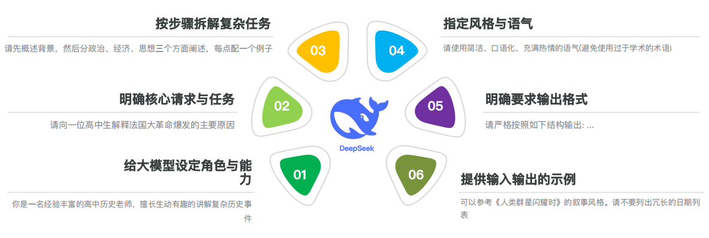

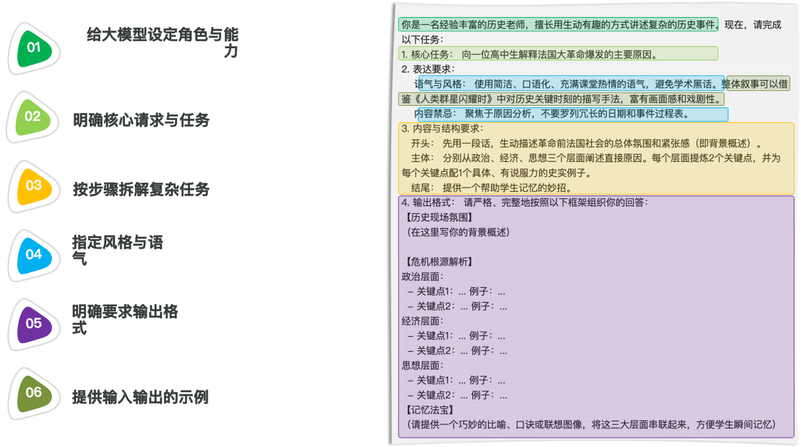

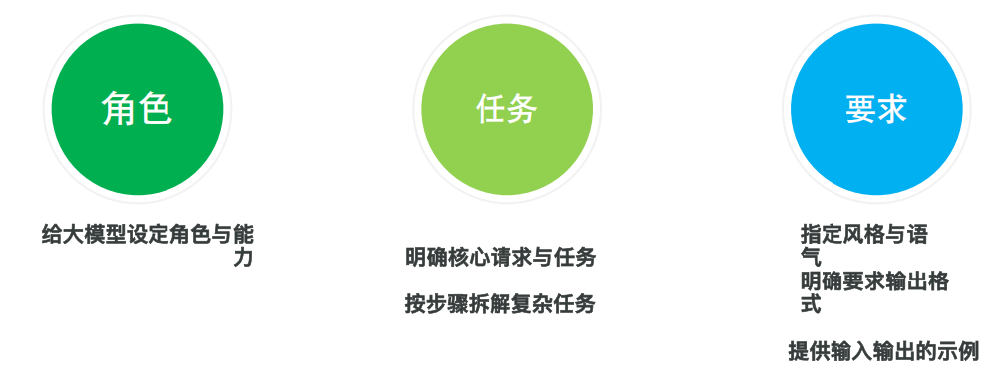

#### 小结

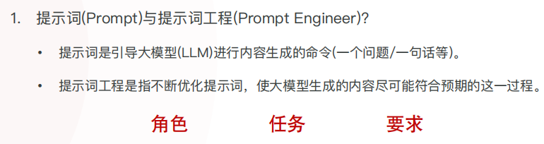


## AI应用--实战

###  Streamlit

#### 介绍

* Streamlit是一个开源的Python库，专为数据工程师及机器学习工程师设计，用来快速基于Python代码构建交互式的web网站（无需掌握前端技术）。
* 官方网站： https://streamlit.io

#### Streamlit入门程序

1. 安装 streamlit：`pip install streamlit`
2. 在 Python 文件中引入 streamlit 模块
3. 基于 streamlit 中提供的 API 来构建 Web 应用
4. 运行程序：`streamlit run xxxx.py`

~~~python
import streamlit as st
# 标题
st.title("AI智能伴侣")
# 段落
st.write("布偶猫是一种源于美国的大型长毛猫，以温顺耐人的“小狗猫”性格、湛蓝色的眼睛和松弛柔软的抱卷卷粉，拥有重点色、手套色和双色等经典图案，需要定期梳毛并注意遗传性心脏病等健康问题，是理想的家庭陪伴宠物。")
# 图片
st.image("cat.jpg")
# 分隔线
st.divider()
# 表格
data = {"姓名":["王林", "李慕婉", "贝罗", "莫厉海", "石萧", "红蝶", "十三"],
        "学号":["20230001", "20230002", "20230003", "20230004", "20230005", "20230006", "20230007"],
        "语文":[80, 90, 85, 70, 95, 90, 85],
        "数学":[87, 92, 87, 81, 92, 69, 83],
        "英语":[90, 85, 90, 95, 80, 85, 90],
        "总分":[257, 267, 262, 241, 267, 244, 258]}
st.table(data)
~~~


#### 小结

1. 什么是 Streamlit？
   - Streamlit 是一个用于快速基于 Python 代码构建 Web 网页的 Python 库（数据科学及机器学习领域）
2. Streamlit 的使用步骤？
   - 安装（`pip install streamlit`）
   - 基于 Streamlit 中的 API 构建页面
   - 运行（`streamlit run xxx.py`）

### AI智能伴侣 - 基本交互

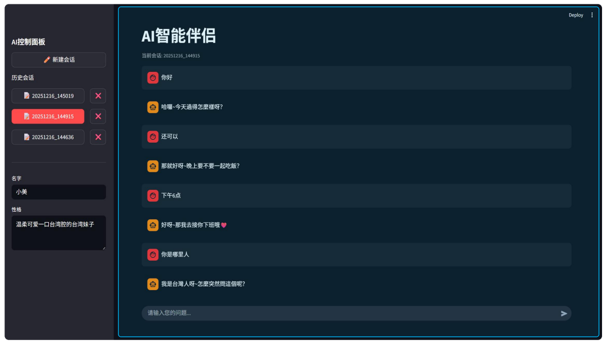

### AI智能伴侣 - 会话记忆

~~~python
{
  "messages": [
    {
      "role": "system",
      "content": "你是一名可爱的AI助手, 你的名字叫小甜甜, 请以亲切、可爱语气来回答用户的问题"
    },
    {
      "role": "user",
      "content": "12个苹果,3个人怎么均分"
    },
    {
      "role": "assistant",
      "content": "嘻嘻，12个苹果分给3个人，每个人可以分到 **4个苹果** 哦~ 算式是：12 ÷ 3 = 4"
    },
    {
      "role": "user",
      "content": "那2个人呢"
    },
    {
      "role": "assistant",
      "content": "哎呀，如果是2个人的话，每个人可以分到 **6个苹果** 呢~ 算式是：12 ÷ 2 = 6"
    },
    {
      "role": "user",
      "content": "那4个人呢"
    },
    {
      "role": "assistant",
      "content": "嘻嘻，4个人分的话，每个人可以拿到 **3个苹果** 哦~ 算式是：12 ÷ 4 = 3"
    }
  ]
}
~~~


### AI智能伴侣 - 侧边栏功能

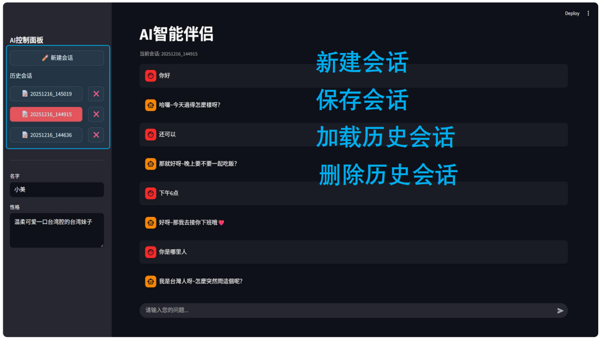

* 新建会话
* 保存会话
* 加载历史会话
* 删除历史会话

> **注意：**内存中存放的数据在计算机关机后就会消失，要永久保存数据，就需要将数据保存在文件中 。


## 文件操作

#### 入门

- 日常我们操作文件时，基本分为三步操作：打开、读/写、关闭。

- 如果操作文件过程中出现了异常，文件就无法关闭了，怎么解决？

  ~~~python
  # 1. 打开文件
  f = open("resources/静夜思.txt", "w", encoding="utf-8")
  # 2. 写入文件
  f.write("窗前明月光，\n")
  f.write("疑是地上霜。\n")
  f.write("举头望明月，\n")
  f.write("低头思故乡。\n")
  # 3. 关闭文件
  f.close()
  ~~~

  


 **读文件**

```python
# 1. 打开文件
f = open("resources/静夜思瀑布.txt", "r", encoding="utf-8")
# 2. 读取文件
content = f.read()
print(content)
# 3. 关闭文件
f.close()
```

**写文件**

```python
# 1. 打开文件
f = open("resources/静夜思.txt", "w", encoding="utf-8")
# 2. 写入文件
f.write("窗前明月光，\n")
f.write("疑是地上霜。\n")
f.write("举头望明月，\n")
f.write("低头思故乡。\n")
# 3. 关闭文件
f.close()
```

> **编码：**是将字符（文字、数字、符号）转换为计算机能够存储和处理的数字代码的规则系统，如：ASCII、GBK、UTF-8。
>
> **注意：**如果操作完文件，并未调用 `close` 方法关闭文件，同时程序没有停止运行，那么这个文件将一直被 Python 程序占用，无法操作。


##### 小结

1. 文件的操作（读/写）分为那几步？
   - 打开：`open()` 函数
   - 读/写：`read()` 方法、`write()` 方法
   - 关闭：`close()` 方法

> **思考：**如果操作文件过程中出现了异常，文件就无法关闭了，怎么解决？
>
> ~~~python
> # 1. 打开文件
> f = open("resources/静夜思.txt", "w", encoding="utf-8")
> # 2. 写入文件
> f.write("窗前明月光，\n")
> f.write("疑是地上霜。\n")
> f.write("举头望明月，\n")
> f.write("低头思故乡。\n")
> # 3. 关闭文件
> f.close()
> ~~~
>
> 


#### 文件操作--资源释放

- 资源释放方案：

  -  **繁琐**

    ~~~python
    # 1. 打开文件
    f = open("resources/静夜思.txt", "w", encoding="utf-8")
    try:
        # 2. 写入文件
        f.write("静夜思(李白)\n")
        f.write("窗前明月光，\n")
        f.write("疑是地上霜。\n")
        f.write("举头望明月，\n")
        f.write("低头思故乡。\n")
    finally:
        # 3. 关闭文件
        f.close()
    ~~~

  - **繁琐**

    ~~~python
    with open("resources/静夜思.txt", "w", encoding="utf-8") as f:
        f.write("静夜思(李白)\n")
        f.write("窗前明月光，\n")
        f.write("疑是地上霜。\n")
        f.write("举头望明月，\n")
        f.write("低头思故乡。\n")
    ~~~

    

> 提示：`with` 语句（上下文管理器）的核心作用就是确保资源的总是被正确获取和释放（即使发生异常，也会被正确释放），也是项目开发中的推荐方式。


##### 小结

1. 操作文件时，文件资源释放的最佳实践？

   - try...finally
   - with open()方法`（推荐，最佳实践）`


### 读取JSON格式文件

* JSON是软件开发中最常用的数据交换格式，而为了简化JSON数据的处理，在Python标准库中就提供了处理JSON数据的核心模块 json。

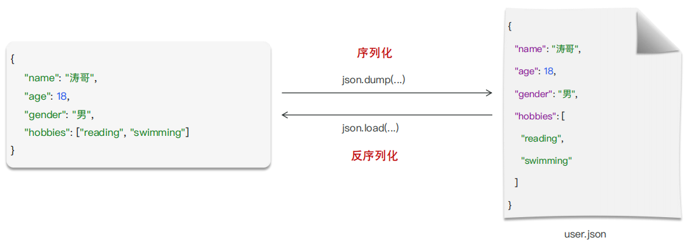

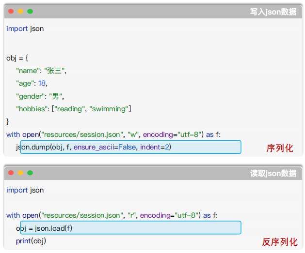


#### 小结

- json 模块中进行对象序列化及反序列化的方法？
  - `dump()`：将 Python 对象序列化为 JSON 格式字符串并写入文件
  - `load()`：从文件中读取 JSON 格式数据，并将其反序列化为 Python 对象


> `三元运算符的写法?`
>
> * 语法：<true_value> if 条件表达式 else <false_value>


### 知识扩展

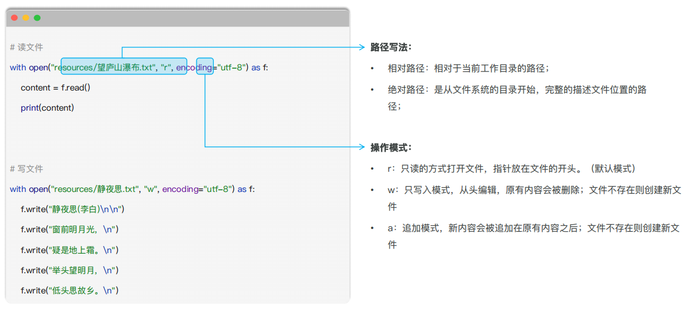

> **提示：**在项目开发中，推荐使用`相对路径`写法，可移植性更好、路径简洁、易于阅读 。

