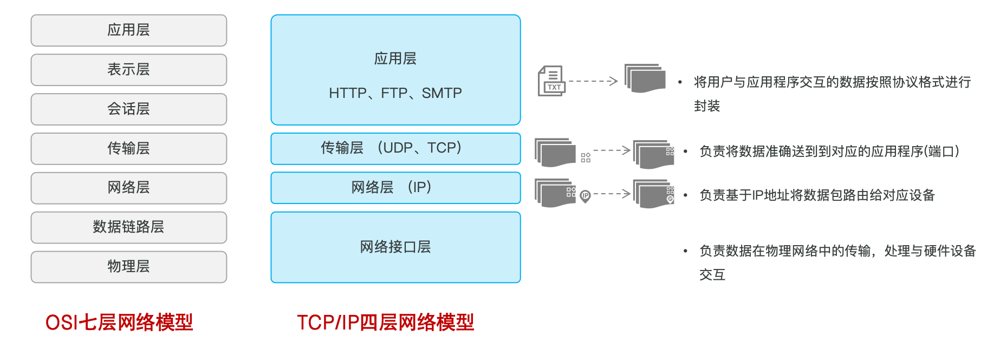

# Python 项目实战：AI 应用开发

> **学习目标：** 理解模型调用链路，使用 API、提示词、会话记忆和 Streamlit 构建聊天应用。

# AI应用开发

## 大模型调用

### 网络基础知识

* 网络，也就是我们通常所说的互联网（Internet），就是由无数个计算机网络设备连接起来形成的全球性的网络基础设施。
* IP
  * IP地址可以理解为就是设备在互联网中的地址(唯一身份证)，每一个连入网络的设备都有一个自己的IP地址，用来定位设备在互联网中的位置。
  * IPv4地址：32位二进制
  * IPv6地址：128位二进制
* 域名
  * 域名(Domain Name)，是由一串用点分隔的英文字母组成的。IP地址不便于记忆，因此设计出了域名，并通过DNS（域名解析服务器）来将域名和IP地址相互映射，便于记忆和访问。
* 端口
  * 端口号(Port)是整数，取值范围在0-65535，它是用来标识计算机设备中的运行中的程序。

> 注意：127.0.0.1 是一个非常特殊的IP地址，表示的是本机地址（也称为本地回环地址）。

> 注意：HTTP协议默认端口号为 80，HTTPS协议默认端口为 443 。

#### 小结

- 请描述 IP、域名、端口的作用是什么？
  - **IP**：唯一定位一台互联网上的设备（`127.0.0.1` 为本机地址）。
  - **域名**：降低 IP 地址的书写与记忆成本（`localhost` 为本机域名）。
  - **端口**：每一个程序启动运行后都会占用一个端口（`0-65535`）。


## 网络模型

互联网（Internet）连接了数以亿计的设备，网络四通八达就如同时城市的复杂的道路。网络中传输的数据就像是城市道路中的车流，如果不加以管理那必然会出现混乱。在国际ISO组织就统一了程序在`网络中通信的模型和标准`。包括：

* `OSI网络模型：`全球网络互连标准模型
* `TCP/IP网络模型：`可以认为是OSI的简化版



### HTTP协议

概念：`H`yper `T`ext `T`ransfer `P`rotocol，超文本传输协议，规定了客户端和服务器之间数据传输的规则。(只有在请求及响应中都遵循了统一的规则，服务端才能读懂客户端发送来的请求，客户端才能解析服务端响应的结果)


**特点：**

1. **基于文本的协议**：请求和响应的部分的协议内容为文本格式，底层通过 TCP 协议传输，稳定性强。
2. **基于请求-响应模型**：一次请求对应一次响应，必须由客户端先发起请求，服务端才会返回响应。
3. **无状态**：服务端不会记忆与客户端的历史交互信息，每次请求-响应都是独立的。


#### 小结

1. TCP/IP 四层网络模型？
   - 应用层、传输层、网络层、网络接口层
2. 什么是 HTTP 协议？有什么特点？
   - 超文本传输协议，规定了客户端与服务端数据传输的规则。
   - 基于文本的协议、基于请求响应模型、无状态。

### Apifox测试

### 代码调用测试


## 模型与调用链路

大语言模型提供理解和生成能力；AI 应用把能力落地到具体场景。典型路径是：用户界面 -> 应用逻辑 -> 模型 API -> 响应展示 -> 会话持久化。模型可本地部署（如 Ollama），也可调用云端 API；前者数据可控但依赖算力，后者接入快但需关注网络和成本。

HTTP 请求由方法、URL、请求头和请求体组成，响应包含状态码与响应体；模型 API 常用 JSON 传递 `model`、`messages`、`stream` 等字段。

```python
from openai import OpenAI
import os
client = OpenAI(api_key=os.environ["DEEPSEEK_API_KEY"], base_url="https://api.deepseek.com")
```

> **重点：** API Key 必须只从环境变量或密钥服务读取，绝不能写进代码、日志或仓库。对网络错误、限流和空响应都要有处理。

## 提示词与会话记忆

`messages` 通常由 `system`、`user`、`assistant` 角色构成。系统提示词定义边界与格式，历史消息提供上下文。提示词要明确目标、上下文、约束和期望输出。

> **重点：** 会话历史会不断增长，应限制轮次或 Token 并摘要旧消息；模型输出是不可信输入，不能直接执行为代码或数据库命令。

## Streamlit 与持久化

Streamlit 可快速构建交互界面：`st.chat_input` 接收消息，`st.chat_message` 展示对话，`st.session_state` 保存当前会话。侧边栏可提供新建、切换、删除会话。

```python
if "messages" not in st.session_state:
    st.session_state.messages = []
prompt = st.chat_input("请输入问题")
```

会话可用 JSON 持久化，文件操作使用 `with open(..., encoding="utf-8")` 自动关闭文件，并通过 `json.dump`、`json.load` 写入和读取。实现时应处理空输入、流式中断、损坏 JSON 和上下文超限。


