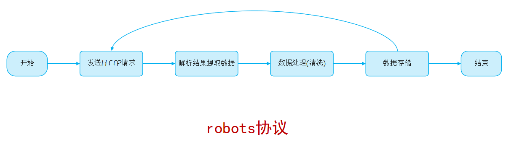
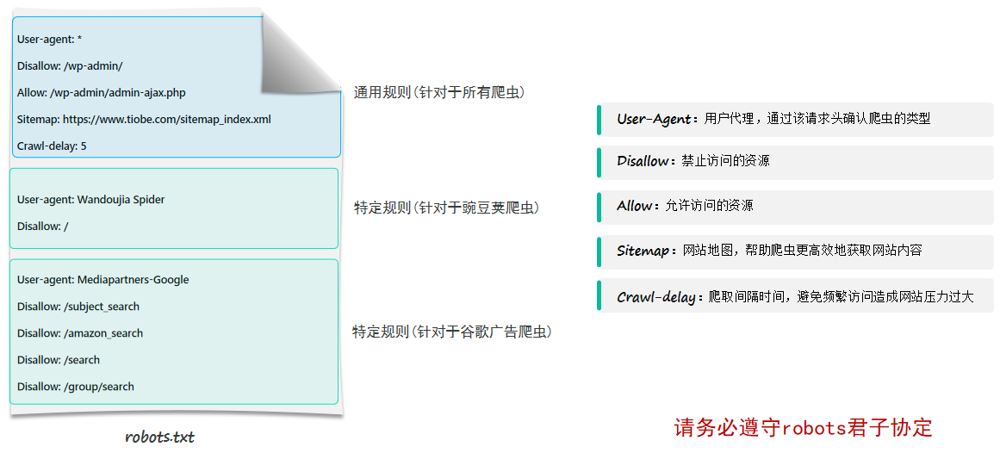

# 爬虫

`爬虫`：也称为`网络爬虫(网络机器人)`，是一种按照一定的预设规则，自动浏览并抓取网络数据的程序或脚本。

# 网络机器人

## 入门

### 概述

`网络机器人`：也称为`网络爬虫`，是一种按照一定的预设规则，自动浏览并抓取网络数据的程序或脚本。

> **数据清洗：**是指对采集到的原始数据进行处理、 修正、转换和标准化的过程，目的是让数据变得规范、准确 。

### 合规性(robots协议)

* robots协议也称为爬虫协议、爬虫规则，是指网站根目录下存放的一份文本文件robots.txt，用于告诉爬虫哪些页面可以抓取，哪些页面不能抓取。（君子协议）

#### 小结

*robots.txt* 君子协定的数据获取规则

- *User-Agent*：用户代理，通过该请求头的标识，确认爬虫的身份
- *Disallow*：不允许访问的资源
- *Allow*：允许访问的资源
- *Sitemap*：网站地图
- *Crawl-delay*：访问的间隔时间

### 入门程序

**需求：**

* 获取TIOBE编程语言排行榜单

**步骤**

1. 查看 TIOBE 网站的 `robots.txt` 文件，明确资源获取的规则

2. 安装 `requests` 库，用于发送网络请求（`pip install requests`）

3. 编写 Python 代码，访问 TIOBE 网站，获取数据

~~~python
import requests
from lxml import html

# 定义url
target_url = "https://www.tiobe.com/tiobe-index/"

# 发送请求, 获取数据
response = requests.get(target_url)

# 输出数据到控制台
#print(response.text)
document = html.fromstring(response.text)

# 解析数据
# 解析表头
# th_list = document.xpath("//table[@id='top20']/thead/tr/th/text()")
# th_list = document.xpath("/html/body/section/div/article/table[1]/thead/tr/th/text()")
th_list = document.xpath("//*[@id='top20']/thead/tr/th/text()")
print(th_list)

# 解析表格中的数据
tr_list = document.xpath("//table[@id='top20']/tbody/tr")
for tr in tr_list:
    td_list = tr.xpath("./td/text()")
    print(td_list)
~~~

#### 小结

**Requests 库的作用是什么？**

- Requests 库是 Python 中最流行、最优雅的 HTTP 客户端库，让 Python 代码发送 HTTP 请求变得极其简单。

### 网页结构

* 一个网页是由三个部分组成的，分别是：HTML、CSS、JS（JavaScript）。

  - HTML：超文本标记语言，由一堆预设的标签（`<h1>一级标题</h1>`）构成。HTML 负责网页的结构（页面元素和内容）

  - CSS：层叠样式表。CSS 负责网页的表现（页面元素的外观、位置等样式，如颜色、大小等）

  - JS：全称为 JavaScript，简称 JS。负责网页的行为（交互效果）

* HTML（HyperText Markup Language）：超文本标记语言。

  - 超文本：超越了文本的限制，比普通文本更强大。除了文字信息，还可以定义图片、音频、视频等内容。
  - 标记语言：由标签 "<标签名>"构成的语言。
    - HTML 标签都是预定义好的。例如：使用 `<h1>` 展示标题，使用 `` 展示图片，使用 `<video>` 展示视频。
    - HTML 代码直接在浏览器中运行，HTML 标签由浏览器解析。

#### 小结

- 网页是由哪儿部分组成的？
  - HTML：负责网页的结构（内容）
  - CSS：负责网页的样式（美化页面）
  - JS：负责网页的动作（行为）

### 网页解析

### 入门

* 网页解析指的是从原始HTML文档中提取数据的过程，也是网络爬虫的关键步骤，从一堆标签文本中提取出需要的数据。
* lxml：是一个高性能的HTML/XML文档的解析库，支持基于Xpath语法来解析和获取网页数据。
* 安装：pip install lxml

~~~python
from lxml import html

# 加载html文件
with open("resources/仙逆人物志.html", "r", encoding="utf-8") as f:
    html_content = f.read()

# 解析网页内容
doc = html.fromstring(html_content)

th_list = doc.xpath("//table/thead/tr[1]/th/text()")
print(th_list)

td_list = doc.xpath("//table/tbody/tr[1]/td/text()")
print(td_list)
~~~

> `Xpath：`是一种用于在HTML/XML文档中导航或定位元素的查询语言，让你能够准确的定位文档中的特定元素、属性或文本 。

### xpath语法

* Xpath：一种在HTML/XML文档中导航或定位元素的查询语言，让你能够准确的定位文档中的特定元素、属性

| 表达式            | 描述                         | 样例                |
| ----------------- | ---------------------------- | ------------------- |
| `/`               | 从根节点的直接子元素         | `/html/body/div/h1` |
| `//`              | 从任意位置选择节点           | `//h1`              |
| `.`               | 当前节点下查找               | `./a` 与 `.//a`     |
| `[n]`             | 选择第 n 个元素              | `//p[2]`            |
| `[last()]`        | 选择最后一个元素             | `//p[last()]`       |
| `[@attr]`         | 选择有该属性的元素           | `//p[@color]`       |
| `[@attr='value']` | 选择该属性值等于指定值的元素 | `//p[@color='red']` |
| `*`               | 匹配任何元素节点             | `//body/div/*`      |
| `@*`              | 匹配元素的任何属性           | `//body/div/a/@*`   |
| `text()`          | 获取文本内容                 | `//div/p/text()`    |

## 正则表达式

* `正则表达式`（`R`egular `E`xpression）是一种用特定语法规则组成的字符串模式，用来描述、匹配或替换文本中符合某种规则的字符序列，可以理解为是专门用于文本处理的“高级查找和匹配公式。

~~~python
import re

s = "我的手机号是18809091231你记住了吗？我的另一个手机号是18800001266，QQ号是1779989922你记住了吗？"

result = re.match(r"1[3-9]\d{9}", s)  # match - 从字符串的开头开始匹配（返回 Match 对象）
print(result.group())

result = re.search(r"1[3-9]\d{9}", s)  # search - 从任意位置开始，搜索第一个匹配项（返回 Match 对象）
print(result.group())

result = re.findall(r"1[3-9]\d{9}", s)  # findall - 从任意位置开始，搜索所有匹配项（返回 Match 对象 list）
print(result)
~~~

**小结**

* 什么是正则表达式，有什么用？
  - 定义的是字符串的组成规则，根据规则匹配或替换文本中符合这个规则的字符串。
* 字符串前的 r 标识什么意思？
  - `r` 表示原始字符串（raw string），字符串中的反斜杠 `\` 不会被 Python 当作转义字符处理，常用于编写正则表达式。
  - 例如：`r"\d"` 表示匹配数字；普通字符串 `"\d"` 虽通常也能使用，但可能产生转义警告。
* re 模块提供的如下三个函数的作用与区别？
  - `match("正则表达式", "文本字符串")`：从字符串**开头**开始匹配；开头不符合规则则返回 `None`，匹配成功返回 `Match` 对象。
  - `search("正则表达式", "文本字符串")`：从字符串**任意位置**查找第一个符合规则的内容；找到返回 `Match` 对象，未找到返回 `None`。
  - `findall("正则表达式", "文本字符串")`：从字符串中查找**所有**符合规则的内容；返回包含所有匹配结果的列表，未找到时返回空列表 `[]`。

`语法：`

* 正则表达式的写法多种多样，具体的语法如下：

| 表达式   | 描述                                         |
| -------- | -------------------------------------------- |
| 普通字符 | 字母、数字、汉字及大多数数字符，直接匹配自身 |
| .        | 匹配任意一个字符（除 \n）                    |
| \d       | 匹配数字 0-9                                 |
| \D       | 匹配非数字                                   |
| \w       | 匹配单词字符，即 a-z、A-Z、0-9、_            |
| \W       | 匹配非单词字符                               |
| \s       | 匹配空白字符，即空格、\t                     |
| \S       | 匹配非空白字符                               |

| 表达式 | 描述                             |
| ------ | -------------------------------- |
| *      | 出现任意次（0 次或无数次）       |
| +      | 至少出现 1 次（1 次或无数次）    |
| ?      | 至多出现一次（0 次或 1 次）      |
| {m}    | 出现 m 次                        |
| {m,}   | 至少出现 m 次                    |
| {m,n}  | 出现 m 到 n 次                   |
| \|     | 或的意思，匹配左右任意一个表达式 |
| ()     | 将括号中的字符作为一个分组       |
| ^      | 匹配字符串开头                   |
| $      | 匹配字符串结尾                   |

## 案例

