# 数据分析

## 介绍

**数据分析：**从一堆看似杂乱的数据中，通过数据清洗、分析、可视化等手段，找出有价值的信息和结论，从而帮我们解决实际的问题（如：用户订单数据的分析、电影榜单数据分析、学校学生成绩分析等）。

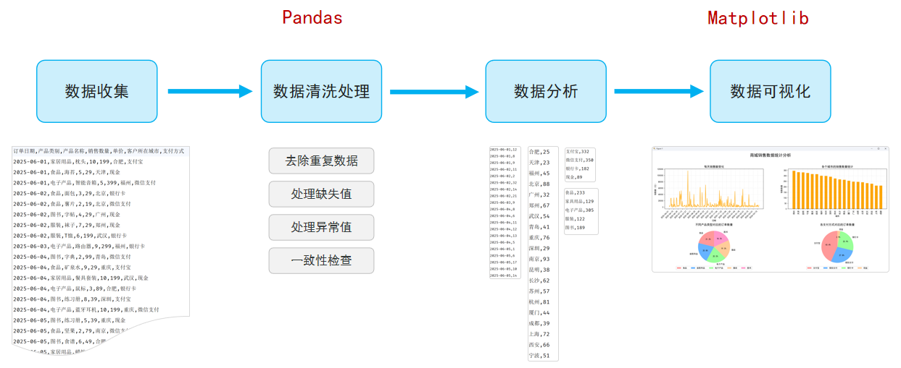


## 环境准备

### Jupyter Notebook

* `Jupyter Notebook`是一个基于Web网页的、交互式的编程笔记本，让你可以把代码、运行结果、图表和笔记全部都放在一个文件里（在数据分析、机器学习、教学和科研等领域的数据实验室）


## Pandas基础

### Pandas介绍

Pandas 是一个功能强大的结构化数据分析的工具集，底层是基于 Numpy 构建的，无论是在数据分析领域、还是大数据开发场景中都有显著的优势。

- 官网：[https://pandas.pydata.org](https://pandas.pydata.org/)
- 核心：`DataFrame`（类似表格）、`Series`（类似表格中的一列）


### Pandas初体验

- 需求：基于 Pandas 统计班级学员的各科成绩的最高分、最低分、平均分。
- 准备：`npm install pandas==2.3.3`

~~~python
import pandas as pd

df1 = pd.DataFrame([
    {'姓名': '张三', '语文': 85, '数学': 92, '英语': 78},
    {'姓名': '李四', '语文': 78, '数学': 88, '英语': 95},
    {'姓名': '王五', '语文': 92, '数学': 96, '英语': 89},
    {'姓名': '赵六', '语文': 85, '数学': 90, '英语': 90},
    {'姓名': '孙七', '语文': 72, '数学': 59, '英语': 66},
    {'姓名': '周八', '语文': 80, '数学': 76, '英语': 68},
    {'姓名': '吴九', '语文': 85, '数学': 85, '英语': 55},
    {'姓名': '郑十', '语文': 57, '数学': 68, '英语': 49},
])

print(f"最高分: {df1['语文'].max()}, 最低分: {df1['语文'].min()}, 平均分: {df1['语文'].mean()}")
print(f"最高分: {df1['数学'].max()}, 最低分: {df1['数学'].min()}, 平均分: {df1['数学'].mean()}")
print(f"最高分: {df1['英语'].max()}, 最低分: {df1['英语'].min()}, 平均分: {df1['英语'].mean()}")
~~~

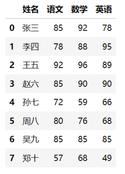


#### DataFrame

构建 `DataFrame` 的方式有很多，主要方式如下：

```python
df1 = pd.DataFrame([
    {'姓名': '张三', '语文': 85, '数学': 92, '英语': 78},
    {'姓名': '李四', '语文': 78, '数学': 88, '英语': 95},
    {'姓名': '王五', '语文': 92, '数学': 96, '英语': 89}
])
df2 = pd.DataFrame({
    '姓名': ['张三', '李四', '王五'],
    '语文': [85, 78, 92],
    '数学': [92, 88, 96],
    '英语': [78, 95, 89]
})
df3 = pd.DataFrame([
    ('张三', 85, 92, 78),
    ('李四', 78, 88, 95),
    ('王五', 92, 96, 89)
], columns=['姓名', '语文', '数学', '英语'])
df4 = pd.DataFrame([
    ['张三', 85, 92, 78],
    ['李四', 78, 88, 95],
    ['王五', 92, 96, 89]
], columns=['姓名', '语文', '数学', '英语'], index=['a', 'b', 'c'])
```

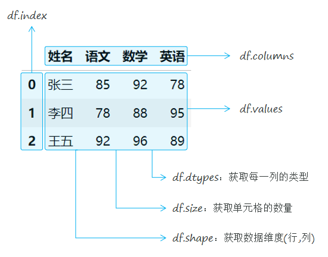

#### Series

构建 `Series` 的方式有很多，主要方式如下：

```python
s = pd.Series([10, 20, 30, 40, 50])
s = pd.Series([10, 20, 30, 40, 50], index=['a', 'b', 'c', 'd', 'e'])
s = pd.Series({'a': 10, 'b': 20, 'c': 30, 'd': 40, 'e': 50})
s = df1['语文']
s = df1['数学']
```

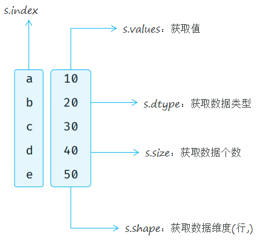

#### 小结

**什么是 DataFrame，什么是 Series？**

- DataFrame 是一个表格型的数据结构，就像一张 Excel 表格，有行有列；
- Series 是一列数据，就像 DataFrame 中的单独一列；


`DataFrame`、`Series` 中的常见属性的作用？

- `xx.index`：获取索引
- `xx.values`：获取值
- `xx.dtype`：获取数据类型
- `xx.size`：获取数据个数
- `xx.shape`：获取数据维度（行，列）
- `xx.columns`：获取列名（`DataFrame` 特有属性）


### 数据读取与写入

基于Pandas中提供的API，可以很方便的各类数据文件（csv、Excel、数据库、网络数据等）的读取和写入。

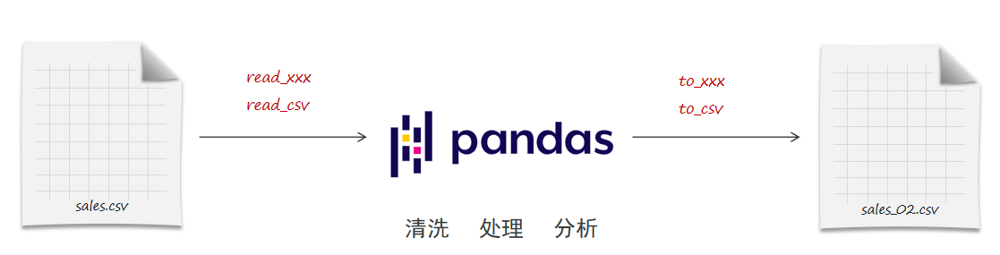

~~~python
import pandas as pd

df = pd.read_csv(
    '../data/sales.csv',
    usecols=['订单日期', '产品类别', '销售数量', '单价', '客户所在城市', '支付方式']
)

df['销售额'] = df['销售数量'] * df['单价']

df.head(20).to_csv('../data/sales_02.csv', index=False)
~~~


#### 小结

**读取数据和写入数据分别调用什么方法？**

- `read_xxx`，比如：`read_csv`、`read_excel`
- `to_xxx`，比如：`to_csv`、`to_excel`


### 数据查看、选择、过滤

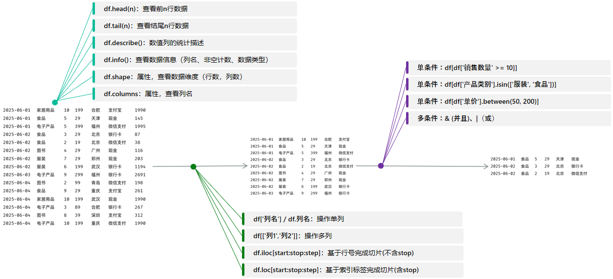

#### 小结

1. 数据的查看与选择？
   - 查看：`head()`、`tail()`、`describe()`、`info()`
   - 选择列：`df['列名']` / `df[['列名1', '列名2']]`
   - 选择行：`df.iloc[start:stop:step]` / `df.loc[start:stop:step]`
2. 数据的过滤操作？
   - 语法：`df[条件表达式]`
   - 示例：`df[df['单价'] >= 100]` / `df[df['类别'].isin(['...', '...'])]`

### 数据清洗

`数据清洗`是指发现并纠正数据中可识别的错误的过程，包括处理缺失值、重复值、异常值，统一数据格式，保证数据的一致性。

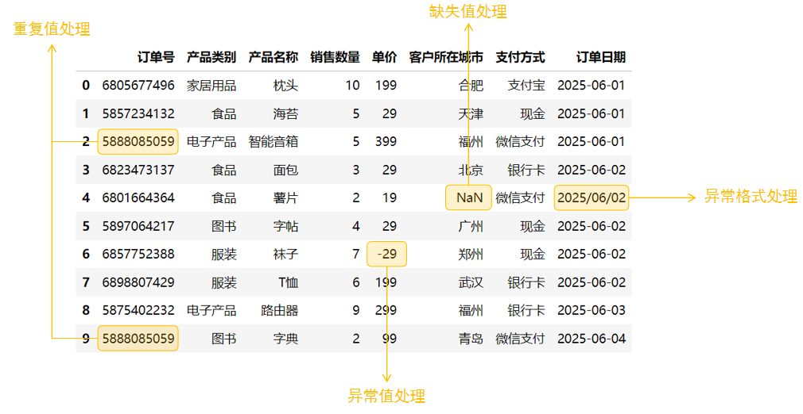

#### 小结


**请说出如下数据清洗方法的含义及作用？**

- ```python
  isnull()
  ```

  - 检测缺失值。
  - 返回与原数据形状一致的布尔结果：缺失值为 `True`，非缺失值为 `False`。

- ```python
  dropna()
  ```

  - 删除包含缺失值的行或列。
  - 默认删除含任意缺失值的行，常用于直接移除不完整数据。

- ```python
  fillna()
  ```

  - 填充缺失值。
  - 可使用固定值、均值、中位数、众数等填充，例如：`df['年龄'].fillna(df['年龄'].mean())`。

- ```python
  ffill()
  ```

  - 前向填充缺失值。
  - 用缺失值前面最近的非缺失值进行填充，适用于按时间顺序排列的数据。

- ```python
  bfill()
  ```

  - 后向填充缺失值。
  - 用缺失值后面最近的非缺失值进行填充。

- ```python
  duplicated()
  ```

  - 检测重复数据。
  - 返回布尔结果：重复记录为 `True`，默认将第一次出现的记录保留为 `False`。

- ```python
  drop_duplicates()
  ```

  - 删除重复数据。
  - 默认保留每组重复记录中的第一条，可通过 `subset` 指定按哪些列判断重复。

- ```python
  df['xx'] = df['xx'].abs()
  ```

  - 对 `xx` 列中的数值取绝对值。
  - 将负数转换为正数，常用于清洗本应为非负数但因录入错误出现负值的数据。

- ```python
  df['xxx'].str.replace('/', '-')
  ```

  - 将 `xxx` 列字符串中的 `/` 替换为 `-`。
  - 常用于统一日期、编号或文本字段的格式，例如将 `2026/08/04` 统一为 `2026-08-04`。


### 数据排序与分组

#### 数组排序

* 在进行数据排序时，有两种排序方式，分别是：升序和降序。而基于Pandas进行数据排序时，是可以按照多个列进行排序的。

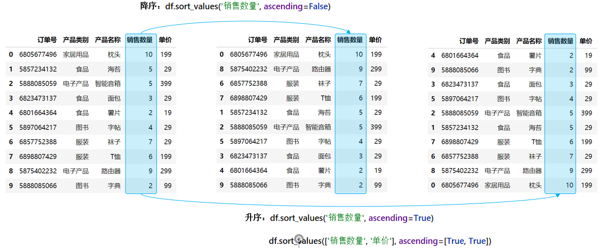

> **多列排序：**进行多个列排序时，会先按照第一列进行排序，第一列的值相同时，才会按照第二列进行排序。


##### 小结

1. 请说出如下排序操作的含义？

- ```python
  df.sort_values('销售数量', ascending=False)
  ```

  - 按照 `销售数量` 列进行降序排序。
  - `ascending=False` 表示从大到小排列。

- ```python
  df.sort_values(['销售数量', '订单日期'], ascending=[True, False])
  ```

  - 先按照 `销售数量` 列进行升序排序。
  - 当多条记录的销售数量相同时，再按照 `订单日期` 列进行降序排序。
  - `ascending=[True, False]` 与两个排序列一一对应：`销售数量` 升序，`订单日期` 降序。

- ```python
  df.sort_values(['销售数量', '订单日期'], ascending=False)
  ```

  - 按照多个字段排序，先按 `销售数量` 降序，再按 `订单日期` 降序。
  - 单个 `ascending=False` 会应用到所有指定的排序列。

#### 分组

分组操作就是把数据按照某个特征分成不同的组，然后对每个组分别进行统计计算。

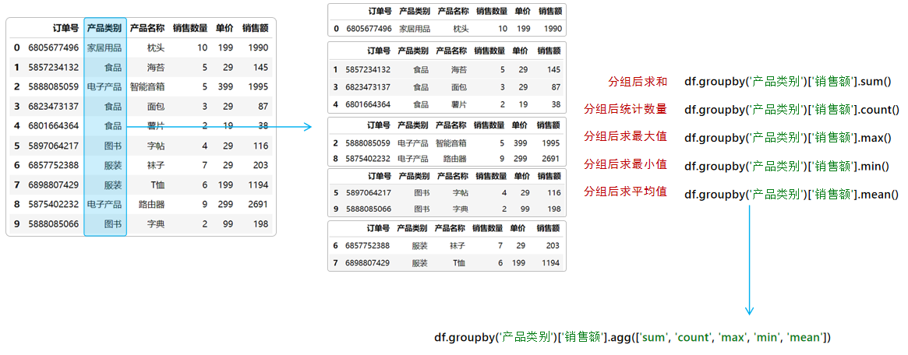

##### 小结

1. 请描述如下常见的分组后聚合操作的含义？

- ```
  df.groupby('产品类别')['销售额'].sum()
  ```

  - 按照 `产品类别` 分组，计算每个产品类别的销售额总和。
  - 可用于统计各类别的总销售额。

- ```
  df.groupby('产品类别')['销售额'].max()
  ```

  - 按照 `产品类别` 分组，计算每个产品类别中最高的销售额。
  - 可用于找出各类别单笔销售额的最大值。

- ```
  df.groupby('产品类别')['销售额'].min()
  ```

  - 按照 `产品类别` 分组，计算每个产品类别中最低的销售额。
  - 可用于找出各类别单笔销售额的最小值。

- ```
  df.groupby('产品类别')['销售额'].count()
  ```

  - 按照 `产品类别` 分组，统计每个产品类别中 `销售额` 列的非缺失值数量。
  - 通常可理解为各产品类别的销售记录数；但若 `销售额` 存在缺失值，则不会被计入。

- ```
  df.groupby('产品类别')['销售额'].mean()
  ```

  - 按照 `产品类别` 分组，计算每个产品类别的平均销售额。
  - 缺失值默认不会参与平均值计算。

- ```
  df.groupby('产品类别')['销售额'].agg(['sum', 'max', 'min'])
  ```

  - 按照 `产品类别` 分组，同时对 `销售额` 计算总和、最大值和最小值。
  - 返回每个类别对应的多项聚合统计结果。

- ```
  df.groupby('产品类别').agg({'销售数量': 'sum', '销售金额': 'sum', '单价': 'mean'})
  ```

  - 按照 `产品类别` 分组，并对不同列执行不同的聚合操作。
  - 计算每个产品类别的销售数量总和、销售金额总和，以及单价平均值。

## Matplotlib基础

### Matplotlib初识

#### 介绍

* Matplotlib是一个功能强大的数据可视化开源Python库，也是Python中使用的最多的图形绘图库，可以创建静态、动态、交互式的图表。
*  官网：[https://matplotlib.org](https://matplotlib.org/)
*  安装：pip install matplotlib

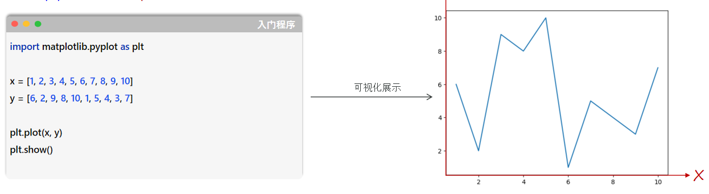

> **注意：**X轴的数据数量与Y轴中的数据数量要一致 。

#### Matplotlib图表详解

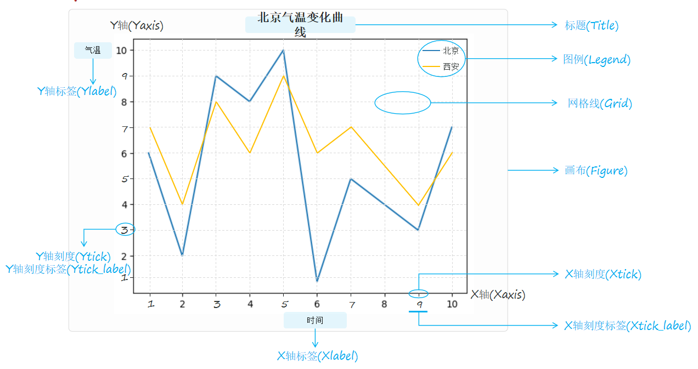

##### 小结

**如何基于Matplotlib绘制折线图 ？**

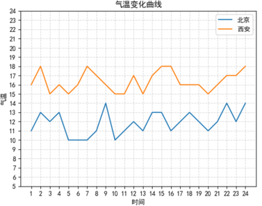

~~~python
# 解决中文显示问题
plt.rcParams['font.sans-serif'] = ['SimHei']
x = range(1, 25)
y_beijing = [random.randint(10, 15) for i in range(len(x))]
y_xa = [random.randint(15, 19) for i in range(len(x))]
plt.plot(x, y_beijing, label='北京')  # 折线图 添加北京数据
plt.plot(x, y_xa, label='西安')  # 折线图 添加西安数据
plt.title('气温变化曲线')  # 添加标题
plt.xlabel('时间')  # 添加X轴标签
plt.ylabel('气温')  # 添加Y轴标签
plt.grid(True, linestyle='--', alpha=0.5)  # 添加网格
plt.legend(loc='upper right')  # 添加图例
plt.xticks(x[::3])  # 设置X轴刻度
plt.yticks(range(5, 25))  # 设置Y轴刻度从0开始，步长为2
plt.show()  # 显示图表
~~~


### 核心图表实战

#### 创建子图

* 为了能同时展示多个图表，便于图表之间数据的直观对比和分析，更高效、更专业地组织和呈现复杂的可视化信息，通常会在一个画布上创建多个子图 。

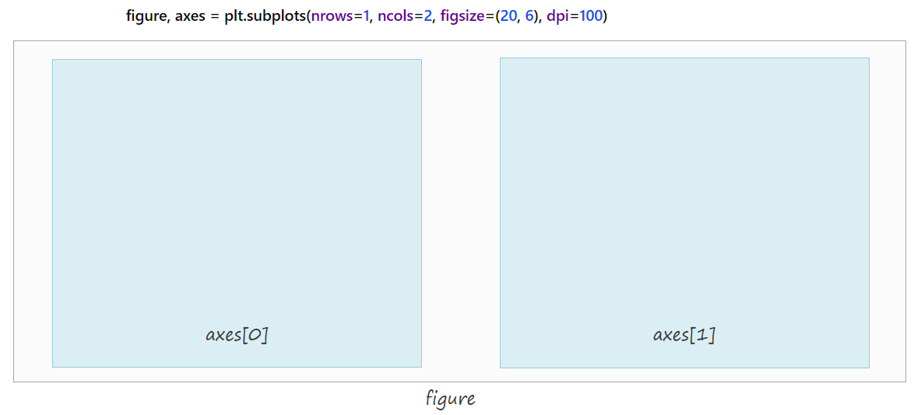

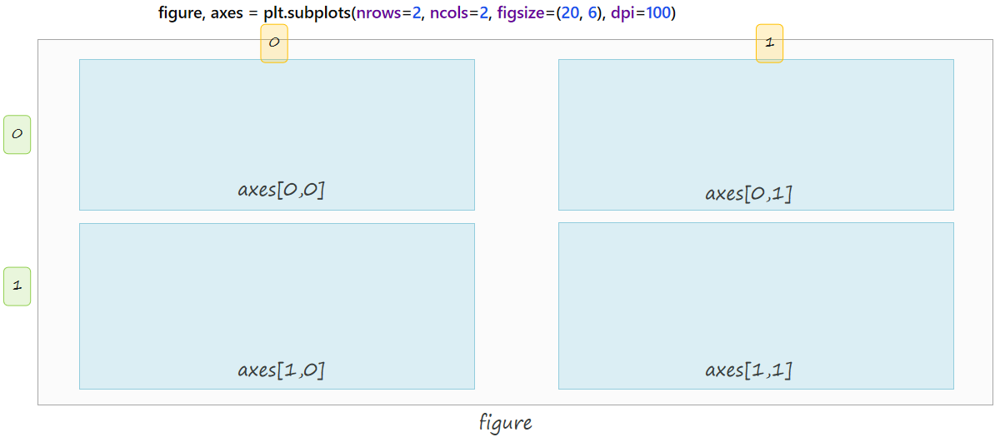

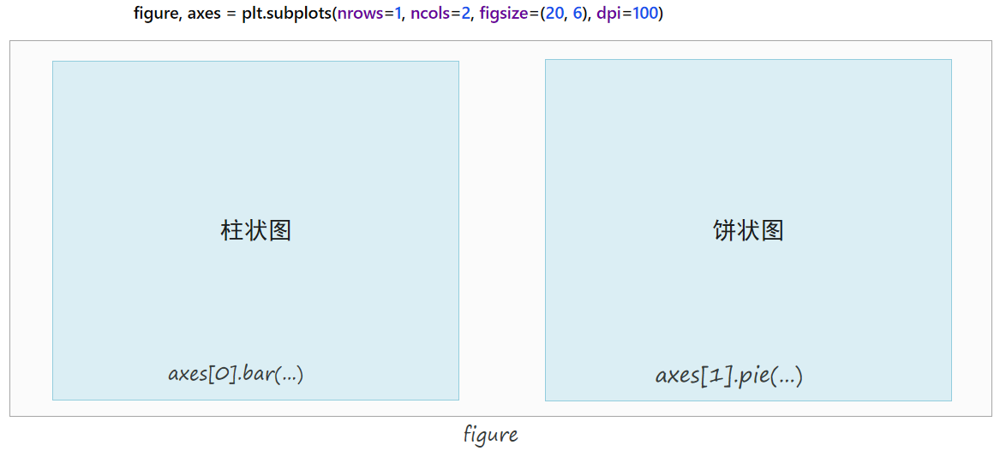

#### 小结

1. 如何在画布中创建子图？

   ~~~python
   figure, axes = plt.subplots(nrows=1, ncols=2, figsize=(20, 6), dpi=100)
   ~~~

2. 如何绘制折线图、柱状图、饼状图？

   - 折线图：`plot(...)`，适合展示趋势变化。

   - 柱状图：`bar(...)`，适合展示数量对比。

   - 饼状图：`pie(...)`，适合展示比例构成。

## 数据分析案例

