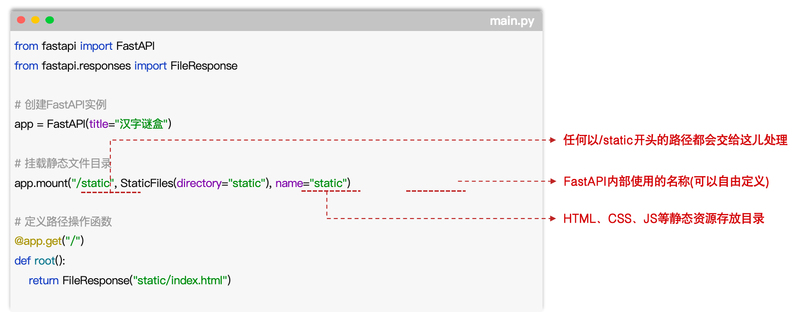
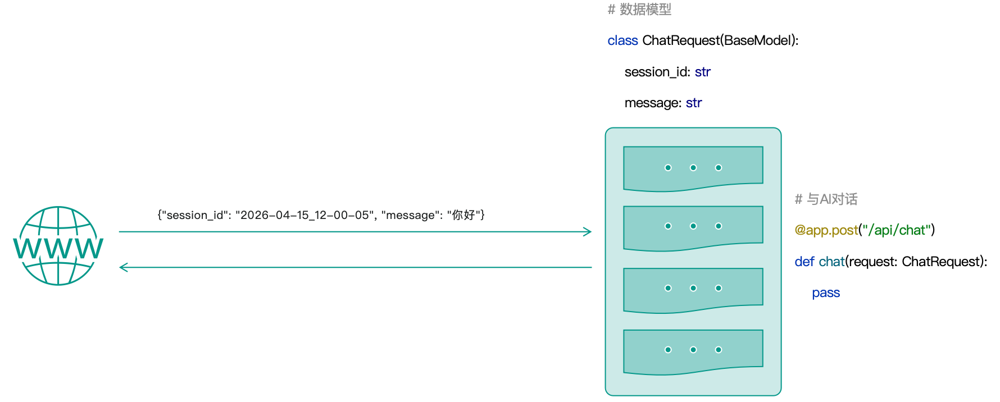
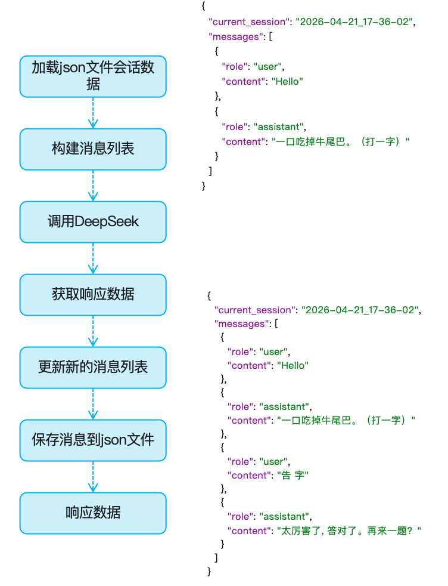
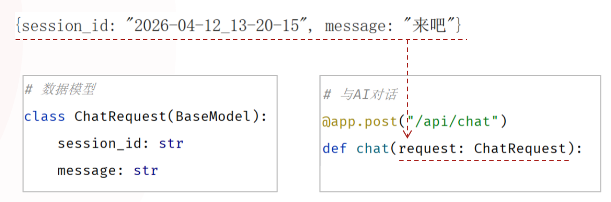
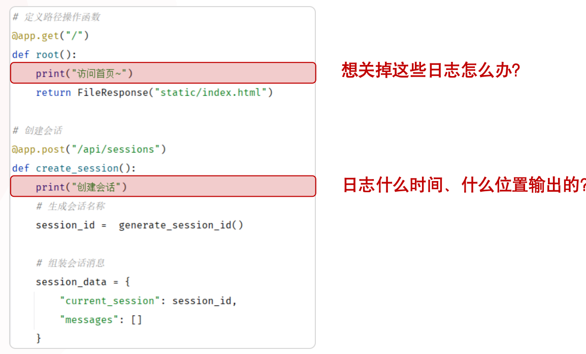
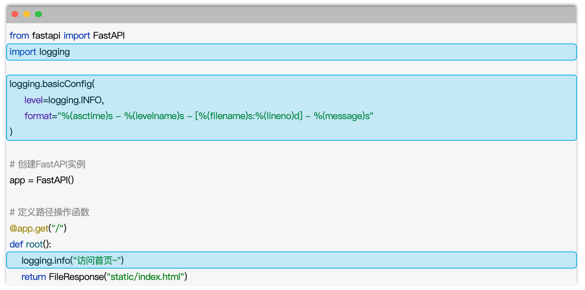

# Web开发

## 面向对象高级

~~~python
"""
封装: 将数据(属性)和操作数据的方法绑定在一起, 形成一个独立的单元(类), 保护数据不被外部访问，通过访问修饰符实现封装。
     1. 私有属性: 在属性名前加双下划线__
     2. 私有方法: 在方法名前加双下划线__
注意事项: Python中是没有真正的私有机制 ;
"""
class Car:
    def __init__(self, brand, model, color, owner):
        self.brand = brand          # 品牌(公有属性)
        self.model = model          # 型号(公有属性)
        self.color = color          # 颜色(公有属性)

        self.__owner = owner          # 拥有者(私有属性)

    def start(self): # 启动
        print(f'{self.brand} {self.model} 正在启动...')

    def run(self): # 行驶
        print(f'{self.__owner} : {self.brand} {self.model} 正在行驶...')
        self.__control_fuel()

    def stop(self): # 停止
        print(f'{self.brand} {self.model} 停止行驶...')

    def __control_fuel(self): # 私有方法
        print(f'{self.brand} {self.model} 正在控制油门...')

    def get_owner(self):
        return self.__owner[0:1] + "**"


if __name__ == '__main__':
    car = Car('Audi', 'A6', '黑色', '涛哥')
    print(car.brand)
    # print(car.model)
    # print(car.color)

    # Python中是没有真正的私有机制 ;
    # print(car._Car__owner)
    # car._Car__control_fuel()

    # car.start()
    # car.run()
    # car.stop()
    # print(car.get_owner())
~~~

>**【if __name__ == '__main__':】 这个代码是什么意思？**
>
>
>
>`if __name__ == '__main__':` 的意思是：
>
>**只有当这个 Python 文件被直接运行时，下面缩进的代码才会执行。**
>
>在该文件的第 32 行：
>
>```python
>if __name__ == '__main__':
>    car = Car('Audi', 'A6', '黑色', '涛哥')
>```
>
>当你直接运行：
>
>```python
>python 01.面向对象高级-封装.py
>```
>
>但如果另一个文件导入它：
>
>```python
>from 01.面向对象高级-封装 import Car
>```
>
>此时这个文件的 `__name__` 会是模块名，而不是 `'__main__'`，所以第 32 行下面的测试代码不会执行。这样就可以：
>
>- `Car` 类可以被其他文件复用；
>- 文件底部的示例、测试代码不会在导入时自动运行。
>
>这里的 `if __name__ == '__main__':` 可以理解为：“如果我是程序的直接入口，就运行以下演示代码。”


> ⭐⭐**“Python中并没有真正的私有机制” 这句话是什么意思？**
>
> 
>
> Python 中“没有真正的私有机制”是指：Python 没有像 Java 的 `private`、C++ 的 `private` 那样，在语言层面严格禁止类外访问成员的权限控制。
>
> ```python
> class User:
>     def __init__(self):
>         self._name = "Alice"
> ```
>
> `_name` 前面的单下划线只是一种**约定**：提示其他开发者“这是内部属性，请不要从类外直接使用”。 但仍可以直接访问：
>
> ```python
> user = User()
> print(user._name)  # Alice，完全可以访问
> ```
>
> 双下划线看起来更像“私有”：
>
> ```python
> class User:
>     def __init__(self):
>         self.__password = "secret"
> ```
>
> 下面的访问会失败：
>
> ```python
> user = User()
> print(user.__password)  # AttributeError
> ```
>
> 但这不是严格的权限限制，而是 Python 做了`名称改写`（name mangling）：
>
> ```python
> print(user._User__password)  # secret
> ```
>
> 也就是说：
>
> - `_field`：仅靠命名约定，表示“内部使用”。
> - `__field`：Python 会改写属性名，主要用于避免子类意外覆盖同名属性。
> - 两者都不能真正阻止外部代码读取或修改。
> - Python 倾向于“我们都是成年人”（consenting adults）原则：语言提供约定和工具，开发者自行遵守边界。 真正需要保护密码、密钥等敏感数据时，不能依赖 `__password`；应避免把敏感数据暴露在对象中，并使用权限控制、加密或安全存储。

### 封装

* 封装就是把数据(属性)和操作数据的函数(方法)捆绑在一起，形成一个独立的单元（类），并隐藏内部的实现细节，只对外暴露必要的功能（方法）。
  * ⭐`隐藏内部的实现细节`就是：`私有属性、私有方法`
  * ⭐`外暴露必要的功能（方法）`就是：`公共属性、公共方法`

~~~python
"""
封装: 将数据(属性)和操作数据的方法绑定在一起, 形成一个独立的单元(类), 保护数据不被外部访问，通过访问修饰符实现封装。
     1. 私有属性: 在属性名前加双下划线__
     2. 私有方法: 在方法名前加双下划线__
注意事项: Python中是没有真正的私有机制 ;
"""
class Car:
    def __init__(self, brand, model, color, owner):
        self.brand = brand          # 品牌(公有属性)
        self.model = model          # 型号(公有属性)
        self.color = color          # 颜色(公有属性)

        self.__owner = owner          # 拥有者(私有属性)

    def start(self): # 启动
        print(f'{self.brand} {self.model} 正在启动...')

    def run(self): # 行驶
        print(f'{self.__owner} : {self.brand} {self.model} 正在行驶...')
        self.__control_fuel()

    def stop(self): # 停止
        print(f'{self.brand} {self.model} 停止行驶...')

    def __control_fuel(self): # 私有方法
        print(f'{self.brand} {self.model} 正在控制油门...')

    def get_owner(self):
        return self.__owner[0:1] + "**"


if __name__ == '__main__':
    car = Car('Audi', 'A6', '黑色', '涛哥')
    print(car.brand)
    # print(car.model)
    # print(car.color)

    # Python中是没有真正的私有机制 ;
    # print(car._Car__owner)
    # car._Car__control_fuel()

    # car.start()
    # car.run()
    # car.stop()
    # print(car.get_owner())
~~~

> ⭐**私有：**私有的属性和方法只能在类的内部使用; Python中并`没有真正的私有机制`，`约定在私有属性名和方法名前加__(两个下划线)`。


#### 小结

1、**简单描述一下什么是封装？**

- 封装就是将数据（属性）及操作数据的方法绑定在一起，形成一个独立的类。

2、**私有属性、方法与公共的有什么区别呢？该怎么定义？**

- 私有的只能在类的内部访问，在外部是无法访问的；而公共的属性、方法在类的内部、外部都是可以访问的。

- 私有的属性和方法在命名的时候，均以 `__` 作为开头。（Python 中没有真正的私有机制）

3、**私有属性、方法的应用场景？**

- 如果某些属性和方法是不对使用者公开的，就可以将其设置为私有的。


### 继承

#### 介绍


* 继承描述的是两个类之间的关系，子类继承父类，就可以获取到父类的属性和方法。`(非私有)`

~~~python
"""
继承: 描述的是两个类之间的关系, 子类继承父类, 就可以获取到父类中的属性和方法 (非私有)
"""
class Car:
    def __init__(self, brand, model, color, owner):
        self.brand = brand          # 品牌(公有属性)
        self.model = model          # 型号(公有属性)
        self.color = color          # 颜色(公有属性)
        self.__owner = owner        # 拥有者(私有属性)

    def start(self): # 启动
        print(f'{self.brand} {self.model} 正在启动...')

    def run(self): # 行驶
        print(f'{self.__owner} : {self.brand} {self.model} 正在行驶...')
        self.__control_fuel()

    def stop(self): # 停止
        print(f'{self.brand} {self.model} 停止行驶...')

    def __control_fuel(self): # 私有方法
        print(f'{self.brand} {self.model} 正在控制油门...')

    def get_owner(self):
        return self.__owner[0:1] + "**"


# 燃油车
class FuelCar(Car):
    pass

# 电车
class ElectricCar(Car):
    pass

if __name__ == '__main__':
    c1 = FuelCar("BMW", "X5", "黑色", "张三")
    c1.start()
    c1.run()
    c1.stop()
    print(c1.brand)
    print(c1.get_owner())
    print(c1.model)
    print(c1.color)

~~~

##### 小结

1、继承的**语法格式**？

~~~python
class 子类(父类):
    pass
~~~

2、子类继承父类，是**将父类所有的属性和方法都继承下来了么**？

- 没有
- 子类继承父类，会将`父类公共的属性和方法继承下来（不含私有）`


#### 继承-重写

* `重写`是指子类继承父类后，如果父类中的方法不满足需求，可以在子类中重新定义父类中已有的方法（方法名相同），从而用子类的实现替换父类的实现。

~~~python
"""
继承: 描述的是两个类之间的关系, 子类继承父类, 就可以获取到父类中的属性和方法 (非私有)
重写: 是指子类继承父类后，如果父类中的方法不满足需求，可以在子类中重新定义父类中已有的方法（方法名相同），从而用子类的实现替换父类的实现。
"""
class Car:
    def __init__(self, brand, model, color, owner):
        self.brand = brand          # 品牌(公有属性)
        self.model = model          # 型号(公有属性)
        self.color = color          # 颜色(公有属性)
        self.__owner = owner        # 拥有者(私有属性)

    def start(self): # 启动
        print(f'{self.brand} {self.model} 正在启动...')

    def run(self): # 行驶
        print(f'{self.__owner} : {self.brand} {self.model} 正在行驶...')

    def stop(self): # 停止
        print(f'{self.brand} {self.model} 停止行驶...')

    def get_owner(self):
        return self.__owner[0:1] + "**"

    def charge(self):
        print(f'{self.brand} {self.model} 正在补充燃料...')

# 燃油车
class FuelCar(Car):
    def charge(self):
        # 方式一: super().方法名()
        # super().charge()

        # 方式二: 类名.方法名(self)
        Car.charge(self)
        print(f'{self.brand} {self.model} 正在加油...')

# 电车
class ElectricCar(Car):
    def charge(self):
        Car.charge(self)
        print(f'{self.brand} {self.model} 正在充电...')


if __name__ == '__main__':
    c1 = FuelCar("BMW", "X5", "黑色", "张三")
    c1.charge()
~~~

> **FuelCar里重写的charge方法里面为什么要加Car.charge(self)，不加的话也算重写吗？**
>
> * 算，是否写 `Car.charge(self)`，**不影响它是不是重写**。
> * `Car.charge(self)` 的作用是：在子类重写的方法里，额外执行一次父类原本的 `charge()` 逻辑。

##### 小结

1、什么是方法重写？重写的语法？

- 在继承体系中，如果父类的方法不能满足需求，就可以在子类中重新定义一个与父类同名的方法，从而用子类自己的实现来替换父类的实现，这个就称之为重写。 2、在子类中，如何调用父类中的方法？
- 方式一：`super().方法名()`
- 方式二：`父类名.方法名(self)`


#### 多继承

* 多继承指的是一个子类，同时继承了多个父类的情况`（会将多个父类中的非私有的属性和方法都继承下来）`。

* 语法：

  ~~~python
  class 子类(父类1, 父类2, 父类3, ...):
      代码
  ~~~

~~~python
"""
多继承: 一个子类继承了多个父类
"""
class Car:
    def __init__(self, brand, model, color, owner):
        self.brand = brand          # 品牌(公有属性)
        self.model = model          # 型号(公有属性)
        self.color = color          # 颜色(公有属性)
        self.__owner = owner        # 拥有者(私有属性)

    def start(self): # 启动
        print(f'{self.brand} {self.model} 正在启动...')

    def run(self): # 行驶
        print(f'{self.__owner} : {self.brand} {self.model} 正在行驶...')

    def stop(self): # 停止
        print(f'{self.brand} {self.model} 停止行驶...')

    def get_owner(self):
        return self.__owner[0:1] + "**"

    def charge(self):
        print(f'{self.brand} {self.model} 正在补充燃料...')


# 华为智驾
class HuaweiAiDriving:
    """华为AI智能驾驶"""
    def __init__(self, version="V1.0"):
        self.version = version

    def run(self):
        print(f'使用华为AI智能驾驶系统{self.version}正在行驶...')


# 问界汽车
class WenJieCar(Car, HuaweiAiDriving):
    def __init__(self, brand, model, color, owner, version = "V1.0"):
        Car.__init__(self, brand, model, color, owner)
        HuaweiAiDriving.__init__(self, version)

    def run(self):
        Car.run(self)
        HuaweiAiDriving.run(self)


# MRO: Method Resolution Order --> 方法解析顺序
if __name__ == '__main__':
    c = WenJieCar("BMW", "X5", "黑色", "张三", "V1.1")
    print(c.__dict__)

    # print(WenJieCar.__mro__)
    # print(WenJieCar.mro())

    c.run()
~~~


> **注意：** 当一个类继承了多个父类时，默认优先使用第一个父类中的同名属性或方法，可以使用 类名.__mro__ 属性 或 类名.mro() 方法查看调用顺序。
>
> * `MRO : Method Resolution Order(方法解析顺序)`

### 多态

#### 介绍

* 多态是指同一个方法，具有不同的形态、行为、表现。

~~~python
"""
多态: 是指同一个方法，具有不同的形态、行为、表现
"""
class Car:
    def __init__(self, brand, model, color, owner):
        self.brand = brand          # 品牌(公有属性)
        self.model = model          # 型号(公有属性)
        self.color = color          # 颜色(公有属性)
        self.__owner = owner        # 拥有者(私有属性)

    def start(self): # 启动
        print(f'{self.brand} {self.model} 正在启动...')

    def run(self): # 行驶
        print(f'{self.__owner} : {self.brand} {self.model} 正在行驶...')

    def stop(self): # 停止
        print(f'{self.brand} {self.model} 停止行驶...')

    def get_owner(self):
        return self.__owner[0:1] + "**"

    def charge(self):
        print(f'{self.brand} {self.model} 正在补充燃料...')

# 燃油车
class FuelCar(Car):
    def charge(self):
        print(f'{self.brand} {self.model} 正在加油...')

# 电车
class ElectricCar(Car):
    def charge(self):
        print(f'{self.brand} {self.model} 正在充电...')


# 补充燃料函数
def handle_charge(car: Car): # 函数参数类型声明 --- 指定的是父类型
    car.charge()


# 测试代码
if __name__ == '__main__':
    handle_charge(FuelCar("BMW", "X5", "黑色", "张三"))
    handle_charge(ElectricCar("BYD", "汉", "黑色", "李四"))

~~~


##### 小结

1、什么是多态？

- 多态是指同一个方法，具有不同的表现形态。

- 如：定义函数时，参数类型指定为父类类型，在执行的时候传入不同的子类对象，就具有不同的形态。

  ~~~python
  # 充燃料函数
  def handle_charge(car: Car):  # 函数参数类型声明，指定的是父类类型
      car.charge()
  # 测试代码
  if __name__ == '__main__':
      handle_charge(FuelCar("BMW", "X5", "黑色", "张三"))
      handle_charge(ElectricCar("BYD", "汉", "黑色", "李四"))
  ~~~


#### 多态-鸭子类型

* `鸭子类型(Duck Typing)`是指如果它走路像鸭子，叫起来叫鸭子，那么它就是鸭子。
* 在鸭子类型中，我们`关注`的是对象的`行为`（它有什么方法），而不是对象的类型（它是什么类）。

~~~python
"""
鸭子类型: 如果它走路像鸭子，叫起来像鸭子，那么它就是鸭子 。 -- 关注的是对象的行为（方法），而不是对象的类型
"""
class Duck:
    def __init__(self, name, age):
        self.name = name
        self.age = age

    def swimming(self):  # 启动
        print(f'Duck: {self.age} 岁的 {self.name} 正在游泳...')

class Dog:
    def __init__(self, name, age):
        self.name = name
        self.age = age

    def swimming(self): # 启动
        print(f'Dog: {self.age} 岁的 {self.name} 正在游泳...')


class Pig:
    def __init__(self, name, age):
        self.name = name
        self.age = age

    def swimming(self):  # 启动
        print(f'Pig: {self.age} 岁的 {self.name} 正在游泳...')


def go_swimming(duck):
    duck.swimming()


# 测试代码
if __name__ == '__main__':
    go_swimming(Dog("旺财", 4))
    go_swimming(Duck("唐老鸭", 2))
    go_swimming(Pig("佩奇", 1))

~~~

> 提示：鸭子类型的优势是不需要存在继承关系，只要对象有相应的方法就能使用。


#### 多态和鸭子类型的区别

| 对比点       | 经典的多态                      | 鸭子类型多态                               |
| ------------ | ------------------------------- | ------------------------------------------ |
| 类之间的关系 | FuelCar、ElectricCar 都继承 Car | Duck、Dog、Pig 彼此没有继承关系            |
| 相同方法     | 子类重写父类的 charge()         | 各个无关的类都自己定义 swimming()          |
| 函数参数     | def handle_charge(car: Car)     | def go_swimming(duck)                      |
| 对象要求     | 设计意图是传入 Car 或其子类     | 不管是什么类型，只要有 swimming() 方法即可 |
| 多态来源     | 继承 + 方法重写                 | 行为相同 + 鸭子类型                        |

### 案例


## FastAPI基础

### Web初识

* Web：全球广域网，也称为万维网（www World Wide Web），能够通过浏览器访问到的网站。
* Web网站由三个核心部分组成：前端程序、服务端程序、数据库。
* 前端程序：负责前端页面的展示，网页由 HTML(负责网页的结构)、CSS(负责网页的表现)、JavaScript(负责网页的动作) 三个部分组成 。
* 服务端程序：可以基于Python中的Django、Flask 或 FastAPI来进行开发。


#### 小结

1. 一个 Web 网站通常是由哪几部分组成的？

   - 前端程序：负责界面展示

   - 后端程序：负责业务逻辑处理

   - 数据库：负责数据的存储与管理

2. 前端网页程序的组成部分？

   - HTML：负责网页的结构（内容）

   - CSS：负责网页的表现（样式）

   - JS：负责网页的动作行为（交互效果）

### FastAPI入门

* FastAPI是一个现代、快速、高性能的Web框架，用于基于标准的Python类型提示构建API接口服务。
* 官网：https://fastapi.org.cn

> API接口：应用程序编程接口(Application Programming Interface)，就是对外提供的功能入口，供别人来调用（比如：天气查询的API接口）。


**使用步骤**

1. 导入FastAPI

2. 创建FastAPI实例对象

3. 创建路径操作函数，定义访问路径

4. 运行FastAPI服务

   ~~~python
    fastapi dev "xxxx.py"
    uvicorn xxxx:app --reload
   ~~~

~~~python
from fastapi import FastAPI

# 创建 FastAPI 实例
app = FastAPI()

# 定义API接口 ---> 该函数的返回值表示 API接口 的返回的数据 , 接口访问路径为 /, 请求方式 GET
@app.get("/")
def root():
    return {"message": "Hello World"}

# 定义API接口
@app.get("/users")
def get_users():
    return [
        {"id": 1, "name": "张三"},
        {"id": 2, "name": "李四"},
        {"id": 3, "name": "王五"},
    ]

# 启动服务 ----> uvicorn: Python中的轻量级Web服务器
if __name__ == "__main__":
    import uvicorn
    uvicorn.run(app, host="0.0.0.0", port=8000)
~~~


> uvicorn：专门为现代 Python Web 框架（FastAPI、Starlette）设计的高性能服务器。

> `Uvicorn` 是一个用于启动 FastAPI 程序的服务器。FastAPI 负责编写接口，Uvicorn 负责运行它、监听端口。

#### 小结

1. 什么是 FastAPI？
   * FastAPI 是一个现代、快速、高性能的 Python Web 框架，用来构建 API 接口服务。

2. 基于 FastAPI 如何开发服务端接口？

   * 导入 FastAPI

   * 创建 FastAPI 实例对象

   * 创建路径操作函数，定义访问路径

   * 运行 FastAPI 服务

     ~~~python
     fastapi dev "xxxx.py"
     uvicorn xxxx:app --reload
     ~~~

## 汉字谜盒案例

### 开发规范

* Restful指的是遵循REST架构风格的API接口服务，而REST（`RE`presentational `S`tate `T`ransfer），表述性状态转换，它是一种软件架构风格。

| 传统风格 URL                               | 请求方式 | 含义                |
| ------------------------------------------ | -------- | ------------------- |
| http://localhost:8000/user/getById?id=1    | GET      | 查询 id 为 1 的用户 |
| http://localhost:8000/user/saveUser        | POST     | 新增用户            |
| http://localhost:8000/user/updateUser      | POST     | 修改用户            |
| http://localhost:8000/user/deleteUser?id=1 | GET      | 删除 id 为 1 的用户 |

| REST 风格 URL                 | 请求方式 | 含义                |
| ----------------------------- | -------- | ------------------- |
| http://localhost:8000/users/1 | GET      | 查询 id 为 1 的用户 |
| http://localhost:8000/users/1 | DELETE   | 删除 id 为 1 的用户 |
| http://localhost:8000/users   | POST     | 新增用户            |
| http://localhost:8000/users   | PUT      | 修改用户            |

> **注意：**REST是风格，是约定方式，约定不是规定，可以打破 。

> **注意：**描述功能模块通常使用复数形式（加s），表示此类资源，而非单个资源。如：users、books、items 。

#### 小结

1. REST风格的特点 ?
   * URL定义资源
   * HTTP动词描述操作
2. REST风格中的四种请求方式及对应的操作?
   * GET：查询
   * POST：新增
   * PUT：修改
   * DELETE：删除

### 基础环境搭建

1. 创建项目文件夹，将资料中的 static 目录拷贝到项目中 。
2. 编写python程序，定义路径操作函数，访问前端HTML页面 。



> 汉字谜盒 是一款基于人工智能的字谜互动游戏，专为汉字爱好者设计。在这里，你将与AI机器人进行有趣的猜字挑战！AI会随机出一道经典字谜（如"一箭穿心"），你需要根据谜面提示猜出对应的汉字，AI会根据你的回答给出相应的提示，并给出最终的答案。

### 核心功能开发

#### 新建会话

* 请求路径：/api/sessions

* 请求方式：POST

* 请求参数：无

* 响应数据：

  ~~~json
  {
      "code": 200,
      "message": "创建会话成功",
      "data": "2026-04-12_16-16-13"
  }
  ~~~

  

#### 与AI交互

* 在与AI进行交互式，前端传递给服务端的参数包含两项，分别为session_id 与 message，并以json格式在请求体中传递到服务端。

  * 请求路径：`/api/chat`

  * 请求方式：`POST`

  * 请求参数：

    ~~~json
    {
      "session_id": "2026-04-12_16-16-13",
      "message": "你好"
    }
    ~~~

  - 响应数据：

    ~~~json
    {
      "code": 200,
      "message": "请求成功",
      "data": "谜面：半部春秋(打一字)"
    }
    ~~~

    

  



> **BaseModel：**是Pydantic库提供的父类（FastAPI 深度集成了 Pydantic），用于定义FastAPI数据模型和数据验证规则。 

* 在会话页面，我们就可以输入我们的问题或者答案，然后请求服务端与AI进行交互了。


##### 小结

FastAPI中如何接收POST请求体中传递的json格式数据?



#### 会话列表

* 在汉字谜盒项目的左侧侧边栏，要查询并展示出所有的会话信息，将会话名展示在左侧， 并且根据时间倒序排序。	

  * 请求路径：`/api/sessions`

  * 请求方式：`GET`

  * 请求参数：无

  * 响应数据：

    ~~~json
    {
      "code": 200,
      "message": "获取会话列表成功",
      "data": [
        "2026-04-12_13-32-52",
        "2026-04-12_13-20-15",
        "2026-04-12_13-18-03",
        "2026-04-12_12-03-29"
      ]
    }
    ~~~

    

#### 加载指定会话

* 在点击左侧的会话名称之后，就要查询出该会话对应的会话信息，并在消息展示栏将其展示出来。	

  * 请求路径：`/api/sessions/2026-04-12_13-20-15`

  * 请求方式：`GET`

  * 请求参数：会话 ID

  * 响应数据：

    ~~~json
    {
      "code": 200,
      "message": "获取会话成功",
      "data": {
        "current_session": "2026-04-12_13-20-15",
        "messages": [
          {
            "role": "user",
            "content": "你好"
          },
          {
            "role": "assistant",
            "content": "来猜个字谜吧：一口咬掉牛尾巴"
          }
        ]
      }
    }
    ~~~

    

#### 删除会话

* 在点击左侧会话名称之后的 `x` ，就要将当前的会话信息直接删除掉 。

  * 请求路径：`/api/sessions/2026-04-12_13-20-15`

  * 请求方式：`DELETE`

  * 请求参数：会话 ID

  * 响应数据：

    ~~~json
    {
      "code": 200,
      "message": "会话已删除",
      "data": null
    }
    ~~~


#### 日志记录

* 基于print()语句记录日志有什么问题 ?
* 


**为了能够灵活的控制项目中日志的输出，我们可以通过官方提供的logging模块来输出日志，具体做法如下：**

> `日志级别：`日志级别就是给日志信息贴上的"重要性标签"，常见的级别有：DEBUG、INFO、WARNING、ERROR、FATAL（日志级别依次升高）。


#### 统一异常处理

* 项目中的功能较多，目前我们并未考虑异常处理，可以借助于FastAPI中的统一异常处理方案来处理异常。

  ~~~~python
  # 统一处理异常信息
  @app.exception_handler(Exception)
  def handle_exception(request: Request, exc: Exception):
      logging.error(f"处理异常，请求路径：{request.url}，异常信息：{exc}")
      return JSONResponse(content={"code": 500, "message": "服务器内部错误"})
  ~~~~

  


### 程序优化

